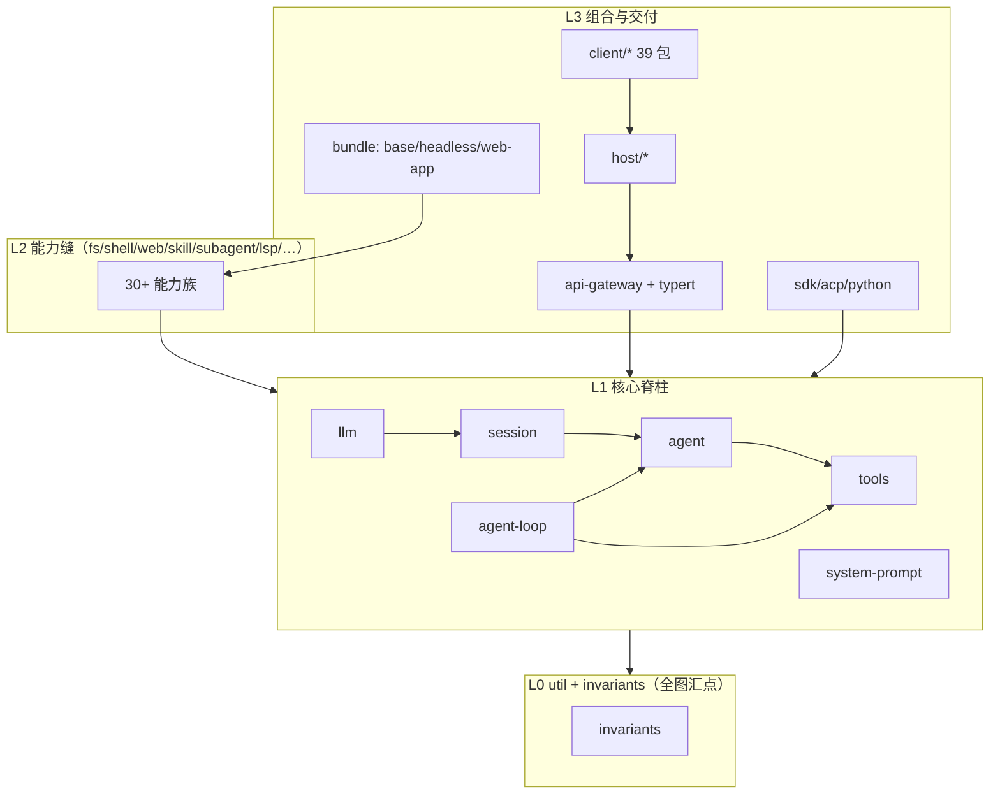

# 01 · 模块依赖图与工程全景（graphify 式综合分析）

> 数据源：仓库自带 graphify 工具链的生成物——`docs/module-graph.md`（`pnpm run gen-module-graph`）、`docs/capability-seams.md` / `docs/event-producer-consumer.md` / 各 `composition.md`（`pnpm run gen-doc-graphs`）、`docs/architecture.md`，加上对 219 个 `package.json` 的 `peerDependencies` 统计。
> 上游 HEAD `47f943859b`（2026-08-13）；生成文档由 CI 新鲜度门禁（`verify-module-graph` / `verify-doc-graphs`）锁定与源码同步。
> 分析快照原稿：`PROJECT-ANALYSIS.md`（本次合并后已并入本笔记）。

## 1. graphify 工具链本身

dsh 不用外部图工具，仓库自带"生成 + 校验"成对脚本（`package.json:103-125`）：

| 生成物 | 生成器 | 模式 |
|---|---|---|
| `docs/module-graph.md`（包依赖图，Mermaid + 表） | `gen-module-graph` | generated |
| `docs/tool-catalog.md`（工具 schema 目录） | `gen-tool-catalog` | generated |
| `docs/config-catalog.md` / `persistence-catalog.md` / cordis-api / client-catalog | 各 `gen-*` | generated |
| `docs/capability-seams.md`（能力缝图） | `gen-doc-graphs` | hybrid generated |
| `docs/event-producer-consumer.md`（事件生产/消费矩阵） | `gen-doc-graphs` | hybrid generated |
| `apps/cli/composition.md`、`examples/*/composition.md`（应用组合图） | `gen-doc-graphs` | hybrid generated |
| `docs/agent-lifecycle.md`、`tool-execution-pipeline.md` | 人工维护 | curated |

枚举性事实（依赖边、ctx 键、工具 schema）全部从源码推导；hybrid 图补充策略清单；流程解释图人工维护。索引页是 `docs/graph-atlas.md`。

## 2. 规模统计：219 包 / 50 组

对 `packages/*/*/package.json` 直接统计（`Get-ChildItem packages\*\*\package.json`）：

| 组 | 包数 | 职责 |
|---|---|---|
| client/ | 39 | Web-GUI 浏览器半边：shell、wire、object services、slots、`ui-*` 插件 |
| session/ | 13 | 持久化缝 + JSONL/SQLite 后端、投影、标题、遥测 |
| subagent/ | 11 | 子代理缝：in-process fork/spawn、ACP、Claude Code、Codex、dsh-SDK provider + 委派工具 |
| shell/ | 9 | Bash/Pwsh 能力族：执行缝、本地/沙箱实现、模型面向工具 |
| core/ | 8 | 产品 API 脊柱：session、system-prompt、tools、agent、agent-loop、scope |
| host/ | 8 | Web-GUI 宿主半边：api-gateway + webserver + 静态前端 |
| fs/ | 7 | 文件系统能力族 + 文件工具 + bash 后端搜索工具 |
| util/ | 7 | 零依赖底层（`Branded<B>`、home 路径、timeout、retention） |
| test-support/ | 6 | testkits、invariants、replay、Loader smoke |
| web/ | 6 | 搜索/fetch provider（DeepSeek/Exa/Perplexity）+ 工具 |

其余 40 组：llm(5)、interaction(5)、typert/goal/workflow/sandbox/compaction/skill/extensions/storage/session-query/context 各 4，hooks/e2b/jobs/examples/bundle/sdk/terminal/lsp/spill 各 3，guard/preset/feedback/credentials/boot/api/attachment/settings/code-runtime/subprocess 各 2，todo/workspace/mcp/acp/identity/schedule/plan/runtime-diagnostics 各 1。

## 3. 依赖方向规律（module-graph.md 全图 800+ 边的浓缩）

- **`runtime-diagnostics/invariants` 是全图汇点**：几乎每个包依赖它。每包拥有 `./invariant` 清单，注册后由 `verify-package-invariants` + 运行时断言强制"包拥有自己的事件/数据关系不变量"——这是全仓唯一被所有包共享的依赖。
- **单向四层，无环**：`util`（brand/timeout/atomic-write/…）→ 核心脊柱（`llm` → `session`/`scope`/`system-prompt` → `agent` → `tools`/`agent-loop`）→ 能力缝（fs/shell/web/skill/subagent/lsp/…，只依赖脊柱不互相依赖）→ 组合与交付（bundle/api-gateway/host/client/acp/sdk）。
- **扩展插件只依赖 Service Definition，绝不依赖具体 provider**（`packages/README.md:67`）：UI/hook/工具插件用 `dsh-agent` 而非 `dsh-agent-loop`；loop 本身可替换。这条规则是图上可验证的拓扑约束，不是口头约定。
- **client 39 包收敛于三件套**：`api-remotes` / `client-runtime` / `client-connection`，与 host 半边仅经 `host-webserver` 对接——浏览器/宿主两个半边在依赖图上完全解耦。
- **双 provider 族呈对称结构**：`llm-deepseek` 与 `llm-pi-ai` 的依赖集几乎相同（credentials/launch-environment/settings/timeout），`bash-local/sandbox` 与 `pwsh-local/sandbox` 对称——AGENTS.md 的"parallel values 保持对称"规则在图上可见。



## 4. 能力缝图的关键拓扑（capability-seams.md 节选）

一缝三角色在图上的形态：声明包指向 `ctx.<key>` 服务节点，provider 包与 consumer 包分别挂靠。同世界 provider 共享下游：

| ctx 键 | 声明包 | provider 家族（节选） |
|---|---|---|
| `ctx.subprocess` | subprocess | local、e2b |
| `ctx.fs` | fs | local、sandbox、e2b |
| `ctx.sandbox` | sandbox | local（bwrap/Landlock/Seatbelt）、windows-acl |
| `ctx.sessionPersistence` | session | JSONL、SQLite |
| `ctx.storage` | storage | JSON、SQLite、domain |
| `ctx.llm` | llm | DeepSeek、pi-ai、replay（测试） |
| `ctx.subagents` | subagent | in-process fork/spawn、ACP、Claude Code、Codex、dsh-SDK |

`e2b` 是"换一个 provider = 换整个执行世界"的直接证据：`fs-e2b` 与 `subprocess-e2b` 同时指向 `ctx.e2b` 生命周期 owner，Bash/PTY/LSP 零改动迁移（详见 [02-capability-seams/01](../02-capability-seams/01-接缝模式与能力矩阵.md)）。

## 5. 工程质量体系（图的"保鲜"机制）

生成图与目录之所以可信，是因为整条链是机器闭环：

- **成对 gen/verify**：每个 `gen-*` 都有 `--check` 版本进 CI；手改生成区直接红。
- **CI 门禁**（`scripts/run-gates.ts`）：per-file 100% 覆盖率（`test:coverage`）、keyless 快照回放、真实 API e2e（无 key 自跳过）、hygiene（knip+publint+workspace 约束+NodeNext）、doc-sync、oxlint、jscpd 重复检测、Windows 三级门禁（blocking/complete/observational）。
- **文档分层治理**：AGENTS.md（命令）→ architecture.md（地图 ≤1800 词，词数门禁 `verify-doc-budgets`）→ subsystems/（类型+生成 API 区）→ cookbook（步骤）→ Agent Notes（决策记录）→ postmortem（事故）。一词一处、`verify-md-links` 机器校验链接、双语 pairing 工作流。
- **每包硬性契约**：`./invariant` 清单、README Model Experience 格式与 `## Known Limitations`、HMR 安全销毁测试、REAL 组合测试（经 Loader 启动真实 cordis.yml，mock 仅限外部服务）。

## 6. 综合评估

- **优势**：三角色齐备才算缝的纪律；单一事实源日志 + "Model-visible ⟺ logged" 运行时断言；文档/图全部生成且门禁锁新鲜，219 包在四层单向结构下无循环依赖趋势。
- **风险**：developer preview 无兼容承诺（重构自由 > 兼容）；`client` 组 39 包是最大单体面，UI 迭代集中度高；e2b 仍标 POC；Windows 平台信号靠三级门禁维持。
- **可借鉴**：把"架构图"做成构建产物而非一次性文档，`gen-*`/`verify-*` 成对出现，是避免架构文档腐烂的可复制做法。

## 审计命令

```bash
$ cd /c/workspace/deepseek-harness
$ pnpm run gen-module-graph && git diff --stat docs/module-graph.md   # 重生成依赖图
$ (Get-ChildItem packages\*\*\package.json).Count                     # 219（PowerShell）
$ rg 'pkg_client_ui_conversation -->' docs/module-graph.md            # 验证 client 收敛边
```
