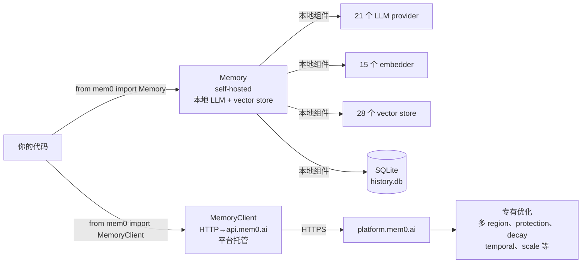
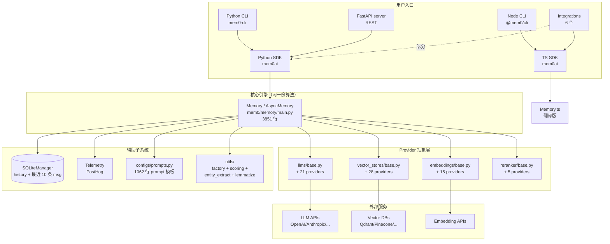
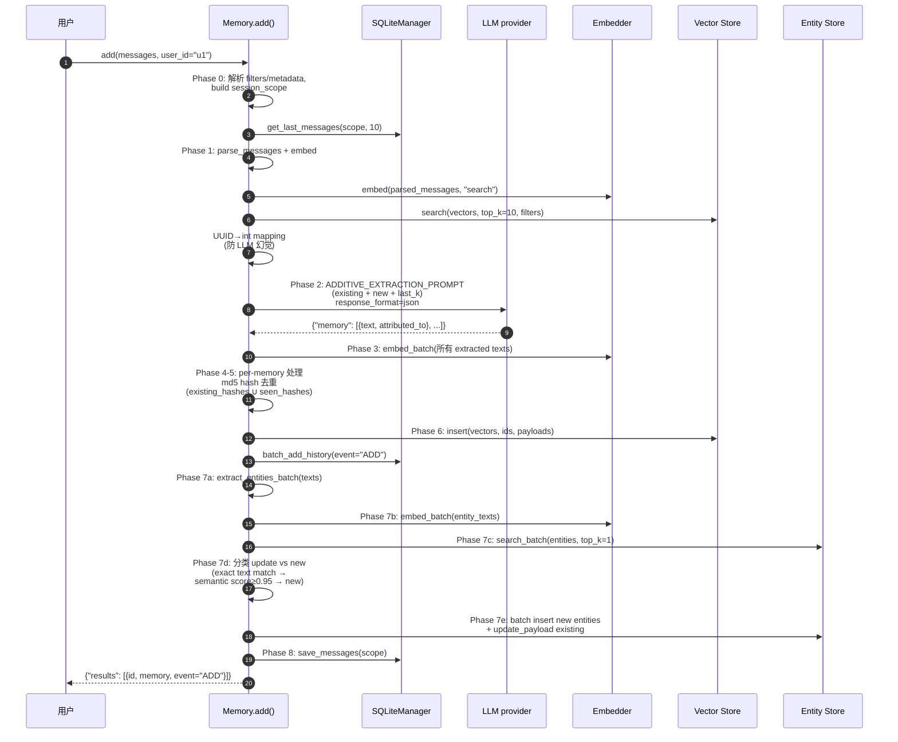

# 02 — 整体架构图与数据流

> 这是看 Mem0 源码的"地图"。读完本篇你会知道：① 两种使用模式的 API 表面是什么、② 一次 `add()` 从入口到 vector store 经过哪些阶段、③ 一次 `search()` 怎么融合多信号。
> 本篇是架构级总览；逐行精读见 [`01-py-sdk-core/06-add-pipeline.md`](../01-py-sdk-core/06-add-pipeline.md) 和 [`07-search-pipeline.md`](../01-py-sdk-core/07-search-pipeline.md)。

---

## 1. 双模式 API 表面（最重要的一张图）

Mem0 暴露给用户的 API 极窄——`mem0/__init__.py` 只有 **6 行**：

```python
# mem0/__init__.py（完整内容）
import importlib.metadata
__version__ = importlib.metadata.version("mem0ai")
from mem0.client.main import AsyncMemoryClient, MemoryClient     # hosted
from mem0.memory.main import AsyncMemory, Memory                  # self-hosted
```

两种模式的 API **几乎完全同构**（同一份方法名 + 签名）：



| 维度 | `Memory`（OSS） | `MemoryClient`（Hosted） |
|------|---------------|------------------------|
| 入口 | `from mem0 import Memory` | `from mem0 import MemoryClient` |
| 组件在哪 | 本地（你选） | Mem0 平台 |
| 配置 | `MemoryConfig` (Pydantic) | API key + 项目 ID |
| 功能 | 核心算法 + entity linking + BM25 | 全部 OSS 功能 + decay/temporal/scale/protection |
| 计费 | 免费（自己付 LLM/vector 费） | 平台计费 |
| 数据 | 你的基础设施 | Mem0 托管 |

> **设计精髓**：API 同构意味着你可以**先在 OSS 模式开发**，再无改切到 Hosted 模式上线。两种模式的方法签名（`add`/`search`/`get`/`get_all`/`update`/`delete`/`delete_all`/`history`）一致。

详见 [`05-two-modes.md`](./05-two-modes.md)。

---

## 2. April 2026 新算法 vs 旧算法（必读）

`README.md` 标注 "New Memory Algorithm (April 2026)"——这是当前 `main` 分支的基线，**和老教程/老 issue 描述差别很大**。

| 旧算法（≤ v1.0） | 新算法（v1.1+, April 2026） |
|----------------|--------------------------|
| ADD/UPDATE/DELETE 三阶段（多 LLM 调用） | **Single-pass ADD-only**（一次 LLM 调用） |
| 只靠 vector 相似度 | semantic + BM25 keyword + entity 三信号融合 |
| 无实体概念 | **Entity linking**：从 memory 抽实体、独立 collection 存、`linked_memory_ids` 关联 |
| 独立 graph memory 模块（Neo4j/Memgraph/Kuzu/AGE） | **graph memory 已移除**！entity_store 替代（复用 vector store） |
| 无时间感知 | **Temporal reasoning**（但 OSS 版报错——仅 Platform 提供） |
| 无衰减 | **Decay**（同上，仅 Platform） |

### ⚠️ 一个重要发现

`AGENTS.md` 仍然写着 "Graph Stores 4: Neo4j/Memgraph/Kuzu/Apache AGE"——这是**过时信息**：

```bash
# 实际验证
$ ls mem0/graphs/
ls: 无法访问 'mem0/graphs/': 没有那个文件或目录

$ grep -rn "from mem0.graphs" mem0/
# (空)
```

`mem0/exceptions.py` 留下一段错误提示（"Please install kuzu"），但实际代码里不再 import 任何 graph 模块。April 2026 重构把 graph 思路内化到了"entity_store"——一个**复用 vector store provider 的轻量实体层**（用 `<collection>_entities` 或 `<collection>-entities` 命名的独立 collection）。

> 📌 如果你看到老博客/老 issue 提 graph memory，记得它已经不在 OSS 里了。AGENTS.md 的对应章节需要更新。

---

## 3. 整体分层架构



---

## 4. ⭐ `add()` 全链路（最核心）

`Memory.add()` (`mem0/memory/main.py` L755–L1202) 是整个 Mem0 最复杂的单个方法，**8 个阶段**：



### 关键设计要点

| 阶段 | 关键设计 | 为什么 |
|------|---------|-------|
| Phase 1 UUID→int | 把 vector store 返回的 UUID 映射成 `"0", "1", "2"` 再喂给 LLM | 防 LLM 编造不存在的 ID；LLM 看到 "0"/"1" 知道是引用 |
| Phase 2 single call | 整个抽取在 1 次 LLM 调用内完成（旧算法 3 次） | 减少延迟和 token 成本，benchmark 提升 21+ 点 |
| Phase 5 hash dedup | md5(text) 去重，对 `existing_hashes ∪ seen_hashes` | 同 batch 内 + 跨 batch 防重复 |
| Phase 6 batch insert | 单次 `vector_store.insert(...)` + 失败回退单条 | 性能；失败容错 |
| Phase 7a global dedup | 跨 memory 收集 unique entity 再批处理 | 避免 N 次 entity search（O(N²)→O(N)） |
| Phase 7d 0.95 threshold | exact text → semantic score≥0.95 → new | entity 软合并阈值 |
| Phase 7 entity 失败 | 所有 entity 失败都 warning/debug 不抛 | 主流程（memory 入库）不被 entity cleanup 拖崩 |
| ADD-only | 没有 UPDATE/DELETE phase | 新算法核心——memory 累积式 |

> 详见 [`01-py-sdk-core/06-add-pipeline.md`](../01-py-sdk-core/06-add-pipeline.md)。

---

## 5. ⭐ `search()` 多信号融合

`Memory.search()` (L1374–L1818) + `_search_vector_store()` (L1623+) 的核心是**三信号融合检索**：

```mermaid
graph TB
    Q[用户 query]
    Q --> L[lemmatize_for_bm25<br/>spaCy lemmatize]
    Q --> E[extract_entities<br/>抽取 query 里的实体]
    Q --> V[embed<br/>向量化]

    V --> SS[Semantic Search<br/>vector_store.search<br/>top_k = max(k*4, 60)]
    L --> KS[Keyword Search BM25<br/>vector_store.keyword_search<br/>top_k = max(k*4, 60)]
    E --> EB[Entity Boost<br/>查 entity_store<br/>拿 linked_memory_ids]

    SS --> Pool[候选池]
    KS --> Pool
    EB --> Pool

    Pool --> Score[score_and_rank<br/>normalize_bm25<br/>+ entity_boost<br/>+ semantic_score]
    Score --> Filter[threshold 过滤<br/>+ show_expired 过滤]
    Filter --> Sort[排序 + 截 top_k]

    Sort --> RR{rerank?}
    RR -->|是 + reranker 配置| Rerank[self.reranker.rerank]
    RR -->|否| Out
    Rerank --> Out[返回 results]
```

### 关键参数

| 参数 | 默认 | 含义 |
|------|------|------|
| `top_k` | 20 | 用户要的结果数（最终返回 ≤top_k） |
| `internal_limit` | `max(top_k*4, 60)` | over-fetch 池大小（给融合留余量） |
| `threshold` | 0.1 | 最低 score（<threshold 过滤掉） |
| `rerank` | False | 是否用独立 reranker（Cohere/HF 等）重排 |
| `explain` | False | 返回 `score_details`（debug 用） |
| `show_expired` | False | 是否包含 `expiration_date` 已过的 memory |

### 多信号权重

`mem0/utils/scoring.py` 定义融合公式（精读在 [`02-py-sdk-providers/08-utils.md`](../02-py-sdk-providers/08-utils.md)）：

```
final_score = w_semantic * semantic_score
            + w_bm25 * normalize_bm25(raw_bm25)
            + ENTITY_BOOST_WEIGHT * entity_boost
```

- BM25 必须先 `normalize_bm25` 因为不同 vector store 返回的 raw BM25 量级不同
- entity boost 是 binary（命中=1，否则=0）乘权重
- `get_bm25_params(query, lemmatized)` 动态调 midpoint/steepness（不是固定常数）

### BM25 fallback

如果选的 vector store **不支持** `keyword_search`（例如 FAISS、部分 hosted）：

```python
# main.py L538-L545
if getattr(type(self.vector_store), "keyword_search", None) is VectorStoreBase.keyword_search:
    logger.warning(
        "The '%s' vector store does not support keyword search. "
        "Hybrid (BM25) scoring will be disabled and search will use "
        "semantic similarity only. ..."
    )
```

→ 自动降级到纯 semantic。

---

## 6. April 2026 算法的"仅 Platform"特性

OSS 用户用某些参数会**直接报错**——这是有意为之的设计，不是 bug：

| 特性 | 触发 | OSS 行为 |
|------|------|---------|
| `timestamp` (add) | `add(..., timestamp=...)` | `raise ValueError(get_temporal_feature_error_message(...))` |
| `reference_date` (search) | `search(..., reference_date=...)` | 同上 |
| `decay` | `project.update(decay=True)` | 同上 |
| 某些 metadata key | `detect_temporal_usage_from_metadata()` | 不报错但显示 upgrade notice |

`mem0/memory/notices.py`（1582 行！）实现了大量这种 notice——first-run / scale-threshold / slow-query / temporal-usage / decay-usage 等。OSS 用户**碰到了会看到友好的引导提示**而不是直接拒绝。

> 这是个很好的产品决策：API 同构但功能差异透明，让用户清楚"升级到 Platform 能解锁什么"。

---

## 7. Provider 注册与扩展机制

Mem0 的"可插拔"靠 `mem0/utils/factory.py` 的 4 个 Factory 类（详见 [`02-py-sdk-providers/07-factory.md`](../02-py-sdk-providers/07-factory.md)）：

```python
# 简化示例
class LlmFactory:
    provider_to_class = {
        "openai": ("mem0.llms.openai.OpenAILLM", OpenAIConfig),
        "anthropic": ("mem0.llms.anthropic.AnthropicLLM", AnthropicConfig),
        # ... 21 个
    }

    @classmethod
    def create(cls, provider_name, config, **kwargs):
        class_type, config_class = cls.provider_to_class[provider_name]
        llm_class = load_class(class_type)  # importlib.import_module(...) 动态加载
        # ... config 处理
        return llm_class(config)

    @classmethod
    def register_provider(cls, name, class_path, config_class=None):
        """运行时注册第三方 provider —— 扩展点！"""
        cls.provider_to_class[name] = (class_path, config_class or BaseLlmConfig)
```

**关键设计**：
- `importlib.import_module` **懒加载**——你不用的 provider 永远不会被 import，启动快、依赖少
- `register_provider()` 提供**运行时扩展点**——第三方包可以注册自定义 provider
- 4 个 Factory（LLM/Embedder/VectorStore/Reranker）模式完全一致

---

## 8. 数据持久化层（三处）

| 数据 | 存哪 | 谁管 |
|------|------|------|
| 记忆内容（vector + payload） | Vector store | `vector_store` 实例 |
| 实体（vector + linked_memory_ids） | Vector store（独立 collection） | `entity_store` 实例（懒加载） |
| 变更历史（ADD/VAR/DELETE event） | SQLite `history` 表 | `SQLiteManager` |
| 最近会话消息（最多 10 条/session） | SQLite `messages` 表 | `SQLiteManager` |
| 项目配置 | `~/.mem0/config.json` | `setup_config()` |

> 记忆**不**存在 SQLite——SQLite 只存"变更日志"和"最近会话上下文"。实际记忆数据存在 vector store。这是 Mem0 的关键设计：**vector store 是真相之源，SQLite 是辅助**。

---

## 9. 关键架构决策一览（trade-off 总结）

| 决策 | 选择 | 替代方案 | 为什么这么选 |
|------|------|---------|------------|
| API 同构（OSS vs Hosted） | 同一份方法签名 | 不同 SDK 不同 API | 用户可无改切换；维护一份文档 |
| Provider 抽象 | 5 类 base + Factory + 懒加载 | 全量 import | 启动快、依赖少、易扩展 |
| 抽取算法 | Single-pass ADD-only | 多阶段 ADD/UPDATE/DELETE | benchmark +21 点、延迟和 token 减半 |
| Graph memory | 移除（v1.1+） | Neo4j 等独立模块 | entity_store 复用 vector store，依赖更少 |
| 多信号检索 | semantic+BM25+entity 融合 | 仅 semantic | 关键词召回 + 实体加权提升精准度 |
| Over-fetch | top_k*4 vs 60 max | 严格 top_k | 给融合留候选池 |
| Lazy init | entity_store 懒加载 | 启动即建 | 不用 entity 的用户零成本 |
| Hash dedup | md5(text) | LLM 判断 | O(1) 快；不消耗 LLM |
| Identity scope 隔离 | entity params 走 filters | 顶层 kwarg | 防 metadata 注入安全风险（#6655） |

---

## 10. 接下来

| 想看 | 去哪 |
|------|------|
| Memory 类逐行精读 | [`01-py-sdk-core/02-memory-main.md`](../01-py-sdk-core/02-memory-main.md) |
| add() 8 阶段逐阶段精读 | [`01-py-sdk-core/06-add-pipeline.md`](../01-py-sdk-core/06-add-pipeline.md) |
| search() 多信号融合公式 | [`01-py-sdk-core/07-search-pipeline.md`](../01-py-sdk-core/07-search-pipeline.md) |
| Provider 抽象的统一模式 | [`02-py-sdk-providers/01-base-pattern.md`](../02-py-sdk-providers/01-base-pattern.md) |
| Hosted client 怎么发请求 | [`03-py-sdk-client/01-client.md`](../03-py-sdk-client/01-client.md) |
| Server 怎么把 SDK 包成 REST | [`05-server/01-architecture.md`](../05-server/01-architecture.md) |

---

📌 **下一步** → [`03-build-system.md`](./03-build-system.md) Hatch + pnpm + tsup + Docker 构建链。
