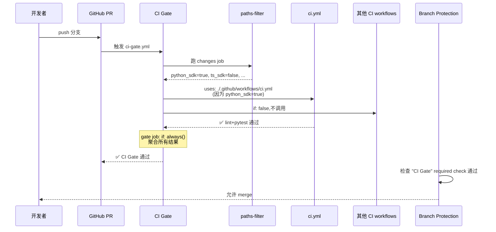
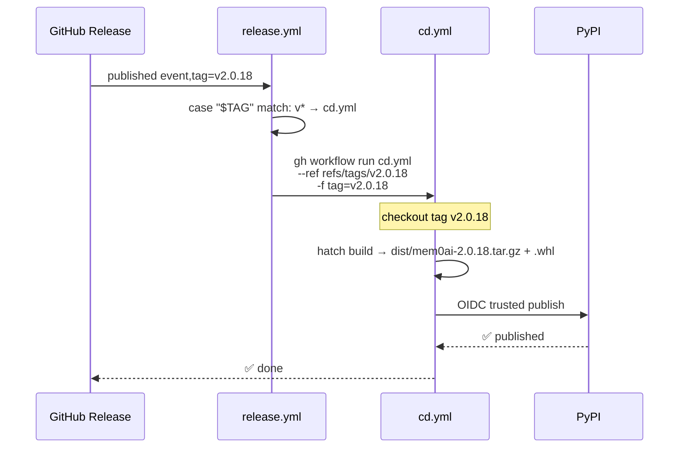

# 04 — CI/CD（CI Gate 单入口编排 + Release Router 单入口发布）

> Mem0 的 CI/CD 是**单仓库 26 个 workflow 文件**的复杂体系，但有两条非常清晰的"单入口"主线:
> - **CI Gate** (`ci-gate.yml`) — 所有 PR 的唯一必过检查
> - **Release Router** (`release.yml`) — 所有发布的唯一分发器
>
> 本篇基于真实 workflow 文件源码逐段讲解,而不是泛泛介绍。

---

## 1. CI/CD 工作流全清单（26 个）

按角色分组：

### CI（PR 测试）— 12 个

| Workflow | 文件 | 跑什么 |
|----------|------|--------|
| **CI Gate** ⭐ | `ci-gate.yml` | 编排所有下面 workflow,聚合结果 |
| Python SDK | `ci.yml` | Ruff lint + pytest (Python 3.10/3.11/3.12) |
| TS SDK | `ts-sdk-ci.yml` | Prettier + tsup build + jest (Node 20/22) |
| Python CLI | `cli-python-ci.yml` | Ruff lint + pytest + hatch build (3.10–3.12) |
| Node CLI | `cli-node-ci.yml` | Biome + tsc + vitest + tsup (Node 20/22) |
| OpenClaw | `openclaw-checks.yml` | tsc + vitest (含 Codecov) + tsup (Node 20/22) |
| Mem0 Plugin | `mem0-plugin-checks.yml` | pytest + hook entry-point + JSON manifest (3.10–3.12) |
| OpenCode Plugin | `opencode-plugin-checks.yml` | Bun: tsc + build + dist artifact |
| Pi Agent Plugin | `pi-agent-plugin-checks.yml` | tsc + vitest + tsup (Node 20/22) |
| n8n Node | `n8n-nodes-mem0-checks.yml` | ESLint (n8n-rules) + tsc (Node 20) |
| Zapier App | `zapier-mem0-checks.yml` | tsc + `zapier validate` + offline tests (Node 22) |
| docs llms.txt | `docs-llms-txt-check.yml` | `docs/llms.txt` 同步检查 |

### CD（发布）— 11 个

| Workflow | 文件 | Tag 前缀 | 目标注册表 |
|----------|------|---------|----------|
| **Release Router** ⭐ | `release.yml` | (所有) | 分发到下面匹配的 |
| Python SDK | `cd.yml` | `v*` | PyPI (`mem0ai`) |
| TS SDK | `ts-sdk-cd.yml` | `ts-v*` | npm (`mem0ai`) |
| Python CLI | `cli-python-cd.yml` | `cli-v*` | PyPI (`mem0-cli`) |
| Node CLI | `cli-node-cd.yml` | `cli-node-v*` | npm (`@mem0/cli`) |
| Vercel AI SDK | `vercel-ai-cd.yml` | `vercel-ai-v*` | npm (`@mem0/vercel-ai-provider`) |
| OpenClaw | `openclaw-cd.yml` | `openclaw-v*` | npm (`@mem0/openclaw-mem0`) |
| OpenCode Plugin | `opencode-plugin-cd.yml` | `opencode-v*` | npm (`@mem0/opencode-plugin`) |
| Pi Agent Plugin | `pi-agent-plugin-cd.yml` | `pi-agent-v*` | npm (`@mem0/pi-agent-plugin`) |
| n8n Node | `n8n-nodes-mem0-cd.yml` | `n8n-nodes-mem0-v*` | npm (`@mem0/n8n-nodes-mem0`) |
| Zapier App | `zapier-mem0-cd.yml` | — | Zapier 平台（不在 release router） |

### 工具 — 3 个

| Workflow | 文件 | 用途 |
|----------|------|------|
| Issue Labeler | `issue-labeler.yml` | issue 自动打标签 |
| PR Labeler | `pr-labeler.yml` | PR 路径标签 + 从关联 issue 传递标签 |
| Stale Bot | `stale.yml` | 标记过期 issue/PR |

---

## 2. ⭐ CI Gate 设计（核心创新）

### 2.1 要解决的问题

GitHub branch protection 有个**经典痛点**：

> 如果你把 `Python SDK CI` 设为 required check，那当 PR 只改 `mem0-ts/` 时，`Python SDK CI` 不会跑（路径过滤），结果 required check 永远挂在 "Expected" 状态，PR **无法合并**。

### 2.2 CI Gate 的解法

`ci-gate.yml` 关键代码：

```yaml
name: CI Gate
on:
  pull_request:    # 只在 PR 触发

concurrency:
  group: ci-gate-${{ github.event.pull_request.number }}
  cancel-in-progress: true   # 同 PR 新 push 取消旧 run

jobs:
  # ① 检测每个包是否变动
  changes:
    name: Detect changed packages
    runs-on: ubuntu-latest
    outputs:
      python_sdk: ${{ steps.filter.outputs.python_sdk }}
      # ... 每个包一个 output
    steps:
      - uses: dorny/paths-filter@v3
        id: filter
        with:
          filters: |
            python_sdk:
              - 'mem0/**'
              - 'tests/**'
              - 'pyproject.toml'
              - '.github/workflows/ci.yml'
              - '.github/workflows/ci-gate.yml'   # 改 gate 自己也触发
            ts_sdk:
              - 'mem0-ts/**'
              - '.github/workflows/ts-sdk-ci.yml'
              - '.github/workflows/ci-gate.yml'
            # ... 11 个包

  # ② 每个包一个 conditional call job
  python-sdk:
    name: Python SDK
    needs: changes
    if: needs.changes.outputs.python_sdk == 'true'
    uses: ./.github/workflows/ci.yml     # reusable workflow
    secrets: inherit

  ts-sdk:
    name: TypeScript SDK
    needs: changes
    if: needs.changes.outputs.ts_sdk == 'true'
    uses: ./.github/workflows/ts-sdk-ci.yml
    secrets: inherit

  # ... 每个包一个

  # ③ 最终聚合 job
  gate:
    name: CI Gate
    needs:
      - changes
      - python-sdk
      - ts-sdk
      - cli-python
      - cli-node
      - openclaw
      - mem0-plugin
      - opencode-plugin
      - pi-agent-plugin
      - n8n-nodes-mem0
      - zapier-mem0
      - docs-llms-txt
    if: always()                    # ← 关键！always 跑,即使一些 skip
    runs-on: ubuntu-latest
    steps:
      - name: Evaluate pipeline results
        env:
          NEEDS: ${{ toJSON(needs) }}
        run: |
          echo "$NEEDS" | jq -r 'to_entries[] | "\(.key): \(.value.result)"'
          failed=$(echo "$NEEDS" | jq -r \
            '[to_entries[] | select(.value.result == "failure" or .value.result == "cancelled") | .key] | join(", ")')
          if [ -n "$failed" ]; then
            echo "::error::Failing pipelines: $failed"
            exit 1
          fi
          echo "All pipelines relevant to this change passed."
```

### 2.3 关键设计点

| 设计 | 为什么 |
|------|-------|
| 单一 `pull_request` 触发 | 不让各包 workflow 自己监听 PR |
| `dorny/paths-filter@v3` | 业界标准的 path 过滤 action |
| `if: needs.changes.outputs.X == 'true'` | 只在变动时才调用对应 workflow |
| `uses: ./.github/workflows/X.yml` | reusable workflow 调用,代码不重复 |
| `secrets: inherit` | 不用每个 workflow 配 secret |
| `gate` job `if: always()` | 必须强制跑,即使一些 skip |
| jq 过滤 failure/cancelled | skipped 算 pass,failure/cancelled 才算 fail |
| branch protection 只需 `CI Gate` 一个 required | 解决"path-filtered required check 永远 Expected"痛点 |
| concurrency `cancel-in-progress: true` | 同 PR 新 push 取消旧 run,省 CI 配额 |

### 2.4 添加新包的步骤

`ci-gate.yml` 注释明确写了：

> To wire in a new package:
> 1. 在 `changes` job 的 filter 里加一个新 output
> 2. 写一个 call job `uses:` 对应的新 workflow
> 3. 在 `gate` job 的 `needs:` 列表加这个 call job

---

## 3. ⭐ Release Router 设计

### 3.1 要解决的问题

GitHub `release: published` 事件会触发所有监听它的 workflow。如果 11 个 CD workflow 都监听：
- 一次 Python SDK 发版 → 触发 11 个 workflow → 1 个真跑,10 个 skip
- waste runner minutes + 难追踪

### 3.2 Release Router 的解法

`release.yml` 关键代码：

```yaml
name: Release Router 🚦
on:
  release:
    types: [published]

permissions:
  actions: write    # 需要 dispatch 权限

jobs:
  route:
    name: Route ${{ github.event.release.tag_name }} to its CD pipeline
    runs-on: ubuntu-latest
    steps:
      - name: Match tag prefix to CD workflow
        id: match
        env:
          TAG: ${{ github.event.release.tag_name }}
        run: |
          # Specific package prefixes first; the bare v* (Python SDK) arm
          # must stay last so prefixed tags that also start with 'v'
          # (vercel-ai-v*) can never be routed to the Python pipeline.
          case "$TAG" in
            ts-v*)                  workflow="ts-sdk-cd.yml" ;;
            cli-node-v*)            workflow="cli-node-cd.yml" ;;
            cli-v*)                 workflow="cli-python-cd.yml" ;;
            vercel-ai-v*)           workflow="vercel-ai-cd.yml" ;;
            openclaw-v*)            workflow="openclaw-cd.yml" ;;
            opencode-v*)            workflow="opencode-plugin-cd.yml" ;;
            pi-agent-v*)            workflow="pi-agent-plugin-cd.yml" ;;
            n8n-nodes-mem0-v*)      workflow="n8n-nodes-mem0-cd.yml" ;;
            v*)                     workflow="cd.yml" ;;    # ← 必须最后
            *)
              echo "::error::Release tag '$TAG' does not match any known package prefix"
              exit 1
              ;;
          esac
          echo "workflow=$workflow" >> "$GITHUB_OUTPUT"

      - name: Dispatch ${{ steps.match.outputs.workflow }}
        env:
          GH_TOKEN: ${{ secrets.GITHUB_TOKEN }}
          TAG: ${{ github.event.release.tag_name }}
        run: |
          gh workflow run "${{ steps.match.outputs.workflow }}" \
            --repo "$GITHUB_REPOSITORY" \
            --ref "refs/tags/$TAG" \
            -f tag="$TAG" \
            -f prerelease="${{ github.event.release.prerelease }}"
```

### 3.3 关键设计点

| 设计 | 为什么 |
|------|-------|
| 单一 `release: published` 触发 | 所有 CD 不直接监听 release |
| bash `case` 匹配 prefix | 简单、可读、无依赖 |
| `bare v* arm 最后` | `vercel-ai-v*` 也以 v 开头,必须先匹配长前缀 |
| `--ref refs/tags/$TAG` | 跑那个 tag 当时的 workflow 版本,不是 main 的 |
| `workflow_dispatch` + inputs | CD workflow 自己不再监听 release,只接受 dispatch |
| `tag`/`prerelease` 输入 | 让 CD workflow 知道发什么版本 |
| 不识别的 tag → exit 1 | fail fast,避免静默丢失发版 |
| Zapier 不在 router | 它部署到 Zapier 平台不是 npm,需 `ZAPIER_DEPLOY_KEY` secret,单独手动 dispatch |

### 3.4 OIDC Trusted Publishing（无 secret 发布）

所有 CD 用 **OIDC trusted publishing**——不需要存 npm token / PyPI token 在 GitHub Secrets：

```yaml
# 各 CD workflow 里 (示意)
permissions:
  id-token: write   # OIDC

# 然后 PyPI/npm 配置信任 GitHub Actions 的 OIDC token
```

- PyPI: 在 https://pypi.org/manage/account/publishing/ 配置 trusted publisher
- npm: 用 `npm publish --provenance`,npm 自动验证 OIDC

**第一次发新包**必须手动（OIDC 还没配）；后续版本可自动。

### 3.5 重新发版的正确做法（重要）

如果 release 已经 published 但 registry 配错了要重发,**不要**删除重建 release（router 会再跑但可能出问题）。正确做法：

```bash
gh workflow run <package>-cd.yml --ref refs/tags/<tag> -f tag=<tag>
```

直接手动 dispatch CD workflow。

---

## 4. 一个 PR 的完整 CI 流程

假设 PR 改了 `mem0/memory/main.py`：



---

## 5. 一个 release 的完整流程

假设发 Python SDK `v2.0.18`：



---

## 6. 各 workflow 的路径触发（重要）

CI Gate 用 `dorny/paths-filter` 给每个包定义了"什么变动才算本包变了"。**改这些路径会触发对应 CI**：

| 包 | 触发路径 |
|----|---------|
| python_sdk | `mem0/**` `tests/**` `pyproject.toml` `ci.yml` `ci-gate.yml` |
| ts_sdk | `mem0-ts/**` `ts-sdk-ci.yml` `ci-gate.yml` |
| cli_python | `cli/python/**` `cli-python-ci.yml` `ci-gate.yml` |
| cli_node | `cli/node/**` `cli-node-ci.yml` `ci-gate.yml` |
| openclaw | `integrations/openclaw/**` `openclaw-checks.yml` `ci-gate.yml` |
| mem0_plugin | `integrations/mem0-plugin/**` **除** `.opencode-plugin/**` |
| opencode_plugin | `integrations/mem0-plugin/.opencode-plugin/**` |
| pi_agent_plugin | `integrations/pi-agent-plugin/**` |
| n8n_nodes_mem0 | `integrations/n8n-nodes-mem0/**` |
| zapier_mem0 | `integrations/zapier-mem0/**` |
| docs_llms_txt | `docs/**/*.mdx` `docs/llms.txt` `check-llms-txt-coverage.py` |

> **注意**：`mem0-plugin` 和 `opencode-plugin` 共享 `integrations/mem0-plugin/` 目录但通过 `.opencode-plugin/` 子目录**分离**触发。前者用 Python + hook，后者用 Bun + TypeScript。

---

## 7. 关键工程教训

### 教训 1：required check 必须单点

GitHub branch protection + path filter 是冲突的。**唯一解法**：用一个 always-run 的 gate job 聚合。

### 教训 2：发版路由用 case 比 matrix 强

很多项目用 matrix 跑 CD，但 matrix 没法做 prefix 匹配。bash `case` 简单直接。

### 教训 3：发版号用前缀避免冲突

`v1.0.0`（Python）/ `ts-v1.0.0`（TS）/ `cli-v1.0.0`（CLI）这种 prefix 看起来冗余，但让 router 简单可靠。

### 教训 4：workflow_dispatch + OIDC 是无 secret 关键

所有 CD 都是 `workflow_dispatch`-only + OIDC。GitHub 不存任何 registry token。

### 教训 5：路径触发要包含 workflow 文件本身

```yaml
python_sdk:
  - 'mem0/**'
  - 'tests/**'
  - 'pyproject.toml'
  - '.github/workflows/ci.yml'         # 改 CI 配置也触发
  - '.github/workflows/ci-gate.yml'    # 改 gate 也触发
```

否则改 workflow 配置但没改源码不会跑 CI。

---

## 8. 一个新包接入 CI/CD 的完整步骤

假设要加一个新集成 `integrations/foo/`：

1. 写 `integrations/foo/package.json`（pnpm workspace）+ 源码
2. 写 `.github/workflows/foo-checks.yml`（CI）：
   - `on: push` + `workflow_dispatch`（**不**要 `pull_request` 触发）
   - 加 `workflow_call`（让 ci-gate 能调它）
3. 写 `.github/workflows/foo-cd.yml`（CD）：
   - `on: workflow_dispatch` + inputs `tag`/`prerelease`
   - OIDC publish
4. 注册到 CI Gate：
   - `ci-gate.yml` 加 `changes.outputs.foo`
   - 加 `foo:` call job `uses: ./.github/workflows/foo-checks.yml`
   - 加到 `gate.needs` 列表
5. 注册到 Release Router：
   - `release.yml` 的 `case` 加 `foo-v*) workflow="foo-cd.yml" ;;`
6. （如果是编辑器插件）注册到 5 个 `marketplace.json`
7. 文档：写 `docs/integrations/foo.mdx` + 加 `docs/docs.json` + 加 `docs/llms.txt`
8. 更新 `AGENTS.md`（CI/CD 表 + Key Directories 表）

---

## 9. 接下来

| 想看 | 去哪 |
|------|------|
| 双模式（OSS vs Hosted）API 对比 | [`05-two-modes.md`](./05-two-modes.md) |
| Python SDK 核心引擎 | [`01-py-sdk-core/`](../01-py-sdk-core/) |
| Server 怎么实现 | [`05-server/`](../05-server/) |

---

📌 **下一步** → [`05-two-modes.md`](./05-two-modes.md) 双模式（OSS 自托管 vs Platform 托管）的 API 同构哲学。
