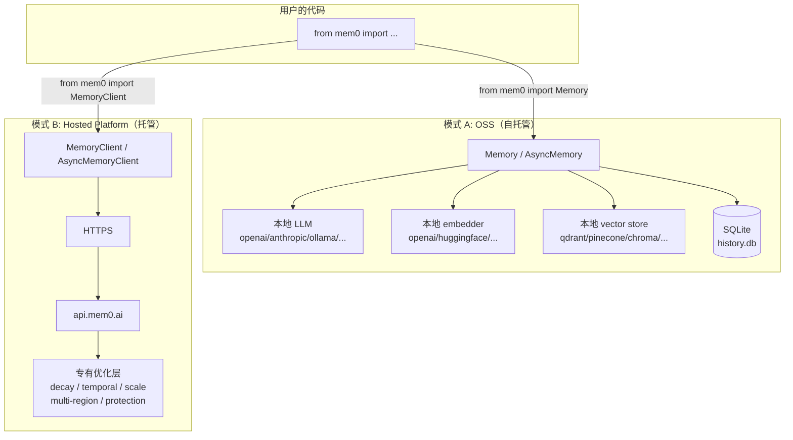
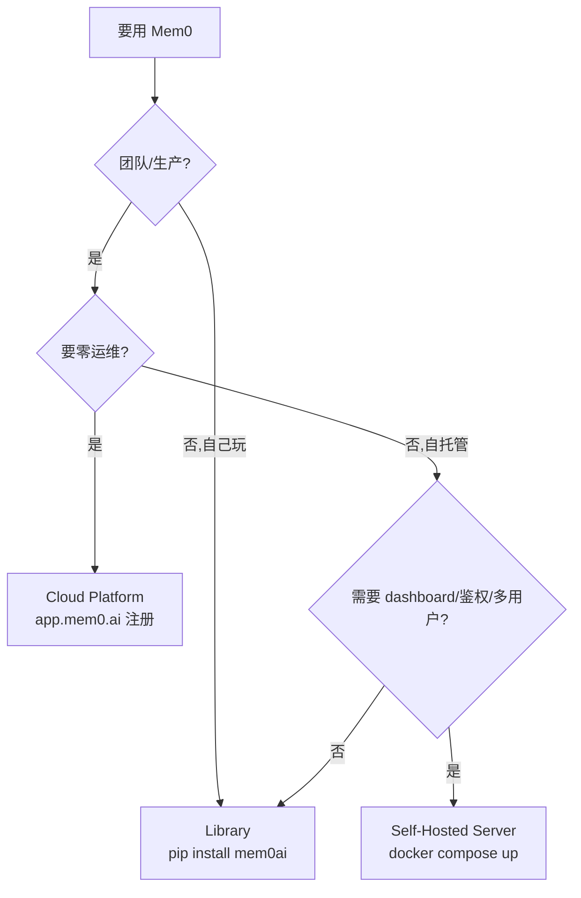

# 05 — 双模式（OSS 自托管 vs Platform 托管）

> Mem0 最关键的产品决策：**同一份 API 表面，两种运行模式**。
> 本篇对比两种模式的 API 同构、功能差异、切换路径,以及一些容易混淆的细节。

---

## 1. 两种模式速览



---

## 2. 入口类对比

| 维度 | `Memory` / `AsyncMemory` | `MemoryClient` / `AsyncMemoryClient` |
|------|--------------------------|------------------------------------|
| 模块 | `mem0.memory.main` | `mem0.client.main` |
| 配置 | `MemoryConfig` (Pydantic) | API key + host |
| 数据位置 | 你自己的 vector store + SQLite | Mem0 平台 |
| 算法位置 | 本地（你装的 mem0ai 版本） | Mem0 服务器（始终最新） |
| LLM | 你选 + 你付费 | 平台（含在计费里） |
| Embedding | 你选 + 你付费 | 平台 |
| Vector Store | 你选 + 你运维 | 平台托管 |
| 历史 | `~/.mem0/history.db` (SQLite) | 平台 |
| 网络依赖 | 仅调外部 LLM/embedding API | 必须 HTTPS 到 api.mem0.ai |

### 入口代码对比

```python
# === OSS 模式 ===
from mem0 import Memory

# 默认: OpenAI LLM + OpenAI embedding + Qdrant local + SQLite
m = Memory()

# 自定义配置
from mem0 import Memory
from mem0.configs.base import MemoryConfig
from mem0.llms.configs import AnthropicConfig
from mem0.vector_stores.configs import QdrantConfig

config = MemoryConfig(
    llm=AnthropicConfig(model="claude-3-5-sonnet"),
    vector_store=QdrantConfig(host="localhost", port=6333),
)
m = Memory(config=config)

m.add("I prefer dark mode", user_id="alice")
results = m.search("preferences", filters={"user_id": "alice"})
```

```python
# === Hosted 模式 ===
from mem0 import MemoryClient

# 默认 host = https://api.mem0.ai
m = MemoryClient(api_key="...")

# 也可用环境变量 MEM0_API_KEY
import os
os.environ["MEM0_API_KEY"] = "..."
m = MemoryClient()

m.add("I prefer dark mode", user_id="alice")
results = m.search("preferences", filters={"user_id": "alice"})
```

**API 完全一致**——除了 `Memory()` 接 config，`MemoryClient()` 接 api_key。

---

## 3. ⭐ API 同构的精度（方法签名对比）

两种模式的方法名、参数名几乎完全一致：

| 方法 | `Memory` (OSS) | `MemoryClient` (Hosted) |
|------|---------------|------------------------|
| `add(messages, *, user_id, agent_id, run_id, metadata, ...)` | ✅ | ✅ |
| `search(query, *, filters, top_k, threshold, rerank, ...)` | ✅ | ✅ |
| `get(memory_id)` | ✅ | ✅ |
| `get_all(*, user_id, agent_id, run_id, limit, ...)` | ✅ | ✅ |
| `update(memory_id, data)` | ✅ | ✅ |
| `delete(memory_id)` | ✅ | ✅ |
| `delete_all(*, user_id, agent_id, run_id)` | ✅ | ✅ |
| `history(memory_id)` | ✅ | ✅ |
| `project` (property) | `_OSSProject` (受限) | `Project` (完整) |

### 差异点

| 项 | OSS | Hosted |
|----|-----|--------|
| `add(timestamp=...)` | **报错**（仅 Platform） | ✅ |
| `search(reference_date=...)` | **报错** | ✅ |
| `project.update(decay=True)` | **报错** | ✅ |
| `project.update(custom_instructions=...)` | **报错**（OSS 用 `MemoryConfig.custom_instructions`） | ✅ |
| 进阶 metadata filter（AND/OR/NOT 操作符） | ✅（v1.1+） | ✅ |
| 多 region / 高可用 | ❌ | ✅ |
| 自动备份 | ❌ | ✅ |
| Protection / 滥用防护 | ❌ | ✅ |
| Scale tier（10M+ memory） | ❌ | ✅ |

> **设计原则**：参数签名一致,但 Platform-only 参数在 OSS 用会**抛 `ValueError` 友好提示**（不静默忽略）。详见 `mem0/memory/main.py` 的 `_PROJECT_UPDATE_UNSUPPORTED_ERROR` 和 `get_temporal_feature_error_message()`。

---

## 4. OSS 模式工作流（详）

### 4.1 启动时（`Memory.__init__`）

```python
# mem0/memory/main.py L482-L548 (简化)
class Memory(MemoryBase):
    def __init__(self, config: MemoryConfig = MemoryConfig()):
        self.config = config

        # 通过 4 个 Factory 创建组件
        self.embedding_model = EmbedderFactory.create(
            config.embedder.provider, config.embedder.config, config.vector_store.config
        )
        self.vector_store = VectorStoreFactory.create(
            config.vector_store.provider, config.vector_store.config
        )
        self.llm = LlmFactory.create(config.llm.provider, config.llm.config)
        self.db = SQLiteManager(config.history_db_path)
        self.reranker = RerankerFactory.create(...) if config.reranker else None

        # entity_store 懒加载（property）
        self._entity_store = None

        # 兼容性警告：vector store 不支持 keyword_search 时降级
        if getattr(type(self.vector_store), "keyword_search", None) is VectorStoreBase.keyword_search:
            logger.warning("BM25 disabled, semantic-only...")

        capture_event("mem0.init", ...)   # 遥测
```

### 4.2 运行时数据流

详见 [`02-architecture.md`](./02-architecture.md) 的 add()/search() 序列图。

### 4.3 数据持久化

| 数据 | 存哪 |
|------|------|
| 记忆内容（vector + payload） | vector_store |
| 实体（vector + linked_memory_ids） | entity_store（懒加载,同名 provider 不同 collection） |
| 变更历史 | SQLite `history` 表 |
| 最近会话消息（10 条/session） | SQLite `messages` 表 |
| 全局配置 | `~/.mem0/config.json` |

### 4.4 关键路径

```python
~/.mem0/                           # 默认根目录（$MEM0_DIR 可覆盖）
├── config.json                    # 全局配置
├── history.db                     # SQLite (history + messages 表)
└── migrations_qdrant/             # 遥测用的 qdrant 副本（如启用 + qdrant）
```

---

## 5. Hosted 模式工作流（详）

### 5.1 `MemoryClient.__init__`

```python
# mem0/client/main.py L95-L120 (简化)
class MemoryClient:
    def __init__(self, api_key=None, host=None, client=None):
        self.api_key = api_key or os.getenv("MEM0_API_KEY")
        self.host = host or "https://api.mem0.ai"
        self.org_id = None
        self.project_id = None
        self.user_id = get_user_id()
        # ... HTTP 客户端设置
```

> 没有组件实例化——一切发生在服务器。客户端只是 HTTP wrapper。

### 5.2 调用模式

`MemoryClient.add()` 实际是把参数 JSON 化发 POST：

```http
POST https://api.mem0.ai/vX/memories/
Authorization: Token <MEM0_API_KEY>
Content-Type: application/json

{
  "messages": [...],
  "user_id": "alice",
  "metadata": {...}
}
```

> 详见 `mem0/client/main.py`（1838 行），完整 HTTP wrapper 实现。

### 5.3 平台专有功能

| 功能 | 怎么用 | OSS 等价 |
|------|-------|---------|
| **Temporal reasoning** | `add(timestamp=...)` `search(reference_date=...)` | ❌ |
| **Decay**（衰减旧 memory） | `project.update(decay=True)` | ❌ |
| **Categories**（自定义分类） | `project.update(custom_categories=[...])` | ❌ |
| **Multilingual** | `project.update(multilingual=True)` | ❌ |
| **Custom instructions** | `project.update(custom_instructions="...")` | `MemoryConfig.custom_instructions` |
| **Scale tier** | 平台自动 | ❌ |
| **Protection**（数据保护/合规） | 平台层 | ❌ |

### 5.4 Mem0 vs OSS 性能差异（README 数据）

| Benchmark | OSS（旧算法） | Platform（新算法） | 提升 |
|-----------|------------|----------------|-----|
| LoCoMo | 71.4 | **92.5** | +21 |
| LongMemEval | 67.8 | **94.4** | +27 |
| BEAM 1M | — | **64.1** | — |
| BEAM 10M | — | **48.6** | — |

> README 原话："Scores reflect Mem0's managed platform, which includes proprietary optimizations not available in the open-source SDK; open-source users should expect directionally similar gains but not identical numbers."

---

## 6. ⭐ 切换路径（OSS → Hosted）

迁移代码改动**极小**：

```python
# Before (OSS)
from mem0 import Memory
m = Memory()
m.add("hello", user_id="alice")
results = m.search("hello", filters={"user_id": "alice"})

# After (Hosted)
from mem0 import MemoryClient
m = MemoryClient(api_key="...")
m.add("hello", user_id="alice")
results = m.search("hello", filters={"user_id": "alice"})
```

### 数据迁移

Mem0 提供 [migration guide](https://docs.mem0.ai/migration/oss-to-platform)：
1. 用 `Memory.get_all()` 从 OSS 拉所有 memory
2. 用 `MemoryClient.add_batch()` 批量推到 Platform
3. 切换 import

> 仓库里还有 `skills/mem0-oss-to-platform/` —— 一套自动化迁移 skill，AI assistant 跑 `/mem0-oss-to-platform` 可以自动改你的代码。

### 反向（Hosted → OSS）

也支持，但要注意 Platform-only 字段（`timestamp`、`reference_date`、`decay`）在 OSS 不可用。会丢这部分能力。

---

## 7. Server（FastAPI 自托管）— 第三条路

除了 OSS Library 和 Platform Cloud，还有 **Self-Hosted Server**（`server/`）：

| 维度 | Library | Self-Hosted Server | Cloud Platform |
|------|---------|-------------------|----------------|
| 适用 | 测试/原型 | 团队自托管 | 零运维生产 |
| 部署 | `pip install mem0ai` | `docker compose up` | 注册账号 |
| Dashboard | ❌ | ✅（自带 web UI） | ✅ |
| 鉴权 | ❌ | ✅（默认开启） | ✅ |
| 高级功能 | ❌ | "teasers" | 全部 |
| 算法 | OSS 算法（你自己装的版本） | OSS 算法（容器里的版本） | 最新平台算法 |

> Server **本质就是把 OSS SDK 包成 REST API**：FastAPI + PostgreSQL/pgvector + Neo4j。代码在 `server/main.py` + `server/routers/`。
>
> 详见 [`05-server/`](../05-server/) 系列。

---

## 8. 一个易混点：API 版本号

`MemoryConfig.version` 有 `v1.1`（默认），这不是 API 端点版本，而是 **OSS 算法版本**：

```python
# mem0/configs/base.py
class MemoryConfig(BaseModel):
    version: str = Field(default="v1.1")   # 算法版本,影响返回结构
```

- `v1.1+`: 返回 `{"results": [{"id": ..., "memory": ..., "event": "ADD"}]}`
- `v1.0`（旧）: 返回 `{"results": [{"id": ..., "memory": ..., "event": "ADD|UPDATE|DELETE"}]}`（含 UPDATE/DELETE 事件）

April 2026 新算法是 ADD-only,所以 v1.1 返回里基本只有 `ADD`。

`MemoryClient` 端点路径有 `/v1/`、`/v2/` 等,这是 Platform API 路径版本,跟 OSS 的 `config.version` 不是一回事。

---

## 9. 双模式同构的代价

### 优点
- ✅ 用户切换成本极低（改 import）
- ✅ 文档维护一份
- ✅ 测试 fixture 可共享

### 代价
- ❌ Platform 新功能上线后,OSS 要等下次 SDK release 才能加对应参数（哪怕只是抛 `ValueError`）
- ❌ 文档需要标注"仅 Platform"
- ❌ 类型签名必须同步（TS SDK 的 client/main.ts 要 mirror Python 的 client/main.py）
- ❌ Benchmark 数字两边永远不一样

---

## 10. TS SDK 的双模式

完全镜像 Python：

```typescript
// TS OSS
import { Memory } from 'mem0ai/oss'
const m = new Memory({ llm: ..., vector_store: ... })

// TS Hosted
import { MemoryClient } from 'mem0ai'
const m = new MemoryClient({ apiKey: '...' })
```

详见 [`04-ts-sdk/`](../04-ts-sdk/) 系列。

---

## 11. 决策树：选哪种模式？



---

## 12. 接下来

| 想看 | 去哪 |
|------|------|
| OSS Memory 类逐行精读 | [`01-py-sdk-core/02-memory-main.md`](../01-py-sdk-core/02-memory-main.md) |
| Hosted Client 代码 | [`03-py-sdk-client/01-client.md`](../03-py-sdk-client/01-client.md) |
| Server（第三种模式）架构 | [`05-server/01-architecture.md`](../05-server/01-architecture.md) |
| OSS→Platform 迁移 skill | [`09-skills/01-skills-overview.md`](../09-skills/01-skills-overview.md) |

---

📌 **下一步** → [`01-py-sdk-core/`](../01-py-sdk-core/) 系列，深入 Python SDK 核心引擎。
