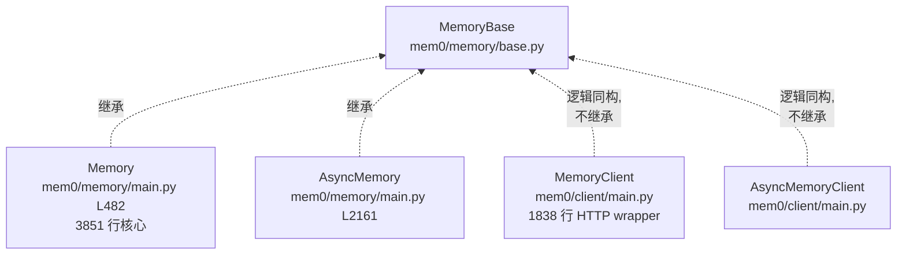

# 01 — `mem0/memory/base.py`（63 行抽象基类）

> 整个 Mem0 最小的"宪法"文件,只 63 行,定义了所有 Memory 实现必须遵守的契约。
> 但它**故意没把 `add`/`search` 抽象化**——这是关键设计选择。

---

## 文件全景

```python
# mem0/memory/base.py（完整 63 行）
from abc import ABC, abstractmethod


class MemoryBase(ABC):
    @abstractmethod
    def get(self, memory_id):
        """Retrieve a memory by ID."""

    @abstractmethod
    def get_all(self):
        """List all memories."""

    @abstractmethod
    def update(self, memory_id, data):
        """Update a memory by ID."""

    @abstractmethod
    def delete(self, memory_id):
        """Delete a memory by ID."""

    @abstractmethod
    def history(self, memory_id):
        """Get the history of changes for a memory by ID."""
```

---

## 1. 为什么抽象基类这么"瘦"？

只有 5 个方法,而且**最常用的 `add` / `search` 不在里面**！

这是有意为之：

| 如果把 `add`/`search` 也抽象化 | 不抽象化（Mem0 选这个） |
|-----------------------------|---------------------|
| 子类必须严格按签名实现 | 子类可以自由设计签名 |
| 想加新参数要改 base + 所有子类 | 想加新参数只改子类 |
| 强制所有 Memory 实现一致 | 允许 OSS/Hosted 用不同细节 |

**实际效果**：
- `Memory.add(messages, *, user_id, agent_id, run_id, metadata, timestamp, expiration_date, infer, memory_type, prompt)` — OSS 12 个参数
- `MemoryClient.add(messages, *, user_id, agent_id, run_id, metadata, ...)` — Hosted 不一样的子集
- 两者不强制签名一致,但**主动保持 API 表面同步**（产品决策,不是技术强制）

---

## 2. 5 个抽象方法的契约

| 方法 | 用途 | 输入 | 输出 |
|------|------|-----|------|
| `get(memory_id)` | 按 ID 取一条 memory | memory_id (str) | dict |
| `get_all()` | 列出所有 memory（参数由子类决定） | — | list |
| `update(memory_id, data)` | 更新一条 memory | memory_id, new data | dict (success message) |
| `delete(memory_id)` | 删除一条 memory | memory_id | — |
| `history(memory_id)` | 取变更历史 | memory_id | list of changes |

> 💡 **注意**：`get_all`/`update`/`delete` 的抽象签名极简（无 scope 参数），但**所有实现都自己加了 `user_id`/`agent_id`/`run_id` 参数**——abstract 只声明"必须存在",不约束签名。

---

## 3. 谁继承 `MemoryBase`？



> **注意**：`MemoryClient` **并不继承 `MemoryBase`**！它只是**逻辑上同构**（API 表面对齐），不需要 ABC 强制。这是为了避免 import 依赖（client 不应该 import memory 模块）。

---

## 4. ABC 在 Python 里的语义（快速回顾）

```python
from abc import ABC, abstractmethod

class MemoryBase(ABC):           # 继承 ABC 让类变成"抽象基类"
    @abstractmethod              # 标记为抽象方法
    def get(self, memory_id):    # 子类必须 override
        pass
```

- 直接 `MemoryBase()` 会 `TypeError: Can't instantiate abstract class`
- 子类必须 override 所有 `@abstractmethod` 才能实例化
- 但 `Memory` 还加了**非抽象方法**（`add`/`search`/`__init__` 等）——这些 ABC 不约束

---

## 5. 为什么不用 Protocol（鸭子类型）？

Python 3.8+ 有 `typing.Protocol`（结构性子类型），可以不继承就匹配接口。Mem0 没用,原因：

| 维度 | ABC | Protocol |
|------|-----|---------|
| 子类要 `inherit` | ✅ | ❌（隐式） |
| 运行时检查 | ✅（无法实例化） | ❌（仅静态） |
| 添加 helper 方法 | ✅ | ✅ |
| 适合 | "我自己要约束子类" | "我要描述外部接口" |

Mem0 自己有 Memory/AsyncMemory 两个子类,要严格约束,选 ABC 合理。

---

## 6. 这个文件会不会扩展？

**短期不会**。原因：
- April 2026 重构刚移除 graph memory,核心 API 反而**变窄了**
- 加新抽象方法会破坏所有第三方 MemoryBase 子类（罕见的但理论存在）
- `add`/`search` 不抽象化的设计已经稳定

如果将来扩展,可能加：
- `count(*, user_id, agent_id, run_id)` — 计数（目前都是 `get_all` 拿全部再 len）
- `bulk_add(messages_list)` — 批量（目前 `add` 已经支持 list）
- `stream_search(query)` — 流式（暂无需求）

---

## 7. 接下来

| 想看 | 去哪 |
|------|------|
| 抽象方法的具体实现 | [`02-memory-main.md`](./02-memory-main.md) |
| 配置和数据模型 | [`04-configs.md`](./04-configs.md) |
| Hosted client 怎么实现这 5 个方法 | [`03-py-sdk-client/01-client.md`](../03-py-sdk-client/01-client.md) |

---

📌 **下一步** → [`02-memory-main.md`](./02-memory-main.md) `Memory` 类顶层结构。
