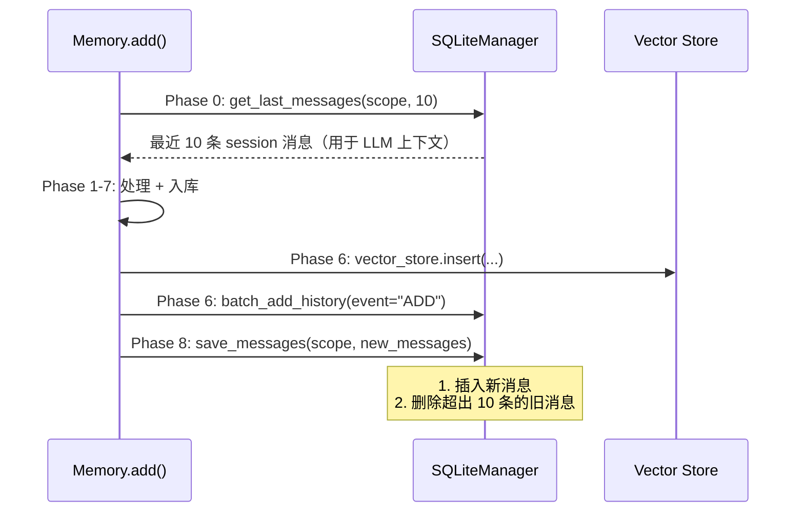

# 03 — `mem0/memory/storage.py`（SQLiteManager）

> SQLite 是 Mem0 的**辅助存储**——只存变更历史和最近会话消息,**不存记忆本身**。
> 记忆数据存在 vector store,SQLite 只是"日志 + 上下文窗口"。

---

## 文件全景（347 行）

```python
# mem0/memory/storage.py
import logging
import sqlite3
import threading
import uuid
from datetime import datetime, timezone
from typing import Any, Dict, List, Optional

logger = logging.getLogger(__name__)


class SQLiteManager:
    """管两张表：history（变更日志）+ messages（最近会话消息）"""

    def __init__(self, db_path: str = ":memory:"):
        ...
```

---

## 1. 两张表的 schema

### 1.1 `history` 表

```sql
CREATE TABLE history (
    id           TEXT PRIMARY KEY,    -- uuid4
    memory_id    TEXT,                -- 关联的 memory ID
    old_memory   TEXT,                -- 变更前的内容（ADD 时为 NULL）
    new_memory   TEXT,                -- 变更后的内容（DELETE 时为 NULL）
    event        TEXT,                -- "ADD" / "UPDATE" / "DELETE" 等
    created_at   DATETIME,
    updated_at   DATETIME,
    is_deleted   INTEGER,             -- 0/1 bool
    actor_id     TEXT,                -- 谁做的变更（user/agent/system）
    role         TEXT                 -- "user" / "assistant" / "system"
);
```

每次 `add`/`update`/`delete` 写一行,记录变更。

### 1.2 `messages` 表

```sql
CREATE TABLE messages (
    id             TEXT PRIMARY KEY,
    session_scope  TEXT,             -- "user_id=u1&agent_id=a1" 形式
    role           TEXT,
    content        TEXT,
    name           TEXT,
    created_at     DATETIME
);
```

> **关键设计**：每个 `session_scope` **只保留最近 10 条消息**。`save_messages` 写入后立即删除超出 10 条的旧消息（详见 §4）。

---

## 2. 表迁移机制（兼容旧版）

`_migrate_history_table()` (`storage.py` L20-L100) 处理老 schema：

```python
def _migrate_history_table(self):
    # 1. BEGIN transaction
    # 2. 检查 history 表是否存在
    # 3. PRAGMA table_info 拿现有列
    # 4. 跟 expected_cols 比对
    # 5. 如果不一样：
    #    - RENAME history → history_old
    #    - CREATE 新 schema 的 history
    #    - INSERT INTO history (交集列) SELECT 交集列 FROM history_old
    #    - DROP history_old
    # 6. COMMIT (出错 ROLLBACK)
```

> 这是标准的 SQLite online migration 模式——**rename + create + copy + drop**,在事务里保证原子性。

---

## 3. 关键方法签名

| 方法 | 用途 | 行号 |
|------|------|-----|
| `__init__(db_path)` | 建连接 + 迁移 + 建表 | L11 |
| `_migrate_history_table()` | 老 schema 迁移 | L20 |
| `_create_history_table()` | 建 history 表 | L102 |
| `_create_messages_table()` | 建 messages 表 | L128 |
| `add_history(...)` | 单条历史记录 | L150 |
| `batch_add_history(records)` | 批量历史记录 | L193 |
| `get_history(memory_id)` | 取某 memory 的所有变更 | L227 |
| `save_messages(messages, session_scope)` | 存会话消息 + evict 老消息 | L257 |
| `get_last_messages(session_scope, limit=10)` | 取最近 N 条 | L298 |
| `reset()` | DROP 两张表 | L326 |
| `close()` | 关连接 | L341 |
| `__del__()` | 析构时关连接 | L346 |

---

## 4. ⭐ `save_messages` 的"保留最近 10 条"逻辑

L257-L296 的核心技巧：

```python
def save_messages(self, messages, session_scope):
    if not messages:
        return
    with self._lock:
        try:
            self.connection.execute("BEGIN")
            now = datetime.now(timezone.utc).isoformat()
            # 1. 全部插入新消息
            for message in messages:
                self.connection.execute(
                    "INSERT INTO messages (id, session_scope, role, content, name, created_at) VALUES (?, ?, ?, ?, ?, ?)",
                    (str(uuid.uuid4()), session_scope, ..., now),
                )
            # 2. 删除超出最近 10 条的旧消息
            # 用派生表强制 SQLite 先 materialize ORDER BY 再算 NOT IN
            self.connection.execute("""
                DELETE FROM messages WHERE session_scope = ? AND id NOT IN (
                    SELECT id FROM (
                        SELECT id FROM messages
                        WHERE session_scope = ?
                        ORDER BY created_at DESC
                        LIMIT 10
                    )
                )
            """, (session_scope, session_scope))
            self.connection.execute("COMMIT")
        except Exception as e:
            self.connection.execute("ROLLBACK")
            raise
```

### 为什么要嵌套子查询？

注释解释（L280-L282）：
> "Wrapped in a derived table to force SQLite to materialize the ORDER BY before the outer NOT IN evaluates it."

SQLite 的 `NOT IN (subquery)` 可能有 evaluation order 问题——`LIMIT` 在外层算时,某些版本会先评估 NOT IN 再算 LIMIT,导致结果不稳定。**嵌套一层 derived table** (`SELECT id FROM (SELECT ... LIMIT 10)`) 强制 SQLite 先物化内层,再算外层 NOT IN。

这是个**SQLite-specific 的工程坑**,PostgreSQL/MySQL 不会有这个问题。

---

## 5. ⭐ `get_last_messages` 的双向 ORDER BY

L298-L324：

```python
def get_last_messages(self, session_scope, limit=10):
    cur = self.connection.execute("""
        SELECT role, content, name, created_at FROM (
            SELECT role, content, name, created_at
            FROM messages
            WHERE session_scope = ?
            ORDER BY created_at DESC   -- 先倒序拿最近 N 条
            LIMIT ?
        ) ORDER BY created_at ASC       -- 再正序返回给调用方
    """, (session_scope, limit))
```

**双重排序**：
1. 内层 `DESC LIMIT N` 取最近 N 条
2. 外层 `ASC` 把这 N 条按时间正序返回（让调用方拿到的就是"chronological order"）

> 一个常用的 SQL 模式,记下来：**`SELECT ... FROM (SELECT ... ORDER BY x DESC LIMIT N) ORDER BY x ASC`**。

---

## 6. 并发与连接管理

```python
class SQLiteManager:
    def __init__(self, db_path=":memory:"):
        self.db_path = db_path
        # check_same_thread=False 让连接可以跨线程共享
        # 但必须自己加锁保证线程安全
        self.connection = sqlite3.connect(db_path, check_same_thread=False)
        self._lock = threading.Lock()    # 所有方法用这个锁
```

| 设计 | 为什么 |
|------|-------|
| `check_same_thread=False` | SQLite 默认禁止跨线程用连接；False 允许但需手动加锁 |
| `self._lock = threading.Lock()` | 所有方法 with self._lock 保证线程安全 |
| 每个 BEGIN/COMMIT 在 with lock 里 | 防止并发事务交叉 |
| `__del__` 调 `close()` | GC 时关连接,避免泄漏 |
| `close()` 把 `connection = None` | 防 double-close |

> 这是典型的 **single-connection + mutex** 模式,适合 SQLite。生产用 PostgreSQL 时（server 模式）会用 connection pool（在 `server/db.py`）。

---

## 7. 与主流程的关系



---

## 8. db_path 默认值与覆盖

```python
# mem0/configs/base.py
class MemoryConfig(BaseModel):
    history_db_path: str = Field(
        default=os.path.join(mem0_dir, "history.db"),
    )
```

`mem0_dir` 来自：

```python
# mem0/configs/base.py L11-L13
home_dir = os.path.expanduser("~")
mem0_dir = os.environ.get("MEM0_DIR") or os.path.join(home_dir, ".mem0")
```

| 场景 | db_path |
|------|--------|
| 默认 | `~/.mem0/history.db` |
| `MEM0_DIR=/foo` | `/foo/history.db` |
| 测试 / 临时 | `:memory:`（内存 SQLite,进程退出即失） |

---

## 9. 重要：SQLite 的限制

- **不支持高并发写**（一次只能一个 writer）
- **单文件**（不能水平扩展）
- **不适合多进程共享**（即使 `check_same_thread=False`,跨进程还是 file lock）

→ 自托管 server 模式（`server/`）用 PostgreSQL 替代,但**那是 server 的实现,不影响 SDK 本身**。SDK 永远是单进程,SQLite 足够。

---

## 10. 接下来

| 想看 | 去哪 |
|------|------|
| 配置和 MemoryItem 数据模型 | [`04-configs.md`](./04-configs.md) |
| add() 全链路（用到 SQLiteManager） | [`06-add-pipeline.md`](./06-add-pipeline.md) |
| server 怎么换 SQLite 为 PG | [`05-server/01-architecture.md`](../05-server/01-architecture.md) |

---

📌 **下一步** → [`04-configs.md`](./04-configs.md) 配置系统。
