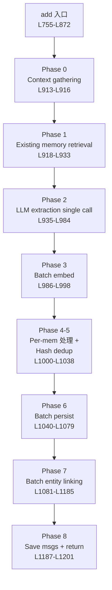

# 06 — `add()` 全链路 8 阶段深度剖析

> `Memory.add()` 是整个 Mem0 最复杂的单个方法,共 **447 行**（L755–L1202）,实现 April 2026 的 **V3 PHASED BATCH PIPELINE**。
> 本篇逐阶段精读,每阶段附代码段、设计权衡、坑点。

---

## 0. 总览

```python
def add(
    self,
    messages,
    *,
    user_id=None, agent_id=None, run_id=None,
    metadata=None, timestamp=None, expiration_date=None,
    infer: bool = True,
    memory_type: Optional[str] = None,
    prompt: Optional[str] = None,
) -> dict:
```

### 参数

| 参数 | 类型 | 默认 | 用途 |
|------|------|------|------|
| `messages` | str / dict / list[dict] | — | 消息内容 |
| `user_id` | str | None | 用户 scope（必须至少一个） |
| `agent_id` | str | None | agent scope |
| `run_id` | str | None | run scope |
| `metadata` | dict | None | 自定义 metadata（identity 字段会被剥离） |
| `timestamp` | Any | None | ⚠️ Platform-only,OSS 报错 |
| `expiration_date` | Any | None | YYYY-MM-DD,过期 memory 不出现在 search |
| `infer` | bool | True | True=LLM 抽取；False=raw 入库 |
| `memory_type` | str | None | 仅支持 `"procedural_memory"` |
| `prompt` | str | None | 覆盖 default extraction prompt |

### 返回

```python
{
    "results": [
        {"id": "uuid", "memory": "extracted text", "event": "ADD"},
        ...
    ]
}
```

### 8 阶段流程图



---

## 1. 入口段（L755–L872）

### 1.1 入口验证

```python
# L812-L815: timestamp 是 Platform-only
if timestamp is not None:
    raise ValueError(get_temporal_feature_error_message("sync", "add", "timestamp"))

# L815-L824: 处理 expiration_date
normalized_expiration_date = _normalize_expiration_date(expiration_date)
temporal_usage_notice = detect_temporal_usage_from_metadata(metadata)

# L817-L824: 构建 metadata + filters
processed_metadata, effective_filters = _build_filters_and_metadata(
    user_id=user_id, agent_id=agent_id, run_id=run_id,
    input_metadata=metadata,
)
if normalized_expiration_date is not None:
    processed_metadata["expiration_date"] = normalized_expiration_date
```

### 1.2 memory_type 验证

```python
# L826-L832
if memory_type is not None and memory_type != MemoryType.PROCEDURAL.value:
    raise Mem0ValidationError(
        message=f"Invalid 'memory_type'. Please pass {MemoryType.PROCEDURAL.value}...",
        error_code="VALIDATION_002",
        ...
    )
```

> 目前**只支持 `procedural_memory`**。其他类型会报错。

### 1.3 messages 类型规整

```python
# L834-L846
if isinstance(messages, str):
    messages = [{"role": "user", "content": messages}]
elif isinstance(messages, dict):
    messages = [messages]
elif not isinstance(messages, list):
    raise Mem0ValidationError(
        message="messages must be str, dict, or list[dict]",
        error_code="VALIDATION_003",
        ...
    )
```

### 1.4 分流：procedural / vision / regular

```python
# L848-L857: procedural 分支
if agent_id is not None and memory_type == MemoryType.PROCEDURAL.value:
    results = self._create_procedural_memory(messages, metadata=processed_metadata, prompt=prompt)
    # ... 显示 notice
    return results

# L859-L862: vision 支持
if self.config.llm.config.get("enable_vision"):
    messages = parse_vision_messages(messages, self.llm, self.config.llm.config.get("vision_details"))
else:
    messages = parse_vision_messages(messages)

# L864-L872: 主路径
vector_store_result = self._add_to_vector_store(messages, processed_metadata, effective_filters, infer, prompt=prompt)
return {"results": vector_store_result}
```

---

## 2. ⭐ `_add_to_vector_store` 8 阶段（L874-L1201）

### 2.1 分流：`infer=False` 走 raw 模式

```python
# L875-L909
if not infer:
    returned_memories = []
    for message_dict in messages:
        # 跳过非法格式
        if not isinstance(message_dict, dict) or message_dict.get("role") is None or message_dict.get("content") is None:
            logger.warning(f"Skipping invalid message format: {message_dict}")
            continue
        # 跳过 system 消息
        if message_dict["role"] == "system":
            continue

        per_msg_meta = deepcopy(metadata)
        per_msg_meta["role"] = message_dict["role"]
        actor_name = message_dict.get("name")
        if actor_name:
            per_msg_meta["actor_id"] = actor_name

        msg_content = message_dict["content"]
        msg_embeddings = self.embedding_model.embed(msg_content, "add")
        mem_id = self._create_memory(msg_content, {msg_content: msg_embeddings}, per_msg_meta)

        returned_memories.append({
            "id": mem_id, "memory": msg_content, "event": "ADD",
            "actor_id": actor_name if actor_name else None,
            "role": message_dict["role"],
        })
    return returned_memories
```

**raw 模式特点**：
- 不调 LLM
- 每条 message 原样入库（content 当 memory text）
- 跳过 system role
- **不做 entity linking**（注意！）
- 用 `_create_memory` helper（详见 [`08-update-delete.md`](./08-update-delete.md) §9）

> 用例：你已经有现成的 fact 列表,不需要 LLM 抽取。

### 2.2 === V3 PHASED BATCH PIPELINE ===

```python
# L911 注释明确写"V3 PHASED BATCH PIPELINE"
```

---

## Phase 0: Context gathering（L913-L916）

```python
session_scope = _build_session_scope(filters)
last_messages = self.db.get_last_messages(session_scope, limit=10)
parsed_messages = parse_messages(messages)
```

| 操作 | 目的 |
|------|------|
| `session_scope` | `"user_id=u1&agent_id=a1"` 字符串,用于 SQLite 查询 |
| `last_messages` | 最近 10 条本 session 的消息（给 LLM 上下文,解析代词） |
| `parsed_messages` | messages 规整成标准 `[{"role", "content"}]` |

> `last_messages` 来自 SQLite 的 `messages` 表,每次 `add()` 结束会更新（Phase 8）。

---

## Phase 1: Existing memory retrieval（L918-L933）

```python
search_filters = {k: v for k, v in filters.items() if k in ("user_id", "agent_id", "run_id") and v}

# embed 整个对话
query_embedding = self.embedding_model.embed(parsed_messages, "search")

# vector search top 10
existing_results = self.vector_store.search(
    query=parsed_messages,
    vectors=query_embedding,
    top_k=10,
    filters=search_filters,
)

# ⭐ UUID → int mapping 防 LLM 幻觉
existing_memories = []
uuid_mapping = {}
for idx, mem in enumerate(existing_results):
    uuid_mapping[str(idx)] = mem.id   # "0" → uuid
    existing_memories.append({"id": str(idx), "text": mem.payload.get("data", "")})
```

### ⭐ UUID→int mapping 的智慧

把 UUID（`"5a3f2b..."`）换成 `"0"`, `"1"`, `"2"` 再喂给 LLM。

| 不换 | 换（Mem0 选这个） |
|------|---------------|
| LLM 看到 32 字符 UUID,可能尝试**编造**类似的 UUID | LLM 看到 `"0"/"1"`,知道是引用序号 |
| 引用现有 memory 时容易写错 | 引用准确 |
| linked_memory_ids 容易乱 | linked_memory_ids 准确 |

→ 通过 `uuid_mapping` 在拿到 LLM 响应后映射回真 UUID。

---

## Phase 2: LLM extraction（single call）（L935-L984）

```python
# 判断是 user 还是 agent 视角
is_agent_scoped = bool(filters.get("agent_id")) and not filters.get("user_id")

system_prompt = ADDITIVE_EXTRACTION_PROMPT
if is_agent_scoped:
    system_prompt += AGENT_CONTEXT_SUFFIX

custom_instr = prompt or self.custom_instructions

# 构造 user prompt（详见 05-prompts.md §3）
user_prompt = generate_additive_extraction_prompt(
    existing_memories=existing_memories,
    new_messages=parsed_messages,
    last_k_messages=last_messages,
    custom_instructions=custom_instr,
)

# ⭐ 强制 JSON 输出
try:
    response = self.llm.generate_response(
        messages=[
            {"role": "system", "content": system_prompt},
            {"role": "user", "content": user_prompt},
        ],
        response_format={"type": "json_object"},   # OpenAI 风格
    )
except Exception as e:
    logger.error(f"LLM extraction failed: {e}")
    raise LLMError(f"LLM extraction failed: {e}") from e
```

### 解析响应

```python
# L966-L979
try:
    response = remove_code_blocks(response)  # 去 ```json ... ``` 包裹
    if not response or not response.strip():
        extracted_memories = []
    else:
        try:
            extracted_memories = json.loads(response, strict=False).get("memory", [])
        except json.JSONDecodeError:
            extracted_json = extract_json(response)   # 兜底:正则抽 JSON
            extracted_memories = json.loads(extracted_json, strict=False).get("memory", [])
except Exception as e:
    logger.error(f"Error parsing extraction response: {e}")
    extracted_memories = []

if not extracted_memories:
    self.db.save_messages(messages, session_scope)  # 即使没抽到也存 session msg
    return []
```

### 关键点

- **single call** 整个抽取在 1 次 LLM 调用完成（旧算法 3 次）
- `response_format={"type": "json_object"}` OpenAI 强制 JSON（其他 provider 看支持情况）
- `strict=False` 允许重复键等小瑕疵
- 三层兜底：`json.loads` → `extract_json` 正则 → `[]`

---

## Phase 3: Batch embed all extracted texts（L986-L998）

```python
mem_texts = [m.get("text", "") for m in extracted_memories if m.get("text")]

try:
    mem_embeddings_list = self.embedding_model.embed_batch(mem_texts, "add")
    embed_map = dict(zip(mem_texts, mem_embeddings_list))
except Exception:
    # 单条 fallback
    embed_map = {}
    for text in mem_texts:
        try:
            embed_map[text] = self.embedding_model.embed(text, "add")
        except Exception as e:
            logger.warning(f"Failed to embed memory text: {e}")
```

> **batch embed**：一次 API 调用 embed 多条文本,比循环单条快几倍。失败 fallback 到逐条。

---

## Phase 4-5: Per-memory CPU processing + Hash dedup（L1000-L1038）

```python
# 收集现有 memory 的 hash
existing_hashes = set()
for mem in existing_results:
    h = mem.payload.get("hash") if hasattr(mem, "payload") and mem.payload else None
    if h:
        existing_hashes.add(h)

records = []           # (memory_id, text, embedding, payload)
seen_hashes = set()    # 当前 batch 内 dedup

for mem in extracted_memories:
    text = mem.get("text")
    if not text or text not in embed_map:
        continue

    mem_hash = hashlib.md5(text.encode()).hexdigest()
    # ⭐ 双重 dedup
    if mem_hash in existing_hashes or mem_hash in seen_hashes:
        logger.debug(f"Skipping duplicate memory (hash match): {text[:50]}")
        continue
    seen_hashes.add(mem_hash)

    # 预处理 lemmatized text（给 BM25 用）
    text_lemmatized = lemmatize_for_bm25(text)

    memory_id = str(uuid.uuid4())
    mem_metadata = deepcopy(metadata)
    mem_metadata["data"] = text
    mem_metadata["text_lemmatized"] = text_lemmatized
    mem_metadata["hash"] = mem_hash
    if "created_at" not in mem_metadata:
        mem_metadata["created_at"] = datetime.now(timezone.utc).isoformat()
    mem_metadata["updated_at"] = mem_metadata["created_at"]
    if mem.get("attributed_to"):
        mem_metadata["attributed_to"] = mem["attributed_to"]

    records.append((memory_id, text, embed_map[text], mem_metadata))

if not records:
    self.db.save_messages(messages, session_scope)
    return []
```

### Hash dedup 的两层

| 层 | 检查 | 目的 |
|----|------|------|
| `existing_hashes` | 跨 batch（已有 memory） | 防止重复入库 |
| `seen_hashes` | 同 batch 内 | 同次抽取内重复 |

> 这是**确定性 dedup**——md5 一致即重复。**不需要 LLM 判断**,快、准、可复现。

### payload 字段一览

```python
{
    "data": text,                      # ⭐ memory 内容（核心字段）
    "text_lemmatized": "...",          # BM25 用
    "hash": "md5_32_hex",              # dedup
    "created_at": "iso",
    "updated_at": "iso",
    "user_id": "u1",                   # 来自 metadata（identity）
    "agent_id": "a1",                  # 同上
    "attributed_to": "user",           # 可选（LLM 标的）
    "expiration_date": "2026-12-31",   # 可选
    # ...其他 caller 自定义 metadata
}
```

---

## Phase 6: Batch persist（L1040-L1079）

```python
all_vectors = [r[2] for r in records]
all_ids = [r[0] for r in records]
all_payloads = [r[3] for r in records]

# 单次批量 insert
try:
    self.vector_store.insert(
        vectors=all_vectors,
        ids=all_ids,
        payloads=all_payloads,
    )
except Exception:
    # 逐条 fallback
    for mid, vec, pay in zip(all_ids, all_vectors, all_payloads):
        try:
            self.vector_store.insert(vectors=[vec], ids=[mid], payloads=[pay])
        except Exception as e:
            logger.error(f"Failed to insert memory {mid}: {e}")

# 批量写历史
history_records = [
    {
        "memory_id": r[0],
        "old_memory": None,
        "new_memory": r[1],
        "event": "ADD",
        "created_at": r[3].get("created_at"),
        "is_deleted": 0,
    }
    for r in records
]
try:
    self.db.batch_add_history(history_records)
except Exception:
    # 逐条 fallback
    for hr in history_records:
        try:
            self.db.add_history(hr["memory_id"], None, hr["new_memory"], "ADD", created_at=hr.get("created_at"))
        except Exception as e:
            logger.error(f"Failed to add history for {hr['memory_id']}: {e}")
```

> 双 batch：vector_store 一次 + SQLite 一次。失败都 fallback 逐条。

---

## Phase 7: Batch entity linking（L1081-L1185）⭐ 最复杂

entity linking 是 April 2026 新算法的核心。**5 个子阶段**：

### Phase 7a: Global dedup

```python
all_texts = [r[1] for r in records]
all_entities = extract_entities_batch(all_texts)   # spaCy NER

# 全局收集 unique entities
global_entities = {}   # normalized_key → [entity_type, entity_text, set(memory_ids)]
for idx, (memory_id, text, embedding, payload) in enumerate(records):
    entities = all_entities[idx] if idx < len(all_entities) else []
    for entity_type, entity_text in entities:
        key = self._normalize_entity_text(entity_text)   # "Foo BAR" → "foo bar"
        if key in global_entities:
            global_entities[key][2].add(memory_id)
        else:
            global_entities[key] = [entity_type, entity_text, {memory_id}]
```

### Phase 7b: Single batch embed

```python
ordered_keys = list(global_entities.keys())
entity_texts = [global_entities[k][1] for k in ordered_keys]

try:
    entity_embeddings = self.embedding_model.embed_batch(entity_texts, "add")
except Exception:
    # 逐条 fallback
    entity_embeddings = []
    for t in entity_texts:
        try:
            entity_embeddings.append(self.embedding_model.embed(t, "add"))
        except Exception:
            entity_embeddings.append(None)

# 对齐长度（embed_batch 可能返回少于输入）
if len(entity_embeddings) != len(ordered_keys):
    logger.warning("embed_batch returned %d vectors for %d entity texts — padding/truncating")
    entity_embeddings = list(entity_embeddings[: len(ordered_keys)])
    entity_embeddings += [None] * (len(ordered_keys) - len(entity_embeddings))

# 过滤掉 None（embed 失败的）
valid = [(i, k) for i, k in enumerate(ordered_keys) if entity_embeddings[i] is not None]
```

### Phase 7c: Batch search existing entities

```python
if valid:
    valid_indices, valid_keys = zip(*valid)
    valid_vectors = [entity_embeddings[i] for i in valid_indices]
    exact_matches = self._existing_entities_by_text(search_filters)

    valid_texts = [global_entities[k][1] for k in valid_keys]
    existing_matches = self.entity_store.search_batch(
        queries=valid_texts,
        vectors_list=valid_vectors,
        top_k=1,
        filters=search_filters,
    )
```

> **三层匹配**：
> 1. `exact_matches`（normalized text 完全匹配）—— O(1) 字典查
> 2. `search_batch` semantic 查（top_k=1）—— O(N) 向量查
> 3. 如果都没,新建

### Phase 7d: 分流 inserts vs updates

```python
to_insert_vectors, to_insert_ids, to_insert_payloads = [], [], []

for j, key in enumerate(valid_keys):
    entity_type, entity_text, memory_ids = global_entities[key]
    matches = existing_matches[j] if j < len(existing_matches) else []
    exact_match = exact_matches.get(key)

    # ⭐ exact text 优先,semantic 0.95 阈值
    semantic_match = matches[0] if matches and matches[0].score >= 0.95 else None
    match = exact_match or semantic_match

    if match:
        # 更新已有 entity 的 linked_memory_ids
        payload = match.payload or {}
        linked = set(payload.get("linked_memory_ids", []))
        linked |= memory_ids    # 合并新 memory_ids
        payload["linked_memory_ids"] = sorted(linked)
        try:
            self.entity_store.update(
                vector_id=match.id, vector=None, payload=payload,
            )
        except Exception as e:
            logger.debug(f"Entity update failed for '{entity_text}': {e}")
    else:
        # 新 entity 入待插入列表
        to_insert_vectors.append(valid_vectors[j])
        to_insert_ids.append(str(uuid.uuid4()))
        to_insert_payloads.append({
            "data": entity_text,
            "entity_type": entity_type,
            "linked_memory_ids": sorted(memory_ids),
            **search_filters,
        })
```

### Phase 7e: Single batch insert new entities

```python
if to_insert_vectors:
    try:
        self.entity_store.insert(
            vectors=to_insert_vectors,
            ids=to_insert_ids,
            payloads=to_insert_payloads,
        )
    except Exception as e:
        logger.warning(f"Batch entity insert failed: {e}")
```

### Phase 7 整体的 try/except

```python
try:
    # Phase 7a-7e
except Exception as e:
    logger.warning(f"Batch entity linking failed: {e}")
```

> ⭐ **关键容错**：entity linking 失败**不影响**主流程（memory 已经入库）。warning 记录,继续。

### Entity store 的 payload 结构

```python
{
    "data": "OpenAI",                       # entity 文本
    "entity_type": "ORG",                   # spaCy NER 类型
    "linked_memory_ids": ["uuid1", "uuid2"],  # 关联的 memory 列表
    "user_id": "u1", "agent_id": "a1", "run_id": "r1",  # scope
}
```

---

## Phase 8: Save messages + return（L1187-L1201）

```python
# 即使前面有 phase 失败,session messages 也要存
self.db.save_messages(messages, session_scope)

returned_memories = [
    {"id": r[0], "memory": r[1], "event": "ADD"}
    for r in records
]

# 遥测
keys, encoded_ids = process_telemetry_filters(filters)
capture_event(
    "mem0.add", self,
    {"version": self.api_version, "keys": keys, "encoded_ids": encoded_ids, "sync_type": "sync"},
)
return returned_memories
```

---

## 3. Notice 逻辑（入口和出口）

L850-L856 和 L866-L871：

```python
scale_threshold_notice = detect_scale_threshold_from_add_result(self, results)
if temporal_usage_notice:
    display_temporal_usage_notice(self, "sync", "add", *temporal_usage_notice)
elif scale_threshold_notice:
    display_scale_threshold_notice(self, "sync", "add", *scale_threshold_notice)
else:
    display_first_run_notice(self, "sync", "add")
```

> notice 系统会引导用户："你刚搜了 1000+ memory,考虑升级到 Platform scale tier" / "你的 query 含时间词,试试 temporal reasoning（仅 Platform）" / "第一次用,看 docs"。详见 `mem0/memory/notices.py`（1582 行）。

---

## 4. 性能特征

| 阶段 | 主要 I/O | 耗时量级 |
|------|---------|---------|
| Phase 0 | SQLite 读 | <10ms |
| Phase 1 | 1 次 embed + 1 次 vector search | 100-300ms |
| Phase 2 | 1 次 LLM 调用 | 500-3000ms（主要瓶颈） |
| Phase 3 | 1 次 batch embed | 100-500ms |
| Phase 4-5 | CPU + md5 + lemmatize | 50-200ms |
| Phase 6 | 1 次 vector insert + 1 次 SQLite batch | 50-200ms |
| Phase 7 | NER + batch embed + entity search + batch insert | 200-1000ms |
| Phase 8 | SQLite save_messages | <20ms |

总:简单对话 ~1s,复杂对话 ~3-5s。**LLM 是最大瓶颈**。

---

## 5. 失败模式与容错

| 失败点 | 容错策略 |
|-------|---------|
| Phase 2 LLM 失败 | 抛 `LLMError`,**不静默吞**（让上层重试） |
| Phase 2 JSON 解析失败 | 三层兜底,最后 `[]` |
| Phase 3 batch embed 失败 | 逐条 embed |
| Phase 6 batch insert 失败 | 逐条 insert |
| Phase 6 batch history 失败 | 逐条 history |
| Phase 7 任意失败 | 整个 entity linking 跳过,warning |
| Phase 7d 单 entity update 失败 | debug log,继续 |
| Phase 7e batch insert 失败 | warning,继续 |

> **设计原则**:memory 入库是**强一致**,entity linking 是**最终一致**。后者失败不影响主功能。

---

## 6. 注意：UUID mapping 的后续使用

```python
# Phase 1 构造的 uuid_mapping
uuid_mapping = {"0": "real_uuid_0", "1": "real_uuid_1", ...}
```

**但实际 add() 没用这个 mapping 反查**——LLM 输出里的 `linked_memory_ids` 直接被忽略（看 Phase 4-5 的 payload 构建,没有 linked_memory_ids 字段）。

为什么？因为 entity_store 的 `linked_memory_ids` 是 entity → memory 的反向链,不是 memory → memory 的直接关联。LLM 输出的 `linked_memory_ids` 在当前 OSS 实现里**实际未被使用**。

> 这是 OSS 跟 Platform 的差异之一——Platform 可能用 LLM 输出的 linking 做更精细的 memory graph,OSS 只用 entity-based linking。

---

## 7. async 版差异（AsyncMemory.add）

L2423+,基本镜像 sync 版,但有：

- `await self.embedding_model.embed_batch(...)` （如果 embedder 是 async）
- `await self.llm.generate_response(...)` （如果 LLM 是 async）
- 用 `concurrent.futures.ThreadPoolExecutor` 包 sync 调用（避免阻塞 event loop）
- `_compute_entity_boosts_async` 用 `concurrent.futures.as_completed` 并发搜 entity

> 详见源码 L2423-L2855。逻辑跟 sync 1:1 对应。

---

## 8. 调试技巧

### 看实际 LLM 输入

```python
import logging
logging.basicConfig(level=logging.DEBUG)
# 或针对 mem0
logging.getLogger("mem0").setLevel(logging.DEBUG)

m = Memory()
m.add("I'm Alice", user_id="u1")
# 看 stderr 的 logger.debug 输出,会显示 user_prompt 内容
```

### 临时关 telemetry

```python
# 环境变量
import os
os.environ["MEM0_TELEMETRY"] = "False"
```

### 单步 add

```python
# 用 infer=False 看入库流程（跳过 LLM）
m.add("hello", user_id="u1", infer=False)

# 用 memory_type procedural 看 procedural 分支
m.add(messages=[...], agent_id="a1", memory_type="procedural_memory")
```

---

## 9. 接下来

| 想看 | 去哪 |
|------|------|
| search() 多信号融合 | [`07-search-pipeline.md`](./07-search-pipeline.md) |
| update/delete 流程 | [`08-update-delete.md`](./08-update-delete.md) |
| prompt 系统详解 | [`05-prompts.md`](./05-prompts.md) |
| entity 抽取实现 | [`02-py-sdk-providers/08-utils.md`](../02-py-sdk-providers/08-utils.md) |

---

📌 **下一步** → [`07-search-pipeline.md`](./07-search-pipeline.md) search() 多信号融合精读。
