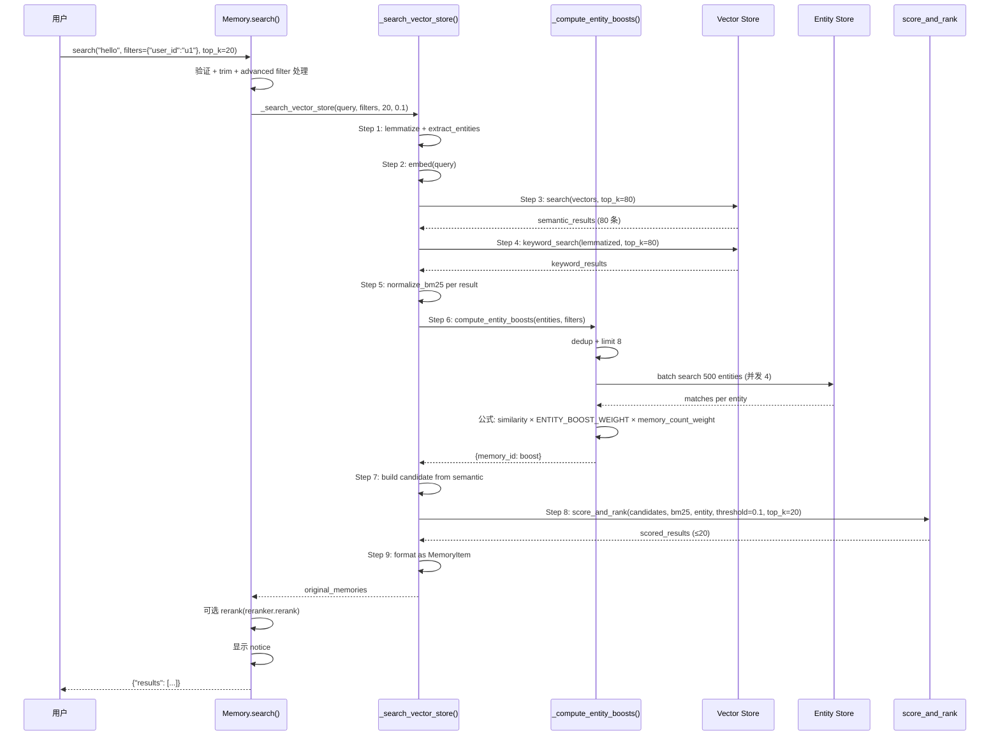

# 07 — `search()` 多信号融合精读

> `Memory.search()` (L1374-L1818) 实现 Mem0 的 **multi-signal retrieval**:semantic + BM25 keyword + entity boost 三信号融合。
> 本篇逐 step 精读 `_search_vector_store` 的 9 个 step + `_compute_entity_boosts` 公式 + advanced filter 系统。

---

## 0. 入口签名

```python
def search(
    self,
    query: str,
    *,
    top_k: int = 20,
    filters: Optional[Dict[str, Any]] = None,
    threshold: float = 0.1,
    rerank: bool = False,
    explain: bool = False,
    reference_date: Any = None,    # ⚠️ Platform-only
    show_expired: bool = False,
    **kwargs,
) -> dict:
```

### 参数详解

| 参数 | 默认 | 用途 |
|------|------|------|
| `query` | — | 搜索 query（非空字符串） |
| `top_k` | 20 | 最终返回 ≤top_k 条 |
| `filters` | None | **必须有** user_id/agent_id/run_id 之一 + 可选 metadata filter |
| `threshold` | 0.1 | 最低 score（<threshold 过滤） |
| `rerank` | False | 是否调独立 reranker 重排 |
| `explain` | False | 返回 `score_details`（debug 用） |
| `reference_date` | None | ⚠️ Platform-only temporal,OSS 报错 |
| `show_expired` | False | 是否含过期 memory |

### 高级 filter 操作符（v1.1+）

```python
filters = {
    "user_id": "u1",                          # 必有,scope
    # 简单值:exact match
    "category": "work",
    # 操作符
    "score": {"gte": 10},
    "tags": {"in": ["urgent", "important"]},
    "title": {"icontains": "meeting"},
    # 通配
    "nullable_field": "*",
    # 逻辑组合
    "AND": [{"category": "work"}, {"priority": "high"}],
    "OR": [{"tag": "vip"}, {"tag": "svip"}],
    "NOT": [{"archived": True}],
}
```

支持的 operator: `eq/ne/gt/gte/lt/lte/in/nin/contains/icontains` + `AND/OR/NOT` + `*` wildcard。

---

## 1. 入口验证（L1427-L1470）

```python
# L1427-L1428: reference_date 是 Platform-only
if reference_date is not None:
    raise ValueError(get_temporal_feature_error_message("sync", "search", "reference_date"))

# L1430-L1431: 拒绝顶层 entity params（必须 filters）
_reject_top_level_entity_params(kwargs, "search")

# L1433-L1435: 参数验证
_validate_search_params(threshold=threshold, top_k=top_k)
query = _validate_and_trim_search_query(query)

# L1436: 检测 temporal query
temporal_usage_notice = detect_temporal_usage_from_search(query, filters)

# L1438-L1456: trim entity ids in filters
effective_filters = filters.copy() if filters else {}
if "user_id" in effective_filters:
    effective_filters["user_id"] = _validate_and_trim_entity_id(...)
# ... agent_id, run_id 同
if not any(key in effective_filters for key in ("user_id", "agent_id", "run_id")):
    raise ValueError("filters must contain at least one of: user_id, agent_id, run_id")
```

### Advanced filter 处理

```python
# L1462-L1470
if self._has_advanced_operators(effective_filters):
    processed_filters = self._process_metadata_filters(effective_filters)
    # 移除已处理的 logical/operator keys
    for logical_key in ("AND", "OR", "NOT"):
        effective_filters.pop(logical_key, None)
    for fk in list(effective_filters.keys()):
        if fk not in ("AND", "OR", "NOT", "user_id", "agent_id", "run_id") and isinstance(effective_filters.get(fk), dict):
            effective_filters.pop(fk, None)
    effective_filters.update(processed_filters)
```

> `_process_metadata_filters` 把 `{"score": {"gte": 10}}` 翻译成 vector store 通用格式,各 provider 自己再翻译成原生语法（qdrant/pinecone/...）。

---

## 2. ⭐ `_search_vector_store` 9 个 step

`_search_vector_store(query, filters, limit, threshold, explain, show_expired)` (L1623-L1726):

### Step 1: Preprocess query（L1628-L1630）

```python
query_lemmatized = lemmatize_for_bm25(query)        # spaCy lemmatize,给 BM25
query_entities = extract_entities(query)             # 抽实体,给 entity boost
```

两个独立的预处理：
- `lemmatize_for_bm25`："running" → "run",改" bananas ate" → "banana eat"
- `extract_entities`：spaCy NER 抽 [人名/组织/地点/...]

> 不同信号用不同的 query 形式。semantic 用原 query（embedding 模型自己处理形态）,BM25 用 lemmatized,entity boost 用抽出来的实体。

### Step 2: Embed query（L1632-L1633）

```python
embeddings = self.embedding_model.embed(query, "search")
```

### Step 3: Semantic search（over-fetch）（L1635-L1639）

```python
internal_limit = max(limit * 4, 60)   # ⭐ over-fetch
semantic_results = self.vector_store.search(
    query=query, vectors=embeddings,
    top_k=internal_limit,
    filters=filters,
)
```

> **`max(limit * 4, 60)`**：用户要 top_k=20 时,实际查 80 条。给后续 BM25/entity boost 融合留候选池。

### Step 4: Keyword search BM25（L1641-L1644）

```python
keyword_results = self.vector_store.keyword_search(
    query=query_lemmatized,
    top_k=internal_limit,
    filters=filters,
)
```

> 调 vector_store 的 `keyword_search` 方法。**不是所有 provider 都实现**——FAISS、部分 hosted 不支持。`Memory.__init__` 检测到不支持会 warn 并禁用 BM25（详见 [`02-memory-main.md`](./02-memory-main.md) §6.1）。

### Step 5: Compute BM25 scores（L1646-L1654）

```python
bm25_scores = {}
if keyword_results is not None:
    midpoint, steepness = get_bm25_params(query, lemmatized=query_lemmatized)
    for mem in keyword_results:
        mem_id = str(mem.id) if hasattr(mem, 'id') else str(mem.get('id', ''))
        raw_score = mem.score if hasattr(mem, 'score') else mem.get('score', 0)
        if raw_score and raw_score > 0:
            bm25_scores[mem_id] = normalize_bm25(raw_score, midpoint, steepness)
```

> **BM25 normalization**：不同 vector store 返回的 raw BM25 量级差异大（qdrant 0-30, elasticsearch 0-15, ...）。`normalize_bm25` 用 sigmoid 函数压到 [0, 1],midpoint 和 steepness 是 query-specific 参数（`get_bm25_params` 根据 query 长度/词频动态算）。

### Step 6: Compute entity boosts（L1656-L1659）

```python
entity_boosts = {}
if query_entities:
    entity_boosts = self._compute_entity_boosts(query_entities, filters)
```

> 详见 §3。返回 `{memory_id: boost_value}` dict。

### Step 7: Build candidate set from semantic results（L1661-L1672）

```python
candidates = []
for mem in semantic_results:
    payload = mem.payload if hasattr(mem, 'payload') else {}
    # 过滤过期
    if not show_expired and _payload_is_expired(payload):
        continue
    mem_id = str(mem.id)
    candidates.append({
        "id": mem_id,
        "score": mem.score,
        "payload": payload,
    })
```

> **候选池来自 semantic_results**（不是 BM25 results）。BM25 只对 semantic 命中的 memory 加分。BM25 命中但 semantic 没命中的不会被返回（设计选择）。

### Step 8: Score and rank（L1674-L1682）

```python
scored_results = score_and_rank(
    semantic_results=candidates,
    bm25_scores=bm25_scores,
    entity_boosts=entity_boosts,
    threshold=threshold,
    top_k=limit,
    explain=explain,
)
```

> `score_and_rank` 在 `mem0/utils/scoring.py`,实现融合公式（详见 [`02-py-sdk-providers/08-utils.md`](../02-py-sdk-providers/08-utils.md)）。简化逻辑：

```python
def score_and_rank(semantic_results, bm25_scores, entity_boosts, threshold, top_k, explain):
    scored = []
    for mem in semantic_results:
        mem_id = mem["id"]
        sem = mem["score"]
        bm = bm25_scores.get(mem_id, 0)
        ent = entity_boosts.get(mem_id, 0)
        final = w_sem * sem + w_bm25 * bm + ENTITY_BOOST_WEIGHT * ent
        if final >= threshold:
            scored.append({**mem, "score": final, "score_details": {...}})
    scored.sort(key=lambda x: x["score"], reverse=True)
    return scored[:top_k]
```

### Step 9: Format results（L1684-L1726）

```python
promoted_payload_keys = [
    "user_id", "agent_id", "run_id", "actor_id",
    "role", "attributed_to", "expiration_date",
]
core_and_promoted_keys = {
    "data", "hash", "created_at", "updated_at", "id",
    "text_lemmatized", "attributed_to", *promoted_payload_keys,
}

original_memories = []
for scored in scored_results:
    payload = scored.get("payload") or {}
    if not payload.get("data"):
        continue    # 跳过无 data 的候选

    memory_item_dict = MemoryItem(
        id=scored["id"],
        memory=payload.get("data", ""),
        hash=payload.get("hash"),
        created_at=payload.get("created_at"),
        updated_at=payload.get("updated_at"),
        score=scored["score"],
    ).model_dump()

    # 把 promoted keys 提升到顶层
    for key in promoted_payload_keys:
        if key in payload:
            memory_item_dict[key] = payload[key]

    # 其他 payload 字段塞进 metadata
    additional_metadata = {k: v for k, v in payload.items() if k not in core_and_promoted_keys}
    if additional_metadata:
        if not memory_item_dict.get("metadata"):
            memory_item_dict["metadata"] = {}
        memory_item_dict["metadata"].update(additional_metadata)

    # explain 模式额外存 score_details
    if explain and "score_details" in scored:
        memory_item_dict["score_details"] = scored["score_details"]

    original_memories.append(memory_item_dict)

return original_memories
```

> **结果字段映射**：vector store payload → `MemoryItem` + promoted_keys + metadata。让用户拿到的是干净的 dict,不是 vector store 内部结构。

---

## 3. ⭐ `_compute_entity_boosts`（融合公式核心）

L1728-L1808。这个方法决定 entity 信号怎么影响最终 score。

### 算法流程

```python
def _compute_entity_boosts(self, query_entities, filters):
    """Returns: Dict memory_id (str) -> max entity boost [0, 0.5]"""

    # 1. 去重 + 限 8 个
    seen = set()
    deduped = []
    for entity_type, entity_text in query_entities[:8]:
        key = self._normalize_entity_text(entity_text)
        if key and key not in seen:
            seen.add(key)
            deduped.append((entity_type, entity_text))

    if not deduped:
        return {}

    search_filters = {k: v for k, v in filters.items() if k in ("user_id", "agent_id", "run_id") and v}
    memory_boosts = {}

    try:
        entity_texts = [text for _, text in deduped]

        # 2. batch embed 所有 entity
        embeddings = self.embedding_model.embed_batch(entity_texts, "search")

        if len(embeddings) != len(entity_texts):
            logger.warning("embed_batch returned %d vectors for %d texts — skipping entity boost")
            return memory_boosts

        entity_store = self.entity_store

        # 3. 并发搜 entity（max 4 worker）
        def _search_entity(entity_text, embedding):
            return entity_store.search(
                query=entity_text, vectors=embedding,
                top_k=500,   # ⭐ 高 top_k 抓所有相似 entity
                filters=search_filters,
            )

        with concurrent.futures.ThreadPoolExecutor(max_workers=4) as pool:
            futures = {
                pool.submit(_search_entity, text, emb): text
                for text, emb in zip(entity_texts, embeddings)
            }

            for future in concurrent.futures.as_completed(futures):
                try:
                    matches = future.result()
                except Exception as e:
                    logger.warning("Entity boost search failed for one entity: %s", e)
                    continue

                for match in matches:
                    similarity = match.score if hasattr(match, 'score') else 0.0
                    # 4. ⭐ 阈值 0.5（高于 search boost 才算）
                    if similarity < 0.5:
                        continue

                    payload = match.payload if hasattr(match, 'payload') else {}
                    linked_memory_ids = payload.get("linked_memory_ids", [])
                    if not isinstance(linked_memory_ids, list):
                        continue

                    # 5. ⭐ memory_count_weight：链接越多 memory 的 entity,boost 越小
                    num_linked = max(len(linked_memory_ids), 1)
                    memory_count_weight = 1.0 / (1.0 + 0.001 * ((num_linked - 1) ** 2))
                    boost = similarity * ENTITY_BOOST_WEIGHT * memory_count_weight

                    # 6. 每个 memory 取最大 boost
                    for memory_id in linked_memory_ids:
                        if memory_id:
                            memory_key = str(memory_id)
                            memory_boosts[memory_key] = max(
                                memory_boosts.get(memory_key, 0.0),
                                boost,
                            )

    except Exception as e:
        logger.warning(f"Entity boost computation failed: {e}")

    return memory_boosts
```

### 公式拆解

```
boost_for_memory = similarity × ENTITY_BOOST_WEIGHT × memory_count_weight
```

- `similarity`: entity vector 跟 store 里 entity 的余弦相似度 ∈ [0.5, 1.0]
- `ENTITY_BOOST_WEIGHT`: 来自 `mem0/utils/scoring.py` 的常量（具体值见源码）
- `memory_count_weight`: 链接 memory 数的衰减函数

### memory_count_weight 的曲线

```python
weight = 1.0 / (1.0 + 0.001 * ((num_linked - 1) ** 2))
```

| num_linked | weight |
|-----------|--------|
| 1 | 1.0 |
| 2 | 0.999 |
| 5 | 0.984 |
| 10 | 0.920 |
| 32 | 0.500 |
| 50 | 0.296 |
| 100 | 0.092 |
| 200 | 0.025 |

> **设计意图**：entity 链接 1 条 memory 时 boost 满分；链接很多 memory 时（比如 entity "User" 链了所有 memory）衰减——避免"热门 entity"压垮一切。

### 阈值 0.5

```python
if similarity < 0.5:
    continue
```

防止 noise entity 触发 boost。0.5 是经验阈值。

### 并发搜（ThreadPoolExecutor）

```python
with concurrent.futures.ThreadPoolExecutor(max_workers=4) as pool:
    futures = {pool.submit(_search_entity, text, emb): text for ...}
    for future in concurrent.futures.as_completed(futures):
        ...
```

> 多个 entity 并发搜（max 4）,避免串行等待。**注意：sync 版用 ThreadPoolExecutor,async 版（`_compute_entity_boosts_async`）用 `asyncio.gather`**。

---

## 4. BM25 normalization 细节

`mem0/utils/scoring.py` 的 `normalize_bm25(raw_score, midpoint, steepness)`：

```python
# 推断实现（基于使用模式）
def normalize_bm25(raw, midpoint, steepness):
    """Sigmoid normalize to [0, 1]"""
    return 1.0 / (1.0 + math.exp(-steepness * (raw - midpoint)))
```

`get_bm25_params(query, lemmatized)` 动态算 midpoint/steepness:

| query 特征 | midpoint 调整 |
|----------|--------------|
| 长 query（很多词） | midpoint 高（raw BM25 普遍高） |
| 短 query | midpoint 低 |

> 详见 `mem0/utils/scoring.py` 源码（~200 行,本笔记系列后续在 [`02-py-sdk-providers/08-utils.md`](../02-py-sdk-providers/08-utils.md) 详解）。

---

## 5. ⭐ Advanced Filter 处理（含完整 Operator 表）

`_process_metadata_filters`（L1519-L1594）+ `_has_advanced_operators`（L1596-L1621）。

> 💡 完整 operator 表来自 [DeepWiki 11.4](https://deepwiki.com/mem0ai/mem0/11.4-advanced-filtering),含各 vector store 的 SQL/DSL 翻译。

### 5.1 检测逻辑

```python
def _has_advanced_operators(self, filters):
    if not isinstance(filters, dict):
        return False
    for key, value in filters.items():
        # 逻辑操作符
        if key in ["AND", "OR", "NOT"]:
            return True
        # 比较操作符
        if isinstance(value, dict):
            for op in value.keys():
                if op in ["eq", "ne", "gt", "gte", "lt", "lte", "in", "nin", "contains", "icontains"]:
                    return True
        # 通配
        if value == "*":
            return True
    return False
```

### 5.2 ⭐ 完整 Operator 表（带 PGVector SQL Fragment）

| Operator | 描述 | PGVector SQL Fragment | 用例 |
|---|---|---|---|
| `eq` | Equals | `payload->>'%KEY%' = $%IDX%` | `{"category": {"eq": "work"}}` |
| `ne` | Not Equals | `payload->>'%KEY%' != $%IDX%` | `{"status": {"ne": "archived"}}` |
| `gt` | Greater Than | `(payload->>'%KEY%')::numeric > $%IDX%` | `{"score": {"gt": 10}}` |
| `gte` | ≥ | `(payload->>'%KEY%')::numeric >= $%IDX%` | `{"priority": {"gte": 5}}` |
| `lt` | Less Than | `(payload->>'%KEY%')::numeric < $%IDX%` | `{"age": {"lt": 30}}` |
| `lte` | ≤ | `(payload->>'%KEY%')::numeric <= $%IDX%` | `{"price": {"lte": 100}}` |
| `in` | Value in list | `payload->>'%KEY%' = ANY($%IDX%::text[])` | `{"tag": {"in": ["a","b"]}}` |
| `nin` | Not in list | `NOT (payload->>'%KEY%' = ANY($%IDX%::text[]))` | `{"status": {"nin": ["x","y"]}}` |
| `contains` | Case-sensitive substring | `payload->>'%KEY%' LIKE $%IDX% ESCAPE '\\'` | `{"title": {"contains": "meeting"}}` |
| `icontains` | Case-insensitive substring | `payload->>'%KEY%' ILIKE $%IDX% ESCAPE '\\'` | `{"name": {"icontains": "john"}}` |
| `*` | Field exists (wildcard) | `payload ? %KEY%` | `{"nullable_field": "*"}` |

### 5.3 各 Vector Store 实现差异

| Provider | 实现关键 | 自动索引 session 字段 |
|---------|---------|------------------|
| **PGVector** | JSONB payload + `::numeric` cast + `LIKE/ILIKE` (Python + TS 一致) | ❌（要自己加 GIN index） |
| **Qdrant** | `Filter` + `FieldCondition` + `MatchValue` 结构化对象（[mem0/vector_stores/qdrant.py L6-22](https://github.com/mem0ai/mem0/blob/main/mem0/vector_stores/qdrant.py)） | ✅ remote client 自动建 payload index（[L173-181](https://github.com/mem0ai/mem0/blob/main/mem0/vector_stores/qdrant.py)） |
| **Chroma** | `_generate_where_clause` 转 Chroma dict 格式 + `$and` grouping | ❌ |
| **OpenSearch** | DSL `term` / `exists`,`_SAFE_FILTER_KEY` regex 验证 value 是 scalar（防注入） | ✅ `keyword` mapping |
| **Elasticsearch** | 类似 OpenSearch,`bool` must + `knn` filter | ✅ `keyword` mapping |

### 5.4 类型处理（隐式转换）

- **Boolean** → JSON string 比对（`'true'` / `'false'`）
- **List** → `ANY()` SQL（in 操作）
- **Numeric** → `::numeric` cast（gt/gte/lt/lte）
- **String escaping** → `contains`/`icontains` 处理 `%` 和 `_` 防 injection

### 5.5 Logical Operators 完整语法

```python
filters = {
    "user_id": "u1",                                    # 必有 scope（exact match）
    "category": "work",                                  # 简单 exact match
    "score": {"gte": 10},                                # 单 operator
    
    "AND": [                                             # 逻辑 AND（合并所有条件）
        {"category": "work"},
        {"priority": "high"}
    ],
    "OR": [                                              # 逻辑 OR
        {"tag": "vip"},
        {"tag": "svip"}
    ],
    "NOT": [                                             # 逻辑 NOT
        {"archived": True}
    ],
    
    "nullable_field": "*",                               # wildcard（key 存在）
}
```

### 转换逻辑

`{"key": {"op": "value"}}` → 翻译成 vector store 通用格式：

```python
def _process_metadata_filters(self, metadata_filters):
    processed_filters = {}

    def process_condition(key, condition):
        if not isinstance(condition, dict):
            if condition == "*":
                return {key: "*"}    # wildcard
            return {key: condition}  # exact match

        result = {}
        for operator, value in condition.items():
            operator_map = {
                "eq": "eq", "ne": "ne", "gt": "gt", "gte": "gte",
                "lt": "lt", "lte": "lte", "in": "in", "nin": "nin",
                "contains": "contains", "icontains": "icontains",
            }
            if operator in operator_map:
                result.setdefault(key, {})[operator_map[operator]] = value
            else:
                raise ValueError(f"Unsupported metadata filter operator: {operator}")
        return result

    def merge_filters(target, source):
        for key, value in source.items():
            if key in target and isinstance(target[key], dict) and isinstance(value, dict):
                target[key].update(value)
            else:
                target[key] = value

    for key, value in metadata_filters.items():
        if key == "AND":
            for condition in value:
                for sub_key, sub_value in condition.items():
                    merge_filters(processed_filters, process_condition(sub_key, sub_value))
        elif key == "OR":
            processed_filters["$or"] = []
            for condition in value:
                or_condition = {}
                for sub_key, sub_value in condition.items():
                    merge_filters(or_condition, process_condition(sub_key, sub_value))
                processed_filters["$or"].append(or_condition)
        elif key == "NOT":
            processed_filters["$not"] = []
            # 类似 OR
        else:
            merge_filters(processed_filters, process_condition(key, value))

    return processed_filters
```

> AND/OR/NOT 用 `$or`/`$not` 通用语法（Mongo 风格）。各 vector store provider 自己翻译成原生语法。**不是所有 provider 都支持所有操作符**——例如 FAISS 不支持 `$or`。

---

## 6. search() 完整流程图



---

## 7. 性能特征

| Step | 主要 I/O | 耗时量级 |
|------|---------|---------|
| Step 1 | CPU（spaCy） | 5-30ms |
| Step 2 | 1 次 embed | 50-150ms |
| Step 3 | vector search top 80 | 20-100ms |
| Step 4 | keyword_search top 80 | 20-100ms（看 provider） |
| Step 5 | CPU | <5ms |
| Step 6 | embed batch + entity search | 100-500ms |
| Step 7-9 | CPU | <20ms |
| Rerank（可选） | reranker API | 100-500ms |

**典型总延迟**：~300-800ms（不含 rerank）。Slow query 阈值在 `notices.py`：`PERFORMANCE_SLOW_QUERY_THRESHOLD_SECONDS`,超过会显示性能 notice。

---

## 8. 失败模式

| 失败 | 行为 |
|------|------|
| vector_store.search 失败 | 抛 VectorStoreError |
| vector_store.keyword_search 失败 | 静默降级到 semantic-only |
| entity search 失败 | warning,boost = 0 |
| score_and_rank 失败 | 抛（不该发生） |
| reranker 失败 | warning,用原 results |

---

## 9. 接下来

| 想看 | 去哪 |
|------|------|
| BM25 normalize 公式 | [`02-py-sdk-providers/08-utils.md`](../02-py-sdk-providers/08-utils.md) |
| entity 抽取（spaCy NER） | 同上 |
| vector store base 抽象（search/keyword_search） | [`02-py-sdk-providers/01-base-pattern.md`](../02-py-sdk-providers/01-base-pattern.md) |
| Hosted 怎么实现 search | [`03-py-sdk-client/01-client.md`](../03-py-sdk-client/01-client.md) |

---

📌 **下一步** → [`02-py-sdk-providers/`](../02-py-sdk-providers/) Provider 抽象体系。
