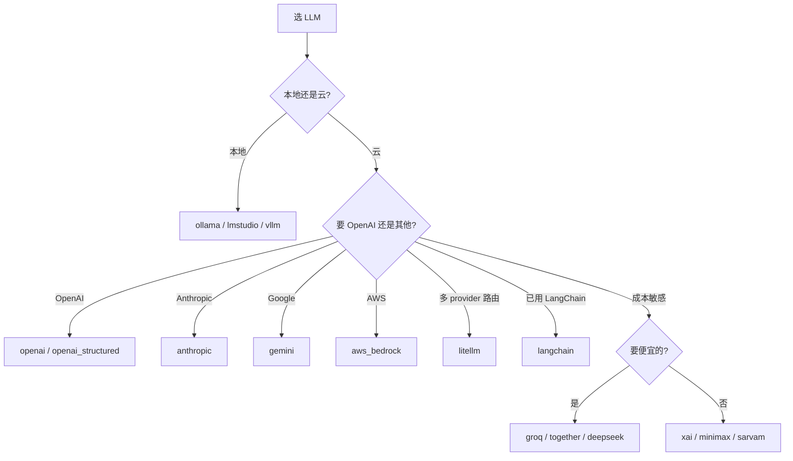

# 02 — LLM Providers（21 个）

> 21 个 LLM provider 都继承 `LLMBase`,但每个有独特适配。本篇对比代表性 provider 的实现差异、特殊处理、和默认配置。

---

## 1. Provider 全清单

| Provider | 类 | 默认 model | Config | 特殊处理 |
|---------|---|----------|--------|---------|
| `openai` | `OpenAILLM` | `gpt-5-mini` | `OpenAIConfig` | OpenRouter 支持、reasoning 自动检测 |
| `anthropic` | `AnthropicLLM` | `claude-sonnet-4-6` | `AnthropicConfig` | sampling 参数检测、temperature/top_p 冲突解决 |
| `gemini` | `GeminiLLM` | `gemini-1.5-flash-latest` | `GeminiConfig` | Google AI SDK |
| `aws_bedrock` | `AWSBedrockLLM` | — | `AWSBedrockConfig` | boto3 auth |
| `azure_openai` | `AzureOpenAILLM` | — | `AzureOpenAIConfig` | deployment/endpoint/api_version |
| `azure_openai_structured` | `AzureOpenAIStructuredLLM` | — | `AzureOpenAIConfig` | structured output |
| `openai_structured` | `OpenAIStructuredLLM` | — | `OpenAIConfig` | structured output |
| `deepseek` | `DeepSeekLLM` | `deepseek-chat` | `DeepSeekConfig` | — |
| `groq` | `GroqLLM` | — | `BaseLlmConfig` | fast GroqCloud |
| `together` | `TogetherLLM` | — | `BaseLlmConfig` | open models |
| `litellm` | `LiteLLM` | — | `BaseLlmConfig` | 多 provider 路由 |
| `ollama` | `OllamaLLM` | `llama3.1:70b` | `OllamaConfig` | 本地、自动 pull |
| `lmstudio` | `LMStudioLLM` | — | `LMStudioConfig` | 本地 REST |
| `vllm` | `VllmLLM` | — | `VllmConfig` | vLLM server |
| `xai` | `XAILLM` | `grok-beta` | `XAIConfig` | xAI Grok |
| `minimax` | `MiniMaxLLM` | — | `MinimaxConfig` | 中国大模型 |
| `sarvam` | `SarvamLLM` | — | `BaseLlmConfig` | 印度多语言 |
| `langchain` | `LangchainLLM` | — | `BaseLlmConfig` | 包装 LangChain LLM |

> 实际 18 个 key,但部分有 alias（`openai_structured` 算独立条目）。AGENTS.md 说 21 个,差异在统计口径（含子变体）。

---

## 2. 通用实现模板

```python
class XLLM(LLMBase):
    def __init__(self, config=None):
        # 1. 转 provider-specific config
        if config is None:
            config = XConfig()
        elif isinstance(config, dict):
            config = XConfig(**config)
        elif isinstance(config, BaseLlmConfig) and not isinstance(config, XConfig):
            config = XConfig(
                model=config.model, temperature=config.temperature,
                api_key=config.api_key, ...,
            )

        super().__init__(config)

        # 2. 默认 model
        if not self.config.model:
            self.config.model = "default-model-name"

        # 3. 初始化 provider client
        api_key = self.config.api_key or os.getenv("X_API_KEY")
        self.client = XSDK(api_key=api_key)

    def generate_response(self, messages, tools=None, tool_choice="auto", **kwargs):
        params = self._get_supported_params(messages=messages, **kwargs)
        params.update({"model": self.config.model, "messages": messages})

        if tools:
            params["tools"] = tools
            params["tool_choice"] = tool_choice

        response = self.client.chat.create(**params)
        return self._parse_response(response, tools)
```

---

## 3. ⭐ OpenAILLM 详解（最经典）

```python
class OpenAILLM(LLMBase):
    def __init__(self, config=None):
        # ... config 转换 ...

        if not self.config.model:
            self.config.model = "gpt-5-mini"

        # ⭐ OpenRouter 特殊路径
        if os.environ.get("OPENROUTER_API_KEY"):
            self.client = OpenAI(
                api_key=os.environ.get("OPENROUTER_API_KEY"),
                base_url="https://openrouter.ai/api/v1",
            )
        else:
            api_key = self.config.api_key or os.getenv("OPENAI_API_KEY")
            base_url = self.config.openai_base_url or os.getenv("OPENAI_BASE_URL") or "https://api.openai.com/v1"
            self.client = OpenAI(api_key=api_key, base_url=base_url)

    def generate_response(self, messages, response_format=None, tools=None, tool_choice="auto", **kwargs):
        params = self._get_supported_params(messages=messages, **kwargs)
        params.update({"model": self.config.model, "messages": messages})

        # OpenRouter 特殊参数
        if os.getenv("OPENROUTER_API_KEY"):
            if self.config.models:
                params["models"] = self.config.models
                params["route"] = self.config.route
                params.pop("model")
            if self.config.site_url and self.config.app_name:
                params["extra_headers"] = {
                    "HTTP-Referer": self.config.site_url,
                    "X-Title": self.config.app_name,
                }
        else:
            # 普通 OpenAI:可选 store 参数
            if self.config.store is not None:
                params["store"] = self.config.store

        if response_format:
            params["response_format"] = response_format
        if tools:
            params["tools"] = tools
            params["tool_choice"] = tool_choice

        response = self.client.chat.completions.create(**params)

        # ⭐ response callback hook（钩子机制）
        if self.config.response_callback:
            try:
                self.config.response_callback(self, response, params)
            except Exception as e:
                logging.error(f"Error due to callback: {e}")

        return self._parse_response(response, tools)
```

### OpenAI 特殊功能

| 功能 | 用法 |
|------|------|
| **OpenRouter** 多 model 路由 | 设 `OPENROUTER_API_KEY` env 即自动切 |
| **自定义 base_url** | `OPENAI_BASE_URL` env 或 `config.openai_base_url` |
| **response_callback** | config 里传 callback,每次响应调用（用于 logging） |
| **store 参数** | 显式控制 OpenAI 是否存训练（privacy 用） |
| **structured output** | 用 `openai_structured` provider 而非 openai |

---

## 4. ⭐ AnthropicLLM 的特殊处理

```python
class AnthropicLLM(LLMBase):
    def _enable_sampling_parameters(self):
        """Return whether the configured model supports sampling parameters."""
        explicit = getattr(self.config, "enable_sampling_parameters", None)
        if explicit is not None:
            return explicit

        # 按 family/major/minor 启发式判断
        model_name = self.config.model.lower()
        # 例: "claude-sonnet-4-6" → family=sonnet, major=4, minor=6
        model_name_parts = model_name.rsplit("[", 1)[0].split("-")
        _, family, major, minor, *_ = (*model_name_parts, "", "", "", "")

        family = family or model_name
        major = int(major) if major.isdigit() else None
        minor = int(minor) if minor.isdigit() else None

        if family == "haiku":
            return True
        if family == "sonnet" and major is not None:
            return major < 5     # sonnet-4- 不支持 sampling
        if family == "opus" and major is not None and minor is not None:
            return (major, minor) < (4, 7)  # opus-4.6 以下支持

        return False

    def _get_common_params(self, **kwargs):
        """⭐ Anthropic 拒绝 temperature 和 top_p 同时存在"""
        params = {}
        if self.config.max_tokens is not None:
            params["max_tokens"] = self.config.max_tokens
        # ... 复杂逻辑处理冲突
```

### Anthropic 独特约束

- `temperature` 和 `top_p` 不能同时给
- 不同 family/版本对 sampling 参数支持不同
- 不同 model 用不同 system prompt 处理（Anthropic 把 system 单独传）

---

## 5. ⭐ OllamaLLM（本地 LLM）

```python
class OllamaLLM(LLMBase):
    def __init__(self, config=None):
        # ...
        if not self.config.model:
            self.config.model = "llama3.1:70b"

        self.client = Client(host=self.config.ollama_base_url)
```

### 本地特性

- 默认 `llama3.1:70b`（大模型,需要本地显存）
- 通过 `ollama_base_url` 连本地 ollama server
- 无需 api_key
- 第一次用某 model 时会自动下载（pull）

---

## 6. LLM Selection 决策树



---

## 7. 选 model 的考量

| 用途 | 推荐 provider | 推荐 model |
|------|------------|----------|
| 默认（开箱即用） | openai | `gpt-5-mini` |
| 高质量抽取 | anthropic | `claude-sonnet-4-6` |
| 隐私敏感 | ollama | `llama3.1:70b` |
| 成本最低 | groq | `llama-3.3-70b-versatile` |
| 多语言 | sarvam | `sarvam-1` |
| 已有 Azure 投入 | azure_openai | `gpt-5` |
| 实验新 model | xai | `grok-beta` |

---

## 8. Config 字段对比

各 provider config 在 `BaseLlmConfig` 基础上加自有字段：

```python
# 通用字段（BaseLlmConfig）
model, temperature, api_key, max_tokens, top_p, top_k,
enable_vision, vision_details, http_client_proxies,
reasoning_effort, is_reasoning_model

# OpenAIConfig 加
openai_base_url, openrouter_base_url, models, route,
site_url, app_name, store, response_callback

# AnthropicConfig 加
anthropic_base_url, enable_sampling_parameters

# OllamaConfig 加
ollama_base_url

# AWSBedrockConfig 加
aws_access_key_id, aws_secret_access_key, aws_region
```

---

## 9. 一个完整 example

```python
from mem0 import Memory
from mem0.configs.base import MemoryConfig
from mem0.configs.llms.anthropic import AnthropicConfig
from mem0.configs.embeddings.base import EmbedderConfig
from mem0.configs.vector_stores.configs import VectorStoreConfig

config = MemoryConfig(
    llm=AnthropicConfig(
        model="claude-sonnet-4-6",
        api_key="sk-ant-...",
        temperature=0.0,
        max_tokens=4096,
    ),
    embedder=EmbedderConfig(
        provider="openai",
        model="text-embedding-3-large",
        api_key="sk-...",
    ),
    vector_store=VectorStoreConfig(
        provider="qdrant",
        host="localhost",
        port=6333,
        collection_name="my_memories",
        embedding_model_dims=3072,   # text-embedding-3-large
    ),
)
m = Memory(config=config)
```

---

## 10. 接下来

| 想看 | 去哪 |
|------|------|
| 抽象基类设计 | [`01-base-pattern.md`](./01-base-pattern.md) §3 |
| Factory 注册机制 | [`07-factory.md`](./07-factory.md) |
| add() 怎么调 LLM | [`../01-py-sdk-core/06-add-pipeline.md`](../01-py-sdk-core/06-add-pipeline.md) §Phase 2 |
| 各 provider config 字段 | 源码 `mem0/configs/llms/<provider>.py` |

---

📌 **下一步** → [`03-embeddings.md`](./03-embeddings.md) 15 个 embedding provider。
