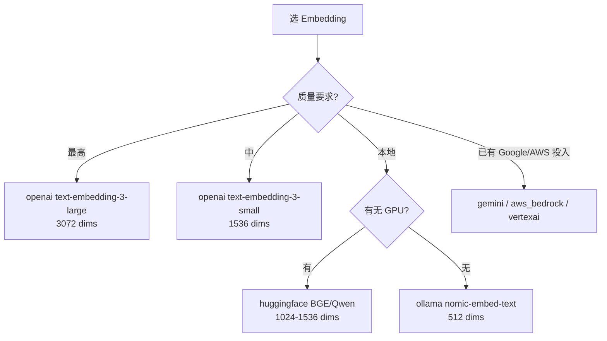

# 03 — Embedding Providers（15 个）

> 15 个 embedding provider 都继承 `EmbeddingBase`。本篇对比代表性 provider 的实现,以及 batch embedding 的性能差异。

---

## 1. Provider 全清单

| Provider | 类 | 默认 model | 默认 dims | 特殊 |
|---------|---|----------|---------|------|
| `openai` | `OpenAIEmbedding` | `text-embedding-3-small` | 1536 | 原生 batch API（100 chunk） |
| `azure_openai` | `AzureOpenAIEmbedding` | — | 1536 | Azure endpoint |
| `huggingface` | `HuggingFaceEmbedding` | `multi-qa-MiniLM-L6-cos-v1` | model-dependent | 双模式（local / TEI endpoint） |
| `ollama` | `OllamaEmbedding` | `nomic-embed-text` | 512 | 本地、自动 pull |
| `gemini` | `GoogleGenAIEmbedding` | — | — | Google AI |
| `vertexai` | `VertexAIEmbedding` | — | — | Vertex AI |
| `together` | `TogetherEmbedding` | — | — | Together.ai |
| `lmstudio` | `LMStudioEmbedding` | — | — | 本地 REST |
| `langchain` | `LangchainEmbedding` | — | — | 包装 LangChain embedder |
| `aws_bedrock` | `AWSBedrockEmbedding` | — | — | AWS Bedrock |
| `fastembed` | `FastEmbedEmbedding` | — | — | 本地轻量（Qdrant） |

> AGENTS.md 说 15 个,实际 `provider_to_class` 有 11 个 key,差异可能是 mock/langchain 别名。

---

## 2. ⭐ OpenAIEmbedding（带原生 batch）

```python
class OpenAIEmbedding(EmbeddingBase):
    def __init__(self, config=None):
        super().__init__(config)
        self.config.model = self.config.model or "text-embedding-3-small"

        # ⭐ 只在用户设了 embedding_dims 时才传 dimensions 给 API
        # （OpenAI-compatible backend 如 vLLM/Voyage 拒绝该参数）
        self._pass_dimensions_to_api = self.config.embedding_dims is not None
        self.config.embedding_dims = self.config.embedding_dims or 1536

        api_key = self.config.api_key or os.getenv("OPENAI_API_KEY")
        base_url = self.config.openai_base_url or os.getenv("OPENAI_BASE_URL") or "https://api.openai.com/v1"
        self.client = OpenAI(api_key=api_key, base_url=base_url)

    def embed(self, text, memory_action=None):
        text = text.replace("\n", " ")   # ⭐ 换行替换为空格
        kwargs = {"input": [text], "model": self.config.model, "encoding_format": "float"}
        if self._pass_dimensions_to_api:
            kwargs["dimensions"] = self.config.embedding_dims
        return self.client.embeddings.create(**kwargs).data[0].embedding

    def embed_batch(self, texts, memory_action="add"):
        """⭐ override 用原生 batch API,自动 chunk 成 100 一组"""
        MAX_BATCH = 100
        texts = [text.replace("\n", " ") for text in texts]
        all_embeddings = []
        for i in range(0, len(texts), MAX_BATCH):
            chunk = texts[i : i + MAX_BATCH]
            kwargs = {"input": chunk, "model": self.config.model, "encoding_format": "float"}
            if self._pass_dimensions_to_api:
                kwargs["dimensions"] = self.config.embedding_dims
            response = self.client.embeddings.create(**kwargs)
            all_embeddings.extend(item.embedding for item in sorted(response.data, key=lambda x: x.index))
        return all_embeddings
```

### OpenAI 特殊点

- **Matryoshka representation**：`text-embedding-3-large` 支持 `dimensions` 参数（输出截短到指定维度）
- **API 限制**：单次最多 100 个 input,所以 batch 要 chunk
- **响应顺序**：按 `index` 排序（API 不保证返回顺序）
- **`\n` → 空格**：API 对换行敏感

---

## 3. ⭐ HuggingFaceEmbedding（双模式）

```python
class HuggingFaceEmbedding(EmbeddingBase):
    def __init__(self, config=None):
        super().__init__(config)

        if self.config.huggingface_base_url:
            # 模式 1: HF Inference Endpoint（TEI - Text Embeddings Inference）
            # 用 OpenAI client 协议
            self.client = OpenAI(base_url=self.config.huggingface_base_url, api_key=self.config.api_key)
            self.config.model = self.config.model or "tei"
        else:
            # 模式 2: 本地 sentence-transformers
            self.config.model = self.config.model or "multi-qa-MiniLM-L6-cos-v1"
            self.model = SentenceTransformer(self.config.model, **self.config.model_kwargs)
            self.config.embedding_dims = self.config.embedding_dims or self.model.get_sentence_embedding_dimension()

    def embed(self, text, memory_action=None):
        if self.config.huggingface_base_url:
            return self.client.embeddings.create(
                input=text, model=self.config.model, **self.config.model_kwargs
            ).data[0].embedding
        else:
            return self.model.encode(text, convert_to_numpy=True).tolist()
```

### 双模式

| 模式 | 触发 | 用途 |
|------|------|------|
| **TEI endpoint** | 设 `huggingface_base_url` | 生产部署,API 调用 |
| **本地 SentenceTransformer** | 不设 base_url | 开发/隐私/无网络 |

---

## 4. ⭐ OllamaEmbedding（自动 pull）

```python
class OllamaEmbedding(EmbeddingBase):
    def __init__(self, config=None):
        super().__init__(config)
        self.config.model = self.config.model or "nomic-embed-text"
        self.config.embedding_dims = self.config.embedding_dims or 512

        self.client = Client(host=self.config.ollama_base_url)
        self._ensure_model_exists()   # ⭐ 自动 pull

    def _ensure_model_exists(self):
        """如果本地没有,自动 pull。"""
        local_models = self.client.list()["models"]
        target = self._normalize_model_name(self.config.model)
        if not any(
            self._normalize_model_name(model.get("name", "")) == target
            or self._normalize_model_name(model.get("model", "")) == target
            for model in local_models
        ):
            self.client.pull(self.config.model)   # 下载

    def embed(self, text, memory_action=None):
        response = self.client.embed(model=self.config.model, input=text)
        embeddings = response.get("embeddings") or []
        if not embeddings:
            raise ValueError(f"Ollama embed() returned no embeddings for model '{self.config.model}'")
        return embeddings[0]

    def embed_batch(self, texts, memory_action="add"):
        """⭐ Ollama 原生支持 list input"""
        if not texts:
            return []
        response = self.client.embed(model=self.config.model, input=texts)
        embeddings = response.get("embeddings") or []
        return embeddings
```

---

## 5. `embed_batch` 性能差异（重要！）

| Provider | embed_batch 实现 | 100 条文本耗时（估算） |
|---------|----------------|------------------|
| `openai` | 1 次 API（chunk 100） | ~500ms |
| `huggingface` (TEI) | 1 次 API | ~500ms |
| `huggingface` (local) | 本地批量 | ~50-200ms（GPU 快） |
| `ollama` | 1 次 API（原生 list） | ~1s（CPU）/ 200ms（GPU） |
| 默认 fallback | 循环调 embed 100 次 | **5000ms+**（10 倍慢） |

> ⚠️ **没 override embed_batch 的 provider 性能差 10 倍**。add() Phase 3 / Phase 7b 大量依赖 batch embed,选 provider 时要确认。

---

## 6. `memory_action` 参数（多数忽略）

```python
def embed(self, text, memory_action: Optional[Literal["add", "search", "update"]] = None):
```

| Provider | 怎么处理 |
|---------|---------|
| openai / anthropic / 大多数 | 忽略 |
| 部分 voyage / cohere | "add" 用一个 model,"search" 用另一个 |
| 双编码模型 | "add" 加 prefix "passage:","search" 加 "query:" |

> 当前 OSS 大多数 provider 忽略这个参数。如果用不对称 embedding（如 BGE），需要自己 override。

---

## 7. 选 Embedding 决策树



---

## 8. 推荐配置示例

### 高质量云

```python
config = MemoryConfig(
    embedder=EmbedderConfig(
        provider="openai",
        model="text-embedding-3-large",
        api_key="sk-...",
        embedding_dims=3072,
    ),
    vector_store=VectorStoreConfig(
        provider="qdrant",
        embedding_model_dims=3072,   # ⚠️ 必须一致
        ...
    ),
)
```

### 隐私本地

```python
config = MemoryConfig(
    embedder=EmbedderConfig(
        provider="huggingface",
        model="BAAI/bge-large-en-v1.5",
    ),
    llm=OllamaConfig(model="llama3.1:70b"),
    vector_store=VectorStoreConfig(
        provider="chroma",  # 或 faiss
        embedding_model_dims=1024,  # BGE-large 维度
    ),
)
```

### 极简本地

```python
config = MemoryConfig(
    embedder=EmbedderConfig(provider="ollama"),  # nomic-embed-text, 512 dims
    llm=OllamaConfig(model="llama3.1:70b"),
    vector_store=VectorStoreConfig(
        provider="qdrant",
        path="~/.mem0/qdrant",  # 本地
        embedding_model_dims=512,
    ),
)
```

---

## 9. dims 必须一致！

**最常见的 bug**：embedder 输出维度 ≠ vector_store 配置维度,导致 insert 失败。

```python
# ❌ 错：dims 不一致
config = MemoryConfig(
    embedder=EmbedderConfig(model="text-embedding-3-small"),  # 1536
    vector_store=VectorStoreConfig(
        provider="qdrant",
        embedding_model_dims=3072,   # 错!
    ),
)

# ✅ 对
config = MemoryConfig(
    embedder=EmbedderConfig(
        model="text-embedding-3-small",
        embedding_dims=1536,
    ),
    vector_store=VectorStoreConfig(
        provider="qdrant",
        embedding_model_dims=1536,
    ),
)
```

---

## 10. 接下来

| 想看 | 去哪 |
|------|------|
| Vector Store 配合 embedder | [`04-vector-stores.md`](./04-vector-stores.md) |
| add() 怎么用 embedder | [`../01-py-sdk-core/06-add-pipeline.md`](../01-py-sdk-core/06-add-pipeline.md) §Phase 3 |
| 抽象基类 | [`01-base-pattern.md`](./01-base-pattern.md) §4 |

---

📌 **下一步** → [`04-vector-stores.md`](./04-vector-stores.md) 28 个 vector store。
