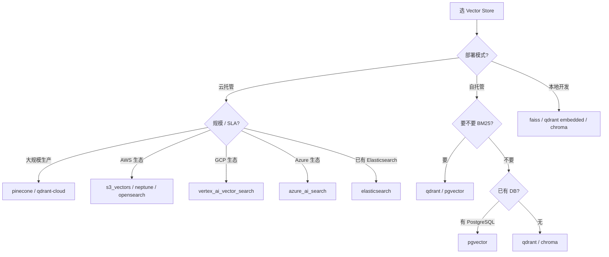

# 04 — Vector Store Providers（28 个）

> 28 个 vector store provider,实现 `VectorStoreBase` 的 12 个 abstract + 2 个 optional。
> 本篇对比代表性 provider 的连接方式、BM25 支持、性能特征。

---

## 1. Provider 全清单（按类别）

### 云托管（managed）

| Provider | 类 | BM25 | 特点 |
|---------|---|------|------|
| `pinecone` | `PineconeDB` | ✅（pinecone-text） | serverless / pod,namespace |
| `weaviate` | `Weaviate` | ✅ | 内置 hybrid |
| `mongodb` | `MongoDB` | ✅ | Atlas Vector Search |
| `redis` | `RedisDB` | ✅ | RediSearch |
| `valkey` | `ValkeyDB` | ✅ | Redis fork |
| `elasticsearch` | `ElasticsearchDB` | ✅ | 原生 BM25 |
| `opensearch` | `OpenSearchDB` | ✅ | ES fork |
| `databricks` | `Databricks` | ✅ | Databricks Vector Search |
| `vertex_ai_vector_search` | `GoogleMatchingEngine` | — | Google |
| `azure_ai_search` | `AzureAISearch` | ✅ | Azure |
| `supabase` | `Supabase` | ✅ | pgvector 包装 |
| `turbopuffer` | `TurbopufferDB` | ✅ | S3-based |
| `s3_vectors` | `S3Vectors` | — | AWS S3 Vectors |
| `upstash_vector` | `UpstashVector` | ✅ | serverless Redis |
| `cassandra` | `CassandraDB` | ✅ | Cassandra 5+ |
| `neptune` | `NeptuneAnalyticsVector` | — | AWS Neptune Analytics |
| `baidu` | `BaiduDB` | — | 百度 ElasticSearch |

### 自托管 / 本地

| Provider | 类 | BM25 | 特点 |
|---------|---|------|------|
| `qdrant` | `Qdrant` | ✅（fastembed Qdrant/bm25） | 本地 / server,dual mode |
| `chroma` | `ChromaDB` | — | 嵌入式 |
| `pgvector` | `PGVector` | ✅ | PostgreSQL + pgvector |
| `azure_mysql` | `AzureMySQL` | — | Azure MySQL |
| `milvus` | `MilvusDB` | ✅ | Milvus / Zilliz |
| `faiss` | `FAISS` | ❌ | 本地文件 |
| `oracledb` | `OracleAIVectorSearch` | ✅ | Oracle 23ai |

### 包装器

| Provider | 类 | 用途 |
|---------|---|------|
| `langchain` | `Langchain` | 包装 LangChain VectorStore |

---

## 2. ⭐ Qdrant（推荐默认）

```python
class Qdrant(VectorStoreBase):
    def __init__(
        self,
        collection_name: str,
        embedding_model_dims: int,
        client: QdrantClient = None,
        host=None, port=None, path=None, url=None, api_key=None,
        https: bool | None = None,
        on_disk: bool = False,
    ):
        # 三种连接方式
        if client:
            self.client = client          # 复用现有 client（entity_store 共享）
            self.is_local = False
        else:
            params = {}
            if api_key: params["api_key"] = api_key
            if url: params["url"] = url
            if host and port:
                params["host"] = host
                params["port"] = port
            if https is not None: params["https"] = https

            if not params:
                params["path"] = path      # 本地 embedded
                self.is_local = True
            else:
                self.is_local = False

            self.client = QdrantClient(**params)

        # ...
        self._bm25_encoder = None
        self._has_bm25_slot = False   # ⚠️ v3 之前的 collection 没 bm25 sparse slot
        self.create_col(embedding_model_dims, on_disk)

    def _get_bm25_encoder(self):
        """懒加载 fastembed BM25 sparse encoder"""
        if self._bm25_encoder is None:
            try:
                from fastembed import SparseTextEmbedding
                self._bm25_encoder = SparseTextEmbedding(model_name="Qdrant/bm25")
            except ImportError:
                logger.warning('fastembed not installed - BM25 disabled. Install with: pip install "mem0ai[extras]"')
                self._bm25_encoder = False   # sentinel
        return self._bm25_encoder if self._bm25_encoder is not False else None
```

### Qdrant 三种连接模式

| 模式 | 配置 | 用途 |
|------|------|------|
| Embedded（本地文件） | `path="/path/to/qdrant"` | 开发、测试 |
| Self-hosted server | `host="localhost" port=6333` | 自托管生产 |
| Qdrant Cloud | `url="https://..." api_key="..."` | 托管 |

### BM25 实现

Qdrant 用 `fastembed` 的 `Qdrant/bm25` 模型把文本转 sparse vector,存进 collection 的 `bm25` sparse_vectors slot。`keyword_search` 时把 query 转 sparse,用 Qdrant 原生 sparse 检索。

> ⚠️ v3 之前的 Qdrant collection 没 bm25 slot,Mem0 自动检测并降级到 semantic-only（`_has_bm25_slot` flag）。

---

## 3. ⭐ FAISS（本地文件）

```python
class FAISS(VectorStoreBase):
    def __init__(self, collection_name, embedding_model_dims, ...):
        # FAISS 用文件持久化
        # ⭐ SafeUnpickler 防恶意 pickle
        ...
```

### FAISS 安全设计

`SafeUnpickler` 限制 pickle 反序列化只允许 `dict/list/str/int/float/bool/tuple/set/frozenset/NoneType` —— 防止恶意 docstore 文件执行任意代码：

```python
class SafeUnpickler(pickle.Unpickler):
    SAFE_MODULES = frozenset({"builtins", "__builtin__"})
    SAFE_NAMES = frozenset({"dict", "list", "str", "int", "float", "bool", "tuple", "set", "frozenset", "NoneType"})

    def find_class(self, module, name):
        if module in self.SAFE_MODULES and name in self.SAFE_NAMES:
            ...
        raise pickle.UnpicklingError(f"Unsafe pickle: attempted to load '{module}.{name}'.")
```

### FAISS 限制

- ❌ **无 BM25**（默认 `keyword_search` 返回 None）
- ❌ 无 server 模式（纯文件）
- ❌ 无并发写
- ✅ 极快（in-memory index）
- ✅ 零依赖（faiss-cpu）

> FAISS 仅适合本地开发/测试。生产用 Qdrant/Pinecone 等带 server 的。

---

## 4. ⭐ Pinecone（云托管）

```python
class PineconeDB(VectorStoreBase):
    def __init__(
        self, collection_name, embedding_model_dims,
        client=None, api_key=None, environment=None,
        serverless_config=None, pod_config=None,
        hybrid_search=False, metric="cosine",
        batch_size=100, extra_params=None,
        namespace=None,
    ):
        if client:
            self.client = client
        else:
            api_key = api_key or os.environ.get("PINECONE_API_KEY")
            self.client = Pinecone(api_key=api_key, **(extra_params or {}))

        # ...
        self.hybrid_search = hybrid_search
        self.namespace = namespace

        self.sparse_encoder = None
        if self.hybrid_search:
            try:
                from pinecone_text.sparse import BM25Encoder
                self.sparse_encoder = BM25Encoder.default()
            except ImportError:
                logger.warning("pinecone-text not installed. Hybrid search will be disabled.")
                self.hybrid_search = False

        self.create_col(embedding_model_dims, metric)
```

### Pinecone 特色

- **Serverless** vs **Pod** 两种部署
- **Namespace**（同一 index 内的命名空间,类似 collection）
- **Hybrid search** 用 `pinecone-text` 的 BM25Encoder
- **metric** 选项：`cosine` / `euclidean` / `dotproduct`

---

## 5. ⭐ Vector Store 关键约定：score ∈ [0, 1]

```python
# mem0/vector_stores/base.py
def search(self, query, vectors, top_k=5, filters=None):
    """All implementations must return similarity scores where higher values
    indicate greater similarity (range [0, 1] preferred). Implementations
    using distance metrics must convert to similarity before returning:
    - Cosine distance: score = max(0.0, 1.0 - distance)
    - L2 distance: score = 1.0 / (1.0 + distance)
    - Inner product: score = value (already higher = better)
    """
```

| Provider | 原生 metric | 转 similarity |
|---------|-----------|--------------|
| Qdrant | Cosine distance | `1.0 - distance` |
| Pinecone | Cosine / Euclidean / Dotproduct | 各自转换 |
| FAISS | L2 / Inner Product | L2: `1/(1+dist)`,IP: 直接 |
| pgvector | `<=>` (cosine distance) | `1 - distance` |
| Elasticsearch | `_score`（BM25/dense） | dense: 自定义 |

> 这个约定让上层 `score_and_rank` 能**直接相加**不同 provider 的 score。

---

## 6. BM25 支持矩阵

| Provider | 怎么实现 BM25 |
|---------|--------------|
| `qdrant` | fastembed `Qdrant/bm25` sparse vector + sparse slot |
| `pinecone` | `pinecone-text.BM25Encoder`（要装 `hybrid_search=True`） |
| `elasticsearch` | 原生（ES 就是 BM25 起家） |
| `opensearch` | 同 ES |
| `pgvector` | `ts_vector` + `ts_query`（PostgreSQL 全文搜索） |
| `redis` | RediSearch |
| `mongodb` | Atlas Search |
| `weaviate` | 内置 hybrid（BM25 + vector） |
| `milvus` | 2.4+ 内置 BM25 |
| `faiss` | ❌ 不支持（默认 `keyword_search` 返 None） |
| `chroma` | ❌ 不支持 |

> ❌ 不支持 BM25 的 provider,search 会自动降级到 **semantic-only**（详见 `Memory.__init__` 的 warn 逻辑）。

---

## 7. 选 Vector Store 决策树



---

## 8. 推荐配置示例

### 推荐：Qdrant self-hosted + BM25

```python
config = MemoryConfig(
    vector_store=VectorStoreConfig(
        provider="qdrant",
        host="localhost",
        port=6333,
        collection_name="mem0",
        embedding_model_dims=1536,
    ),
)
# 装 fastembed 启用 BM25: pip install mem0ai[extras]
```

### 已有 PostgreSQL

```python
config = MemoryConfig(
    vector_store=VectorStoreConfig(
        provider="pgvector",
        dbname="mydb",
        collection_name="mem0",
        embedding_model_dims=1536,
        host="localhost",
        port=5432,
        user="postgres",
        password="...",
    ),
)
```

### Pinecone serverless

```python
config = MemoryConfig(
    vector_store=VectorStoreConfig(
        provider="pinecone",
        api_key="...",
        collection_name="mem0",
        embedding_model_dims=1536,
        serverless_config={"cloud": "AWS", "region": "us-east-1"},
        hybrid_search=True,   # 启用 BM25
    ),
)
```

---

## 9. Abstract method 实现复杂度对比

| Method | Qdrant | Pinecone | FAISS |
|--------|--------|---------|-------|
| `create_col` | QdrantClient.create_collection | Pinecone.create_index | faiss.IndexFlatL2 |
| `insert` | client.upsert | index.upsert(vectors) | index.add + docstore pickle |
| `search` | client.search | index.query | index.search + 距离转换 |
| `keyword_search` | sparse vector search | BM25Encoder + query | None |
| `delete` | client.delete | index.delete | docstore del + re-pickle |
| `update` | client.update | index.update | docstore update + re-pickle |
| `get` | client.retrieve | index.fetch | docstore[id] |
| `list_cols` | client.get_collections | list_indexes | 文件 ls |
| `list` | client.scroll | index.query (无向量) | docstore 遍历 |
| `reset` | delete_col + create_col | delete_index + create | 清空文件 |

> FAISS / Chroma 等本地的实现都涉及**docstore 同步**——FAISS index 本身只存向量不存 payload,docstore 用单独的 pickle/json 文件存 metadata。

---

## 10. 一个常见坑：collection 已存在

```python
# 第一次跑：collection 不存在,create_col 创建
m = Memory()   # 默认 collection_name="mem0"

# 第二次跑（dims 变了）：
config = MemoryConfig(
    vector_store=VectorStoreConfig(
        collection_name="mem0",   # 同名!
        embedding_model_dims=3072,  # 改了 dims
    ),
)
m = Memory(config=config)
# ❌ 错：collection 已存在 with 1536 dims,新插入 3072 dims 会失败
```

**解决**：换 collection 名 或 `m.reset()`。

---

## 11. 接下来

| 想看 | 去哪 |
|------|------|
| 抽象 12 方法 | [`01-base-pattern.md`](./01-base-pattern.md) §5 |
| Factory 注册 | [`07-factory.md`](./07-factory.md) §5 |
| search() 怎么用 | [`../01-py-sdk-core/07-search-pipeline.md`](../01-py-sdk-core/07-search-pipeline.md) |
| Server 用 pgvector | [`../05-server/01-architecture.md`](../05-server/01-architecture.md) |

---

📌 **下一步** → [`06-rerankers.md`](./06-rerankers.md) 5 个 reranker。
