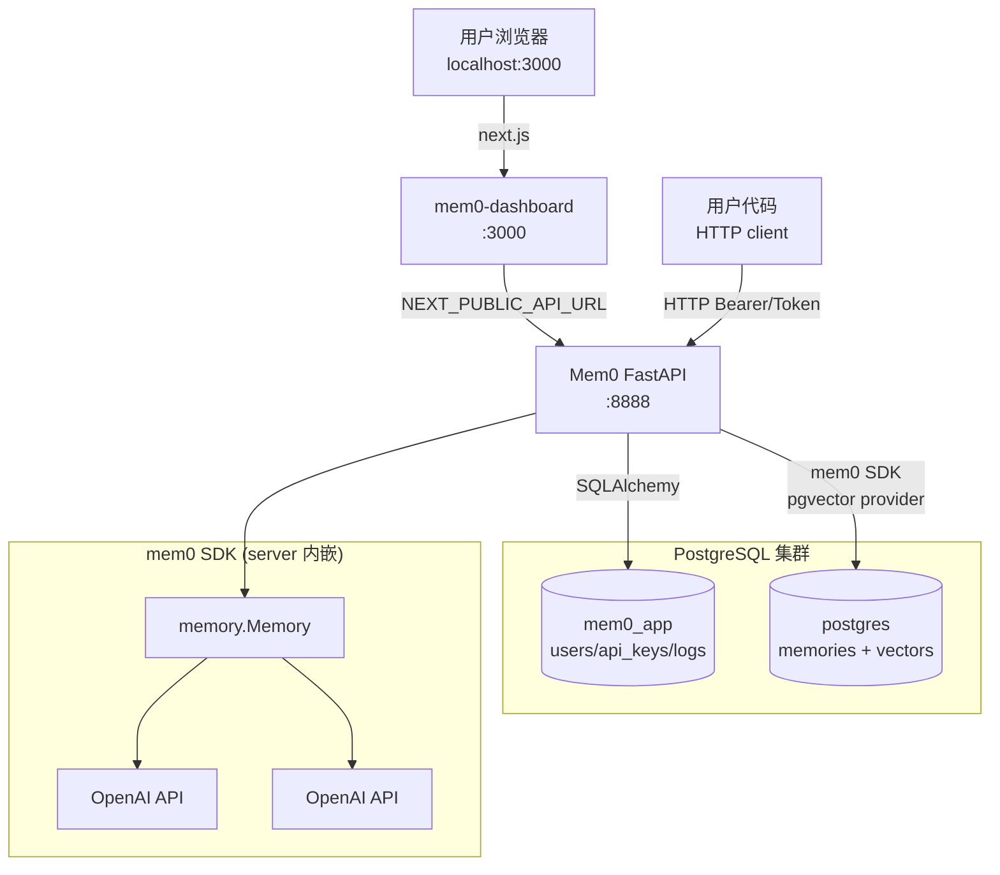

# 01 — Server 架构 + Endpoints + Docker Compose

> Server 是"第三条路"——把 OSS SDK 包装成 REST API,带完整 auth/dashboard/PostgreSQL。
> 本篇讲清架构、所有 endpoint、docker-compose 服务编排。

---

## 1. 整体架构



### 关键设计

- **PostgreSQL 一物两用**：
  - `mem0_app` DB 存 server 自己的元数据（users/api_keys/logs/settings）
  - 默认 `postgres` DB 给 Mem0 SDK 当 vector store（pgvector）
- **Server 是 SDK 的"宿主"**：`from mem0 import Memory` import 后,server 用它处理业务逻辑
- **Dashboard 独立部署**：Next.js 子项目（`server/dashboard/`）

---

## 2. 文件结构

```
server/
├── main.py                # ⭐ FastAPI app + 路由注册 + 配置加载（560 行）
├── auth.py                # ⭐ JWT + API Key + bcrypt
├── db.py                  # SQLAlchemy engine
├── models.py              # ⭐ ORM: User/APIKey/RequestLog/RefreshTokenJti/Settings
├── schemas.py             # Pydantic schemas（极简）
├── errors.py              # 异常 + 全局 logging
├── rate_limit.py          # slowapi 限流
├── server_state.py        # 全局 Memory 实例 + config
├── telemetry.py           # 服务端遥测
├── init-db.sh             # PostgreSQL 启动时跑
├── alembic/               # DB migration
├── alembic.ini            # alembic 配置
├── routers/               # ⭐ API 路由
│   ├── api_keys.py        # /api-keys CRUD
│   ├── auth.py            # /auth login/register/refresh
│   ├── entities.py        # /entities
│   └── requests.py        # /requests 日志查询
├── scripts/
│   ├── seed.sh            # 创建 admin + API key
│   ├── reset_admin_password.py
│   └── prune_request_logs.py
├── dashboard/             # ⭐ Next.js 独立子项目
├── Dockerfile             # 生产镜像
├── dev.Dockerfile         # 开发镜像（mount 源码）
├── docker-compose.yaml    # 3 服务编排
├── Makefile               # up/down/seed/bootstrap/...
└── requirements.txt       # Python 依赖
```

---

## 3. ⭐ 数据模型（`models.py`）

5 个 SQLAlchemy ORM 表：

### `users`

| 列 | 类型 | 说明 |
|---|------|-----|
| `id` | UUID PK | |
| `name` | VARCHAR(255) | |
| `email` | VARCHAR(255) unique indexed | |
| `password_hash` | TEXT | bcrypt |
| `role` | VARCHAR(20) default `'admin'` | |
| `created_at` | DateTime | |
| `last_login_at` | DateTime nullable | |

### `api_keys`

| 列 | 类型 | 说明 |
|---|------|-----|
| `id` | UUID PK | |
| `key_prefix` | VARCHAR(12) | 显示用（前 12 字符） |
| `key_hash` | TEXT | bcrypt hash |
| `label` | VARCHAR(255) | 用户给 key 起的名字 |
| `created_by` | FK users.id CASCADE | |
| `last_used_at` | DateTime nullable | |
| `revoked_at` | DateTime nullable | |
| `created_at` | DateTime | |

> API key 格式：`m0sk_<32 chars>`。客户端只看一次完整 key,server 只存 hash。

### `request_logs`

| 列 | 类型 | 说明 |
|---|------|-----|
| `id` | UUID PK | |
| `method` | VARCHAR(16) | GET/POST/... |
| `path` | VARCHAR(512) | URL path |
| `status_code` | INT | HTTP status |
| `latency_ms` | FLOAT | |
| `auth_type` | VARCHAR(32) default `'none'` | jwt/api_key/admin |
| `created_at` | DateTime | |

> 用 `scripts/prune_request_logs.py` 定期清理。

### `refresh_token_jtis`

JWT refresh token 的防重放表：

| 列 | 类型 | 说明 |
|---|------|-----|
| `jti` | UUID PK | JWT ID |
| `user_id` | FK users.id | |
| `expires_at` | DateTime | |
| `used_at` | DateTime nullable | 用过就标 |
| `created_at` | DateTime | |

> 用 SQL conditional UPDATE 防 race condition 重放。

### `settings`

K-V 配置存储：

| 列 | 类型 |
|---|------|
| `key` | VARCHAR PK |
| `value` | TEXT |
| `updated_at` | DateTime |

---

## 4. ⭐ 认证系统（`auth.py`）

### 多种认证方式

| 方式 | 用法 | 谁用 |
|------|------|------|
| **JWT** | `Authorization: Bearer <access>` | dashboard 登录后的浏览器 |
| **API Key** | `Authorization: ApiKey m0sk_...` 或 `Token m0sk_...` | 程序化访问 |
| **Admin API Key** | 同 API Key,但匹配 `ADMIN_API_KEY` env | 全权限运维 |
| **AUTH_DISABLED=true** | 跳过所有 auth | 仅本地开发 |

### 关键函数

```python
# 密码
hash_password(password) -> bcrypt hash
verify_password(plain, hashed) -> bool
dummy_verify_password()  # 防 timing attack（用户不存在时也消耗 bcrypt 时间）

# API Key
generate_api_key() -> (full_key, prefix, hash)   # full_key 仅显示一次
verify_api_key_hash(plain, hashed) -> bool

# JWT
create_access_token(user_id, role) -> JWT (30 分钟)
create_refresh_token(user_id, db) -> JWT (30 天,带 jti)
consume_refresh_jti(jti, db) -> 防 race 重放
verify_auth(request) -> User   # FastAPI Depends
require_admin(user) -> User    # 检查 role
```

### `consume_refresh_jti` 的并发安全

```python
"""Atomic mark as used. 防 race 重放。
The conditional UPDATE closes the read-check-write race: concurrent replays 
of the same token race on a single row, so at most one update affects a row 
and the rest see rowcount 0.
"""
```

> 经典 OWASP 反模式修复：用单条 UPDATE WHERE jti=? AND used_at IS NULL,而不是先 SELECT 再 UPDATE。

---

## 5. ⭐ Endpoints 全清单

### `/auth/*`（auth_router）

| 端点 | 方法 | 用途 |
|------|------|------|
| `/auth/setup-status` | GET | 检查是否需要 setup wizard |
| `/auth/register` | POST | 注册（首个用户自动 admin） |
| `/auth/login` | POST | 邮箱密码登录 |
| `/auth/refresh` | POST | 刷新 access token |
| `/auth/me` | GET | 当前用户信息 |
| `/auth/logout` | POST | 注销（消费 refresh jti） |

### `/memories/*`（main.py 主路径）

| 端点 | 方法 | 用途 |
|------|------|------|
| `/memories/` | POST | add memory |
| `/memories/` | GET | get_all（filters via query） |
| `/memories/search/` | POST | search |
| `/memories/{id}/` | GET | get one |
| `/memories/{id}/` | PUT | update |
| `/memories/{id}/` | DELETE | delete |
| `/memories/` | DELETE | delete_all |
| `/memories/{id}/history/` | GET | history |
| `/entities/{id}/` | DELETE | 删 entity |

### `/api-keys/*`（api_keys_router）

| 端点 | 方法 | 用途 |
|------|------|------|
| `/api-keys/` | POST | 创建 API key |
| `/api-keys/` | GET | 列我的 keys |
| `/api-keys/{id}/` | DELETE | revoke |

### `/requests/*`（requests_router）

| 端点 | 方法 | 用途 |
|------|------|------|
| `/requests/` | GET | 列请求日志（admin） |

### 工具

| 端点 | 方法 | 用途 |
|------|------|------|
| `/docs` | GET | Swagger UI |
| `/redoc` | GET | ReDoc |
| `/openapi.json` | GET | OpenAPI spec |
| `/api/health` | GET | 健康检查（不记 log） |

---

## 6. ⭐ Docker Compose 编排

```yaml
# server/docker-compose.yaml（精简）
name: mem0-dev

services:
  mem0:
    build: { context: .., dockerfile: server/dev.Dockerfile }
    ports: ["8888:8000"]
    env_file: [.env]
    volumes:
      - ./history:/app/history
      - .:/app
    depends_on:
      postgres: { condition: service_healthy }
    command: >
      sh -c "rm -rf /app/packages && 
             pip install -q --force-reinstall --no-deps mem0ai && 
             alembic upgrade head && 
             uvicorn main:app --host 0.0.0.0 --port 8000 --reload"
    environment:
      - APP_DB_NAME=mem0_app
      - JWT_SECRET=${JWT_SECRET}
      - AUTH_DISABLED=${AUTH_DISABLED:-false}
      - MEM0_TELEMETRY=${MEM0_TELEMETRY:-true}

  postgres:
    image: pgvector/pgvector:pg17   # ⭐ PostgreSQL 17 + pgvector
    restart: on-failure
    shm_size: "128mb"
    environment:
      - POSTGRES_USER=${POSTGRES_USER:-postgres}
      - POSTGRES_PASSWORD=${POSTGRES_PASSWORD:?Set POSTGRES_PASSWORD in .env}
    healthcheck:
      test: ["CMD-SHELL", "pg_isready -q -d postgres -U ${POSTGRES_USER:-postgres}"]
      interval: 5s
      timeout: 5s
      retries: 5
    volumes:
      - postgres_db:/var/lib/postgresql/data
      - ./init-db.sh:/docker-entrypoint-initdb.d/init-db.sh
    ports: ["8432:5432"]

  mem0-dashboard:
    build: ./dashboard
    ports: ["3000:3000"]
    environment:
      - NEXT_PUBLIC_API_URL=http://localhost:8888
      - API_INTERNAL_URL=http://mem0:8000    # 内网通信,不走 host port
    depends_on:
      mem0: { condition: service_started }
    healthcheck:
      test: ["CMD", "wget", "-qO-", "http://127.0.0.1:3000/api/health"]

volumes:
  postgres_db:

networks:
  mem0_network:
    driver: bridge
```

### 服务端口

| 服务 | 容器内 | 主机映射 | 用途 |
|------|-------|---------|------|
| FastAPI | 8000 | **8888** | API |
| PostgreSQL | 5432 | **8432** | DB |
| Dashboard | 3000 | **3000** | Web UI |

### 网络拓扑

- 三个服务在 `mem0_network` bridge
- Dashboard 通过 `API_INTERNAL_URL=http://mem0:8000` 走容器内网（不走主机端口）
- 外部用户通过 `localhost:3000` → dashboard → `localhost:8888` → API

### `init-db.sh`（PostgreSQL 启动时跑）

创建 `mem0_app` 数据库（如果不存在）。mem0 SDK 用的 `postgres` 默认 DB 已经在 image 里有。

### `dev.Dockerfile` vs `Dockerfile`

- `dev.Dockerfile`：mount `./` 到 `/app`,auto-reload,适合开发
- `Dockerfile`：纯 build,生产用,无 mount

---

## 7. ⭐ 配置加载（main.py L82-L112）

```python
POSTGRES_HOST = os.environ.get("POSTGRES_HOST", "postgres")
POSTGRES_PORT = os.environ.get("POSTGRES_PORT", "5432")
# ...

OPENAI_API_KEY = os.environ.get("OPENAI_API_KEY")
HISTORY_DB_PATH = os.environ.get("HISTORY_DB_PATH", "/app/history/history.db")
DEFAULT_LLM_MODEL = os.environ.get("MEM0_DEFAULT_LLM_MODEL", "gpt-5-mini")
DEFAULT_EMBEDDER_MODEL = os.environ.get("MEM0_DEFAULT_LLM_MODEL", "text-embedding-3-small")

DEFAULT_CONFIG = {
    "version": "v1.1",
    "vector_store": {
        "provider": "pgvector",
        "config": {
            "host": POSTGRES_HOST, "port": int(POSTGRES_PORT),
            "dbname": POSTGRES_DB, "user": POSTGRES_USER, "password": POSTGRES_PASSWORD,
            "collection_name": POSTGRES_COLLECTION_NAME,
        },
    },
    "llm": {
        "provider": "openai",
        "config": {"api_key": OPENAI_API_KEY, "temperature": 0.2, "model": DEFAULT_LLM_MODEL},
    },
    "embedder": {"provider": "openai", "config": {"api_key": OPENAI_API_KEY, "model": DEFAULT_EMBEDDER_MODEL}},
    "history_db_path": HISTORY_DB_PATH,
}

set_session_factory(SessionLocal)
initialize_state(DEFAULT_CONFIG)
```

> Server 默认走 **pgvector**（不是 qdrant）——因为 PostgreSQL 已经有了,顺便用 pgvector 省一个依赖。

### 启动时检查

```python
if not AUTH_DISABLED and not JWT_SECRET:
    raise RuntimeError("JWT_SECRET is required...")

if AUTH_DISABLED:
    logging.warning("AUTH_DISABLED is enabled. ...")
elif ADMIN_API_KEY and len(ADMIN_API_KEY) < MIN_KEY_LENGTH:
    logging.warning("ADMIN_API_KEY is shorter than 16 characters - consider using a longer key")
elif not ADMIN_API_KEY:
    _warn_if_unconfigured()   # 没 admin 用户时 warn
```

---

## 8. ⭐ `server_state.py`（全局状态）

```python
# server/server_state.py（推断）
_memory_instance = None
_current_config = None
_session_factory = None

def initialize_state(config: dict):
    """启动时调,创建 Memory 实例"""
    global _memory_instance, _current_config
    _memory_instance = Memory.from_config(config)
    _current_config = config

def get_memory_instance() -> Memory:
    return _memory_instance

def get_current_config() -> dict:
    return _current_config

def update_config(new_config: dict):
    """运行时改 config（重新 init Memory）"""
    global _memory_instance, _current_config
    _current_config = new_config
    _memory_instance = Memory.from_config(new_config)

def set_session_factory(factory):
    global _session_factory
    _session_factory = factory
```

> 整个 server 进程**一个 `Memory` 实例**,所有请求共用。这跟 OSS Library 模式（每个进程独立 Memory）一样。

---

## 9. ⭐ 启动流程

`docker compose up` 后：

1. **postgres** 容器启动 → 跑 `init-db.sh` 建 `mem0_app` DB → healthcheck pg_isready
2. **mem0** 容器启动（等 postgres healthy）：
   - `pip install mem0ai`（强制重装,确保最新）
   - `alembic upgrade head`（DB migration）
   - `uvicorn main:app --reload`（FastAPI 起服务）
3. **mem0-dashboard** 容器启动（等 mem0 started）：
   - Next.js build
   - 起 :3000

### `make bootstrap` 一键

```makefile
bootstrap: up wait-api wait-dashboard seed
```

- `up`: 起 3 个服务
- `wait-api`: curl `/auth/setup-status` 直到响应
- `wait-dashboard`: curl dashboard `/api/health` 直到响应
- `seed`: 跑 `scripts/seed.sh` 创建 admin + API key

---

## 10. ⭐ 生产部署建议

### 必改配置

| 项 | 改成 |
|---|------|
| `JWT_SECRET` | `openssl rand -base64 48` 生成 |
| `ADMIN_API_KEY` | ≥32 字符随机 |
| `POSTGRES_PASSWORD` | 强密码 |
| `AUTH_DISABLED` | `false`（绝不生产 true） |
| `MEM0_TELEMETRY` | 看你（true 帮助 Mem0 改进,false 隐私） |

### 反代 / TLS

server 不带 TLS,生产用 nginx/Caddy 反代：
```
nginx ──┬── :443 TLS → :8888 (mem0)
        └── :443 TLS → :3000 (dashboard)
```

### 持久化

- `postgres_db` volume 持久化 PostgreSQL 数据
- `./history/` mount 给 SQLite（mem0 内部 history）
- 备份：`docker compose exec postgres pg_dump ...`

### Scale

- 单 mem0 进程够用（FastAPI async）
- PostgreSQL 单实例够大多数场景
- 真要 scale：上游 load balancer + 多 mem0 实例 + PgBouncer + 读副本

---

## 11. 接下来

| 想看 | 去哪 |
|------|------|
| Server vs Platform 差异 | [`02-vs-hosted.md`](./02-vs-hosted.md) |
| FastAPI 内部 | server/main.py 源码 |
| Auth 细节 | server/auth.py |
| Dashboard | server/dashboard/（Next.js 子项目） |

---

📌 **下一步** → [`02-vs-hosted.md`](./02-vs-hosted.md) Server vs Hosted Platform。
