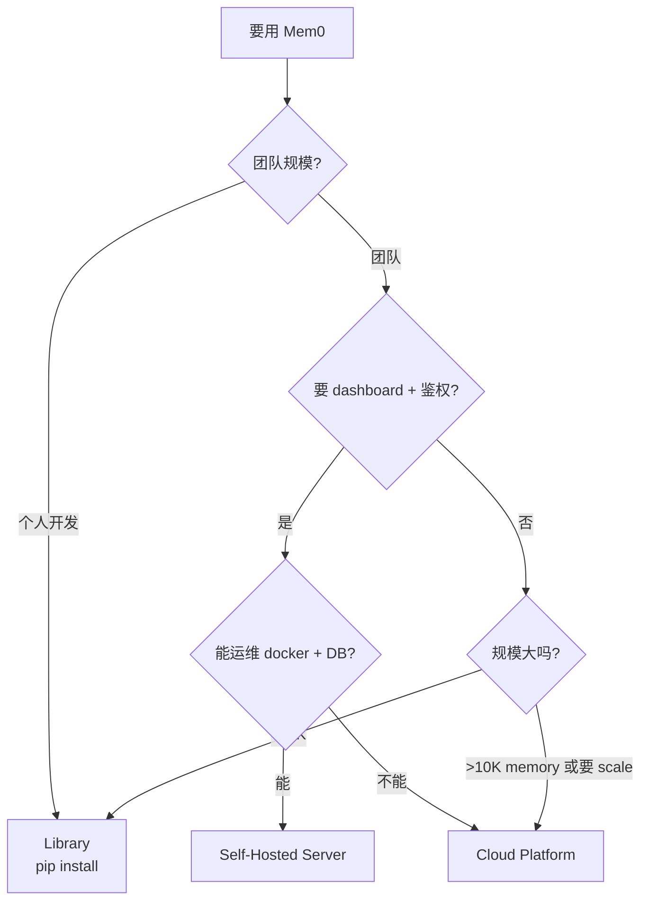

# 02 — Server vs Hosted Platform vs Library

> 三种使用模式怎么选？本篇对比 Server（self-hosted REST）、Library（直接用 SDK）、Hosted（Platform Cloud）。

---

## 1. 三模式速览

| 维度 | Library | Self-Hosted Server | Cloud Platform |
|------|---------|-------------------|----------------|
| 部署 | `pip install mem0ai` | `docker compose up` | 注册账号 |
| 数据位置 | 你的进程 | 你的服务器 | Mem0 云 |
| Dashboard | ❌ | ✅ 自带 web UI | ✅ |
| 鉴权 | ❌ | ✅ JWT + API Key | ✅ |
| 多用户 | ❌ | ✅ | ✅ |
| 高级功能 | ❌ | "teasers"（基础版） | 全部 |
| 算法 | OSS 当前版本 | OSS 当前版本 | Platform 最新 |
| 网络 | 仅调外部 API | 必须 HTTPS（自己反代） | 必须 HTTPS 到 api.mem0.ai |
| 运维 | 0 | 中（docker + DB） | 0 |
| 成本 | LLM/embedding API | LLM/embedding API + 服务器 | 平台计费 |

---

## 2. Server 是 SDK 的"REST 包装"

```python
# server/main.py（简化）
from mem0 import Memory
from server_state import get_memory_instance

@app.post("/memories/")
async def add_memory(payload: AddMemoryPayload, user = Depends(verify_auth)):
    memory = get_memory_instance()
    result = memory.add(payload.messages, **payload.kwargs)
    return result
```

> Server 本质：HTTP 接请求 → 调 mem0 SDK → 返回 JSON。**算法逻辑 100% 复用 SDK**。

---

## 3. ⭐ Server 的"独家"功能（vs Library）

### 鉴权

```http
POST /memories/
Authorization: ApiKey m0sk_xxxxxxxxxxxxxxxx
Content-Type: application/json

{"messages": "...", "filters": {"user_id": "alice"}}
```

- API Key 管理（创建/revoke）
- 多 admin 用户
- JWT refresh token 防重放

### Dashboard

- localhost:3000 web UI
- 注册首个 admin（setup wizard）
- 创建/吊销 API key
- 查 memory（add/search/get_all）
- 查 request logs

### Request logging

```python
# server/models.py RequestLog
```

每个请求记 method/path/status/latency/auth_type,admin 可查。

### Rate limiting

```python
# slowapi
limiter.limit("10/minute")(auth_router.login)
```

防 brute force 登录。

---

## 4. ⭐ Server 缺失（vs Platform）

| 功能 | Platform 有 | Server 有 |
|------|----------|---------|
| **Decay**（自动衰减旧 memory） | ✅ | ❌ |
| **Temporal reasoning** | ✅ | ❌（API 接受但 SDK 报错） |
| **Categories**（自定义分类） | ✅ | ❌ |
| **Multilingual mode** | ✅ | ❌ |
| **Webhooks** | ✅ | ❌ |
| **Feedback API** | ✅ | ❌ |
| **Memory export**（schema 导出） | ✅ | ❌ |
| **Batch update/delete** | ✅ | ❌ |
| **Summary** | ✅ | ❌ |
| **Scale tier（10M+ memory）** | ✅ | ❌（PostgreSQL 单实例上限） |
| **多 region / 高可用** | ✅ | ❌（自己干） |
| **最新算法** | ✅ | OSS 版（落后 Platform 几周-几月） |
| **保护 / 合规** | ✅ | ❌ |

> README 表格写 Server "Advanced Features: Teasers"——意思是部分功能可能能跑,但质量/规模不如 Platform。

---

## 5. ⭐ 算法版本差异

| 时点 | Library | Server | Platform |
|------|---------|--------|---------|
| April 2026 之前 | v1.0（旧算法） | v1.0 | v1.0 |
| April 2026（新算法发布） | v1.1+（数周后发版） | v1.1+（同步 SDK） | 立即 v1.1+ |
| Platform 新算法 beta | ❌ | ❌ | ✅ |
| Custom 算法优化 | ❌ | ❌ | ✅（专有） |

> README："Scores reflect Mem0's managed platform, which includes proprietary optimizations not available in the open-source SDK."

Platform benchmark 永远比 OSS 高（92.5 vs ~80）——因为 Platform 有专有优化没开源。

---

## 6. ⭐ 决策树



### 场景

| 场景 | 推荐 |
|------|------|
| 个人项目 / 原型 | Library |
| 内部团队工具 | Server |
| B2C SaaS（要 dashboard） | Server 或 Platform |
| 大规模生产（10M+ memory） | Platform |
| 隐私敏感（数据不能出本地） | Server |
| 零运维 | Platform |
| 想用 Platform-only feature（decay/temporal） | Platform |
| 测试新算法 | Platform（永远最新） |

---

## 7. ⭐ Server → Platform 迁移

`skills/mem0-oss-to-platform/` 是个 AI skill,自动改代码：

```bash
npx skills add https://github.com/mem0ai/mem0 --skill mem0-oss-to-platform
# 然后 AI 跑 /mem0-oss-to-platform
```

流程：
1. 扫描代码找 mem0 用法
2. 改 `from mem0 import Memory` → `from mem0 import MemoryClient`
3. 改 `Memory(config=...)` → `MemoryClient(api_key=...)`
4. 改 `m.add(messages, user_id="x")` → `m.add(messages, filters={"user_id": "x"})`
5. 数据迁移：`get_all` → `add_batch`

详见 [`09-skills/01-skills-overview.md`](../09-skills/01-skills-overview.md)。

---

## 8. ⭐ Library → Server 升级

代码改：
```python
# Library
from mem0 import Memory
m = Memory()
m.add(...)

# Server（client 端）
import httpx
client = httpx.Client(base_url="http://localhost:8888", headers={"Authorization": "ApiKey m0sk_..."})
client.post("/memories/", json={"messages": "...", "filters": {...}})
```

或直接用 SDK 的 `MemoryClient`（host 可指向自托管 server）：
```python
from mem0 import MemoryClient
m = MemoryClient(api_key="m0sk_...", host="http://localhost:8888")
```

> ⚠️ 自托管 server 必须支持 v3 API contract（identity params 走 filters）,客户端才能用 `MemoryClient`。

---

## 9. Server 性能特征

| 操作 | 量级 | 说明 |
|------|------|------|
| 单 memory add | 1-3s | 主要 LLM 调用 |
| search | 100-500ms | vector search + fusion |
| get_all (1000 条) | 50-200ms | pgvector LIMIT |
| 并发 | 100-500 req/s | FastAPI async + PostgreSQL pool |
| 内存占用 | 200-500 MB | 主进程 + Connection pool |
| PostgreSQL 数据 | 1K memory ≈ 5 MB | vectors 是大头 |

### 瓶颈

1. **LLM API 调用**（add 主要瓶颈）
2. **PostgreSQL 单实例**（max ~10K memory / sec search）
3. **embed API 调用**

> 真要 scale,改 Platform 或自己加 PgBouncer + 读副本。

---

## 10. Server 的未来

Server 是相对新的（auth 系统在 README "Note" 提到"Self-hosted auth is on by default. Upgrading from a pre-auth build?"），还在快速演进。

可能的未来方向：
- 更多 Platform feature 移植（decay / temporal / categories）
- 多租户支持
- K8s manifests（官方 helm chart）
- Dashboard 增强

---

## 11. 接下来

| 想看 | 去哪 |
|------|------|
| Server 内部架构 | [`01-architecture.md`](./01-architecture.md) |
| 双模式（OSS vs Hosted） | [`../00-overview/05-two-modes.md`](../00-overview/05-two-modes.md) |
| OSS→Platform 迁移 | [`../09-skills/01-skills-overview.md`](../09-skills/01-skills-overview.md) |
| FastAPI 官方文档 | https://fastapi.tiangolo.com |

---

📌 **下一步** → [`../06-cli-python/`](../06-cli-python/) Python CLI。
