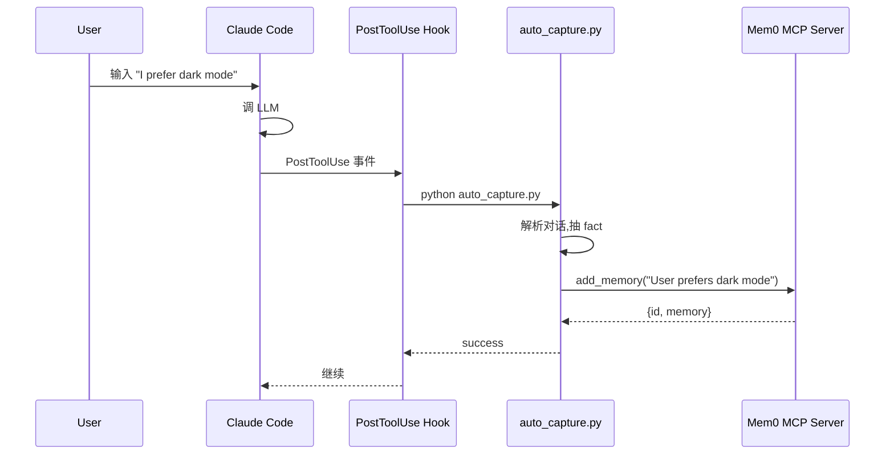

# 01 — `integrations/mem0-plugin/`（MCP 多编辑器插件）

> 这是 Mem0 **最复杂的集成**——一个目录同时支持 Claude Code / Cursor / Codex / OpenCode / Antigravity 5+ 个 AI 编辑器。
> 通过 MCP server + lifecycle hooks + skills 三层机制实现。

---

## 1. 多面体结构

```
integrations/mem0-plugin/
├── plugin.json                  # Antigravity plugin manifest
├── README.md                    # 用户文档
├── mcp_config.json              # MCP server 配置（备用）
├── requirements.txt             # mem0ai
├── logo.svg
│
├── .claude-plugin/plugin.json   # ⭐ Claude Code plugin manifest
├── .mcp.json                    # ⭐ 标准 MCP server 配置（Cursor）
├── .codex-mcp.json              # Codex MCP 配置
│
├── hooks/                       # ⭐ lifecycle hooks
│   ├── hooks.json               # Claude Code 格式
│   ├── cursor-hooks.json        # Cursor 格式
│   └── codex-hooks.json         # Codex 格式
│
├── scripts/                     # ⭐ 30+ hook 实现（Python + Bash）
│   ├── ensure_deps.sh           # 安装 mem0ai
│   ├── on_session_start.sh      # SessionStart hook
│   ├── on_user_prompt.sh        # 用户输入 hook
│   ├── on_pre_compact.sh / .py  # 上下文压缩前
│   ├── on_post_tool_use.sh      # 工具调用后
│   ├── on_stop.sh               # 会话结束
│   ├── auto_capture.py          # ⭐ 自动捕获对话→memory
│   ├── capture_session_summary.py
│   ├── block_memory_write.sh    # 防误写 ~/.mem0
│   ├── _search.py               # 搜 memory
│   ├── _identity.sh             # 拿 user/agent ID
│   ├── _project.sh              # 项目检测
│   ├── file_context.py          # 文件上下文
│   ├── telemetry.py
│   ├── import_competing_tools.py
│   └── ... (30+ 文件)
│
├── skills/                      # ⭐ 16 个 slash command skill
│   ├── context-loader/          # 加载 memory 进上下文
│   ├── dream/                   # 合并/清理 memory
│   ├── export/                  # 导出 memory
│   ├── forget/                  # 删 memory
│   ├── health/                  # 健康检查
│   ├── import/                  # 导入 memory
│   ├── list-projects/
│   ├── mem0/                    # 主入口
│   ├── memory-reviewer/         # 审查 memory 质量
│   ├── onboard/                 # 引导
│   ├── peek/                    # 预览 memory
│   ├── pin/                     # 固定 memory
│   ├── remember/                # 显式记住
│   ├── stats/                   # 统计
│   ├── switch-project/
│   └── tour/                    # 介绍
│
├── .opencode-plugin/            # ⭐ OpenCode plugin（独立 Bun + TS）
│   ├── package.json             # @mem0/opencode-plugin
│   ├── opencode-mem0.ts         # 主入口
│   ├── api-key.ts / dream.ts / project.ts / scope.ts / telemetry.ts
│   ├── opencode-skills/         # OpenCode skill 目录
│   ├── bun.lock                 # Bun 包管理
│   ├── tsconfig.json
│   └── *.test.ts                # 测试
│
└── tests/                       # pytest 测试（hooks 用）
    ├── conftest.py
    ├── test_auto_capture.py
    ├── test_search.py
    ├── test_message_roles.py
    ├── test_session_stats.py
    ├── test_parse_mem0_config.py
    ├── test_capture_session_summary.py
    ├── test_load_settings.py
    ├── test_telemetry.py
    ├── test_coding_categories.py
    ├── test_project.py
    ├── test_auto_setup_categories.py
    ├── test_import_competing_tools.py
    ├── test_parse_export_file.py
    ├── test_rubric_dedup.py
    └── test_write_path.py
```

---

## 2. ⭐ MCP Server（远程）

```json
// .mcp.json
{
  "mcpServers": {
    "mem0": {
      "type": "http",
      "url": "https://mcp.mem0.ai/mcp/",
      "headers": {
        "Authorization": "Token ${MEM0_API_KEY}"
      }
    }
  }
}
```

> MCP server **不在本地**——是 Mem0 托管的 `mcp.mem0.ai`。本地插件只是 client。

### MCP tools（9 个）

| Tool | 用途 |
|------|------|
| `add_memory` | 添加 memory |
| `search_memories` | 搜索 |
| `get_memories` | 列出 |
| `get_memory` | 取单条 |
| `update_memory` | 更新 |
| `delete_memory` | 删除 |
| `delete_all_memories` | 批量删 |
| `delete_entities` | 删 entity |
| `list_entities` | 列 entity |

AI agent 通过这些 tool 操作 memory,跟用文件系统 tool 一样自然。

---

## 3. ⭐ Lifecycle Hooks（核心创新）

`hooks/hooks.json`：

```json
{
  "hooks": {
    "Setup": [
      {
        "matcher": "init|maintenance",
        "hooks": [{
          "type": "command",
          "command": "${CLAUDE_PLUGIN_ROOT}/scripts/ensure_deps.sh",
          "statusMessage": "Installing mem0 SDK...",
          "timeout": 120
        }]
      }
    ],
    "SessionStart": [
      {
        "hooks": [{
          "command": "...diff requirements.txt || ensure_deps.sh",
          "timeout": 60
        }]
      },
      {
        "matcher": "startup|resume|compact",
        "hooks": [{
          "command": "${CLAUDE_PLUGIN_ROOT}/scripts/on_session_start.sh",
          "statusMessage": "Loading mem0 context..."
        }]
      }
    ],
    "PreToolUse": [
      {
        "matcher": "Write|Edit|MultiEdit",
        "hooks": [{
          "command": "${CLAUDE_PLUGIN_ROOT}/scripts/block_memory_write.sh"
        }]
      },
      {
        "matcher": "mcp__mem0__add_memory|...",
        "hooks": [...]
      }
    ]
    // ... UserPromptSubmit, PostToolUse, Stop, PreCompact
  }
}
```

### Hook 触发点

| 事件 | 触发 | 脚本 |
|------|------|------|
| `Setup` | init / maintenance | `ensure_deps.sh`（装 mem0ai） |
| `SessionStart` | startup / resume / compact | `on_session_start.sh`（加载 memory context） |
| `UserPromptSubmit` | 用户输入 | `on_user_prompt.sh`（自动搜相关 memory） |
| `PreToolUse` | 工具调用前 | `block_memory_write.sh`（防误写） |
| `PostToolUse` | 工具调用后 | `on_post_tool_use.sh`（自动 capture） |
| `Stop` | 会话结束 | `on_stop.sh`（保存 session summary） |
| `PreCompact` | 上下文压缩前 | `on_pre_compact.sh`（备份将被压缩的内容） |

### 自动 capture 流程



> **设计精髓**：AI agent 不需要显式 "记住"——hook 后台自动调 MCP,把对话变 memory。下次会话开始时,`on_session_start.sh` 自动搜相关 memory 注入上下文。

---

## 4. ⭐ 16 个 Skills（slash command）

`skills/<name>/SKILL.md`（推断结构）每个 skill 是一个 markdown 文件,定义 slash command 行为：

| Skill | 命令 | 用途 |
|-------|------|------|
| `mem0` | `/mem0` | 主入口 |
| `remember` | `/mem0-remember <text>` | 显式记住 |
| `forget` | `/mem0-forget <id>` | 删除 |
| `peek` | `/mem0-peek` | 预览最近 memory |
| `pin` | `/mem0-pin <id>` | 固定（防 decay） |
| `dream` | `/mem0-dream` | 合并/清理（去重、解决矛盾） |
| `stats` | `/mem0-stats` | 统计 |
| `health` | `/mem0-health` | 健康检查 |
| `onboard` | `/mem0-onboard` | 引导 |
| `tour` | `/mem0-tour` | 介绍功能 |
| `import` | `/mem0-import <file>` | 导入 |
| `export` | `/mem0-export` | 导出 |
| `context-loader` | 自动 | 加载相关 memory 进上下文 |
| `memory-reviewer` | `/mem0-review` | 审查 memory 质量 |
| `list-projects` | `/mem0-projects` | 列项目 |
| `switch-project` | `/mem0-switch <id>` | 切项目 |

---

## 5. ⭐ OpenCode Plugin（`.opencode-plugin/`）

OpenCode 用 **Bun + TypeScript**,跟主 plugin（Python/Bash）不同：

```typescript
// .opencode-plugin/opencode-mem0.ts（推断）
import { MemoryClient } from "mem0ai";

export default class OpenCodeMem0Plugin {
  constructor(config) {
    this.client = new MemoryClient({ apiKey: config.apiKey });
  }

  // 实现 OpenCode 的 plugin 接口
  async onSessionStart(...) { ... }
  async onUserPrompt(...) { ... }
  // ...
}
```

### 独立测试

```
.opencode-plugin/
├── api-key.test.ts
├── dream.test.ts
├── project.test.ts
├── scope.test.ts
└── telemetry.test.ts
```

> Bun 跑 TS 测试极快（比 jest/vitest 快几倍）。

---

## 6. 多编辑器 manifest 对比

| 编辑器 | manifest 路径 | 关键字段 |
|-------|------------|---------|
| **Claude Code** | `.claude-plugin/plugin.json` | `name`, `version`, `userConfig.api_key` |
| **Cursor** | `.mcp.json` | MCP servers（标准） |
| **Codex** | `.codex-mcp.json` | 类似 Cursor |
| **OpenCode** | `.opencode-plugin/package.json` | npm 包格式 |
| **Antigravity** | `plugin.json`（顶层） | `id`, `name`, `contextFileName` |

> 同一份代码,5 个 manifest,5 套配置语法。这是 polyglot 的代价。

---

## 7. ⭐ Hook scripts 关键文件

### `auto_capture.py`（最重要）

```python
# 推断结构
def main():
    # 1. 从 stdin/argv 拿 hook 输入（JSON 含 messages）
    # 2. 解析 messages,提取 fact
    # 3. 调 MCP add_memory 或本地 mem0 SDK
    # 4. 输出 JSON 给 hook 系统
```

### `block_memory_write.sh`

```bash
# 防 AI 误把 memory 写到 ~/.mem0/ 目录（应该用 MCP tool）
# 检测 Write/Edit 路径,如果在 ~/.mem0/ 下就 block
```

### `on_session_start.sh`

```bash
# 1. 拿当前 user_id / agent_id / project
# 2. 调 _search.py 搜最近 N 条相关 memory
# 3. 输出格式化的 memory 给 AI 上下文
```

### `capture_session_summary.py`

```python
# 会话结束时,LLM 总结整个会话→ 存为 1 条 memory
```

---

## 8. ⭐ 编辑器集成 step-by-step

### Claude Code

```bash
# 1. 设 API key
echo 'export MEM0_API_KEY="m0-..."' >> ~/.zshrc && source ~/.zshrc

# 2. 装插件（自动从 marketplace 拉）
claude plugin install mem0
# 或手动:git clone 到 ~/.claude/plugins/mem0

# 3. 用
# - 自动 capture 开
# - /mem0-remember "..." 显式记
# - /mem0-peek 看最近
```

### Cursor

```bash
# 1. 设 API key（同上）

# 2. 在 ~/.cursor/mcp.json 加（或项目 .mcp.json）
{
  "mcpServers": {
    "mem0": {
      "url": "https://mcp.mem0.ai/mcp/",
      "headers": {"Authorization": "Token m0-..."}
    }
  }
}

# 3. 重启 Cursor,在 chat 里 AI 自动用 mem0 tool
```

### Codex / OpenCode / Antigravity

类似流程,manifest 路径不同。

---

## 9. 测试覆盖

`tests/` 14 个 pytest 文件覆盖关键脚本：

| 测试 | 覆盖 |
|------|------|
| `test_auto_capture.py` | 自动捕获逻辑 |
| `test_search.py` | 搜索 |
| `test_message_roles.py` | user/assistant 区分 |
| `test_session_stats.py` | 会话统计 |
| `test_capture_session_summary.py` | 总结 |
| `test_load_settings.py` | 配置加载 |
| `test_telemetry.py` | 遥测 |
| `test_coding_categories.py` | 编码分类 |
| `test_project.py` | 项目检测 |
| `test_auto_setup_categories.py` | 自动分类 |
| `test_import_competing_tools.py` | 导入其他工具的 memory |
| `test_parse_export_file.py` | 导入文件解析 |
| `test_rubric_dedup.py` | 去重 rubric |
| `test_write_path.py` | 写路径 |

> CI 跑这些测试（`mem0-plugin-checks.yml`）。

---

## 10. 关键设计哲学

### "让 AI 不需要显式管理 memory"

传统：用户告诉 AI "记住 X" → AI 调 API
Mem0：AI 正常对话 → hook 后台自动 capture → 下次自动 recall

> 这是 **"ambient memory"** 设计——memory 系统对 AI 透明。

### "多编辑器一份代码"

不同 AI 编辑器语法不同（manifest / hook / skill 都不同）,但**业务逻辑共用**：
- Python scripts (`scripts/*.py`) 被 Claude Code / Cursor 共用
- OpenCode 单独用 TS 重写（因为 OpenCode runtime 是 Bun）

### "MCP 远程 + 本地 hook 双层"

- **MCP server**（远程 mcp.mem0.ai）= 数据层
- **本地 hook**（scripts/）= 业务逻辑层（capture/recall/summary 等）

> 这种分层让"算法升级"无需用户改本地——MCP 改了,所有用户立刻受益。

---

## 11. 接下来

| 想看 | 去哪 |
|------|------|
| 其他 5 个集成 | [`02-other-integrations.md`](./02-other-integrations.md) |
| MCP 协议 | https://modelcontextprotocol.io |
| Skills 体系 | [`../09-skills/01-skills-overview.md`](../09-skills/01-skills-overview.md) |

---

📌 **下一步** → [`02-other-integrations.md`](./02-other-integrations.md) 其他 5 个集成。
