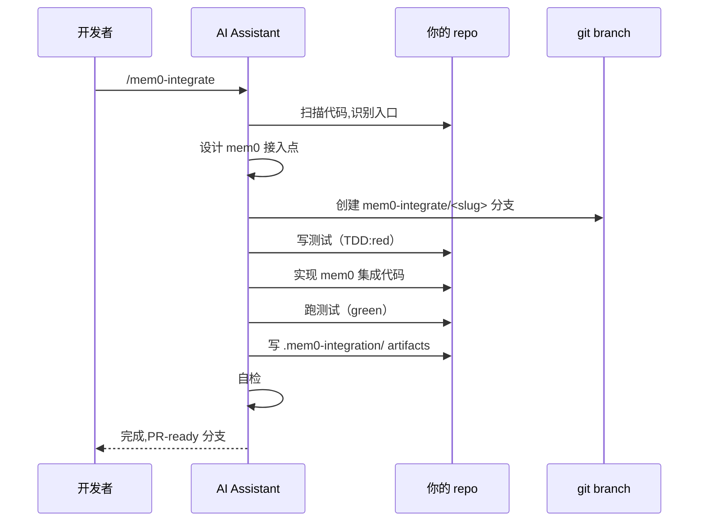
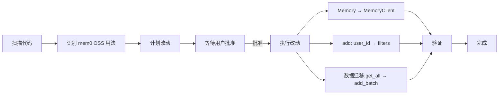

# 01 — Skills 体系（6 个 skill）

> Skills 是给 AI coding assistant 看的"知识包"。Mem0 提供 6 个 skill,分**参考型**（always on）和**流水线型**（on demand）。

---

## 1. 6 个 skill 一览

### Reference skills（参考型,always on）

装一次,AI assistant 写 Mem0 代码时自动加载到 context。

| Skill | Surface | 安装 |
|-------|---------|------|
| `mem0` | Python + TS SDK（Platform + OSS）,framework 集成 | `npx skills add https://github.com/mem0ai/mem0 --skill mem0` |
| `mem0-cli` | Terminal CLI（Node + Python 两边） | `npx skills add ... --skill mem0-cli` |
| `mem0-vercel-ai-sdk` | `@mem0/vercel-ai-provider` 和 `createMem0` | `npx skills add ... --skill mem0-vercel-ai-sdk` |

### Pipeline skills（流水线型,on demand）

用 slash command 触发,执行端到端 workflow。**做实事**:创建分支、写测试、跑代码。

| Skill | 触发 | 用途 |
|-------|------|------|
| `mem0-integrate` | `/mem0-integrate` | 用 TDD 把 Mem0 接入现有 repo |
| `mem0-test-integration` | `/mem0-test-integration` | 验证 `/mem0-integrate` 产出的东西 |
| `mem0-oss-to-platform` | `/mem0-oss-to-platform` | 把项目从 OSS 迁到 Platform |

> `mem0-integrate` 和 `mem0-test-integration` 设计成在**同一 workspace 顺序跑**：
> ```
> /mem0-integrate     →  mem0-integrate/<slug> 分支 + .mem0-integration/ artifacts
> /mem0-test-integration →  scorecard（编译 + runtime 验证 + API smoke test）
> ```

---

## 2. 文件结构（以 `mem0` skill 为例）

```
skills/mem0/
├── SKILL.md          # ⭐ 主入口（AI assistant 读这个）
├── README.md         # 用户文档
├── LICENSE
├── client/           # client 用法示例
├── references/       # 深度参考资料
└── scripts/          # 可执行脚本（验证 / setup）
```

每个 skill 都有 `SKILL.md` —— AI assistant 装上后,这个文件**永远在 context 里**。

---

## 3. 选哪个 skill?

| 场景 | 推荐 |
|------|------|
| 写 Mem0 代码（新/旧项目） | `mem0` |
| 用 terminal CLI | `mem0-cli` |
| 用 `@ai-sdk/*` | `mem0-vercel-ai-sdk` |
| 让 AI 帮我把 mem0 接入现有 repo | `mem0-integrate` + `mem0-test-integration` |
| 已用 OSS,想迁 Platform | `mem0-oss-to-platform` |

---

## 4. ⭐ Pipeline skill 流程（以 `mem0-integrate` 为例）

`/mem0-integrate` 触发后,AI assistant 做的事：



### `.mem0-integration/` artifacts

存放集成结果的状态,供 `mem0-test-integration` 读：

```yaml
.mem0-integration/
├── plan.yaml          # 接入计划
├── changes.yaml       # 改动清单
├── test-results.yaml  # 测试结果
└── api-smoke.yaml     # API smoke test 结果
```

---

## 5. ⭐ `mem0-oss-to-platform` 迁移流程

`/mem0-oss-to-platform` 触发后：



> **关键设计**：先 plan,等用户批准,再 execute。AI 不会擅自改代码。

---

## 6. 安装 skill

### Claude Code

```bash
claude skills add https://github.com/mem0ai/mem0 --skill mem0
```

### Cursor / Windsurf / 其他

```bash
npx skills add https://github.com/mem0ai/mem0 --skill mem0
```

> `skills` 是 [Anthropic skills 标准](https://github.com/anthropic-experimental/skills)——多编辑器通用。

---

## 7. 与 `integrations/mem0-plugin/` 的关系

容易混淆：

| | `skills/` | `integrations/mem0-plugin/skills/` |
|--|---------|------------------------------|
| 谁维护 | Mem0 团队（SDK 知识） | Mem0 团队（编辑器 plugin skill） |
| 内容 | SDK 用法、TDD 流水线 | 编辑器内的 slash command（remember/forget/...） |
| 给谁看 | AI assistant（通用） | AI agent（在编辑器内） |
| 安装方式 | `npx skills add` | 装 mem0-plugin 自动有 |

> 同名"skills"但不同概念。本目录是**SDK 教学 skill**,plugin/skills/ 是**编辑器操作 skill**。

---

## 8. CI 验证

skills/ 没有自己的 CI workflow（都是 markdown）,但 PR 改 skills/ 会触发 CI Gate 的 docs-llms-txt 检查（如果同步改了 docs/）。

---

## 9. 接下来

| 想看 | 去哪 |
|------|------|
| 加新 skill | [Anthropic skills 标准](https://github.com/anthropic-experimental/skills) |
| 编辑器 plugin 详情 | [`../08-integrations/01-mem0-plugin.md`](../08-integrations/01-mem0-plugin.md) |
| Vibecoding 文档 | https://docs.mem0.ai/vibecoding |

---

📌 **下一步** → [`../10-examples-eval/`](../10-examples-eval/) examples 和 benchmark。
