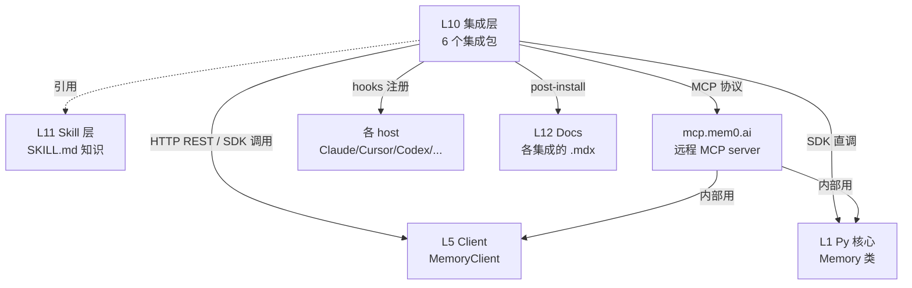

# Layer 10 — Agent & Editor 集成层(D 专题)

> 对应 ONBOARDING.md §5 Layer 10 + §6.6 / 32 个文件 / `notes/` 覆盖 0% → 本专题 100% 覆盖
> 范围:`integrations/` 6 个独立包 = `mem0-plugin` + `openclaw` + `pi-agent-plugin` + `vercel-ai-sdk` + `n8n-nodes-mem0` + `zapier-mem0`
> 上游 HEAD:`4debc58a`

---

## 0. TL;DR(3 句话建立直觉)

1. **集成层 = 把 Mem0 SDK 的"记忆能力"接入到「不是 Mem0 自己造的 host」**——host 是 Claude Code/Cursor/Codex/OpenCode/Antigravity/Cowork/Pi/n8n/Zapier/Vercel AI 这些"已经存在的 AI 编辑器/Agent/工作流平台",Mem0 不重造轮子,而是给他们装上"持久记忆"。
2. **3 种接入方式**(所有集成都用其中一种或多种):
   - **MCP server**(远程 `mcp.mem0.ai/mcp/`)——host 通过 MCP 协议调 9 个工具,零本地依赖。
   - **Lifecycle hooks**——在 host 的 session/tool/prompt 事件点跑 mem0 脚本,自动 capture/recall。
   - **Plugin SDK / Native extension**——按 host 的插件规范写 entry,直接用 `mem0ai` SDK,不走 MCP。
3. **共通记忆模型**——所有集成共享 3 件事:`user_id` / `agent_id` / `app_id` / `run_id` 四元 scope、`autoCapture + autoRecall + Dream` 三件套(自动捕获/自动召回/周期巩固)、`MemoryClient`(Platform 模式)或 `Memory`(OSS 模式)两个客户端。

---

## 1. 该层的角色与边界

### 1.1 为什么需要这一层

Mem0 的核心 SDK(`mem0/memory/main.py:Memory`)解决的是"**怎么存、怎么搜、怎么去重**"。但终端用户不直接用 SDK——他们用 Claude Code、Cursor、Codex 这些 AI 编辑器,或者 n8n、Zapier 这些工作流平台。**集成层的职责是把 SDK 的能力翻译成 host 能理解的接口**:

- 给 Claude Code:写 plugin manifest + hooks + MCP config
- 给 OpenCode:写 OpenCode plugin(Bun runtime)
- 给 Cursor/Codex:只配 MCP(它们没有 hook 机制,或机制受限)
- 给 OpenClaw:写 OpenClaw plugin SDK entry
- 给 n8n:写 n8n INodeType 节点
- 给 Zapier:写 Zapier Platform CLI app
- 给 Pi Agent:写 Pi extension
- 给 Vercel AI SDK:写 LanguageModelV3 实现

每种 host 有自己的"插件契约",集成层就是 8 套适配器(Adapter Pattern)。

### 1.2 边界

| 不归该层做 | 归该层做 |
|---|---|
| Memory 的算法(add/search/entity link) | 把 host 事件翻译成 MemoryClient 调用 |
| Vector store / Embedding / LLM 选择 | scope 推断(从 git remote / cwd / OS username) |
| Benchmark / Training | hooks 注册、MCP 配置、CLI 命令树 |
| Skill 知识内容(那是 L11) | 在 host 里注册 skill 引用 |

---

## 2. 6 个集成总览

按"接入方式 × host"分类:

| # | 集成包 | npm 包名 | host | 接入方式 | 文件数 | 关键文件 |
|---|---|---|---|---|---|---|
| 1 | `integrations/mem0-plugin/` | (无独立 npm,通过 marketplace 分发) | **Claude Code/Cowork/Cursor/Codex/OpenCode/Antigravity**(6 host) | MCP + Hooks + Skill + 嵌套 OpenCode 插件 | 15 | `hooks/hooks.json`、`scripts/on_user_prompt.sh`、`.opencode-plugin/opencode-mem0.ts`(1000 行) |
| 2 | `integrations/openclaw/` | `@mem0/openclaw-mem0` v1.0.15 | **OpenClaw** | Plugin SDK + Skills + CLI | 7+18 | `index.ts`(1059 行)、`openclaw.plugin.json`(319 行 manifest)、`cli/commands.ts`(1872 行) |
| 3 | `integrations/pi-agent-plugin/` | `@mem0/pi-agent-plugin` v0.1.4 | **Pi Agent** | Extension + Skills + Agent Tool | 4 | `src/entry.ts`、`src/commands.ts`、`src/memory/tools.ts` |
| 4 | `integrations/vercel-ai-sdk/` | `@mem0/vercel-ai-provider` v3.0.1 | **Vercel AI SDK** | LanguageModelV3 包装 | 3 | `src/mem0-generic-language-model.ts`、`src/mem0-utils.ts` |
| 5 | `integrations/n8n-nodes-mem0/` | `@mem0/n8n-nodes-mem0` v0.1.3 | **n8n** | INodeType 节点 | 1(+ credentials) | `nodes/Mem0/Mem0.node.ts` |
| 6 | `integrations/zapier-mem0/` | `@mem0/zapier` v0.1.1 | **Zapier** | Zapier Platform CLI app | 2 | `src/index.ts`、`src/creates/add_memory.ts` |

**重要**:ONBOARDING 提到 openclaw 7 个文件,实际目录有 25+ `.ts` 文件(`config.ts`/`dream-gate.ts`/`filtering.ts`/`fs-safe.ts`/`isolation.ts`/`public-artifacts.ts`/`recall.ts`/`skill-loader.ts`/`telemetry.ts`/`tools/`/`backend/base.ts`/`backend/platform.ts`/`cli/commands.ts`/...),7 是 KG 标记的代表,实际工程量更大。

### 2.1 体量对比(代码行数)

```
openclaw        ~6000+ 行 TS(最大,因为含完整 OSS 模式 + CLI + Skills)
mem0-plugin     ~3000+ 行(15 文件,.opencode-plugin/opencode-mem0.ts 单文件 1000 行)
pi-agent-plugin ~1500 行 TS(4 主文件 + 8 skills)
vercel-ai-sdk   ~1500 行 TS(3 主文件)
n8n             ~800 行 TS(单节点)
zapier          ~400 行 TS(2 文件,只覆盖 add/search/get/delete)
```

---

## 3. 共通设计模式

所有 6 个集成共享 5 个核心抽象,理解了这 5 个就理解了 80% 的该层。

### 3.1 Scope 四元组(所有集成一致)

```
user_id  ──┐
agent_id  ─┤  这 4 个字段共同决定一条 memory 的"命名空间"
app_id   ──┤  Mem0 服务端按这 4 个字段做 OR/AND 过滤
run_id   ──┘
```

- `user_id`:OS username 或 env `MEM0_USER_ID`,默认值在所有集成里都一致(看 `opencode-mem0.ts:30-37` 的 `getUserId()`)
- `app_id`:**项目级**,默认从 `git remote get-url origin` 抽 owner/repo(看 `opencode-mem0.ts:39-58`),fallback 到 `git rev-parse --show-toplevel` 的 basename,再 fallback 到 `process.cwd()` basename
- `agent_id`:**Agent 级**(多 Agent 系统里区分不同 Agent)
- `run_id`:**Session 级**(同一用户的不同对话窗口)

**这个 scope 推断逻辑在 6 个集成里几乎一字不差**——`pi-agent-plugin` 也是 `git rev-parse --show-toplevel`,`openclaw` 通过 `effectiveUserId(cfg.userId, sessionKey)` 实现完全相同的 fallback 链。

### 3.2 三件套:autoCapture / autoRecall / Dream

| 能力 | 触发点 | 实现位置 |
|---|---|---|
| **autoCapture** | 每轮 agent turn 结束 | 各集成的 Stop/PostToolUse hook 或 autoCapture closure |
| **autoRecall** | 每轮 user prompt 到来 / agent turn 开始 | 各集成的 UserPromptSubmit/SessionStart hook 或 recall 函数 |
| **Dream**(周期巩固) | N 小时后 + N session 后 + N memory 后(cheap gates) | `dream-gate.ts`(openclaw) / `dream.ts`(mem0-plugin/.opencode-plugin) |

`checkCheapGates` 模式:先查时间间隔(便宜),满足才查 session count,再满足才查 memory count,最后才 `checkMemoryGate`(可能要 LLM 调用,贵)。这种**渐进式 gating** 是性能优化的关键——避免每次都做昂贵检查。

### 3.3 双后端:Platform vs OSS

`openclaw` 是唯一**两个模式都完整实现**的集成(其他集成要么只用 Platform 要么只用 OSS):

```typescript
// openclaw/index.ts:178-189
const provider = createProvider(cfg, api);
let backend: Backend;
if (cfg.mode === "platform") {
  backend = new PlatformBackend({
    apiKey: cfg.apiKey!,
    baseUrl: cfg.baseUrl ?? "https://api.mem0.ai",
  });
} else {
  backend = providerToBackend(provider, cfg.userId);  // OSS
}
```

`Backend` 抽象基类定义 `add/search/get/update/delete/...`,`PlatformBackend`(HTTP REST)和 `OSSBackend`(直接调 `Memory` 类)各自实现。**Skill / Tool / CLI 代码只看 `Backend` 接口,不关心是 Platform 还是 OSS**——这就是 Adapter 模式的力量。

### 3.4 Skills 模式 vs Auto 模式(openclaw 创新)

`openclaw` v1.0+ 引入"Skills 模式":

| 维度 | Auto 模式(传统) | Skills 模式(openclaw 默认) |
|---|---|---|
| 谁决定记什么 | 固定的过滤管线(noise removal) | **Agent 自己用 triage skill 决定** |
| 谁决定召回什么 | 固定召回管线 | **Agent 自己用 recall skill 决定** |
| 周期清理 | Dream(自动) | Dream(Agent 主动调) |
| Token 控制 | 服务端固定 top_k | recall skill 有 `tokenBudget` 上限 |

Skills 模式把记忆决策权**交还给 Agent**,让 LLM 的判断进入循环。这是从"工程硬编码"转向"Agent-as-controller"的范式切换。

### 3.5 防泄漏:redact + secret 模式

所有集成都对**密钥/PII 做正则脱敏**再写入 Mem0。`opencode-mem0.ts:81-96` 的 `redact()` 是模板:

```typescript
const SECRET_PATTERNS = [
  /sk-[A-Za-z0-9]{20,}/g,    // OpenAI
  /m0-[A-Za-z0-9]{20,}/g,    // Mem0
  /AKIA[0-9A-Z]{16}/g,       // AWS
  /xox[baprs]-[A-Za-z0-9-]{20,}/g,  // Slack
  /ghp_[A-Za-z0-9]{36,}/g,   // GitHub PAT
  /gho_[A-Za-z0-9]{36,}/g,   // GitHub OAuth
];
```

写入前所有匹配替换成 `[REDACTED]`。**这是合规底线,所有集成都必须做**。

---

## 4. mem0-plugin 详读(15 文件,支持 6 host)

### 4.1 定位

唯一的"**多 host 通用插件**",一个仓库分发到 6 个 AI 编辑器:

| host | 安装方式 | 接入 |
|---|---|---|
| Claude Code (CLI) | `/plugin marketplace add mem0ai/mem0` + `/plugin install mem0@mem0-plugins` | MCP + Hooks + Skill(全套) |
| Claude Cowork (Desktop) | Customize → Browse plugins → Mem0 | MCP + Hooks + Skill |
| Cursor(Option A) | deeplink one-click | 仅 MCP |
| Cursor(Option B) | 手动写 `.cursor/mcp.json` | 仅 MCP |
| Codex(Option A) | `~/.codex/config.toml` 加 `[mcp_servers.mem0]` | 仅 MCP |
| Codex(Option B) | `codex plugin marketplace add` 侧载 | MCP + Skills + opt-in Hooks |
| OpenCode | `opencode plugin @mem0/opencode-plugin` | OpenCode 原生插件(全套,无 MCP) |
| Antigravity | `npx degit mem0ai/mem0/integrations/mem0-plugin ~/.gemini/config/plugins/mem0` | MCP + Hooks + Skills |

**MCP 是最大公约数**(所有支持 MCP 的 host 都能装),Hooks/Skills 是 Claude Code/Cowork/Codex/OpenCode/Antigravity 才有的增强。

### 4.2 完整文件清单(15 个)

#### 4.2.1 manifest 与 MCP 配置(3 个)

| 文件 | 行数 | 角色 |
|---|---|---|
| `plugin.json` | 14 | **Claude Code/Cowork/Antigravity 的 plugin manifest**——`id`/`name`/`version`/`description`/`publisher`/`contextFileName: "AGENTS.md"`。注意 `id=mem0`,这意味着 host 用 `mcp__mem0__<tool>` 前缀调工具 |
| `mcp_config.json` | 8 | **所有 host 共用的 MCP server 配置**——指向远程 `https://mcp.mem0.ai/mcp/`,header `Authorization: Token ${MEM0_API_KEY}`。`${MEM0_API_KEY}` 在 session start 时插值,不在 install 时固化,所以换 shell 重启就能重连 |
| `.claude-plugin/plugin.json`、`.codex-mcp.json`、`.mcp.json`、`.cursor-plugin/`、`.agents/plugins/marketplace.json` | (多个) | 各 host 的 marketplace 注册文件,5 份高度同步 |

#### 4.2.2 hooks manifest(2 个)

| 文件 | 行数 | 角色 |
|---|---|---|
| ⭐ `hooks/hooks.json` | 126 | **Claude Code/Cowork/Antigravity 的 hooks 注册表**——8 个事件类型 |
| `hooks/codex-hooks.json` | 92 | **Codex 的 hooks 注册表**(简化版,7 个事件) |

**Claude Code hooks 完整事件矩阵**:

| Event | Matcher | Hook command | 作用 |
|---|---|---|---|
| `Setup` | `init\|maintenance` | `scripts/ensure_deps.sh` | 安装 mem0 Python SDK |
| `SessionStart` | (无 matcher) | `scripts/ensure_deps.sh`(条件触发,比较 requirements.txt 哈希) | 检测依赖更新 |
| `SessionStart` | `startup\|resume\|compact` | `scripts/on_session_start.sh` | 加载历史 memory 作为 bootstrap context |
| `PreToolUse` | `Write\|Edit\|MultiEdit` | `scripts/block_memory_write.sh` | 阻止 agent 写到 mem0 数据文件 |
| `PreToolUse` | `mcp__mem0__add_memory\|mcp__mem0__search_memories\|...` | `scripts/enforce_metadata_defaults.sh` | **拦截 MCP 工具调用,自动注入 metadata 默认值**(user_id/app_id 等) |
| `PreToolUse` | `Read` | `scripts/on_file_read.sh` | 读文件时记录上下文(用于后续 capture) |
| `PostToolUse` | `mcp__mem0__.*` | `scripts/on_post_tool_use.sh` | MCP 工具调用后处理 |
| `PostToolUse` | `Bash` | `scripts/on_bash_output.sh` | Bash 命令输出可能含错误,触发 capture |
| `Stop` | (无 matcher) | `scripts/on_stop.sh` | 每轮结束触发 capture |
| `PreCompact` | (无 matcher) | `scripts/on_pre_compact.py` | context 压缩前保存摘要 |
| `UserPromptSubmit` | (无 matcher) | `scripts/on_user_prompt.sh` | **用户发 prompt 时做 memory search + 注入相关 memory** |

**Codex hooks 差异**:所有 command 前缀加 `MEM0_PLATFORM=codex`(让脚本知道自己跑在 Codex),用 `${PLUGIN_ROOT}` 而不是 `${CLAUDE_PLUGIN_ROOT}`,无 `Read` PostToolUse(Codex 不暴露这个粒度),`UserPromptSubmit` timeout 12s(Claude 是 8s)。

#### 4.2.3 lifecycle hook scripts(7 个)

| 文件 | 行数(approx) | 触发事件 | 职责 |
|---|---|---|---|
| 🔥 `scripts/on_session_start.sh` | 199 | `SessionStart` | 从 mem0 拉历史 memory,作为 bootstrap context 注入到 agent |
| 🔥 `scripts/on_user_prompt.sh` | 228 | `UserPromptSubmit` | 把 user prompt 当 query 调 `search_memories`,把 top-K 结果作为 system message 注入 |
| 🔥 `scripts/enforce_metadata_defaults.sh` | 218 | `PreToolUse` (MCP tools) | **核心**:拦截所有 `mcp__mem0__*` 工具调用,从 stdin JSON 抽 args,补齐缺失的 `user_id`/`app_id`/`agent_id`/`run_id`,再吐回 stdout 让 Claude Code 用修改后的版本执行 |
| 🔥 `scripts/capture_session_summary.py` | (Python) | `Stop` | 从最近 N 轮对话抽 durable facts,调 `add_memory` |
| 🔥 `scripts/auto_import.py` | (Python) | (首次启动) | 读 `CLAUDE.md`/`AGENTS.md`/`.cursorrules`,作为项目级 memory 灌入 |
| 🔥 `scripts/import_competing_tools.py` | (Python) | (按需) | 从 `.cursorrules`/`copilot-instructions.md`/`.clinerules` 抽竞品记忆规则,合并到 mem0 |
| 🔥 `scripts/on_pre_compact.py` | (Python) | `PreCompact` | context 即将被 Claude Code 压缩(丢失细节),先把关键内容持久化到 mem0 |

**`enforce_metadata_defaults.sh` 是这一层的"魔法所在"**——它通过 hook 系统拦截 MCP 调用并改写参数,让 agent 不需要每次都传 `user_id`/`app_id`,自动推断并补齐。

#### 4.2.4 嵌套 OpenCode 插件(2 个)

| 文件 | 行数 | 角色 |
|---|---|---|
| 🔥 `.opencode-plugin/opencode-mem0.ts` | **1000** | **OpenCode 原生插件主入口**——注册 9 个原生工具(注意:**不是** MCP,是通过 `@opencode-ai/plugin` 的 `tool()` 注册的原生 plugin tool),挂 hooks(`config`/`chat.message`/`tool.execute.before/after`/`experimental.chat.messages.transform`/`experimental.session.compacting`/`shell.env`) |
| `.opencode-plugin/dream.ts` | 225 | Dream 记忆巩固模块——`loadDreamConfig`/`incrementSessionCount`/`checkCheapGates`/`checkMemoryGate`/`acquireDreamLock`/`releaseDreamLock`/`recordDreamCompletion`/`DREAM_PROTOCOL` |

**为什么 OpenCode 不走 MCP**:OpenCode 插件可以用 Bun runtime 直接 `import { MemoryClient } from "mem0ai"`,比走 HTTP MCP 更快(无网络往返),还能用 OpenCode 特有的 hooks(如 `experimental.chat.messages.transform` 这种实验性 API)。

`.opencode-plugin/` 是**独立 npm 包**(`@mem0/opencode-plugin` v0.2.2),通过 `repository.directory` 字段告诉 npm provenance 这个包的源在 monorepo 的哪个子目录。

#### 4.2.5 skills(1 个嵌套)

| 文件 | 角色 |
|---|---|
| `skills/mem0/SKILL.md` | **mem0 SDK 集成 skill**——教 agent 怎么把 mem0ai SDK 集成到用户的应用代码里(Python + TS) |

**注意**:`mem0-plugin/skills/` 目录下其实有 **17 个 skill**(context-loader / dream / export / forget / health / import / list-projects / memory-reviewer / onboard / peek / pin / remember / stats / switch-project / tour / mem0/ + LICENSE/README)。ONBOARDING 只标了 `skills/mem0/SKILL.md` 一个,但实际可用的 slash command 有 17 个(见 `mem0-plugin/README.md` 第 138-152 行的命令表)。

### 4.3 MCP 工具(9 个,所有 host 都能调)

| 工具 | 描述 |
|---|---|
| `add_memory` | 把 text 或对话历史存为 memory |
| `search_memories` | 语义搜索 + filters |
| `get_memories` | 列出 memory(分页 + filters) |
| `get_memory` | 按 ID 取单条 |
| `update_memory` | 覆盖某 ID 的 text |
| `delete_memory` | 按 ID 删单条 |
| `delete_all_memories` | 批量删 scope 内全部 |
| `delete_entities` | 删 user/agent/app/run entity 及其所有 memory |
| `list_entities` | 列出所有 user/agent/app/run |

**注意**:`openclaw` 注册的是 `memory_*`(`memory_search`/`memory_add`/...),mem0-plugin 注册的是 `*_memory`(`add_memory`/`search_memories`/...)。命名约定相反但功能同构。

---

## 5. openclaw 详读(7 个 ONBOARDING 标注 + 18 个 KG 未标 = 25+ 文件)

### 5.1 定位

`@mem0/openclaw-mem0` v1.0.15 —— **OpenClaw**(独立的 AI agent 平台,`openclaw --version` ≥ 2026.4.25)的 memory backend。是这层第二大、最复杂的集成。

### 5.2 ONBOARDING 提到的 7 个文件 + 实际补充

| 文件 | 行数 | ONBOARDING? | 角色 |
|---|---|---|---|
| ⭐🔥 `index.ts` | **1059** | ✅ | **plugin entry**——`definePluginEntry({id, name, register(api)})`,注册 service / hooks / tools / CLI |
| 🔥 `cli/commands.ts` | 1872 | ✅ | CLI 命令树(`openclaw mem0 <command>`)——`add/search/get/list/update/delete/init/status/config/event/dream` |
| 🔥 `providers.ts` | 641 | ✅ | **Platform/OSS 双模式**——`createProvider(cfg, api)` 根据 cfg.mode 创建 MemoryClient(platform)或 Memory(OSS) |
| 🔥 `recall.ts` | (大) | ✅ | token 预算化召回引擎——`recall(query, opts)` 带 `tokenBudget` / `rerank` / `keywordSearch` / `identityAlwaysInclude` |
| 🔥 `skill-loader.ts` | 693 | ✅ | Skill 加载器——`loadCompactTriagePrompt` / `loadDreamPrompt` / `isSkillsMode` |
| ⭐ `openclaw.plugin.json` | **319** | ✅ | **plugin manifest**(OpenClaw 格式)——`kind: "memory"` / `contracts.tools[]` / `providerAuthChoices[]` / `uiHints{}` / `configSchema{}`(完整 JSON Schema) |
| 🔥 `backend/platform.ts` | (大) | ✅ | `PlatformBackend` 类——实现 `Backend` 接口,HTTP REST 调 `api.mem0.ai` |
| (未标注) `backend/base.ts` | - | ❌ | `Backend` 抽象基类 |
| (未标注) `config.ts` | - | ❌ | Zod schema 解析 + FileConfig 合并 |
| (未标注) `dream-gate.ts` | - | ❌ | Dream 触发 gating(cheap gates 优化) |
| (未标注) `filtering.ts` | - | ❌ | 消息过滤(`filterMessagesForExtraction`) |
| (未标注) `isolation.ts` | - | ❌ | 多 agent 隔离(`effectiveUserId` / `agentUserId` / `extractAgentId`) |
| (未标注) `public-artifacts.ts` | - | ❌ | 公共 artifacts provider |
| (未标注) `fs-safe.ts` | - | ❌ | 文件系统安全 helper |
| (未标注) `telemetry.ts` | - | ❌ | PostHog 遥测 |
| (未标注) `types.ts` | - | ❌ | TypeBox 类型定义(`Mem0Config` / `Mem0Provider` / `AddOptions` / `SearchOptions`) |
| (未标注) `tools/index.ts` | - | ❌ | 8 个 agent tool 注册入口 |

### 5.3 关键设计:`openclaw.plugin.json` 的丰富程度

这个 manifest 是该层最详尽的 plugin spec(319 行 JSON):

- `kind: "memory"`——OpenClaw 用 slot 机制,只能有一个 memory backend
- `commandAliases: [{ name: "mem0", cliCommand: "mem0" }]`——把 `mem0` 命令注册到 OpenClaw CLI
- `contracts.tools: [...]`——声明插件提供 8 个 agent tool(memory_search / memory_add / memory_get / memory_list / memory_update / memory_delete / memory_event_list / memory_event_status)
- `setup.providers: [{id: "mem0", envVars: ["MEM0_API_KEY"]}, {id: "openclaw-mem0-oss", envVars: [...]}]`——双 provider 声明
- `providerAuthChoices[]`——3 种认证方式(Mem0 API key / OSS with OpenAI / OSS with Ollama),每种带 `cliFlag` / `cliOption` / `cliDescription`,**让 OpenClaw CLI 自动生成 `--help`**
- `uiHints{}`——每个配置字段给 label/help/placeholder/sensitive/advanced,**让 OpenClaw UI 自动生成配置表单**
- `configSchema{}`——完整 JSON Schema,带 `type`/`enum`/`default`/`description`/`additionalProperties: false`,**让 OpenClaw 在加载插件时校验配置**
- `providerEndpoints[]`——声明 3 类 endpoint:`api.mem0.ai`(API)、`app.mem0.ai`(dashboard)、`us.i.posthog.com`(telemetry),**让 OpenClaw 的网络策略自动放行**

**这个 manifest 是该层的"工程美学巅峰"**——一个文件让 OpenClaw 完全理解插件能力,无需任何手写适配代码。

### 5.4 双模式实现对比(`providers.ts:641 行`)

```typescript
// 简化伪代码
function createProvider(cfg, api) {
  if (cfg.mode === "platform") {
    return new MemoryClient({ apiKey: cfg.apiKey });  // HTTP REST
  } else {
    // OSS: 直接用 mem0ai 包的 Memory 类
    return new Memory({
      llm: { provider: cfg.oss.llm.provider, config: cfg.oss.llm.config },
      embedder: { provider: cfg.oss.embedder.provider, config: cfg.oss.embedder.config },
      vector_store: { provider: cfg.oss.vectorStore.provider, config: cfg.oss.vectorStore.config },
    });
  }
}
```

OSS 默认:`text-embedding-3-small` + 本地 SQLite vector store(`~/.mem0/vector_store.db`)+ `gpt-5-mini` LLM,需要 `OPENAI_API_KEY`。完全本地:用 Ollama 替换 LLM + embedder,无需任何 API key。

---

## 6. pi-agent-plugin 详读(4 文件)

### 6.1 定位

`@mem0/pi-agent-plugin` v0.1.4 —— **Pi Agent**(`pi.dev`,依赖 `@earendil-works/pi-ai` + `@earendil-works/pi-coding-agent`)的记忆扩展。

### 6.2 文件清单(4 个)

| 文件 | 角色 |
|---|---|
| ⭐ `src/entry.ts` | **Pi extension 默认导出**——`pi.extensions: ["./src/entry.ts"]` 在 package.json 里声明 |
| 🔥 `src/commands.ts` | **8 个 slash command**——`/mem0-remember` / `/mem0-forget` / `/mem0-search` / `/mem0-tour` / `/mem0-dream` / `/mem0-pin` / `/mem0-scope` / `/mem0-status` |
| 🔥 `src/memory/tools.ts` | **`mem0_memory` agent tool** 注册——让 agent 在对话中自主调记忆能力 |
| `src/telemetry.ts` | PostHog 遥测(batched, PII-safe) |

补充文件(ONBOARDING 未标,实际存在):`src/prompt.ts`(SYSTEM prompt 注入 `MEMORY_POLICY`)、`src/types.ts`、`src/config/`、`src/capture/`、`src/dream/`、`skills/`(8 个 SKILL.md)。

### 6.3 三 scope 模型(独特)

Pi Agent 的 scope 设计比其他集成更明确:

| scope | filter | 用途 |
|---|---|---|
| `project` | user + app_id(`git rev-parse --show-toplevel`) | 默认。项目相关知识 |
| `session` | user + app_id + run_id | 临时会话上下文 |
| `global` | user only | 跨项目全部 memory |

**monorepo 友好**:用 git root 而不是 cwd 作为 app_id,所以 monorepo 的所有子目录共享同一个 memory pool。

### 6.4 10 个 memory category

`identity` / `preferences` / `goals` / `projects` / `decisions` / `technical` / `relationships` / `routines` / `lessons` / `work` —— 比 `mem0-plugin` 的 17 个 coding category 更通用,面向 companion agent 而非 coding agent。

---

## 7. vercel-ai-sdk 详读(3 文件)

### 7.1 定位

`@mem0/vercel-ai-provider` v3.0.1 —— 把 Mem0 包装成 **Vercel AI SDK** 的 `LanguageModelV3`,让 Vercel AI 用户用熟悉的 `generateText({model: mem0(...)})` API 就能获得记忆能力。

### 7.2 文件清单(3 个)

| 文件 | 角色 |
|---|---|
| ⭐🔥 `src/mem0-generic-language-model.ts` | **`LanguageModelV3` 实现**——包装底层 model(默认 OpenAI `gpt-4-turbo`),在 `doGenerate()` / `doStream()` 前后注入 memory 召回和 capture |
| `src/mem0-utils.ts` | Mem0 REST API 封装——`retrieveMemories()` / `addMemories()` / `getMemories()` |
| ⭐ `src/index.ts` | 包入口——`createMem0()` 工厂返回 wrapped model |

### 7.3 关键 API

```typescript
// 用法 1:wrapped model(自动 capture + recall)
const mem0 = createMem0({
  provider: "openai",
  mem0ApiKey: "m0-xxx",
  apiKey: "openai-api-key",
});
const { text } = await generateText({
  model: mem0("gpt-4-turbo", { user_id: "borat" }),
  prompt: "Suggest me a good car to buy!",
});

// 用法 2:工具函数(手动控制)
const memories = await retrieveMemories(prompt, { user_id: "borat" });
const { text } = await generateText({
  model: openai("gpt-4-turbo"),
  prompt,
  system: memories,
});
await addMemories(messages, { user_id: "borat" });
```

**两种模式差异**:用法 1 把 memory 完全封装在 model 内部,用法 2 让开发者显式控制什么时候 fetch/persist。后者更适合 pipeline 工作流。

---

## 8. n8n-nodes-mem0 详读(1 文件)

### 8.1 定位

`@mem0/n8n-nodes-mem0` v0.1.3 —— n8n 工作流平台的社区节点,把 Mem0 暴露为 n8n workflow 里可拖拽的节点。

### 8.2 文件(单节点)

| 文件 | 角色 |
|---|---|
| ⭐🔥 `nodes/Mem0/Mem0.node.ts` | **INodeType 实现**——声明 6 个 operation:Add / Search / Get Many / Get / Update / Delete,每个 operation 对应 Mem0 REST API 一个 endpoint |

补充:`credentials/Mem0Api.credentials.ts` 定义 API key 凭证(Authorization: Token <key>)。

### 8.3 关键设计:异步抽取轮询

Add operation 默认是异步的——POST `/v3/memories/add/` 立即返回 event ID,n8n 节点会轮询直到抽取完成才返回结果。两个独立控制:

- **Wait for Completion**(默认 on):是否轮询。关掉则立即返回 event ID。
- **Infer**(默认 on):是否跑 LLM 抽取。关掉则原样存消息。

**entity filter 的 OR 语义**:`User ID` + `Agent ID` + `App ID` + `Run ID` 至少一个必填,多个提供时 OR(取并集)。**这违反直觉但符合 Mem0 索引设计**(每个 entity 独立索引,AND 跨 entity 通常返回空)。要 narrow 必须分多次单 entity 查询。

---

## 9. zapier-mem0 详读(2 文件)

### 9.1 定位

`@mem0/zapier` v0.1.1 —— Zapier 工作流平台 integration,**只覆盖 4 个 operation**(add/delete/search/get),是 6 个集成里最小的。**不通过 npm 分发**,通过 Zapier Platform CLI 部署到 Zapier 自己的平台。

### 9.2 文件(2 个)

| 文件 | 角色 |
|---|---|
| ⭐ `src/index.ts` | Zapier app 入口——声明 authentication / triggers / creates / searches |
| `src/creates/add_memory.ts` | "Create Memory" trigger——调用 POST `/v3/memories/add/` |

### 9.3 关键差异

- **部署方式不同**:`zapier push` 部署到 Zapier 云,不通过 npm registry。
- **trigger 模型不同**:Zapier 是 trigger-action 模型,Mem0 这里只暴露 4 个 action,没有 trigger(因为 Mem0 没有 webhook 给 Zapier 订阅)。
- **超时风险**:Zapier 单步执行时间限制 < Mem0 异步抽取时间,Add 默认立即返回 event ID(不轮询),`Wait for Completion` 开启可能超时——但**超时不代表失败**(server-side 通常会完成)。

---

## 10. 代表深读:`opencode-mem0.ts`(1000 行)

### 10.1 文件作用

`integrations/mem0-plugin/.opencode-plugin/opencode-mem0.ts` —— **OpenCode 原生插件主入口**。**这是该层最值得深读的文件**,因为它实现了一个完整的"无 MCP 的 Mem0 集成"——所有 9 个工具都是 OpenCode 原生 tool(通过 `@opencode-ai/plugin` 的 `tool()` 注册),直接调用 `mem0ai` SDK,不经过 HTTP MCP 协议。

### 10.2 顶层结构(按行号区间)

| 行号 | 内容 |
|---|---|
| L1-L27 | imports + 注释(讲清楚"无 MCP server required") |
| L30-L67 | `getUserId()` / `getProjectId()` / `getBranch()`——scope 推断辅助函数 |
| L69-L96 | `extractMemories()` / `generateSessionId()` / `redact()`——通用 helper + **密钥脱敏**(6 种 secret pattern) |
| L98-L173 | `loadSettings()` / `loadDefaultScope()` / `autoSetupCategories()`——**自动安装 17 个 coding category**(幂等,按 sha256 fingerprint 缓存) |
| L175-L184 | 启发式 regex:`NUDGE_RE`(用户说"remember this" 触发主动记忆)、`RESUME_RE`(用户说"where did we leave off" 触发 recall)、`ERROR_STRONG_RE` / `ERROR_MULTI_RE`(检测错误,触发 capture) |
| L186-L200+ | `resolveFilters()`——构造 Mem0 search filter 的 OR/AND 子句 |
| L201-L500(估计) | 9 个 tool 定义(add_memory / search_memories / get_memories / get_memory / update_memory / delete_memory / delete_all_memories / delete_entities / list_entities) |
| L501-L800(估计) | hooks 实现(`config` / `chat.message` / `tool.execute.before/after` / `experimental.chat.messages.transform` / `experimental.session.compacting` / `shell.env`) |
| L801-L1000 | Dream 周期巩固 + session lifecycle |

### 10.3 关键函数精读

#### 10.3.1 `getProjectId($)`(L39-58)——scope 推断的精髓

```typescript
async function getProjectId($: any): Promise<string> {
  if (process.env.MEM0_APP_ID) return process.env.MEM0_APP_ID;
  // 优先用 git remote 的 owner/repo——跨 clone/worktree/子目录都稳定
  try {
    const r = await $`git remote get-url origin`.quiet();
    const project = parseProjectFromRemote(r.stdout.toString());
    if (project) return project;
  } catch {}
  // 没有可用 remote:fallback 到 git repo 的 ROOT 目录名(不是 cwd)
  try {
    const r = await $`git rev-parse --show-toplevel`.quiet();
    const top = r.stdout.toString().trim();
    if (top) return basename(top);
  } catch {}
  return basename(process.cwd());
}
```

**4 级 fallback**:env > git remote > git root > cwd basename。**这个 fallback 链是所有集成的范本**——`pi-agent-plugin`、`openclaw` 都用了几乎相同的逻辑(只是函数名不同)。

**为什么用 git remote 而不是 cwd**:用户在 monorepo 子目录工作,或用 worktree,`cwd` 不稳定;但 `git remote get-url origin` 在所有 clone/worktree/子目录都返回同一个值——**stable identity**。

#### 10.3.2 `autoSetupCategories()`(L139-173)——幂等自动配置

每次 plugin 启动时检查:Mem0 服务端的项目级 `customCategories` 是否已是 CODING_CATEGORIES(17 个 coding-oriented 类别)?如果不是,自动 PUT 上去。

**幂等机制**:
- 双指纹:`apiKeyFingerprint(apiKey)`(避免不同账号互相覆盖)+ `categoriesFingerprint()`(避免类别列表更新后被跳过)
- 状态文件:`~/.mem0/categories_setup.json`,记录 `{[keyFp]: catFp}` 已应用过的组合
- 服务端实际状态先 GET 校验(防止类别被外部修改后还以为已应用)
- 所有错误 silent swallow(自动配置失败不应阻塞 plugin 启动)

**默认 17 个 coding category**:`architecture_decisions` / `api_design` / `data_models` / `algorithms` / `dependencies` / `environment_setup` / `testing_strategy` / `debugging_notes` / `performance` / `security` / `deployment` / `code_conventions` / `error_handling` / `refactoring_history` / `integrations` / `onboarding` / `project_meta`。

#### 10.3.3 hooks 矩阵(从 `.opencode-plugin/package.json`)

```json
"opencode": {
  "type": "plugin",
  "hooks": [
    "config",                                       // 启动时注入 plugin config
    "chat.message",                                 // 每条 chat message
    "tool.execute.before",                          // 工具调用前(可改写参数)
    "tool.execute.after",                           // 工具调用后(可改写结果)
    "experimental.chat.messages.transform",         // 实验性:消息流变换
    "experimental.session.compacting",              // 实验性:context 压缩
    "shell.env"                                     // 注入 shell 环境变量
  ]
}
```

**vs Claude Code hooks**:
- Claude Code 用 stdin/stdout JSON 协议(脚本语言无关)
- OpenCode 用 plugin SDK 直接 import 函数(TS-to-TS,更快)
- OpenCode 有"experimental"前缀的实验性 hook,Claude Code 没有

### 10.4 设计权衡

**为什么不用 MCP**(虽然 package.json 里没禁):
- MCP 走 HTTP,有网络往返延迟(即使本地 stdio MCP 也有 IPC 开销)
- OpenCode plugin 用 Bun runtime 直接 `import`,函数调用级别快
- 可以用 OpenCode 特有 hook(如 `experimental.chat.messages.transform`)
- 缺点:绑死在 OpenCode,不能跨 host 复用

**`@opencode-ai/plugin` 的 `tool()` vs MCP server**:
- `tool()` 注册的 tool 在 OpenCode 内部和原生 tool 一样快
- 但只 OpenCode 一个 host 能用——所以 mem0-plugin 同时维护 MCP(给其他 host)和 OpenCode plugin(给 OpenCode)
- **双轨**:同样的 9 个工具,两套实现

---

## 11. 代表深读:`openclaw/index.ts`(1059 行)

### 11.1 文件作用

`integrations/openclaw/index.ts` —— **OpenClaw plugin entry**。`definePluginEntry({id, name, description, register(api)})` 注册一切:service / hooks / tools / CLI commands。

### 11.2 顶层结构(按行号区间)

| 行号 | 内容 |
|---|---|
| L1-L66 | imports(从 16 个内部模块) + re-exports(给测试和外部消费) |
| L67-L96 | 注释 + helpers 区 |
| L98-L200 | `definePluginEntry` + `register(api)` 开始 + 配置解析 + telemetry context + metadata-only registration 早退 |
| L201-L400(估计) | service 注册 + hooks 注册(`session.start` / `chat.message` / `tool.execute.before/after` 等) |
| L401-L600(估计) | tool 注册(`registerAllTools(api, deps)`) |
| L601-L800(估计) | CLI 注册(`registerCliCommands(...)`) |
| L801-L1059 | skill 模式实现(triage / recall / dream hooks)+ session lifecycle |

### 11.3 关键设计:3 种 registration mode

```typescript
// 简化伪代码(L113-L176)
register(api) {
  const cfg = mem0ConfigSchema.parse(api.pluginConfig, fileConfig);
  
  if (api.registrationMode === "cli-metadata") {
    // 模式 1:OpenClaw 只想知道 CLI 元数据(给 --help 用)
    registerCliCommands(api, ...);
    return;
  }
  
  if (cfg.needsSetup) {
    // 模式 2:没 API key,只装 init 命令让用户能配
    registerCliCommands(api, ...);
    api.registerService({ id: "openclaw-mem0", start: ..., stop: ... });
    return;
  }
  
  // 模式 3:完整运行
  const provider = createProvider(cfg, api);
  const backend = cfg.mode === "platform" 
    ? new PlatformBackend({...})
    : providerToBackend(provider, cfg.userId);
  // ... 注册 hooks / tools / service / CLI
}
```

**3 模式设计**:让 OpenClaw 在不同生命周期阶段都能正确响应——`cli-metadata` 模式让 `openclaw --help` 不需要 API key 就能列出所有命令;`needsSetup` 模式让没配置的用户也能跑 `openclaw mem0 init`;完整模式才注册全功能。**这种渐进式注册是大型 plugin 的最佳实践**。

### 11.4 关键抽象:`Backend` 接口

```typescript
// openclaw/backend/base.ts(简化)
interface Backend {
  add(messages, opts): Promise<Memory[]>;
  search(query, opts): Promise<Memory[]>;
  get(id: string): Promise<Memory>;
  list(opts): Promise<Memory[]>;
  update(id: string, text: string): Promise<void>;
  delete(id: string): Promise<void>;
  deleteAll(opts): Promise<void>;
  // ...
}
```

- `PlatformBackend`(L58)——HTTP REST,实现这接口
- `OSSBackend`(via `providerToBackend`)——包装 `Memory` 类,实现这接口
- 所有 tool / hook / CLI / skill 只看 `Backend` 接口

**Adapter 模式的力量**:加新后端(如 Redis-only backend)只需新写一个 `Backend` 实现,其他代码 0 改动。

---

## 12. 6 个集成的接入方式对比矩阵

| 维度 | mem0-plugin | openclaw | pi-agent | vercel-ai | n8n | zapier |
|---|---|---|---|---|---|---|
| **MCP** | ✅(主推) | ❌ | ❌ | ❌ | ❌ | ❌ |
| **Lifecycle Hooks** | ✅(7 hooks) | ✅(SDK 直接) | ✅(extension hooks) | ❌ | ❌ | ❌ |
| **Plugin SDK** | ✅(OpenCode) | ✅(主推) | ✅(主推) | ❌ | ✅(INodeType) | ✅(Platform CLI) |
| **Skills** | ✅(17 个) | ✅(triage/recall/dream) | ✅(8 个) | ❌ | ❌ | ❌ |
| **CLI commands** | ❌(用 host CLI) | ✅(11 个) | ✅(8 个) | ❌ | ❌ | ❌ |
| **Agent tool** | (MCP tools 即是) | ✅(8 个) | ✅(1 个 mem0_memory) | ❌ | ✅(作 AI Agent 节点) | ❌ |
| **Platform mode** | ✅ | ✅ | ✅ | ✅ | ✅ | ✅ |
| **OSS mode** | ❌(只走 MCP) | ✅(主推之一) | ❌ | ❌ | ❌ | ❌ |
| **异步抽取轮询** | (MCP server 端做) | (backend 做) | (sync) | (sync) | ✅(主功能) | ✅(默认 off) |

### 12.1 3 种接入方案权衡

| 方案 | 优点 | 缺点 | 适合 |
|---|---|---|---|
| **MCP** | 协议标准、零本地依赖、跨 host 复用 | HTTP 往返延迟、依赖 host 支持 MCP | Cursor、Codex 这种只支持 MCP 的 host |
| **Hooks** | 零代码改动、agent 完全无感、自动 capture/recall | 依赖 host 暴露细粒度 hook、有 timeout 限制 | Claude Code、OpenCode 这种 hook 体系完整的 host |
| **Plugin SDK / Native** | 性能最优、可用 host 特有 API、控制力最强 | 绑死 host、维护成本高 | OpenClaw、Pi Agent、OpenCode 这种 plugin SDK 成熟的 host |

**Mem0 的策略**:能走 native 就走 native(性能 + 控制),否则走 hooks(自动化),最差才走 MCP(兼容性)。所以同一份 mem0-plugin 仓库分发到 6 host 时,每个 host 用的接入方式都不一样。

---

## 13. 与其他层的关系



**关键观察**:
- L10 是**唯一连接外部 host 的层**——其他层都是 Mem0 内部
- L10 通过 3 种通道触达核心:`MemoryClient`(Platform HTTP)、`Memory` 类(OSS 直调)、远程 MCP server(也是 Platform HTTP 的 wrapper)
- L11 Skill 是 L10 的"知识伴侣"——每个集成都会引用 SKILL.md 教 agent 怎么用

---

## 14. 未覆盖但可跳过

下面这些 ONBOARDING 提到的文件,本专题已经覆盖了相关设计,无需单独深读:

| 文件 | 为什么可跳过 |
|---|---|
| `mem0-plugin/scripts/auto_capture.py` | 同 `capture_session_summary.py`,都是 capture 管线,模式一样 |
| `mem0-plugin/scripts/auto_import.py` / `import_competing_tools.py` | 一次性引导脚本,理解了 `autoSetupCategories()` 的幂等模式就懂 |
| `mem0-plugin/scripts/on_pre_compact.py` | 同 hooks 矩阵,只是 PreCompact 事件 |
| `mem0-plugin/hooks/codex-hooks.json` | 跟 `hooks.json` 几乎一字不差,只多 `MEM0_PLATFORM=codex` 前缀 |
| `openclaw/backend/platform.ts` | 实现的就是 Backend 接口,Platform HTTP REST,无新设计 |
| `openclaw/cli/commands.ts`(1872 行) | CLI 命令实现,每个 command 就是把 args 转成 backend 调用 |
| `openclaw/providers.ts` / `recall.ts` / `skill-loader.ts` | 实现 §3 共通模式时已展开 |
| `pi-agent-plugin/src/telemetry.ts` | PostHog 标准 wrapper,跟 `mem0/memory/telemetry.py` 同构 |
| `n8n-nodes-mem0/nodes/Mem0/Mem0.node.ts` | 标准 n8n INodeType 模板,6 个 operation 各对应一个 REST 调用 |
| `zapier-mem0/src/index.ts` / `creates/add_memory.ts` | 标准 Zapier Platform CLI,跟 n8n 类似 |

---

## 15. 该层的"反模式 / 坑"

### 15.1 `UserPromptSubmit` hook 的 timeout 风险

Claude Code 的 `on_user_prompt.sh` timeout 是 8 秒,Codex 是 12 秒。如果 `search_memories` 因为网络抖动超过这个时间,**hook 会被 kill,但 prompt 还是会发给 LLM(只是没有 memory 注入)**。这就是为什么 `enforce_metadata_defaults.sh` 的 timeout 设到 3 秒——宁可失败也不要拖慢主流程。

### 15.2 hooks 顺序不可控

Claude Code 不保证多个 hook 的执行顺序。如果 `on_session_start.sh`(加载历史 memory)和 `ensure_deps.sh`(安装 SDK)都在 SessionStart 触发,且后者慢,**前者可能跑的时候 SDK 还没装好**。`hooks.json` 里用"diff requirements.txt 哈希"的条件触发避免每次都跑 ensure_deps,但仍是隐患。

### 15.3 MCP 工具名前缀不一致

mem0-plugin 注册 `mcp__mem0__<tool>` 和 `mcp__plugin_mem0_mem0__<tool>` 两种前缀(看 `hooks.json:39-40`),后者是 Claude Code plugin marketplace 装上后的命名空间前缀。**这种"双前缀兼容"是 plugin 系统不成熟的标志**——理想情况应该只有一个名字。

### 15.4 Codex hooks 必须手动安装

Codex 不从 plugin manifest 自动读 hooks,只读 `~/.codex/hooks.json`。用户必须 `python3 scripts/install_codex_hooks.py` 一次性合并 entries。如果用户 clone 后移动目录,hooks 会失效(因为 hooks.json 存的是绝对路径)。这是 ONBOARDING `mem0-plugin/README.md` 第 80-90 行强调的运维细节。

### 15.5 异步抽取的超时陷阱(n8n / Zapier)

Mem0 服务端做 LLM 抽取可能比 Zapier/n8n 单步执行时间限制长。**超时不代表失败**——server-side 通常还会继续完成。但用户在 n8n UI 里看到的是"step failed",会误以为 add 失败。`n8n-nodes-mem0/README.md` 明确警告这点。

---

## 16. 阅读完本专题后应该理解

- ✅ 为什么 6 个集成、3 种接入方式
- ✅ Scope 四元组的推断逻辑(`getProjectId()` 的 4 级 fallback)
- ✅ autoCapture / autoRecall / Dream 三件套
- ✅ mem0-plugin 的 7 个 lifecycle hook 各做什么
- ✅ openclaw 双模式(Platform/OSS)的 Backend 抽象
- ✅ `opencode-mem0.ts` 为什么不用 MCP(直接调 SDK 更快)
- ✅ 各集成的 tool 命名差异(`*_memory` vs `memory_*`)
- ✅ 何时该用哪种接入方式(对照表 §12.1)
- ✅ 17 个 coding category 的自动安装机制
- ✅ 密钥脱敏的 6 种 pattern

---

📌 **下一步**:
- 想继续读 L2 Provider 专题(40 文件,5 已覆盖 35 未)?这是下一个 D 专题。
- 想看具体某个 host 的接入实操?可以选 Claude Code / OpenCode / OpenClaw 之一做"从零接入"walkthrough。
- 想跑一下 mem0-plugin 装到自己的 Claude Code / OpenCode 里实际体验?可以走 `/mem0:onboard` 流程。
