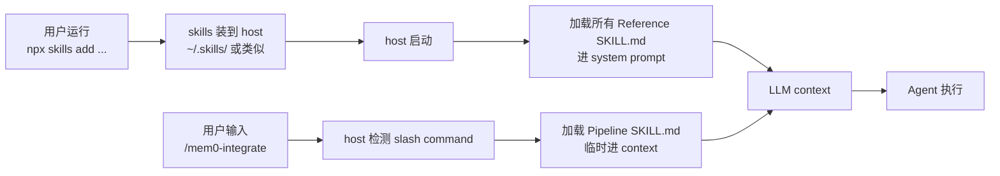

# Layer 11 — AI Agent Skill 层(D 专题)

> 对应 ONBOARDING.md §5 Layer 11 / 13 文件(实际 25+) / `notes/09-skills/` 已有 1 篇概述但很浅
> 范围:`skills/` 6 个 skill 包 = 3 Reference + 3 Pipeline
> 上游 HEAD:`4debc58a`

---

## 0. TL;DR(3 句话)

1. **Skill = 给 AI agent 装上的"预加载知识包"**——一个 `SKILL.md` 文件,装上后 LLM context 永远有它(Reference 类),或者用户用 slash command 显式触发才进入 context(Pipeline 类)。
2. **6 个 skill = 3+3**:
   - **Reference (always-on)**:`mem0`(SDK 集成)、`mem0-cli`(终端)、`mem0-vercel-ai-sdk`(Vercel AI)
   - **Pipeline (on-demand)**:`mem0-integrate`(把 Mem0 接到现有 repo)、`mem0-test-integration`(验证 integrate 产出)、`mem0-oss-to-platform`(OSS→Platform 迁移)
3. **核心模式**:`description` frontmatter 用 `TRIGGER when:` / `DO NOT TRIGGER when:` 精确路由——多个 skill 互相 disambiguate,避免误触发。Pipeline skill 还有 `WebFetch canonical sources` 防止 LLM 用过期记忆。

---

## 1. 该层的角色与边界

### 1.1 为什么需要这一层

L1-L10 解决了"Mem0 自己怎么实现 + 怎么集成到 host"。但用户(开发者)拿到 Mem0 后还要**写代码**——他们用的不是 Mem0 内部 API,而是公开的 SDK / CLI / 集成。

**问题**:LLM 写 Mem0 集成代码时,会凭训练数据里的旧 API(v2 甚至 v1)猜测,经常写错。Mem0 v3 改了默认值(`top_k=20` 不是 `100`、`threshold=0.1`、`rerank=False`)、改了 entity 参数位置(从 top-level 移到 `filters`)、改了 graph 字段(从 OSS 移到 Platform 独占)——LLM 不知道就写错。

**Skill 的解决方案**:**预先把"正确写法的上下文"装进 agent 的 system prompt 或 RAG 库**,LLM 写代码时直接读到 v3 规范,不用猜。这比"用 web search 找最新文档"快且可靠。

### 1.2 边界

| 不归该层做 | 归该层做 |
|---|---|
| 实现 SDK / CLI / 集成代码(L1-L10) | 教 agent 怎么**用** SDK / CLI / 集成 |
| 跑 benchmark / 训模型 | 提供"正确代码片段"作为 LLM 的Few-shot 上下文 |
| 维护 docs.mem0.ai(L12) | **指向** docs,但不重复 docs 内容(skill 是浓缩版) |
| 替代 IDE 的代码补全 | 提供 trigger 路由,让 agent 知道何时该用哪个 skill |

### 1.3 Skill 与文档(docs/)| 集成(integrations/)的关系

```
docs/ (L12, Mintlify 站点)         ← 用户主动阅读的网页文档
   ↑
   │ skill 引用(链接到 docs.mem0.ai)
   │
skills/ (L11, SKILL.md)            ← 装到 agent 上下文里的预加载包
   ↓
   │ skill 指导 agent 怎么调
   │
integrations/ (L10, plugin/SDK)    ← agent 调用的实际代码
```

**Skill 是 docs 和 integrations 之间的"中介"**——把 docs 的关键内容浓缩进 agent context,然后 agent 用对的方法调 integrations。

---

## 2. 6 个 Skill 总览

| # | Skill | 类型 | 入口 | 行数 | 触发关键词 | 反触发关键词 |
|---|---|---|---|---|---|---|
| 1 | **mem0** | Reference(always-on) | `skills/mem0/SKILL.md` | 193 | "mem0", "MemoryClient", "memory layer", "remember user preferences", "persistent context" | CLI 终端、Vercel AI SDK |
| 2 | **mem0-cli** | Reference | `skills/mem0-cli/SKILL.md` | 169 | "mem0 cli", "mem0 command line", "@mem0/cli", "mem0-cli", "mem0 add/search/list", "--user-id", "--json" | 程序 SDK 调用、Vercel AI SDK |
| 3 | **mem0-vercel-ai-sdk** | Reference | `skills/mem0-vercel-ai-sdk/SKILL.md` | 192 | "vercel ai sdk", "@mem0/vercel-ai-provider", "createMem0", "retrieveMemories", "AI SDK provider" | 直接 SDK、CLI |
| 4 | **mem0-integrate** | Pipeline(`/mem0-integrate`) | `skills/mem0-integrate/SKILL.md` | **620** | "integrate mem0", "add mem0 to this repo", "wire mem0 into" | 通用 SDK 用法、CLI、Vercel AI |
| 5 | **mem0-test-integration** | Pipeline(`/mem0-test-integration`) | `skills/mem0-test-integration/SKILL.md` | 368 | "verify", "test the integration", 存在 `.mem0-integration/` 目录 | 通用项目测试、无 prior integrate |
| 6 | **mem0-oss-to-platform** | Pipeline(`/mem0-oss-to-platform`) | `skills/mem0-oss-to-platform/SKILL.md` | 120 | "migrate my mem0 setup", "switch from self-hosted", "use my mem0 API key instead of Qdrant" | (无显式反触发,默认就是它) |

**安装方式**(三选一):
```bash
npx skills add https://github.com/mem0ai/mem0 --skill <name>   # 通用的 skills 标准
# 或:通过 mem0-plugin 安装(自动装 mem0 + mem0-cli + mem0-vercel-ai-sdk)
# 或:OpenCode `opencode plugin @mem0/opencode-plugin`
```

---

## 3. SKILL.md 文件格式剖析

所有 6 个 SKILL.md 都遵循同一格式:

```markdown
---
name: <skill-name>                           # 全小写,带连字符
description: >                               # ⭐ 关键字段:trigger router
  <一句话总结>。
  TRIGGER when: <触发关键词列表,逗号分隔>
  DO NOT TRIGGER when: <反触发,告诉 agent 用别的 skill>
license: Apache-2.0
metadata:
  author: mem0ai
  version: "3.0.0"                           # 语义化版本
  category: ai-memory
  tags: "<comma-separated>"
  mem0_tested_versions: "..."                # (pipeline skill) 兼容版本范围
  coupling: loose                            # (mem0-test-integration 独有)
compatibility: <运行环境要求>                # Python/Node 版本、env vars、网络
---

# <Skill Title>

> **Skill Graph:** 该 skill 在 skill 图里的位置(互相引用)

## Step 1 / Phase 1 / Pattern 1 ...
## Step 2 ...
...
## Common edge cases / Gotchas
## References                               # 深参考文件链接表
## Related Mem0 Skills                      # 互相 disambiguate
```

### 3.1 `description` 字段——trigger 路由器(最重要)

这是 skill 系统的"调度入口"。LLM 看到用户 query 时,先用 description 决定要不要加载这个 skill。`description` 的写法规律:

- **正面信号**:`TRIGGER when:` 后列具体关键词(技术名词、错误信息、CLI 命令、import 语句、env var 名)
- **负面信号**:`DO NOT TRIGGER when:` 显式声明边界,告诉 agent"这种情况用别的 skill"
- **范围声明**:`Covers Python SDK (mem0ai), TypeScript SDK (mem0ai), and framework integrations`——明示覆盖范围
- **默认声明**:`This is the DEFAULT mem0 skill for ambiguous queries.`——`mem0` skill 是默认 fallback

**这种"双向 disambiguation"是关键设计**——避免多个 skill 互相误触发。例如用户问"在 Next.js 里用 mem0",可能同时匹配 `mem0`(关键词 "mem0")和 `mem0-vercel-ai-sdk`(关键词 "vercel")。`mem0` 的 description 显式说 `DO NOT TRIGGER when: Vercel AI SDK / @mem0/vercel-ai-provider / createMem0 (use mem0-vercel-ai-sdk)`,把球踢给 Vercel skill。

### 3.2 Reference vs Pipeline 的格式差异

| 字段 | Reference | Pipeline |
|---|---|---|
| 触发方式 | always-on(装上就在 context) | 用户输入 `/skill-name` slash command |
| 长度 | 短(~150-200 行,只给"正确写法") | 长(`mem0-integrate` 620 行,完整工作流) |
| 主体结构 | Step 1 / Step 2 / Step 3(教程式) | Phase 0 / Phase 1 / ... / Phase N(项目式) |
| 是否调用工具 | 否(只提供知识) | **是**(创建 branch / 写文件 / 跑测试 / WebFetch) |
| 是否产 artifacts | 否 | 是(`.mem0-integration/` 目录、`MEM0_MIGRATION_PLAN.md`) |

---

## 4. Reference Skill 三件套详读

### 4.1 `skills/mem0/SKILL.md`(193 行,主入口)

#### 4.1.1 文件作用

**默认 mem0 skill**——开发者写"在 Python/TS 代码里调 Mem0 SDK"时进入 context 的主入口。覆盖 Platform + OSS、Python + TypeScript、framework 集成(LangChain/CrewAI/OpenAI Agents/Pipecat/LlamaIndex/AutoGen/LangGraph)。

#### 4.1.2 内容结构(7 节)

1. **Step 1: Install and authenticate** — `pip install mem0ai` / `npm install mem0ai` + `MEM0_API_KEY` 设置
2. **Step 2: Initialize the client** — Python `MemoryClient(api_key=...)` / TS `new MemoryClient({apiKey: ...})`
3. **Step 3: Core operations** — `add` / `search` / `get_all` / `update` / `delete` 五个核心方法的代码片段
4. **Common integration pattern** — **黄金 3 步循环**:`Retrieve → Generate → Store`(20 行完整 Python 例子)
5. **Common edge cases** — 5 个常见坑(async 处理延迟、AND filter 行为、duplicate memory、wrong import、v3 defaults)
6. **v2 Compatibility** — v2 → v3 的关键差异(entity ID 位置、defaults、graph)
7. **Live documentation search** — 调用 `${CLAUDE_SKILL_DIR}/scripts/mem0_doc_search.py` 实时搜文档

#### 4.1.3 黄金 3 步循环(任何集成都是这个模式)

```python
def chat(user_input: str, user_id: str) -> str:
    # 1. Retrieve relevant memories
    memories = mem0.search(user_input, filters={"user_id": user_id})
    context = "\n".join([m["memory"] for m in memories.get("results", [])])

    # 2. Generate response with memory context
    response = openai.chat.completions.create(
        model="gpt-5-mini",
        messages=[
            {"role": "system", "content": f"User context:\n{context}"},
            {"role": "user", "content": user_input},
        ]
    )
    reply = response.choices[0].message.content

    # 3. Store interaction for future context
    mem0.add(
        [{"role": "user", "content": user_input}, {"role": "assistant", "content": reply}],
        user_id=user_id
    )
    return reply
```

**这是 Mem0 集成的"Hello World"**——所有 framework 集成都是这个模式的变体。agent 学会这个就解决 80% 的 Mem0 集成需求。

#### 4.1.4 `mem0/references/` 7 篇深参考

| 文件 | 行数 | 内容 |
|---|---|---|
| `quickstart.md` | 119 | Python/TS/cURL 三种 quickstart |
| `sdk-guide.md` | 353 | 所有方法的完整签名 + 例子 |
| `api-reference.md` | 150 | REST endpoints + filters + object schema |
| `architecture.md` | 330 | add pipeline / search pipeline / lifecycle / scoping / 多租户 / 性能 |
| `features.md` | 406 | Platform 功能详(retrieval / graph / categories / MCP / etc) |
| `integration-patterns.md` | 395 | 7 个 framework 集成模式 |
| `use-cases.md` | 720 | 真实场景代码(companion / RAG / agent / etc) |

**总 2473 行深参考**——SKILL.md 只装 193 行精简版,需要时 agent 按需加载 references。**这是"渐进式 context 加载"**——避免 always-on 把所有内容塞进 context。

#### 4.1.5 `mem0/client/` 3 篇语言深参考

| 文件 | 行数 | 内容 |
|---|---|---|
| `python.md` | 487 | Python SDK 完整方法签名(MemoryClient + AsyncMemoryClient + Memory OSS) |
| `node.md` | 418 | TypeScript SDK 完整方法 |
| `differences.md` | 129 | Python vs TS 差异(命名、async、类型、错误处理) |

#### 4.1.6 `mem0/scripts/mem0_doc_search.py`

实时文档搜索工具——agent 装上 skill 后,如果 references 里没覆盖到的问题,可以用这个脚本直接搜 `docs.mem0.ai`(无需 API key):

```bash
python ${CLAUDE_SKILL_DIR}/scripts/mem0_doc_search.py --query "graph memory"
python ${CLAUDE_SKILL_DIR}/scripts/mem0_doc_search.py --page "/platform/features/graph-memory"
python ${CLAUDE_SKILL_DIR}/scripts/mem0_doc_search.py --index
```

**这是"逃生通道"**——skill 内容固定,docs 在变;agent 遇到 skill 没覆盖的新功能,可以直接查 docs。

### 4.2 `skills/mem0-cli/SKILL.md`(169 行)

#### 4.2.1 内容结构

1. **Install** — Node `npm install -g @mem0/cli` 或 Python `pip install mem0-cli`,两者命令一致
2. **Setup** — 重点突出 **agent 自主模式**:`mem0 init --agent --agent-caller <your-name> --json`(5 秒生成 evaluation key,无 email)
3. **Quick Reference** — 7 个核心命令的代码例子(add/search/list/get/update/delete/delete --all)
4. **Agent / JSON Mode** — `--json` 或 `--agent` 输出结构化 envelope(`{status, command, duration_ms, scope, count, error, data}`)
5. **Node and Python Parity** — 两个 CLI 实现从同一 `cli-spec.json`,行为完全一致
6. **Common Edge Cases** — async 延迟、`--all` vs `--entity` delete、entity ID 解析、stdin 检测

#### 4.2.2 Agent Mode 的特殊设计

```bash
mem0 init --agent --agent-caller claude-code --json
```

这是 **agent 友好的关键设计**:
- `--agent`:输出 JSON,无 spinner(纯结构化)
- `--agent-caller <name>`:agent 自报身份(claude-code/cursor/codex/cline/aider),用于遥测
- `--json`:同 `--agent`,但 stdout 干净(JSON 全在 stdout,spinner/progress 全在 stderr)

**这是 agent-vs-human 输出分离的标准模式**——所有 CLI 工具都该这样设计。

#### 4.2.3 `mem0-cli/references/` 3 篇深参考

| 文件 | 内容 |
|---|---|
| `command-reference.md` | 所有命令、flag、option 的完整参考 |
| `configuration.md` | 配置文件、env vars、init wizard、precedence |
| `workflows.md` | 实战工作流:piping、scripting、CI/CD、agent mode 食谱 |

### 4.3 `skills/mem0-vercel-ai-sdk/SKILL.md`(192 行)

#### 4.3.1 内容结构(3 个 Pattern)

1. **Pattern 1: Wrapped Model**(`createMem0()`)—— `mem0("gpt-5-mini", {user_id})` 一行包 LLM
2. **Pattern 2: Standalone Utilities**(`retrieveMemories / addMemories / getMemories / searchMemories`)—— 手动控制每步
3. **Pattern 3: Streaming**(`streamText`)—— 流式响应 + memory

#### 4.3.2 4 个 utility 函数的差异

| 函数 | 返回 | 用途 |
|---|---|---|
| `retrieveMemories` | 格式化 system prompt **string** | 直接注入 `system` 参数 |
| `getMemories` | 原 memory **array** | 编程式处理 |
| `searchMemories` | 完整 search response(含 relations / scores / metadata) | 需要 relations 和 score |
| `addMemories` | API response | 存新消息 |

#### 4.3.3 关键约束

- 用 **Vercel AI SDK v5**(`LanguageModelV2` / `ProviderV2`),不兼容 v3/v4
- `processMemories` 是 **fire-and-forget**(不 await),memory 存储异步,不阻塞 LLM 响应
- `"gemini"` alias 在 provider switch 里存在但 `supportedProviders` 没列——用 `"google"` 代替
- 支持 5 个 provider:OpenAI(默认)、Anthropic、Google、Groq、Cohere

#### 4.3.4 `mem0-vercel-ai-sdk/references/` 3 篇

| 文件 | 内容 |
|---|---|
| `provider-api.md` | `createMem0` / `Mem0Provider` / 类型定义 |
| `memory-utilities.md` | 4 个 utility 函数详细签名 |
| `usage-patterns.md` | 实战使用模式 |

---

## 5. Pipeline Skill 三件套详读

### 5.1 `skills/mem0-integrate/SKILL.md`(620 行,最大)

#### 5.1.1 文件作用

**把 Mem0 接到现有 repo**——TDD 流水线,从 `git clone` 到 PR-ready 的全过程。最终产出:
- 一个 feature branch(`mem0-integrate/<slug>`)
- `.mem0-integration/` 目录:`product.json` / `goal.md` / `plan.md`(供 paired 的 test-integration 消费)
- 修改后的代码 + 新测试

#### 5.1.2 关键设计:5 个 Integration Principles(non-negotiable)

```
1. Additive, not replacing      # 不替换现有 memory/session/user-context 系统
2. Opt-in by default            # feature flag 控制(MEM0_ENABLED=1)
3. No breakage                  # 不删 export、不改 signature、不改现有测试
4. Native stack                 # 用 repo 的语言和测试框架
5. Plan before code             # 写代码前先 plan.md 给人审
```

**这 5 条是"PR-ready"的硬约束**——任何违反都是 skill 失败。`mem0-test-integration` 会检查这些。

#### 5.1.3 10 步 TDD 流水线(简化)

```
Phase 1: Discover ─── grep 找 mem0 现有用法、依赖、env vars
Phase 2: Plan ─────── 写 plan.md,人工审
Phase 3: Test-first ── 写 failing tests(还没实现)
Phase 4: Scaffold ─── 加依赖、加 config、加 feature flag
Phase 5: Implement ── 实现 minimal viable integration
Phase 6: Test ─────── 跑测试,所有应该 pass
Phase 7: Document ─── 在 repo README 加 Mem0 集成说明
Phase 8: Smoke ────── 用真 API key 跑 end-to-end
Phase 9: Cleanup ──── 删调试代码、format、lint
Phase 10: PR-ready ── commit、push、写 PR description
```

#### 5.1.4 Canonical Sources(防 LLM 用过期记忆)

SKILL.md 强制要求 agent 在 step 3 前 WebFetch 这些 URL,引到 plan.md:

- `https://docs.mem0.ai/llms.txt` — scope-tagged docs index
- `https://docs.mem0.ai/llms-full.txt` — 全文 docs
- `https://docs.mem0.ai/openapi.json` — OpenAPI spec
- 其他 published skill URL

**这是 pipeline skill 的"反幻觉设计"**——不依赖训练数据,强制实时拉权威源。

### 5.2 `skills/mem0-test-integration/SKILL.md`(368 行)

#### 5.2.1 文件作用

验证 `/mem0-integrate` 的产出。**Loose coupling**——只跑 compile / runtime check,不检查逻辑正确性(逻辑让人审)。

#### 5.2.2 关键设计:两遍测试(Pass A / Pass B)

```
Pass A — flag unset(MEM0_ENABLED 不设)
    → 所有 pre-existing tests 必须 pass
    → smoke/E2E 跳过
    → repo 行为应该跟 main 一致(byte-for-byte)
    → 失败 = hard fail,不让 self-heal loop 改

Pass B — flag set(MEM0_ENABLED=1)
    → 新加的 tests 必须 pass
    → smoke 和 E2E 跑
    → 失败 = soft fail,可以让 self-heal loop 修
```

**Pass A 是"non-invasive 校验"**——证明集成没有破坏原有功能。`mem0-test-integration` 把 Pass A 失败标 `non_invasive: false` + `overall: fail`,**distinct reason code 让 integrator 的 self-heal loop 拒绝 patch**——避免自动修复引入更多破坏。

#### 5.2.3 Preconditions(拒绝启动条件)

skill 拒绝跑,除非:
- `.mem0-integration/` 存在
- `product.json` / `goal.md` / `plan.md` 都可读且内部一致
- 当前 branch 以 `mem0-integrate/` 开头(防止误跑在无关 branch)
- working tree 干净(skill 不改源码)
- API key 在环境变量里

**这种"严格 preconditions"是 pipeline skill 的安全网**——避免在错误状态下运行产生误导性结果。

#### 5.2.4 产出:Scorecard

最终输出一个 scorecard,包含:
- `compile_check: pass/fail`
- `runtime_check: pass/fail`
- `non_invasive: true/false`(Pass A 结果)
- `smoke_test: pass/fail/skip`
- `overall: pass/fail`
- 每个 fail 都有 distinct reason code

### 5.3 `skills/mem0-oss-to-platform/SKILL.md`(120 行)

#### 5.3.1 文件作用

迁移项目从 OSS(self-hosted `Memory`)到 Platform(hosted `MemoryClient`)。**核心是"减法"**——OSS 配置的 `vector_store` / `llm` / `embedder` / `graph_store` / `history_db_path` 全部删除,只剩 `MemoryClient(api_key=...)`。

#### 5.3.2 5 阶段工作流

```
Phase 0: Prerequisite ── 确认有 MEM0_API_KEY
Phase 1: Discover ────── 找所有 mem0 用法(import / config / call sites / deps / env)
Phase 2: Verify API ──── 用 inspect.signature 查 installed SDK 的真实签名(不靠记忆)
Phase 3: Map sites ───── 每个调用点 → hosted 等价;flag 不 clean 1:1 的需要人审
Phase 4: Write plan ──── 写到 MEM0_MIGRATION_PLAN.md,然后停,等人审
Phase 5: Execute ─────── 审批后,逐文件改 + 验证 import / smoke / 不再有本地存储目录
```

**Phase 2 "Verify API" 是关键习惯**——OSS 和 hosted class 签名有 subtle 差异,必须 inspect installed package 而不是凭记忆。

#### 5.3.3 `mem0-oss-to-platform/references/` 3 篇

| 文件 | 内容 |
|---|---|
| `api-mapping.md` | OSS → hosted 每个 method/param/return 的精确映射(Python + TS) |
| `gotchas.md` | 不 clean 1:1 的情形:自托管/数据驻留、本地模型、graph memory、custom prompt、热路径网络延迟、**本地存储的 memory 不会自动迁移**(数据迁移超出 scope) |
| `plan-template.md` | `MEM0_MIGRATION_PLAN.md` 的精确结构模板 |

#### 5.3.4 Scope Discipline

> "Strictly scoped to the mem0 integration — it does not refactor, restructure, or 'improve' any unrelated code."

**这是 skill 的硬纪律**——用户请的是 swap backend,不是 refactor。任何"顺手改"都是 scope creep,违反 skill 契约。

---

## 6. 13 个 ONBOARDING 提到的文件 + 12 个未提到

ONBOARDING §5 Layer 11 列了 13 个文件(6 SKILL.md + 7 references),实际 `skills/` 目录有 25+ 个 markdown:

### 6.1 ONBOARDING 提到的 13 个

| 文件 | 行数 | 类型 |
|---|---|---|
| `skills/mem0/SKILL.md` | 193 | Reference 主入口 |
| `skills/mem0-cli/SKILL.md` | 169 | Reference CLI |
| `skills/mem0-vercel-ai-sdk/SKILL.md` | 192 | Reference Vercel |
| `skills/mem0-integrate/SKILL.md` | 620 | Pipeline TDD 集成 |
| `skills/mem0-test-integration/SKILL.md` | 368 | Pipeline 验证 |
| `skills/mem0-oss-to-platform/SKILL.md` | 120 | Pipeline 迁移 |
| `skills/mem0/references/api-reference.md` | 150 | REST endpoints + schema |
| `skills/mem0/references/architecture.md` | 330 | add/search pipeline 内部 |
| `skills/mem0/references/features.md` | 406 | Platform features 详 |
| `skills/mem0/references/integration-patterns.md` | 395 | 7 framework 集成模式 |
| `skills/mem0/references/quickstart.md` | 119 | Python/TS/cURL quickstart |
| `skills/mem0/references/sdk-guide.md` | 353 | 全方法签名 |
| `skills/mem0/references/use-cases.md` | 720 | 真实场景代码 |

### 6.2 ONBOARDING 未提到但存在的 12 个

| 文件 | 行数 | 角色 |
|---|---|---|
| `skills/README.md` | 51 | skill 系统总览(分类、安装、选 skill) |
| `skills/mem0/LICENSE` / `skills/mem0-cli/LICENSE` / ... | (6 个) | Apache-2.0 LICENSE 文件 |
| `skills/mem0/README.md` | (小) | mem0 skill 简介 |
| `skills/mem0-cli/README.md` | (小) | CLI skill 简介 |
| `skills/mem0-integrate/README.md` | (小) | integrate skill 简介 |
| `skills/mem0-test-integration/README.md` | (小) | test-integration skill 简介 |
| `skills/mem0-vercel-ai-sdk/README.md` | (小) | Vercel skill 简介 |
| `skills/mem0-oss-to-platform/README.md` | (小) | OSS→Platform skill 简介 |
| `skills/mem0/references/api-reference.md` ⚠️ | 150 | **重复!**有 `api-reference.md` 和 `api.md`(后者 ONBOARDING 标注) |
| `skills/mem0/client/python.md` | 487 | Python SDK 完整签名 |
| `skills/mem0/client/node.md` | 418 | TS SDK 完整签名 |
| `skills/mem0/client/differences.md` | 129 | Python vs TS 差异 |
| `skills/mem0-cli/references/command-reference.md` | (中) | CLI 命令完整参考 |
| `skills/mem0-cli/references/configuration.md` | (中) | 配置文件、env vars、precedence |
| `skills/mem0-cli/references/workflows.md` | (中) | piping / scripting / CI/CD 食谱 |
| `skills/mem0-vercel-ai-sdk/references/provider-api.md` | (中) | `createMem0` / `Mem0Provider` |
| `skills/mem0-vercel-ai-sdk/references/memory-utilities.md` | (中) | 4 个 utility 函数 |
| `skills/mem0-vercel-ai-sdk/references/usage-patterns.md` | (中) | 实战使用模式 |
| `skills/mem0-oss-to-platform/references/api-mapping.md` | (中) | OSS → hosted 映射 |
| `skills/mem0-oss-to-platform/references/gotchas.md` | (中) | 不 clean 1:1 的坑 |
| `skills/mem0-oss-to-platform/references/plan-template.md` | (中) | 迁移计划模板 |
| `skills/mem0/scripts/mem0_doc_search.py` | (Python) | 实时文档搜索工具 |

**注意 ONBOARDING §5 Layer 11 把 `api.md` 列为 `skills/mem0/references/` 的文件,实际是 `api-reference.md`(全名)——这是 ONBOARDING 的小笔误**。

---

## 7. Skill 加载机制(与 host 集成层 L10 的关系)

### 7.1 安装到 host



### 7.2 不同 host 的 skill 加载方式

| Host | 加载方式 |
|---|---|
| Claude Code | 通过 `mem0-plugin` 装,skill 自动注册 |
| OpenCode | 通过 `@mem0/opencode-plugin` 装,plugin entry 注册 skill 引用 |
| OpenClaw | 通过 `@mem0/openclaw-mem0` 装,`openclaw.plugin.json` 的 `skills: ["skills"]` 字段声明 |
| Cursor / Codex(只 MCP) | **不能装 skill**——只能用 MCP server(无 skill 增强) |
| Pi Agent | `package.json` 的 `pi.skills: ["./skills"]` 字段声明 |
| 通用 | `npx skills add https://github.com/mem0ai/mem0 --skill <name>` |

### 7.3 Context 占用管理

**Reference skill 是 always-on**——意味着 193 + 169 + 192 = **554 行 markdown 永远在 context**。对 200K context window 的 LLM 来说不是问题,但对 8K-32K 的小模型可能挤压用户对话空间。

**Mem0 的策略**:
- SKILL.md 主体保持精简(<200 行)
- 把详细内容放 `references/`,agent 按需加载(`Load these on demand for deeper detail`)
- `mem0_doc_search.py` 作为逃生通道,实在不行直接搜 docs

---

## 8. 共通模式

### 8.1 所有 SKILL.md 都有的 4 个 section

1. **Install / Setup**——怎么装、怎么配 API key
2. **Quick Reference / Patterns / Workflow**——核心代码片段或工作流
3. **Common Edge Cases / Gotchas**——已知坑和解决方案
4. **References / Related Mem0 Skills**——深参考链接 + 互相 disambiguate

### 8.2 Description 字段的"双向路由"模式

```yaml
description: >
  <一句话>。
  TRIGGER when: <关键词列表>。
  DO NOT TRIGGER when: <反触发,指定用别的 skill>。
```

**6 个 skill 的 description 形成完整路由图**——任何用户 query 应该精确匹配一个 skill。这种"用自然语言做 router"是 skill 系统的核心创新。

### 8.3 Pipeline skill 的"强约束"模式

3 个 pipeline skill 都强调:
- **Plan before code**(`mem0-integrate` Phase 2 / `mem0-oss-to-platform` Phase 4)——先写 plan,人审,再执行
- **WebFetch canonical sources**——不靠记忆,实时拉权威源
- **Scope discipline**——只做该做的事,不顺手 refactor
- **Strict preconditions**——条件不满足就拒绝启动
- **Distinct reason codes**——失败原因可机器解析,让 self-heal loop 知道该不该介入

### 8.4 Reference skill 的"渐进式 context 加载"模式

```
SKILL.md (always-on, ~200 行)
   ↓ 用户问到具体细节
references/<file>.md (按需加载,~300-700 行)
   ↓ references 没覆盖
scripts/mem0_doc_search.py (实时搜 docs.mem0.ai)
   ↓ docs 也没有
WebFetch GitHub 上游源码 (终极逃生)
```

**这种 4 层降级是 RAG 系统的最佳实践**——always-on 是核心,referenc 是 cache,doc search 是 query,GitHub 是 ground truth。

---

## 9. 该层的"反模式 / 坑"

### 9.1 Skill 之间的边界冲突

`mem0` / `mem0-cli` / `mem0-vercel-ai-sdk` 三个 reference skill 的 description 高度重叠(都提"mem0")。Mem0 用 `DO NOT TRIGGER when` 互相 disambiguate,但**这种"自然语言 router"不可靠**——LLM 可能同时加载多个 skill,占用大量 context。

**改进方向**:用更结构化的 router(如 ML 分类器),而不是关键词匹配。

### 9.2 always-on 的 context 浪费

如果用户只在 Python 项目里用 OSS,装上 `mem0` skill 后,**TS / Vercel / Platform 相关内容一直在 context**,但用户用不到。这是 always-on 的固有代价。

**缓解**:Mem0 在 SKILL.md 里用"Platform / OSS"和"Python / TypeScript"section 标题清楚分隔,让 LLM 知道哪些可跳过。但 LLM 不一定听话。

### 9.3 references 文件路径不一致

ONBOARDING 提到的 `api.md` 实际是 `api-reference.md`——**这是 skill 文档的小不一致**。`skills/mem0/SKILL.md` 里的链接(`references/api-reference.md`)是对的,ONBOARDING 写错了。这种小错会让 grep 找不到文件。

### 9.4 Pipeline skill 的版本绑定

`mem0-integrate` 和 `mem0-test-integration` 在 frontmatter 写:
```yaml
mem0_tested_versions: "mem0ai (PyPI) >=2.0.0,<3.0.0; mem0ai (npm) >=3.0.0,<4.0.0"
```

**但 `mem0/SDK` 当前是 v3,frontmatter 还写 `<3.0.0`**——这是过期的版本范围。pipeline skill 跑时会因为版本不匹配拒绝,但实际 SDK 已经在 v3。**这种"skill 滞后于 SDK"是该层的运维风险**。

### 9.5 mem0-doc-search.py 的依赖

`mem0_doc_search.py` 是 Python 脚本,需要本地有 Python。但 `mem0-vercel-ai-sdk` skill 的用户可能只用 Node——他们没法用这个逃生通道。**这是个 cross-language 设计盲点**。

---

## 10. 阅读完本专题后应该理解

- ✅ 为什么需要 skill 系统(LLM 凭训练数据写代码会出错)
- ✅ Reference vs Pipeline 的根本差异(always-on vs slash command)
- ✅ 6 个 skill 的责任划分和 trigger 路由
- ✅ SKILL.md 的 frontmatter 设计(description 双向路由)
- ✅ mem0/SKILL.md 的黄金 3 步循环(Retrieve → Generate → Store)
- ✅ mem0-integrate 的 5 个 Integration Principles 和 10 步 TDD
- ✅ mem0-test-integration 的 Pass A / Pass B 双遍测试
- ✅ mem0-oss-to-platform 的 Phase 0-5 工作流
- ✅ 渐进式 context 加载(SKILL.md → references → doc_search → GitHub)
- ✅ Pipeline skill 的"反幻觉"机制(WebFetch canonical sources)
- ✅ 该层与 L10 host 集成层的关系

---

📌 **下一步**:
- 3 大缺口 D 专题全部完成(L10 集成 / L2 Provider 补丁 / L11 Skill)
- 接下来按 ROI 顺序:C 综述层(L7 Dashboard / L6 TS SDK / L8 Server / L9 CLI / L4 Utils / L13 Examples / L14 Tests / L12 Docs / L5 Client / L15 顶层)
- 优先建议:**L7 Dashboard**(8 文件全空,Next.js 独立子项目)→ **L6 TS SDK 补**(8 未覆盖,跟 Python 平行实现)
