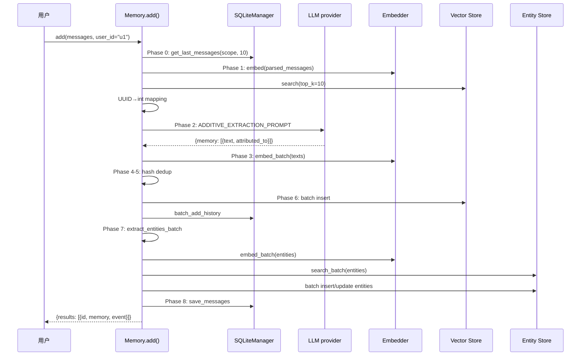
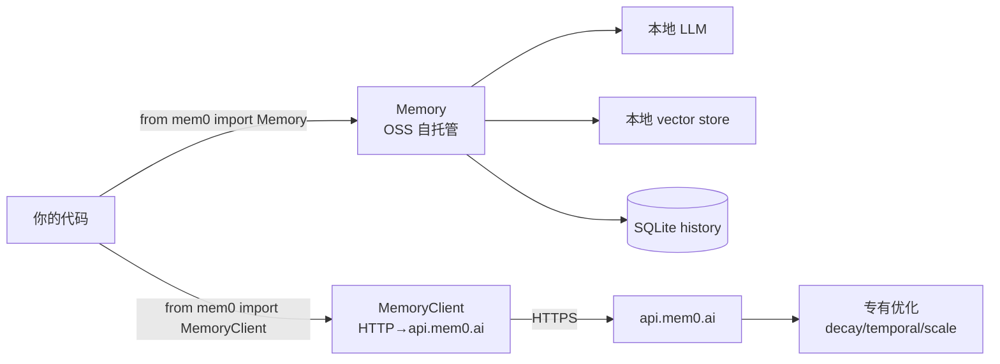
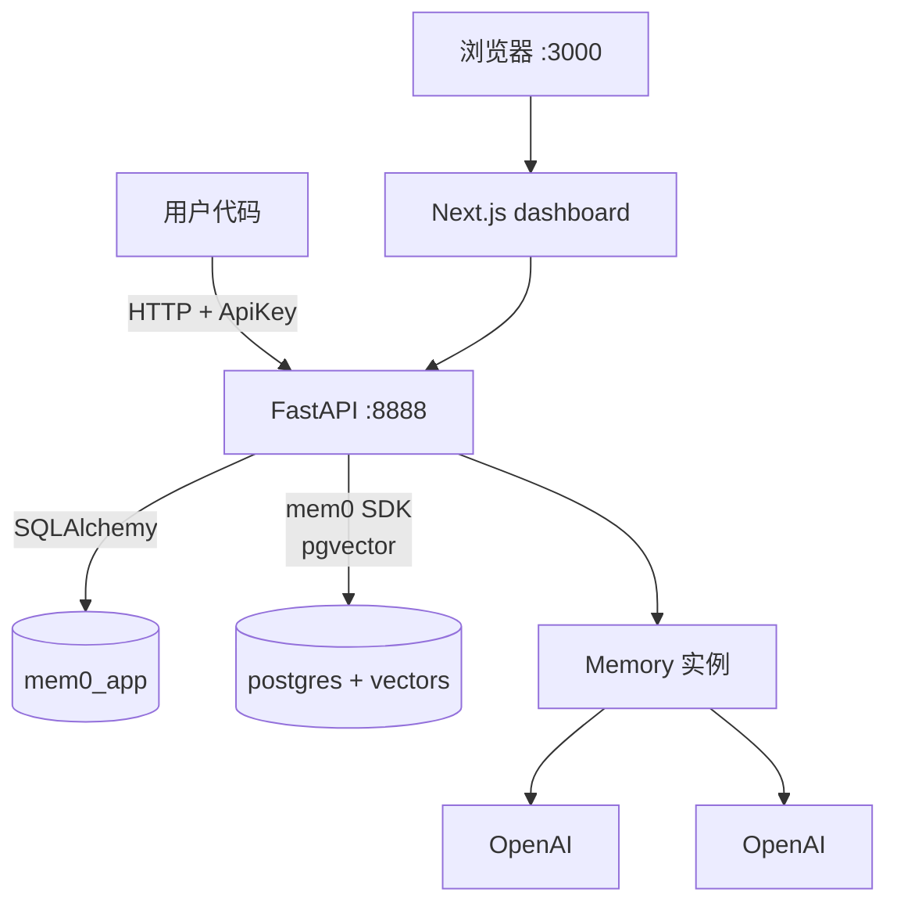
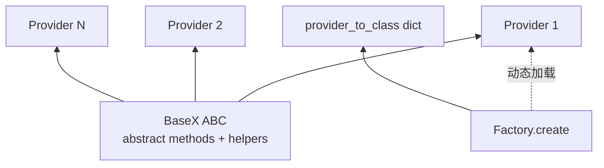
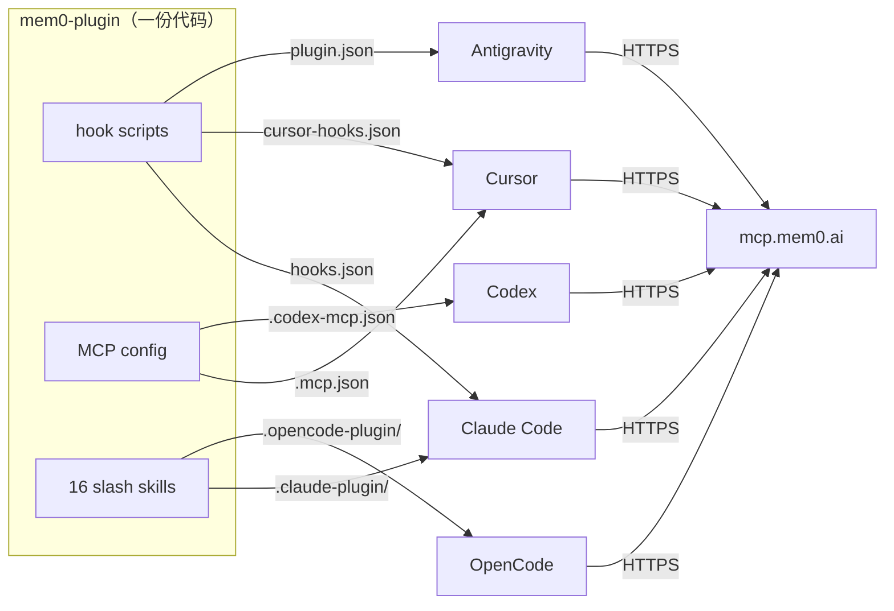

# 附录 — 术语表 + 数据流图汇总 + 阅读顺序

> 全笔记系列的索引。读完任一篇后回来这里找下一个去哪。

---

## A. 术语表（Glossary）

### Mem0 核心概念

| 术语 | 含义 |
|------|------|
| **Memory** | 一条结构化记忆（"User likes dark mode"）,有 id/text/hash/metadata/score |
| **MemoryItem** | Pydantic model,API 返回的标准格式（详见 [`../01-py-sdk-core/04-configs.md`](../01-py-sdk-core/04-configs.md) §3） |
| **Entity** | 从 memory text 抽的实体（人名/组织/...）,存在独立 collection |
| **linked_memory_ids** | entity 上"链接到哪些 memory"的列表 |
| **Scope** | user_id / agent_id / run_id,必须至少一个 |
| **actor_id** | 谁产生的 memory（user/assistant 的 name） |
| **Session** | 由 user+agent+run 决定的会话 scope,SQLite 存最近 10 条 |
| **Hash dedup** | md5(text) 去重,O(1) |
| **Additive extraction** | April 2026 算法,只 ADD 不 UPDATE/DELETE |
| **Multi-signal fusion** | semantic + BM25 + entity boost 三信号融合 |

### Provider 类

| 类 | 数量 | 用途 |
|---|------|------|
| LLM | 21 | 文本生成 |
| Embedder | 15 | 向量化 |
| VectorStore | 28 | 存向量 + 检索 |
| Reranker | 5 | 二次重排 |
| ~~Graph~~ | ~~4~~ | **已移除** |

### 算法术语

| 术语 | 含义 |
|------|------|
| **V3 PHASED BATCH PIPELINE** | add() 的 8 阶段流水线 |
| **BM25** | 关键词检索算法 |
| **`normalize_bm25`** | sigmoid 把 raw BM25 score 归一到 [0,1] |
| **`score_and_rank`** | 多信号融合主函数 |
| **`ENTITY_BOOST_WEIGHT = 0.5`** | entity 信号权重 |
| **`memory_count_weight`** | entity 链接越多 memory,boost 越小（衰减） |
| **`internal_limit = max(top_k*4, 60)`** | over-fetch 池大小 |

### 模式 / 部署

| 术语 | 含义 |
|------|------|
| **OSS** | Open Source SDK,自托管,本地组件 |
| **Platform** | Mem0 托管的 cloud（api.mem0.ai） |
| **Self-Hosted Server** | docker compose 起的 FastAPI server |
| **`Memory`** | OSS Memory 类（`from mem0 import Memory`） |
| **`MemoryClient`** | Hosted client（`from mem0 import MemoryClient`） |
| **`MEM0_API_KEY`** | Platform API key 环境变量 |
| **`MEM0_DIR`** | mem0 数据目录（默认 `~/.mem0`） |
| **`MEM0_TELEMETRY`** | 遥测开关（默认 True） |

### 关键 issue

| issue | 含义 |
|-------|------|
| #6655 | identity scope 注入（caller metadata 设 user_id） → `_strip_identity_keys` 修复 |
| #4490 | 同上 |
| #6277 | 同上 |

---

## B. 数据流图汇总

### B.1 add() 完整流程



详见 [`../01-py-sdk-core/06-add-pipeline.md`](../01-py-sdk-core/06-add-pipeline.md)。

### B.2 search() 多信号融合

```mermaid
graph TB
    Q[query] --> L[lemmatize]
    Q --> E[extract_entities]
    Q --> Emb[embed]

    Emb --> SS[Semantic<br/>top max(k*4,60)]
    L --> KS[BM25<br/>top max(k*4,60)]
    E --> EB[Entity boost]

    SS --> Pool[候选池]
    KS --> Pool
    EB --> Pool

    Pool --> SR[score_and_rank<br/>w_sem*sem + w_bm25*bm25 +<br/>ENTITY_BOOST_WEIGHT*entity<br/>÷ max_possible]
    SR --> Th[threshold 过滤]
    Th --> Top[top_k 截断]
    Top --> RR{rerank?}
    RR -->|是| Rerank[reranker]
    RR -->|否| Out[返回]
    Rerank --> Out
```

详见 [`../01-py-sdk-core/07-search-pipeline.md`](../01-py-sdk-core/07-search-pipeline.md)。

### B.3 双模式架构



详见 [`../00-overview/02-architecture.md`](../00-overview/02-architecture.md)。

### B.4 Server 架构



详见 [`../05-server/01-architecture.md`](../05-server/01-architecture.md)。

### B.5 Provider 5 类抽象



详见 [`../02-py-sdk-providers/01-base-pattern.md`](../02-py-sdk-providers/01-base-pattern.md)。

### B.6 MCP Plugin 多编辑器



详见 [`../08-integrations/01-mem0-plugin.md`](../08-integrations/01-mem0-plugin.md)。

---

## C. 阅读顺序建议

### C.1 完整精读路径（1-2 周）

```
Day 1-2: 00-overview（5 篇）
  → 建立全景

Day 3-5: 01-py-sdk-core（8 篇）
  → 核心引擎,最厚
  → 重点 06-add-pipeline / 07-search-pipeline

Day 6: 02-py-sdk-providers（8 篇）
  → Provider 抽象 + 具体实现

Day 7: 03-py-sdk-client（3 篇）+ 04-ts-sdk（2 篇）
  → Hosted client + TS 镜像

Day 8: 05-server（2 篇）
  → FastAPI 自托管

Day 9: 06-cli + 07-cli（2 篇）
  → 命令行

Day 10: 08-integrations（2 篇）+ 09-skills（1 篇）
  → 生态

Day 11: 10-examples-eval + 99-appendix
  → 实战 + 复习
```

### C.2 速通路径（3-4 小时）

```
00-overview/02-architecture     → 全景
01-py-sdk-core/02-memory-main   → Memory 类导航
01-py-sdk-core/06-add-pipeline  → add() 8 阶段
01-py-sdk-core/07-search-pipeline → search 多信号
02-py-sdk-providers/01-base-pattern → Provider 抽象
05-server/01-architecture       → Server 包装
```

### C.3 按角色

| 角色 | 优先读 |
|------|-------|
| **学 Mem0 算法** | 01-py-sdk-core（全部） |
| **想接 Mem0 SDK** | 00-overview/05-two-modes + 02-py-sdk-providers |
| **想自托管** | 05-server（全部） |
| **想给 Mem0 贡献代码** | 00-overview/04-cicd + AGENTS.md |
| **AI agent 开发** | 08-integrations/01-mem0-plugin + 09-skills |
| **想做 benchmark** | 10-examples-eval + https://github.com/mem0ai/memory-benchmarks |
| **想加新 provider** | 02-py-sdk-providers/01-base-pattern + 07-factory |

### C.4 按问题

| 问题 | 去哪 |
|------|------|
| add() 怎么工作？ | [`01-py-sdk-core/06-add-pipeline.md`](../01-py-sdk-core/06-add-pipeline.md) |
| search 怎么融合多信号？ | [`01-py-sdk-core/07-search-pipeline.md`](../01-py-sdk-core/07-search-pipeline.md) |
| Graph memory 去哪了？ | [`02-py-sdk-providers/05-graphs.md`](../02-py-sdk-providers/05-graphs.md) |
| OSS vs Platform 怎么选？ | [`00-overview/05-two-modes.md`](../00-overview/05-two-modes.md) |
| 怎么加新 LLM provider？ | [`02-py-sdk-providers/07-factory.md`](../02-py-sdk-providers/07-factory.md) §8 |
| 怎么部署自托管？ | [`05-server/01-architecture.md`](../05-server/01-architecture.md) §10 |
| 怎么关闭 telemetry？ | [`03-py-sdk-client/03-telemetry.md`](../03-py-sdk-client/03-telemetry.md) §9 |
| 怎么迁移 OSS→Platform？ | [`09-skills/01-skills-overview.md`](../09-skills/01-skills-overview.md) §5 |
| 哪些 vector store 支持 BM25？ | [`02-py-sdk-providers/04-vector-stores.md`](../02-py-sdk-providers/04-vector-stores.md) §6 |
| 怎么调试 prompt？ | [`01-py-sdk-core/05-prompts.md`](../01-py-sdk-core/05-prompts.md) |

---

## D. 与上游同步策略

本笔记基于 `4debc58a` commit。后续上游变动时：

1. **行号偏移**：用函数名 / 类名定位,不依赖行号
2. **新增模块**：在对应章节加"⭐ 新增"段
3. **API 变化**：在对应方法文档加"⚠️ Breaking"标记
4. **过时信息**：保留原文,加"⚠️ 已过时,见 [新文档]"链接

---

## E. 笔记统计

| 章节 | 文档数 | 总行数（约） |
|------|-------|----------|
| 00-overview | 5 | 2500 |
| 01-py-sdk-core | 8 | 4500 |
| 02-py-sdk-providers | 8 | 3500 |
| 03-py-sdk-client | 3 | 1500 |
| 04-ts-sdk | 2 | 1000 |
| 05-server | 2 | 1200 |
| 06-cli-python | 1 | 600 |
| 07-cli-node | 1 | 500 |
| 08-integrations | 2 | 1500 |
| 09-skills | 1 | 400 |
| 10-examples-eval | 1 | 400 |
| 99-appendix | 1（本篇） | 500 |
| **总计** | **35** | **~18000 行** |

---

## F. 维护

- 笔记作者：基于上游 `mem0ai/mem0` 写
- 写在 `notes/` 隔离,不影响上游同步
- 任何错误欢迎 PR

---

📌 **回到** → [`../README.md`](../README.md) 总入口。
