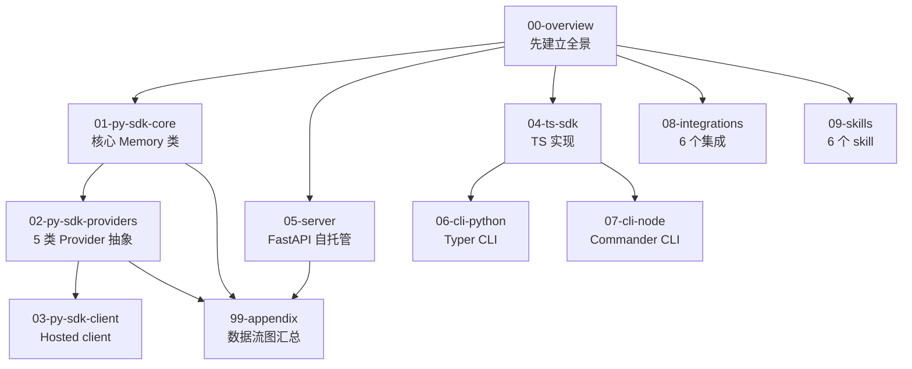

# Mem0 源码精读笔记

> 这是基于上游 [`mem0ai/mem0`](https://github.com/mem0ai/mem0) 完整 clone 的源码精读笔记。
> 目的：①学懂 Mem0 的工程设计 ②为基于 Mem0 的二次开发提供内部技术文档。
> 范围：全仓库（Python SDK + TypeScript SDK + 双 CLI + Server + Integrations + Skills）。
> 深度：架构级总览 + 核心模块精读级（逐文件 / 逐函数 / 关键行号引用）。

---

## 当前基准

| 项 | 值 |
|---|---|
| 上游 HEAD（笔记起点） | `4debc58a` — `fix(security): patch 8 HIGH + 18 MEDIUM Vanta vulnerabilities...` |
| 当前算法版本 | **April 2026 New Memory Algorithm**（single-pass ADD-only、entity linking、multi-signal retrieval、temporal reasoning） |
| 论文 | [arXiv:2504.19413](https://arxiv.org/abs/2504.19413) (Mem0, 2025) |
| Benchmark | LoCoMo 92.5 / LongMemEval 94.4 / BEAM 1M 64.1 / BEAM 10M 48.6 |
| 行数（约） | Python SDK 31.7K + TS SDK 59.7K + CLI/Server/Integrations ≈ **10 万行** |

> ⚠️ 上游每天变动。阅读时如发现 `main.py` 行号对不上，先 `git log --oneline mem0/memory/main.py` 看是否有更新。
> 所有引用行号基于上述 HEAD；函数名/类名比行号稳定，优先按名字定位。

---

## 阅读路径（推荐顺序）



**最短速通路径（3–4 小时）**：`00-overview → 01-py-sdk-core → 02-py-sdk-providers/01-base-pattern → 05-server`。
**完整精读路径（建议 1–2 周）**：按上方目录自上而下。

---

## 目录索引

### 🏛 [00-overview](./00-overview/) — 项目全景（必读）
- [`01-repo-layout.md`](./00-overview/01-repo-layout.md) — Polyglot monorepo 的目录布局与设计动机
- [`02-architecture.md`](./00-overview/02-architecture.md) — 整体架构图、双模式（OSS vs Hosted）、组件分层
- [`03-build-system.md`](./00-overview/03-build-system.md) — Hatch + pnpm + tsup + Docker 构建链
- [`04-cicd.md`](./00-overview/04-cicd.md) — CI Gate 单入口编排 + Release Router 单入口发布
- [`05-two-modes.md`](./00-overview/05-two-modes.md) — OSS 自托管 vs Platform 托管的 API 同构哲学

### 🧠 [01-py-sdk-core](./01-py-sdk-core/) — Python SDK 核心（最重要）
- [`01-memory-base.md`](./01-py-sdk-core/01-memory-base.md) — `MemoryBase` 抽象基类（63 行但极关键）
- [`02-memory-main.md`](./01-py-sdk-core/02-memory-main.md) — `Memory` 类（3851 行核心引擎）
- [`03-storage.md`](./01-py-sdk-core/03-storage.md) — SQLiteManager（变更历史）
- [`04-configs.md`](./01-py-sdk-core/04-configs.md) — `MemoryConfig` / `MemoryItem` / `MemoryType`
- [`05-prompts.md`](./01-py-sdk-core/05-prompts.md) — Prompt 模板系统（1062 行）
- [`06-add-pipeline.md`](./01-py-sdk-core/06-add-pipeline.md) — ⭐ `add()` 全链路（fact extraction → entity link → vector upsert）
- [`07-search-pipeline.md`](./01-py-sdk-core/07-search-pipeline.md) — ⭐ `search()` 多信号融合（semantic + BM25 + entity）
- [`08-update-delete.md`](./01-py-sdk-core/08-update-delete.md) — `update()` / `delete()` / `delete_all()` / `history()`

### 🔌 [02-py-sdk-providers](./02-py-sdk-providers/) — Provider 抽象体系
- [`01-base-pattern.md`](./02-py-sdk-providers/01-base-pattern.md) — ⭐ 5 类 `base.py` 的统一设计模式
- [`02-llms.md`](./02-py-sdk-providers/02-llms.md) — 21 个 LLM provider
- [`03-embeddings.md`](./02-py-sdk-providers/03-embeddings.md) — 15 个 embedding provider
- [`04-vector-stores.md`](./02-py-sdk-providers/04-vector-stores.md) — 28 个 vector store provider
- [`05-graphs.md`](./02-py-sdk-providers/05-graphs.md) — Graph memory（Neo4j / Memgraph / Kuzu / AGE）
- [`06-rerankers.md`](./02-py-sdk-providers/06-rerankers.md) — 5 个 reranker
- [`07-factory.md`](./02-py-sdk-providers/07-factory.md) — ⭐ `Factory` 工厂模式与 `Provider` 注册机制
- [`08-utils.md`](./02-py-sdk-providers/08-utils.md) — entity_extraction / scoring / lemmatization / factory

### 🌐 [03-py-sdk-client](./03-py-sdk-client/) — Hosted Platform Client
- [`01-client.md`](./03-py-sdk-client/01-client.md) — `MemoryClient` / `AsyncMemoryClient`
- [`02-proxy.md`](./03-py-sdk-client/02-proxy.md) — HTTP proxy 机制
- [`03-telemetry.md`](./03-py-sdk-client/03-telemetry.md) — 遥测、privacy、secret redaction

### 📘 [04-ts-sdk](./04-ts-sdk/) — TypeScript SDK
- [`01-structure.md`](./04-ts-sdk/01-structure.md) — `mem0-ts` 整体结构 + client + oss 概览
- [`02-providers-and-types.md`](./04-ts-sdk/02-providers-and-types.md) — TS 侧 providers 对照 Python 版 + 类型系统

### 🖥 [05-server](./05-server/) — FastAPI 自托管
- [`01-architecture.md`](./05-server/01-architecture.md) — 架构 + Endpoints + Docker Compose + 数据模型
- [`02-vs-hosted.md`](./05-server/02-vs-hosted.md) — Server vs Library vs Platform 三模式对比

### ⌨️ [06-cli-python](./06-cli-python/) — Python CLI (Typer)
- [`01-entry-and-commands.md`](./06-cli-python/01-entry-and-commands.md) — 入口与命令树

### ⌨️ [07-cli-node](./07-cli-node/) — Node CLI (Commander)
- [`01-entry-and-commands.md`](./07-cli-node/01-entry-and-commands.md) — 入口与命令树

### 🔗 [08-integrations](./08-integrations/) — 集成（6 个）
- [`01-mem0-plugin.md`](./08-integrations/01-mem0-plugin.md) — ⭐ MCP server（最大,5 编辑器）
- [`02-other-integrations.md`](./08-integrations/02-other-integrations.md) — OpenClaw / Pi / Vercel AI / n8n / Zapier

### 🎓 [09-skills](./09-skills/) — Skill 体系
- [`01-skills-overview.md`](./09-skills/01-skills-overview.md) — Reference vs Pipeline skill 分类

### 🧪 [10-examples-eval](./10-examples-eval/) — 示例与评估
- [`01-examples-and-eval.md`](./10-examples-eval/01-examples-and-eval.md) — examples/ 选读 + memory-benchmarks

### 📚 [99-appendix](./99-appendix/) — 附录
- [`index.md`](./99-appendix/index.md) — 术语表 + 数据流图汇总 + 阅读顺序建议

---

## 文档约定

**每个精读文档的标准结构**：

```markdown
# <文件路径> (<行数>)

> 一句话总结这个文件做什么。

## 1. 文件作用
（在整体架构中的位置）

## 2. 关键导入与依赖
（引用的内部模块、外部库，画依赖图）

## 3. 顶层结构（按行号区间）
| 行号 | 内容 |
|------|------|
| L1-L80 | imports + 常量 |
| ... | ... |

## 4. 关键类/函数精读
### `ClassName.method()` (L行号)
- 职责：...
- 输入/输出：...
- 核心逻辑：...
- 注意点：...

## 5. 设计权衡与坑
（为什么这样设计、有哪些副作用、改动要注意什么）

## 6. 与其他模块的关系
（出/入依赖、调用关系）
```

**行号引用约定**：
- `L120` = 第 120 行
- `L120-L180` = 第 120–180 行
- 行号会随上游变动，**类名/函数名永远比行号可靠**

**图约定**：用 mermaid 画组件图、序列图、状态图。

---

## 与上游同步策略

这是 fork（路径 `~/ai/photo/ocr/mem0`），笔记写在 `notes/` 隔离目录，**不污染上游结构**，未来 `git pull` 不会冲突。

笔记更新时如发现行号偏移，按函数名/类名重新定位，不全文重写。

---

📌 **下一步**：从 [`00-overview/01-repo-layout.md`](./00-overview/01-repo-layout.md) 开始。
