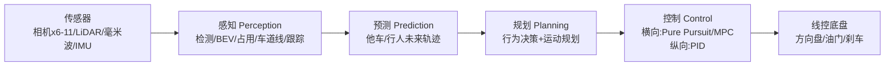
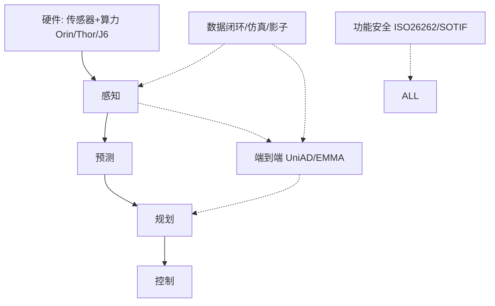

# ① 入门：自动驾驶分级与模块化栈总览

> 学完本篇，你能回答：一辆自动驾驶车如何从传感器到方向盘完成闭环？L0–L5 怎么分？为什么有两套技术路线？

---

## 1. 一句话定义

> **自动驾驶（Autonomous Driving, AD）= 让车辆仅凭传感器 + 计算机，完成"感知世界 → 预测未来 → 规划路径 → 控制车辆"的闭环。**
> 本质：嵌入物理世界、对延迟和 Safety 极度敏感的**具身智能（Embodied AI）系统**。

## 2. SAE 六级分类（必背）

| 级 | 名 | 谁在开 | 责任 | 典型 |
|----|----|--------|------|------|
| L0 | 无自动化 | 人 | 人 | AEB/ABS |
| L1 | 辅助 | 人 | 人 | ACC / LKA（不能同时）|
| L2 | 部分自动化 | 人（须监控）| 人 | Tesla FSD、XNGP、华为 ADS |
| L3 | 条件自动化 | 系统（限定域）| **系统**（ODD 内）| Honda Legend、奔驰 Drive Pilot |
| L4 | 高度自动化 | 系统（限定域）| 系统 | Waymo、百度 Apollo Go |
| L5 | 完全自动化 | 系统（全域）| 系统 | 未实现 |

**关键分水岭**：
- **L2↔L3 = 责任转移**：L2 永远人负责；L3 在 ODD 内系统负责（但人须 10 秒内接管）。
- **L3↔L4 = 是否需人接管**：L3 出 ODD 要人接管；L4 能自己安全靠边（MRC）。
- 市面几乎所有"自动驾驶"宣传都是 **L2/L2+**。Tesla "FSD" 法律上仍是 L2。

> 💡 **ODD（Operational Design Domain）**：系统的运行设计域——速度范围、天气、地理、路况。L3/L4 的"系统负责"只在其 ODD 内成立。

## 3. 模块化栈：四层流水线（经典范式）

| 层 | 回答什么 | 输入 | 输出 | 主算法 |
|----|---------|------|------|--------|
| 感知 | **现在有什么、在哪** | 原始传感器 | box/lane/occupancy | CenterPoint, BEVFormer, OccNet, MapTR |
| 预测 | **未来几秒它们去哪** | 历史 track + 地图 | 多模态轨迹 | VectorNet, QCNet, MTR |
| 规划 | **我怎么走才安全舒适** | 感知+预测+地图 | 可执行轨迹 | Hybrid A*, Apollo EM, MPC |
| 控制 | **怎么让车听话** | 轨迹 | 方向盘/油门 | Pure Pursuit, LQR, MPC |

### 模块化的优缺点
- ✅ 可解释、可插拔、模块独立训练、安全可验证
- ❌ **误差累积**（感知错一点→规划错很多）、信息瓶颈（接口人为压缩）、目标不一致

## 4. 端到端范式：一网到底（新范式）

- ✅ 信息无损、目标统一（都为规划）、上限高
- ❌ 黑盒、数据饥渴、难注约束、训练贵

> 🎯 **现实**：2025–2027 主流 = **感知端到端 + 规划规则/学习兜底**。纯黑盒 E2E 先在 Robotaxi 限定域跑通。

## 5. 完整技术栈鸟瞰

**算力平台**：Orin 254T、Thor 1000+T、地平线 J6 560T、华为 MDC810 400T、Tesla FSD chip 144T×2。

## 6. 三大产品形态

1. **L2/L2+ NOA（领航辅助）**：高速+城市，人负责。**当前主战场**。
2. **L4 Robotaxi**：限定城市全无人。Waymo、百度、Cruise。
3. **L4 限定场景**：港口/矿区/物流/配送/泊车。

## ✍️ 练习

1. Tesla FSD 属于 SAE 几级？为什么名字叫 FSD 但法律上是这个级别？
2. 一辆 L4 Robotaxi 遇到超出其 ODD 的场景，应如何处理？这和 L3 有何不同？
3. 模块化栈中"误差累积"具体怎么发生？举一个感知误差导致规划错误的链式例子。
4. 画出一个自动驾驶系统的完整数据流图，标注每个模块的输入输出和延迟要求（提示：感知 ~50ms、规划 ~10ms）。

## 📌 下一步

→ 进入 `02-perception/` 深挖感知层所有算法，从 LSS 跑通开始。
