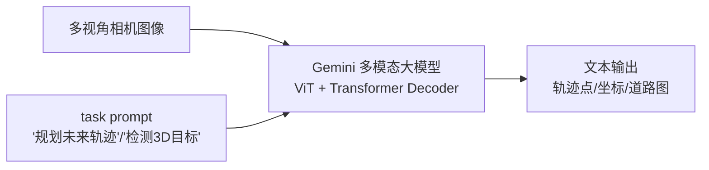

# ③ 经典精读之二：EMMA —— 大模型端到端的标杆

> **EMMA: End-to-End Multimodal Model for Autonomous Driving**, Waymo Research.
> arXiv:2410.23262（2024/10，TMLR 2025 接收）｜ Blog: waymo.com/blog/2024/10/introducing-emma

---

## 0. 为什么 EMMA 是里程碑

EMMA 把 **Gemini 多模态大模型**直接用来开车——**相机图像 → 驾驶动作**。它代表了大模型端到端的极致：**用 LLM 的世界知识理解驾驶**。虽然仍开环、推理慢，但它证明了"大模型统一 AD"路线的可行性，是继 UniAD 后最重要的 E2E 工作。

## 1. 核心思想：万物皆文本（Everything as Language）

EMMA 最激进的设计：**把所有非传感器输入和输出，都表示成自然语言文本**。

| 类型 | 例子 | 如何表示 |
|------|------|---------|
| 输入-导航 | "下个路口左转" | 文本 prompt |
| 输入-自车状态 | 速度 12m/s、航向 | 文本 "ego speed: 12 m/s" |
| 输出-轨迹 | 未来 (x,y) 点序列 | 文本 token "0.5,1.0,1.5,2.0..." |
| 输出-检测 | 3D 框 (x,y,z,...) | 文本坐标 |
| 输出-道路图 | 车道线点 | 文本 |

**为什么这样**：① 复用 Gemini 的语言能力；② 多任务统一在"语言空间"；③ 一个模型一套 prompt 干所有事。

## 2. 架构

基于 Gemini（具体规模未公开，推测数十 B 参数）。输入图像经 ViT 编码，与文本 prompt 一起进 Transformer，自回归生成文本输出。

## 3. 多任务联合训练

EMMA 证明了一个关键发现：**联合训练规划+检测+建图，三者互相促进**（与 UniAD 的 planning-oriented 一致）。
- 规划任务让模型理解"全局驾驶目标"。
- 检测任务注入"障碍物位置"的细粒度监督。
- 建图任务注入"道路结构"知识。
- 三者共享 Gemini backbone，**共训练 > 单独训练**。

## 4. 实验结果

| 基准 | 任务 | EMMA | 状态 |
|------|------|------|------|
| **nuScenes** | 运动规划 | **SOTA** | 超越 UniAD/VAD |
| **WOMD** | 运动预测 | 竞争力强 | 接近专用模型 |
| **WOD** | 相机 3D 检测 | 竞争力强 | — |

## 5. EMMA vs UniAD：两种 E2E 哲学

| 维度 | UniAD | EMMA |
|------|-------|------|
| 范式 | 模块化端到端（保模块结构）| 大模型统一（一网到底）|
| 基座 | EVA + BEVFormer + 任务头 | Gemini（数十B参数 VLM）|
| 接口 | query（连续特征）| 文本 token（离散语言）|
| 世界知识 | 无（纯视觉学）| **有**（继承 Gemini 预训练）|
| 推理速度 | ~500ms | 更慢（大模型）|
| 车端部署 | 难 | 极难（需大模型蒸馏）|
| 可解释 | 中（query 可视化）| 高（输出文本解释）|

> 🎯 **本质差异**：UniAD 是"**精巧工程 + 端到端**"，EMMA 是"**大力出奇迹 + 世界知识**"。两者代表 E2E 的两条子路线。

## 6. 局限（批判性）

1. **推理慢**：大模型车端实时部署是巨大挑战（需知识蒸馏到小模型）。
2. **轨迹 token 化精度损失**：连续坐标→离散文本 token→再解析，有量化误差。
3. **仍开环训练**：在 nuScenes 开环训练，与闭环差距大。
4. **依赖 Gemini**：非开源大模型，复现困难。
5. **空间推理弱**：VLM 对精确 3D 空间关系理解不如专用几何模型。

## 7. 对行业的启示

- **大模型统一 AD 任务**可行——不只是规划，检测/预测/建图都能做。
- **世界知识红利**：预训练 VLM 的常识（红绿灯、施工、交警）能迁移到驾驶。
- **可解释性卖点**：EMMA 能输出"为什么这么开"的自然语言解释，对监管/审计友好。
- 下一步：**如何把大模型蒸馏到车端可部署** + **闭环训练**。

## ✍️ 练习

1. EMMA 把轨迹表示成文本 token（如 "0.5,1.0,1.5"）。这种表示相比 UniAD 的连续 query，有什么优点和缺点？精度损失如何量化？
2. EMMA 联合训练规划+检测+建图"三者互相促进"。给出一个假设：为什么检测任务能提升规划性能？（提示：表示学习、共享特征）
3. EMMA 车端部署的最大障碍是大模型推理慢。设计一个方案，把 EMMA 的能力迁移到车端（提示：知识蒸馏、双系统、DriveVLM-Dual 思路）。
4. 对比 UniAD（query）和 EMMA（文本）两种 E2E 接口设计，从"信息容量""可解释性""梯度流"三维度分析。

## 📌 下一步

→ 进入 `05-frontier/` 深挖世界模型（GAIA/OccWorld）和 VLA（DriveVLM/LINGO/π0）。
