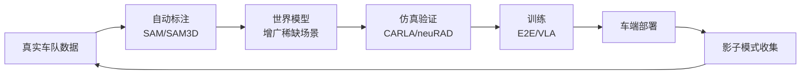

# ⑤ 前沿：世界模型 + VLA —— 下一个基础设施

> 2024–2026 AD 领域最性感的方向。本篇覆盖世界模型（GAIA/OccWorld/DriveDreamer）与 VLA（DriveVLM/LINGO/π0/OpenDriveVLA）全家族。

---

## A. 世界模型（World Model）：让 AI "想象"未来

### A.1 直觉与定义

**人开车时会在脑中"预演"**："如果我变道，那辆卡车可能加速"。世界模型让 AI 也具备这种**生成式预测能力**。

**定义**：学习 $p(s_{t+1},...,s_{t+k} | s_{\le t}, a)$——给定历史和动作，**生成/预测未来世界状态**（图像/占用/点云）。

### A.2 对 AD 的三大意义

1. **数据增广**：生成稀缺场景（长尾）。
2. **规划评估**：作为"想象器"评估候选轨迹的后果。
3. **闭环训练模拟器**：世界模型本身就是可微仿真器。

### A.3 世界模型算法全家桶

| 算法 | 出处 | 表示 | 特点 |
|------|------|------|------|
| **GAIA-1** | Wayve 2023 | 像素 | 首个大规模驾驶世界模型，自回归 Transformer |
| **GAIA-2** | Wayve 2024 | 像素 | 高分辨率、长时序、可控条件生成 |
| **DriveDreamer(-2)** | CVPR'24 | 像素 | 扩散模型 + 控制，多视角生成 |
| **GenAD** | CVPR'24 | 潜空间 | 潜在空间扩散，高效 |
| **OccWorld** | ECCV'24 | **占用** | **4D 占用世界模型**，不生成像素，直接生成未来 3D 占用 |
| **MUVO** | — | 多模态 | 融合相机+LiDAR+雷达 |
| **MagicDrive / Panacea** | CVPR'24 | 像素 | 生成式数据增广 |
| **neuRAD** | CVPR'24 | NeRF | 神经辐射场重建驾驶场景，可重渲染编辑 |

### A.4 OccWorld 深读（ECCV'24，占用世界模型）

**为什么占用世界模型重要**：① 比 box 更细粒度（表达力）；② 比 pixel 更省（效率）；③ 视觉/LiDAR 都能用（通用性）。

**架构**（GPT-like）：
1. **Scene Tokenizer**：用重建式 tokenizer 把 3D 占用压成离散 token。
2. **生成 Transformer**：GPT-like 时空生成，预测后续 scene token + ego token。
3. **解码**：token → 未来占用 + ego 轨迹。

**结果**：nuScenes 上有效建模场景演化，**无需实例/地图监督也能产出竞争力规划**——这指向"无标注学习驾驶"的可能。

> 🎯 **趋势**：从"生成像素"转向"生成占用/语义"（更高效、更对齐下游任务）。

---

## B. VLA（Vision-Language-Action）：通用具身智能统一范式

### B.1 定义

**VLA = Vision + Language + Action**：输入图像+语言指令，输出动作。源自机器人（RT-2、π0、OpenVLA），正迁移到 AD。

### B.2 VLA for AD 全家族

| 算法 | 出处 | 亮点 |
|------|------|------|
| **LINGO-1/2** | Wayve 2023/24 | **首个驾驶 VLA**。图像+语言→解释决策→动作。"可解释端到端"卖点 |
| **DriveLM** | CVPR'24 | Q&A 结构化推理（"前方红灯→为何停"）|
| **DriveGPT4** | 2024 | GPT-4V 理解驾驶场景 |
| **LMDrive** | CVPR'24 | LLM + 导航指令 E2E |
| **DriveVLM** | 2024（清华+长城）| **已上车**。三级推理链（描述→分析→规划）|
| **Senna** | 2024 | VLM 理解 + E2E 执行解耦 |
| **OpenDriveVLA** | 2024-25 | 开源驾驶 VLA（基于 UniAD track-map 编码器）|

### B.3 DriveVLM 深读（已上车的 VLA）

**架构创新——三级推理链**（模拟人类驾驶思维）：
1. **Scene Description**：描述场景（"前方施工，右道有锥桶"）
2. **Scene Analysis**：分析关键元素与影响
3. **Hierarchical Planning**：分步规划（元动作 → 场景描述 → 轨迹）

**DriveVLM-Dual（混合系统）**：VLM 做"慢思考"（复杂场景理解），传统 pipeline 做"快执行"（实时控制）。**解决 VLM 推理慢、空间推理弱的问题**。

> 💡 这是"双系统理论"（Kahneman 系统1/系统2）在 AD 的落地——快直觉 + 慢思考。

### B.4 机器人 VLA 的溢出（2024 重磅）

| 算法 | 出处 | 突破 |
|------|------|------|
| **RT-2** | Google 2023 | VLM → 机器人动作 token，开山 |
| **OpenVLA** | 2024 | 开源 VLA foundation |
| **π0 / π0-FAST** | Physical Intelligence 2024-25 | **Flow matching** 通用 VLA，统一机器人+可能的车辆控制 |
| **RDT-1B** | 2024 | 双臂机器人 VLA |

> 🚀 **2025–2026 大趋势**：**VLA 统一机器人 + 自动驾驶**——都是"看+理解+动作"。PI（π0 团队）、Wayve、Figure 都在这条路。AD 是 VLA 最大落地场景。

---

## C. 数据驱动的新基础设施闭环

**数据飞轮**：车越多→数据越多→模型越强→体验越好→卖更多车。这是 Tesla 护城河，也是蔚小理拼的。

---

## D. 前沿趋势总结（2025–2026）

| 方向 | 进展 |
|------|------|
| 世界模型 + 规划 | 用世界模型评估规划后果（如 Diffusion-ES）|
| VLA 蒸馏 | 大模型→车端小模型（双系统）|
| 闭环训练 | 用世界模型/仿真做 RL，而非只 IL |
| 占用世界模型 | OccWorld 路线，几何+语义一体 |
| 统一 VLA | 机器人+AD 共享 foundation（π0 路线）|
| 神经仿真 | NeRF/3DGS 重建真实场景训练 |

## ✍️ 练习

1. 世界模型（GAIA）和占用世界模型（OccWorld）的根本区别？为什么 OccWorld 对规划"更直接有用"？
2. DriveVLM 的"双系统"设计（VLM 慢思考 + pipeline 快执行）如何解决纯 VLM 推理慢的问题？给出一个具体场景的时序分配。
3. π0 用 flow matching 而非 diffusion 生成动作。查阅资料，解释 flow matching 相对 diffusion 的优势（训练稳定性、推理速度）。
4. （开放题）你认为"世界模型 + VLA"能在 5 年内让 L5 自动驾驶实现吗？从数据、算力、安全验证三方面论证。

## 📌 下一步

→ 进入 `04-hands-on/` 跑通 CARLA + Bench2Drive，亲手训练一个 mini E2E。
