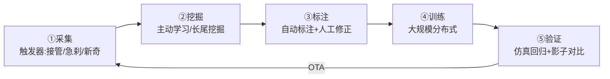

# ⑦ 数据闭环 / 仿真 / SLAM 与定位

> AD 公司的真正护城河不在算法在数据。本篇覆盖：数据引擎、仿真体系、定位与建图。

---

## 1. 数据闭环（Data Engine）：五环飞轮

### 1.1 采集：触发器设计（工程艺术）
- **接管触发**：人类接管 = 系统决策与人类分歧 → 最有价值样本。
- **急刹/急转触发**：动力学异常事件。
- **新奇度触发**：场景 embedding 距离训练集远（OOD 检测）。
- **影子模式**：系统静默运行对比人类决策，海量采集"分歧"。

### 1.2 挖掘：主动学习
- 模型输出不确定性（熵/集成方差）高的样本 → 优先标注。
- 长尾场景聚类 → 定向挖掘同类场景（"找所有类似异形车"）。

### 1.3 标注：自动标注革命
| 技术 | 用途 |
|------|------|
| **SAM/SAM2** | 分割一切，2D 标注提效 |
| **4D 自动标注** | 用 LiDAR/多帧重建给相机自动打 3D 真值（Tesla 占用网络的基础）|
| **大模型预标注** | VLM 生成描述/属性，人工只修正 |
人工标注成本从 ~$5/帧 降到 ~$0.1/帧量级。

## 2. 仿真：AD 的"风洞"

### 2.1 两类仿真
| 类型 | 代表 | 作用 |
|------|------|------|
| **物理仿真** | CARLA（UE4）、SUMO（交通流）| 场景可控、闭环评测（Bench2Drive）|
| **神经仿真** | neuRAD（NeRF）、3DGS 系列 | 真实场景重建+编辑（改天气/加障碍）|

### 2.2 神经仿真（2024 热点）
- **neuRAD**（CVPR'24）：NeRF 重建驾驶场景（传感器级仿真，可重渲染任意视角）。
- **3D Gaussian Splatting**：比 NeRF 快 100 倍的重建，正在接管驾驶仿真。
- **生成式增广**：MagicDrive/DriveDreamer 生成稀缺场景（雨夜事故现场）。
- **价值**：真实长尾数据不可复现（不能为采数据撞车），神经仿真能"编辑现实"。

### 2.3 评测体系
- 开环（nuScenes/NAVSIM）→ 闭环（CARLA/Bench2Drive）→ 真实路测（影子对比）。
- **趋势**：从"指标好"到"闭环驾驶分数"，从"单次评估"到"持续回归"。

## 3. SLAM 与定位

### 3.1 定位技术栈
| 方法 | 原理 | 精度 | 弱点 |
|------|------|------|------|
| GNSS+RTK | 卫星+差分 | 厘米级 | 隧道/城市峡谷失效 |
| IMU+轮速 DR | 惯性推算 | 短时准 | 长时漂移 |
| LiDAR 点云匹配 | 与先验地图配准 | 高 | 依赖地图 |
| 视觉定位 | 特征/车道线匹配 | 中 | 光照敏感 |
| **融合定位** | 以上 ESKF/图优化融合 | 鲁棒 | 复杂 |

### 3.2 经典 SLAM 算法
| 算法 | 传感器 | 特点 |
|------|--------|------|
| **ORB-SLAM3** | 视觉/视觉惯性 | 学术旗舰开源 |
| **LIO-SAM** | LiDAR+IMU | 紧耦合平滑 |
| **VINS-Fusion** | 视觉惯性 | 港科大开源标杆 |

### 3.3 "无图化"趋势
传统 HD Map（厘米级先验地图）采集贵、更新慢。趋势：
- **在线建图**（MapTR/StreamMapNet）：实时从相机生成矢量地图。
- **车道线定位**：用感知到的车道线实时定位，摆脱先验地图。
- **现实**：城市复杂路口仍需地图兜底——"轻图"（只存关键结构）成为折中主流。

## 4. 数据飞轮的竞争含义

- **Tesla**：全球车队（数百万辆）+ 影子模式 = 最大数据飞轮。
- **中国新势力**：城市 NOA 开城速度 = 数据覆盖速度。
- **Waymo**：单车数据质量高（重传感器）但规模小——用仿真补（Waymo 内部仿真里程 >> 路测）。
- **本质**：AD 是"数据规模×数据质量×迭代速度"的战争，算法差距在收敛、数据差距在拉大。

## ✍️ 练习
1. 设计一个"接管触发器"：哪些信号说明系统决策与人类分歧？（提示：方向盘扭矩、踏板接管、决策 divergence）
2. 神经仿真（neuRAD）相比 CARLA 的本质优势？为什么说它是"训练世界模型的关键数据源"？
3. "无图化"后，定位的角色发生了什么变化？为什么"轻图"成为折中？
4.（系统题）如果你从零建一个 L4 公司，数据飞轮怎么冷启动？（提示：先限定域高密度运营 vs 先铺开采集）
