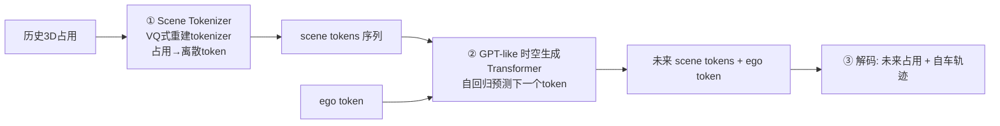

# ⑤ 前沿深读之一：OccWorld —— 4D 占用世界模型

> **OccWorld: Learning a 3D Occupancy World Model for Autonomous Driving**, ECCV 2024。
> arXiv:2311.16038 ｜ 代码：`wzzheng/OccWorld` ｜ 清华（郑文钊等）

---

## 0. 为什么重要

世界模型路线的"效率派旗手"：**不生成像素，直接在 3D 占用空间预测场景演化**。它证明了"用占用做世界模型"既能预测未来，又能直接服务规划——甚至**不需要实例框和地图监督**。

## 1. 核心思想：为什么用占用做世界模型

作者给出三大理由（论文原文逻辑）：
1. **表达力（Expressiveness）**：3D 占用描述比 box/分割更细粒度的场景结构。
2. **效率（Efficiency）**：占用比像素/点云更容易获得（稀疏 LiDAR 即可生成）。
3. **通用性（Versatility）**：视觉和 LiDAR 都能统一到占用表示。

对比：
| 世界模型 | 生成目标 | 成本 | 对规划的直接性 |
|---------|---------|------|--------------|
| GAIA-1/2 | 未来视频帧（像素）| 极高（视频生成）| 低（还要再感知）|
| DriveDreamer | 像素 | 高 | 低 |
| **OccWorld** | **未来 3D 占用** | **低（离散token）** | **高（占用即约束）** |

## 2. 架构：GPT 化的世界模型

三步：
1. **Scene Tokenizer**：重建式训练（类似 VQ-VAE），把每帧 3D 占用压缩为离散 token 序列——"驾驶世界的词表"。
2. **生成式 Transformer**：GPT 式自回归——给定过去 token + ego token，预测未来 token（场景怎么演化）+ 下一个 ego token（车怎么开）。
3. **解码**：未来占用还原 + ego 轨迹输出。

> 💡 **精髓**：把"驾驶"变成"语言建模"——场景是词，驾驶是造句。ego 轨迹和场景演化在同一个序列里互相预测（联合分布）。

## 3. 实验结果（nuScenes）

- **场景演化**：有效预测未来占用（IoU 随时序衰减缓慢）。
- **规划**：**不使用实例框、不使用地图监督**，规划结果仍有竞争力。
- 消融：tokenizer 的重建质量直接决定世界模型质量。

## 4. 深层意义（批判性）

**它指向一个激进方向：无标注学习驾驶。**
- 传统：检测→预测→规划，全链路要人工标注（贵）。
- OccWorld：只要占用（可从 LiDAR 自动生成），不要框不要地图——**弱监督/自监督驾驶**。

**局限**：
1. 占用 token 化丢失纹理/语义细节（对比 GAIA 的像素生成）。
2. 规划头仍是轨迹回归，未闭环验证（CARLA）。
3. 长时序（>3s）演化质量下降。

## 5. 与相关工作的关系

- **Cam4DOcc**（ICCV'23）：只预测未来占用（感知），OccWorld 加了 ego 联合预测（规划）。
- **DriveWorld**（CVPR'24）：类似思路，预训练用途。
- **UniAD**：OccWorld 相当于把 UniAD 的"感知+预测+规划"换成"占用token+GPT"——**接口从 query 变成离散 token**。

## ✍️ 练习
1. OccWorld 的 Scene Tokenizer 为什么用"重建式"训练（类似 VQ-VAE）而不是直接监督？它学到了什么？
2. 对比 UniAD（query 接口）和 OccWorld（token 接口）：离散 token 会丢失什么？换来什么（提示：GPT 式生成、自回归）？
3. "无标注学习驾驶"（OccWorld 路线）与"全栈标注端到端"（UniAD 路线）各适合什么公司/阶段？

→ 动手：`02-perception/code/occupancy_minimal.py`（占用补全玩具版）
