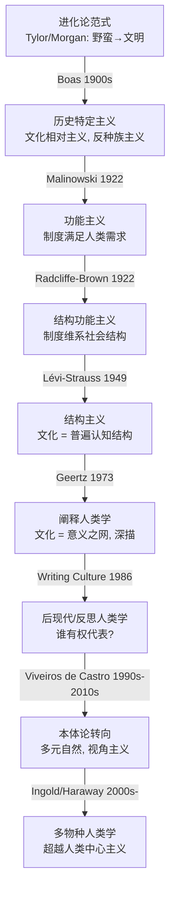
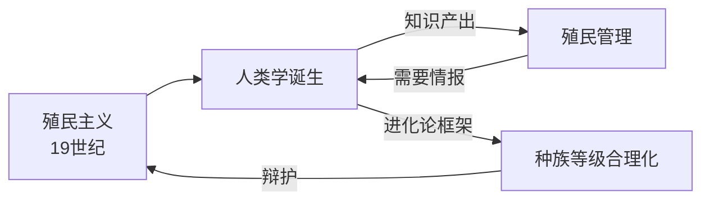

# 人类学思想史 — 一部观念的革命史

> **为什么读思想史**：人类学不是一堆民族志的累积，是**一系列自我革命的记录**。每代人都推翻上一代的"常识"：从"野蛮→文明"的单线进化，到"每个文化都独一无二"的相对主义，到"谁有权代表谁"的反思性批判，再到"人类不是世界中心"的多物种转向。读史让你理解"为什么这个争论重要"——这是人类学的灵魂。
>
> **本文档**：用 Kuhn "范式转移"框架，梳理人类学 9 次大转移。每次转移用统一结构：**旧范式 → 危机 → 革命 → 新范式 → 遗产**。
>
> **贯穿主题**：人类学与**权力**的不解之缘——殖民主义/后殖民/种族主义/性别/阶级——每一次范式转移都伴随着对"谁有权研究谁/代表谁"的政治追问。

---

## §0 总览：人类学的 9 次范式转移

每次革命都遵循 **Kuhn 结构**：
1. **旧范式**（Normal Science）：主流世界观，能解释大部分现象
2. **危机**（Crisis）：发现旧范式解释不了的反常现象/内在矛盾
3. **革命**（Revolution）：新思想出现，旧范式被推翻
4. **新范式**（New Normal）：新世界观，开始新一轮"正常科学"

**但人类学的特殊之处**：与物理学不同，人类学的每次转移不只是"理论修正"，更是**伦理/政治**的深刻反思——因为研究对象是**活生生的人**，理论直接关系到他们的命运。

---

## §1 第一次：进化论范式（1860s-1890s）— 从达尔文到单线进化

### 旧范式：神创论与"伟大存在之链"

- 18-19 世纪主流：上帝创造万物，物种不变
- **存在之链**（Great Chain of Being）：从矿物→植物→动物→人→天使→上帝，万物有固定等级
- 人类社会也被排名：欧洲"文明"在顶端，其他"野蛮"

### 危机的种子：达尔文革命

**达尔文**（Charles Darwin, 1809-1882）：

- **《物种起源》**（*On the Origin of Species*, 1859）：自然选择理论
- **《人的由来》**（*The Descent of Man*, 1871）：人类也受自然选择
- **核心思想**：物种不是固定的，是**演化**来的；没有"设计者"，只有适应

$$\text{演化率} \propto \text{变异} \times \text{选择压力} \times \text{遗传}$$

**革命性**：人不是特殊创造物，是**自然的一部分**。这在人类学中引发了两个方向：

1. **生物方向**：人类体质演化（体质人类学的起源）
2. **文化方向**：文化也像生物一样"进化"——这就是**单线进化论**

### 革命：单线进化论（Unilineal Evolutionism）

**爱德华·泰勒**（Edward Burnett Tylor, 1832-1917）：
- **《原始文化》**（*Primitive Culture*, 1871）：首次给出"文化"的科学定义
- **三阶段论**：**蒙昧**（savagery）→ **野蛮**（barbarism）→ **文明**（civilization）
- 核心：所有社会经历相同的发展阶段，欧洲在最前面
- **万物有灵论**（animism）是宗教的起源

**路易斯·亨利·摩尔根**（Lewis Henry Morgan, 1818-1881）：
- **《古代社会》**（*Ancient Society*, 1877）：更精细的阶段划分
  - 蒙昧：发明用火/弓箭
  - 野蛮：陶器/农业/铁器
  - 文明：文字
- **亲属制度**研究先驱（后影响 Lévi-Strauss）

**詹姆斯·弗雷泽**（James Frazer, 1854-1941）：
- **《金枝》**（*The Golden Bough*, 1890）：巫术→宗教→科学的认知进化

### 新范式：文化进化阶梯

- 所有社会在同一条"进化跑道"上，只是速度快慢不同
- 欧洲 = 终点 = 标杆
- "原始"社会的习俗是"文明"社会的**化石/遗迹**（survivals）

### 殖民主义的共谋

**关键问题**：进化论范式**完美地服务了殖民主义**：
- 殖民统治 = "文明"帮助"野蛮"进步
- 种族等级 = "科学"证明白人优越
- "原始"人的土地可以被"高级"文明合法夺取
- 人类学知识 = 殖民管理的工具

### 为什么被推翻（危机积累）

1. **证据不足**：进化论者坐在**书房**（armchair anthropology），靠传教士/殖民官的二手报告——不做田野
2. **逻辑循环**：怎么判断"文明"？用欧洲标准。为什么欧洲最高？因为"文明"的标准就是欧洲的
3. **种族主义**：用生物差异"解释"文化差异——没有实证支持
4. **"遗迹"论**：很多被当作"进化遗迹"的习俗，在当地有**现实功能**——不是化石

### 遗产

- **"文化"概念**：Tylor 的定义至今仍被引用
- **进化思维**：不是完全错——人类确实有技术发展——错的是把它当**唯一**框架和**道德排名**
- **反面教材**：进化论范式后来被作为"人类学最黑暗的一页"反复批判

---

## §2 第二次：历史特定主义（1900s-1930s）— Boas 革命

### 旧范式：单线进化论

- 所有文化在同一条进化跑道上
- "原始"= 早期阶段 = 劣等

### 危机：实证的缺失

- **弗朗茨·博厄斯**（Franz Boas, 1858-1942）做了**真正的田野**
- 他在巴芬岛研究因纽特人（1883-84），在美国西北海岸研究夸基乌特人（Kwakwaka'wakw）
- **发现**：每个文化的逻辑是**内部的、自洽的**——不能从外部排名
- 进化论的"阶段"是**强加的**——用欧洲的框架裁剪其他文化

### 革命：历史特定主义 + 文化相对主义

**博厄斯的核心主张**：

1. **历史特定主义**（Historical Particularism）：
   - 每个文化是**独特的历史产物**，不是普遍进化阶段的代表
   - 要理解一个文化，必须**深入它的具体历史**——不能套用普遍规律
   
2. **文化相对主义**（Cultural Relativism）：
   - 没有文化"高"或"低"——每个文化要在**自己的语境**中被理解
   - "野蛮"和"文明"是**偏见**，不是科学
   
3. **反种族主义**（Anti-racism）——**博厄斯最重要的遗产**：
   - **《北美印第安人的头骨形态》**（1912）：证明头骨形状受**环境**影响（同一"种族"移民后头骨变化），不是天生固定
   - 种族智力等级 = **伪科学**
   - 博厄斯作为犹太裔德国移民，一生对抗科学种族主义——在美国成为人类学之父

4. **文化整合**（Cultural Integration）：文化各部分（宗教/经济/亲属）是**交织**的整体，不能孤立理解

**方法论革命**：
- **必须做田野**（不是书房理论）
- **学语言**（不能靠翻译）
- **详细记录**（"拯救"濒危文化）
- **比较**要基于**详尽的个案**，不是笼统概括

### 博厄斯的学术血脉

博厄斯培养了整整一代美国人类学家——"博厄斯学派"：

| 学生 | 代表作 | 贡献 |
|------|--------|------|
| **Margaret Mead** | *Coming of Age in Samoa* (1928) | 萨摩亚青春期：文化塑造心理/性别 |
| **Ruth Benedict** | *Patterns of Culture* (1934) | 文化"模式"——每个文化有独特性格 |
| **Zora Neale Hurston** | *Mules and Men* (1935) | 非裔美国人民俗——"从内部"研究自己文化 |
| **Alfred Kroeber** | 加州印第安人百科 | 文化区域概念 |

### Margaret Mead 与萨摩亚（1928）

**《萨摩亚人的成年》**：
- 研究：萨摩亚青春期是否和美国一样充满焦虑？
- **发现**：萨摩亚青少年没有"青春期风暴"——性更自由，冲突更少
- **结论**：美国的青春期焦虑是**文化产物**，不是生物学必然
- **影响**：挑战了西方对性别/性的"天然"假设——性角色是**文化建构**的
- **争议**：Derek Freeman (1983) 指责 Mead 被 informants 误导——引发激烈辩论至今

### 新范式：每个文化都独一无二

- 放弃"进化阶梯"
- 强调**详细描述**（民族志）而非**宏大理论**
- 文化之间**不可排名**（相对主义）
- 种族决定论 = **伪科学**

### 局限

- **过度经验主义**：博厄斯反对一切宏大理论——导致美国人类学"只见树木不见森林"
- **文化相对主义的困境**：如果所有文化平等，怎么评价杀婴/奴隶/女性割礼？
- **"拯救"范式**：把非西方文化当作"即将消失的标本"——仍隐含"我们记录、你们被记录"的不平等

---

## §3 第三次：功能主义（1922）— Malinowski 与需求满足

### 旧范式：博厄斯的历史特定主义

- 只描述，不解释"为什么"
- 每个文化是独特的——那有没有**跨文化的共同逻辑**？

### 危机：缺乏解释力

- 博厄斯学派善于**描述**（这个部落怎么做），但不善于**解释**（为什么这样做？）
- 人类学的"科学性"在哪里？如果只是描述，和游记有什么区别？

### 革命：马林诺夫斯基的功能主义

**布罗尼斯拉夫·马林诺夫斯基**（Bronisław Malinowski, 1884-1942）：

- **《西太平洋的航海者》**（*Argonauts of the Western Pacific*, 1922）——**现代民族志的奠基之作**
- **特罗布里恩群岛**（Trobriand Islands，巴布亚新几内亚）田野调查（1914-1918）
- 因一战（波兰裔奥匈帝国公民在英属领地）被**滞留**——意外完成了长期田野

**核心思想**：

1. **功能主义**（Functionalism）：文化制度和习俗**满足人类基本需求**
   - 生理需求：食物/住所/繁衍 → 工具/经济/亲属制度
   - 派生需求：安全/秩序 → 法律/政治/宗教
   - 整合需求：意义/归属 → 神话/仪式/艺术
   
2. **库拉圈**（Kula Ring）——功能主义的经典案例：
   - 特罗布里恩人与邻岛交换**贝壳项链**（顺时针）和**臂环**（逆时针）
   - 交换圈跨越数千公里、多个岛屿
   - **功能**：不是经济效用（贝壳没有实用价值），而是建立**社会关系网络**、声望、互惠
   - **洞察**：看似"非理性"的行为有深层的**社会功能**

3. **参与观察**标准：马林诺夫斯基确立了现代田野调查的方法论
   - "丢下沙发，去住茅屋"
   - 学当地语言
   - 参与日常生活
   - 他的田野笔记后来出版（*A Diary in the Strict Sense of the Term*, 1967），暴露了田野中的**孤独/厌烦/偏见**——成为反思人类学的先驱文本

### 新范式：制度有功能

- 每个文化制度都有**功能**（满足需求）
- "原始"社会的制度不是"遗迹"或"非理性"——它们**解决实际问题**
- 人类学 = 解释**功能**，不只是描述

### 局限

- **过度功利**：把所有文化简化为"满足需求"——忽略了**历史变迁**和**权力冲突**
- **静态**：功能主义描绘"平衡"的社会——但社会充满冲突/压迫/变迁
- **共谋**：功能主义"证明"殖民地的社会制度"运作良好"——间接为殖民统治辩护

---

## §4 第四次：结构功能主义（1922-1950s）— Radcliffe-Brown 与社会结构

### 旧范式：功能主义（Malinowski）

- 关注**个体需求**满足
- 但社会是**个人的集合**吗？还是**大于个人**？

### 革命：拉德克利夫-布朗的结构功能主义

**A.R. 拉德克利夫-布朗**（A.R. Radcliffe-Brown, 1881-1955）：

- **《安达曼岛民》**（*The Andaman Islanders*, 1922）
- **《原始社会的结构与功能》**（*Structure and Function in Primitive Society*, 1952）

**与 Malinowski 的关键区别**：

| | Malinowski（功能主义）| Radcliffe-Brown（结构功能主义）|
|--|--|--|
| **分析单位** | 个体 + 需求 | **社会结构** |
| **功能** | 满足人的需求 | 维系**社会系统**的运转 |
| **类比** | 生物体（需求→满足）| 生物体（器官→系统功能）|
| **核心问题** | 人为什么这么做？ | 这个制度如何**维系社会**？ |

**核心概念**：
- **社会结构**：不是有形的建筑，是人与人之间的**关系网络**（亲属/权力/交换）
- **制度的功能**：维系社会结构的**稳定和延续**
- **社会如同有机体**：每个"器官"（制度）为整体"健康"服务

**英国社会人类学传统**：Radcliffe-Brown 确立了英国人类学的**结构功能主义**传统（与 Evans-Pritchard, Meyer Fortes 等人一起）

### Evans-Pritchard 的努尔人研究

**埃文斯-普里查德**（E.E. Evans-Pritchard, 1902-1973）：
- **《努尔人》**（*The Nuer*, 1940）——结构功能主义的经典
- 苏丹努尔人：没有中央政府，社会靠**亲属制度 + 年龄组 + 牛**维系
- **洞察**："无国家"社会有精密的结构——不需要欧洲式政府
- **生态-社会关系**：牛是努尔人社会结构的"物理载体"——命名/婚姻/赔偿都用牛

### 新范式：社会结构维持稳定

- 社会是**系统**，制度是**系统功能**
- 人类学的任务 = 分析社会如何**运作**（维持平衡）
- 注重**共时性**（synchronic，当下的结构）而非**历时性**（diachronic，历史变迁）

### 危机（自我埋下的种子）

- **太静态**：如果社会总在"平衡"，怎么解释**变迁**？殖民主义的暴力？
- **太和谐**：忽略了**冲突/压迫/阶级**——社会不总是"功能良好的机器"
- **无历史**：结构功能主义**剥离了历史**——仿佛殖民地社会是"永恒不变的标本"
- **政治盲点**：研究"社会如何运作"，但不问"这个社会**应该**这样吗？"殖民统治是否破坏了它？

### 遗产

- **社会结构**概念至今核心
- **系统思维**：把社会当作互相关联的整体
- Evans-Pritchard 晚年转向**解释/翻译**（interpretive approach）——预示了后来的阐释人类学

---

## §5 第五次：结构主义（1949-1970s）— Lévi-Strauss 与认知结构

### 旧范式：功能主义 + 结构功能主义

- 文化制度 = 满足需求 / 维系社会
- **危机**：那**思维**呢？人类的思维方式有没有跨文化的普遍性？
- 功能主义只回答了"人为什么**做**"，没回答"人为什么**这样想**"

### 革命：列维-施特劳斯的结构主义

**克劳德·列维-施特劳斯**（Claude Lévi-Strauss, 1908-2009）：

- **《亲属关系的基本结构》**（*Les Structures élémentaires de la parenté*, 1949）
- **《忧郁的热带》**（*Tristes Tropiques*, 1955）——人类学最伟大的文学著作之一
- **《结构人类学》**（*Anthropologie structurale*, 1958）
- **《神话学》**四卷（*Mythologiques*, 1964-1971）：*生食与熟食* / *从蜂蜜到灰烬* / *餐桌礼仪的起源* / *裸人*

**核心思想**：

1. **结构主义**（Structuralism）：人类思维有**普遍的认知结构**
   - 受**索绪尔**（Ferdinand de Saussure）语言学影响：语言由**对立关系**定义（"上"因"下"而存在）
   - 文化 = 普遍思维结构的**具体表现**
   - 表面上千差万别的文化，底层是**相同的认知运作**

2. **二元对立**（Binary Oppositions）：人类思维的基本操作
   - 生/熟、自然/文化、内/外、男/女……
   - **《生食与熟食》**：生食（自然）→ 烹饪（文化）——烹饪是人脱离自然的标志
   - 神话 = 用二元对立来**调解矛盾**的叙事

3. **乱伦禁忌与交换**：
   - 为什么几乎所有社会都禁止近亲通婚？
   - 列维-施特劳斯的回答：乱伦禁忌**强制外婚**（从外部娶妻）→ 建立**交换关系** → 这是**社会本身的基础**
   - 女性的交换（cross-cousin marriage）= 建立社会联盟的机制
   - **洞察**：乱伦禁忌不是生物本能，是**文化发明**——它把生物繁衍转化为社会结构

4. **"原始"思维的尊严**：
   - **《野性的思维》**（*La Pensée sauvage*, 1962）
   - "野蛮人"的思维不比"文明人"低级——它是不同的**认知策略**
   - "修补匠"（bricoleur）vs "工程师"：前者用手边材料即兴组合，后者从抽象原理出发——都是有效思维

### 新范式：文化 = 普遍认知结构的表现

- 所有文化共享底层的**思维结构**
- 人类学 = **解码**这些结构（如语言学解码语法）
- **反相对主义**：不是"每个文化独一无二"，而是"所有文化是同一深层结构的不同变奏"

### 为什么震撼

- **第一次**有人类学家声称发现了文化的**普遍规律**（功能主义和博厄斯都不做这个）
- **跨领域影响**：结构主义影响了文学批评（Barthes）/哲学（Foucault 早期）/精神分析（Lacan）/历史（Braudel）
- **法兰西的荣耀**：列维-施特劳斯成为法兰西学术院院士——人类学家第一次达到这种地位

### 危机（结构主义的致命缺陷）

1. **去历史化**：结构主义分析的是**永恒的认知结构**——历史/变迁/权力冲突消失了
2. **去主体化**：人变成"结构"的**载体**——没有能动性，没有创造
3. **无法证伪**：你总能找到二元对立——但这是分析还是投射？
4. **"科学"的傲慢**：列维-施特劳斯声称发现"心灵的无意识结构"——但当地人会说"我们在**这样想**"吗？

### 遗产

- **亲属制度研究**：乱伦禁忌/交换理论至今影响深远
- **神话分析**：开创了系统的跨文化神话比较
- **"原始思维"的尊严**：彻底摧毁了"野蛮人思维低级"的偏见
- **结构主义→后结构主义**：Derrida/Foucault/Bourdieu 都从批判结构主义开始——人类学的遗产溢出到整个人文社科

---

## §6 第六次：阐释/象征人类学（1970s-1980s）— Geertz 与深描

### 旧范式：结构主义 + 功能主义

- 结构主义：文化 = 认知结构
- 功能主义：文化 = 满足需求
- **共同缺陷**：都把文化当作**可以客观解码的系统**——仿佛人类学家是"文化的物理学家"

### 危机：意义在哪里？

- 结构主义看到的是**对立**，功能主义看到的是**功能**——但**意义**呢？
- 人为什么**在意**他们的仪式/符号/故事？
- 一个"眨眼"是神经反射？是暗号？是嘲讽？——**同样的行为，不同的意义**

### 革命：格尔茨的阐释人类学

**克利福德·格尔茨**（Clifford Geertz, 1926-2006）：

- **《文化的解释》**（*The Interpretation of Cultures*, 1973）——阐释人类学奠基作
- **《地方知识》**（*Local Knowledge*, 1983）
- 田野：**爪哇**（Java）/ **巴厘岛**（Bali）/ **摩洛哥**（Morocco）

**核心思想**：

1. **文化是意义之网**：
   > "人是悬挂在自己编织的意义之网上的动物。我将文化看作这些网。"——Geertz (1973)
   
   - 文化不是"需求"或"结构"——是**人赋予世界的意义**
   - 人类学不是**寻找规律**（如物理学），而是**解读意义**（如文学批评）

2. **深描**（Thick Description）——**格尔茨最重要的方法论贡献**：
   
   **Gilbert Ryle 的"眨眼"思想实验**：
   - **浅描**：眼皮快速闭合
   - **深描**：
     - 无意抽搐？
     - 给同谋的暗号？
     - 嘲讽别人"假装眨眼"？
     - 排练中的演员？
   - **同样的物理动作，截然不同的意义**
   - 人类学要做**深描**——不只记录行为，要**解读行为的意义层次**

3. **巴厘岛斗鸡**（*Deep Play: Notes on the Balinese Cockfight*, 1972）——深描的经典范例：
   - 斗鸡表面上是赌博——为什么巴厘男人如此沉迷？
   - 格尔茨的解读：斗鸡是**地位竞争的戏剧**
   - 鸡 = 男人的自尊/阳刚
   - 下注 = 用金钱**赌社会地位**
   - **洞察**：斗鸡是一面"镜子"——巴厘人通过它"讲述关于自己的故事"

4. **地方知识**（Local Knowledge）：
   - 不存在"上帝视角"的客观知识
   - 每个文化有自己的**知识体系**——法律/医学/艺术
   - 人类学 = **翻译**不同意义体系之间的对话

### 新范式：文化 = 待解读的文本

- 人类学方法 = **阐释**（interpretation），不是实验
- 民族志 = **写作**（writing），不是"客观记录"
- **类比**：文化是文本，人类学家是文学批评家

### Mary Douglas 的象征分析

**玛丽·道格拉斯**（Mary Douglas, 1921-2007）：
- **《纯洁与危险》**（*Purity and Danger*, 1966）
- **核心问题**：为什么有些东西被认为是"脏"的？
- **洞察**："脏"不是物体的固有属性——是**位置错误**（"鞋子放在餐盘上" = 脏，同样的鞋子在地板上 = 不脏）
- **污染规则** = 社会秩序的**象征边界**：什么是"属于"的，什么是"越界"的
- **应用**：饮食禁忌（利未记中不可吃的动物 = "分类异常者"——猪不反刍/海鲜无鳞——它们**打破了分类系统**）

### 为什么震撼

- **从"科学"到"阐释"**：格尔茨公开说人类学更像文学批评——这挑战了人类学的"科学"身份
- **主体性的回归**：结构主义抹掉了"人的意义"，格尔茨把**意义**请回中心
- **写作意识**：格尔茨的散文本身是**文学**——开创了"实验民族志"的先河

### 局限

- **阐释的相对性**：如果文化是"文本"，谁的解读是"对的"？
- **格尔茨的权威**：他声称"深描"当地人的意义——但谁授权他做这种解读？
- **政治维度不足**：阐释人类学善于**读"意义"**，但不善于分析**权力/不平等/剥削**

---

## §7 第七次：后现代/反思人类学（1986）— 写作文化的批判

### 旧范式：阐释人类学 + 结构功能主义 + 结构主义

- 尽管方法论不同，都假设**人类学家可以客观地"把握"他者文化**
- 民族志 = 对"那里"的"忠实记录"

### 危机：代表性危机（Crisis of Representation）

- **权力问题**：谁有权**代表**谁？
  - 白人/男性/西方学者 → 研究/书写 → 有色人种/女性/非西方"他者"
  - 这种**单向的权力关系**不正是殖民主义的延续吗？
  
- **写作问题**：民族志是**写作**——写作有修辞/有选择/有权力的运作
  - 为什么民族志用第三人称"客观"口吻？——这**隐藏**了作者的主观性
  - 为什么"田野"部分（你的困惑/偏见/失败）通常被删掉？——制造了"全知"假象

- **马林诺夫斯基日记**（1967 出版）：暴露了田野中的**种族主义/厌烦/性焦虑**——和"高尚的客观科学"形象矛盾

### 革命：《写文化》（1986）

**《写文化：民族志的诗学与政治》**（*Writing Culture: The Poetics and Politics of Ethnography*）：
- 编辑：**詹姆斯·克利福德**（James Clifford）和 **乔治·马库斯**（George Marcus）
- 1986 年出版——人类学的**后现代转向标志**

**核心主张**：

1. **民族志是建构的**：不是"记录现实"，是**用文字建构**一种现实
2. **作者在场**：人类学家不是"透明窗户"——是**有立场/有偏见/有权力**的写作者
3. **修辞分析**：要分析民族志**怎么写**（修辞/叙事策略），而不只看写了什么
4. **多重声音**：被研究者应该**自己说话**——民族志不应只有人类学家的声音

**同时期其他重要声音**：

- **塔拉尔·阿萨德**（Talal Asad）：**《人类学与殖民遭遇》**（*Anthropology and the Colonial Encounter*, 1973）——系统分析人类学与殖民主义的关系
- **文森特·克拉潘扎诺**（Vincent Crapanzano）：*Tuhami* (1980)——实验性民族志，暴露"翻译"的困难
- **女性主义人类学**：Rayna Rapp / Michelle Rosaldo / Lila Abu-Lughod——谁的女性经验被代表了？

### 新范式：反思性（Reflexivity）

- 人类学家**必须**反思自己的位置/偏见/权力
- 民族志要**暴露**写作过程（不再假装"透明客观"）
- **对话性**：被研究者不是"信息源"，是**对话伙伴**
- **实验民族志**：尝试新的写作形式（对话体/自传体/多声音）

### Vincent Crapanzano 的 *Tuhami*（1980）

- 摩洛哥一个不识名的瓷砖工人
- 民族志**暴露**了人类学家和 informant 之间的**误解/错位**
- "我以为了解他，但我真的了解吗？"——这个问题本身就是贡献

### 为什么震撼

- **学科的自我否定**：人类学第一次**系统质疑**自己的方法论基础
- **从"客观科学"到 situated knowledge**（Donna Haraway 同期提出）：知识总是**从某个位置**产生的
- **伦理觉醒**：不再可以"匿名研究"——知情同意/互惠/权力反思成为必需

### 危机的后效（人类学的"内伤"）

- **信任危机**：如果民族志是"建构"的，那人类学还有"真理性"吗？
- **碎片化**：每个人都强调自己的"特殊性"——宏大理论消失
- **"谁有权研究谁"的僵局**：白人不能研究有色人种？西方人不能研究非西方？（这可能导致新的**封闭**）

### 遗产

- **反思性**成为人类学的**标配**——今天的民族志都有"立场声明"
- **实验民族志**：新写作形式被接受
- **去殖民人类学**：让被研究者成为合作者/共同作者
- **situated knowledge**（Haraway）：所有知识都是有**位置**的——没有"上帝视角"

---

## §8 第八次：本体论转向（1990s-2010s）— 多元自然与视角主义

### 旧范式：后现代/反思人类学

- 关注**表征**（representation）：我们如何**描述**他者
- 但**默认**：只有一种"现实"（西方科学定义的），不同文化只是**不同视角**

### 危机：多文化 vs 多自然

- 后现代关注"文化的多样性"——但**自然**呢？只有一种吗？
- 亚马逊人说"动物也是人"——是**隐喻**（修辞），还是他们**真的这样认为**（本体论）？
- 如果不同文化的**现实本身**不同——人类学怎么办？

### 革命：本体论转向

**爱德华多·维维耶罗斯·德·卡斯特罗**（Eduardo Viveiros de Castro, 1951-）：

- 巴西人类学家，亚马逊原住民研究
- **《食人形而上学》**（*Cannibal Metaphysics*, 2014，法语版 2009）
- **"本体论转向"**（Ontological Turn）的核心旗手

**核心思想——视角主义**（Perspectivism）：

1. **西方的多文化主义**：一种自然，多种文化（大家面对同一现实，有不同看法）
2. **亚马逊视角主义**：一种**文化**，多种**自然**（所有存在都是"人"，但**看到的身体/世界不同**）
   
   - 美洲豹看自己：人（喝木薯啤酒 = 血）
   - 美洲豹看人类：猪（吃猪肉 = 人肉）
   - 死魂看自己：活人；看活人：死魂
   - **所有存在者**（动物/精灵/死者）从自己的视角看都是"人"
   
3. **这不是"信仰"或"隐喻"**——是**不同的本体论**（不同的"什么是实在"）
   - 西方人类学把亚马逊人的说法当作"他们的文化解释"——但这**预设了西方本体论是对的**
   - 维维耶罗斯要求：**认真对待**其他本体论——不是"翻译"成西方框架

**"恒定的人类学"**（Permanent Anthropology）：
- 人类学的任务不是"解释"他者（用我们的框架）
- 而是**概念上的去殖民化**——让他者的概念**改变我们的思维**

### 其他本体论转向的贡献者

- **菲利普·德斯科拉**（Philippe Descola）：**《超越自然与文化》**（*Par-delà nature et culture*, 2005）
  - 四种本体论：**自然主义**（西方：同自然，异文化）/ **图腾主义**（同自然，同文化）/ **类比主义**（异自然，异文化）/ **万物有灵论**（异自然，同文化——亚马逊）
  
- **布鲁诺·拉图尔**（Bruno Latour）：**《我们从未现代过》**（*Nous n'avons jamais été modernes*, 1991）
  - 现代"自然/社会"二分是**虚构**——混合物一直在产生
  - 人类学不应该只研究"远方"，应该研究**自己的本体论**

### 新范式：多元本体论

- 不是"多种文化看同一个自然"——是**多种自然/多种实在**
- 人类学 = **本体论外交**（ontological diplomacy）：在不同实在之间建立关系
- 对象不是"他者怎么想"——是"如果他者**是对的**呢？"

### 为什么震撼（又是为什么争议）

- **最激进的提议**：如果接受多元本体论，那**科学**也只是"一种本体论"——不是"客观真理"？
- **人类学还是哲学？**：本体论转向高度理论化——离田野越来越远？
- **政治力量**：维维耶罗斯明确说这是"概念上的去殖民化"——挑战西方认识论霸权
- **争议**：这是深刻的思想革命，还是"过度理论化"？亚马逊人真的"这样认为"吗，还是人类学家又一次强加框架？

### 遗产

- **人类学认识论的根本挑战**：最深刻的方法论质疑
- **原住民知识**的地位提升：不是"民间信仰"，是**另一种知识体系**
- **环境人类学**：如果河流/山/动物是"存在者"——那"环境保护"的法律基础需要改变（新西兰 Whanganui 河获得"法人"地位 2017）
- **与 STS/科技人类学**交汇：Latour 的对称性原则

---

## §9 第九次：多物种人类学（2000s-至今）— 超越人类中心主义

### 旧范式：本体论转向 + 传统人类学

- 即使本体论转向挑战了西方认识论，**分析单位仍然是"人"**
- 人类学 = 研究**人类**
- 其他物种只是"人类的资源/符号/工具"

### 危机：人类世（Anthropocene）

- **人类世**：人类活动成为地质力量（气候变化/大规模灭绝/塑料污染）
- 如果人类正在**毁灭**其他物种——人类学怎么能只研究人？
- **多物种关系**不是背景——是**人类存在的条件**

### 革命：多物种人类学

#### Tim Ingold：栖居与线

**蒂姆·英戈尔德**（Tim Ingold, 1948-）：

- **《环境的感知》**（*The Perception of the Environment*, 2000）
- **《线：一点简史》**（*Lines*, 2007）
- **《制造：人类学/考古学/艺术/建筑》**（*Making*, 2013）

**核心思想**：

1. **栖居视角**（Dwelling Perspective）：
   - 传统：人**建**房子，然后**住**进去（先设计后使用）
   - Ingold：人**在**世界中栖居——世界不是"被建造的容器"，是**持续生成的关系场**
   - 与海德格尔 *Bauen, Wohnen, Denken*（建造/栖居/思考）呼应

2. **线**（Lines）：
   - 人类生活是**线性的**——走路/说话/讲故事/写字/织布——都是"画线"
   - 世界不是由"物"组成，而是由**路径/线索/关系**组成
   - **wayfaring**（沿途行走）vs **transport**（点对点运输）：前者与世界**沉浸**，后者把世界当**障碍**

3. **超越自然/文化二分**：
   - 不存在"自然"和"文化"两个领域
   - 有的是**生命体在环境中持续生成**的过程
   - 人与动物/植物/环境的**共同生成**（co-becoming）

#### Donna Haraway：赛博格与多物种

**唐娜·哈拉维**（Donna Haraway, 1944-）：

- **《赛博格宣言》**（*A Cyborg Manifesto*, 1985）——跨学科经典
- **《物种伴侣》**（*When Species Meet*, 2008）
- **《与麻烦共处》**（*Staying with the Trouble*, 2016）——多物种人类学核心文本

**核心思想**：

1. **赛博格**（Cyborg）：
   - 赛博格 = 有机体 + 机器的混合体
   - **我们已经都是赛博格**（心脏起搏器/眼镜/手机/抗生素……）
   - 赛博格**打破**三类边界：
     - 人/动物（演化连续性）
     - 人/机器（技术嵌入身体）
     - 物质/非物质（信息/代码成为"身体"的一部分）
   - **政治力量**：赛博格打破了"自然女性"本质主义——为女性主义/酷儿理论开辟新空间

2. **同伴物种**（Companion Species）：
   - 人和狗/农作物的关系不是"使用"——是**共同演化**（co-evolution）
   - "物种伴侣"（companion species）：相互塑造的物种关系
   - 没有"纯粹的"人——我们**由**与其他物种的关系**构成**

3. **与麻烦共处**（Staying with the Trouble）：
   - 不寻求"解决方案"（技术救世主义/末日逃避）
   - 而是**留在麻烦中**——在多物种的**纠缠**中寻找可能
   - "制造亲缘"（making kin）：与**非人类**建立亲属关系——不是"血缘"，是**回应性关系**

4. **situated knowledge**（位置知识）：
   - 知识永远从**某个位置**产生——没有"上帝视角"
   - "客观性"是**从特定位置**负责任地看——不是假装无立场
   - 这个概念深刻影响了后现代人类学（§7）和女性主义科学哲学

#### 其他多物种声音

- **Anna Tsing**：*The Mushroom at the End of the World* (2015)——在人类世废墟中追踪松茸的**多物种纠缠**
- **Thom van Dooren**：*Flight Ways* (2014)——濒危鸟类的**哀悼伦理**
- **Deborah Bird Rose**：澳大利亚原住民与"梦幻时代"——多物种时间性

### 新范式：多物种纠缠

- 分析单位不再是"人"——是**多物种关系网**
- 人类 = 与其他物种**共同生成**的存在
- "自然/文化"二分彻底瓦解——有的是**持续的纠缠/生成/回应**
- 环境保护 = 不是"管理资源"，是**修复多物种关系**

### 为什么震撼

- **最根本的范式扩展**：人类学的"研究对象"从"人"扩展到"多物种关系"——学科边界的革命
- **伦理深度**：如果其他物种是"伙伴"——人类世不只是环境问题，是**伦理/存在**问题
- **跨学科影响**：多物种人类学影响了环境人文学/后人类主义/科学哲学/艺术

### 遗产（进行中）

- **环境人文学**的兴起
- **后人类主义**哲学（Braidotti/Wolfe）
- **多物种正义**概念（河流/山/动物的"权利"）
- **AI 伦理**的新维度：AI 是新的"存在者"吗？赛博格理论预示了这一问题

---

## §10 失败的范式 / 被淘汰的理论

人类学史不只讲成功。被淘汰的框架同样重要：

| 理论 | 为什么被淘汰 |
|------|----------|
| **单线进化论** | 博厄斯证明：没有普遍进化阶段，每个文化是独特历史产物 |
| **科学种族主义** | 博厄斯 + 基因学证明：种族间生物差异 < 种族内差异；智力等级 = 伪科学 |
| **文化传播论**（hyper-diffusionism）| 过度声称所有文明来自单一来源（如"古埃及"），无实证 |
| **文化人格学派**（Culture and Personality）| 过度简化："一个文化 = 一种人格"——忽略了内部多样性 |
| **Malinowski 的极端功能主义** | 把一切简化为"满足需求"——忽略权力/冲突/历史 |
| **"抢救人类学"范式** | 把非西方文化当作"即将消失的标本"——忽视了它们的**能动性和延续** |

**教训**：人类学理论的命运不只取决于"对不对"——还取决于**伦理**。服务压迫的理论（如种族主义）即使有"数据"也会被淘汰。

---

## §11 贯穿主题：人类学与权力

### 人类学的"原罪"

人类学诞生于殖民时代，与**权力**有结构性纠缠：

### 五次"去殖民化"努力

1. **Boas** (1900s)：反种族主义 + 文化相对主义
2. **后殖民理论** (1970s-80s)：Asad / Said (*Orientalism*, 1978)——东方主义批判
3. **Writing Culture** (1986)：代表性危机——谁有权代表谁？
4. **本体论转向** (2000s)：维维耶罗斯——"概念上的去殖民化"
5. **当代去殖民人类学** (2010s-)：原住民人类学家、社区参与式研究、知识归回

### 未完成的任务

- 人类学**仍然**主要在西方机构进行
- 发表语言仍然是英语
- 理论框架仍然主要是西方的
- **"我们都是人类学家"**——但不是所有人都有权**发表**人类学

---

## §12 与 AI 的交叉：思想史的启示

### 从"他者"到"机器他者"

人类学研究了 150 年"他者"（殖民地/原住民/少数群体）。现在有了新的"他者"：**AI**。

| 人类学概念 | AI 映射 |
|----------|---------|
| **文化相对主义** | AI 的"文化"——不同模型的"世界观"不同 |
| **深描** | AI 行为的"意义层次"——是理解还是模仿？ |
| **代表性危机** | AI 训练数据的代表性——谁被代表了？谁被遗漏？ |
| **本体论转向** | AI 是什么"存在"？工具？代理？物种？ |
| **赛博格**（Haraway）| 人 + AI 的混合体——我们已经是赛博格 |
| **多物种伦理** | 如果 AI 有"视角"——多物种框架适用吗？ |

### 三个核心问题

1. **AI 是谁的文化？**——训练数据 = 西方/英语/中产/男性 → AI 的"默认文化"是什么？
2. **算法偏见的人类学**——偏见不只是"bug"，是**文化权力**的编码
3. **AI 的民族志**——研究 AI 研究者社群、AI 与用户的互动、AI 在不同文化中的遭遇

### 启示

> **人类学 150 年的教训**：每一次"我们代表他者"的努力，都最终暴露了**权力不对称**。AI 时代同样：**谁定义"智能"？谁训练"模型"？谁承担"偏见的后果"？** 人类学的思想史告诉我们——**技术从不中立，知识从不无辜。**

---

## §13 推荐阅读（思想史深读）

| 书 | 作者 | 主题 |
|----|------|------|
| **Tristes Tropiques（忧郁的热带）** | Lévi-Strauss (1955) | **必读**，人类学最伟大的文学著作 |
| **The Interpretation of Cultures** | Geertz (1973) | 深描/阐释人类学 |
| **Argonauts of the Western Pacific** | Malinowski (1922) | 现代民族志奠基 |
| **Purity and Danger** | Mary Douglas (1966) | 象征/污染分析 |
| **Writing Culture** | Clifford & Marcus (1986) | 后现代转向 |
| **Cannibal Metaphysics** | Viveiros de Castro (2009/2014) | 本体论转向 |
| **Staying with the Trouble** | Haraway (2016) | 多物种人类学 |
| **The Perception of the Environment** | Ingold (2000) | 栖居/线/多物种 |
| **Europe and the People Without History** | Eric Wolf (1982) | 历史人类学——批判"非历史"倾向 |
| **Debt: The First 5000 Years** | David Graeber (2011) | 经济人类学——债务/价值/暴力 |

---

## §14 给你的启示

### 启示 1：人类学是"自我批判"的历史
- 每代人类学家都在**推翻**上一代的假设
- 进化论 → 相对主义 → 功能主义 → 结构主义 → 阐释 → 后现代 → 本体论 → 多物种
- **保持谦卑**：今天的主流理论也会被推翻

### 启示 2：伦理先于方法
- 人类学的每次革命不只是"理论更好"——更是**伦理更深**
- 进化论被推翻不只是"证据不够"——更是因为它**服务了种族主义和殖民主义**
- **方法论问题最终是伦理问题**

### 启示 3：跨领域是思想源泉
- Lévi-Strauss：语言学 + 人类学 → 结构主义
- Geertz：文学批评 + 人类学 → 阐释人类学
- Haraway：生物学 + 女性主义 + 科技研究 → 赛博格理论
- **你的 AI + 人类学 + 数学** = 潜在的新范式

### 启示 4：AI 时代需要人类学
- AI 不只是技术——是**文化/权力/存在**的变革
- 人类学 150 年的"理解他者"经验，对"理解 AI"不可或缺
- **你可能是连接 AI 和人类学的人**——这是你的机会

---

**完成日期**：2026-08-13
**配套**：[README.md](README.md)（领域总览）
