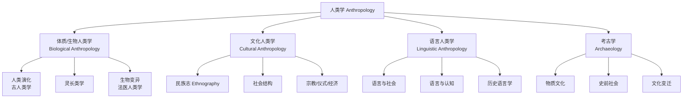

# 🧭 人类学 — 研究人类的全方位科学

> **目标**：把人类学（Anthropology）这一"研究人的科学"的核心领域，用**费曼学习法**还原为可理解、可衔接、可批判的知识体系。从达尔文到多物种人类学，从田野调查到 AI 算法偏见的跨文化维度。
>
> **核心信念**：人类学不是"研究他者"，而是"通过他者理解自己"。每一次范式转移都是人类自我认知的深化。

---

## §1 什么是人类学？

### 一句话定义

**人类学 = 研究人类的全方位科学。**

它横跨自然科学（生物演化）与人文社科（文化/语言/社会），是唯一一门**从生物到文化、从远古到当代、从个体到全球**全景式研究人类（*Homo sapiens*）的学科。

### 与其他学科的区别 | 学科 | 关注什么 | 和人类学的区别 |
|------|---------|--------------|
| **心理学** | 个体心智 | 人类学关注群体/文化语境 |
| **社会学** | 现代社会结构 | 人类学包含非西方/小型社会 + 生物维度 |
| **生物学** | 生命现象 | 人类学聚焦人类演化与生物-文化互动 |
| **语言学** | 语言本身 | 人类学关注语言在社会/文化中的角色 |
| **历史学** | 文献记载的事件 | 人类学包含无文字社会 + 田野调查 |

**人类学的独特性**：它是**最整体的**（holistic）——不把人拆成碎片（纯心理/纯经济/纯生物），而是看**生物-文化-语言-历史**的交织。

### 人类学的灵魂问题

1. **什么是人？**（生物定义 vs 文化定义）
2. **人为什么多样？**（为什么不同社会如此不同？）
3. **人有共同之处吗？**（普遍性在哪里？）
4. **文化如何塑造我们？**（包括塑造我们以为"天然"的东西）
5. **我们如何"知道"他者？**（认识论问题——田野调查的方法论基础）

---

## §2 四大分支

人类学（尤其是美国传统）通常分为四大分支，共享"人类统一性"的核心理念：

### 2.1 体质/生物人类学（Biological Anthropology）

研究人类**作为生物**的方面：
- **人类演化**：从直立行走（*Australopithecus*，~400 万年前）到智人（~30 万年前）
- **古人类学**：化石证据，骨骼分析
- **灵长类学**：与黑猩猩/大猩猩的比较（Jane Goodall 的先驱性工作）
- **人类生物变异**：肤色/血型/基因多样性的演化解释
- **分子人类学**：DNA 追溯人类迁徙（"线粒体夏娃"~20 万年前）

**核心概念**：演化不是"进步"，是**适应**。没有"高等"和"低等"——只有对特定环境的适应程度。

### 2.2 文化人类学 / 社会人类学（Cultural Anthropology）

研究人类**作为文化存在**的方面——这是人类学**最大的分支**。

- **核心方法**：**田野调查**（fieldwork）+ **参与观察**（participant observation）——住进社区，学语言，参与日常，长期观察（通常 1-2 年）
- **产出形式**：**民族志**（ethnography）——对特定群体文化的深度文字描述
- **研究范围**：亲属制度/宗教/仪式/经济/政治/性别/医疗/全球化/环境……

**核心概念**：**文化**（culture）——Tylor (1871) 的经典定义："文化是包括知识/信仰/艺术/道德/法律/风俗以及人作为社会成员所获得的一切能力与习惯的复合整体。"

**英国传统**叫"社会人类学"（关注社会结构），**美国传统**叫"文化人类学"（关注文化本身）——两者在 1950s 后逐渐融合。

### 2.3 语言人类学（Linguistic Anthropology）

研究**语言与文化**的关系：
- **Sapir-Whorf 假说**（语言相对论）：语言是否塑造思维？（Hopi 语的时间概念争议）
- **语言与社会**：性别如何影响说话方式？权力如何在话语中运作？
- **语言与身份**：方言/口音如何标记社会身份？
- **语言死亡**：全球 ~7000 种语言，约 40% 濒危

**核心概念**：语言不是透明的"交流工具"，它是**文化世界的框架**。

### 2.4 考古学（Archaeology）

研究**物质遗存**以重建过去的人类社会：
- **史前考古**：没有文字的社会（旧石器时代到早期文明）
- **历史考古**：补充文献记载
- **方法**：发掘/地层学/类型学/放射性碳测年（$^{14}\text{C}$，有效范围 ~5 万年）
- **新兴**：数字考古/水下考古/公共考古

**核心概念**：物质文化（工具/陶器/建筑/垃圾）是**人类行为的化石**——"一个人的垃圾是考古学家的宝藏。"

---

## §3 核心方法

### 3.1 田野调查（Fieldwork）

人类学**最标志性**的方法：研究者离开自己的文化，**长期**住进被研究社区（通常 12-18 个月）。

**马林诺夫斯基**（Bronisław Malinowski）1922 年确立的标准：
1. 住在当地（不住白人殖民区）
2. 学习当地语言
3. 参与日常生活
4. 系统记录（笔记本/观察/访谈）

**田野调查的困难**：
- 文化冲击 / 孤独 / 语言障碍
- **伦理**：你观察的人知道你在研究他们吗？（知情同意）
- **主观性**：你的观察不可避免地被你的文化背景过滤

### 3.2 参与观察（Participant Observation）

"参与"和"观察"的**张力**是人类学方法论的核心：
- 太参与 → 失去分析距离（"入戏太深"）
- 太观察 → 只看表面，错过内部视角（"局外人"）
- **理想状态**：既是"局内人"（理解内部逻辑）又是"局外人"（能做分析）

### 3.3 民族志（Ethnography）

**民族志**是田野调查的**文字产出**，通常 200-400 页的深度描述。好的民族志：
- **深描**（thick description）：不只描述行为（"眨眼"），还描述**意义**（是抽搐？是暗示？是嘲讽？）——Geertz (1973)
- **从当地人视角**（emic）与**分析者视角**（etic）的双重呈现
- **具体案例**而非抽象概括

### 3.4 比较法（Comparative Method）

人类学通过**跨文化比较**发现普遍性和特殊性：
- 这个习俗在其他社会存在吗？
- 这是人类本性还是特定文化的产物？
- **危险**：早期人类学用比较法"排名"社会（单线进化论），已被批判

---

## §4 人类学的政治维度

### 殖民主义的阴影

人类学诞生于**殖民时代**（19 世纪末）：
- 早期人类学家研究的是殖民地的人民
- 知识产出服务于殖民管理（"了解他们才能统治他们"）
- Talal Asad (1973)：人类学与殖民主义有"结构性关联"

### 自我批判与转型

- **Boas** (1900s)：用文化相对主义**反对科学种族主义**
- **Mead** (1928)：用萨摩亚研究挑战西方性别规范
- **Writing Culture** (1986)：质问"谁有权代表谁？"
- **后殖民/去殖民人类学**：让被研究者自己说话（本土人类学家）

### 当代伦理

- **知情同意**（informed consent）
- **互惠**（reciprocity）：研究者必须回馈社区
- **代表性危机**（crisis of representation）：你的描述是否"忠实"？能忠实吗？

---

## §5 人类学与 AI

### 为什么 AI 研究者需要人类学

| 问题 | 人类学贡献 |
|------|----------|
| **训练数据的偏见** | 文化是嵌入数据的——西方/英语/男性视角被编码为"默认" |
| **AI 的文化差异** | 不同文化如何理解/使用/拒绝 AI？ |
| **算法的社会后果** | 算法偏见不是技术问题，是**社会/权力**问题 |
| **AI 社区研究** | AI 研究者本身就是一个"部落"——可以用人类学方法研究 |
| **对齐的文化维度** | "对齐对谁"？谁的价值？谁的标准？ |

### 关键交叉领域

1. **跨文化 AI**：LLM 在非英语/非西方文化中的表现差异（文化对齐）
2. **算法的民族志**：研究 AI 系统如何嵌入社会（不是实验室，是田野）
3. **AI 与种族/性别**：面部识别/招聘/司法 AI 中的系统性偏见
4. **多物种伦理**：AI 如何改变人与非人类的关系？（Haraway 的赛博格理论）
5. **本体论与 AI**：不同文化的"本体论"（什么是"实在"）如何影响 AI 设计？

### 核心洞察

> **人类学告诉我们**：没有"无文化的"视角。AI 系统"中立"的假象本身就是一种文化权力——把特定（西方/英语/中产）的文化框架当作"普遍理性"。**去偏见不是去掉文化，是看见文化。**

---

## §6 与思想史的关系

本文档是人类学**总览**。要理解人类学**思想如何演变**——为什么每代人推翻上一代的"常识"——请阅读：

▶ **[HISTORY.md](HISTORY.md)** — 人类学思想史：9 次范式转移，从单线进化论到多物种人类学，用 Kuhn "范式转移"框架梳理。

---

## §7 核心人物速览

| 人物 | 年代 | 核心贡献 | 代表作 |
|------|------|---------|--------|
| **Charles Darwin** | 1809-1882 | 自然选择 → 人类生物演化 | *Origin of Species* (1859) |
| **Franz Boas** | 1858-1942 | 历史特定主义 / 文化相对主义 / 反种族主义 | "头骨形态" (1912) |
| **Bronisław Malinowski** | 1884-1942 | 功能主义 + 田野调查标准 | *Argonauts of the Western Pacific* (1922) |
| **A.R. Radcliffe-Brown** | 1881-1955 | 结构功能主义 | *The Andaman Islanders* (1922) |
| **Margaret Mead** | 1901-1978 | 文化塑造心理/性别 | *Coming of Age in Samoa* (1928) |
| **Claude Lévi-Strauss** | 1908-2009 | 结构主义 / 亲属/神话认知结构 | *Elementary Structures of Kinship* (1949) |
| **Clifford Geertz** | 1926-2006 | 阐释人类学 / 深描 | *The Interpretation of Cultures* (1973) |
| **Mary Douglas** | 1921-2007 | 象征/污染分析 | *Purity and Danger* (1966) |
| **David Graeber** | 1961-2020 | 经济人类学 / 债务 / 无政府主义 | *Debt: The First 5000 Years* (2011) |
| **Tim Ingold** | 1948- | 栖居 / 线 / 多物种 | *The Perception of the Environment* (2000) |
| **Eduardo Viveiros de Castro** | 1951- | 视角主义 / 本体论转向 | *Cannibal Metaphysics* (2009) |
| **Donna Haraway** | 1944- | 赛博格 / 多物种 / 位置知识 | *Staying with the Trouble* (2016) |

---

**完成日期**：2026-08-13
