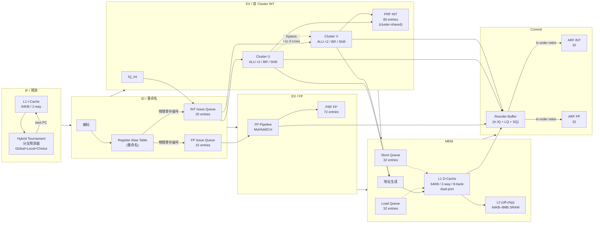
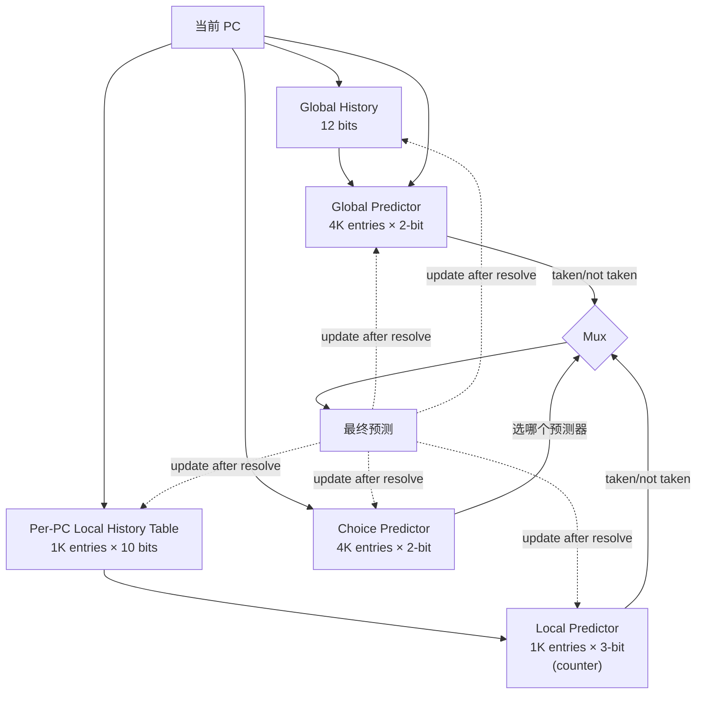
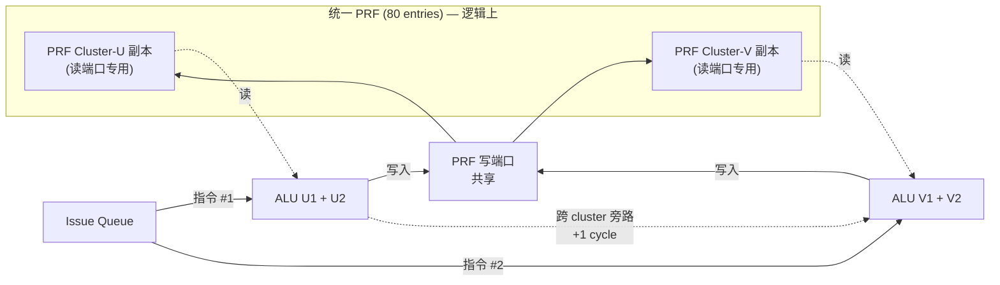
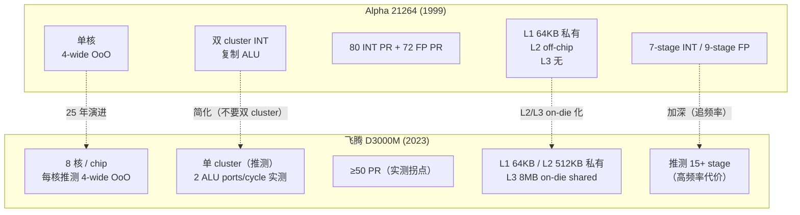

# Alpha 21264 微架构图

> 用 Mermaid 画 21264 的取指-执行-提交数据通路。对应 [`notes.md`](./notes.md) 第 3–5 节。

---

## 1. 完整数据通路（顶视图）

---

## 2. 分支预测器结构（Hybrid Tournament）

**关键**：Choice predictor 自动学习"对当前代码哪一种预测器更准"，是 1999 年最先进的自适应机制。

---

## 3. 双 Cluster 的物理寄存器堆方案

**为什么**：4-wide 需要 8 读 + 4 写端口，单 PRF 物理代价爆炸（面积 ∝ 端口²）。
复制成两份每份只需 4 读 + 4 写端口（含写回），代价是写入时要广播到两份，跨 cluster 读要 1 cycle。

---

## 4. 流水线时序（INT 路径）

```mermaid
gantt
    title Alpha 21264 INT 7-stage Pipeline
    dateFormat X
    axisFormat %s
    section 指令生命周期
    IF (Instruction Fetch)        :0, 1
    Slotting (Pre-decode + Way-pred) :1, 1
    Swap (Rename + IQ write)      :2, 1
    Issue (Select 4 from IQ)      :3, 1
    RegRead + EX                  :4, 1
    MEM (Data Cache)              :5, 1
    WB (Commit to ARF)            :6, 1
```

**关键观察**：分支在 stage 1（IF）就预测，但实际解析在 stage 4（EX）。
错误预测 penalty = 4 cycle（要 flush 4 stage 流水线）。
Tournament 预测器的高准确率（>95%）让这条流水线的实际 flush 概率 < 5%。

---

## 5. 与飞腾 D3000M 的拓扑差异（对照图）

**核心洞察**：25 年间单核 IPC 几乎没变（仍 4-wide），性能提升主要来自：
1. **频率**（600MHz → 2.5GHz，4×）
2. **大容量 on-die cache**（off-chip L2 → 8MB L3）
3. **多核**（单核 → 8 核 / chip）

这是 Hennessy & Patterson 2019 图灵奖演讲的核心观点：**ILP Wall 已破，单核时代结束**。

---

📌 **下一步**：看 [`comparison.md`](./comparison.md) 的完整数据对比表。
