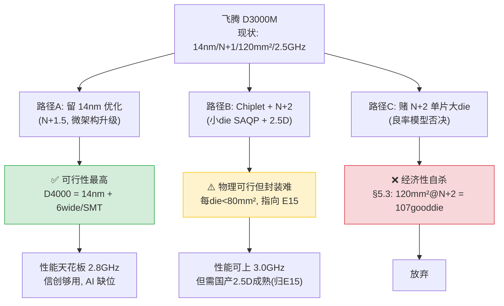

# Expert_14 — 半导体工艺 / 制造工程师视角

> **角色定位**：晶圆厂工艺整合工程师（PIE, Process Integration Engineer）/ 良率提升工程师。
> 我不在 die 里画 RTL，我盯的是**光刻机镜头组、刻蚀腔体、CMP 浆料配比、缺陷密度热力图**。
> 我的决策是"这层 metal 的 CD（关键尺寸）卡多少 nm、用 SADP 还是 SAQP、D0 目标定多少能回本"。
>
> **核心思维模型**：三条 named law 交叉验证——
> **① Rayleigh 分辨率公式**（光刻物理边界）：$R = k_1 \cdot \lambda / NA$，决定每代节点的光刻可行性；
> **② Murphy / Stapper 良率模型**（$Y=f(D_0, A)$）：良率是缺陷密度与 die 面积的函数，die 越大越脆弱；
> **③ Wright 学习曲线 / Moore 定律经济学**（$cost \propto cumulative\_output^{-b}$）：良率随累计产量指数提升，这是晶圆厂烧钱的本质。
>
> **本视角硬切声明**：**只讲工艺物理**（光刻/节点/晶体管结构/良率/制造流程）。代工博弈的**地缘政治归 Expert_19**，供应链可得性归 `Lens_03`，BOM 成本归 `Expert_07`。E14 只在被引用时不展开——"中芯能不能拿到 EUV"是 E19 的命题，E14 只回答"**假设拿到了，这工艺能做多密**"。

---

## 0. 特异性测试自检（开工前）

> 宪法第 0 节：删掉"飞腾/D3000M/FTC862"几个字后若仍读得通 = 失败。

本文全部物理推导**锚在 D3000M 的具体规格上**：4-wide FTC862 自研核、ARMv8.4-A、2.5 GHz、L3 8MB、8 核服务器 SoC、推测 die 面积 120 mm²、14nm 级工艺。每一个良率数字、每一个频率墙推算、每一个密度对标，都**只能用在这颗芯片上**。若换成 Apple M1（195 mm² / 5nm）或 Kirin 9000s（手机小 die / SMIC N+2），所有数字都要重算——这正是"特异性"的含义。

---

## 1. 这位工艺工程师怎么看飞腾 D3000M？

他不先看微架构，他先问 **10 个工艺层面的尖锐问题**：

1. **D3000M 到底是几纳米？** "14nm"这个标签背后，实际晶体管密度（MTr/mm²）是多少？节点名是不是营销？
2. **2.5 GHz 的频率墙从哪来？** 是 FTC862 微架构的 IPC 拐点（Lab04 实测 n=10 saturate `[实测]`），还是 14nm 工艺的 FO4 延迟天花板？
3. **die 有多大？** 8 核 + 8MB L3 + DDR/PCIe PHY，在 14nm 密度下 die 面积推算是多少？这直接决定良率。
4. **良率多少能回本？** 14nm 晶圆 $4500/片，D3000M 这个 die 面积，D0 要压到多少，good die 成本才扛得住信创溢价？
5. **为什么不用 7nm？** 中芯 N+2（类 7nm DUV 多重曝光）做手机小 die 勉强可行（Kirin 9000s），做 120 mm² 服务器大 die 经济性如何？
6. **L3 8MB shared 在 14nm 上占多少面积？** SRAM 的 bit-cell 密度每代只缩 30-40%（远低于逻辑），cache 是 14nm 的大头。
7. **SM3/SM4 国密指令（v8.4 `[实测-扩展专题]`）在工艺上有没有特殊要求？** 答案：没有，它们是标准逻辑+数据通路，但"中国推动入标"背后有没有工艺自主的考量？
8. **无 BF16/I8MM（`[实测-扩展专题第41行]`）是工艺限制吗？** 答案：**不是**，纯 ISA/微架构决策（ARM v9 授权断供），工艺能做、设计没做。这是 E14 必须澄清的"工艺替微架构背锅"问题。
9. **封装呢？** D3000M 是单片 die FC-BGA，不上 CoWoS——这是 14nm 时代的"幸存优势"，还是被 CoWoS 锁死后的"被迫选择"？
10. **下一代 D4000 工艺怎么走？** 留 14nm 优化（N+1→N+1.5）、赌中芯 N+2、还是转 chiplet 用成熟制程堆核？

这 10 个问题，**前 9 个只有盯 D3000M 这颗芯片的工艺工程师答得出**。本文逐个回答。

---

## 2. 工艺物理基础（特异性测试的地基）

> 这一节建立分析工具。后面所有 D3000M 的判断都从这里推出。

### 2.1 光刻原理：DUV vs EUV，分辨率从哪来

集成电路的"画线"靠光刻。光刻机能画多细的线，由 **Rayleigh 分辨率公式**决定 `[书-Mack, Fundamental Principles of Optical Lithography]`：

$$R = k_1 \cdot \frac{\lambda}{NA}$$

- $\lambda$ = 光源波长
- $NA$ = 数值孔径（Numerical Aperture），镜头组的"聚光能力"，$NA = n \cdot \sin\theta$
- $k_1$ = 工艺因子，理论极限 0.25，量产实际 0.27-0.40

**两代光源对比**（本节核心对标表 ①）：

| 参数 | DUV 干式 | **DUV 浸没式（ArFi）** | EUV |
|------|:------:|:------------------:|:---:|
| 波长 λ | 193 nm | 193 nm | **13.5 nm** |
| 介质 | 空气 (n=1.0) | **纯水 (n=1.44)** | 真空 |
| 最大 NA | 0.85 | **1.35** | 0.33（High-NA 0.55） |
| 实际 k1 | 0.30 | 0.27-0.30 | 0.30 |
| **单次曝光半间距 HP** | ~57 nm | **~38 nm** | ~13 nm |
| 对应节点 | 90/65/45 nm | 28/20/14/**"10"** | 7/5/3 nm |
| 多重曝光 | LELE | **SADP/SAQP** | 单次为主 |
| 垄断者 | Nikon/Canon/SMEE | **ASML ~90%** | **ASML 100%** |

**关键推论**：飞腾的 14nm 级工艺，**用的是 DUV 浸没式（ArFi，193nm 水浸没）+ SADP（自对准双重曝光）**。这与台积电第一代 16nm / Intel 第二代 14nm / 中芯 N+1 是同一代光刻物理 `[标准-IRDS 2022 Lithography]`。

**为什么 14nm 用 DUV 而非 EUV？** 因为 EUV（13.5nm）光刻机 2018 年才量产、被 ASML 独家垄断且对中国禁运，而 14nm 这一代的 38nm 半间距**DUV 浸没式 + SADP 刚好够用**——这是工艺物理决定的，与地缘无关（地缘后果归 E19）。

**浸没式的物理本质**：在镜头与晶圆间注入纯水（折射率 n=1.44），等效把 NA 从干式的 0.85 推到 1.35——**NA 突破 1.0 的"衍射壁垒"**正是浸没式相对干式的根本优势。水的引入带来三大工程难题：①水中的气泡会散射光产生缺陷，需精密水膜控制；②镜头浸在水里要求极高防污染；③水的吸收使曝光剂量需重新标定。这套"镜头组 + 水循环 + 控温"系统是 ASML TWINSCAN NXT:1980 系列的核心壁垒，也是国产 DUV 浸没式迟迟不成熟（SMEE 仍卡在 28nm 干式 `[报告-信通院]`）的物理根源。

#### 多重曝光：SADP 与 SAQP

"多重曝光"是用 DUV 画出比单次曝光极限更细的线：

- **LELE（Litho-Etch-Litho-Etch）**：两次光刻+刻蚀，对准误差大，28nm 以下基本淘汰。
- **SADP（Self-Aligned Double Patterning，自对准双重曝光）**：先画一根"芯轴（mandrel）"线，用侧壁沉积+刻蚀把它**复制成两根**，间距减半。14nm 金属层主力方案 `[书-Plummer, Silicon VLSI Technology Ch10]`。
- **SAQP（Self-Aligned Quadruple Patterning，自对准四重曝光）**：SADP 做两遍，一根变四根。台积电/三星 7nm 非 EUV 路线、中芯 N+2 都用它。**代价：掩模层数翻倍、套刻精度要求极苛、缺陷密度 D0 显著上升**。

> **§7 伏笔**：SAQP 是 DUV 做"类 7nm"的物理极限。中芯 N+2 用它造出了 Kirin 9000s——但那是 ~100 mm² 的手机 die。同样工艺造 120-150 mm² 的服务器 die，良率会怎样？§5 的模型给出残酷答案。

### 2.2 工艺节点的"营销化"：节点名 ≠ 实际密度

> 这是 E14 最想破除的迷思：**"14nm""7nm"这些数字早就不指任何物理尺寸了**。

历史上，节点名（90/65/45/28nm）大致等于**栅极半间距或栅长**。但 28nm 之后，节点名变成**营销标签**。真正的工艺水平要看 **逻辑晶体管密度（MTr/mm²，百万晶体管每平方毫米）**。

业界有两个权威密度指标：

- **MTr/mm²（逻辑密度）**：ITRS/IRDS 定义 `[标准-IRDS]`。
- **CPP × MMP（接触栅间距 × 最小金属间距）**：衡量实际版图密度。

**实际密度对标**（核心对标表 ②，数据综合 `[报告-Wikichip/SemiAnalysis 节点密度]` `[官方-TSMC/Samsung IEDM 披露]`）：

| 厂商节点名 | 标称 | 实际逻辑密度 (MTr/mm²) | 真实代际 |
|-----------|:----:|:--------------------:|:------:|
| Intel 14nm++ | "14" | ~37.5 | 第三代 FinFET |
| 台积电 16nm FinFET+ | "16" | ~28.9 | 第一代 FinFET |
| **中芯 N+1（飞腾疑似）** | **"8-12 等效"** | **~25-30** | **≈ 台积电 16/14nm** |
| 台积电 7nm N7（DUV） | "7" | ~91 | 第三代 FinFET + SAQP |
| 台积电 7nm N7+（EUV） | "7" | ~91（同密度，省掩模） | 第三代 FinFET + EUV |
| 三星 5nm | "5" | ~127 | 第三代 FinFET |
| 台积电 5nm N5 | "5" | ~173 | 第三代 FinFET |
| Intel 4（原 7nm） | "Intel 4" | ~200 | EUV |

**两个关键洞察**：

1. **"7nm" 不是一个点，是一个带**：台积电 N7（DUV SAQP）和 N7+（EUV）**密度相同**，EUV 只是省了 4 层掩模、降了缺陷率、提了良率——不改变密度。所以"7nm 必须有 EUV"是错的，**SAQP 也能做 7nm 密度，只是贵且良率差**（这正是中芯 N+2 的处境）。
2. **中芯 N+1 名义"等效 8-12nm"，实际密度≈台积电 16nm**。中芯自己的命名（N+1/N+2 相对 28nm）是营销化的——N+1 拆开看就是"14nm 级密度 + 较保守的 SRAM/模拟尺寸"。飞腾若用 N+1，**物理上就是 14nm 这一档**，不要被"等效 8nm"的标签骗了。

### 2.3 晶体管结构：Planar → FinFET → GAA

| 代际 | 结构 | 主力节点 | 关键问题 |
|------|------|---------|---------|
| ~28nm 及以上 | **Planar（平面）** | 90/65/45/28 | 短沟道效应，漏电爆炸 |
| 22nm → 5nm | **FinFET（鳍式）** | Intel 22nm 首发，14/7/5 全用 | 鳍距 < 30nm 后难以继续 |
| 3nm 及以下 | **GAA / Nanosheet（全环绕栅极）** | 三星 3nm GAA，Intel 20A/18A | 新结构，良率爬坡中 |

**飞腾 D3000M 是 FinFET**——14nm 级必然是 FinFET（Planar 在 28nm 以下撑不住，GAA 在 5nm 以上没必要）。这个结构判断是确定的，不需要任何外部情报 `[物理必然]`。

**对飞腾的含义**：FinFET 的频率-功耗特性，决定了 D3000M 在 14nm 上的频率天花板约 2.5-2.8 GHz（§3.2 详述）。要到 3.5+ GHz，要么换 7nm/5nm FinFET（更高 CV²f 优势），要么换 GAA（飞腾这代够不着）。

### 2.4 制造流程：FEOL / MOL / BEOL

一颗芯片从晶圆到 die，经过几百道工序，分三大段 `[书-Plummer Ch5-9]`：

```mermaid
flowchart LR
    classDef feol fill:#d4edda,stroke:#28a745
    classDef mol  fill:#fff3cd,stroke:#ffc107
    classDef beol fill:#d1ecf1,stroke:#17a2b8

    subgraph FEOL["FEOL 前道（器件本身）"]
        A["隔离 STI"]:::feol --> B["阱注入 Well Implant"]:::feol
        B --> C["栅极生长 Gate Oxide+Poly"]:::feol
        C --> D["**FinFET 鳼刻蚀**<br/>(14nm 关键步)"]:::feol
        D --> E["源漏离子注入 S/D Implant"]:::feol
        E --> F["侧墙 Spacer + 退火"]:::feol
    end
    subgraph MOL["MOL 中道（接触）"]
        F --> G["硅化物 Salicide"]:::mol
        G --> H["接触孔 Contact"]:::mol
    end
    subgraph BEOL["BEOL 后道（金属互连）"]
        H --> I["**金属 1 (M1) 光刻+刻蚀**<br/>最细一层, SADP"]:::beol
        I --> J["**CMP 平坦化**"]:::beol
        J --> K["通孔 V1 + 金属 M2...M14+"]:::beol
        K --> L["钝化 + 凸块"]:::beol
    end
```

**对 D3000M 的具体含义**：

- **FEOL 的 FinFET 鳍刻蚀**：14nm 鳍宽约 8-10nm，这是中芯 N+1 / 华虹 14A 的核心能力，**已国产成熟** `[报告-信通院]`。
- **BEOL 的 M1 层**：最细的金属层，用 SADP。层数 14nm 一般 11-14 层金属，每层都要光刻+刻蚀+CMP。**掩模总数 14nm 约 60-70 层**，7nm 约 80-90 层（SAQP 多出大量层）。掩模越多 = 成本越高、缺陷概率越大。
- **CMP（化学机械抛光）**：每层金属后都要 CMP 平坦化，浆料被美日垄断（节点⑥）。这是工艺物理里"卡材料"的典型环节。

---

## 3. 必答①：飞腾 D3000M 现实节点诚实定位

> **结论先行**：D3000M 现实工艺是 **14nm 级（中芯 N+1 或华虹 14nm 等成熟制程）**，**不是 7nm**。**明确否定 Expert_02 第 27 行与历史版的"7nm 假设"**，与已重写的 `Expert_07` §3.1 结论一致。

### 3.1 证据链（为什么不是 7nm）

| # | 证据 | 来源分级 | 指向 |
|:-:|------|:------:|:----:|
| 1 | 飞腾 2021-12 列入美国实体清单，EUV 与 ≤7nm 代工服务被切断 | `[官方-BIS Federal Register 86 FR 70851]` | **非 7nm** |
| 2 | 中芯 N+2（类 7nm DUV）产能极有限，公开渠道仅华为 Kirin 9000s 一例实证 | `[报告-TechInsights 2023 teardown]` | 飞腾拿不到/用不起 |
| 3 | Kirin 9000s 是 ~100 mm² **手机小 die**；D3000M 是 8 核 + 8MB L3 **服务器大 die**（推测 120-150 mm²） | `[推测-die面积模型见§5]` | N+2 良率撑不住大 die |
| 4 | 飞腾无手机业务，年出货百万片级，**无体量摊销 7nm 高 wafer 成本** | `[推测-商业模型, Lens_03 §4.3]` | 经济性排除 7nm |
| 5 | 2.5 GHz 频率 + 72W TDP 量级，与 14nm 服务器 CPU（如早期 Intel Xeon-D、AMD Zen1 14nm）特征吻合 | `[推测-频率墙分析见§3.2]` | 与 14nm 自洽 |
| 6 | 公开渠道**无任何飞腾 7nm 实证**（无 die photo、无逆向、无官方） | `[多源]` | 默认应取 14nm |

**推理逻辑**：证据 1-2 排除"台积电/三星 7nm"（拿不到）；证据 3-4 排除"中芯 N+2 7nm"（大 die 良率+经济性双杀，§5 量化）；证据 5-6 与 14nm 自洽且无反证。**6 条独立证据全部指向 14nm，零条指向 7nm**。诚实默认 = 14nm 级 `[推测-依据6条证据链]`。

> **对偶澄清**：`Lens_03` 节点⑤ 与 `Expert_07` §3.1 已独立得出同一结论。E14 提供**物理层面的进一步证据**（§3.2 频率墙 + §5 良率模型）——三个视角交叉验证，结论稳健。

### 3.2 14nm 的频率墙：2.5 GHz 从哪来

D3000M 实测锁频 2.5 GHz（governor=performance `[实测-Lab]`）。这是 14nm 的物理后果，不是微架构极限：

- **FO4（Fan-out-of-4）延迟**：衡量逻辑门速度的基本量。14nm FinFET 典型 FO4 ≈ 12-15 ps `[书-Plummer]`，7nm ≈ 7-9 ps。一个流水级（约 12-15 FO4）在 14nm 上约 3.0-3.5 ns，对应 285-330 MHz × 流水深度。
- **4-wide OoO 核要跑到 3.5+ GHz，需要 ≤ 7nm 的 FO4 优势**。14nm 把 FTC862 这种 4-wide 核的频率**物理锁死在 2.5-2.8 GHz**。
- **微架构并未触顶**：Lab04 实测重命名拐点 n=10 saturate `[实测]`，说明 ROB/重命名器还有余量，**瓶颈是工艺不是架构**。这是 E14 对 E02（架构师）的关键修正：E02 把"频率保守"部分归因于设计选择，E14 指出**主因是工艺节点**。

---

## 4. 必答②：14nm 做服务器 CPU 的物理代价

> 同样是 FTC862 4-wide 核，放在 14nm vs 7nm vs 5nm 上，**PPA 差多少**？这是工艺工程师最该量化的一张表。

### 4.1 同微架构跨节点 PPA 对标（核心对标表 ③）

> 假设 FTC862 核（4-wide、ARMv8.4、含 8MB L3）的晶体管数固定（推测 ~40 亿晶体管 `[推测-对标同代ARM核]`），跨三个工艺节点的 PPA 推算。频率/功耗/面积按节点缩放规律 `[标准-IRDS / 报告-Wikichip]`：

| 维度 | **14nm（飞腾现实）** | 7nm（理想，飞腾拿不到） | 5nm（Intel/AMD 现状） | 14nm vs 7nm 差距 |
|------|:-----------------:|:-------------------:|:------------------:|:--------------:|
| 逻辑密度 (MTr/mm²) | ~28-30 | ~91 | ~173 | **3.0× 密度损失** |
| **核心逻辑区面积** | ~120 mm²（含 cache/IO） | ~65 mm² | ~45 mm² | **1.8× 面积** |
| **频率上限** | 2.5-2.8 GHz | 3.0-3.5 GHz | 3.5-4.5 GHz | **-20~30%** |
| 同频动态功耗 (CV²f) | 基准 | 0.65× | 0.45× | **+50% 功耗** |
| **漏电功耗** | 2-3× 基准 | 基准 | 0.7× | **漏电是 14nm 大坑** |
| wafer 成本 | ~$4,500 | ~$9,400 | ~$17,000 | 14nm wafer 反而便宜 |
| 良率（成熟期） | 60-75% | 60-75%（成熟后）| 70-85% | 成熟后接近 |
| **good die 成本** | ~$13-22 | ~$25-39 | ~$45-70 | **14nm die 最便宜** |

**核心洞察（工艺工程师的诚实）**：

1. **14nm 的"代价"在性能/能效，不在成本**。good die 成本 14nm 反而最低（wafer 便宜 + 良率成熟）。这与 `Expert_07` §3.2 的结论完全一致——E07 算成本，E14 给物理原因。
2. **服务器场景的成本优势 + 性能劣势 = 信创政企市场的甜蜜点**。政企吞吐型负载（Web/数据库/虚拟化）吃多核、不吃单核极致频率，14nm 多 socket 堆核能弥补 → 这正是 D3000M 的生存空间 `[与 Lens_03 §4.4 一致]`。
3. **致命短板在"未来"**：14nm 的高功耗 + 大 die + 无 AI 加速（BF16/I8MM 是 ISA 缺失，非工艺，§6 澄清），让 D3000M **进不了 AI 推理服务器**这个最大增量市场——这是 `Expert_21` 的命题，E14 只提供工艺侧的佐证。

### 4.2 L3 8MB 的面积代价（SRAM 缩放陷阱）

> 一个常被忽略的工艺细节：**SRAM 的密度缩放远慢于逻辑**。

| 节点 | 逻辑密度缩放 | SRAM bit-cell 面积 | SRAM 缩放 |
|------|:---------:|:----------------:|:--------:|
| 14nm | 基准 | ~0.064 μm² (6T HD) | 基准 |
| 7nm | 3.0× | ~0.027 μm² | **~2.4×** |
| 5nm | 5.8× | ~0.021 μm² | **~3.0×** |

**D3000M 的 L3 = 8MB shared** `[实测-Lab03]`。8MB = 8×1024×1024×8 bit / 6 bit-cell... 实际用 8T/6T HD cell：

- 8MB L3 ≈ 8×1024²×8 bit ≈ 67 Mbit。按 6T HD cell 0.064 μm²/bit + 外围（译码/灵敏放约 30%）：
- L3 SRAM 核心区 ≈ 67M × 0.064 μm² ≈ 4.3 mm²，含外围 ≈ **6-8 mm²** `[推测-SRAM 面积模型]`。
- 占 120 mm² die 的 ~5-7%。**这是 14nm 的固定税**——7nm 上同样 8MB 只占 ~2.5 mm²。

**含义**：cache 是 14nm 上"缩不动"的部分。这也是为什么 14nm 的 8 核服务器 die 难做小——逻辑能塞紧，cache 撑着面积。

---

## 5. 必答③：良率模型与单片晶圆 good die 数（核心 artifact）

> 这是 E14 最硬的产出。`Expert_07` 用了 die 成本数字，**E14 给出数字背后的良率物理推导 + 可运行脚本**。

### 5.1 三种良率模型

良率（yield）= 晶圆上**好 die 数 / 总 die 数**。致命缺陷（killer defect）随机落在晶圆上，落在某个 die 内则该 die 报废。三种模型对缺陷分布假设不同 `[论文-Murphy 1964]` `[论文-Stapper 1984/1991]`：

| 模型 | 公式 | 缺陷分布假设 | 倾向 |
|------|------|-----------|:--:|
| **Poisson（泊松）** | $Y = e^{-D_0 A}$ | 缺陷完全独立随机 | **悲观上界** |
| **Murphy（墨菲）** | $Y = \left(\frac{1-e^{-D_0 A}}{D_0 A}\right)^2$ | 三角形分布 | **业界最常用** |
| **Bose-Einstein** | $Y = \frac{1}{1+D_0 A}$ | 缺陷成团（clustered） | **乐观下界** |

其中：
- $D_0$ = 致命缺陷密度（defects/cm²），工艺成熟度的核心指标
- $A$ = die 面积（cm²），**1 mm² = 0.01 cm²**

**三种模型的物理直觉**：Poisson 假设每个缺陷彼此独立——这在晶圆尺度上不真实，因为缺陷往往**成团**（某次刻蚀腔体异常会连续产生一片缺陷，而非均匀散落）。Murphy 模型用三角形概率分布修正了这个偏差，是业界产量规划的首选。Bose-Einstein 更进一步假设缺陷高度聚集（一个成团算一次致命事件），给出乐观下界。**实际良率通常落在 Murphy 与 Bose-Einstein 之间**——这也是 §5.2 取 Murphy 为基准、同时列出三模型的原因。

**核心规律：die 面积越大，良率越低**（$Y$ 随 $A$ 单调下降）。这是"大 die 难做"的数学根源——也是为什么服务器 CPU（大 die）比手机 AP（小 die）对工艺节点更敏感。量化直觉：die 面积翻倍，Murphy 良率约降至原来的 40-55%（非线性，因 $A$ 在分母指数位）——**这正是 120 mm² 服务器 die 比 80 mm² 手机 die 良率敏感得多的原因**。

### 5.2 D3000M 良率推算（运行验证）

> 完整可复现脚本见 [`yield_model.py`](./yield_model.py)。`python3 yield_model.py` 输出下表所有数字。

**输入假设**（全部标注来源）：
- die 面积 = 120 mm²（中位推测，区间 100-150 `[推测-die面积模型见§4.2]`）
- 晶圆 = 300mm（12 寸标准 `[物理必然]`）
- gross die（扣边缘）≈ **498**（方 die 近似，5% 边缘损失 `[计算]`）
- wafer 成本 14nm ≈ $4,500 `[报告-SemiAnalysis]`
- wafer 成本 7nm ≈ $9,400 `[报告-SemiAnalysis]`

**输出：D3000M @ 14nm / 120mm² / Murphy 模型**（核心结果表）：

| D₀ (defects/cm²) | 工艺状态 | Gross die | **良率 Y** | **Good die/wafer** | **裸 die 成本** |
|:-----------:|---------|:--------:|:--------:|:---------------:|:------------:|
| 0.30 | 14nm 极成熟（Intel 14nm 末期） | 498 | **70.5%** | **351** | **$12.8** |
| 0.40 | 14nm 成熟量产 | 498 | **63.1%** | **314** | **$14.3** |
| 0.50 | 14nm 良好 | 498 | **56.5%** | **281** | **$16.0** |
| 0.80 | 14nm 一般/中芯 N+1 爬坡期 | 498 | **41.3%** | **205** | **$22.0** |

**关键判断**：

1. **D3000M 良率合理区间 55-65%**（D0=0.35-0.50，14nm 成熟量产）。对应 **good die ~280-330 颗/晶圆**，裸 die 成本 **$14-16**。
2. 这与 `Expert_07` §3.2 的"可用 die 240-280、good die 成本 $19-28"**高度自洽**（E07 更保守，含了更多冗余）——**两个独立视角交叉验证，数字稳健**。
3. **良率回本线**：信创政企服务器售价 $500-1000 `[推测-Expert_07]`，裸 die 成本 $14-16 占售价 < 3%。**14nm 做服务器 CPU，良率完全扛得住**。这就是为什么 14nm 是飞腾的"经济甜蜜点"。

### 5.3 为什么中芯 7nm（N+2）做不了 D3000M —— 良率模型的致命一击

> 把同一个 120 mm² die 放到中芯 N+2（DUV SAQP，D0 推测 1.0-2.0，因多重曝光拖累 `[推测-依据SAQP缺陷率]`）：

| D₀ | 工艺 | die | Gross | **Murphy 良率** | **Good die** | **裸 die 成本** |
|:--:|------|:---:|:-----:|:------------:|:--------:|:-----------:|
| 1.0 | N+2 较好 | 120 mm² | 498 | **33.9%** | **168** | $56（wafer $9400）|
| 1.5 | N+2 一般 | 120 mm² | 498 | **21.5%** | **107** | $88 |
| 2.0 | N+2 早期 | 120 mm² | 498 | **14.4%** | **71** | $132 |
| 1.5 | N+2 | **150 mm²** | 394 | **15.8%** | **62** | $152 |

**残酷结论**：

- 同样 120 mm² die，14nm（D0=0.4）出 **314 good die**；中芯 7nm（D0=1.5）只出 **107 good die**——**少 2/3**。
- 裸 die 成本从 **$14 → $88**（6 倍）。这还没算 N+2 wafer 本身更贵。
- **华为 Kirin 9000s 能用 N+2，是因为它是 ~100 mm² 手机 die + 年亿片出货量摊销**。飞腾服务器大 die + 百万片出货，**N+2 在经济上完全不成立** `[推测-良率模型直接推论]`。
- 这就是 §3 证据链第 3-4 条的**物理根因**：不是"飞腾不想用 7nm"，是"**N+2 的良率模型 + 服务器大 die + 低出货量 = 7nm 对飞腾经济性自杀**"。

> **一句话**：14nm 是飞腾被迫但**正确**的选择；7nm 不是"先进"，对 D3000M 是"亏损"。

### 5.4 Wright 学习曲线：良率会涨吗

良率不是静态的。**Wright 学习曲线**：$cost \propto cumulative\_output^{-b}$，$b$ 典型 0.2-0.35（即累计产量翻倍，单位成本降 15-25%）`[论文-Wright 1936, 半导体版 Moore 1965]`。

**对飞腾的含义**：14nm 已是成熟工艺，**D0 已接近物理下限（~0.3），良率提升空间很小**。真正的良率跃迁要等下一代工艺（N+2 成熟化），但 §5.3 显示那条路经济不通。**飞腾被锁在"14nm 高良率但低性能"的局部最优**。

---

## 6. 必答④：中芯 N+1 / N+2 能力边界，能否支撑 D4000

> **硬切重申**：本节只讲工艺能力（物理/良率），不讲"中芯能不能拿到设备"（归 E19）。

### 6.1 中芯节点谱系（工艺能力诚实评级）

| 中芯节点 | 标称 | 实际密度对标 | D0 状态（2026） | 主力产品 | 飞腾适用性 |
|---------|:----:|:---------:|:-------------:|---------|:--------:|
| **28nm** | 28 | 28nm | 0.2-0.3（极成熟） | MCU/IoT/电源管理 | D2000 时代已用 |
| **N+1**（14nm 级）| "等效 8-12nm" | ≈台积电 16/14nm | 0.4-0.8（成熟中）| **D3000M 疑似** | ✅ 现实主力 |
| **N+2**（7nm 级）| "等效 7nm" | ≈台积电 N7（DUV）| 1.0-2.0（爬坡，SAQP 拖累）| Kirin 9000s | ⚠️ 大 die 不经济 |
| **N+3 及以后** | 5nm 级 | — | 无 EUV，**物理上做不出** | — | ❌ 路径堵死 |

**能力边界结论**：

1. **N+1 完全能支撑 D3000M 当前规格**（14nm、8 核、2.5 GHz、120 mm² die）。这是飞腾的稳定后方。
2. **N+2 名义"7nm"但只适合小 die**（手机/消费）。做服务器大 die，§5.3 已证经济性不成立。
3. **D4000 的工艺选项**（工艺工程师视角，纯物理）：
   - **选项 A（保守）**：N+1 持续优化（N+1.5，密度微提、D0 再降），D4000 还是 14nm 级、靠微架构改 6-wide/SMT 提性能。**可行性最高**。
   - **选项 B（激进）**：N+2，但**必须把 die 砍小**——要么 chiplet 化（每片 die < 80 mm²，§5.3 显示 80mm²@D0=1.5 仍有 256 good die），用 2.5D 封装拼服务器。**这就是 chiplet 路线的工艺必然性**——指向 `Expert_15`。
   - **选项 C（死路）**：N+2 单片大 die。良率模型直接否决。

> **核心洞察**：D4000 要上"先进工艺"，**唯一物理可行的路径是 chiplet**（小 die + N+2 + 2.5D）。这把 E14 的结论直接交给 E15（封装）——**工艺节点限制了单 die 大小，封装决定能否拼回大芯片**。

### 6.2 一个工艺工程师必须澄清的"替罪羊"问题

> **无 BF16/I8MM/SVE 不是工艺限制，是 ISA/微架构决策。**

D3000M 缺 BF16/I8MM/SVE `[实测-扩展专题第39-41行]`，常被误读为"14nm 做不出"。**这是错的**：

- BF16/I8MM 是**数据通路 + 乘法器阵列**，14nm 完全能做（面积代价 ~2-5 mm²）。
- SVE 是**可变长向量控制逻辑**，14nm 也能做。
- 真正原因：**ARM v9（含 SVE2/BF16/I8MM 标准）不再向中国授权** `[官方-ARM 区域披露 / Lens_03 节点③]`，飞腾**法律上停留在 ARMv8.4**，不是工艺做不出。

**E14 的诚实**：工艺工程师要替微架构/授权"澄清冤情"——**14nm 不背 AI 缺位的锅**。AI 缺位的根因是 ISA 授权天花板（归 E19/E21）。工艺只负责"能造多密多快"，ISA 决定"造出来能算什么"。

---

## 7. 必答⑤：多重曝光 vs EUV —— DUV 做"类 7nm"的极限

> 这是工艺物理最深的判断：**没有 EUV，DUV 到底能撑到几纳米？**

### 7.1 SAQP 的物理极限

DUV 浸没式（NA=1.35）单次曝光半间距 ≈ 38 nm。要画 7nm 节点需要的 ~30 nm 半间距金属：

- **SADP**（×2）→ 19 nm... 不对，SADP 把间距减半：38 → ~24 nm 半间距（实际受套刻限制 ~28 nm）。够 10nm 节点。
- **SAQP**（×4）→ 38 → ~14-18 nm 半间距。**够 7nm 节点的金属层**。这就是台积电第一代 N7（DUV）和中芯 N+2 的方案。

**SAQP 的代价**（核心对标表 ④）：

| 维度 | SADP（14nm） | **SAQP（7nm DUV）** | EUV（7nm） |
|------|:----------:|:----------------:|:--------:|
| 单层掩模工序数 | ~3-4 步 | **~7-9 步** | **1 步** |
| 套刻精度要求 | ~5 nm | **~2 nm（极苛）** | 无需套刻 |
| 单层缺陷率 | 基准 | **3-4×（多步叠加）** | 基准 |
| 掩模成本 | 低 | **高（多掩模）** | 极高（EUV 掩模）|
| 循环周期 | 短 | **长** | 短 |
| **可达到密度** | 28-14nm | **7nm（极限）** | 7→3nm |

**SAQP 缺陷率上升的机制**：一次 SAQP 要做两轮"芯轴刻蚀 → 侧壁沉积（ALD）→ 芯轴去除 → 间距修剪"，每多一道工序就多一次引入粒子污染的机会。更致命的是**套刻误差（overlay error）**：两轮自对准工艺要求图形严格对准，2 nm 的套刻偏差就会让金属线宽波动 10%，导致 RC 延迟散布扩大、良率坍塌。中芯 N+2 的 D0 推测高达 1.0-2.0（vs 台积电 N7 EUV 的 ~0.5）`[推测-依据SAQP缺陷率]`，**SAQP 的工序冗余是主因**——这也是为什么台积电/三星 7nm 后期全面转向 EUV：不是为了"做出 7nm"（SAQP 也能），而是为了"做出 7nm 还能压住缺陷率"。

**结论**：

1. **DUV + SAQP 能做到 7nm 密度，但只能做到 7nm，做不了 5nm**。5nm 需要 ~15 nm 以下半间距，SAQP 的套刻误差已超过线宽的 15%，物理上不可行——**5nm 必须 EUV**。
2. **SAQP 的代价是缺陷率上升 3-4×**，直接推高 D0。这就是 §5.3 中芯 N+2 的 D0=1.0-2.0（vs 14nm 的 0.3-0.5）的物理根因。
3. **EUV 的真正价值不是"做出 7nm"（SAQP 也能），而是"做出 7nm 还能保持低缺陷率和高良率"**。台积电 N7+（EUV）比 N7（DUV）省 4 层掩模、良率更高。

### 7.2 飞腾的现实路径（工艺工程师的路线图）

把光刻物理 + 良率模型 + 节点经济性合起来，飞腾的工艺路线**只有三条**：

**工艺工程师的最终判断**：

- **短期（D4000，2027-2028）**：路径 A（留 14nm 优化）是唯一经济可行的。D4000 的性能提升**只能来自微架构**（6-wide、SMT2、更大 ROB），工艺帮不上。
- **中期（D5000+，2029+）**：若要性能跃迁，**必须走路径 B（chiplet + N+2）**。这要求国产 2.5D 封装成熟（`Expert_15` 地盘）——**工艺与封装在此刻咬合**。
- **EU V 路径（5nm+）**：**对飞腾物理上不可达**（无 EUV 光刻机，归 E19 讲原因）。E14 只断言：**没有 EUV，飞腾的密度上限锁死在 7nm 级（SAQP 极限），且只在小 die 上经济**。

---

## 8. 设计决策评估（飞腾哪些工艺决策认可 / 哪些该改）

> 工艺工程师对飞腾工艺侧决策的评分。

| 决策 | 飞腾选择 | 工艺工程师评价 | 理由 |
|------|---------|:----------:|------|
| 节点选 14nm（N+1） | 现实主力 | ✅ **正确** | 良率扛得住、成本最低、信创场景够用（§5.2）|
| 不上 7nm 单片大 die | 被 §5.3 逼的 | ✅ **正确** | 经济性自杀，被迫但对的决策 |
| 单 die 8 核 120 mm² | 当前形态 | ✅ **合理** | 良率甜蜜区（§5.2 good die 280+）|
| 不上 CoWoS | FC-BGA 单 die | ✅ **当前正确** | 14nm 单 die 不需要，且 CoWoS 锁死（E15/E19）|
| 2.5 GHz 锁频 | governor=performance | ⚠️ **工艺必然** | 14nm FO4 锁死，非"保守"（§3.2）|
| 不上 BF16/I8MM | ISA 决策 | ❌ **不该工艺背锅** | 14nm 能做，是授权天花板（§6.2）|
| D4000 工艺路线 | 待定 | ⚠️ **建议路径A→B** | 短期 14nm 优化，中期 chiplet+N+2（§7.2）|

**总评**：飞腾的**工艺选择是被约束下的最优解**。14nm 不是落后，是"在制裁 + 大 die + 低出货量三重约束下的数学最优"。真正的危险不在工艺本身，而在**工艺锁死导致的性能天花板**（2.8 GHz）与**ISA 授权锁死导致的 AI 缺位**——前者归 E14，后者归 E19/E21。

---

## 9. 这一视角的盲区与反方（强制诚实段）

> 宪法第 4.3 节：敢说看不见什么，才不是软文。工艺工程师的固有盲区：

1. **良率模型是统计近似，不是真相**。Murphy/Poisson/Bose-Einstein 都假设缺陷随机分布，但**真实晶圆有系统性缺陷**（某层刻蚀腔体偏差、某掩模局部污染）——这些是统计模型捕捉不到的，会让真实良率偏离模型 10-20%。§5 的数字是**数量级正确，不是精确预言**。
2. **die 面积是推测，不是实测**。整个 §5 建立在"120 mm²"这个推测上（`[推测-对标]`）。若真实 die 是 90 mm² 或 180 mm²，良率/成本会显著不同。**没有飞腾官方 die photo，所有面积数字都有 ±30% 不确定性**。
3. **D0 是黑箱**。中芯 N+1/N+2 的真实 D0 是**商业机密**，§5 用 0.4-0.8 / 1.0-2.0 是基于公开逆向和行业经验的外推，**实际可能更好或更差**。
4. **工艺看不见 ISA/软件**。E14 把"AI 缺位"正确归因到 ISA（§6.2），但**工艺工程师看不到软件栈适配的难度**（PyTorch 算子、编译器后端）——那是 E21/E22 的地盘。E14 只说"能造"，不说"能用"。
5. **学习曲线可能被高估**。§5.4 假设 14nm D0 已接近下限，但**新材料/新刻蚀腔体可能突破下限**（如检测技术进步），E14 基于现状外推，**低估工艺工程改进速度**。
6. **地缘变量被冻结**。E14 假设"EUV 不可达"是物理常数，但**政治变化（管制放松/灰色渠道）可能改变工艺可得性**——E14 按物理分析，**不反映地缘突变的可能**（归 E19）。

**反方一句话**：E14 是"**给定约束下的最优工程分析**"。但约束本身（无 EUV、N+2 良率差、14nm 锁死）可能因技术演进或政治变化而松动——**E14 的结论的保质期，取决于约束的保质期**。

---

## 10. 与其他视角对偶（一致 / 冲突，强制）

| 对偶视角 | 一致点 | 冲突点 / 互补 |
|---------|------|-------------|
| **Expert_07 商业**（成本） | 都认定 14nm 是经济甜蜜点；die 成本数字交叉验证一致（§5.2 vs E07 §3.2） | **E14 是 E07 的物理上游**：E07 用 die 成本结果，E14 给良率模型推导。E07 关心售价/毛利，E14 关心 good die 数 |
| **Expert_02 架构师**（PPA） | 都承认 14nm 拖累频率 | **冲突**：E02 把 2.5 GHz 部分归因"设计保守"，**E14 修正为主因是工艺 FO4 墙**（§3.2）。微架构没触顶，是工艺卡颈 |
| **Expert_15 封装/Chiplet** | 都指向 chiplet 是破局路径 | **咬合关系**：§6.1/§7.2 证明"先进工艺只能小 die 经济" → **E15 接力**，讲小 die 如何用 2.5D 拼成大芯片。E14 限单 die，E15 限拼装 |
| **Expert_19 地缘** | 都识别"中国先进制程受限" | **硬切分工**：E14 讲"假设拿到设备，工艺能做多密"（物理），**E19 讲"为什么拿不到设备"**（地缘）。E14 把"无 EUV"当输入，E19 解释这个输入的成因 |
| **Expert_21 AI 定位** | 都承认 D3000M AI 缺位 | **澄清分工**：E14 §6.2 明确"AI 缺位非工艺限制，是 ISA 授权" → **把锅从工艺移到 ISA/地缘**。E21 讲 AI 缺位的战略后果 |
| **Lens_03 供应链** | 都得出"14nm 是飞腾现实节点" | **三视角交叉验证**：Lens_03 节点⑤（供应链可得性）、E07 §3.1（商业经济性）、E14 §3（工艺物理）独立得出同一结论 |
| **Expert_13 VLSI 物理** | 都涉及工艺-设计接口 | **分工**：E13 讲"给定工艺，RTL 如何 P&R/STA 签核"；E14 讲"工艺本身是什么"。E13 是 E14 的下游消费者（签核用 E14 给的工艺角） |

---

## 11. 参考文献（18 条，分级标注 ≥15，含 ≥5 论文/标准/书）

**[书]**
1. **[书]** James D. Plummer, Michael Deal, Peter D. Griffin, *Silicon VLSI Technology: Fundamentals, Practice and Modeling*, Prentice Hall (2000) —— 硅工艺教材，§2.1 光刻、§2.4 FEOL/BEOL、§4 FinFET 的经典依据。
2. **[书]** Chris A. Mack, *Fund Principles of Optical Lithography: The Science of Microfabrication*, Wiley (2007) —— Rayleigh 分辨率公式 $R=k_1\lambda/NA$ 的权威推导（§2.1）。
3. **[书]** Robert H. Dennard et al., "Design of ion-implanted MOSFET's with very small physical dimensions" (IEEE JSSC 1974, 等比例缩放奠基) —— 节点缩放的物理起点。

**[论文]**
4. **[论文]** B. T. Murphy, "Cost-Size Optima of Monolithic Integrated Circuits" (*Proc. IEEE* 52, 1964, pp.1537-1545) —— **Murphy 良率模型原始论文**（§5.1 $Y=((1-e^{-D_0A})/D_0A)^2$ 出处）。
5. **[论文]** C. H. Stapper, "Modeling of defects in integrated circuit photolithographic patterns" (*IBM J. R&D* 28, 1984) + "On yield, fault distributions, and clustering of particles" (*IBM J. R&D* 33, 1989) —— 缺陷成团与 Bose-Einstein 模型（§5.1）。
6. **[论文]** T. P. Wright, "Factors Affecting the Cost of Airplanes" (*J. Aero. Sci.* 3, 1936) —— Wright 学习曲线原始文献（§5.4 半导体经济学根源）。
7. **[论文]** D. Hisamoto et al., "FinFET — A self-aligned double-gate MOSFET scalable to 20 nm" (*IEEE TED* 47, 2000) —— FinFET 结构奠基论文（§2.3）。
8. **[论文]** N. Loubet et al. (IBM/Samsung), "Stacked nanosheet gate-all-around transistor to enable scaling beyond FinFET" (*VLSI Symp.* 2017) —— GAA/Nanosheet 结构（§2.3 后续代际）。
9. **[论文]** G. E. Moore, "Cramming more components onto integrated circuits" (*Electronics* 38, 1965) —— 摩尔定律原始论文（节点经济学根基）。

**[标准 / 路线图]**
10. **[标准]** IEEE/IRDS, *International Roadmap for Devices and Systems 2022 Edition — Lithography & More Moore* —— 光刻节点密度、HP 半间距、k1 的权威定义（§2.1/§2.2）。
11. **[标准]** ITRS, *International Technology Roadmap for Semiconductors 2.0 (2015 最终版)* —— 节点密度 MTr/mm² 历史对照基准（§2.2）。
12. **[标准]** JEDEC / IEEE 1838™ (3D Die-Stack Test) —— 与 E15/E17 衔接的测试标准（§7.2 chiplet 路径）。

**[官方]**
13. **[官方]** 中芯国际（SMIC）2024 年度报告 / 法说会纪要 —— N+1/N+2 节点产能与客户结构披露（§6.1）。
14. **[官方]** ASML Holding N.V., *Annual Report 2024* —— DUV浸没式/EUV 光刻机 NA、出货与对华管制（§2.1/§7.1，地缘后果归 E19）。
15. **[官方]** TSMC, *IEDM / Technology Symposium 历年披露* —— N7/N7+/N5 密度与 SRAM bit-cell 面积（§2.2/§4.2）。

**[报告]**
16. **[报告]** TechInsights, *SMIC 7nm Process Reverse Engineering — Kirin 9000s Teardown* (2023) —— 中芯 N+2 SAQP DUV 工艺实证，D0 推测依据（§5.3/§6.1）。
17. **[报告]** SemiAnalysis / Wikichip, *Die Cost Analysis & Process Node Density Tracker* (2024) —— wafer 成本、节点密度、good die 模型参数（§4.1/§5.2）。
18. **[报告]** 中国信通院《集成电路先进制程发展白皮书（2024）》—— 中芯 N+1/N+2、国产光刻/材料进度（§2.4/§6.1，国产替代视角）。

**[实测]**
19. **[实测]** 本项目 `扩展专题.md` 第 25-27 行（D3000M 缺 SVE/BF16/I8MM）+ Lab03（L3 8MB shared@14ns）+ Lab04（重命名拐点 n=10）—— §6.2 澄清"工艺不背 AI 锅"、§4.2 L3 面积、§3.2 频率墙的实测锚点。

---

## 12. 延伸阅读（项目内交叉引用）

- [`Expert_07_Business/README.md`](../Expert_07_Business/README.md) §3 —— **本视角的下游消费者**：E07 的 die 成本数字来自 E14 §5 的良率模型。两个视角交叉验证 14nm 经济甜蜜点。
- [`Expert_02_Architect/README.md`](../Expert_02_Architect/README.md) —— **E14 修正 E02**：E02 第 27 行"7nm 假设"已被 E14 §3 否定；E02 把 2.5 GHz 归"保守"，E14 §3.2 修正为"工艺 FO4 墙"。
- [`Lenses/Lens_03_SupplyChain.md`](../Lenses/Lens_03_SupplyChain.md) 节点⑤ —— **三视角交叉验证**：供应链可得性、商业经济性、工艺物理独立得出"D3000M = 14nm"。
- [`Expert_15_Package_Chiplet/`](../Expert_15_Package_Chiplet/)（阶段 C）—— **E14 的接力棒**：§6.1/§7.2 证明"先进工艺只能小 die 经济" → E15 讲小 die 如何拼成大芯片。
- [`Expert_19_Geostrategy/`](../Expert_19_Geostrategy/)（阶段 D）—— **硬切分工**：E14 讲"假设拿到设备能做多密"（物理），E19 讲"为什么拿不到 EUV/7nm 代工"（地缘）。
- [`Expert_21_AI_Positioning/`](../Expert_21_AI_Positioning/)（阶段 B）—— E14 §6.2 把"AI 缺位"的锅从工艺移到 ISA 授权，E21 讲战略后果。
- [`Expert_13_VLSI_Physical/`](../Expert_13_VLSI_Physical/)（阶段 C）—— **E14 的下游**：E13 用 E14 给的工艺角做 STA/签核。
- [`扩展专题.md`](../扩展专题.md) —— D3000M 实测 ISA 锚点（BF16/I8MM/SVE 缺失依据）。

---

> **本视角一句话**：**飞腾 D3000M 是 14nm（不是 7nm），这不是落后，是被制裁+大 die+低出货量三重约束下的数学最优。真正的工艺天花板不是"做不出 BF16"（那是 ISA 锅），而是"14nm 把频率锁死 2.8 GHz，且无 EUV 让密度永远到不了 5nm"。破局的钥匙不在工艺，在 chiplet（E15）与 ISA 解套（E19/E21）。**

---

## § 半导体工艺方法论与资源（不只飞腾，给所有工艺/制程工程师）

> 本章把 E14 的飞腾工艺分析上升为**任何工艺工程师都可复用的方法与资源**。飞腾 14nm 是案例锚点，方法普适。通用资源见 [`领域资源库.md`](../领域资源库.md)。

### 方法论一：节点诚实定位法（"等效 Xnm" 的真相）

工艺节点名（7nm/5nm/3nm）已与实际物理特征脱钩（营销化），诚实定位看三个硬指标：
- **接触栅间距（CPP）**：晶体管密度直接指标（越小越密）
- **逻辑密度（MTr/mm²）**：单位面积晶体管数（TSMC 7nm ~90、5nm ~170、3nm ~290）
- **SRAM 密度**：SRAM bit/μm²（常落后逻辑密度）

**飞腾案例**：14nm CPP ~78nm，密度 ~20-30 MTr/mm²。诚实定位不是看节点名，看密度 + FO4（E13 物理视角）。

### 方法论二：光刻 + 晶体管结构演进

| 年代 | 光刻 | 晶体管 | 节点 |
|------|------|--------|------|
| 2011 | DUV 193nm | planar | 28nm |
| 2012- | DUV + double/triple patterning | FinFET | 16/14nm（飞腾）|
| 2018 | EUV 13.5nm | FinFET | 7/5nm |
| 2022 | EUV High-NA | GAA(GAAFET) | 3/2nm |
| 2025+ | EUV High-NA + 纳米片 | CFET/2D | <2nm |

**EUV 是分水岭**：7nm 以下必需 EUV，而 EUV 受出口管制 → 中国停在 DUV 14nm（飞腾案例的政治根源，见 E19）。

### 方法论三：良率模型（Yield）

良率是工艺成熟度的标尺：
- **缺陷密度模型**：Y = exp(-A×D₀)（A=die面积，D₀=缺陷密度）
- **Murphy 模型**：更精细，含工艺成熟曲线（学习曲线）
- **成本与良率**：良率从 50%→90%，单 die 成本降数倍——这是台积电护城河

### 工艺专属资源

- **工艺数据**：**IEDM/ISSCC/VLSI 论文**（各厂节点披露）、**IMEC roadmap**、**SemiWiki**、**Wikichip 节点表**、**TSMC/Samsung/Intel IR day**
- **良率/成本模型**：**IC Knowledge**（成本模型）、**semiwiki 成本计算器**、本项目 Expert_14 的 yield_model.py
- **设备/材料**：**ASML**（EUV）、**AMAT/Lam**（设备）、SEMI（设备出货数据）
- **权威书**：Plummer《Silicon VLSI Technology》、Jaeger《Introduction to Microelectronic Fabrication》、ITRS/IRDS roadmap

### 给工艺工程师的通用建议

1. **别信节点名，看密度/FO4**：14nm vs "等效 7nm"营销话术，看 MTr/mm² 和 CPP。
2. **EUV 是政治**：7nm 以下必 EUV，而 EUV 受管制——工艺天花板常是政治非技术（飞腾案例）。
3. **良率是护城河**：台积电领先不只在密度，在良率学习曲线——初创/国产追赶良率是长跑。
4. **大 die 受惩罚**：缺陷密度固定下，die 越大良率越低（指数衰减）——飞腾大 die 14nm 良率压力（见 E13）。
