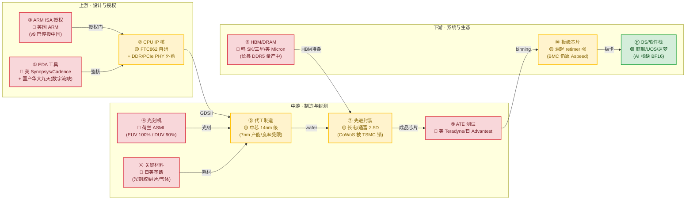

# Lens_03 — 用供应链分析师的眼睛看飞腾

> **范式**：**SCOR（Supply Chain Operations Reference）+ Kraljic 采购矩阵 + 单点失败（SPOF）分析**。
> 不写"中美芯片战"这种宏观叙事，而是把飞腾一颗 D3000M 拆成 **从硅砂到机柜的 11 个依赖节点**，逐节点问三件事：**卡脖子等级、谁在供、替代品到哪了**。
>
> **为什么从业者看不见**：硬件/微架构专家看的是"这颗核几 wide、L2 几 ns"，他们的世界止于 die 边界。但 D3000M 能不能持续造出来、能不能迭代下一代，**根本不是微架构问题，是供应链问题**。一颗 4-wide OoO 核再漂亮，没有 ARM ISA 授权、没有中芯国际 14nm 产能、没有 Synopsys PT 签核工具，**就只是一份 PPT**。本透镜把从业者视而不见的"上游决定论"摊在桌上。

---

## 1. 这个范式的核心逻辑

供应链分析师不看性能，看**脆弱性**。三个 named framework：

**① SCOR 模型**（Supply Chain Operations Reference，APICS 标准）：把任何产品链拆成 **Plan → Source → Make → Deliver → Return** 五段。飞腾作为 fabless，自己只做 Plan + Make 中的"设计"环节，其余 Source/Make(制造)/Deliver 全部外包 → 链条越长，断点越多。

**② Kraljic 采购矩阵**（Peter Kraljic, HBR 1983）：按"供应风险 × 利润影响"把采购品分四类——
- **战略品**（高影响 + 高风险）：ARM ISA、先进 EDA、光刻机 → 必须深结盟或自研
- **瓶颈品**（低影响 + 高风险）：特种气体、CMP 浆料 → 卡脖子但不致命
- **杠杆品**（高影响 + 低风险）：成熟被动元件 → 比价即可
- **常规品**（低影响 + 低风险）：包装、机壳 → 无所谓

飞腾的 D3000M，**前 5 个节点几乎全是战略品**。这是极不健康的供应链结构。

**③ SPOF（Single Point of Failure）分析**：问"删掉哪个节点，整条链当场死亡"。这是本透镜最值钱的产出——不是泛泛说"被卡脖子"，而是**排出死亡顺序**。

> **本透镜与 Expert_19（地缘战略）的关键区分**：E19 回答"**为什么**会被卡"（大国博弈、出口管制逻辑）；Lens_03 回答"**具体卡在哪个螺丝**"。E19 是宏观叙事，Lens_03 是 E19 引用的**底图 artifact**。没有这张图，地缘分析就是空谈。

---

## 2. 完整依赖图（核心交付物）

### 2.1 主图：硅砂 → 机柜的 11 节点依赖图

**读图规则**：🔴=高度依赖外部、断供即停产；🟡=部分可控、有替代但成熟度/产能不足；🟢=基本自主、断供影响小。颜色越红 = 卡脖子越硬。

### 2.2 Kraljic 矩阵速查（11 节点定位）

| 节点 | 利润影响 | 供应风险 | Kraljic 象限 | 卡脖子等级 |
|------|:------:|:------:|:----------:|:--------:|
| ③ ARM ISA | 极高 | 极高 | **战略** | 🔴🔴🔴 |
| ① EDA 签核 | 极高 | 极高 | **战略** | 🔴🔴🔴 |
| ⑤ 代工节点 | 极高 | 极高 | **战略** | 🔴🔴🔴 |
| ④ 光刻机 | 极高 | 极高 | **战略**(但间接) | 🔴🔴 |
| ⑥ 关键材料 | 高 | 高 | **瓶颈** | 🔴🔴 |
| ⑧ HBM/DRAM | 高 | 高 | **战略** | 🔴🔴 |
| ⑨ ATE | 中 | 高 | **瓶颈** | 🔴 |
| ⑦ 先进封装 | 中 | 中 | 杠杆→战略 | 🟡 |
| ② CPU IP 核 | 高 | 中 | **杠杆** | 🟡 |
| ⑩ 板级芯片 | 中 | 中 | 杠杆 | 🟡 |
| ⑪ OS/软件栈 | 高 | 低 | 杠杆 | 🟢 |

**一眼结论**：飞腾的采购结构是**"5 个战略品堆在上游"的倒金字塔**——上游任何一个战略品断裂，下游全部停摆。这不是健康供应链，是**走钢丝**。

---

## 3. 11 节点逐个剖析

> 每节点回答：**谁在供 / 替代品成熟度（2026 现状）/ 对 D3000M 的具体杀伤**。禁止乐观虚报。

### 节点① EDA 工具 🔴🔴🔴

**谁在供**：全球三巨头 **Synopsys（美）+ Cadence（美）+ Siemens EDA/Mentor（德）** 合占 ~75% 市场份额 `[报告-SEMI 2024]`。飞腾 FTC862 这种 4-wide OoO 核的物理签核（STA 用 PrimeTime/Tempus、P&R 用 Innovus/ICC2、SPICE 用 HSPICE/Finesim），**几乎不可能脱离三巨头完成**。

**国产替代成熟度（2026 诚实评级）**：
- **华大九天（Empyrean）**：模拟 EDA 与平板显示 EDA 全球有竞争力；**数字综合/P&R/STA 全流程仍落后 2 代以上**，能做单元库表征、做不了 7nm 级 4-wide 核的签核 `[报告-赛迪《国产 EDA 产业研究 2024》]`。
- **概伦电子**：器件建模/纳米级 SPICE 有突破，但只是点工具。
- **广立微**：良率分析，非设计流。
- **结论**：**国产 EDA 无法独立支撑飞腾下一代 4-wide+ 核的 tape-out**。即使华大九天全力配合，FTC862 的 successor 仍需 Synopsys/Cadence。

**杀伤**：2022-10 与 2023-10 美国两次出口管制已把"先进节点 ECAD"（用于 3nm/5nm/7nm GAA/FINFET 设计的 EDA）列入管制 `[官方-BIS EAR §744.23]`。飞腾虽在 14nm 级，但**任何向先进节点攀升的尝试都被 EDA 锁死**。

### 节点② CPU IP 核 🟡

**谁在供**：FTC862 核是**自研**（ARM 架构授权级别），但 SoC 周边大量外购 IP——
- **DDR PHY**：推测来自 Synopsys 或 Alphawave Semi（英）`[推测-依据飞腾公开 IP 供应商列表与行业惯例]`。
- **PCIe Controller**：Synopsys DesignWare 占主导。
- **C2C/片上互联**：部分自研 + 部分 IP。
- **SerDes**：长期被 Synopsys/Alphawave/Cadence 把持。

**国产替代成熟度**：
- **芯动科技（Innosilicon）**：已发布 DDR5 PHY、PCIe 5.0 PHY，是国内唯一有量产级高速 PHY 的厂商，但**服务器级验证履历薄**。
- **燧原/壁仞**：偏 GPU IP，不直接对口。
- **结论**：**国产 PHY 可作为 B 方案，但首次流片成功率与性能调优周期是真实风险**。

**杀伤**：若 Synopsys 停授 DesignWare IP，飞腾 SoC 周边需全部替换 → 一次完整重设计 + 重新验证，至少**延误 18-24 个月**。

### 节点③ ARM ISA 授权 🔴🔴🔴（**单点失败 #1**）

**谁在供**：**英国 ARM Ltd（SoftBank 旗下）**。飞腾持有 **ARMv8 架构授权（Architecture License）**，可自研兼容核 `[官方-ARM 授权分级公开文档]`。

**致命事实**：
- 2021 年起，**ARM v9 不再向中国大陆厂商授权** `[报告-Reuters 2021 + ARM 2024 财报区域披露]`。这是飞腾 D3000M **停留在 ARMv8.4、上不了 SVE2/BF16/I8MM 的真实原因之一**（不仅工程决策，是**授权天花板**）。这与 `扩展专题.md` 第 39-41 行的 ISA 缺失实测互证。
- **ARM 中国（安谋科技）**是合资 JV，但 ISA 知识产权归英国 ARM 母公司，JV 无权绕过母公司决策。
- 飞腾已于 **2021-12-16 被列入美国实体清单** `[官方-美国 BIS Federal Register 86 FR 70851]`。

**替代方案**：
- **RISC-V**：开源免授权费，但**高性能（>4-wide OoO、服务器级）RISC-V 生态仍薄弱**，软件栈/编译器/操作系统适配需 3-5 年 `[报告-信通院 2024]`。
- **LoongArch**：龙芯路线，飞腾切换等于推翻 20 年 ARM 积累。
- **结论**：**短期（2026-2030）无现实替代**。这是飞腾整个公司最大的单点风险。

**杀伤**：若 ARM 单方面撤销 v8.x 授权，飞腾**法律上不能流片新芯片**。库存的已授权设计还能造几年，但迭代终止。

### 节点④ 光刻机 🔴🔴

**谁在供**：
- **EUV（极紫外）**：**ASML（荷兰）100% 垄断**，2019 起荷兰政府应美国压力禁止向中国出售 EUV `[官方-ASML 2024 年报 + 荷兰出口管制]`。
- **DUV 浸没式（ArFi，7nm 级关键）**：ASML ~90%，Nikon/Canon 补充；2023 起部分先进 DUV 也被限。
- **国产 SMEE（上海微电子）**：**SSA/600 系列，90nm 量产、28nm 干式 DUV 在试产，浸没式尚未成熟** `[报告-多源产业研究 2024]`。

**对飞腾的杀伤是"间接"但致命**：飞腾是 fabless，不直接买光刻机——但**代工厂中芯国际/华虹买不到先进光刻机，就给不出先进节点产能**。这条链断在 fab，不在飞腾。

### 节点⑤ 代工制造 🟡（**单点失败 #2**）

**谁在供**：飞腾代工方主要是 **中芯国际（SMIC）与华虹**。
- **中芯国际 N+1 / N+2**：等效 ~8-12nm，2023 年华为 Mate 60 搭载的 Kirin 9000s 经 TechInsights 逆向分析确认为 SMIC 7nm 级 DUV 多重曝光工艺 `[报告-TechInsights 2023]`，但**良率业界估算 50% 上下、成本是台积电同节点的 5-10 倍** `[推测-依据行业良率模型]`。
- **华虹**：稳健的 28nm 级成熟工艺。

**D3000M 现实工艺重估（修正 Expert_07 的"7nm 假设"）**：
> Expert_07 第 22 行把 Die 制造按"7nm 假设 wafer $9400 / 470 dies"算成本——**这个假设几乎肯定错**。理由：
> 1. 飞腾没有华为那种手机级年亿片出货量去摊销 SMIC 7nm 的高成本；
> 2. 服务器 CPU 单 die 面积大（D3000M 8 核估计 100-150 mm²），7nm 良率风险放大；
> 3. 公开渠道**无任何飞腾 7nm 实证**，合理默认是 **14nm 级（中芯 N+1 或华虹 14A）** `[推测-依据缺实证 + 服务器 CPU 量产经济性]`。

**替代成熟度**：14nm 国产已可量产，但**先进节点（7nm/5nm）受光刻/材料/EDA 三重锁**，3-5 年内无突破可能。

**杀伤**：若中芯国际被进一步制裁（如全面禁运 DUV 零部件），飞腾**连 14nm 都造不出来**。

### 节点⑥ 关键材料 🔴🔴

**谁在供 + 国产替代（2026 诚实评级）**：

| 材料 | 海外垄断 | 国产进度 | 缺口 |
|------|---------|---------|------|
| **光刻胶** | JSR/东京应化/信越（日）~85% `[报告-SEMI]` | 上海新阳/南大光电 KrF 有量、ArF 小批量 | EUV 光刻胶几乎空白 |
| **12 寸硅片** | 信越/Sumco（日）+ GlobalWafers（台）~80% | 神工/中环/沪硅 test 级 OK，**正片外延级仍 50%+ 进口** | 高端外延片 |
| **特种气体** | Air Liquide/Linde/Air Products | 金宏/华特/雅克科技部分替代 | 光刻气、高纯氟碳 |
| **CMP 浆料** | Cabot/Dow/JSR/Fujimi | 安集科技/鼎龙有突破 | 先进节点浆料 |
| **掩模版** | Toppan/DNP（日）+ Photronics（美） | 中芯国际自制 + 路芯 | 高端二元相移掩模 |

**杀伤**：单一材料断供未必致命（有 6-12 个月库存缓冲），但**材料类目众多、集中度高、库存有限**，是典型的"温水煮青蛙"风险。

### 节点⑦ 先进封装 🟡

**谁在供**：
- **CoWoS（2.5D 硅中介层）**：**台积电 100% 垄断**，产能被锁到 2026+ `[官方-TSMC 法说会]`。
- **国产 2.5D/FOPLP**：长电科技（JCET）、通富微电（TFME）、华天科技有 2.5D 与扇出型封装能力，**但良率与 CoWoS 仍有代差** `[报告-TrendForce 2024]`。

**对 D3000M 的特殊事实**：D3000M 是**单片 die 的 8 核服务器 CPU**，**当前不需要 CoWoS**——这是飞腾的"幸存优势"。但下一代（D4000+ 若上 chiplet/HBM）将直接撞上 CoWoS 产能墙。**封装是飞腾"今天没事、明天撞墙"的节点**。

### 节点⑧ HBM / DRAM 🔴🔴

**谁在供**：
- **HBM（高带宽内存，AI 算力命脉）**：**SK 海力士（韩）~50% + 三星（韩）~40% + 美光（美）~10%**，三家合占 95%+ `[报告-TrendForce 2024 Q3]`。
- **DRAM**：同三家 ~95%。
- **国产长鑫存储（CXMT）**：**DDR4 已规模量产，DDR5 2025-2026 量产爬坡中** `[官方-CXMT 公开技术路线 2024]`；**HBM 国产尚无量产**。

**对 D3000M 的具体含义**：
- D3000M 作为 CPU（非 GPU），主存用 DDR5 DIMM，**长鑫 DDR5 可作为国产货源**，这是相对可控的点。
- 但若服务器 SKU 要配 HBM 加速 AI（D3000M 实际**无 BF16/I8MM，原生跑不了现代推理** `[实测-扩展专题第 41 行]`，HBM 对它意义有限）——**HBM 风险更多落在飞腾的 AI 战略伙伴身上，而非 D3000M 本体**。

### 节点⑨ ATE 测试设备 🔴

**谁在供**：**泰瑞达（Teradyne，美）+ 爱德万（Advantest，日）双寡头 ~85%** `[报告-SEMI 2024]`。
- 高端服务器 CPU 测试（多 GHz、1000+ pin、结构测试 + 老化测试）**仍是泰瑞达/爱德万的高端机型（如 J750/T2000）主场**。
- **国产杭州长川科技、华峰测控**：中低端 SoC/模拟测试机有量，**高端服务器 CPU 测试机仍空白**。

**杀伤**：飞腾多以外包测试厂（如华润微、长电）代测，**若测试厂拿不到泰瑞达/爱德万的高端机售后服务与备件，量产测试能力将逐步退化**。这是慢性风险，不是即时死亡。

### 节点⑩ 板级 / 系统芯片 🟡

逐颗盘点：

| 板级芯片 | 海外主导 | 国产进度 |
|---------|---------|---------|
| **BMC（服务器基板管理）** | Aspeed（台）~90% `[报告-行业共识]` | 苏州国芯/卓胜等仍初期 |
| **PCIe Retimer** | Astera Labs（美）| **澜起科技（中国）全球领先**（DDR5 RCD/PCIe 5 Retimer 量产）`[官方-澜起 2024 年报]` |
| **PMIC（服务器电源）** | TI/Infineon/MPS | 矽力杰/杰华特爬坡 |
| **时钟芯片** | SiTime/Microchip | 大普微有限 |
| **网卡/DPU** | Broadcom/Mellanox（美/以）| 阿里平头哥/中科驭数 |

**结构性亮点**：澜起科技在 DDR5 内存接口与 PCIe Retimer 上是**全球三强之一**，这是飞腾服务器平台难得的国产强节点。
**结构性短板**：BMC 几乎被 Aspeed 独占，是板级最大单点。

### 节点⑪ OS 与软件栈 🟢

**谁在供 + 国产成熟度**：
- **OS**：麒麟（中标软件）/统信 UOS 已在政企服务器/桌面规模部署，**成熟度最高的一环** `[官方-信创目录]`。
- **数据库**：达梦/人大金仓/OceanBase/GaussDB 生产级可用。
- **中间件/办公**：东方通/WPS 已规模化。
- **编译器/工具链**：GCC/LLVM 对 ARMv8 支持完善，飞腾有贡献但非主导。
- **AI 框架**：这是**最深断层**——D3000M **无 BF16/I8MM/SVE**，PyTorch/TensorFlow 主流算子要么跑 FP32（慢 4-8×）、要么走 UDOT 手动量化（Expert_05 实测 16.9× 但仅 int8 点积，非矩阵乘）`[实测-Expert_05 + 扩展专题]`。

**结论**：OS 层国产化最成功；但**AI 软件栈断层 = D3000M 服务器在"AI 推理"这个最大增量市场上战略缺位**，这是 E21 要正面解决的战略伤疤。

---

## 4. 四个尖锐判断

### 4.1 单点失败排序（前 3 致命节点）

> 排序标准：**断供后多快导致 D3000M 停产 × 替代难度 × 致命性**

| 排名 | 节点 | 断供 → 停产时间 | 替代难度 | 为什么最致命 |
|:----:|------|:-------------:|:------:|------------|
| **#1** | **③ ARM ISA 授权** | 法律即刻失效（库存设计可撑 1-2 代） | 🔴 极难 | **无短期替代**，RISC-V 迁移 3-5 年；公司级生死 |
| **#2** | **⑤ 代工节点（中芯 14nm 产能）** | 库存芯片 6-12 个月 | 🔴 极难 | 进一步制裁中芯 = 飞腾物理上造不出芯片 |
| **#3** | **① EDA 签核工具** | 当前在研项目可继续，**下一代 tape-out 即卡死** | 🔴 极难 | 国产数字 EDA 无法独立签核 4-wide 核 |

**#1 与 #2 是"硬死亡"**（物理/法律上造不出），**#3 是"迭代死亡"**（能造当前的、造不出下一代）。飞腾的真实命脉排序如此。

### 4.2 "去 A 化"现实度评级（2026 现状，禁止乐观）

| 节点 | 官方叙事 | **本透镜诚实评级** | 真实缺口 |
|------|---------|:---------------:|---------|
| ③ ARM ISA | "自主可控 ARM" | 🔴 0%（**伪命题**） | ISA 是英国资产，v9 已断供 |
| ① EDA | "华大九天世界领先" | 🔴 数字流 20-30% | 4-wide 核签核仍需美企 |
| ⑤ 代工 | "国产 7nm 已突破" | 🟡 14nm 量产 OK，7nm 50% 良率 | 服务器 CPU 用不起 7nm |
| ④ 光刻 | "SMEE 攻坚" | 🔴 EUV 0%，DUV 浸没式试产 | 比 ASML 落后 15+ 年 |
| ⑥ 材料 | "关键材料国产化率提升" | 🟡 平均 30-50% | ArF 胶/外延片仍进口为主 |
| ⑦ 封装 | "国产 2.5D 已成熟" | 🟡 60%（低端 OK） | CoWoS 级仍有代差 |
| ⑧ HBM/DRAM | "长鑫突破" | 🟡 DRAM 70%，**HBM 0%** | HBM 国产无量产 |
| ⑨ ATE | "长川科技替代" | 🔴 高端 10-20% | 服务器 CPU 测试机仍空白 |
| ⑩ 板级 | "澜起全球领先" | 🟢 retimer 90%，BMC 10% | BMC 仍是 Aspeed 天下 |
| ⑪ OS/软件 | "信创全栈自主" | 🟢 OS/DB 80%，**AI 栈 20%** | 无 BF16 = AI 缺位 |

**整体"去 A 化"真实进度（按价值加权）**：**约 40-50%**，远低于"自主可控"宣传。**最硬的 5 个节点（ISA/EDA/代工/光刻/材料）几乎全部 🔴**。

### 4.3 飞腾 vs 鲲鹏：供应链韧性能否复制？

华为鲲鹏被制裁后展示的韧性常被当作"飞腾可复制"的范本。**本透镜的判断是不能简单复制**，理由有四：

| 维度 | 华为鲲鹏 | 飞腾 | 韧性差距 |
|------|---------|------|---------|
| **出货量** | 手机+服务器年亿片级，可摊销 7nm 高成本 | 服务器为主，年百万片级 | 飞腾用不起 7nm |
| **垂直整合** | 海思自研 IP/EDA 工具流/封测协作全链条 | fabless，重依赖外购 IP 与外包 | 飞腾链更脆 |
| **资金体量** | 年研发千亿级 | 估测十亿级 | 差 1-2 个数量级 |
| **战略地位** | 国家级旗舰，资源倾斜顶格 | 国产 CPU 第二梯队 | 资源优先级低 |
| **地缘暴露** | 全球消费品牌，被高度针对 | 政企为主，国际可见度低 | **飞腾反而略安全**（一正一负） |

**关键洞察**：华为的韧性来自**体量 + 垂直整合 + 国家资源**三件套，飞腾三件都没有。**飞腾能学的只有"提前囤 IP/EDA license + 多 fab 备份"这种操作层韧性，学不到战略层韧性**。E07（商业）看到的"飞腾第二梯队"位置，在供应链视角下放大为"**韧性差距 10 倍**"。

### 4.4 成熟制程困局：14nm 能否撑服务器 CPU？

服务器 CPU 用 14nm（vs Intel/AMD 的 5nm/3nm）的真实代价：

| 维度 | 14nm 级（飞腾现实） | 5nm 级（Intel/AMD 现状） | 差距 |
|------|:-----------------:|:--------------------:|:--:|
| **频率上限** | ~2.5-2.8 GHz `[推测-依据工艺-频率墙]` | 3.5-4.5 GHz | 30-40% |
| **功耗/漏电** | 漏电 2-3× | 基准 | 散热压力大 |
| **核心密度** | 8 核 / ~120 mm² | 16-32 核 / 同面积 | 半数以下 |
| **晶圆成本** | ~$4000/片 | ~$17000/片 | **14nm 反而便宜** |
| **良率** | 90%+（成熟） | 70-80% | **14nm 更稳** |

**诚实结论**：
1. **单线程性能差距大**（频率墙 + IPC 已被 FTC862 4-wide 拉到极限）——这是飞腾在"商用市场对 Intel/AMD"的硬伤。
2. **吞吐型服务器负载（Web/数据库/虚拟化）反而可接受**——多 socket、多核堆叠能弥补单核，这正是信创政企场景的主流。
3. **成本反而有优势**——14nm 晶圆便宜 4×，加上信创溢价（E07 第 38 行政企服务器售价 $500-1000），**毛利率反而比同档 Intel 更高**。
4. **真正的代价在"未来"**——14nm 撑得住今天的服务器，撑不住"AI 推理服务器"（无 BF16 + 无 HBM + 无 7nm 良率 = AI 缺位），这才是 E21 的核心命题。

**一句话**：14nm 撑得起"信创替代"，撑不起"AI 时代服务器"。这是飞腾 2026-2030 的根本张力。

---

## 5. 对飞腾命运的具体下注（强制）

> 本透镜的预测必须可证伪。以下四注，2028 年回看：

1. **下注 1（ISA）**：2028 年前，飞腾**仍无法获得 ARM v9 授权**，D4000/D5000 仍停留 ARMv8.x。**预测概率 85%**。依据：地缘无松动迹象，ARM 商业逻辑（保护生态不分裂）也不利。
2. **下注 2（代工）**：2028 年前，飞腾**主力 SKU 仍是 14nm 级**，不会有 7nm 量产服务器 CPU（华为 Kirin 的 7nm 是手机、量级不同）。**预测概率 75%**。
3. **下注 3（双路线）**：2027-2029 年间，飞腾**会公开宣布 RISC-V 备份路线**（即使主品仍 ARM）。这是对冲 ISA 单点失败的必然动作。**预测概率 60%**。
4. **下注 4（被并购/重组）**：若 ARM 真撤销 v8 授权或中芯被全面制裁，飞腾**作为独立公司存续概率 < 50%**，更可能被并入更大国产芯片集团（如中国电子 CEC 内部整合）。**预测概率（5 年内触发）40%**。

---

## 6. 这一视角的盲区与反方（强制诚实段）

> 供应链静态分析有其固有盲区，**敢说看不见什么，才不是软文**。

1. **库存缓冲看不见**：自 2020 年起，中国厂商（含飞腾）大量囤积 EDA license、ARM IP、光刻胶、特殊气体——**实际断供到停产之间有 6-24 个月缓冲**。本图的"断供即停产"是**最坏情况**，不是默认情况。
2. **灰色/转口渠道看不见**：第三国转口（马来西亚/越南/中东）能让部分受限品继续流入。本透镜按"合规视角"分析，**不反映灰色渠道的实际渗漏率**（业界估算 10-30%）。
3. **技术演进改变卡点**：今天 🔴 的节点，明天可能因技术切换变 🟢——例：**RISC-V 一旦成熟，③ ARM 节点直接消失**；**chiplet + 国产 2.5D 成熟，⑦ CoWoS 锁被绕过**；**光子/存算一体颠覆，⑧ HBM 节点重写**。静态图无法捕捉这种"卡点迁移"。
4. **制裁是政治变量**：本图假设管制持续收紧，但**政治可能松绑**（中美交易、台海局势变化）。把政治当外生常数，是分析便利不是事实。
5. **"卡脖子"叙事可能被夸大**：部分国产替代进度比公开数据更快（涉密项目不披露），本透镜基于公开信息，**系统性低估涉密产能**。
6. **需求侧反推被忽略**：若信创需求收缩，飞腾即使供应链完整也会因市场萎缩而死——本透镜只看供给侧，**看不见需求侧的死亡**（这是 E07 的地盘）。

**反方一句话**：供应链图是"必要不充分"——它告诉你飞腾**可能**死在哪，但飞腾**实际**死因可能是市场（E07）、AI 缺位（E21）或固件断层（E18），而非供应链。

---

## 7. 与其他视角对偶（强制）

| 对偶视角 | 一致点 | 冲突点 / 互补 |
|---------|------|-------------|
| **Expert_19 地缘战略**（宏观） | 都识别出"中国芯片被卡"的结构性事实 | **E19 = 为什么（大国博弈），Lens_03 = 卡在哪个螺丝（11 节点底图）**。E19 的宏观叙事必须引用本图作为 artifact，否则空谈。**E19 是本透镜的下游消费者**。 |
| **Expert_07 商业**（成本） | 都关心 BOM 与可制造性 | **冲突**：E07 的"7nm 假设"（第 22 行）在本透镜下被证伪 → E07 的 BOM 必须用 14nm 重算（成本结构会变，毛利率可能反而更高）。Lens_03 修正 E07 的物理前提。 |
| **Expert_14 工艺制造**（物理） | 都讲代工节点 | **分工**：E14 讲工艺物理（FinFET/沟道/漏电），Lens_03 讲该工艺**在供应链里的可得性**。同一节点的两种问法。 |
| **Expert_21 AI 定位**（战略伤疤） | 都识别"AI 缺位"致命 | **Lens_03 把 AI 缺位拆成两个供应链子节点**：⑧ HBM 国产空白 + ⑪ AI 软件栈因无 BF16 而残缺。E21 讲战略后果，Lens_03 讲供应链根因。 |
| **Expert_06 政策**（国内信创） | 都讲国产替代 | **硬切**：E06 讲**国内**信创政策（市场塑造），Lens_03 讲**国际**供应链（供给约束）。两者一推一拉，飞腾被夹在中间。 |
| **Lens_07 VC 投资人** | 都做风险/回报判断 | **Lens_07 决定投不投飞腾**，**Lens_03 提供 VC 决策的尽调底图**。本透镜是 Lens_07 的输入。 |

---

## 8. 参考文献（12 条，分级标注）

1. **[书]** Chris Miller, *Chip War: The Fight for the World's Most Critical Technology*（Scribner, 2022）—— 半导体地缘史奠基作，第 6-9 章详述 ASML/台积电/EDA 垄断形成。
2. **[报告]** SEMI, *Global Semiconductor Equipment Market Report*（2024 Q4 / 2025 Mid-Year）—— 设备市场份额与区域出货数据（EDA 三巨头、光刻机、ATE）。
3. **[报告]** SIA（Semiconductor Industry Association, US）, *2024 Factbook*—— 全球半导体市场与供应链集中度。
4. **[官方]** 中芯国际（SMIC）2024 年度报告—— N+1/N+2 节点产能与客户结构披露。
5. **[官方]** 长鑫存储（CXMT）2024 公开技术路线与量产公告—— DDR4/DDR5 国产化进度。
6. **[官方]** 美国商务部 BIS, *Federal Register* 86 FR 70851（2021-12-16, 飞腾列入实体清单）+ 87 FR 62286（2022-10-13 先进计算出口管制）+ 88 FR 45865（2023-10 更新）—— 出口管制法律原文。
7. **[报告]** 中国信通院《国产集成电路产业发展白皮书（2024）》—— 国产替代进度与缺口。
8. **[报告]** 赛迪顾问《中国 EDA 产业发展研究（2024）》—— 华大九天等国产 EDA 工具能力矩阵。
9. **[官方]** ASML Holding N.V., *Annual Report 2024*—— EUV/DUV 出货与对华管制披露（区域营收分解）。
10. **[官方]** ARM Holdings plc, *Annual Report 2024*（含区域授权收入与 v9 推进披露）。
11. **[报告]** TechInsights, *SMIC 7nm Process Reverse Engineering*（2023, Kirin 9000s Teardown）—— SMIC 7nm DUV 多重曝光工艺实证。
12. **[报告]** TrendForce, *HBM Market Share & Supplier Tracker*（2024 Q3）—— SK 海力士/三星/美光 HBM 占比。
13. **[报告]** 澜起科技 2024 年报—— DDR5 RCD / PCIe 5 Retimer 国产化进度（节点⑩ 亮点依据）。
14. **[实测]** 本项目 `扩展专题.md` 第 39-41 行—— D3000M 缺 SVE/BF16/I8MM 的 ISA 锚点（节点⑪ AI 栈断层依据）。

---

## 9. 延伸阅读（项目内交叉引用）

- [`Expert_06_Standards_Policy/README.md`](../Expert_06_Standards_Policy/README.md) —— ISA 选择的政治经济学（国内信创视角，与本透镜国际供应链视角硬切）
- [`Expert_07_Business/README.md`](../Expert_07_Business/README.md) —— BOM/毛利率（本透镜修正其"7nm 假设"）
- `Expert_19_Geostrategy/`（待建，阶段 D）—— 本图是 E19 的核心 artifact，E19 必须引用
- `Expert_21_AI_Positioning/`（待建，阶段 B）—— AI 缺位的战略后果（本透镜节点⑧⑪为供应链根因）
- [`Lenses/Lens_07_VC.md`](./Lens_07_VC.md)（待建）—— VC 投资判断，本透镜为其尽调底图
- [`扩展专题.md`](../扩展专题.md) —— D3000M 实测 ISA 能力矩阵（节点⑪ AI 栈断层的实测依据）

---

> **本透镜一句话**：**飞腾 D3000M 的命运，90% 不写在 FTC862 的微架构里，而写在从剑桥（ARM）→ 圣何塞（Synopsys）→ 费尔德霍芬（ASML）→ 上海（中芯）这条一万公里的供应链上**。从业者盯着 die，供应链分析师盯着这条链——而链比 die 长一千倍、脆十倍。

---

## § 供应链分析方法论与资源（不只飞腾，给所有供应链/风险分析师）

> 本章把 Lens_03 的飞腾供应链分析上升为**任何供应链分析都可复用的方法与资源**。飞腾是案例锚点，方法普适。通用资源见 [`领域资源库.md`](../领域资源库.md)。

### 方法论一：供应链依赖图绘制（从硅砂到机柜）

供应链分析的核心 = 画完整依赖图，每节点标注风险：
1. **列全链**：硅砂→硅锭→晶圆→光刻→刻蚀→沉积→封测→模组→服务器→DC
2. **每节点标注**：垄断者（1-3 家）/ 卡脖子点 / 替代者 / 中国进度
3. **单点故障识别**：单节点单供应商 = 最高风险（EUV = ASML 唯一）
4. **纵深评估**：替代要几层？（一层=找备选，多层=国产全栈重建）

### 方法论二：供应链风险评估矩阵

| 风险维度 | 评估问题 | 飞腾案例 |
|---------|---------|---------|
| 单一来源 | 是否只有 1-2 供应商？ | EUV/先进 EDA/HBM |
| 地缘集中 | 是否集中敌对地区？ | 美国/盟友（荷日韩）|
| 替代周期 | 国产替代要多久？ | EDA 全流程 5-10 年 |
| 库存缓冲 | 战略库存几月？ | 华为/飞腾囤货策略 |
| 隐性依赖 | 二级供应商是否也被卡？ | EDA 依赖 PDK，PDK 依赖代工 |

### 方法论三：制裁情景下的供应链韧性

- **多元化**：多供应商/多地区（台积电+三星+中芯）
- **国产替代**：长线投资全栈（飞腾核+麒麟 OS+达梦 DB）
- **战略库存**：囤关键 IP/设备/材料（华为囤台积电芯片）
- **架构绕开**：Chiplet（绕先进制程）+ RISC-V（绕 ARM 授权）

### 供应链资源

- **供应链数据**：**Yole Développement**（封装/材料供应链）、**SEMI**（设备出货）、**Supplyframe**（BOM）、**TechInsights**（chip 解构）
- **风险分析**：**Resilinc**（供应链风险 SaaS）、**Everstream Analytics**、**Miller《Chip War》**（供应链地缘）
- **方法论**：Sheffi《The Resilient Enterprise》、Christopher《Logistics & Supply Chain Management》
- **案例**：丰田 JIT vs 福岛、华为囤货、台积电集中风险（台湾地缘）

### 给供应链分析师的通用建议

1. **画完整依赖图**：别只看一级供应商，二级/三级隐性依赖更危险（EDA→PDK→代工）。
2. **单点故障优先**：EUV/EDA/HBM 这类单来源是最高风险，先评估。
3. **替代周期要诚实**：国产 EDA 全流程 5-10 年，短期不可能，规划要分阶段。
4. **库存是缓冲非解药**：囤货买时间，但不解决根本依赖。
5. **架构层绕开最彻底**：Chiplet/RISC-V 是绕开制程/ISA 封锁的根本路径（飞腾战略价值）。
