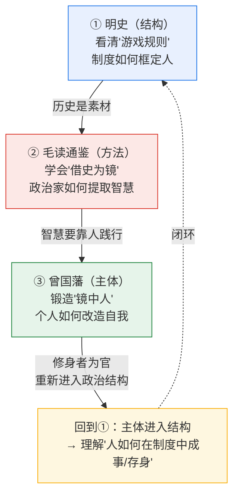

# 历史纵深三专题导航：制度 → 读史 → 修身

> 一张图、一条线，把项目里三个"历史纵深"专题串成一条**完整认知链**：从看清"游戏规则"，到学会"借史为镜"，再到锻造"镜中人"。

---

## 一、三个专题是什么

本项目在 04（中国政治）与 05（为官为人）模块下，建了三个互相呼应的历史纵深专题：

| 专题 | 位置 | 核心问题 | 政治学维度 |
|------|------|---------|-----------|
| **① 明史政治学** | [`04-chinese-politics/ming-dynasty/`](../04-chinese-politics/ming-dynasty/00-README.md) | 一座帝国如何被设计、僵化、崩溃？制度如何框定人？ | **结构**（宏观·历史制度主义） |
| **② 毛泽东读《通鉴》** | [`04-chinese-politics/zizhi-tongjian/`](../04-chinese-politics/zizhi-tongjian/00-README.md) | 一个政治家如何从历史中提取治国智慧？借史为镜的机制与边界？ | **方法**（中观·政治家的读史术） |
| **③ 曾国藩** | [`05-statesmanship-ethics/zeng-guofan/`](../05-statesmanship-ethics/zeng-guofan/00-README.md) | 一个普通人如何改造自我以成事？修身、用人、持盈的真功夫？ | **主体**（微观·为官为人/修身） |

---

> **📌 主体层（修身）有两路**：曾国藩代表**理学**（渐修·拙恒），另有 [王阳明心学专题](../05-statesmanship-ethics/wang-yangming/00-README.md) 代表**心学**（顿悟·知行合一）——两者构成"修身两路"完整对照（详见[王阳明专题 05 篇](../05-statesmanship-ethics/wang-yangming/05-批判反思与当代意义.md)）。另见 [`张居正与曾国藩对比.md`](张居正与曾国藩对比.md)（功成身退：同结构下两种命运）。
>
> **📌 读史维度的古今双视角**：②毛读通鉴（今人/政治家读）另有 [《读通鉴论》专题](../04-chinese-politics/du-tongjian-lun/00-README.md)（王夫之，古人/哲学家读《通鉴》）——前者求治国之"用"，后者求历史之"理"。**四个专题用的方法，已系统提炼为 [06 历史政治学方法论专题](../06-methodology/historical-method/00-README.md)**（史料批判/制度主义/比较分析/认识论陷阱）。

## 二、一条认知链：结构 → 方法 → 主体

三者不是并列的"三本书"，而是一条**递进的认知链**——每一个是下一个的前提：



**三个判断**：
1. **少了①（结构）**，你会陷在"个人奋斗"的迷思里——看不见制度才是最大的变量。读曾国藩不懂明代党争，就不知他"持盈"为何如此谨慎。
2. **少了②（方法）**，你空有历史素材却不会用——历史不会自动变成智慧，要像毛泽东那样"批判地读"。
3. **少了③（主体）**，理论与方法都落空——再好的制度分析、再妙的读史术，最终要靠"一个修养到家的人"去践行。

> **一句话**：**①给你眼镜（看结构），②给你方法（用历史），③给你自己（能成事）。三者合一，才是完整的政治学训练。**

---

## 三、三专题的相互呼应（交叉印证）

三个专题在具体观点上反复**互相印证、互相修正**，读时对照，收获倍增：

### 呼应一·"功成身退"的学问（曾国藩 vs 张居正）
- [明史专题](../04-chinese-politics/ming-dynasty/02-明代政治制度剖析.md)：**张居正**权倾朝野不知退，死后被清算、家破人亡（"势过盛招祸"）。
- [曾国藩日记](../05-statesmanship-ethics/zeng-guofan/06-日记精读.md)：攻克天京、功勋极盛时，曾国藩**主动请辞兵权、自裁湘军**以息疑谤。
- **对照结论**：在"绝对皇权无制衡"的结构里（①），**"知退"是功臣保身的唯一法则**（③）。张居正不懂，曾国藩懂——这是同一种制度下两种命运的钥匙。

### 呼应二·"治国即治吏"（毛读通鉴 vs 曾国藩用人）
- [毛读通鉴](../04-chinese-politics/zizhi-tongjian/02-毛泽东对通鉴的总体评论详解.md)：毛引雍正"**治国就是治吏**"，强调驾驭官僚是治国核心。
- [曾国藩用人](../05-statesmanship-ethics/zeng-guofan/04-识人用人.md)：曾国藩"**广收慎用勤教严绳**"八字诀，是"治吏"的方法论细化。
- **对照结论**：毛在"治"的层面（约束官僚），曾在"用"的层面（培养人才）——**一个是控制，一个是赋能，合起来才是完整的干部管理**。

### 呼应三·"借史为镜"的两种姿态（毛 vs 曾）
- 毛读《通鉴》：**为现实斗争服务**，洞察极深但易"六经注我"（[通鉴04篇](../04-chinese-politics/zizhi-tongjian/04-读史方法论与批判反思.md)三大陷阱）。
- 曾读史（日记里每日温史）：**为修身问学**，把读史化作日课，"经济不外看史"（唐鉴语）。
- **对照结论**：同样读史，**毛读出"权谋与战略"，曾读出"敬畏与自律"**。两种姿态各有其用，也各有其险——读史者既要有毛的锐利，也要有曾的谦卑。

### 呼应四·"被读者—读者"的传承链
- 曾国藩是毛泽东青年时"**愚于近人，独服曾文正**"的对象（[曾国藩01篇](../05-statesmanship-ethics/zeng-guofan/01-其人其事与三不朽.md)）。
- 理解曾国藩（③），是理解毛泽东精神源头（②）的钥匙。
- **三个专题由此构成一条真实的思想传承链**：曾国藩（被学者）→ 毛泽东（学者）→ 你（再学者）。

---

## 四、推荐阅读路径

### 路径 A·按"认知链"顺序（推荐）
```
① 明史（结构）→ ② 毛读通鉴（方法）→ ③ 曾国藩（主体）
先看游戏规则，再学读史术，最后回到自身。
```
适合：想系统建立"结构—方法—主体"完整框架的人。

### 路径 B·按"由人入史"（感性优先）
```
③ 曾国藩（先被一个具体的人打动）→ ② 毛读通鉴（看他如何被曾国藩影响）→ ① 明史（再回到制度深处）
```
适合：喜欢从人物故事入手的读者。

### 路径 C·主题对照（研究取向）
选一个主题（如"功成身退""治吏""读史"），在三个专题间跳读，看同一问题在不同层面的呈现（见上文"呼应"四条）。
适合：做专题研究、写论文的人。

---

## 五、三专题的方法论共性

尽管层次不同，三个专题共享同一套**方法论纪律**（这也是本项目一以贯之的精神）：

1. **一手史料优先**：明史用《明实录》《明史》《明夷待访录》；毛读通鉴用《批语集》《文集》；曾国藩用《家书》《日记》原文（含《冰鉴》托名辨伪）。
2. **批判性反思**：每个专题都设专门的"批判/辨伪/陷阱"篇——明史讲"四个陷阱"，通鉴讲"三大陷阱+三重局限"，曾国藩讲"《冰鉴》辨伪+争议"。
3. **警惕简单化**：不神化（曾国藩非完人）、不妖魔化（毛读史非全是权谋）、不决定论（明亡非必然）。
4. **古今打通**：每个专题都把历史提升到政治学理论（制度锁定/国家能力/合法性/委托代理），再落回当代启示。

> **这三个专题，本质上是同一个训练——"如何批判地、立体地、为己地读懂中国政治传统"。** 走完这条链，你就拥有了一副看中国政治与历史的"三焦镜头"。

---

## 六、速查：三专题文件总览

<details>
<summary>展开三个专题的全部文件清单</summary>

**① 明史政治学**（`04-chinese-politics/ming-dynasty/`）
- [00-README](../04-chinese-politics/ming-dynasty/00-README.md) · [01-政治史脉络](../04-chinese-politics/ming-dynasty/01-明代政治史脉络.md) · [02-制度剖析](../04-chinese-politics/ming-dynasty/02-明代政治制度剖析.md) · [03-政治学专题](../04-chinese-politics/ming-dynasty/03-明代政治学专题.md) · [04-史学史方法论](../04-chinese-politics/ming-dynasty/04-明史史学史与方法论.md)

**② 毛泽东读《通鉴》**（`04-chinese-politics/zizhi-tongjian/`）
- [00-README](../04-chinese-politics/zizhi-tongjian/00-README.md) · [01-史实与材料](../04-chinese-politics/zizhi-tongjian/01-毛泽东读通鉴的史实与材料.md) · [02-总体评论详解](../04-chinese-politics/zizhi-tongjian/02-毛泽东对通鉴的总体评论详解.md) · [03-历史人物批点](../04-chinese-politics/zizhi-tongjian/03-毛泽东批点通鉴中的历史人物.md) · [04-方法论与批判](../04-chinese-politics/zizhi-tongjian/04-读史方法论与批判反思.md)

**③ 曾国藩**（`05-statesmanship-ethics/zeng-guofan/`）
- [00-README](../05-statesmanship-ethics/zeng-guofan/00-README.md) · [01-其人其事与三不朽](../05-statesmanship-ethics/zeng-guofan/01-其人其事与三不朽.md) · [02-修身之道](../05-statesmanship-ethics/zeng-guofan/02-修身之道.md) · [03-家书的智慧](../05-statesmanship-ethics/zeng-guofan/03-家书的智慧.md) · [04-识人用人](../05-statesmanship-ethics/zeng-guofan/04-识人用人.md) · [05-冰鉴辨伪与批判](../05-statesmanship-ethics/zeng-guofan/05-冰鉴辨伪与批判反思.md) · [06-日记精读](../05-statesmanship-ethics/zeng-guofan/06-日记精读.md)

</details>

---

> **下一步**：选一条路径，开始走这条认知链。走完后，你会发现自己看中国政治、看历史、看自身的眼光，都多了一层"结构—方法—主体"的立体感。
