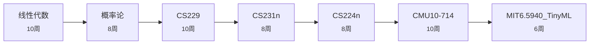

# AI/机器学习方向

> **目标**: 从数学基础到深度学习, 能读论文/做研究  
> **难度**: 数学密集  
> **预估**: 约 60 周 (15-20 个月)

| # | 课程 | 标题 | 为什么学 | 周数 |
|---|------|------|---------|------|
| 1 | `线性代数` | MIT 18.06 / CS70 | ML 的语言是矩阵和概率 | 10 |
| 2 | `概率论` | EECS126 / MIT18.330 | 统计推断与随机过程 | 8 |
| 3 | `CS229` | Stanford 机器学习 | 吴恩达经典, ML 数学根基 | 10 |
| 4 | `CS231n` | Stanford 深度学习与CV | CNN/反向传播/视觉 | 8 |
| 5 | `CS224n` | Stanford NLP 与深度学习 | 词向量/Transformer 鼎峰之路 | 8 |
| 6 | `CMU10-714` | CMU 深度学习系统 | 手写深度学习框架 | 10 |
| 7 | `MIT6.5940_TinyML` | MIT TinyML | 模型部署与端侧推理 | 6 |

## 学习路线图

## 课程资料位置

用统一检索查找: `python3 tools/ask.py "{track['steps'][0]['course']}" --no-llm`
