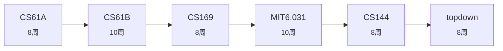

# 全栈/应用方向

> **目标**: 能独立设计并交付 Web 应用  
> **难度**: 工程导向  
> **预估**: 约 52 周 (13-17 个月)

| # | 课程 | 标题 | 为什么学 | 周数 |
|---|------|------|---------|------|
| 1 | `CS61A` | 伯克利 程序设计 (Python) | 抽象与编程思维地基 | 8 |
| 2 | `CS61B` | 伯克利 数据结构 (Java) | 经典数据结构与算法实现 | 10 |
| 3 | `CS169` | 伯克利 软件工程 | 敏捷/Rails/SaaS 全流程 | 8 |
| 4 | `MIT6.031` | MIT 软件构造 | 用类型与不变量写出可靠代码 | 10 |
| 5 | `CS144` | Stanford 计算机网络 | 手写 TCP, 理解协议栈 | 8 |
| 6 | `topdown` | 计算机网络 自顶向下 | 应用层视角补全 | 8 |

## 学习路线图

## 课程资料位置

用统一检索查找: `python3 tools/ask.py "{track['steps'][0]['course']}" --no-llm`
