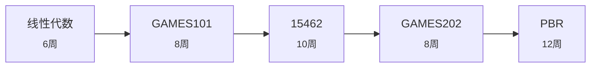

# 图形学方向

> **目标**: 光栅化/光线追踪/PBR 全栈  
> **难度**: 数学密集  
> **预估**: 约 44 周 (11-14 个月)

| # | 课程 | 标题 | 为什么学 | 周数 |
|---|------|------|---------|------|
| 1 | `线性代数` | 数学准备 | 变换与投影 | 6 |
| 2 | `GAMES101` | 闫令琪 图形学入门 | 光栅化与光线追踪, 国人神课 | 8 |
| 3 | `15462` | CMU 图形学 | 动画与物理仿真 | 10 |
| 4 | `GAMES202` | 实时高质量渲染 | PBR 与阴影 | 8 |
| 5 | `PBR` | Physically Based Rendering | 工业级离线渲染器 | 12 |

## 学习路线图

## 课程资料位置

用统一检索查找: `python3 tools/ask.py "{track['steps'][0]['course']}" --no-llm`
