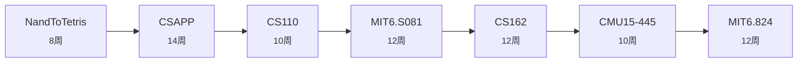

# 系统/底层方向

> **目标**: 深入理解计算机系统, 能写 OS/数据库/分布式系统  
> **难度**: 硬核  
> **预估**: 约 78 周 (19-26 个月)

| # | 课程 | 标题 | 为什么学 | 周数 |
|---|------|------|---------|------|
| 1 | `NandToTetris` | 从与非门到俄罗斯方块 | 自底向上理解计算机: 逻辑门→CPU→汇编→OS | 8 |
| 2 | `CSAPP` | 计算机系统基础 (CMU 15-213) | 系统圣经, 程序员视角的底层全貌 | 14 |
| 3 | `CS110` | 斯坦福系统基础 | CSAPP 进阶, 并发与系统编程 | 10 |
| 4 | `MIT6.S081` | MIT 操作系统 (xv6) | 亲手改 xv6 内核: 虚存/调度/文件系统 | 12 |
| 5 | `CS162` | 伯克利操作系统 | Pintos 项目, 另一视角的 OS 实现 | 12 |
| 6 | `CMU15-445` | CMU 数据库 (Bustub) | 手写存储引擎/查询执行 | 10 |
| 7 | `MIT6.824` | MIT 分布式系统 | Raft/分片/一致性, 工业界必修 | 12 |

## 学习路线图

## 课程资料位置

用统一检索查找: `python3 tools/ask.py "{track['steps'][0]['course']}" --no-llm`
