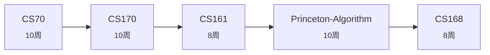

# 理论/算法方向

> **目标**: 扎实的算法与理论计算机科学功底  
> **难度**: 数学硬核  
> **预估**: 约 46 周 (11-15 个月)

| # | 课程 | 标题 | 为什么学 | 周数 |
|---|------|------|---------|------|
| 1 | `CS70` | 伯克利 离散数学与概率 | CS 理论的语言 | 10 |
| 2 | `CS170` | 伯克利 高效算法 | 算法设计与复杂度 | 10 |
| 3 | `CS161` | 伯克利 数据结构 | 工程化算法实现 | 8 |
| 4 | `Princeton-Algorithm` | 普林斯顿 算法 | Sedgewick 经典, Java 实现 | 10 |
| 5 | `CS168` | 伯克利 网络算法 | 互联网背后的算法 | 8 |

## 学习路线图

## 课程资料位置

用统一检索查找: `python3 tools/ask.py "{track['steps'][0]['course']}" --no-llm`
