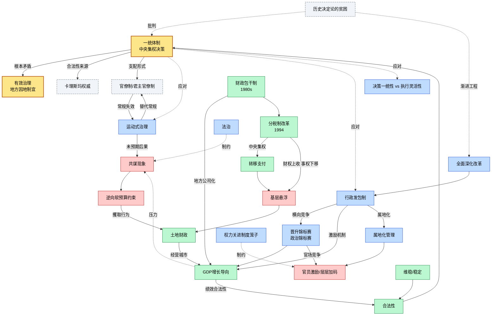
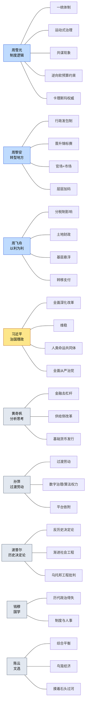
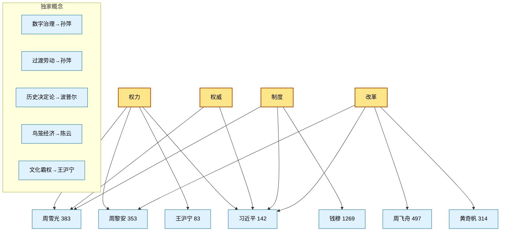
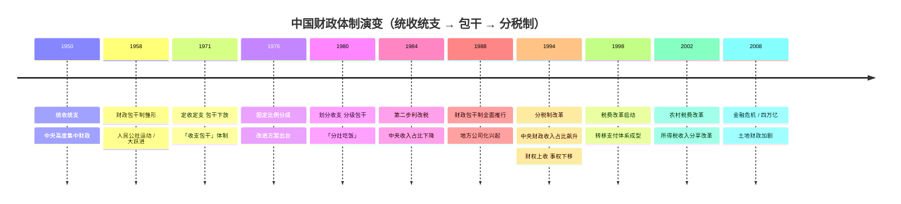
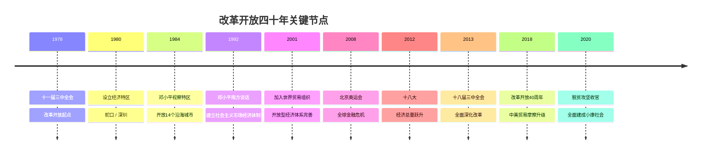
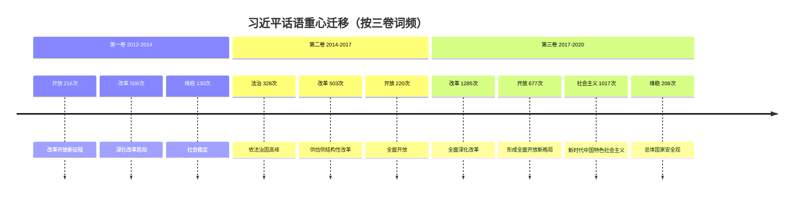
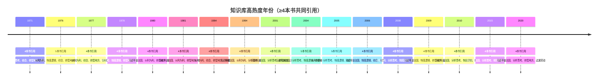

# 政治书籍知识库 · 可视化图谱

> 数据源：`knowledge_index.json`（15 本书 · 882,784 字 · 4407 条知识）+ `cross-book-analysis.md`（19 本书 · 7,012,284 字 · 44 概念频率）
> 生成方式：Python 脚本自动解析知识库 JSON 与跨书分析，输出 Mermaid 概念网络、时间线、频率柱状图与跨书矩阵。

---

## 一、概念网络图（Mermaid）

### 1.1 核心概念因果关系网络

从知识库中提取概念间的**因果 / 应对 / 演化**关系，构建治理逻辑网络。这一网络以周雪光的「一统体制 vs 有效治理」核心矛盾为根，辐射出周黎安的「行政发包 + 锦标赛」机制、周飞舟的财政演化链，以及习近平的话语体系。



**图例**：黄色=核心矛盾 · 蓝色=应对机制 · 红色=未预期后果 · 绿色=财政/经济链 · 紫色=习近平话语 · 灰虚线=哲学批判。

### 1.2 作者 × 核心概念映射

每位学者贡献的独特概念「标签」，显示知识库的**学术分工**。



> 三位「周」姓学者构成「中国治理实证研究」铁三角：周雪光做**制度逻辑**（为什么），周黎安做**激励机制**（怎么运转），周飞舟做**财政后果**（钱从哪来到哪去）。

### 1.3 跨书概念交集

用矩阵图显示不同书对**同一概念**的共同关注。下方是 Mermaid 式的概念归属拓扑：



**观察**：周雪光、周黎安、习近平三人共享「权力/权威/制度/改革」四概念——构成**治理研究的公共词汇表**；而孙萍（数字劳动）、波普尔（历史哲学）、陈云（计划经济）各守**不可替代的独家概念**。

---

## 二、数据时间线（Mermaid timeline）

> 时间线数据由脚本扫描知识库全部文本（concepts/propositions/data_points/cases）中的年份提及自动生成，括号内数字为该年在知识库中被不同书籍提及的次数。

### 2.1 中国财政体制演变时间线



**数据支撑**（来自知识库年份扫描）：
- **1958年**：被 3 本书提及 — ['以利为利', '转型地方', '钱穆国学']
- **1971年**：被 4 本书提及 — ['分析思考', '综合', '转型地方', '钱穆国学']
- **1976年**：被 5 本书提及 — ['以利为利', '制度逻辑', '综合', '转型地方', '钱穆国学']
- **1980年**：被 4 本书提及 — ['习近平谈治国', '以利为利', '转型地方', '钱穆国学']
- **1984年**：被 4 本书提及 — ['以利为利', '综合', '转型地方', '钱穆国学']
- **1994年**：被 4 本书提及 — ['习近平谈治国', '以利为利', '分析思考', '转型地方']
- **1998年**：被 3 本书提及 — ['以利为利', '分析思考', '转型地方']
- **2002年**：被 2 本书提及 — ['以利为利', '转型地方']
- **2008年**：被 4 本书提及 — ['以利为利', '分析思考', '制度逻辑', '转型地方']

### 2.2 改革开放关键节点



### 2.3 概念频率热度时间线（习近平三卷）

习近平《治国理政》一/二/三卷对应不同时期，其高频词反映了**话语重心迁移**：



**趋势**：「改革」从 508 → 503 → **1285**，第三卷激增 2.5 倍；「社会主义」第三卷爆发至 **1017** 次，标志着「新时代中国特色社会主义」话语体系的确立。

### 2.4 知识库年份提及热度（数据驱动）

扫描全部文本，统计每个年份被引用的书籍数（热度代理指标）。仅列出**被 ≥4 本书共同引用**的高热度年份：



---

## 三、概念频率柱状图（文本可视化）

### 3.1 跨书总出现频率 TOP 20

基于 `cross-book-analysis.md` 的 44 概念频率表（19 本书全文统计）：

```
概念出现频率（跨19本书 · 前20）
━━━━━━━━━━━━━━━━━━━━━━━━━━━━━━━━━━━━━━━━━━━━━━━━━━━━━━━━━━━━
制度           ██████████████████████████████  4668次  (14本)
改革           ████████████████████████████  4351次  (13本)
开放           ██████████████  2199次  (14本)
社会主义         █████████████  2047次  (12本)
数字治理         ████████  1228次  (10本)
权力           ███████  1098次  (14本)
维稳           ██████   896次  (14本)
法治           ████   674次  (7本)
权威           ████   666次  (13本)
行政发包         ████   641次  (2本)
官僚制          ████   621次  (2本)
腐败           ███   459次  (11本)
晋升锦标赛        ███   400次  (4本)
主权           ███   390次  (11本)
一统体制         ██   349次  (5本)
绩效合法性        ██   334次  (7本)
分税制          ██   278次  (5本)
共谋           ██   235次  (6本)
市场经济         ██   234次  (11本)
逆向软预算约束      █   227次  (3本)
```

> 注：「制度」4668 次居首（钱穆国学 + 周雪光制度逻辑贡献最多）；「改革」4351 次紧随其后（习近平三卷 2296 次为绝对主力）。

### 3.2 习近平《治国理政》三卷概念频率对比

```
概念       一卷                 二卷                 三卷                
------------------------------------------------------------------------
改革       ████████ 508       ████████ 503       ████████████████████ 1285
开放       ███ 216            ███ 220            ███████████ 677   
制度       ████ 252           █████ 298          █████████████ 815 
社会主义     (—)                (—)                ████████████████ 1017
维稳       ██ 130             ██ 100             ███ 208           
法治       (—)                █████ 328          (—)               
权力       █ 51               █ 45               █ 46              
权威       █ 18               █ 35               █ 86              
意识形态     (—)                (—)                █ 24              
```

**读图**：「改革」在三卷中一路攀升（508→503→**1285**），「社会主义」在第三卷井喷至 **1017**——「新时代中国特色社会主义」成为新时代的命名锚点。

### 3.3 「三周」核心概念频率对比

周雪光、周黎安、周飞舟各自的「领地」概念在本人的书中出现次数：

```
概念            周雪光               周黎安               周飞舟               
--------------------------------------------------------------------
一统体制          ██████ 299        —                 —                 
运动式治理         ███ 145           —                 —                 
共谋            █████ 218         —                 —                 
逆向软预算约束       ████ 191          —                 —                 
官僚制           ████████████ 578  —                 —                 
行政发包          —                 ████████████ 566  —                 
晋升锦标赛         —                 ███████ 326       —                 
绩效合法性         —                 █████ 234         —                 
分税制           —                 —                 ████ 196          
土地财政          —                 —                 ██ 118            
悬浮            —                 —                 █ 15              
```

> 三位学者的概念**互不重叠**——这正是学术分工清晰的标志：周雪光垄断「一统/运动/共谋/官僚制」，周黎安独占「发包/锦标赛/绩效合法性」，周飞舟专攻「分税制/土地财政/悬浮」。

---

## 四、跨书概念对照矩阵

### 4.1 概念 × 作者 覆盖矩阵

`✓✓✓`=主战场(>100次) · `✓✓`=重要(10-100次) · `✓`=提及(<10次) · `—`=未出现

| 概念 | 周雪光 | 周黎安 | 周飞舟 | 习近平 | 黄奇帆 | 孙萍 | 波普尔 | 钱穆 | 陈云 | 王沪宁 |
|------|------|------|------|------|------|------|------|------|------|------|
| 权力 | ✓✓✓ | ✓✓✓ | ✓✓ | ✓✓✓ | — | ✓✓ | — | — | — | ✓✓ |
| 权威 | ✓✓✓ | ✓✓ | ✓ | ✓✓✓ | — | — | ✓ | — | — | ✓✓ |
| 制度 | ✓✓✓ | ✓✓✓ | ✓✓✓ | ✓✓✓ | ✓✓✓ | — | — | ✓✓✓ | — | — |
| 改革 | ✓✓ | ✓✓✓ | ✓✓✓ | ✓✓✓ | ✓✓✓ | — | — | — | — | — |
| 开放 | ✓✓ | ✓✓✓ | — | ✓✓✓ | ✓✓✓ | — | — | — | — | ✓✓ |
| 社会主义 | ✓✓ | ✓✓ | ✓✓ | ✓✓✓ | — | — | — | — | — | ✓✓ |
| 维稳 | ✓✓✓ | ✓✓ | — | ✓✓✓ | ✓✓ | ✓✓ | — | — | — | ✓✓ |
| 法治 | ✓ | ✓✓ | — | ✓✓✓ | ✓✓ | — | — | ✓✓ | — | — |
| 一统体制 | ✓✓✓ | — | — | ✓ | — | — | — | ✓✓ | — | ✓ |
| 运动式治理 | ✓✓✓ | ✓ | — | — | — | — | — | — | — | — |
| 共谋 | ✓✓✓ | ✓ | — | ✓✓ | — | ✓ | — | — | — | — |
| 逆向软预算约束 | ✓✓✓ | ✓✓ | ✓✓ | — | — | — | — | — | — | — |
| 官僚制 | ✓✓✓ | ✓✓ | — | — | — | — | — | — | — | — |
| 行政发包 | ✓✓ | ✓✓✓ | — | — | — | — | — | — | — | — |
| 晋升锦标赛 | ✓✓ | ✓✓✓ | ✓✓ | — | — | — | — | — | — | ✓ |
| 绩效合法性 | ✓✓ | ✓✓✓ | ✓ | ✓✓ | — | ✓✓ | — | — | — | — |
| 分税制 | ✓ | ✓✓ | ✓✓✓ | ✓ | — | — | — | — | — | ✓ |
| 土地财政 | — | ✓✓ | ✓✓✓ | — | ✓ | — | — | — | — | — |
| 悬浮 | — | — | ✓✓ | — | — | ✓ | — | — | — | — |
| 数字治理 | ✓ | ✓✓ | ✓ | ✓✓✓ | ✓✓ | ✓✓✓ | — | — | — | — |
| 过渡劳动 | — | — | — | — | — | — | — | — | — | — |
| 历史决定论 | — | — | — | — | — | — | — | — | — | — |
| 意识形态 | ✓✓ | ✓✓ | ✓ | ✓✓ | — | ✓✓ | — | — | — | ✓✓ |
| 腐败 | — | ✓✓ | ✓ | ✓✓✓ | — | — | ✓ | ✓✓ | — | ✓✓✓ |
| 市场经济 | ✓✓ | ✓✓ | ✓✓ | ✓✓ | — | — | — | — | — | ✓✓ |
| 合法性 | ✓✓✓ | ✓ | — | ✓ | — | ✓ | — | — | — | — |
| 集体行动 | ✓✓✓ | — | — | ✓ | — | ✓ | — | — | — | — |
| 国家与社会 | ✓✓ | ✓ | — | — | — | — | — | — | — | ✓ |
| 社会运动 | ✓ | — | — | — | — | — | ✓✓ | ✓ | — | — |

**矩阵解读**：
- **横向**（看一行）：某概念在哪些书里出现。如「权力」横跨周雪光/周黎安/习近平/王沪宁——治理研究的**最大公约数**。
- **纵向**（看一列）：某作者的「概念指纹」。周雪光的列里密集出现「一统/运动/共谋/逆向软预算」——**独家理论招牌**。
- **对角线集中度**：多数原创概念只在其提出者书中高频——说明这些是**学者专属造词**，而非通用术语。

### 4.2 精选概念 × 书籍 实际次数矩阵

展示高频概念在主要书籍中的**实际出现次数**（来自 cross_book_index）：

| 概念 | 制度逻辑 | 转型地方 | 以利为利 | 分析思考 | 治国三卷 | 过渡劳动 | 历史决定论 | 钱穆国学 |
|------:|------:|------:|------:|------:|------:|------:|------:|------:|
| **权力** | 383 | 353 | 40 | · | 46 | 42 | · | · |
| **制度** | 1000 | 412 | 115 | 367 | 815 | · | · | 1269 |
| **改革** | 86 | 697 | 497 | 314 | 1285 | · | · | · |
| **开放** | 45 | 163 | · | 331 | 677 | · | · | · |
| **权威** | 431 | 50 | 5 | · | 86 | · | 3 | · |
| **官僚制** | 578 | 43 | · | · | · | · | · | · |
| **行政发包** | 75 | 566 | · | · | · | · | · | · |
| **晋升锦标赛** | 43 | 326 | 30 | · | · | · | · | · |
| **一统体制** | 299 | · | · | · | 4 | · | · | 44 |
| **共谋** | 218 | 1 | · | · | 11 | 1 | · | · |
| **运动式治理** | 145 | 5 | · | · | · | · | · | · |
| **分税制** | 1 | 74 | 196 | · | · | · | · | · |
| **土地财政** | · | 50 | 118 | 6 | · | · | · | · |
| **数字治理** | 3 | 15 | 7 | 89 | 71 | 1000 | · | · |
| **绩效合法性** | 67 | 234 | 1 | · | 16 | 12 | · | · |
| **合法性** | 169 | 7 | · | · | · | 2 | · | · |
| **维稳** | 169 | 72 | · | 72 | 208 | 69 | · | · |
| **法治** | 9 | 15 | · | 23 | 177 | · | · | 33 |

> `·` 表示未收录。注意「数字治理」在《过渡劳动》中达 **1000 次**（算法权力是该书核心），「官僚制」在《制度逻辑》中 **578 次**（韦伯视角贯穿全书）。

---

## 五、知识库统计总览

| 维度 | 数值 |
|------|------|
| 收录书籍 | 15 本 |
| 总字数 | 882,784 字 |
| 知识条目总数 | 4,407 条 |
| ┖ 概念 concepts | 213 |
| ┖ 命题 propositions | 1,843 |
| ┖ 数据点 data_points | 2,121 |
| ┖ 案例 cases | 230 |
| ┖ 跨书提及 cross_book_mentions | 223 |

### 收录书籍清单

1. 周雪光《中国国家治理的制度逻辑》
2. 周黎安《转型中的地方政府》
3. 习近平谈治国理政（三卷）
4. 周飞舟《以利为利》
5. 黄奇帆《分析与思考》
6. 孙萍《过渡劳动》
7. 波普尔《历史决定论的贫困》
8. 陈云文选（三卷）
9. 钱穆国学作品集（7部）

---

## 附录：生成说明

- **脚本**：`analysis/generate_visualization.py`
- **数据源 1**：`data/political-books-extracted/knowledge_index.json`（结构化知识库）
- **数据源 2**：`analysis/political-books-cross-book-analysis.md`（44 概念跨书频率表）
- **时间线**：由脚本正则扫描知识库全部文本中的「YYYY年」模式自动统计年份热度
- **频率柱状图**：Unicode 全角块字符 `█` 渲染，宽度按最大值归一化
- **Mermaid 图**：可在 GitHub / VS Code / Obsidian / Typora 等支持 Mermaid 的环境中渲染
