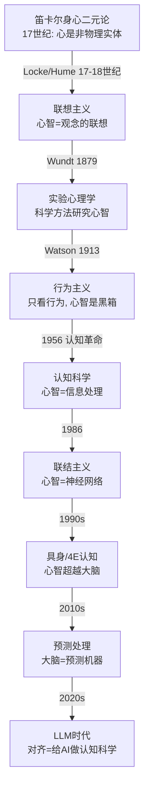

# 认知科学思想史 — 一部心智观念的革命史

> **为什么读思想史**：认知科学不是一堆实验数据的累积，是**一系列关于"心智是什么"的世界观革命**。每代人都推翻上一代的"常识"：灵魂→联想→反射→黑箱→符号→神经网络→预测机器。读史让你理解"为什么这个发现震撼"——这是理论的灵魂。
>
> **本文档**：用 Kuhn"范式转移"框架，梳理认知科学 10 次思想革命。每次转移用统一结构：**旧范式 → 危机 → 革命 → 新范式 → 遗产**。与 [HISTORY_OF_PHYSICS.md](../top-physics-courses/HISTORY_OF_PHYSICS.md) 平行。
>
> **配套**：[README.md](README.md)（认知科学领域总览）

---

## §0 总览：认知科学的 10 次范式转移

每次革命都遵循 **Kuhn 结构**：
1. **旧范式**（Normal Science）：主流世界观，能解释大部分现象
2. **危机**（Crisis）：发现旧范式解释不了的反常现象
3. **革命**（Revolution）：新思想出现，旧范式被推翻或修正
4. **新范式**（New Normal）：新世界观，开始新一轮"正常科学"

> **特殊之处**：与物理学不同，认知科学的范式转移常常是**叠加而非替代**——联结主义没有完全消灭符号主义，具身认知没有消灭计算主义。旧范式往往退守到特定领域继续存活。

---

## §1 笛卡尔：身心二元论（17 世纪）

### 旧范式：亚里士多德/经院哲学的灵魂
- 灵魂（anima）赋予生命和思维
- 灵魂与身体紧密统一（亚里士多德：灵魂是身体的形式）
- **思维 = 灵魂的功能**，灵魂是非物质的

### 危机
- 17 世纪科学革命（伽利略/牛顿）用机械论解释物质世界
- 身体可以被当作**机器**（心脏是泵，肌肉是杠杆）
- 但**思维**呢？机器能思考吗？

### 革命：笛卡尔（1596-1650）

**身心二元论**（Dualism）：
- **思维实体**（res cogitans）：意识、理性、自由意志——非物理、不占空间
- **广延实体**（res extensa）：物质世界——可被机械定律描述

**关键论点**：
1. "我思故我在"（*Cogito ergo sum*）——唯一不可怀疑的是**思维本身的存在**
2. 身体是机器（动物 = 自动机），但人类有非物质的心智
3. **松果体**是身心交互的部位（笛卡尔猜测——错的，但反映了他对交互问题的认真思考）

### 新范式：机器身体 + 非物质心灵
- 身体研究 → 生理学/医学（可以科学化）
- 心灵研究 → 留给哲学和宗教

### 遗产
- **开启了身体的研究**：把身体当机器，催生了生理学
- **心身问题**（Mind-Body Problem）：至今未解——意识如何与物质交互？
- **笛卡尔剧场**（Dennett 语）：二元论暗示意识像剧场里的观众在看大脑的"屏幕"——这个直觉至今根深蒂固
- **对 AI 的启示**：如果心智是非物理的，机器永远无法有心智。如果心智是信息处理的（功能主义），机器可以有心智。**这个分歧定义了整个 AI 哲学**

---

## §2 联想主义：经验主义的心智模型（17-18 世纪）

### 旧范式：理性主义（笛卡尔/莱布尼茨）
- 心智有**先天观念**（innate ideas）：上帝、几何真理、因果性
- 经验只是"唤醒"沉睡的先天知识

### 危机
- Locke 反问：如果观念是先天的，为什么婴儿和未受教育者不知道？
- 哪些观念真的是先天的？标准越来越模糊

### 革命：英国经验主义

#### John Locke（1632-1704）
- **白板说**（*tabula rasa*）：心智出生时是一张白纸
- 所有观念来自**感觉**（sensation）和**反思**（reflection）
- **联想**（association）：简单观念通过联想组合成复杂观念

#### David Hume（1711-1776）
联想的三原则：
1. **相似性**（resemblance）：看到画像想到本人
2. **时空接近**（contiguity）：提到一栋楼想到隔壁
3. **因果**（cause and effect）：看到火想到热

- **因果质疑**：我们从未"看到"因果，只看到**恒常 conjunction**——因果是心理习惯！
- 这是哲学史上最深刻的洞察之一

### 新范式：联想主义
- 心智 = 观念之间的联想网络
- 学习 = 联想强度的改变
- **没有先天知识**（极端版本）

### 遗产
- **联想记忆**（Hopfield 网络）：联想主义在 AI 中的直接后裔
- **Hebb 学习规则**（1949）："一起激发的神经元连在一起"——联想主义的神经版本
- **联结主义/深度学习**：从数据中学习统计联想——联想主义的终极实现
- **行为主义的前提**：联想主义 → 条件化 → 行为主义

### 反革命：Chomsky（1959）
- 联想主义无法解释**语言的创造性**（你能说出从未听过的话）
- 存在**先天结构**（普遍语法）
- → 这是 §5 认知革命的关键一击

---

## §3 实验心理学的诞生（1879）

### 旧范式：哲学心理学
- 心智研究靠**内省**（introspection）和**思辨**
- 没有实验方法，没有量化
- 心理学是哲学的一个分支

### 危机
- 内省法不可靠：不同哲学家的内省结果不同
- 自然科学（物理/化学/生物）用实验方法取得了巨大成功
- 心理学能否成为**科学**？

### 革命

#### Wilhelm Wundt（1832-1920）
- **1879 年在莱比锡大学建立第一个心理学实验室**——心理学从哲学独立
- 方法：**受控内省**（controlled introspection）——训练被试报告感知体验
- 研究内容：感觉、反应时、简单心理过程

#### William James（1842-1910）
- **《心理学原理》**（1890）——心理学经典之作，至今被引用
- **意识流**（stream of consciousness）：意识不是一系列静态状态，而是连续流动
- **机能主义**（functionalism）：心理过程的功能是什么？为什么演化出这种能力？
- **James-Lange 情绪理论**：不是"因为害怕所以发抖"，而是"因为发抖所以害怕"——身体反应先于情绪体验

### 新范式：科学心理学
- 心理学 = 实验科学
- 心理过程可以被**测量**（反应时、正确率、内省报告）
- **但**：关注的仍然是**意识体验**

### 遗产
- **实验方法**至今是认知心理学的基础
- **反应时范式**（Donders）：用反应时推断心理过程的阶段——现代 psychophysics 的根基
- **机能主义**→ 影响了 AI："不要问心智**是什么**，要问它**做什么**"——这正是功能主义的核心

### 为什么走向行为主义
- 内省法本质上**不可靠**（你报告的"红色感觉"和我报告的能一样吗？）
- 不同的内省学派（Wundt vs Külpe vs Titchener）吵不出结果
- **科学需要可观察的东西**——这是行为主义的起点

---

## §4 行为主义革命（1913-1950s）

### 旧范式：内省心理学
- 关注意识体验
- 方法：内省
- 问题：**不可靠、不可重复、主观**

### 危机
- 内省学派分裂（结构主义 vs 机能主义 vs Würzburg 学派）
- 不同实验室得出不同"内省结果"
- 物理学和化学不需要"内省"——为什么心理学需要？

### 革命

#### John B. Watson（1878-1958）
**"Psychology as the Behaviorist Views It"**（1913）——行为主义宣言：
- 心理学要成为真正的科学，就必须**抛弃意识**
- 只研究**可观察的行为**（stimulus → response）
- "给我一打健康的婴儿，我能把他们训练成任何专家"（极端环境论）

#### B.F. Skinner（1904-1990）
**操作性条件反射**（Operant Conditioning）：
- 行为被**后果**塑造：奖励增加行为频率（强化），惩罚降低
- **四象程式**（schedules of reinforcement）：固定比率/可变比率/固定间隔/可变间隔——产生不同的行为模式
- **激进行为主义**（radical behaviorism）：甚至"思维"也只是隐蔽的行为（covert behavior）
- *Verbal Behavior*（1957）：试图用行为主义解释语言

**经典实验**：Skinner Box——鸽子/老鼠按杠杆获取食物

### 新范式：刺激-反应心理学
- 心智是**黑箱**（black box）——不要猜里面有什么
- 学习 = **条件反射**（经典条件反射 Pavlov + 操作性条件反射 Skinner）
- 一切行为都可以用 S-R 联结解释
- **不需要"认知"**——不需要讨论思维、记忆、表征

### 为什么统治了 40 年
- **方法严谨**：实验可控制、可重复
- **实用有效**：行为矫正技术确实有用
- **符合科学的朴素理想**：只研究可观察的
- **美国实用主义传统**契合

### 行为主义的致命问题

1. **语言问题**（Chomsky 的致命一击）
   - Skinner 说语言是通过强化学习的
   - **Chomsky（1959）**评论 Skinner 的 *Verbal Behavior*：
     - 儿童能说出**从未被强化过**的句子
     - 语言有**创造性**（productivity）：有限的规则生成无限的句子
     - 条件反射**无法解释**语言获得
   - 这篇评论被认为是**行为主义灭亡的标志**

2. **Tolman 的认知地图**（1948）
   - 老鼠在迷宫中不是学 S-R 联结，而是形成了**内部地图**（cognitive map）
   - 行为是**目标导向**的，不只是机械反应
   - **黑箱里有东西！**

3. **无法解释复杂认知**
   - 记忆、注意、推理、问题解决——行为主义对这些束手无策

---

## §5 认知革命（1956）—— 心智重新打开

> **这是认知科学史上最重要的一次革命**。1956 年被称为"认知科学的大爆炸之年"——三件事在同一年发生，彻底改变了人类对心智的理解。

### 旧范式：行为主义
- 心智 = 黑箱
- 只研究刺激-反应
- 不讨论内部表征

### 危机（1940s-1950s）
- Chomsky 证明语言不能简化为 S-R（§4）
- Tolman 的认知地图证明动物有内部表征
- 二战中的**信息论**（Shannon 1948）和**控制论**（Wiener 1948）提供了新语言
- 计算机的发明（ENIAC 1945）提供了新隐喻：**心智 = 信息处理**

### 革命：1956 年三件事

#### 事件 1：George Miller —— "神奇的数字 7±2"
- **"The Magical Number Seven, Plus or Minus Two"**（1956）
- 人类短时记忆容量约 **7±2 个组块**（chunks）
- **关键洞察**：不是信息量限制，而是**组块数量**限制——"组块"意味着信息被**重新编码**（recoding）
- 这是**信息处理**视角的首次胜利：用信息论概念解释心理现象

#### 事件 2：Noam Chomsky —— 生成语法
- 语言不是习惯的集合，而是一套**规则系统**
- 句法有**结构**（层次结构，不是线性序列）
- **普遍语法**（Universal Grammar）：所有语言共享深层结构
- → 语言是**先天能力**，不是学来的

#### 事件 3：Newell & Simon —— 逻辑理论家（Logic Theorist）
- 第一个能**证明数学定理**的计算机程序
- 证明了罗素《数学原理》中 38/52 条定理
- **关键思想**：思维 = **符号操作**；计算机可以**模拟**人类思维
- 后续：**通用问题求解器**（General Problem Solver, GPS, 1957）

#### 同年还有：Dartmouth AI 会议（1956 夏）
- McCarthy/Minsky/Rochester/Shannon 发起
- "人工智能"（Artificial Intelligence）这个词首次出现
- **AI 和认知科学在同一年诞生**

### 其他关键贡献

**Bruner, Goodnow & Austin —— A Study of Thinking（1956）**
- 研究**概念形成**的策略
- 人们不是被动接收信息，而是**主动建构假设**

**Donald Broadbent（1958）—— 滤嘴理论**
- 注意力是**信息过滤器**
- 第一个信息流模型：感觉 → 过滤 → 有限容量通道
- 直接催生了**注意的瓶颈模型**

### 新范式：认知主义（Cognitivism）

**计算心智理论**（Computational Theory of Mind）：
- 心智 = **信息处理系统**
- 认知 = **符号操作**（symbol manipulation）
- 心智过程 = **计算**（computation）

**三重隐喻**：
1. 大脑 = **硬件**
2. 心智 = **软件/程序**
3. 认知 = **计算**

**方法论**：
- 重新打开"黑箱"——研究内部表征、记忆、注意、推理
- 用**信息处理模型**描述心理过程（流程图/框图）
- 用**反应时**和**正确率**推断内部过程（继承自实验心理学）

### Ulric Neisser —— 定义学科
- **"Cognitive Psychology"**（1967）——第一本教材，定义了领域
- Neisser 的定义："认知是感觉输入被转化、简约、加工、存储、恢复和使用的所有过程"
- 1976 年他批评认知心理学太依赖实验室，呼吁关注**现实世界认知**（生态效度）

### 为什么震撼
- **"黑箱"被打开了**——心智重新成为科学对象
- **跨学科诞生**：心理学 + AI + 语言学 + 哲学 + 神经科学 → **认知科学**
- 1979 年：**认知科学学会**成立
- **AI 和心理学共享同一个假设**：心智 = 计算

### 遗产
- **信息处理范式**统治 1960s-1970s
- **认知架构**：ACT-R（Anderson）、SOAR（Newell）——用符号系统模拟人类认知
- **物理符号系统假设**（Newell & Simon 1976）：物理符号系统具有产生通用智能行为的充分和必要条件
- **直接催生符号 AI**（GOFAI: Good Old-Fashioned AI）

---

## §6 信息处理理论（1960s-1970s）

### 新范式内部的深化

认知革命后的"正常科学"期——用信息处理模型解释各种认知现象。

#### 6.1 记忆的多重模型
- **Atkinson & Shiffrin（1968）**：多重存储模型
  - 感觉记忆 → 短时记忆 → 长时记忆
  - 各有不同的容量、持续时间、编码方式
- **Baddeley & Hitch（1974）**：工作记忆模型
  - 中央执行系统 + 视觉空间画板 + 语音回路 + （后期）情景缓冲区
  - 工作记忆不是被动存储，而是**主动加工**

#### 6.2 注意力模型
- **Broadbent（1958）**：早期选择（瓶颈在语义加工之前）
- **Treisman（1960）**：衰减理论（不是全或无，而是信号减弱）
- **Deutsch & Deutsch（1963）**：晚期选择（所有信息都被加工，瓶颈在反应）
- **Kahneman（1973）**：容量模型——注意是有限资源

#### 6.3 问题解决与启发式
- **Newell & Simon（1972）**：*Human Problem Solving*
  - 问题空间（problem space）+ 搜索策略
  - 启发式（heuristics）：手段-目的分析、爬山法
- **Wason 选择任务（1966）**：人类推理系统性偏离逻辑——启发式偏差的早期证据

#### 6.4 David Marr 的三层分析（1982）★
- **理解信息处理系统需要三个层次**：
  1. **计算层**（Computational）：系统在**算什么**？为什么这样算？
  2. **算法层**（Algorithmic）：**怎么**算？什么表示和过程？
  3. **实现层**（Implementational）：**物理上**怎么实现？
- Marr 以**视觉**为例，展示了如何用三层框架理解一个认知系统
- **对 AI interp 的意义**：这个框架至今是 mech interp 的方法论根基（见 [README.md §5.1](README.md)）

#### 6.5 认知架构
- **ACT-R**（Anderson, 1976-）：整合陈述性记忆（组块）+ 程序性记忆（产生式规则）
- **SOAR**（Newell, Laird & Rosenbloom, 1987-）：通用认知架构，基于问题空间和组块学习
- 目标：建造一个**完整的人类认知模型**

---

## §7 联结主义复兴（1986）—— 从符号到网络

### 旧范式：符号主义
- 认知 = 符号操作
- 知识 = 符号结构（规则/产生式/语义网络）
- 方法：逻辑 + 序列处理

### 危机
1. **符号 AI 的瓶颈**：手动编写规则不可扩展（常识问题 / 框架问题）
2. **人类认知的灵活性**：符号系统太"死板"——人类能处理模糊、不完整、矛盾的信息
3. **神经科学的启示**：大脑不是序列符号处理器，是**大规模并行**的神经元网络
4. **模式识别难题**：视觉/语音识别用符号方法极难，但人类轻松完成

### 前奏

- **McCulloch & Pitts（1943）**：第一个神经元数学模型——证明简单神经元网络可以计算任意逻辑函数
- **Hebb（1949）**：突触可塑性——"一起激发的神经元连在一起"
- **Rosenblatt（1958）**：感知机（Perceptron）——第一个可学习的神经网络
- **Minsky & Papert（1969）**：*Perceptrons*——证明单层感知机无法解决 XOR 问题
  - **后果**：神经网络研究被搁置近 20 年（"AI 寒冬"对联结主义的打击）

### 革命：PDP（1986）

**Rumelhart, McClelland & PDP Research Group**：
**"Parallel Distributed Processing: Explorations in the Microstructure of Cognition"**（1986，两卷）

核心思想：
1. **分布式表征**（distributed representation）：概念不是单个符号，而是**跨神经元的激活模式**
2. **并行处理**（parallel processing）：多个单元同时计算
3. **反向传播**（backpropagation）：通过误差反向传播学习权重（Rumelhart, Hinton & Williams 1986）
4. **涌现**（emergence）：复杂行为从简单单元的相互作用中涌现

**经典模型**：
- **过去时模型**（Rumelhart & McClelland 1986）：网络学习英语动词过去时——无需规则，通过模式联想
  - 模仿了儿童语言获得的 **U 形曲线**（先正确 → 过度泛化 → 再正确）
  - 这是联结主义对 Chomsky"先天语法"的直接挑战

### 新范式：联结主义
- 认知 = **神经网络中的激活模式**
- 知识 = **权重**（不是显式规则）
- 学习 = **权重更新**（梯度下降）
- 优势：**鲁棒、能泛化、能学习**（不需要手写规则）

### 符号 vs 联结的大辩论（1980s-1990s）
- **Fodor & Pylyshyn（1988）**：联结主义只是符号主义的**实现细节**——你仍然需要符号、组合性、系统性
- **联结主义者**：符号结构可以**涌现**，不需要显式表示
- **Smolensky**：联结主义有"次符号"（subsymbolic）层面——介于符号和连续之间

### 遗产
- **联结主义赢了时间**（深度学习的胜利证明了这一点），但符号主义没有死
- **深度学习是联结主义的直系后裔**——从 PDP 到 AlexNet 到 Transformer
- **Marr 三层分析仍然适用**：联结主义主要在算法层和实现层
- **认知科学的分裂**：有人认为深度学习证明了联结主义是对的；有人认为 LLM 缺少符号组合性

---

## §8 具身认知与 4E 认知（1990s-2000s）

### 旧范式：计算主义（符号 + 联结）
- 心智 = 大脑中的计算
- 身体只是"输入输出设备"
- 认知 = "脑内"的信息处理，与环境无关
- **笛卡尔遗产**：心和身可以分离

### 危机
1. **符号接地问题**（Symbol Grounding Problem, Harnad 1990）：符号的意义从哪里来？"苹果"这个符号为什么指代苹果？如果全靠其他符号解释，就是循环
2. **具身认知实验**：
   - 隐喻对思维的影响（Lakoff & Johnson）：我们用身体经验（上/下、热/冷）来理解抽象概念
   - 具身效应：拿热杯子的人觉得他人更"温暖"（社会认知的具身化）
3. **AI 的困境**：符号 AI 和早期神经网络都无法与真实世界交互——它们是"缸中之脑"

### 革命

#### 8.1 具身认知（Embodied Cognition）
**核心主张**：认知不只是大脑的计算，**身体和身体经验**塑造了认知。
- **Lakoff & Johnson（1999）**：*Philosophy in the Flesh*——所有抽象思维都根植于身体经验
- **概念隐喻理论**："时间是空间"（向前看 = 未来）、"多即是上"（价格上涨）——身体经验是认知基础

#### 8.2 生成主义 / Enactivism
**Varela, Thompson & Rosch（1991）**：*The Embodied Mind*
- 认知不是"表征世界"，而是**通过行动**生成**意义**
- 认知主体不是被动接收信息，而是**主动建构**世界
- "认知是具身的行动"（cognition is embodied action）
- 受现象学（Merleau-Ponty）和佛教哲学影响

#### 8.3 延展心智（Extended Mind）
**Andy Clark & David Chalmers（1998）**："The Extended Mind"
- **核心论点**：认知过程**不限于头骨和皮肤**——外部工具（笔记本、计算器）如果可靠使用，就是认知的一部分
- **Otto 例子**：Otto 患有阿尔茨海默症，用笔记本记录一切。他的笔记本就是他的记忆——与正常人脑中的记忆**功能上等价**
- **耦合系统**（coupled system）：大脑 + 工具 = 认知系统
- **对 AI 的意义**：如果外部工具是认知的一部分，那 AI 工具（Copilot、搜索引擎）也是认知的一部分——**人类 + AI 的混合系统是一个认知单元**

### 4E 认知（2000s 的整合）
四种立场合称 **4E**：

| E | 全称 | 核心主张 | 代表 |
|---|------|---------|------|
| **Embodied** | 具身 | 身体塑造认知 | Lakoff, Varela |
| **Embedded** | 嵌入 | 认知嵌入在环境和情境中 | Robbins |
| **Extended** | 延展 | 认知延展到外部工具 | Clark, Chalmers |
| **Enacted** | 生成 | 认知通过行动生成 | Varela, Thompson |

### 新范式：超越计算主义
- 认知不是纯粹的"脑内计算"
- **身体 + 环境 + 工具**都是认知系统的一部分
- 意义通过**行动**生成，不是通过表征

### 批评与争议
- **Adams & Aizawa（2008）**：延展心智犯了**认知标记错误**——纸上的字和脑中的记忆本质不同
- **计算主义者**：4E 听起来激进，但实际上只是实现层的差异——计算仍在进行
- ** Rupert（2004）**：延展心智与内部记忆理论不兼容

### 遗产
- **影响了机器人学**（具身 AI / Embodied AI）——Brooks 的"无表征智能"
- **影响了人机交互**（HCI）——具身界面设计
- **与 LLM 的张力**：LLM 是"无身体的"——它能真正理解吗？（这是 4E 认知支持者质疑 LLM 理解能力的根据）
- **Andy Clark 后期转向预测处理**（§9），将 4E 和预测处理融合

---

## §9 预测处理（2010s）—— 大脑是预测机器

### 旧范式：感知-行动模型
- 大脑**被动接收**感觉输入 → 处理 → 输出行动
- 感知 = **自下而上**的特征提取（从像素到边缘到物体）
- 信息单向流动：感觉 → 认知 → 行动

### 危机
1. **感知太好了**：大脑能在极短时间内识别复杂场景——纯自下而上处理太慢
2. **感觉输入是噪声的**：视网膜上的图像是 2D 投影，大脑却能感知 3D 世界——"幻觉"了缺失信息
3. **神经解剖学发现**：大量**反馈连接**（自上而下）——如果感知只是自下而上，为什么有这么多反馈？
4. **感知幻觉**：大脑"看到"不存在的东西（模式补全、空想性错视）——暗示大脑在**猜测**

### 革命

#### 前驱：Helmholtz 的无意识推理
- **Hermann von Helmholtz（1821-1894）**：感知是**无意识推理**——大脑根据感觉输入**推断**外部原因
- 感知不是被动接收，而是**主动构建假设**

#### Friston 的自由能原理（Free Energy Principle）

**Karl Friston（2010）**："The free-energy principle: a unified brain theory?"——*Nature Reviews Neuroscience*

**核心数学**：

大脑的目标是最小化**变分自由能**（variational free energy），等价于最小化**意外**（surprise，即感觉输入的负对数概率）：

$$\mathcal{F} = \underbrace{D_{KL}[q(s) \| p(s|o)]}_{\text{感知误差}} + \underbrace{[-\ln p(o)]}_{\text{意外}}$$

- $q(s)$：大脑对隐藏状态 $s$ 的**信念**（后验近似）
- $p(s|o)$：给定观察 $o$ 的真实后验
- $D_{KL}$：KL 散度（信念与真实的差距）

**两种最小化自由能的方式**：
1. **感知推理**（Perceptual inference）：更新内部模型 $q(s)$，使预测匹配感觉 → **学习/感知**
2. **主动推理**（Active Inference）：改变感觉输入 $o$，使其匹配预测 → **行动**

**关键洞察**：行动和感知是同一原理的两种表现——都在最小化预测误差。

#### 预测编码（Predictive Coding）

**层级预测编码**：
- 每一层向下一层发送**预测**（prediction）
- 下一层计算**预测误差**（prediction error）= 实际输入 - 预测
- 只有**误差**上传——大大减少信息传输量
- 大脑不断更新模型以**减少未来的误差**

**自上而下 vs 自下而上**：
- 自上而下 = 预测（"我预期看到什么"）
- 自下而上 = 误差信号（"与预期的差异"）
- **感知 = 用预测解释输入**（不是被动接收）

#### Andy Clark 的综合

**"Surfing Uncertainty"（2016）**：
- 把预测处理整合进认知科学
- "我们是**猜测引擎**"——大脑的核心工作是**猜**
- 幻觉、精神分裂（预测过强）、自闭症（预测过弱）都可以用预测误差平衡解释

### 新范式：大脑 = 预测机器

| 旧视角 | 预测处理视角 |
|-------|------------|
| 感知 = 自下而上处理 | 感知 = 自上而下预测 + 自下而上误差 |
| 行动 = 输出命令 | 行动 = 改变世界以匹配预测 |
| 学习 = 存储信息 | 学习 = 更新生成模型 |
| 错误 = 失败 | 错误 = 学习信号 |

### 预测处理统一了什么
- **感知与行动**：都是最小化预测误差
- **学习与推理**：都是更新生成模型
- **注意**：提高某些预测误差的精度权重 = 注意
- **情绪**：预测误差 = 不确定性的信号
- **精神病理**：精神分裂 = 先验过强（幻觉）；自闭症 = 感觉精度过高（感觉过载）

### 与 AI / 深度学习的联系
- **自监督学习**（masked prediction）= 预测编码在 AI 中的实现
- **生成模型**（VAE / 扩散模型）= 生成模型的 AI 版本
- **主动推理** = 强化学习的变体（但优化的是信念，不是奖励）
- **World Models**（Ha & Schmidhuber 2018）= 预测处理在 AI 中的体现
- **LLM = 超级预测机器**：next-token prediction 本质上就是预测处理！

### 批评
- **Colombo & Wright（2017）**：自由能原理是重言式（tautological）——任何系统都可以被描述为最小化自由能
- **可证伪性质疑**：如果什么都能用自由能原理解释，它就不是科学理论
- **Friston 的回应**：好的统一理论应该适用广泛——就像进化论

### 遗产
- 可能是认知科学自 1956 认知革命以来**最大的理论统一**
- 把感知/行动/学习/注意/情绪/精神病理统一在一个数学框架下
- **与深度学习的深层联系**正在被发掘——预测处理可能是理解 LLM 的框架

---

## §10 意识的科学（1990s-2020s）—— 最难的问题

> 意识问题贯穿认知科学全部历史（笛卡尔到今天），但它作为**科学问题**（而非纯哲学问题）是 1990s 的事。

### 旧范式：行为主义/功能主义
- 行为主义：意识不存在（或不需要研究）
- 功能主义：意识 = 某种信息处理功能

### 危机
- **主观体验**（qualia）：为什么看到红色有"红色的感觉"？信息处理能解释这个吗？
- **僵尸论证**（Chalmers）：一个在行为上与人类完全相同但没有主观体验的"哲学僵尸"在逻辑上可能——这说明信息处理和主观体验之间存在**解释鸿沟**

### 革命

#### Chalmers：困难问题（1995）
**"Facing Up to the Problem of Consciousness"**（*Journal of Consciousness Studies*, 1995）

区分两类问题：
- **简单问题**（Easy Problems）：大脑如何整合信息、控制行为、产生报告——**原则上**科学可解
- **困难问题**（Hard Problem）：**为什么**这些物理过程伴随着主观体验？

> "为什么物理处理不是在黑暗中进行的？为什么有内在的电影？"

**Chalmers 的立场**：意识可能是**基本信息属性**（信息二元论 / panpsychism）——需要新的基本定律

#### Dennett：意识是幻觉（1991）
**"Consciousness Explained"**

- 意识不是单一"剧场"——没有中央"自我"在看屏幕
- **多重草稿模型**（Multiple Drafts Model）：信息在大脑中并行处理，没有"中央编辑"
- 意识是"**用户幻觉**"（user illusion）——大脑制造的简化叙事
- **意向性姿态**（Intentional Stance）：我们"假装"系统有信念和欲望——对人类和 AI 都适用
- Dennett 否认 qualia 的存在——"没有困难问题"

#### Baars：全局工作空间理论（1988）
**"A Cognitive Theory of Consciousness"**

- **剧场隐喻**：意识像一个聚光灯
- 大量无意识处理在"后台"并行运行
- 当信息进入**全局工作空间**（Global Workspace）——被广播给整个系统——就变成**有意识**
- 后续：**Dehaene 的全局神经元工作空间**（GNW, 2014）——用神经科学实现 GWT
  - "点火"（ignition）：当刺激足够强时，前额叶-顶叶网络全局激活 = 意识

#### Tononi：整合信息论（2004）
**"An Information Integration Theory of Consciousness"**

- 意识 = **信息整合能力**，用 $\Phi$（Phi）量化
- $\Phi$ 衡量系统"整体大于部分之和"的程度
- **预测**：$\Phi$ 高的系统有意识（人脑高，简单电路低）
- **惊人推论**：任何高 $\Phi$ 系统都有某种意识——包括 AI？
- 可检验：用经颅磁刺激（TMS）+ EEG 测量大脑的 $\Phi$，区分意识状态（清醒 vs 睡眠 vs 麻醉）

### 主要意识理论对比

| 理论 | 核心 | 意识 = | 可证伪? | AI 有意识? |
|------|------|--------|---------|----------|
| **GWT**（Baars/Dehaene） | 全局广播 | 信息在工作空间广播 | 是（实验可测） | 如果 AI 有工作空间架构→是 |
| **IIT**（Tononi） | 信息整合 | $\Phi$ 值 | 是（TMS-EEG） | 如果 $\Phi$ 高→是 |
| **HOT**（高阶理论） | 高阶表征 | 对低阶状态的高阶表征 | 部分 | 如果有元认知→可能 |
| **幻觉论**（Dennett） | 用户幻觉 | 大脑制造的叙事 | 争议 | 概念上适用但"幻觉"不等于真有 |

### 意识与 AI（2020s 前沿）

**关键问题**：LLM 有意识吗？

- **大多数认知科学家说"否"**：LLM 缺乏 GWT 的全局工作空间、IIT 的高 $\Phi$（前馈架构 $\Phi$ 低）
- **但**：随着 AI 架构越来越复杂（递归、全局注意力、元认知），这个问题会越来越紧迫
- **Butlin et al.（2023）**：用 GWT/IIT/HOT 等**计算指标**评估 AI 意识——提出了初步的"AI 意识检测清单"
- **这就是对齐研究的认知科学基础**：如果 AI 有某种"体验"，对齐就有伦理维度

---

## §11 认知科学与 AI 的平行发展

> 认知科学和 AI 是**同一条思想河流的两个分支**——都从"心智 = 计算"出发，一路平行演化。

| 阶段 | 认知科学 | AI | 共同假设 |
|------|---------|-----|---------|
| 1943-1955 | 神经计算模型（McCulloch-Pitts） | 早期计算机 | 心智 = 计算 |
| 1956 | 认知革命（Chomsky/Miller/Newell&Simon） | Dartmouth 会议 | 符号操作 |
| 1960s-70s | 信息处理理论 | 符号 AI 黄金期 | 物理符号系统假设 |
| 1969 | — | Minsky-Papert 打击感知机 | — |
| 1980s | 联结主义辩论 | 专家系统（符号 AI 巅峰） | — |
| 1986 | PDP 联结主义复兴 | 反向传播 | 分布式表征 |
| 1990s | 具身/4E 认知 | AI 寒冬 → 数据驱动萌芽 | 涌现 |
| 2000s | 预测处理萌芽 | 统计学习崛起 | 概率推理 |
| 2010 | Friston 自由能原理 | 深度学习爆发（AlexNet） | 表示学习 |
| 2012-2020 | 预测处理 × AI 交叉 | 深度学习黄金期 | 生成模型 |
| 2017 | — | Transformer | 注意力 |
| 2020s | 对齐 = 给 AI 做认知科学 | LLM 时代 | 重新汇流 |

### 关键交叉点

**1. Mech Interp = 对神经网络做认知科学**
- 探针（probes）← 认知心理学的测量方法
- 表征几何 ← 心理物理学
- 回路分析 ← 神经回路研究
- SAE / 特征发现 ← 感觉生理学（特征检测器）
- **Marr 三层分析**是 interp 的方法论框架

**2. 对齐研究 = AI 的认知科学**
- 模型生物（model organisms）= 研究欺骗行为的认知实验
- 奖励黑客 = 研究目标导向行为的偏差
- RLHF = 价值观学习（Piaget 式建构？）
- **理解 AI 的"心智"如何工作** = 对齐的前提

**3. LLM 挑战了认知科学的基础假设**
- Chomsky 说语言需要先天语法——LLM 从纯文本学到语言能力（冲击）
- 符号主义者说需要组合性——LLM 的组合性能力在提升（部分验证）
- 4E 认知说需要身体——LLM 没有身体但有语言能力（挑战）
- **2026 的核心问题**：LLM 的成功意味着认知科学哪些假设需要修改？

---

## §12 失败的理论与被淘汰的范式

| 理论 | 为什么被淘汰/退守 |
|------|-----------------|
| **颅相学**（Phrenology, 19th c.）| 脑区定位过于简单，无科学依据 |
| **内省主义** | 不可靠、不可重复 |
| **极端行为主义** | 无法解释语言/思维/内部表征 |
| **纯符号 AI（GOFAI）** | 不能扩展、不能学习、框架问题 |
| ** eliminativism**（消除唯物论的极端版）| 否认信念/欲望的存在——与日常经验矛盾 |
| **经典模块论**（Fodor 极端版）| 中央系统非模块——但现代认知发现模块性更灵活 |
| **纯联结主义反符号论** | LLM 表现出某种组合性——纯反符号可能过度 |

**教训**：认知科学的范式转移常常是**叠加而非替代**。旧范式退守到特定领域继续存活（符号主义 → 规划/逻辑；行为主义 → 强化学习的行为层面）。

---

## §13 下一次革命（2026 视角）

### 候选 1：LLM 作为认知模型
- 如果 LLM 的表征与人类大脑相似（已在语言区发现证据），LLM 就是**可观察的认知系统**
- 这可能**彻底改变**认知科学——终于可以打开"黑箱"了
- 但也可能证明人类认知与 LLM 根本不同

### 候选 2：预测处理统一 AI 和认知科学
- 如果 LLM = 预测机器，大脑 = 预测机器——两者可能共享**计算原理**
- Active inference AI（基于自由能原理的 AI）正在发展
- 预测处理可能是**统一框架**

### 候选 3：意识理论的实验突破
- IIT 的 $\Phi$ 测量越来越精确
- 如果能在 AI 中检测到高 $\Phi$ 或全局工作空间信号——**伦理地震**
- 可能需要全新的"AI 权利"框架

### 候选 4：具身 AI 的突破
- 机器人 + 大模型 = 具身 AI
- 如果具身 AI 超越"缸中之脑"——验证/推翻 4E 认知
- Figure / Tesla Optimus 正在做这件事

### 候选 5：对齐与认知科学融合
- 对齐研究正在使用认知科学工具（探针/回路/模型生物）
- 如果对齐成功——我们会有一个**可理解的人工认知系统**
- 这将是认知科学的终极成就：**建造并理解一个心智**

---

## §14 给你的启示

### 启示 1：认知科学是 AI 的思想根源
- "心智 = 计算"催生了认知科学和 AI
- 理解认知科学 = 理解 AI 为什么这样发展
- **Marr 三层分析**是你做 interp 的方法论根基

### 启示 2：范式转移是叠加的
- 符号主义 → 联结主义 → 深度学习 → LLM——每一层都叠加而非替代
- 符号 AI 仍然在做规划/逻辑；联结主义（深度学习）在做感知/语言
- **你的 interp 工作是在联结主义框架下探索表征和回路**

### 启示 3：对齐 = 认知科学
- 你研究模型欺骗、奖励黑客、伪对齐——本质上是在给 AI 做认知科学
- 认知科学的工具（探针/模型生物/表征分析）正是 interp 的工具
- **认知科学的理论框架帮你提出正确的问题**

### 启示 4：预测处理可能是统一框架
- 如果大脑和 LLM 都是预测机器——理解预测处理 = 理解两者
- Friston 的自由能原理可能与自监督学习/RL/世界模型统一
- **值得深学**（与你的 RL 和世界模型项目交叉）

### 启示 5：意识问题不可回避
- 随着 AI 越来越强大，"AI 有意识吗"不再只是哲学问题
- GWT/IIT/HOT 理论提供了初步的**可检验框架**
- 你可能需要在这个问题上**形成自己的立场**——它影响你对对齐伦理的判断

---

**完成日期**：2026-08-13
**配套**：[README.md](README.md)（认知科学领域总览）+ [../top-physics-courses/HISTORY_OF_PHYSICS.md](../top-physics-courses/HISTORY_OF_PHYSICS.md)（物理学思想史——平行阅读，感受同样的革命结构）
