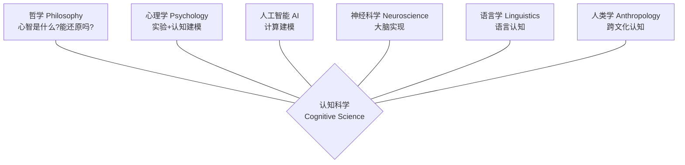
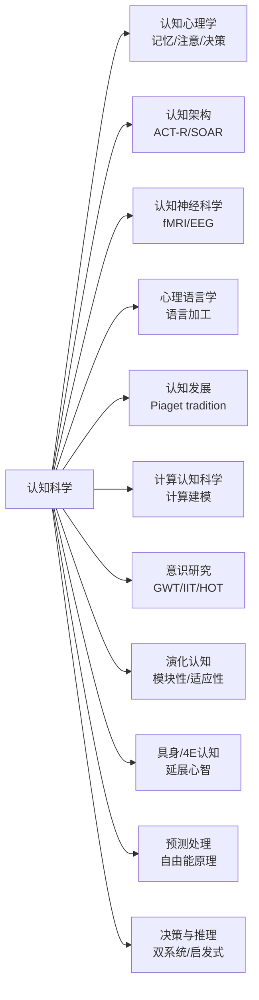

# 🧠 认知科学 — 研究心智的跨学科科学

> **什么是认知科学**：用**六门学科**的交叉视角研究**心智**（mind）——人怎么思考、怎么语言、怎么感知、怎么学习、怎么产生意识。它不是一个单一学科，而是一个**跨学科联盟**。
>
> **为什么对你重要**：认知科学是 AI 的**姊妹学科**。"心智是计算机"这个假设同时催生了认知科学和 AI。理解认知科学 = 理解 AI 的思想根源。机械可解释性（mech interp）本质上就是在**对神经网络做认知科学**——用探针解剖表征、用 SAE 找特征、用模型生物研究对齐——这些方法论直接来自认知心理学和神经科学。

---

## §1 认知科学是什么

**定义**：认知科学（Cognitive Science）是研究心智及其过程的跨学科领域，整合哲学、心理学、人工智能、神经科学、语言学和人类学的方法和洞见。

**一句话**：**心智是一个信息处理系统**——它接收输入（感知）、存储和转换信息（思维）、产生输出（行为和语言）。

**核心隐喻**：大脑 $\approx$ 计算机。
- 硬件 = 神经元（神经科学）
- 软件 = 心智程序（心理学/AI）
- 语言 = 思想的操作系统（语言学）

**关键区分**——这个隐喻**对不对**，正是认知科学 60 年争论的核心（见 [HISTORY.md](HISTORY.md)）。

---

## §2 六大支柱（认知六边形）

认知科学的经典图示是**认知六边形**（Cognitive Hexagon）——六个学科节点，中间是"认知科学"：

| 支柱 | 核心问题 | 代表人物 | 对 AI 的意义 |
|------|---------|---------|------------|
| **哲学** | 心智的本质？意识？自由意志？ | Chalmers, Dennett, Fodor | LLM 有意识吗？理解是什么？ |
| **心理学** | 记忆/注意/推理的机制？ | Miller, Kahneman, Neisser | benchmark 设计、认知偏差 |
| **人工智能** | 能让机器思考吗？ | Turing, Minsky, Newell & Simon | 本身就是支柱 |
| **神经科学** | 大脑怎么实现认知？ | Hubel & Wiesel, Friston | 生物启发的架构 |
| **语言学** | 语言能力的本质？ | Chomsky, Pinker | tokenizer/语法/语义建模 |
| **人类学** | 认知是普遍的还是文化建构的？ | Lévi-Strauss, Shore | 多语言/文化对齐 |

> **第七支柱**（争议中）：演化生物学——认知能力如何被自然选择塑造？代表：Cosmides & Tooby（演化心理学）。

---

## §3 五大核心问题

### 问题 1：心智是什么？
- **笛卡尔**：心智是非物理实体（二元论）
- **物理主义**：心智 = 大脑活动（同一论 / 消除主义）
- **功能主义**（主流）：心智 = 信息处理模式，**不依赖载体**（硅基也行）
- **当前争论**：LLM 是功能主义心智的实例吗？

### 问题 2：知识如何获得？
- **经验主义**（Locke/Hume）：白板说（tabula rasa），一切来自经验
- **理性主义**（Chomsky/Fodor）：存在**先天结构**（如普遍语法），经验只是触发
- **建构主义**（Piaget）：儿童主动建构知识，经历阶段式发展
- **统计学习**：现代 AI 的答案——从大数据中学习（但"学习"=获得知识吗？）

### 问题 3：思维如何实现？
- **符号主义**（Newell & Simon）：思维 = 符号操作（物理符号系统假设）
- **联结主义**（Rumelhart & McClelland）：思维 = 神经网络并行处理
- **预测处理**（Friston）：大脑是一台**预测机器**，不断最小化预测误差
- **具身认知**：思维不只是"脑内计算"，身体和环境也参与

### 问题 4：语言的本质是什么？
- **Chomsky**：语言是**先天能力**（普遍语法），不是学来的
- **Pinker**：语言本能（language instinct），演化产物
- **usage-based**（Tomasello）：语言从使用中涌现，不需要先天语法
- **LLM 视角**：超大模型从纯文本中学到了"语言能力"——这对 Chomsky 范式是挑战

### 问题 5：意识是什么？（最难的问题）
- **Chalmers 的区分**：
  - **简单问题**（Easy Problems）：大脑如何处理信息、控制行为（科学可解）
  - **困难问题**（Hard Problem）：**为什么**有主观体验？（为什么看到红色有"红色的感觉"？）
- **主要理论**：
  - **全局工作空间理论**（Baars/Dehaene）：意识 = 信息在全脑广播
  - **整合信息论**（Tononi, IIT）：意识 = 信息整合度 $\Phi$
  - **幻觉论**（Dennett）：意识是一种"用户幻觉"
  - **高阶理论**（HOT）：意识 = 对低阶状态的高阶表征

> **2026 热点**：LLM 是否有意识？——多数认知科学家说"否"，但争论越来越激烈。

---

## §4 子领域地图

---

## §5 认知科学与 AI / 可解释性的深层联系

这是**对你最重要的一节**。认知科学不是"遥远的理论"——它就在你每天做的 interp 工作里。

### 5.1 David Marr 的三层分析——interp 的方法论根基

Marr（1982）提出理解任何信息处理系统需要**三个层次**：

| 层次 | 问题 | 认知科学例子 | interp 例子 |
|------|------|------------|------------|
| **计算层**（Computational） | 系统在**算什么**？为什么？ | 视觉在算 3D 形状 | 模型在做 induction heads |
| **算法层**（Algorithmic） | **怎么**算？什么表示和过程？ | 边缘检测算法 | QK 回路 + OV 回路 |
| **实现层**（Implementational） | **物理上**怎么实现？ | 神经元回路 | GPU 上的矩阵乘法 |

> Mech interp 大部分工作在**算法层**——找表征和回路。Marr 的框架告诉你：光看权重（实现层）不够，要理解模型在**算什么**（计算层）。

### 5.2 探针与表征几何——认知心理学方法的迁移

- 认知心理学家 50 年来用**反应时间**和**正确率**推断内部表征
- interp 用**探针**（probes）和**表征几何**做同样的事
- 区别：神经网络的表征比人类大脑更容易"打开来看"

### 5.3 模块性 vs 分布式——Fodor 到 superposition

- **Fodor**（1983）：心智有**模块**（输入系统：视觉/语言）和**中央系统**（推理）
- **联结主义**：一切都是分布式的
- **Anthropic superposition**（2022）：神经网络中特征是**叠加**的——不是模块也不是纯分布式，而是一种新的**稀疏分布式编码**
- 这个发现正在**重新点燃**认知科学中模块 vs 分布式的辩论

### 5.4 对齐 = 认知科学问题

| 认知科学问题 | 对齐问题 |
|------------|---------|
| 人类怎么学会价值观？ | 如何让模型学会人类价值观？ |
| 意识/理解是什么？ | LLM "理解"文本吗？ |
| 欺骗行为如何产生？ | 模型欺骗（model organisms） |
| 目标导向行为 | 奖励黑客 / 伪对齐 |

> **洞察**：**对齐研究本质上是在给 AI 做认知科学**——研究 AI 的"心智"如何工作，如何产生目标、理解、欺骗。这就是为什么 Anthropic/DeepMind 雇佣认知科学背景的人。

---

## §6 核心人物速览（详见 [HISTORY.md](HISTORY.md)）

| 人物 | 年代 | 核心贡献 | 一句话 |
|------|------|---------|-------|
| **笛卡尔** | 1596-1650 | 心身二元论 | 心和身是两种实体 |
| **Locke/Hume** | 17-18 世纪 | 联想主义 | 心智由经验通过联想构建 |
| **Wundt** | 1832-1920 | 实验心理学 | 1879 年建立第一个心理学实验室 |
| **William James** | 1842-1910 | 机能主义 | 心理学原理（1890），意识流 |
| **Watson/Skinner** | 20 世纪 | 行为主义 | 只研究可观察的行为 |
| **Turing** | 1912-1954 | 计算心智 | 心智 = 计算（图灵测试） |
| **Chomsky** | 1928- | 生成语法 | 语言是先天能力 |
| **Piaget** | 1896-1980 | 认知发展 | 儿童思维经历 4 阶段 |
| **Newell & Simon** | 1956 | 符号 AI | 物理符号系统假设 |
| **Minsky** | 1927-2016 | AI 先驱 | 心智的社会（1986） |
| **Fodor** | 1935-2017 | 心智模块性 | 语言模块 + 思想语言 |
| **Marr** | 1945-1980 | 三层分析 | 视觉的计算理论 |
| **Dennett** | 1942-2024 | 意识哲学 | 意识是"用户幻觉" |
| **Chalmers** | 1966- | 意识哲学 | "困难问题" |
| **Baars** | 1946- | 全局工作空间 | 意识 = 信息在全脑广播 |
| **Andy Clark** | 1957- | 延展心智 | 心智不只在大脑里 |
| **Pinker** | 1954- | 语言本能 | 语言是演化产物 |
| **Friston** | 1959- | 自由能原理 | 大脑是预测机器 |
| **Kahneman** | 1934- | 双系统理论 | 快思考 vs 慢思考 |

---

## §7 从哪里开始？

### 🎯 如果你对 AI/interp 感兴趣
1. **[HISTORY.md](HISTORY.md)** — 认知科学思想史（从笛卡尔到预测处理，9 次范式转移）
2. **Marr 三层分析**（§5.1）——interp 的方法论根基
3. **Chalmers 困难问题** → 思考"LLM 有意识吗"
4. **Friston 自由能原理** → 与主动推理/RL 的联系

### 📚 如果你想系统学
1. **Paul Thagard, *Mind: Introduction to Cognitive Science***（2nd ed, 2005）——最经典的入门教材
2. **Howard Gardner, *The Mind's New Science***（1985）——认知革命史
3. **Daniel Dennett, *Consciousness Explained***（1991）——意识哲学必读
4. **Andy Clark, *Surfing Uncertainty***（2016）——预测处理最佳入门

### 🔗 与你的其他项目交叉
- **讲透模型宇宙 Part II**（interp/SAE）← Marr 三层分析 + 表征几何
- **讲透可解释性** ← 探针方法来自认知心理学
- **讲透 NLP** ← Chomsky 生成语法 vs LLM 统计学习
- **讲透RL** ← Friston 主动推理 = RL 的变体
- **top-math-courses** ← 预测处理需要变分推断/信息论

---

## §8 认知科学的局限（诚实评价）

1. **"软"科学争议**：很多理论难以严格证伪（意识理论尤其如此）
2. **WEIRD 问题**：大部分实验用西方/受教育/工业化/富裕/民主社会受试者
3. **可重复性危机**：心理学有严重的 replication crisis（2010s 暴露）
4. **与 AI 的张力**：LLM 的成功让"认知科学范式"本身受到挑战（联结主义赢了？）
5. **意识问题未解**：60 年了，"困难问题"依然没有共识

> **态度**：认知科学提供**思想框架和问题意识**，不提供确切答案。但对 AI 研究者，这个框架极其有价值——它帮你**提出正确的问题**。

---

## §9 与 AI 发展的平行时间线

| 年代 | 认知科学 | AI |
|------|---------|-----|
| 1943 | McCulloch-Pitts 神经元 | — |
| 1950 | — | Turing Test |
| 1956 | 认知革命（Chomsky/Miller/Newell&Simon） | Dartmouth 会议 |
| 1960s-70s | 信息处理理论 | 符号 AI 黄金时代 |
| 1969 | — | Minsky-Papert 打击感知机 |
| 1986 | PDP 联结主义复兴 | 反向传播流行 |
| 1990s | 具身认知/4E | AI 寒冬 |
| 2010 | Friston 自由能原理 | 深度学习爆发 |
| 2012 | — | AlexNet |
| 2017 | — | Transformer |
| 2020s | 预测处理 × AI 交叉 | LLM 时代，对齐=认知科学 |

> **洞察**：认知科学和 AI 是**同一条思想河流的两个分支**——都从"心智 = 计算"这个假设出发，一个研究人脑，一个建造机器。它们在 2020s 重新汇流。

---

**完成日期**：2026-08-13
**配套**：[HISTORY.md](HISTORY.md)（认知科学思想史——9 次范式转移）
