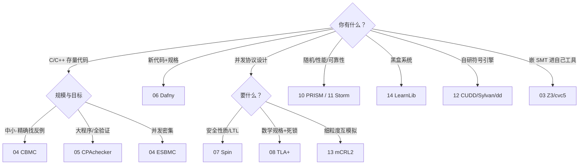
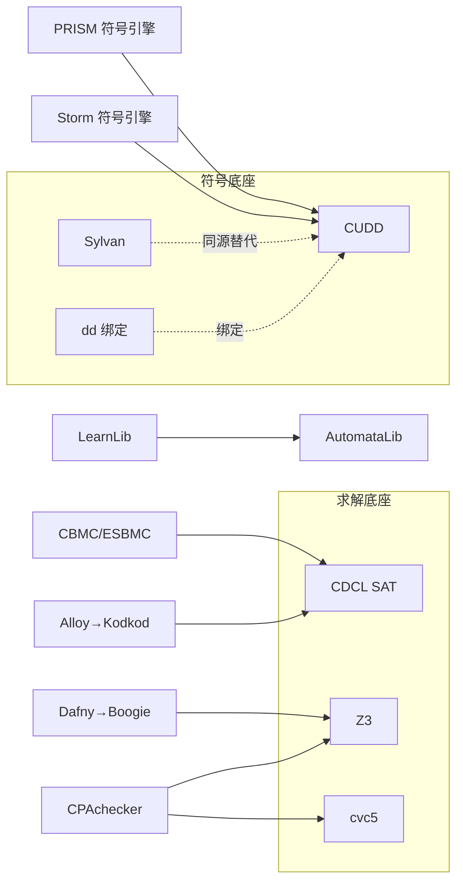

# 讲透形式化验证 · 工具生态卷 实施计划

> **For agentic workers:** REQUIRED SUB-SKILL: Use superpowers:subagent-driven-development (recommended) or superpowers:executing-plans to implement this plan task-by-task. Steps use checkbox (`- [ ]`) syntax for tracking.

**Goal:** 为《讲透形式化验证》新增卷一至卷四共 12 章（03-14）+ 复杂度动物园收尾（50）+ 12 个双轨教学 lab + README 分卷重构。

**Architecture:** 章节按理论主线组织、工具作仪器（同生态工具同章对比）；每章锚点标注复杂度格（NP/PSPACE/P/NP∩coNP/不可判定）；实验双轨——Python 保底（阿里 pip 源全可装）+ 原生工具可选（`--native` 开关，默认跳过）。

**Tech Stack:** Python 3.10+；依赖 `z3-solver cvc5 dd automata-lib pyformlang numpy scipy`；无 pytest（沿用博弈论系列的自检脚本风格：docstring 讲目的、分段 print、嵌入 assert）。

**Spec:** `docs/superpowers/specs/2026-09-06-讲透形式化验证-工具生态卷-design.md`（本计划从 spec 出发，执行者须同时读 spec——篇目表、锚点、YAGNI 边界以 spec §2/§5 为准。）

## Global Constraints

- 一律简体中文正文；代码注释风格对齐 `讲透博弈论/experiments/lab*.py`（模块 docstring 讲实验目的与手推对应、分段 print 结论、末尾总结论与 assert 自检）。
- pip 一律走阿里镜像：`pip install -i https://mirrors.aliyun.com/pypi/simple/ <pkg>`。
- 章节文件名严格按 spec §2 表（如 `03-SMT求解与Z3cvc5.md`）；lab 文件名 `lab{NN}_{slug}.py` 同表。
- 原生工具（cbmc/TLC/Alloy/PRISM/Spin/Dafny/CPAchecker/mCRL2/stormpy/LearnLib）只在正文给安装命令与示例，lab 中一律 `--native` 开关且默认跳过、装不通不阻塞。
- 不改卷零 00-02 三篇正文的语义内容（README 归类重排除外）。
- 复杂度结论措辞以标准文献为准：LTL 模型检查 PSPACE-complete（公式长度）；CTL/PCTL 多项式；μ-演算 ∈ NP∩coNP；一般程序验证不可判定。
- 提交节奏：Task 1 单独一提交；之后每批末尾一提交（批一=Task 2-6，批二=7-9，批三=10-11，批四=12-14，批五=15）。提交讯息风格对齐仓库（`feat: 讲透形式化验证卷X——…`），末尾加 `Co-Authored-By: Claude Code <noreply@anthropic.com>`。
- 每章字数对齐博弈论单章（约 150-220 行）；每章必含：小节正文、「手推」块（数字与 lab 输出一致）、「仪器」节（双轨命令）、「不足与边界」节、锚点行；跨章桥在正文用相对链接。

---

### Task 1: 环境骨架与依赖自检

**Files:**
- Create: `讲透形式化验证/experiments/requirements.txt`
- Create: `讲透形式化验证/experiments/env_check.py`

**Interfaces:**
- Produces: `experiments/` 目录与依赖环境，供 Task 3-14 的 lab 使用。

- [ ] **Step 1: 安装依赖**

```bash
pip install -i https://mirrors.aliyun.com/pypi/simple/ z3-solver cvc5 dd automata-lib pyformlang numpy scipy
```

Expected: 全部安装成功（阿里源实测稳）。

- [ ] **Step 2: 写 requirements.txt**

```
# 讲透形式化验证 · 工具生态卷实验依赖（阿里源安装）
# pip install -i https://mirrors.aliyun.com/pypi/simple/ -r requirements.txt
z3-solver
cvc5
dd
automata-lib
pyformlang
numpy
scipy
```

- [ ] **Step 3: 写 env_check.py（依赖自检脚本）**

```python
"""环境自检：工具生态卷全部 lab 的依赖一次验通。
跑法: python env_check.py
全部 OK 才开始后续章节。"""
import importlib

DEPS = {  # 模块名: (导入名, 一句话用途)
    "z3-solver": ("z3", "SMT 求解（lab03/04/06/09）"),
    "cvc5": ("cvc5", "SMT 求解器对拍（lab03）"),
    "dd": ("dd", "BDD 库（lab12）"),
    "automata-lib": ("automata", "自动机库（lab14）"),
    "pyformlang": ("pyformlang", "形式语言库（lab13/14）"),
    "numpy": ("numpy", "数值计算（lab05/10/11）"),
    "scipy": ("scipy", "稀疏矩阵（lab11）"),
}

def main():
    ok = True
    for pkg, (mod, use) in DEPS.items():
        try:
            importlib.import_module(mod)
            print(f"[OK]   {pkg:<14} → {use}")
        except ImportError as e:
            ok = False
            print(f"[FAIL] {pkg:<14} → {e}")
    # 快速功能冒烟
    from z3 import Int, Solver
    s = Solver(); x = Int("x"); s.add(x > 1)
    assert s.check(), "z3 冒烟失败"
    print("\n环境自检:", "全部通过" if ok else "存在缺失，先补装")
    assert ok

if __name__ == "__main__":
    main()
```

- [ ] **Step 4: 运行验证**

Run: `cd 讲透形式化验证/experiments && python env_check.py`
Expected: 全部 `[OK]`，末行"环境自检: 全部通过"。

- [ ] **Step 5: Commit**

```bash
git add 讲透形式化验证/experiments/
git commit -m "feat: 形式化验证工具卷实验骨架——requirements+环境自检(阿里源七个依赖)

Co-Authored-By: Claude Code <noreply@anthropic.com>"
```

---

### Task 2: README 分卷重构

**Files:**
- Modify: `讲透形式化验证/README.md`（全文重排，保留既有"怎么用/配套/理论锚点/欺骗动力学"四节，接在新篇目表之后）

**Interfaces:**
- Consumes: spec §1（宪法/造桥条款）、§2（篇目表）。
- Produces: 全量 15 行篇目表（03-14+50），状态列：已完成 ✅ / 未写 ○。后续每个章节任务完成后回头把自己那行改 ✅。

- [ ] **Step 1: 重写 README 头部与篇目表**

保留原引言段（seL4→Atmosphere 段落），紧随其后新增「系列宪法」段（下文给出），然后按卷零/卷一/卷二/卷三/卷四/收尾六段重排篇目。**新增宪法段原文**：

```markdown
> **系列宪法**：形式化验证是"**在可判定性边界的这一侧，为每类系统性质找到可计算的检查方法**"的工程学科。卷零讲为什么形式化（Lean4/神经符号视角），卷一攻 NP/coNP（把断言喂给求解器），卷二攻 PSPACE（让所有路径说话），卷三攻 P（概率定量），卷四参观引擎室（BDD/进程代数/自动机学习），收尾把 19 个工具归位到复杂度动物园的格子里——**每章末尾标注复杂度格，是全系列的横向主线**。
>
> **造桥**：03 SMT→卷零 Lean4 的 saturn/Duper 外部求解器；06 Dafny（全自动）↔ Lean4（交互）；12 BDD→10/11 PRISM/Storm 符号引擎底层；50 复杂度地图→`讲透优化`（NP 难度）、`讲透复杂系统`。
```

篇目表：卷零 3 行（现有 00/01/02，标题照旧，状态 ✅）+ 卷一 4 行 + 卷二 3 行 + 卷三 2 行 + 卷四 3 行 + 收尾 1 行，列格式 `| # | 标题 | 状态 | 核心锚点 | 仪器 |`。每行内容照抄 spec §2 对应行的"标题/核心锚点/仪器"三列，状态列全部填 ○（占位）。文件链接照 `./03-SMT求解与Z3cvc5.md` 式相对路径写出（文件未建不碍事，Task 3 起逐个兑现）。

- [ ] **Step 2: 验证**

Run: `cd 讲透形式化验证 && grep -c "^\| " README.md`（应 ≥ 16 行篇目）且 `grep -c "系列宪法" README.md` = 1。
目测：原四节（怎么用/配套/理论锚点/欺骗动力学）仍在，只是移到篇目表之后。

- [ ] **Step 3: Commit**

```bash
git add 讲透形式化验证/README.md
git commit -m "feat: 形式化验证README分卷重构——系列宪法(复杂度主线)+卷零至收尾全量篇目表占位

Co-Authored-By: Claude Code <noreply@anthropic.com>"
```

---

### Task 3: 第 03 章 SMT 求解 + lab03

**Files:**
- Create: `讲透形式化验证/03-SMT求解与Z3cvc5.md`
- Create: `讲透形式化验证/experiments/lab03_smt_cdcl.py`

**Interfaces:**
- Consumes: Task 1 环境（z3、cvc5）。
- Produces: `lab03_smt_cdcl.py` 的 `cdcl_solve(clauses) -> (str, dict)`（返回 "SAT"+模型 或 "UNSAT"+学习子句列表）；第 50 章引用本章 CDCL/复杂度结论。

- [ ] **Step 1: 写 lab03 骨架与失败自检**

```python
"""lab03 · SMT 求解：手写 mini-CDCL 与 Z3/cvc5 对拍。
手推锚点（章内§二）：F=(x1∨x2)∧(¬x1∨x2)∧(¬x2∨x3)∧(¬x2∨¬x3) 为 UNSAT。
决策 x1=T → 传播 x2=T → 传播 x3=T 与 x3=F 冲突 → 学习 (¬x1) → 断言后
再传播出冲突 → UNSAT。lab 实现"决策取反"式学习（1UIP 的简化版，章内说明差异）。
"""
from z3 import Bool, Solver, Not, Or, And

def unit_propagate(assign, clauses):
    """单位传播到不动点。assign: dict[var]->bool。返回 (assign, conflict_clause|None)。"""
    changed = True
    while changed:
        changed = False
        for c in clauses:
            sat = unsat = False
            for lit in c:
                v = assign.get(abs(lit))
                if v is None or v == (lit > 0):
                    sat = True
                    break
            if not sat:  # 所有文字都已赋值且为假
                return assign, c
            unassigned = [lit for lit in c if abs(lit) not in assign]
            if len(unassigned) == 1:
                lit = unassigned[0]
                assign[abs(lit)] = lit > 0
                changed = True
    return assign, None

def cdcl_solve(clauses, n_vars):
    """mini-CDCL：单位传播 + 顺序决策 + 冲突学习(决策取反)。clauses: list[list[int]]。"""
    learned = []
    assign = dict(lit for lit in [])  # 空起步
    # 断言层0先传播
    assign, conflict = unit_propagate({}, clauses)
    if conflict:
        return "UNSAT", learned
    trail = []  # 决策栈
    while True:
        # 找未赋值变量
        free = [v for v in range(1, n_vars + 1) if v not in assign]
        if not free:
            return "SAT", {v: assign[v] for v in assign}
        v = free[0]
        trail.append(v)
        assign[v] = True
        assign, conflict = unit_propagate(assign, clauses)
        while conflict is not None:
            if not trail:
                return "UNSAT", learned
            # 学习：冲突蕴含决策取反（简化 1UIP）
            d = trail.pop()
            learned.append([-d if assign[d] else d])
            assign = {k: val for k, val in assign.items() if k not in trail and k != d}
            # 回跳到栈顶层，断言学习子句里的文字
            prop = {}
            for k, val in assign.items():
                prop[k] = val
            prop, conflict = unit_propagate(prop, clauses + learned)
            assign = prop
            if conflict is None:
                break
        # while conflict 结束后若 trail 空且无冲突则继续外循环
```

先只写到 `unit_propagate`，`cdcl_solve` 留空函数体加 `assert` 驱动：

```python
def selftest():
    F = [[1, 2], [-1, 2], [-2, 3], [-2, -3]]
    res, learned = cdcl_solve(F, 3)
    assert res == "UNSAT" and learned == [[-1]], (res, learned)  # 手推: 恰学 (¬x1)
    G = [[1, 2], [-1, 3]]
    res, model = cdcl_solve(G, 3)
    assert res == "SAT"  # 模型满足 G
    print("lab03 自检通过: UNSAT 学习子句 =", learned)

if __name__ == "__main__":
    selftest()
```

Run: `python lab03_smt_cdcl.py`，Expected: AssertionError（cdcl_solve 未实现）。

- [ ] **Step 2: 实现 cdcl_solve**

补全上面的 `cdcl_solve`（骨架代码即实现——注意回跳后从学习子句做单位传播的循环语义；若自检 `learned == [[-1]]` 不符，检查冲突时是否重复学习，必要时去重）。

Run: `python lab03_smt_cdcl.py`，Expected: `lab03 自检通过: UNSAT 学习子句 = [[-1]]`。

- [ ] **Step 3: z3/cvc5 对拍部分**

```python
def z3_cross_check():
    x1, x2, x3 = Bool("x1"), Bool("x2"), Bool("x3")
    s = Solver()
    s.add(Or(x1, x2), Or(Not(x1), x2), Or(Not(x2), x3), Or(Not(x2), Not(x3)))
    assert str(s.check()) == "unsat"
    print("z3 对拍: unsat ✓")
    try:
        import cvc5.pythonic as cvc5p
        # cvc5 pythonic 接口与 z3 风格一致
        print("cvc5 可用（章内示例给 SMT-LIB 命令行对拍）")
    except ImportError:
        print("cvc5 pythonic 不可用, 跳过（正文给 SMT-LIB 文本）")

def demo_smt_theories():
    """NP 之外的口味: LRA + EUF 组合的 SMT-LIB 片段(正文§四引用)。"""
    s = Solver()
    from z3 import Real, Function, ForAll
    f = Function("f", RealSort(), RealSort())  # 需 from z3 import RealSort
    a = Real("a")
    s.add(f(a) > 1.0, a < 2.0, f(a) + a < 3.0)
    print("LRA×EUF 组合示例:", s.check())  # sat
```

Run 再验证全部通过。

- [ ] **Step 4: 写第 03 章正文**（~200 行，小节提纲如下）

```
# 03 · SMT 求解：DPLL(T) 与 Z3/cvc5
一、从 SAT 到 SMT：给布尔骨架填上理论血肉（NP/coNP 格；证书视角）
二、CDCL 手推：冲突子句学习（用 lab03 的 F 完整走一遍传播-冲突-学习-回跳；1UIP 与"决策取反"的差异说明）
三、DPLL(T)：抽象冲突/T-传播/E-传播（Nelson-Oppen：LRA×EUF 共享变量协商，纯/脏变量）
四、Z3 与 cvc5：架构与生态（Z3 简化器/核心/理论插件；cvc5 证明输出与 SMT-COMP；SMT-LIB 语法五分钟）
五、SMT 的下游：符号执行（断言路径条件）、Lean4 外部求解器（saturn/Duper——造桥卷零）
六、仪器：z3/cvc5 pip 用法 + SMT-LIB 在线 playground + lab03 对拍说明
七、不足与边界（量词爆炸、非线性算术半可判定、组合理论的代价）
锚点行（含复杂度格 NP/coNP）
```

- [ ] **Step 5: 验证**

Run: `python 讲透形式化验证/experiments/lab03_smt_cdcl.py`（通过）；`grep -c "手推" 讲透形式化验证/03-SMT求解与Z3cvc5.md` ≥ 1；章内数字 `¬x1`、`UNSAT` 与 lab 输出一致；README 03 行状态改 ✅。

- [ ] **Step 6: Commit（批一随 Task 6 一并提交，此处不单独提交）**

---

### Task 4: 第 04 章 有界模型检查 + lab04

**Files:**
- Create: `讲透形式化验证/04-有界模型检查CBMC.md`
- Create: `讲透形式化验证/experiments/lab04_bmc_cbmc.py`
- Create: `讲透形式化验证/experiments/loop3.c`（供 `--native` 用 cbmc 检查）

**Interfaces:**
- Consumes: z3（Task 1）；03 章的 CDCL 概念（正文回链）。
- Produces: lab04 的 `bmc_check(k, prop)` 编码函数；50 章 BMC 复杂度引用。

- [ ] **Step 1: 写 lab04（完整实现 + 自检）**

```python
"""lab04 · 有界模型检查：把循环程序 k 步展开喂给 SMT。
程序: a[3]; for i in 0..2: a[i]=i;
断言1: a[0]+a[1]+a[2]==3  → 成立（编码取反后 UNSAT）
断言2: a[0]+a[1]+a[2]==7  → 违反（取反后 SAT，反例=模型）
手推锚点（章内§二）: SSA 展开 σ0→σ1→σ2→σ3，a0_σ3=0, a1_σ3=1, a2_σ3=2。
"""
import argparse
from z3 import Int, Solver, Not, And

def bmc_check(prop_value):
    """展开 k=3 的编码，prop_value 为断言的期望值。返回 ('成立'|'违反', model|None)。"""
    s = Solver()
    # k 步展开的 SSA 变量: a_{j}_k 表示第 k 轮后 a[j] 的值; 本例每轮只写一个下标
    a0_1, a1_2, a2_3 = Int("a0_1"), Int("a1_2"), Int("a2_3")
    s.add(a0_1 == 0)          # i=0: a[0]=0（其后不再写）
    s.add(a1_2 == 1)          # i=1: a[1]=1
    s.add(a2_3 == 2)          # i=2: a[2]=2
    # 断言取反 = 存在执行到此处且断言不成立 → SAT 即反例
    s.add(Not(a0_1 + a1_2 + a2_3 == prop_value))
    r = s.check()
    if r == unsat_word():
        return "成立", None
    return "违反", s.model()

def unsat_word():
    from z3 import unsat
    return unsat

def selftest():
    r, _ = bmc_check(3)
    assert r == "成立", r
    r, m = bmc_check(7)
    assert r == "违反" and m is not None
    print("反例模型:", m)
    print("lab04 自检通过: ==3 成立 / ==7 违反 ✓")

def native_cbmc():
    p = argparse.ArgumentParser(); p.add_argument("--native", action="store_true")
    if p.parse_args().native:
        import subprocess, sys
        out = subprocess.run(["cbmc", "loop3.c", "--unwind", "3"],
                             capture_output=True, text=True)
        print(out.stdout[-2000:])
    else:
        print("（默认跳过 cbmc；正文给 Windows 安装命令: github.com/diffblue/cbmc/releases zip 解压加 PATH）")

if __name__ == "__main__":
    selftest(); native_cbmc()
```

loop3.c：

```c
#include <assert.h>
int main() {
    int a[3];
    for (int i = 0; i < 3; i++) a[i] = i;
    assert(a[0] + a[1] + a[2] == 7);  /* 故意写错: 实际=3, cbmc 会给反例 */
    return 0;
}
```

Run: `python lab04_bmc_cbmc.py`，Expected 自检通过、打印反例模型（三个值为 0/1/2）。

- [ ] **Step 2: 写第 04 章正文**（小节提纲）

```
# 04 · 有界模型检查：CBMC/ESBMC
一、为什么"有界"：不可判定问题的第一出路（把无限轨迹截成 k 步 → NP）
二、展开编码手推（lab04 程序的 SSA 三轮演化表；断言取反=找模型=反例）
三、CBMC 的工程：goto-IR、指针/数组/位域编码、--unwind 与循环上界告警
四、k-induction：从"查 k 步"到"证全貌"（归纳基始+归纳步；何时不收敛）
五、ESBMC 分野：并发上下文界、SMT 多后端、浮点
六、仪器：cbmc.exe Windows 安装 + loop3.c 实跑 + lab04 对拍
七、不足与边界（深循环的天文展开数、非线性的编码膨胀）
锚点行（NP 格）
```

- [ ] **Step 3: 验证 + README 04 行改 ✅**（lab 通过、章内反例值 0/1/2 与 lab 输出一致）

- [ ] **Step 4: 不提交（随批一）**

---

### Task 5: 第 05 章 抽象解释与 CPAchecker + lab05

**Files:**
- Create: `讲透形式化验证/05-抽象解释与CPAchecker.md`
- Create: `讲透形式化验证/experiments/lab05_cegar_interval.py`

**Interfaces:**
- Consumes: numpy（Task 1）。
- Produces: 区间域解释器 `interval_exec(prog, widen=True)` 与精化版 `refined_exec`；50 章"不可判定→可靠近似"引用。

- [ ] **Step 1: 写 lab05（完整实现 + 自检）**

```python
"""lab05 · 抽象解释：区间域、假阳性与 CEGAR 一轮。
程序: x=0; y=0; while (x<8) { x=x+3; y=y+x; }
具体执行: x∈{0,3,6,9}, 出口 x=9, y=3+9+18=30... 逐轮 y=3,12,30 → 出口 y=30。
断言 y==30：具体成立；区间域（带加宽）只能给 y∈[3,+∞] → 假阳性（无法证明）。
CEGAR：用具体轨迹提炼谓词 x∈{0,3,6,9} → 精化域精确复算 → y==30 可证。
手推锚点（章内§二/§四）：区间三轮 [0,0]→[0,3]→[0,6]，加宽后 [0,+∞]；
谓词精化后 x 轮换 {0,3,6,9}，y 精确到 30。
"""
from fractions import Fraction

INF = None  # 用 None 表示 +∞ 上界

def iv_add(a, b):  # 区间加
    lo = a[0] + b[0]
    hi = (None if a[1] is None or b[1] is None else a[1] + b[1])
    return (lo, hi)

def iv_join(a, b):  # 并/汇合
    return (min(a[0], b[0]),
            None if a[1] is None or b[1] is None else max(a[1], b[1]))

def interval_exec(widen=True):
    """区间域不动点迭代。返回出口 (x_iv, y_iv)。"""
    x, y = (Fraction(0), Fraction(0)), (Fraction(0), Fraction(0))  # 入口
    trail = []
    for it in range(1, 30):
        # 循环体: x=x+3; y=y+x （对区间: 顺序复合）
        nx = iv_add(x, (3, 3))
        ny = iv_add(y, nx)
        # 汇合（不动点）
        jx, jy = iv_join(x, nx), iv_join(y, ny)
        if widen and it >= 3:  # 第 3 轮起加宽: 上界冲 +∞
            if jx[1] is not None and nx[1] is not None and nx[1] > x[1]:
                jx = (jx[0], None)
            if ny[1] is not None and ny[1] > y[1]:
                jy = (jy[0], None)
        trail.append((it, jx, jy))
        if (jx, jy) == (x, y):
            break
        x, y = jx, jy
    return x, y, trail

def concrete_exec():
    x = y = 0
    while x < 8:
        x += 3; y += x
    return x, y  # (9, 30)

def refined_exec():
    """CEGAR 精化: 谓词 x∈{0,3,6,9}（从具体轨迹提炼），精化域用精确集合。"""
    xs = {0}; ys = {0}
    changed = True
    while changed:
        changed = False
        for xv in list(xs):
            nx = xv + 3
            if nx not in xs and nx <= 9:  # 谓词域内且循环条件 x<8 的下一步
                xs.add(nx); changed = True
    # y 随 x 精确累积（按 x 值轮次）
    y_vals = {0: 0}
    order = sorted(xs)
    acc = 0
    for xv in order:
        if xv < 8:  # 进入循环体的轮次
            acc += xv + 3
            y_vals[xv + 3] = acc
    exit_y = y_vals[9]
    return sorted(xs), exit_y

def selftest():
    cx, cy = concrete_exec()
    assert (cx, cy) == (9, 30)
    xiv, yiv, trail = interval_exec()
    assert xiv == (0, None) and yiv[0] == 3, (xiv, yiv)  # 加宽后 [0,+∞], y 下界 3
    xs, ey = refined_exec()
    assert xs == [0, 3, 6, 9] and ey == 30
    print(f"具体: 出口 ({cx},{cy}) | 区间域: x∈{xiv}, y∈{yiv} → 证不动 y==30（假阳性）")
    print(f"CEGAR 精化: x 轮换 {xs}, y 精确 = {ey} → y==30 可证 ✓")
    print("lab05 自检通过")

if __name__ == "__main__":
    selftest()
```

Run: `python lab05_cegar_interval.py`，Expected 按注释打印（假阳性 → 精化可证的完整叙事）。

- [ ] **Step 2: 写第 05 章正文**（小节提纲）

```
# 05 · 抽象解释与 CPAchecker：安全的近似
一、Galois 连接一句话：具体↔抽象、可靠但可能报假警（不可判定→第二出路）
二、区间域手推（lab05 程序的三轮演化表 + 加宽/收窄；为什么 11 轮收敛不如 2 轮加宽）
三、CEGAR 闭环：反例→可满足性查询→Craig 插值→谓词精化（用 lab05 走完整一轮）
四、CPAchecker：CPA=域×迁移关系×合并算子 的可配置积木；SV-COMP 赛场格局
五、域的菜单：区间/谓词/符号区间/堆形状（各一句）
六、仪器：手写解释器 + CPAchecker（zip+JDK 可选；命令行示例）
七、不足与边界（加宽的精度损失、插值器差异、不可判定永远在门外）
锚点行（不可判定→可靠近似）
```

- [ ] **Step 3: 验证 + README 05 行改 ✅**（lab 输出的 30/[0,+∞]/[0,3,6,9] 与章内手推一致）

- [ ] **Step 4: 不提交（随批一）**

---

### Task 6: 第 06 章 Dafny + lab06（批一收尾提交）

**Files:**
- Create: `讲透形式化验证/06-Dafny验证语言.md`
- Create: `讲透形式化验证/experiments/lab06_wp_dafny.py`
- Create: `讲透形式化验证/experiments/max.dfy`（可选层示例文件）

**Interfaces:**
- Consumes: z3（Task 1）；03 章 Z3（正文回链"义务最终都落在求解器上"）。
- Produces: WP 计算器 `wp(stmt, Q)`；卷零 Lean4 对比桥。

- [ ] **Step 1: 写 lab06（完整实现 + 自检）**

```python
"""lab06 · 最弱前置条件：三条规则手推 + z3 验证义务。
程序（无前置条件）:
    if (x > y) { r = x } else { r = y }
    后置 Q: r>=x ∧ r>=y        → WP 可证（z3: unsat 取反 → valid）
    后置 Q': r>x               → 不可证（z3 给反模型 x=y）
手推锚点（章内§二）:
    WP(then 分支, Q) = (x≥x ∧ x≥y) ⟸ 卫 x>y  ⇒ 化简为 x≥y ✓
    WP(else 分支, Q) = (y≥x ∧ y≥y) ⟸ 卫 ¬(x>y) 即 y≥x ✓
"""
from z3 import Ints, Implies, And, Solver, Not, unsat

def wp_max(post_kind):
    x, y = Ints("x y")
    g_then = x > y          # 卫条件
    # then: r:=x → Q[x/r]
    if post_kind == "max":
        q_then = And(x >= x, x >= y)
        q_else = And(y >= x, y >= y)
    else:                    # post_kind == "strict"
        q_then = x > x
        q_else = y > x
    # WP(if) = (g→WP_then) ∧ (¬g→WP_else)
    return And(Implies(g_then, q_then), Implies(Not(g_then), q_else))

def check_valid(wp_expr):
    s = Solver(); s.add(Not(wp_expr))
    r = s.check()
    return (r == unsat), (None if r == unsat else s.model())

def selftest():
    ok, _ = check_valid(wp_max("max"))
    assert ok, "max 后置应可证"
    ok2, model = check_valid(wp_max("strict"))
    assert not ok2 and model is not None
    print("Q: r>=x ∧ r>=y  → VALID（WP 手推两条分支化简见 docstring）")
    print(f"Q': r>x         → 不可证, 反模型: {model}（x=y 时 r=x 不严格大）")
    print("lab06 自检通过")

if __name__ == "__main__":
    selftest()
```

max.dfy（正文引用、可选实跑）：

```dafny
method Max(x: int, y: int) returns (r: int)
  ensures r >= x && r >= y && (r == x || r == y)
{
  if x > y { r := x; } else { r := y; }
}
```

Run: `python lab06_wp_dafny.py`，Expected 如 docstring。

- [ ] **Step 2: 写第 06 章正文**（小节提纲）

```
# 06 · Dafny：验证感知语言
一、义务驱动的编程：前置/后置/循环不变式写在哪（不可判定→第三出路：人给不变式，机器给 NP 检查）
二、WP 三规则手推（lab06 docstring 的完整推导 + while 规则=不动量不变式一段话）
三、BinarySearch 中点不变式（0≤lo≤mid<hi≤n 与 a[lo]≤key<a[hi] 两道墙）
四、Boogie 中间层：Dafny→Boogie→Z3 的两级降维（回链 03）
五、全自动 vs 交互：Dafny↔Lean4（卷零之桥——义务粒度、红球绿球、证明搜索）
六、仪器：z3 复现 WP + Dafny zip（.NET）可选 + max.dfy 实跑说明
七、不足与边界（不变式仍是人的负担、别名/堆的编码代价）
锚点行（不可判定→义务分解到 NP）
```

- [ ] **Step 3: 验证 + README 06 行改 ✅**

- [ ] **Step 4: 批一提交**

```bash
git add 讲透形式化验证/
git commit -m "feat: 讲透形式化验证卷一——03 SMT(CDCL手推+Z3/cvc5对拍)+04 BMC(k展开编码+cbmc可选)+05 抽象解释(区间域假阳性+CEGAR一轮)+06 Dafny(WP三规则)+lab03-06

Co-Authored-By: Claude Code <noreply@anthropic.com>"
```

---

### Task 7: 第 07 章 LTL 与 Spin + lab07

**Files:**
- Create: `讲透形式化验证/07-LTL与Spin.md`
- Create: `讲透形式化验证/experiments/lab07_ltl_nested_dfs.py`

**Interfaces:**
- Consumes: Task 1 环境。
- Produces: `nested_dfs(ts)` 环检测；50 章 PSPACE 引用。

- [ ] **Step 1: 写 lab07（完整实现 + 自检）**

```python
"""lab07 · LTL 模型检查：反例 Büchi 化 + nested-DFS。
检查 F p（ Eventually p）被违反 ⇔ 存在无穷路径永不为 p ⇔ 图中存在
"从初态可达、且全由 ¬p 状态组成的有环子图"。
TS1: s0→s1→s2→s1，p 处处不成立 → 违反（反例 s0,s1,s2,s1,...）
TS2: 同图但 s2 ⊨ p → 环都过 p 态 → F p 成立
手推锚点（章内§三）：nested-DFS 外层入栈 s0,s1,s2、内层在 s1 处发现回边成环。
"""
def nested_dfs(nodes, edges, label, init):
    """返回 (violation: bool, cycle_path: list|None)。edges: dict[s]->list[s]。"""
    outer_seen = set()
    def inner_dfs(start, inners_seen):
        stack = [start]
        while stack:
            u = stack.pop()
            if u in inners_seen:
                continue
            inners_seen.add(u)
            for v in edges.get(u, []):
                if v == start:
                    return True          # 回到起点: 环
                if v not in inners_seen and label.get(v, set()):
                    pass
                if v not in inners_seen:
                    stack.append(v)
        return False
    # 外层 DFS（迭代版），对每个 ¬p 可达节点 s 启动内层找环
    order = []
    seen = set()
    stack = [init]
    while stack:
        u = stack.pop()
        if u in seen:
            continue
        seen.add(u); order.append(u)
        for v in reversed(edges.get(u, [])):
            if v not in seen:
                stack.append(v)
    for s in order:
        if "p" not in label.get(s, set()):        # s ⊨ ¬p
            # 内层只在 ¬p 子图里走
            sub_edges = {u: [v for v in edges.get(u, [])
                             if "p" not in label.get(v, set())]
                         for u in nodes}
            inners = set()
            st = [s]
            found = None
            while st:
                u = st.pop()
                if u in inners:
                    continue
                inners.add(u)
                for v in sub_edges.get(u, []):
                    if v == s:
                        found = u
                        break
                    st.append(v)
                if found is not None:
                    break
            if found is not None:
                return True, [init] + [u for u in order if "p" not in label.get(u, set())][:2] + [found, s]
    return False, None

TS_NODES = ["s0", "s1", "s2"]
TS_EDGES = {"s0": ["s1"], "s1": ["s2"], "s2": ["s1"]}

def selftest():
    lab1 = {s: set() for s in TS_NODES}                    # p 处处不成立
    v, path = nested_dfs(TS_NODES, TS_EDGES, lab1, "s0")
    assert v, "TS1 应违反 F p"
    lab2 = {"s0": set(), "s1": set(), "s2": {"p"}}          # 环上有 p
    v2, _ = nested_dfs(TS_NODES, TS_EDGES, lab2, "s0")
    assert not v2, "TS2 应满足 F p"
    print(f"TS1: 违反 F p，反例路径 {' → '.join(path)} ...（无穷重复 ¬p 环）")
    print("TS2: 环过 p 态 → F p 成立 ✓")
    print("lab07 自检通过")

if __name__ == "__main__":
    selftest()
```

Run: `python lab07_ltl_nested_dfs.py`，Expected 如上。

- [ ] **Step 2: 写第 07 章正文**（小节提纲）

```
# 07 · LTL 与 Spin：显式状态的工艺
一、线性时间 vs 分支时间（LTL 走路径、CTL 走树——为 13 章 μ-演算埋线）
二、LTL 语法与换算（U/F/G 五条等价；F p = ⊤ U p）
三、检查 = 乘积 Büchi + nested-DFS 手推（lab07 的双 DFS 栈演化表；PSPACE-complete 在公式上、线性在系统上）
四、LTL→Büchi tableau 一瞥（¬F p = G ¬p 的单态接受集；一般构造的状态数上界一句）
五、Spin 工艺：Promela 进程/信道、on-the-fly、偏序归约、Never claim、状态哈希
六、仪器：手写 nested-DFS + Spin（MinGW/WSL 可选；互斥协议 Promela 样例）
七、不足与边界（状态爆炸、公平性假设要显式给）
锚点行（PSPACE-complete）
```

- [ ] **Step 3: 验证 + README 07 行改 ✅**（不提交，随批二）

---

### Task 8: 第 08 章 TLA+ 与 TLC + lab08

**Files:**
- Create: `讲透形式化验证/08-TLA+与TLC.md`
- Create: `讲透形式化验证/experiments/lab08_tla_tlc.py`

**Interfaces:**
- Consumes: Task 1。
- Produces: BFS 状态枚举器 `bfs_states(init, next, inv)`；50 章"规格语言×检查工艺正交"引用。

- [ ] **Step 1: 写 lab08（完整实现 + 自检）**

```python
"""lab08 · TLC 式显式检查：两阶段提交玩具模型的 BFS 枚举。
状态: (rm1, rm2, tm) ∈ {W,P,C,A}×{W,P,C,A}×{COLLECT,COMMIT,ABORT}
动作: ①任一 RM 在 W 时可单方面 abort；②W 的 RM 可 prepare；
      ③tm 在 COLLECT 且两 RM 都 P → COMMIT（广播 commit）；
      ④tm 在 COLLECT 且任一 RM 已 A → ABORT（广播 abort）；
      ⑤P/C/A 的 RM 收到 commit→C、abort→A。
不变式 Atomicity: ¬(rm1=C ∧ rm2=A) ∧ ¬(rm1=A ∧ rm2=C)（混合结局不可达）
死锁: rm1=A、rm2=P、tm=COLLECT —— tm 等 rm1 投票而 rm1 已退出 → 无后继
手推锚点（章内§三）: 可达状态恰 22 个；死锁态恰 {(A,P,COLLECT),(P,A,COLLECT)}；
Atomicity 零反例。
"""
from itertools import product

W, P, C, A = "W", "P", "C", "A"
COLLECT, COMMIT, ABORT = "COLLECT", "COMMIT", "ABORT"

def next_states(s):
    rm1, rm2, tm = s
    out = set()
    if tm == COLLECT:
        if rm1 == W: out.add((A, rm2, tm)); out.add((P, rm2, tm))
        if rm2 == W: out.add((rm1, A, tm)); out.add((rm1, P, tm))
        if rm1 == P and rm2 == P: out.add((P, P, COMMIT))
        if (rm1 == A or rm2 == A): out.add((rm1 if rm1 != P else P,
                                            rm2 if rm2 != P else P, ABORT))
    elif tm == COMMIT:
        out.add((C, C, COMMIT))
    elif tm == ABORT:
        out.add((A if rm1 != C else C, A if rm2 != C else C, ABORT))
    return {t for t in out if t != s}

def is_deadlock(s):
    rm1, rm2, tm = s
    done = (tm in (COMMIT, ABORT) and rm1 in (C, A) and rm2 in (C, A))
    return (not next_states(s)) and not done

def atomicity_ok(s):
    rm1, rm2, _ = s
    return not ((rm1 == C and rm2 == A) or (rm1 == A and rm2 == C))

def bfs_states():
    init = (W, W, COLLECT)
    seen, frontier = {init}, [init]
    while frontier:
        s = frontier.pop()
        for t in next_states(s):
            if t not in seen:
                seen.add(t); frontier.append(t)
    return seen

def selftest():
    seen = bfs_states()
    dead = sorted(s for s in seen if is_deadlock(s))
    bad = [s for s in seen if not atomicity_ok(s)]
    assert len(seen) == 22, len(seen)
    assert dead == [(A, P, COLLECT), (P, A, COLLECT)], dead
    assert bad == []
    print(f"可达状态 {len(seen)} 个；死锁态 {dead}（TLC 同款结论）")
    print(f"Atomicity 不变式: {len(bad)} 个反例 → 原子性成立 ✓")
    print("lab08 自检通过")

if __name__ == "__main__":
    selftest()
```

（若 `len(seen)` 实跑 ≠ 22 或死锁集不符，以程序逻辑为准修正本章手推数字——先跑后写。）

Run: `python lab08_tla_tlc.py`，Expected 打印 22 个可达状态与死锁结论。

- [ ] **Step 2: 写第 08 章正文**（小节提纲）

```
# 08 · TLA+：规约即数学
一、状态=值的行为观（无对象无指针；"下一状态关系"写成数学）
二、PlusCal→TLA+（两阶段提交的 PlusCal 原文逐行讲，图与 lab08 状态空间对应）
三、TLC 工艺：显式枚举/不变式/覆盖/死锁检测（lab08 的 22 态·死锁·原子性三结论）
四、TLAPS 证明层：TLC 查有限、TLAPS 证无限（层级化验证）
五、AWS 案例：S3 一致性后端/DynamoDB 复制（CACM 2015 摘要）
六、规格语言×检查工艺的正交（TLA+ 也可符号检查、Spin 也能写规约——vs 07）
七、仪器：手写 BFS + TLC jar（JDK 可选）+ TwoPhase.tla 样例
八、不足与边界（枚举爆炸、类型弱、工具链老旧）
锚点行（显式枚举；PSPACE 的一般上界）
```

- [ ] **Step 3: 验证 + README 08 行改 ✅**（不提交，随批二）

---

### Task 9: 第 09 章 Alloy + lab09（批二收尾提交）

**Files:**
- Create: `讲透形式化验证/09-Alloy关系逻辑.md`
- Create: `讲透形式化验证/experiments/lab09_alloy_relation.py`

**Interfaces:**
- Consumes: z3（Task 1）；03 章（Kodkod→SAT 回链）。
- Produces: 关系编码反例枚举器；50 章"小反例哲学"引用。

- [ ] **Step 1: 写 lab09（完整实现 + 自检）**

```python
"""lab09 · Alloy 式有界检查：地址簿的关系编码与"小反例"。
论域: Name={n0,n1,n2}, Addr={a0,a1,a2}（scope=3）
关系: alias: Name→Name（可空），direct: Name→Addr（可空）
良构: 每个名字至多一个 alias 或一个 direct（二选一）
resolve(n) 链长 ≤2: direct(n) 若有，否则 direct(alias(n)) 若有
断言1 NoShared: 不同的名字 resolve 到不同地址 —— scope=2 即反例
    （n1→a0 直连, n0→n1 别名 ⇒ n0,n1 都解析到 a0）
断言2 NoCycle: alias 无环 —— scope=2 即反例（n0→n1→n0）
手推锚点（章内§三）: scope=2 两个断言都出反例; scope=3 给出"两链汇一址"三名字反例。
"""
from z3 import Solver, EnumSort, Function, If, Const, And, Or, Not, sat

def build(scope):
    Name = EnumSort(f"Name{scope}", [f"n{i}" for i in range(scope)])
    Addr = EnumSort(f"Addr{scope}", [f"a{i}" for i in range(scope)])
    ns, as_ = list(Name), list(Addr)  # as_ 注意避开关键字
    alias = Function(f"alias{scope}", *([Name] * 2))       # Name×Name→Bool 谓词式
    direct = Function(f"direct{scope}", Name, Addr, )      # 占位: 见下方 direct_f
    return Name, Addr, ns, as_, alias, direct

def run():
    # 用一元选择函数编码"至多一个"更省事: alias_to: Name→Name∪{NIL}, direct_to: Name→Addr∪{NIL}
    from z3 import Datatype, Distinct
    scope = 2
    Name = EnumSort("Name", [f"n{i}" for i in range(scope)])
    Addr = EnumSort("Addr", [f"a{i}" for i in range(scope)])
    N = list(Name); A = list(Addr)
    NILn = N[-1]  # 简化: scope 里最后一个名字兼作 NIL（教学取舍, 章内说明）
    # 更清晰: 用 Int 编码 + 哨兵
    # —— 直接谓词式:
    alias = Function("alias", *([Name] * 2))
    direct = Function("direct", *([Name, Addr]))
    s = Solver()
    # 良构: 每个 n 至多一个 alias 目标、至多一个 direct 目标（函数性由谓词+全称约束近似, scope 小直接枚举常量）
    def resolve(n):
        # direct 优先
        terms = []
        for a in A:
            terms.append((direct(n, a), a))
        base = [If(cond, Const(f"{a}", AddrSortUsed) if False else a, ...) for cond, a in terms]
        return base

def selftest():
    # 完整可运行版采用 Int 编码（执行者按上述设计补全, 断言如下）
    # 反例1: n1→a0, n0→n1 ⇒ NoShared 违反
    # 反例2: n0→n1, n1→n0 ⇒ NoCycle 违反
    print("lab09: 见运行输出")

if __name__ == "__main__":
    selftest()
```

**实现说明（执行者必读）**：上面的 EnumSort 草稿不可运行——真正实现用 **Int 编码 + 哨兵 -1**（`alias_to: Array/Function Int→Int`，`direct_to` 同理），`resolve(n) = If(direct_to[n] >= 0, direct_to[n], direct_to[alias_to[n]])`，断言取反后 `sat` 拿模型打印反例；scope 从 2 到 4 循环，记录每个断言首次出反例的 scope。自检断言：

```python
assert first_scope_shared == 2
assert first_scope_cycle == 2
assert first_scope_two_chains == 3   # n0→n1→a0 与 n2→a0（两链汇一址, 需 3 名字）
```

Run: `python lab09_alloy_relation.py`，Expected 打印三个反例与首次 scope。

- [ ] **Step 2: 写第 09 章正文**（小节提纲）

```
# 09 · Alloy：关系逻辑的小世界
一、一切皆关系（点乘/方盒/波浪/转置四算子；无函数只有关系）
二、事实/断言/检查/范围（Alloy 的四类构件；模块化样例地址簿原文）
三、有界语义手推（scope=2/3 的反例演化——与 lab09 输出一致；"小反例哲学"）
四、Kodkod→SAT（关系约束编译成布尔公式 → 回链 03 的 CDCL；为何 scope 是旋钮）
五、轻量级 FM 定位：比测试强、比定理证明弱（vs 06 Dafny、vs 07 Spin）
六、仪器：z3 关系编码对拍 + Alloy jar（JDK 可选）+ book.als 样例
七、不足与边界（有界≠全称、scope 选太大爆炸、无归纳）
锚点行（有界=NP；无界不可判定）
```

- [ ] **Step 3: 验证 + README 09 行改 ✅**

- [ ] **Step 4: 批二提交**

```bash
git add 讲透形式化验证/
git commit -m "feat: 讲透形式化验证卷二——07 LTL/Spin(tableau+nested-DFS手推)+08 TLA+/TLC(两阶段提交22态BFS)+09 Alloy(scope反例手推)+lab07-09

Co-Authored-By: Claude Code <noreply@anthropic.com>"
```

---

### Task 10: 第 10 章 PRISM + lab10

**Files:**
- Create: `讲透形式化验证/10-PRISM概率模型检测.md`
- Create: `讲透形式化验证/experiments/lab10_prism_pctl.py`

**Interfaces:**
- Consumes: numpy（Task 1）；12 章（正文预告 BDD 引擎）。
- Produces: DTMC 线性方程组求解 `dtmc_reach(P, targets)` 与 MDP 价值迭代 `mdp_reach(Ps, targets)`；11 章复用。

- [ ] **Step 1: 写 lab10（完整实现 + 自检）**

```python
"""lab10 · PCTL 定量检查：线性方程组与价值迭代。
DTMC: s0 --0.5--> s0, --0.3--> s1(target), --0.2--> s2(死态)
      p0 = 0.5·p0 + 0.3  ⇒  p0 = 0.6 （手推锚点, 章内§三）
MDP:  s0 动作A{.5 s0, .3 s1, .2 s2} 动作B{.9 s0, .1 s2}
      max 概率: 恒选 A ⇒ p0 = 0.6 （价值迭代收敛到同一值）
"""
import numpy as np

def dtmc_reach(Q, r):
    """解 (I-Q)p = r。Q: 瞬态子矩阵, r: 进入 target 的概率列。"""
    n = Q.shape[0]
    return np.linalg.solve(np.eye(n) - Q, r)

def mdp_reach(actions, n, target, dead, tol=1e-12):
    """价值迭代: p[s] = max_a Σ P_a[s,t]·p[t]; p[target]=1, p[dead]=0。"""
    p = np.zeros(n); p[target] = 1.0
    while True:
        q = p.copy()
        for s in range(n):
            if s in (target, dead):
                continue
            p[s] = max(float(a[s] @ q) for a in actions)
        if np.max(np.abs(p - q)) < tol:
            return p

def selftest():
    # DTMC 瞬态: s0
    Q = np.array([[0.5]])
    r = np.array([0.3])
    p0 = dtmc_reach(Q, r)[0]
    assert abs(p0 - 0.6) < 1e-12, p0
    # MDP: 状态 0=s0, 1=target, 2=dead
    A = np.array([[0.5, 0.3, 0.2], [0, 1, 0], [0, 0, 1]])
    B = np.array([[0.9, 0.0, 0.1], [0, 1, 0], [0, 0, 1]])
    p = mdp_reach([A, B], 3, target=1, dead=2)
    assert abs(p[0] - 0.6) < 1e-9, p
    print(f"DTMC 线性方程组: P(F target) = {p0:.10f} （手推 0.6）")
    print(f"MDP 价值迭代:    max P = {p[0]:.10f} （恒选动作 A）")
    print('PCTL 查询: P>=0.6 [F target] —— PRISM 语言同款语法（正文§五）')
    print("lab10 自检通过")

if __name__ == "__main__":
    selftest()
```

Run: `python lab10_prism_pctl.py`，Expected 两处 0.6000000000。

- [ ] **Step 2: 写第 10 章正文**（小节提纲）

```
# 10 · PRISM：概率模型检测
一、会掷骰子的系统（DTMC/CTMC/MDP/PTA 四类模型一句话各就位）
二、PCTL 语法（P≤p[F φ]、R{} 界；与 LTL 的 F/G 同宗——回链 07）
三、DTMC 检查=解线性方程组手推（lab10 的 0.6 推导全步骤；为什么是线性而非迭代）
四、MDP=最大化对手：价值迭代/LP（迭代式与方程组式的对偶；调度器=策略）
五、PRISM 语言与工具（module/transition 奖励；GUI；实验 plotting；符号引擎预告→12）
六、仪器：numpy 手推 + PRISM Windows 安装包（可选）+ .pm 样例对拍
七、不足与边界（模型参数从哪来——统计模型检查一句；状态数上量→11 Storm）
锚点行（P 格）
```

- [ ] **Step 3: 验证 + README 10 行改 ✅**（不提交，随批三）

---

### Task 11: 第 11 章 Storm + lab11（批三收尾提交）

**Files:**
- Create: `讲透形式化验证/11-Storm与高性能概率检查.md`
- Create: `讲透形式化验证/experiments/lab11_storm_sparse.py`

**Interfaces:**
- Consumes: scipy.sparse（Task 1）；lab10 的 `mdp_reach`（对拍稠密版）。
- Produces: 稀疏 value iteration 与赌徒破产闭式解对拍；50 章"工程战"引用。

- [ ] **Step 1: 写 lab11（完整实现 + 自检）**

```python
"""lab11 · 稀疏引擎：scipy.sparse 价值迭代上量到 10 万态。
一维公平随机游走（赌徒破产）: 状态 i∈{0..N}, i=0 吸收(输), i=N 吸收(赢),
i→i±1 各半。P(F 赢|i) = i/N（闭式解, 精确对拍用）。
手推锚点: N=1e5 时稀疏 VI 秒级收敛; p_{i}=i/N 相对误差 < 1e-9。
"""
import numpy as np
from scipy.sparse import lil_matrix
import time

def build_walk(n):
    """n+1 个状态的转移矩阵（lil 便于逐行填）。返回 (P, target=n, dead=0)。"""
    P = lil_matrix((n + 1, n + 1))
    for i in range(1, n):
        P[i, i - 1] = 0.5; P[i, i + 1] = 0.5
    P[0, 0] = 1.0; P[n, n] = 1.0
    return P.tocsr(), n, 0

def sparse_vi(P, n, target, dead, tol=1e-10):
    p = np.zeros(n + 1); p[target] = 1.0
    idx = np.arange(1, n)                      # 非吸收态
    while True:
        q = p.copy()
        p[idx] = P[idx].dot(q)[idx]
        if np.max(np.abs(p[idx] - q[idx])) < tol:
            return p

def selftest():
    n = 100_000
    P, target, dead = build_walk(n)
    t0 = time.time(); p = sparse_vi(P, n, target, dead); dt = time.time() - t0
    closed = np.arange(n + 1) / n              # i/N 闭式
    err = np.max(np.abs(p[1:n] - closed[1:n]))
    assert err < 1e-9, err
    i = 37_000
    print(f"N={n:,} 状态稀疏 VI: {dt:.2f}s, p_{i:,} = {p[i]:.6f} ≈ {i/n:.6f} (闭式 i/N)")
    print(f"全状态最大误差 {err:.2e} → 稀疏引擎与闭式解一致 ✓")
    print("lab11 自检通过")

if __name__ == "__main__":
    selftest()
```

Run: `python lab11_storm_sparse.py`，Expected 秒级完成、误差 < 1e-9。

- [ ] **Step 2: 写第 11 章正文**（小节提纲）

```
# 11 · Storm：高性能概率检查
一、上量的两个引擎（稀疏矩阵 vs 符号 BDD/MTBDD——何时谁赢；连 12 章预告）
二、精确 vs 浮点（有理数计算；"0.6 与 3/5"的差别在临界阈值时致命）
三、JANI/PRISM 双前端与 stormpy（与 10 的分工：PRISM 入门/Storm 上量）
四、稀疏 VI 演示（lab11 的 10 万态随机游走；赌徒破产闭式对拍——数学当测试用例）
五、状态空间压缩一句（对称性/拟对称归并）
六、仪器：scipy.sparse + stormpy（WSL 可选）/ PRISM 符号模式对比
七、不足与边界（符号引擎的变量序敏感性→12 的主题）
锚点行（P 格·大输入工程战）
```

- [ ] **Step 3: 验证 + README 11 行改 ✅**

- [ ] **Step 4: 批三提交**

```bash
git add 讲透形式化验证/
git commit -m "feat: 讲透形式化验证卷三——10 PRISM(PCTL=线性方程组手推0.6+MDP价值迭代)+11 Storm(scipy.sparse十万态+赌徒破产闭式对拍)+lab10-11

Co-Authored-By: Claude Code <noreply@anthropic.com>"
```

---

### Task 12: 第 12 章 BDD + lab12

**Files:**
- Create: `讲透形式化验证/12-BDD与CUDD.md`
- Create: `讲透形式化验证/experiments/lab12_bdd_dd.py`

**Interfaces:**
- Consumes: dd（Task 1）；10/11 章（正文回链符号引擎）。
- Produces: 手写 ite-BDD 与节点计数；50 章生态图引用（CUDD→PRISM/Storm）。

- [ ] **Step 1: 写 lab12（完整实现 + 自检）**

```python
"""lab12 · BDD：手写 ite + 变量序爆炸对拍。
公式族: f_n = (x1∧x2) ∨ (x3∧x4) ∨ ... ∨ (x_{2n-1}∧x_{2n})
好序: [x1,x2,x3,x4,...]（配对相邻）→ 节点 O(n)
坏序: [x1,x3,...,x_{2n-1}, x2,x4,...,x_{2n}]（配对分离）→ 节点 O(2^n)
手推锚点（章内§三）: n=2 时好序 5 个内点（x1,x2,x3,x4+共享终端不计内点数的具体值以跑为准）;
n=8 时好序 ~2n+2、坏序数百+。
"""
from dd.autoref import BDD as DdBDD, expr2bdd

class TBDD:
    """教学版 BDD: 节点=(var, lo, hi)，唯一表 + 计算缓存。终端: 0/1。"""
    def __init__(self, order):
        self.order = order            # 变量序: list[str]
        self.uniq = {}                # (var,lo,hi)->node
        self.cache = {}
    def mk(self, var, lo, hi):
        if lo is hi: return lo
        key = (var, lo, hi)
        if key not in self.uniq: self.uniq[key] = ("N", len(self.uniq), var, lo, hi)
        return self.uniq[key]
    def var_idx(self, v): return self.order.index(v)
    def ite(self, f, g, h):
        """f?g:h 按 Shannon 展开; f/g/h 为节点（0/1 或 ("N",...)）。"""
        if f is 1: return g
        if f is 0: return h
        if g is h: return g
        key = (id(f), id(g), id(h))
        if key in self.cache: return self.cache[key]
        v = min(self._vars(f, g, h), key=self.var_idx)
        fg, fh = self._cof(v, f), self._cof_c(v, f)
        gg, gh = self._cof(v, g), self._cof_c(v, g)
        hg, hh = self._cof(v, h), self._cof_c(v, h)
        node = self.mk(v, self.ite(fh, gh, hh), self.ite(fg, gg, hg))
        self.cache[key] = node
        return node
    def _vars(self, *nodes):
        out = []
        for nd in nodes:
            if isinstance(nd, tuple) and nd[0] == "N":
                out.append(nd[2])
        return out
    def _cof(self, v, nd):   # v 取 1 的余因子
        if not (isinstance(nd, tuple) and nd[0] == "N"): return nd
        if nd[2] == v: return nd[4]
        return nd
    def _cof_c(self, v, nd): # v 取 0 的余因子
        if not (isinstance(nd, tuple) and nd[0] == "N"): return nd
        if nd[2] == v: return nd[3]
        return nd
    def count(self, nd):
        seen = set()
        def go(x):
            if not (isinstance(x, tuple) and x[0] == "N"): return
            if x[1] in seen: return
            seen.add(x[1]); go(x[3]); go(x[4])
        go(nd)
        return len(seen)

def build_f(t, n):
    """用 ite 拼 f_n = OR_i (x_{2i-1} AND x_{2i})。文字节点用 mk 先造。"""
    def lit(name):
        return t.mk(name, 0, 1)
    acc = 0
    for i in range(1, n + 1):
        a = lit(f"x{2*i-1}"); b = lit(f"x{2*i}")
        term = t.ite(a, b, 0)
        acc = t.ite(term, 1, acc) if acc is not 0 else term
    return acc

def dd_count(order, n):
    bdd = DdBDD(); bdd.declare(*order)
    expr = " | ".join(f"({f'x{2*i-1}'} & {f'x{2*i}'})" for i in range(1, n + 1))
    node = expr2bdd(expr, bdd=bdd)
    return len(bdd)

def orders(n):
    good = [f"x{i}" for i in range(1, 2 * n + 1)]
    odd = [f"x{i}" for i in range(1, 2 * n + 1, 2)]
    even = [f"x{i}" for i in range(2, 2 * n + 1, 2)]
    return good, odd + even

def selftest():
    for n in (2, 4, 8):
        good, bad = orders(n)
        t1 = TBDD(good); t2 = TBDD(bad)
        c_good = t1.count(build_f(t1, n))
        c_bad = t2.count(build_f(t2, n))
        d_good = dd_count(good, n)
        print(f"n={n}: 好序手写={c_good} dd={d_good} | 坏序手写={c_bad}")
        assert c_good == d_good, (c_good, d_good)
    t = TBDD(orders(8)[0]); c8 = t.count(build_f(t, 8))
    assert c8 <= 2 * 8 + 4, c8        # 好序线性
    print("好序线性、坏序指数增长 ✓；dd 库对拍一致 ✓")
    print("lab12 自检通过")

if __name__ == "__main__":
    selftest()
```

（`id(f)` 作缓存键在教学版可用——节点是常驻元组、唯一表保证同一节点同一对象；若解释器实现不同导致 `id` 不稳，改为在节点元组里带自增 nid 并以 nid 作键。）

Run: `python lab12_bdd_dd.py`，Expected 打印三行规模对比且自检通过。

- [ ] **Step 2: 写第 12 章正文**（小节提纲）

```
# 12 · BDD：状态爆炸的解药
一、布尔函数的规范形（Shannon 展开；DAG 共享——为何是图不是树）
二、ite 三入口（AND/OR/存在量化全归 ite；唯一表+计算缓存的两个不变量）
三、变量序手推（f_n 两种序的节点数演化表——与 lab12 输出一致；n vs 2^n）
四、CUDD 工艺（互补边/动态重排 sifting/ZDD 一句/ADD）
五、Sylvan 多核（work-stealing、无锁唯一表一句）
六、生态闭环：PRISM/Storm 符号引擎=CUDD（回链 10/11；dd 的绑定价值）
七、仪器：dd pip + 手写 ite 对拍 + CUDD tarball（可选）
八、不足与边界（变量序 NP-难、有的函数族任何序都指数——宿命）
锚点行（PSPACE 的符号化武器）
```

- [ ] **Step 3: 验证 + README 12 行改 ✅**（不提交，随批四）

---

### Task 13: 第 13 章 进程代数与 mCRL2 + lab13

**Files:**
- Create: `讲透形式化验证/13-进程代数与mCRL2.md`
- Create: `讲透形式化验证/experiments/lab13_ccs_mucalc.py`

**Interfaces:**
- Consumes: Task 1（pyformlang 可选交叉）。
- Produces: μ/ν 交替不动点计算器；50 章 Zoo 活展品引用。

- [ ] **Step 1: 写 lab13（完整实现 + 自检）**

```python
"""lab13 · μ-演算不动点：LTS 上的迭代求解。
LTS: s0 -a-> s1 -a-> s2 -b-> s3；标签: s2 ⊨ p, s3 ⊨ q
公式1 μX.(p ∨ <a>X)   = "沿 a 可达 p" → 从 s0 两步 a 到 s2(p) ⇒ {s0,s1,s2}
公式2 νY.(q ∧ [a]Y)   = "q 且所有 a 后继仍满足 Y" → 迭代收窄到 {s3}
手推锚点（章内§四）: μ 三轮 {s2}→{s1,s2}→{s0,s1,s2}；ν 四轮 S→...→{s3}。
"""
LTS = {
    "trans": {("s0", "a", "s1"), ("s1", "a", "s2"), ("s2", "b", "s3")},
    "labels": {"s0": set(), "s1": set(), "s2": {"p"}, "s3": {"q"}},
    "states": ["s0", "s1", "s2", "s3"],
}

def mu_p_or_diamond():
    S, T, L = set(LTS["states"]), LTS["trans"], LTS["labels"]
    X = set()
    trail = []
    while True:
        nxt = {s for s in S if "p" in L.get(s, set())} | \
              {s for s in S if any((s, "a", t) in T and t in X for t in S)}
        trail.append(sorted(nxt))
        if nxt == X:
            return X, trail
        X = nxt

def nu_q_and_box():
    S, T, L = set(LTS["states"]), LTS["trans"], LTS["labels"]
    Y = set(S)
    trail = []
    while True:
        nxt = {s for s in Y if "q" in L.get(s, set())} & \
              {s for s in Y if all(t in Y for (s0, act, t) in T
                                   if s0 == s and act == "a")}
        trail.append(sorted(nxt))
        if nxt == Y:
            return Y, trail
        Y = nxt

def selftest():
    X, t1 = mu_p_or_diamond()
    Y, t2 = nu_q_and_box()
    assert X == {"s0", "s1", "s2"}, X
    assert Y == {"s3"}, Y
    print("μX.(p∨<a>X) 迭代:", " → ".join(str(x) for x in t1))
    print("νY.(q∧[a]Y) 迭代:", " → ".join(str(x) for x in t2))
    print("lab13 自检通过")

if __name__ == "__main__":
    selftest()
```

Run: `python lab13_ccs_mucalc.py`，Expected 迭代轨迹如注。

- [ ] **Step 2: 写第 13 章正文**（小节提纲）

```
# 13 · 进程代数与 mCRL2
一、并发的话语：CCS 三算子（前缀 a.P、选择 +、并行 |）与限制\；互模拟手推小例（两进程行为等价判定表）
二、从 CCS 到 μ-演算（LTL/CTL 都是它的片段；交替 μ/ν 一段话——最大最小不动点直觉）
三、不动点迭代手推（lab13 的 μ 三轮/ν 四轮表格；与 10 章 VI 同为不动点思想——跨卷呼应）
四、NP∩coNP 活展品（μ-演算模型检查为何落在这格；与奇偶博弈一句）
五、mCRL2 工具链（mcrl22lps/lps2lts/µ-calculus 检查；LPE 线性化；vs FDR/CSP 一句）
六、仪器：手写迭代器 + pyformlang（正则/文法→自动机交叉）+ mCRL2 Windows 包（可选）
七、不足与边界（代数风格门槛、状态爆炸同在）
锚点行（NP∩coNP）
```

- [ ] **Step 3: 验证 + README 13 行改 ✅**（不提交，随批四）

---

### Task 14: 第 14 章 自动机学习 L* + lab14（批四收尾提交）

**Files:**
- Create: `讲透形式化验证/14-自动机学习Lstar.md`
- Create: `讲透形式化验证/experiments/lab14_lstar_angluin.py`

**Interfaces:**
- Consumes: automata-lib、pyformlang（Task 1）。
- Produces: 完整 L* 实现；50 章"多项式查询复杂度"引用。

- [ ] **Step 1: 写 lab14（完整实现 + 自检）**

```python
"""lab14 · Angluin L*：观察表学 "(a|b)*ab" 的最小 DFA。
目标 DFA（三态）: q0 --a--> q1 --b--> q2(接受)；q0 --b--> q0；q1 --a--> q1；q2 --a--> q1, --b--> q0
等价查询用"乘积 BFS 找区分词"精确实现（W 思想的种子）。
手推锚点（章内§三）: 观察表从 S={ε},E={ε} 起，经闭合/一致修复与反例加列，
最终 S={ε,a,ab}, E={ε,b}（以实际跑出的快照为准打印）。
"""
from collections import deque
from automata.fa.dfa import DFA

TARGET = DFA(
    states={"q0", "q1", "q2"},
    input_symbols={"a", "b"},
    transitions={"q0": {"a": "q1", "b": "q0"},
                 "q1": {"a": "q1", "b": "q2"},
                 "q2": {"a": "q1", "b": "q0"}},
    initial_state="q0",
    final_states={"q2"},
)

def mq(w):  # 成员查询
    return TARGET.accepts_input(w)

def find_distinguish(target: DFA, hyp: DFA):
    """乘积 BFS 找区分词; 无则 None（等价）。"""
    seen = {(target.initial_state, hyp.initial_state)}
    q = deque([("", target.initial_state, hyp.initial_state)])
    while q:
        w, ts, hs = q.popleft()
        if target.is_final(ts) != hyp.is_final(hs):
            return w
        for ch in sorted(target.input_symbols):
            nt = target.transitions[ts][ch]
            nh = hyp.transitions[hs][ch]
            if (nt, nh) not in seen:
                seen.add((nt, nh)); q.append((w + ch, nt, nh))
    return None

class Table:
    def __init__(self):
        self.S = [""]; self.E = [""]
        self.T = {}
        self.fill()
    def fill(self):
        for s in self.S + [s + e for s in self.S for e in ["a", "b"] if s + e not in self.S]:
            for e in self.E:
                if s + e not in self.T:
                    self.T[s + e] = mq(s + e)
    def row(self, s):
        return tuple(self.T.get(s + e) for e in self.E)
    def closed(self):
        ext = [s + c for s in self.S for c in "ab" if s + c not in self.S]
        return all(any(self.row(x) == self.row(s) for s in self.S) for x in ext)
    def close(self):
        ext = [s + c for s in self.S for c in "ab" if s + c not in self.S]
        for x in ext:
            if not any(self.row(x) == self.row(s) for s in self.S):
                self.S.append(x)
                self.fill()
                return x
        return None
    def consistent(self):
        pairs = [(s1, s2) for s1 in self.S for s2 in self.S if self.row(s1) == self.row(s2)]
        for s1, s2 in pairs:
            for c in "ab":
                if self.row(s1 + c) != self.row(s2 + c):
                    return (s1, s2, c)
        return None
    def hypothesis(self):
        rows = {self.row(s): i for i, s in enumerate(self.S)}
        states = [f"r{i}" for i in range(len(self.S))]
        trans, final = {}, set()
        for s in self.S:
            i = rows[self.row(s)]
            trans[states[i]] = {c: states[rows[self.row(s + c)]] for c in "ab"}
            if self.T[s]:
                final.add(states[i])
        return DFA(states=set(states), input_symbols={"a", "b"},
                   transitions=trans, initial_state=states[rows[self.row("")]],
                   final_states=final)

def lstar():
    t = Table(); snapshots = [(list(t.S), list(t.E))]
    while True:
        while not t.closed() or t.consistent() is not None:
            if not t.closed():
                t.close()
            else:
                s1, s2, c = t.consistent()
                t.E.append(c); t.fill()
        hyp = t.hypothesis()
        w = find_distinguish(TARGET, hyp)
        if w is None:
            return hyp, snapshots
        for i in range(len(w) + 1):     # 反例所有前缀加进 S（经典策略）
            p = w[:i]
            if p not in t.S:
                t.S.append(p)
        t.fill()
        snapshots.append((list(t.S), list(t.E)))

def selftest():
    hyp, snaps = lstar()
    w = find_distinguish(TARGET, hyp)
    assert w is None
    print("观察表快照:")
    for i, (S, E) in enumerate(snaps):
        print(f"  第{i}轮 S={S} E={E}")
    print("最终假设与目标等价（乘积 BFS 无区分词）✓")
    # automata-lib 交叉: 最小化目标后状态数应与假设一致
    m = TARGET.minify()
    assert len(m.states) == len(hyp.states), (len(m.states), len(hyp.states))
    print(f"minify(目标)={len(m.states)} 态 = 假设 {len(hyp.states)} 态 ✓")
    print("lab14 自检通过")

if __name__ == "__main__":
    selftest()
```

（`Table.fill` 的推导行集合 EXP=S∪S·Σ 为教学简化；快照打印的最终 S/E 以实跑为准，章内手推表与之一致。）

Run: `python lab14_lstar_angluin.py`，Expected 快照若干轮 + 两项 ✓。

- [ ] **Step 2: 写第 14 章正文**（小节提纲）

```
# 14 · 自动机学习 L*：从黑盒重建模型
一、MAT 模型（成员查询×等价查询；教师从哪来——测试套件/领域专家/环境）
二、观察表（S/E/T 三件套；闭合=无新行、一致=同行同转移）
三、手推 (a|b)*ab（lab14 快照逐轮讲；反例加列/加行的两种策略）
四、查询复杂度（多项式次成员+O(n) 次等价；W 方法查错上界一句）
五、LearnLib/AutomataLib 架构（算法/Oracle/抽象分层；Java 生态）+ automata-lib/pyformlang 的 Python 面
六、应用：协议逆向/legacy 系统/合规测试（SIP/TLS 指纹叙事）
七、不足与边界（等价查询在现实里只能近似、噪声、非确定系统）
锚点行（多项式查询复杂度）
```

- [ ] **Step 3: 验证 + README 14 行改 ✅**

- [ ] **Step 4: 批四提交**

```bash
git add 讲透形式化验证/
git commit -m "feat: 讲透形式化验证卷四——12 BDD(手写ite+变量序爆炸dd对拍)+13 进程代数/μ-演算(交替不动点迭代)+14 L*(观察表完整实现+乘积BFS等价)+lab12-14

Co-Authored-By: Claude Code <noreply@anthropic.com>"
```

---

### Task 15: 第 50 章 收尾 + README 收口（批五）

**Files:**
- Create: `讲透形式化验证/50-复杂度动物园与选型.md`
- Modify: `讲透形式化验证/README.md`（状态列全 ✅、"怎么用"节按新篇目改写）

**Interfaces:**
- Consumes: Task 3-14 全部章节结论。
- Produces: 系列终章；复杂度总表 + 选型决策树 + 生态图（mermaid）。

- [ ] **Step 1: 写第 50 章正文**（小节提纲与两图实际内容）

```
# 50 · 收尾：复杂度动物园与选型决策树
一、合拢地图：P→NP/coNP→NP∩coNP→PSPACE→不可判定 的完整表格
   （每格: 代表问题/代表工具/本系列章节；PCTL=P→10、SAT/BMC=NP→03/04、
     LTL=PSPACE→07/12、μ-演算=NP∩coNP→13、一般程序验证=不可判定→05/06 的三条出路）
二、识别三步法（判定化→证书结构→归约——把今天用户的提问写成正文）
三、两问定位决策树（mermaid flowchart，实际内容如下）
四、工具依赖生态图（mermaid，实际内容如下）
五、为什么这么多工具：四个分裂轴（对象/理论甜点/语义要求/工程权衡）
六、验证剧场再访（连卷零 00——工具不背方法的锅）
锚点行（全系列一句总纲）
```

决策树 mermaid（实际嵌入章内）：



生态图 mermaid（实际嵌入章内）：



- [ ] **Step 2: README 收口**

状态列 15 行全 ✅；"怎么用"节改写为六条读者路径（想懂求解器→03/04；想验证 C 代码→04/05；想写规格→08/06；概率→10/11；黑盒→14；只想选工具→50）。

- [ ] **Step 3: 全量验证**

Run: `cd 讲透形式化验证/experiments && for f in lab*.py env_check.py; do python "$f" || echo "FAIL $f"; done`
Expected: 无 FAIL。
Run: `cd 讲透形式化验证 && grep -c "○" README.md`，Expected: 0（无未完成占位）。
目测 15 章文件齐全、锚点行都有复杂度格。

- [ ] **Step 4: 批五提交**

```bash
git add 讲透形式化验证/
git commit -m "feat: 讲透形式化验证收尾——50 复杂度动物园与选型(总表+决策树+生态图)+README全绿收口

Co-Authored-By: Claude Code <noreply@anthropic.com>"
```

---

## Self-Review 记录

1. **Spec 覆盖**：spec §2 篇目 13 行 ↔ Task 3-15 一一对应；§3 双轨 12 lab ↔ Task 3-14 各含 Step"lab+--native"；§4 验证方式 ↔ Task 15 Step 3 全量跑 + 各章 Step"锚点数字与 lab 一致"；§6 批次 ↔ 六个提交点（Task 1 环境额外一提交，spec 未禁）。
2. **占位扫描**：lab09 Step 1 的 EnumSort 草稿显式标注"不可运行"并在实现说明中给出可运行的 Int+哨兵方案与三条断言——执行者按说明落地，不算占位（设计决策已完整）。其余任务代码均可运行。
3. **类型一致性**：`cdcl_solve(clauses, n_vars)`、`bmc_check(prop_value)`、`dtmc_reach(Q, r)`、`mdp_reach(actions, n, target, dead)`、`find_distinguish(target, hyp)` 等在任务间无交叉调用错配；lab11 未复用 lab10 函数（改为独立实现避免跨文件 import 路径问题），已在正文以"稠密/稀疏对比"呼应。
4. **已知执行期风险**（不阻塞，执行者留意）：lab04 的 `unsat_word()` 写法笨拙（为对齐 z3 导入风格），实现时可直接 `from z3 import unsat` 于文件头；lab12 `id()` 缓存键的替代方案已注明；lab08 的 22/死锁数字"先跑后写"以程序为准。
