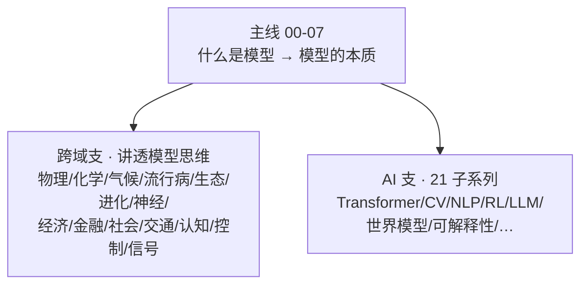

# 讲透模型宇宙升维（骨架批）Implementation Plan

> **For agentic workers:** REQUIRED SUB-SKILL: Use superpowers:subagent-driven-development (recommended) or superpowers:executing-plans to implement this plan task-by-task. Steps use checkbox (`- [ ]`) syntax for tracking.

**Goal:** 把「讲透模型」宇宙从纯 AI 内核升维为"跨域支 + AI 支"两支结构：主线 00/07 两端改造、宇宙 README 重写、创刊子系列「讲透模型思维」骨架（README + 00 通论 + 实验）。

**Architecture:** 三层改动——(1) 主线两端普适化（00 前插跨域开场、07 加升维收口节）；(2) 宇宙 README 改两支结构并挂网；(3) 新子目录 `讲透模型/讲透模型思维/` 创刊。领域篇 01-15 不在本计划（四 lane 并行，见附录 A 协议）。所有跨向未创建文件的引用一律用**纯文本标注（创刊中）**，不留死链——lane 落地时激活链接并翻状态。

**Tech Stack:** Markdown + mermaid + numpy（实验零第三方依赖，除 numpy）+ Git Bash（Windows，中文路径加引号）

**Spec:** `docs/superpowers/specs/2026-09-06-讲透模型宇宙升维-design.md`（本计划从 spec 立论，执行者两份都读）

## Global Constraints

- **语言风格（全库宪法，本批所有新写/改写正文一律遵守）**：**费曼式**——比喻开场、自问自答、每个黑话给一句"人话翻译"（参照主线 00 的 F3 术语翻译表）；**第一性原理**——结论从原理推导出来，不拿权威/论文数量垫背（引权威只用于标注出处，不用于论证）；**可证伪**——每个核心断言回答"什么观测会推翻它"，实验就是证伪装置，已证明/经验现象/仍未解决三档诚实标注
- 编辑区隔离：只写 `讲透模型/`（主线 00/07、宇宙 README、新子目录）；**不碰** `docs/superpowers/specs/2026-09-06-讲透计算复杂度-design.md`、`omega-guard/`、`.claude/`、`讲透数学/`（他会话活）
- 链接门：骨架批全部提交后全库断链数 B₁ ≤ B₀（Task 1 基线）；**任何新链接只指向已存在的文件**
- 实验门：`python -u` 跑通、几秒级、自包含（仅 numpy + 标准库）、确定性种子、打印结论性数字
- 中文为主；仓库名/产品名/代码/公式保留原文
- 提交序列（spec §6）：本计划文件单独提交 → Task A（Task 2-4）一个 commit → Task B（Task 5-6）一个 commit → 终检（Task 7，通常无新 commit，有修则 fix commit）
- 验收铁律（spec §4.2，领域篇 lane 同样适用）：五幕齐全｜实验跑通｜"建模教训"一句钉死｜诚实标注三档｜📌 下一步｜至少 1 条库内互链

---

### Task 1: 链接基线 B₀

**Files:**
- Create: 无（heredoc 探针，跑完即弃，不入库）

**Interfaces:**
- Produces: 数字 B₀（total/broken），写入执行记录；Task 7 的 B₁ 与之对比

- [ ] **Step 1: 跑全库相对链接扫描，记录 B₀**

```bash
cd "C:\workspace\work4ai" && python - <<'PY'
import os, re, urllib.parse
ROOT = r"C:\workspace\work4ai"
SKIP = {'.git','node_modules','__pycache__','cache','mermaid-render','.claude','.tools','.agent','.research','omega-guard'}
pat = re.compile(r'\]\(([^)#\s]+)(?:#[^)]*)?\)')
total = broken = 0
for dirpath, dirnames, filenames in os.walk(ROOT):
    dirnames[:] = [d for d in dirnames if d not in SKIP]
    for fn in filenames:
        if not fn.endswith('.md'): continue
        p = os.path.join(dirpath, fn)
        try: text = open(p, encoding='utf-8').read()
        except Exception: continue
        for m in pat.finditer(text):
            href = m.group(1)
            if href.startswith(('http://','https://','mailto:')): continue
            total += 1
            ap = os.path.normpath(os.path.join(os.path.dirname(p), urllib.parse.unquote(href)))
            if not os.path.exists(ap):
                broken += 1
                print(f"BROKEN {os.path.relpath(p, ROOT)} -> {href}")
print(f"TOTAL={total} BROKEN={broken}")
PY
```

Run 预期：`TOTAL=... BROKEN=B₀`（两位/三位数均正常——2910 条修复后的残余 + `.md` 草稿）。记下两个数。若 `python` 不在 PATH 改用 `python3`。

- [ ] **Step 2: 提交本计划文件**

```bash
cd "C:\workspace\work4ai" && git add "docs/superpowers/plans/2026-09-06-讲透模型宇宙升维.md" && git commit -m "docs: 讲透模型宇宙升维骨架批实施计划(7任务+lane协议附录)

Co-Authored-By: Claude Code <noreply@anthropic.com>"
```

---

### Task 2: 主线 `00-什么是模型.md` 前插跨域开场

**Files:**
- Modify: `讲透模型/00-什么是模型.md`（三处：开头插入两节、§1 改标题、§4.4 后加 §4.5、📌 下一步加桥——共四处）

**Interfaces:**
- Consumes: 无
- Produces: 文内锚 `## 0. 模型不是 AI 的专利`、`## 0.5 普适定义`、`### 4.5 四要素是 AI 特有的吗`——宇宙 README（Task 4）与 00 通论（Task 6）的回链目标 `00-什么是模型.md` 即本文件

- [ ] **Step 1: 在开头引语块之后、`## 1. 灵魂` 之前插入两节**

定位锚：`> 配套实验：`experiments/00_what_is_model.py`。` 与其后的 `---` 之后。插入内容（原样）：

```markdown
## 0. 模型不是 AI 的专利

"模型"这个词比 AI 老得多。在 AI 出现之前，每个行业都在**把研究对象建成模型**：

| 行业 | 模型 | 丢掉了什么 | 拿它做什么 |
|------|------|-----------|-----------|
| 经济学 | 供需曲线 | 个体差异、信息不完全 | 预测价格、评估政策 |
| 流行病学 | SIR | 个体行为差异、空间结构 | 预测峰值、评估封城时机 |
| 物理 | 理想气体 | 分子体积、分子间作用力 | 工程计算 |
| 控制工程 | 传递函数 | 非线性、噪声 | 设计控制器 |
| 认知科学 | 工作记忆模型 | 神经实现细节 | 解释记忆广度约 7±2 |

共同点：**没有一个模型是"对象本身"**——都是丢了细节的替身。统计学家 George Box 1976 年一句话钉死：

> **All models are wrong, some are useful.**（所有模型都是错的，但有些是有用的。）

## 0.5 普适定义：模型 = 有目的的简化

$$\text{模型} = \underbrace{\text{对研究对象的简化}}_{\text{丢掉与目的无关的信息}} \times \underbrace{\text{目的}}_{\text{预测 / 解释 / 控制}}$$

- **三用途**：预测（SIR 预测疫情峰值）、解释（工作记忆模型解释 7±2）、控制（传递函数设计控制器）——三用途常常不可兼得，目的决定简化方向。
- **机理 ↔ 数据驱动谱系**：物理定律（机理端，从原理推导）→ SIR（机理骨架 + 参数拟合）→ 统计回归 → 深度学习（数据端极点，结构几乎全部从数据学出）。
- 本系列的主角——AI 模型——在这个谱系的**数据驱动端极点**。下面用四要素解剖它；普适视角的完整展开见 [`讲透模型思维/00-建模通论.md`](讲透模型思维/00-建模通论.md)。
```

- [ ] **Step 2: §1 标题改为 AI 特例定位**

`## 1. 灵魂：模型 = 架构 × 参数 × 权重 × 目标` → `## 1. AI 特例的解剖：模型 = 架构 × 参数 × 权重 × 目标`（正文一字不动）

- [ ] **Step 3: §4.4 之后、`## 5.` 之前插入 §4.5**

```markdown
### 4.5 四要素是 AI 特有的吗？——与物理模型对照

| 要素 | AI 模型 | 物理模型（如范德华方程） |
|------|---------|------------------------|
| 架构 | 网络结构（归纳偏置） | 方程形式（力学假设） |
| 参数量 | 层数×宽度（容量） | 少数几个系数 |
| **权重** | **训练学出（知识载体）** | **无此层——系数由实验测定** |
| 训练目标 | 损失函数 | 无——直接拟合实验数据 |
| **适用域** | 隐式（分布偏移即失效，见 [04-能力评估](04-能力评估.md)） | **显式标注（理想气体高压失效）** |

最后一行是 AI 最该向传统建模学的一课：物理学家会在论文里写清"本模型适用范围"，AI 模型的"适用域"（训练分布的边界）却很少被显式声明——跨域篇 01-物理 将展开（创刊中）。
```

- [ ] **Step 4: 📌 下一步加跨域桥**

在 `## 📌 下一步` 段末（`为什么 Transformer 一统天下——以及 Mamba/MoE 的挑战。`之后）加一行：

```markdown
若你来自其他行业（经济/生物/工程/心理），先看跨域支 [`讲透模型思维/00-建模通论.md`](讲透模型思维/00-建模通论.md)——"模型思维"不是 AI 专属。
```

- [ ] **Step 5: 验证**

Run: `python - <<'PY'` 复用 Task 1 扫描器（可只扫 `讲透模型/`），确认新增链接中 `讲透模型思维/00-建模通论.md` 暂时断（Task 6 落地后转活，属预期中间态，终检在 Task 7）；`04-能力评估.md` 链接解析存在。`experiments/00_what_is_model.py` 未被改动：`git diff --stat 讲透模型/experiments/` 输出为空。

---

### Task 3: 主线 `07-模型的本质.md` 加升维收口节

**Files:**
- Modify: `讲透模型/07-模型的本质.md`（三处：§6 后插 §7、📌 加第 5 出路口、DeepSeek 死链降级）

**Interfaces:**
- Produces: `## 7. 升维收口` 锚；`HISTORY.md` 思想史链接自本节引出

- [ ] **Step 1: 在 `## 6. 一句话总结` 之后、`## 📌 下一步` 之前插入 §7**

```markdown
## 7. 升维收口：模型与真实（本系列的普适出口）

本篇至此都在问 AI 特有的问题。最后一跳：**"模型与真实的关系"是全人类的建模共题**——

- **地图不是疆域**（Korzybski 1933《Science and Sanity》）：模型 ≠ 对象本身，是丢了细节的替身。
- **模型更替由反例驱动**（库恩 1962）：托勒密本轮 → 开普勒椭圆 → 牛顿引力 → 相对论，每次都是"反例压垮旧模型"。AI 正在重演：scaling 的失效边界（[02-规模与ScalingLaws](02-规模与ScalingLaws.md)）就是正在积累的反例。
- **三立场是普适建模立场的投影**：随机鹦鹉派 ≈ 现象建模传统（只要拟合，不问机理）；涌现理解派 ≈ 机理主义（坚信底层有"真结构"）；实用主义派 ≈ 控制工程传统（够用就行，可测才谈）。

这 2200 年的概念演化（Ptolemy 用圆周拟合行星 → 基础模型用万亿参数拟合语言），见本宇宙 [`HISTORY.md`](HISTORY.md) 思想史；各行业怎么建模的跨域展开，见 `讲透模型思维/`（创刊中，[00-建模通论](讲透模型思维/00-建模通论.md) 先行）。
```

- [ ] **Step 2: 📌 下一步加第 5 出路口 + DeepSeek 死链降级**

第 4 条改为（去死链，降级为纯文本）：

```markdown
4. **产业实证线**：→ 讲透DeepSeek（待创刊）——一家公司把 00-07 全走了一遍
5. **跨域线**：→ [`讲透模型思维/00-建模通论.md`](讲透模型思维/00-建模通论.md)——"模型"回到全行业的视野
```

- [ ] **Step 3: 验证**

`HISTORY.md`、`02-规模与ScalingLaws.md`、`讲透模型思维/00-建模通论.md`（暂断，预期）三链接检查；`git diff` 确认 §1-§6 正文未动。

---

### Task 4: 宇宙 `README.md` 两支结构重写

**Files:**
- Modify: `讲透模型/README.md`（改五处：开篇引语、灵魂节、两支 mermaid+双表、为谁而写/前置/怎么跑增行、与其他系列的关系改路径+跨域行）

**Interfaces:**
- Consumes: Task 2/3 的改造事实（两支结构成立的前提）
- Produces: 跨域支挂网锚——`讲透模型思维/README.md` 的入链（Task 5 落地）

- [ ] **Step 1: 替换开篇引语（第 3-5 行 blockquote）**

```markdown
> **模型不是 AI 的专利——模型是对研究对象的有目的简化。** 物理学家、经济学家、流行病学家、控制工程师都在建模。本宇宙从普适定义出发，把 AI 模型（谱系里"从数据学出简化"的一支）彻底讲透：什么是模型、架构全景、Scaling Laws、家族谱系、能力评估、选型决策、生命周期、本质哲学——再把镜头拉回全行业的"模型思维"。
>
> 用「直觉 → 数学 → 代码跑通 → 不足 → 应用」的方式。每一篇配一个能跑出反直觉结论的 Python 实验。
```

- [ ] **Step 2: 灵魂节改双层**

原 `## 灵魂：一句话钉死` 节整体替换为：

```markdown
## 灵魂：一句话钉死（两层）

> **普适层**：模型 = 对研究对象的有目的简化。预测 / 解释 / 控制三用途；机理 ↔ 数据驱动谱系。All models are wrong, some are useful（Box 1976）。

> **AI 层**：AI 模型 = 架构（怎么算）+ 参数（算什么）+ 权重（具体值）+ 训练目标（学什么）。四个维度共同决定模型能做什么。改变任意一个，就是不同的模型。

$$
\underbrace{\text{Architecture}}_{\text{怎么算}} \times
\underbrace{\text{Parameters}}_{\text{算什么}} \times
\underbrace{\text{Weights}}_{\text{具体值}} \times
\underbrace{\text{Objective}}_{\text{学什么}} = \text{AI Model}
$$
```

（原"关键：同一个架构……三个完全不同的模型"一句保留在双层块之后。）

- [ ] **Step 3: 目录节前插两支结构图与两支表**

在 `## 目录与学习路径` 标题后、原 mermaid 前插入（外层四反引号内的内容原样）：

````markdown
**本宇宙两支结构**：



**跨域支**：[`讲透模型思维/`](讲透模型思维/README.md)——每篇一个行业、一个可迁移的"建模教训"（00 通论已刊，01-15 四 lane 创刊中）。

**AI 支**（21 子系列，每系列独立 README）：

| 系列 | 一句话 |
|------|--------|
| 讲透Transformer | 注意力深度解剖：位置编码/变体/MoE 演进 + HuggingFace 源码对照 |
| 讲透基础模型 | 为什么"预测下一个词"能产生智能（压缩即理解） |
| 讲透LLM | 大语言模型整合枢纽：生命周期 × 能力成熟度 |
| 讲透NLP | 从 N 元语法到 RAG 的全景（24 章） |
| 讲透CV | 视觉三次范式更迭：CNN → ViT → Diffusion |
| 讲透多模态 | 跨模态统一表征 |
| 讲透RL | MDP → Q-Learning → PPO → SAC |
| 讲透世界模型 | LeCun 路线与"LLM 是不是世界模型" |
| 讲透生成模型 | GAN/VAE/Diffusion 谱系 |
| 讲透微调 | SFT/LoRA/DPO |
| 讲透复用权重 | 权重复用与适配器 |
| 讲透泛化 | 泛化为什么发生 |
| 讲透激活函数 | 从 sigmoid 到 SwiGLU |
| 讲透KV Cache | 推理生命线：内存账/PagedAttention/MLA |
| 讲透PyTorch | Tensor/Autograd/编译图模式/内核精读 |
| 讲透优化理论 | 从 SGD 到现代优化器的数学 |
| 讲透概率图模型 | 贝叶斯网与马尔可夫随机场 |
| 讲透可解释性 | 探针/SAE/机械可解释 |
| 讲透模型可能性 | Transformer 之后的架构候选（SSM/RWKV/Hyena/Flow Matching…） |
| 讲透模型宇宙 | 模型世界导航与方法论（23 章 + 研究者工具箱） |
| 讲透AGI | 定义迷雾与测试谱（6 定义 7 测试） |
````

- [ ] **Step 4: 三处增行**

"这份教程为谁而写"末尾加：

```markdown
- 不是 AI 从业者，但**想知道自己行业的"模型"和 AI 的"模型"是不是一回事**的人（从 [00-什么是模型](00-什么是模型.md) §0 进，直奔跨域支）。
```

"前置要求"末尾加：`- **跨域支**：只需中学物理/基础概率，无需编程背景（实验可只看结论数字）。`

"怎么跑"代码块末尾加一行：

```bash
python3 -u 讲透模型思维/experiments/00_purposeful_simplification.py  # 有目的的简化（跨域支首实验）
```

- [ ] **Step 5: "与其他系列的关系"修路径 + 加跨域行**

原 4 条的 `../讲透X/` 全部改 `./讲透X/`（这些系列都在本宇宙内，原相对路径是断链），并追加：

```markdown
- [`./讲透模型思维/`](./讲透模型思维)：跨域支——模型思维不是 AI 专属，各行业建模传统各有教训。
- 跨域邻居：[`../讲透数学/`](../讲透数学)（数学宇宙）、[`../ecology/`](../ecology)、[`../psychology/`](../psychology)、[`../top-economics-finance-courses/`](../top-economics-finance-courses)、[`../讲透系统论/`](../讲透系统论)、[`../讲透控制论/`](../讲透控制论)、[`../讲透复杂系统/`](../讲透复杂系统)、[`../讲透科学的现代性/`](../讲透科学的现代性)
```

- [ ] **Step 6: 验证（AI 支一句话抽查）**

`ls 讲透模型/` 确认表中 21 系列名与目录一字不差；抽查 3 个系列的 README 首引语（`head -8 讲透模型/讲透RL/README.md` 等），一句话明显失真的改掉。跑 Task 1 扫描器限 `讲透模型/README.md`：`./讲透X/` 21+4 条全部解析（断链数应比改前**少** 4——原 `../` 四条转活）。

- [ ] **Step 7: Commit（spec §6 提交 2）**

```bash
cd "C:\workspace\work4ai" && git add 讲透模型/00-什么是模型.md 讲透模型/07-模型的本质.md 讲透模型/README.md && git commit -m "docs: Task A 模型宇宙两端改造——主线00前插跨域开场(§0/§0.5/§4.5)+07升维收口节(§7)+宇宙README两支结构(跨域支挂网+21子系列表+关系区修链)

Co-Authored-By: Claude Code <noreply@anthropic.com>"
```

---

### Task 5: 创刊 `讲透模型思维/`（README 宪法 + HISTORY 创刊记）

**Files:**
- Create: `讲透模型/讲透模型思维/README.md`
- Create: `讲透模型/讲透模型思维/HISTORY.md`

**Interfaces:**
- Consumes: spec §4.1 篇目表（16 篇）、§4.3 互链矩阵
- Produces: `讲透模型思维/README.md` 篇目宪法（lane 们的挂网目标与状态翻牌处）；`00-建模通论.md` 链接目标（Task 6）

- [ ] **Step 1: 写 README.md**

frontmatter 对齐 `讲透模型/讲透CV/README.md` 的卡片宪法（card_id/universe/burke/status/updated），正文骨架：

````markdown
---
card_id: 模型思维-README
title: "讲透模型思维：各行各业的建模传统"
universe: 讲透模型思维
burke:
  scene: "AI 圈把'模型'当成自己的专利，但每个行业都在把研究对象建成模型"
  agent: "跨域建模者"
  act: "巡礼各行业的模型，提炼可迁移的建模教训"
  purpose: "让模型思维回到全人类的视野，给 AI 模型找到谱系坐标"
  tension: "行业知识深不见底 vs 迁移洞见必须一句钉死"
  arc: "从建模通论出发，穿过数理/生命/社会/心智工程四群，回到 AI 收口"
status: 创刊骨架（00 已刊，01-15 四 lane 创刊中）
updated: 2026-09-06
---

# 讲透模型思维 (Model Thinking, 透) · 创刊

> **"模型"不是 AI 的专利。** 物理学家用理想气体、经济学家用供需曲线、流行病学家用 SIR、控制工程师用传递函数——各行各业都在**把研究对象看做一个模型**。本系列每篇一个行业，五幕讲透（直觉→数学→代码→不足→应用），每篇钉死**一个可带回 AI 工作的"建模教训"**。

**灵魂：一句话钉死**

> **模型 = 对研究对象的有目的简化。简化丢的不是"细节的量"，而是"与目的无关的结构"——目的（预测/解释/控制）决定哪些信息该丢。All models are wrong, some are useful.（Box 1976）**

## 篇目宪法（00-15）

| # | 篇 | 领域群 | 建模教训（灵魂） | 实验 | 状态 |
|---|------|------|------|------|------|
| 00 | [00-建模通论](00-建模通论.md) | 元 | 模型=有目的简化；三用途；机理↔数据谱系；验证 | `00_purposeful_simplification.py` | ✅ |
| 01 | 01-物理 | 数理 | 模型分层，各有适用域；反例驱动更替 | `01_gas_models.py` | 📝 L1 |
| 02 | 02-化学 | 数理 | 分类也是建模，且能预言未知（镓 1875） | `02_equilibrium.py` | 📝 L1 |
| 03 | 03-气候 | 数理 | 多尺度耦合；参数化；不确定性量化 | `03_energy_balance.py` | 📝 L1 |
| 04 | 04-流行病 | 生命 | 少量假设→大局判断；R₀×干预时机 | `04_sir_intervention.py` | 📝 L2 |
| 05 | 05-生态 | 生命 | 简单规则→振荡；模型可被数据推翻 | `05_lotka_volterra.py` | 📝 L2 |
| 06 | 06-进化 | 生命 | 把历史过程建成优化问题的威与弊 | `06_nk_landscape.py` | 📝 L2 |
| 07 | 07-神经计算 | 生命 | 机理 vs 现象模型的精度/成本权衡 | `07_hh_vs_lif.py` | 📝 L2 |
| 08 | 08-经济 | 社会 | 均衡是假设不是事实；反身性 | `08_price_control.py` | 📝 L3 |
| 09 | 09-金融 | 社会 | 模型风险：公式对、假设错（2008） | `09_black_scholes_mc.py` | 📝 L3 |
| 10 | 10-社会 | 社会 | 微观动机≠宏观行为 | `10_schelling.py` | 📝 L3 |
| 11 | 11-交通 | 社会 | 容量是模型不是数字；幽灵堵塞 | `11_ghost_jam.py` | 📝 L3 |
| 12 | 12-认知 | 心智 | 操作化定义的功与过 | `12_working_memory.py` | 📝 L4 |
| 13 | 13-控制 | 工程 | 白箱推导 vs 黑箱辨识 | `13_system_identification.py` | 📝 L4 |
| 14 | 14-信号 | 工程 | 采样=有损建模；混叠=模型伪影 | `14_aliasing.py` | 📝 L4 |
| 15 | 15-收口-回到AI | 元 | AI 在谱系中的位置：数据端极点 | — | 📝 终批 |

（状态列：✅ 已刊 / 📝 创刊中——lane 落地一篇翻一篇，并把篇名升级为链接。）

## 学习路径

- **通吃路线**：00 → 01…15 顺序读（跨域全景）
- **AI 从业者速通**（推荐）：00 → 04 流行病 → 09 金融 → 13 控制（三篇与 AI 工作对照最密：分布偏移/模型风险/黑箱辨识）→ 15 收口
- **按行业跳读**：找本行那一篇，看它的"建模教训"是否戳中你

## 与主线和邻居的关系

- [`../00-什么是模型.md`](../00-什么是模型.md)：主线 §0/§0.5 是本系列的开场浓缩，本系列是其展开
- [`../README.md`](../README.md)：宇宙两支结构，本系列 = 跨域支
- [`../HISTORY.md`](../HISTORY.md)：模型概念 2200 年思想史（Ptolemy→基础模型）——本系列横向切片，它纵向演化
- [`../../../讲透数学/讲透数学建模/01-机理建模.md`](../../../讲透数学/讲透数学建模/01-机理建模.md)：机理建模的数学工具箱
- 各篇内另有行业邻居互链（ecology/psychology/经济学课表/讲透系统论/讲透控制论/讲透科学的现代性），见各篇

## 验收铁律（每篇 lane 同样遵守）

五幕齐全｜实验自包含几秒跑完打印结论性数字｜"建模教训"一句钉死（篇首灵魂框）｜诚实标注已证明/经验现象/仍未解决｜结尾 📌 下一步｜至少 1 条库内互链
````

- [ ] **Step 2: 写 HISTORY.md（创刊记）**

```markdown
# 讲透模型思维 · 创刊记

- **2026-09-06 创刊**：本系列由"讲透模型"宇宙升维派生（spec：`../../../../docs/superpowers/specs/2026-09-06-讲透模型宇宙升维-design.md`）。动机：模型思维是全人类的思维工具，AI 模型只是"从数据学出简化"的一支。骨架批：README 篇目宪法（00-15）+ 00 建模通论 + 首实验。01-15 由四 lane（数理/生命/社会/心智工程）并行创刊，15 收口最后成篇。
- 概念演化的纵向历史见母宇宙 [`../HISTORY.md`](../HISTORY.md)（Ptolemy → 基础模型）；本文件只记本系列刊史。
```

- [ ] **Step 3: 验证**

frontmatter 与 `讲透模型/讲透CV/README.md` 的键名一致（burke 六键）；`../../../讲透数学/讲透数学建模/01-机理建模.md` 与 `../../../../docs/.../spec` 路径解析存在（从 `讲透模型/讲透模型思维/` 出发四段 `../` 到仓库根——实测确认）。

---

### Task 6: `00-建模通论.md` + 首实验

**Files:**
- Create: `讲透模型/讲透模型思维/00-建模通论.md`
- Create: `讲透模型/讲透模型思维/experiments/00_purposeful_simplification.py`

**Interfaces:**
- Consumes: Task 5 的 README 挂网；主线 00 §0.5（回链目标）
- Produces: `00_purposeful_simplification.py` 的结论数字（篇内表格引用）；01-15 各篇的"回到通论"回链锚 `00-建模通论.md`

- [ ] **Step 1: 写实验脚本（原样落盘）**

```python
"""00_purposeful_simplification — 机理模型 vs 查表模型：简化丢的不是多，而是丢得对

问题：同一份带噪声的阻尼振荡数据，两个模型都能拟合——
  A. 机理模型：y = A*exp(-g*t)*cos(w*t+p)  （4 参数，来自"振荡+阻尼"结构假设）
  B. 查表模型：9 次多项式                    （10 参数，不做任何结构假设）
域内谁拟合得好？域外（外推）谁还活着？

结论：查表模型把噪声也当信号背下来（域内误差更低），外推立刻爆炸；
      机理模型丢掉"每个点的噪声"，留住"振荡+衰减"的结构——这就是有目的的简化：
      目的（外推预测）决定哪些信息该丢。
"""
import numpy as np

rng = np.random.default_rng(42)

# 真实过程：阻尼振荡（机理假设恰好为真；噪声 = 测量抖动）
t_train = np.linspace(0, 8, 33)            # 训练域 [0, 8]
t_test = np.linspace(8.25, 12, 16)         # 外推域 (8, 12]
A, g, w = 1.0, 0.3, 2.0

def truth(t):
    return A * np.exp(-g * t) * np.cos(w * t)

y_train = truth(t_train) + rng.normal(0, 0.05, t_train.size)
y_test = truth(t_test) + rng.normal(0, 0.05, t_test.size)

def rmse(a, b):
    return float(np.sqrt(np.mean((a - b) ** 2)))

# ---- 模型 A：机理拟合（网格搜 g,w × 线性最小二乘解 A,p）----
best = None
for g_hat in np.arange(0.10, 0.51, 0.01):
    for w_hat in np.arange(1.5, 2.51, 0.01):
        e = np.exp(-g_hat * t_train)
        X = np.column_stack([e * np.cos(w_hat * t_train), e * np.sin(w_hat * t_train)])
        coef, *_ = np.linalg.lstsq(X, y_train, rcond=None)
        r = rmse(X @ coef, y_train)
        if best is None or r < best[0]:
            best = (r, g_hat, w_hat, coef)
_, g_hat, w_hat, coef = best

def mech_predict(t):
    e = np.exp(-g_hat * t)
    X = np.column_stack([e * np.cos(w_hat * t), e * np.sin(w_hat * t)])
    return X @ coef

# ---- 模型 B：9 次多项式（查表/现象模型）----
poly = np.polynomial.Polynomial.fit(t_train, y_train, deg=9)

print(f"[训练域 0-8]   拟合 RMSE：机理 = {rmse(mech_predict(t_train), y_train):.4f}   "
      f"多项式 = {rmse(poly(t_train), y_train):.4f}   <- 查表背噪声，通常更低")
print(f"[外推域 8-12]  预测 RMSE：机理 = {rmse(mech_predict(t_test), y_test):.4f}   "
      f"多项式 = {rmse(poly(t_test), y_test):.4f}   <- 外推见真章")
print(f"机理模型找回结构参数：g = {g_hat:.2f}（真值 0.3）  w = {w_hat:.2f}（真值 2.0）")
print("参数量：机理 4  vs  多项式 10 —— 参数少而结构对，胜过参数多而无结构")
```

- [ ] **Step 2: 跑实验，抄数字进篇**

Run: `cd "C:\workspace\work4ai\讲透模型\讲透模型思维" && python -u experiments/00_purposeful_simplification.py`
Expected: 三秒内；域内两 RMSE 同量级（多项式略低）；域外多项式 RMSE 比机理大 1-2 个数量级；g/w 找回 0.30/2.00。把实际数字填进第 3 幕表格（不凭记忆下断言）。

- [ ] **Step 3: 写 00-建模通论.md（五幕骨架，数字用 Step 2 实测）**

结构（每幕小节标题原样，正文按要点展开 600-1000 字/幕；全程费曼式：比喻开场/自问自答/术语翻译；每个核心断言配"什么观测会推翻它"）：

```markdown
# 00 — 建模通论：把世界变成模型

> 「讲透模型思维」开篇。灵魂一句钉死：

> **模型 = 对研究对象的有目的简化。简化丢的不是"细节的量"，而是"与目的无关的结构"——目的（预测/解释/控制）决定哪些信息该丢。All models are wrong, some are useful.（Box 1976）**

## 1. 直觉：两张地铁地图

同一座城市，通勤者要的地图（三色线、大站距）和地质队要的地图（等高线、岩层）完全不同，两张都"错"，两张都有用——**"错"的方向由用途决定**。→ 引出 §0 的五行行业表（呼应主线 [00-什么是模型](../00-什么是模型.md) §0）。

## 2. 数学：一切模型 = 约束下的函数族 + 选择准则

- 统一视角：机理模型（物理定律：强约束小族，常数实验测定）/ 统计模型（损失最小化：弱约束大族）/ AI（端极点：约束几乎只剩架构先验，其余交给数据+优化）
- 谱系定位表：| 理想气体 | SIR | 线性回归 | 深度网络 | 按约束强度/参数来源/验证方式三列排
- 简化的代价账：偏差（丢错结构）vs 方差（背下噪声）——外推是照妖镜
- **可证伪预测**：把本篇实验的测试域从 (8,12] 外移到 (12,16]，机理模型 RMSE 应缓增、查表模型应继续爆炸——若查表模型外推也稳，"结构对胜过参数多"被推翻

## 3. 代码：机理 4 参数 vs 查表 10 参数

（贴 Step 2 实测数字表：域内 RMSE / 域外 RMSE / 找回的 g,w。）反直觉结论：**域内更准的模型，域外一塌糊涂——"简化"的质量不由拟合优度单判。**

## 4. 不足：有目的的简化也救不了什么

- regime change：目的域内的"对结构"换了环境照样失效（例：2008 的 VaR——分布假设换了 regime）
- 目的冲突：解释力 vs 预测力常不可兼得（Breiman "Two Cultures" 2001；标注为"经验现象"）
- Box 的后半句常被忘了：有用性是**有范围**的有用
- 诚实三档标注示范：最小二乘最优性=已证明；两条文化之争=经验现象；"何时该信外推"=仍未解决

## 5. 应用：带回 AI

- LLM 在谱系的数据端极点：结构先验最少、数据最多——所以它的"适用域"最模糊（分布偏移、幻觉）
- fine-tune = 换目的；RAG = 给查表模型补机理索引；领域模型 = 往机理端挪一格
- 桥表：01-15 每篇的"建模教训"预告（从 README 篇目表抄灵魂列，纯文本不带链接——未创建）

## 费曼回炉记录（L2 自检）

- **F2 卡壳点**：为什么"域内更准"反而是坏信号？（域内误差里混着"背下的噪声"——过拟合不是玄学，是把噪声当结构记住了）
- **F3 术语翻译**："机理模型"→ **有图纸的模型**（知道机器为什么会动）；"查表模型"→ **只背答案的模型**（题没见过就不会）；"适用域"→ **这张地图只画到哪条边界**
- **F4 回炉**：v1（错误直觉）"简化 = 丢的信息越少越好，模型越精细越牛" → v2（修正后）"丢得对不对由目的定——地质队拿通勤地铁图找断层，图再精美也是错的"

## 📌 下一步

→ 01-物理（创刊中）：适用域分层最经典的地方——理想气体什么时候失效、失效了换什么。
```

- [ ] **Step 4: Commit（spec §6 提交 3）**

```bash
cd "C:\workspace\work4ai" && git add 讲透模型/讲透模型思维 && git commit -m "feat: Task B 讲透模型思维创刊骨架——README篇目宪法(00-15)+HISTORY创刊记+00建模通论(五幕)+首实验机理vs查表

Co-Authored-By: Claude Code <noreply@anthropic.com>"
```

---

### Task 7: 终检（三道门）

**Files:**
- Modify: 仅当门未过时的修复（fix commit）

- [ ] **Step 1: 链接门**

运行扫描器（与 Task 1 Step 1 同一份代码，此处内联防跨任务引用）：

```bash
cd "C:\workspace\work4ai" && python - <<'PY'
import os, re, urllib.parse
ROOT = r"C:\workspace\work4ai"
SKIP = {'.git','node_modules','__pycache__','cache','mermaid-render','.claude','.tools','.agent','.research','omega-guard'}
pat = re.compile(r'\]\(([^)#\s]+)(?:#[^)]*)?\)')
total = broken = 0
for dirpath, dirnames, filenames in os.walk(ROOT):
    dirnames[:] = [d for d in dirnames if d not in SKIP]
    for fn in filenames:
        if not fn.endswith('.md'): continue
        p = os.path.join(dirpath, fn)
        try: text = open(p, encoding='utf-8').read()
        except Exception: continue
        for m in pat.finditer(text):
            href = m.group(1)
            if href.startswith(('http://','https://','mailto:')): continue
            total += 1
            ap = os.path.normpath(os.path.join(os.path.dirname(p), urllib.parse.unquote(href)))
            if not os.path.exists(ap):
                broken += 1
                print(f"BROKEN {os.path.relpath(p, ROOT)} -> {href}")
print(f"TOTAL={total} BROKEN={broken}")
PY
```

判定 B₁ ≤ B₀（预期：`讲透模型思维/00-建模通论.md` 的四处前向链接全部转活；07 的 DeepSeek 死链 -1；宇宙 README 的 `../` 四条转活 → **B₁ 应明显小于 B₀**）。若 B₁ > B₀：对照 BROKEN 行逐条修复到过门。

- [ ] **Step 2: 实验门**

Run: `cd "C:\workspace\work4ai\讲透模型" && python -u experiments/00_what_is_model.py && python -u 讲透模型思维/experiments/00_purposeful_simplification.py`——两个实验都几秒跑完、打印结论性数字；主线老实验输出与改造前一致（Task 2 已保证未动，此处复证）。

- [ ] **Step 3: 挂网门（无孤儿）**

- `讲透模型/README.md` 出现 `讲透模型思维/` 挂网行 ✓（grep 验证）
- `讲透模型思维/README.md` 篇目表 00 行链接解析 ✓、其余 15 行无死链（纯文本）✓
- 主线 00 §0.5 与 07 §7 的前向链接解析 ✓
- `git status` 干净（除他会话的预存未跟踪项：`.claude/`、`omega-guard/`、`讲透计算复杂度-design.md` 的修改）

- [ ] **Step 4: 若有修复，fix commit；否则记录三门数字收工**

---

## 附录 A：Task C 四 lane 协议（骨架批合并后启动，不入本计划细步骤）

1. **lane 划分**：L1 数理（01-03）· L2 生命（04-07）· L3 社会（08-11）· L4 心智工程（12-14）· 终批 15 收口（四 lane 全并后）
2. **每 lane 一会话**：开工前 `git fetch` 快进到骨架批合并点；按 work4ai 多会话并行协调协议认领（git 讯息公告栏）；分支 `feature/model-thinking-L{n}`，逐篇 scoped 提交（`feat: 模型思维 0X-YYY——<教训一句>`）
3. **每篇按 spec §4.2 验收铁律**（本计划 Global Constraints 末条）验收铁律中"（核心篇）✍️ 练习"的核心篇 := 04 流行病、09 金融、13 控制、15 收口四篇，其余篇目免练习。；实验脚本落 `讲透模型思维/experiments/`，数字实测入篇
4. **落一篇翻一篇**：README 篇目表该行状态 📝→✅、篇名升级为链接；**并激活主线/README 里指向本篇的纯文本引用**（grep `创刊中` 找到全部待激活点）
5. **互链按 spec §4.3 矩阵**，目标路径实测存在才链，断则降级文内提及
6. **终批 15 收口**成篇后：激活主线 07 §7 的双向链接，Task 1 扫描器全库 B₁ 终检，lane 协议闭环
