# 经济学全景讲透 · 总索引

> **定位**：这是一份由 AI 导师（ai-mentor）在 2026-08-14 撰写的经济学全景综述。所有数学结论都用 Python 数值验证过；所有 2026 年前沿内容来自 arXiv 实时抓取的真实论文（标注 `[arXiv:ID, 日期]`）。
>
> **环境说明**：撰写时网络出口受限（Wikipedia/Google/NBER 不可达，arXiv 实时可达）。所以经典理论基于可靠的训练知识，前沿内容基于真实抓取的 arXiv 论文。

## 经济学是什么

一句话：**经济学是在稀缺约束下研究选择与激励的科学**（Robbins 1932）。三个内核词：**稀缺 → 选择 → 激励**。

## 章节地图

| 文件 | 主题 | 核心算法数 |
|------|------|-----------|
| `01-microeconomics.md` | 微观：消费者/厂商/市场/一般均衡/信息 | 6 |
| `02-game-theory-mechanism-design.md` | 博弈论 + 机制设计 + 拍卖 + 匹配 + 社会选择 | 7 |
| `03-macroeconomics.md` | 增长(Solow/Ramsey/OLG/Romer) + 周期(RBC/DSGE/HANK) + 货币 + 失业 | 8 |
| `04-econometrics-causal-inference.md` | OLS/IV → DID/RDD/合成控制 → Double ML/Causal Forest | 8 |
| `05-behavioral-experimental.md` | 前景理论 + 双曲贴现 + 公平偏好 + Agent-Based | 5 |
| `06-frontier-AI-economics-2026.md` | 2026-08 真实前沿：企业 AI 采用 / LLM 定价 / 制度 / 气候 | 精读 |
| `07-schools-of-thought-critique.md` | 十大学派对照 + 经济学的局限与批评 | — |

## 学科全景图

```mermaid
graph TD
  E[经济学 Economics<br/>稀缺·选择·激励]
  E --> M[微观 Microeconomics]
  E --> G[博弈论与机制设计<br/>Game Theory & Mechanism Design]
  E --> MA[宏观 Macroeconomics]
  E --> EM[计量与因果推断<br/>Econometrics & Causal Inference]
  E --> BE[行为与实验<br/>Behavioral & Experimental]
  M --> M1[消费者理论<br/>效用最大化/Slutsky/离散选择]
  M --> M2[厂商理论<br/>生产函数/成本最小化]
  M --> M3[市场结构<br/>竞争/垄断/寡头Cournot-Bertrand]
  M --> M4[一般均衡<br/>Arrow-Debreu/福利定理]
  M --> M5[信息经济学<br/>逆向选择/道德风险/信号]
  G --> G1[均衡谱系<br/>Nash/SPE/PBE/颤抖手]
  G --> G2[拍卖<br/>Vickrey/VCG/Myerson]
  G --> G3[匹配<br/>Gale-Shapley/TTC/Reny2022]
  G --> G4[社会选择<br/>Arrow/Gibbard/比例代表]
  MA --> A1[增长<br/>Solow/Ramsey/OLG/Romer]
  MA --> A2[周期<br/>RBC/新凯恩斯DSGE/HANK]
  MA --> A3[货币财政<br/>Taylor rule/Phillips/MMT]
  MA --> A4[失业<br/>DMP搜寻匹配]
  EM --> E1[经典估计<br/>OLS/IV/2SLS/GMM]
  EM --> E2[因果革命<br/>DID/RDD/合成控制]
  EM --> E3[ML×因果<br/>Double ML/Causal Forest]
```

## 四个根本问题

| 问题 | 分支 | 核心工具 | 代表诺奖 |
|------|------|---------|---------|
| 个体如何决策？ | 微观 | 最优化 + 均衡 | Arrow 1972 |
| 群体如何互动？ | 博弈/机制设计 | 纳什均衡、显示原理 | Nash 1994 / Myerson 2007 |
| 总量如何动态演化？ | 宏观 | 动态规划、DSGE | Solow 1987 / Romer 2018 |
| 我们怎么知道模型对？ | 计量/因果 | 识别策略、实验 | Angrist-Imbens 2021 |

## 学习路径（推荐顺序）

1. **微观**（个体理性人）→ 打下最优化基础
2. **博弈**（策略互动）→ 理解市场设计
3. **计量/因果**（如何从数据中知道）→ 现代经济学的科学性根基
4. **宏观**（动态总量）→ 理解政策
5. **行为**（有限理性）→ 修正理性人假设
6. **前沿**（2026 AI 经济学）→ 看未来
7. **学派与批判**（多元视角）→ 防止教条

## 代码复现

所有验证脚本在 `/tmp/opencode/econ_*.py`，核心依赖：`numpy 2.2.6` + `scipy 1.15.1` + `statsmodels`。无需 nashpy/econml（已用纯 numpy 实现）。

## 关键诚实声明

- **实证 vs 规范**：经济学最危险的是把"是什么"（positive）和"应该是什么"（normative）混淆。效率是实证概念，公平是规范概念。
- **理论 vs 现实**：所有模型都假设极强（完备市场、理性人、信息对称），现实几乎都不满足。2008 金融危机就是模型失效的教训。
- **复制危机**：行为经济学和实证经济学都受 p-hacking 影响，结论需独立验证。

---

*生成时间：2026-08-14 · 作者：ai-mentor · 验证方式：Python 数值实验 + arXiv 实时论文*
