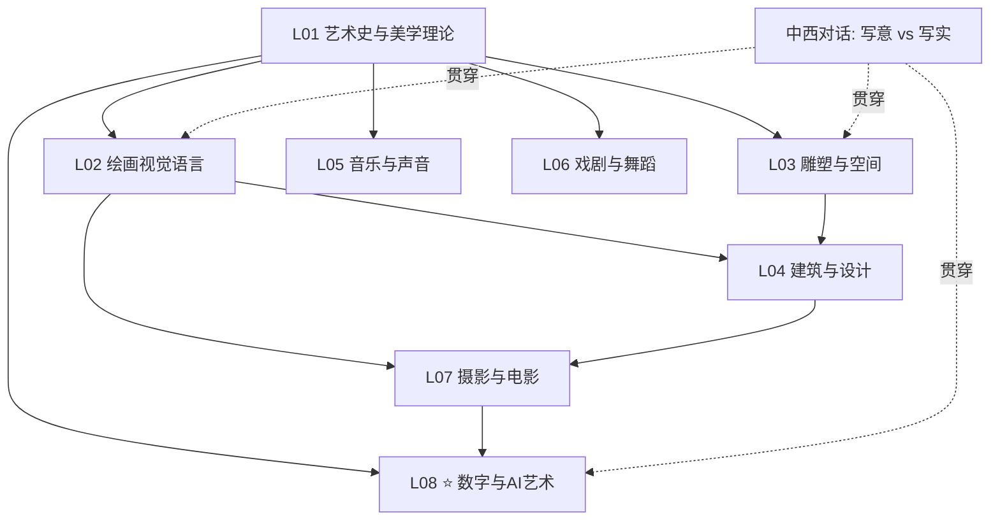

# 🎨 世界顶级艺术院校 · 全课程实战（2026 中国大陆可访问版）

> **一句话定位**：仿照 [`top-physics-courses/`](../top-physics-courses/) 与 [`top-math-courses/`](../top-math-courses/) 的方法论，把全球顶级艺术院校（中国八大美院 + 国际名院）的核心课程，用**费曼学习法**还原为可理解、可实践、可衔接的知识体系。
>
> **与前三套的关系**：物理版（自然规律）/ 数学版（数学原理）/ 经济金融版（会反思你的人）→ **艺术版（研究「美与表达」）**。艺术是唯一一个**没有客观对错**的领域——它的核心是**张力**而非**真理**。

---

## ⚠️ 0. 本系列的核心约束：中国大陆可访问性（与 physics/math 版的关键差异）

> `top-physics-courses` / `top-math-courses` 大量引用 YouTube（MIT OCW / Smarthistory）、Google Arts & Culture、Coursera/edX、英文 Phaidon/Taschen 画册——这些**在中国大陆访问困难**。
>
> **本系列的铁律**：所有外部资源，**必须给出中国大陆可访问的等价替代**。这是艺术版区别于物理/数学/经济金融三套的核心增值。

**资源转换对照表**（详见 [`RESOURCES/00_accessibility_guide_cn.md`](RESOURCES/00_accessibility_guide_cn.md)）：

| 原资源（大陆访问困难） | ✅ 中国大陆可访问替代 |
|---|---|
| **YouTube**（Smarthistory / Khan Academy 艺术 / 博物馆导览）| **B站**（大量艺术科普 UP 主 + 官方搬运）、**学堂在线**、**中国大学MOOC** |
| **Google Arts & Culture** | **故宫博物院数字文物库**、**数字敦煌**、**中国国家博物馆**、**上海博物馆**、**苏州博物馆** |
| **Coursera / edX** 艺术课 | **学堂在线**（清华/央美课）、**智慧树**、**中国大学MOOC**（央美/国美/北大艺术课）|
| **英文画册**（Phaidon / Taschen / Yale UP）| 中文译本（**后浪 / 广西师大 / 中信 / 北大出版社 / 湖南美术**）、**微信读书**、**豆瓣阅读** |
| **Google Scholar** | **知网 CNKI**、**万方**、**百度学术**、**读秀** |
| **Tate / MoMA / Musée d'Orsay 官网** | **故宫 / 上博 / 国博 / 中国美术馆 / 苏博** 数字馆藏（多数开放高清）|
| **Wikipedia 英文** | **中文维基**（部分）、**百度百科**、各馆官网词条 |

> 📌 **选校倾向**：因可访问性约束，本系列**以中国院校为主力**（央美/国美/清美/央音/北电/中戏），国际院校（RCA/RISD/佛罗伦萨/ENSBA）作为补充——这同时让**中国艺术传统**（写意/气韵生动/书法）成为本系列独有的、不输西方的一大主线。

---

## 1. 艺术与理科的本质差异（为什么不能照搬物理范式）

物理学家求**真理**（与实验吻合），数学家求**正确**（证明），经济学家求**预测**（样本外）。艺术家求什么？——**没有一个统一的答案**，这正是艺术的核心特征。

| 维度 | 物理/数学/经济金融 | **艺术** |
|---|---|---|
| **目标** | 收敛于真理/最优 | **多元并存**（古典/现代/当代各有理）|
| **评价** | 客观（实验/证明/收益）| **主观 + 历史共识**（梵高生前无人识）|
| **方法论** | 假设-推理-验证 | **创造 + 反思**（没有"错"，只有"弱"）|
| **进步观** | 线性积累（标准模型越来越准）| **非线性**（杜尚的《泉》不是"进步"，是"颠覆"）|
| **核心概念** | 定理 / 定律 | **张力 / 对话**（每件作品都在与前人对话）|

> 🎯 **本系列的灵魂**：用「直觉→美学理论→创作实践→不足→应用」五幕，把艺术的**四对永恒张力**讲透。**艺术没有答案，只有更深刻的提问**。

---

## 2. 艺术的四大根本张力（本系列的脊柱）

物理的脊柱是"理论 vs 实验"。艺术的脊柱是**四对永远打不死的张力**：

### 张力 ① 模仿 vs 表现（mimesis vs expression）
- **模仿论**：柏拉图（贬低艺术为"模仿的模仿"）、亚里士多德《诗学》（肯定模仿的认知价值）、文艺复兴（透视/解剖 = 科学地模仿自然）。
- **表现论**：浪漫主义（艺术表达内心情感）、表现主义（蒙克《呐喊》）、超现实主义（达利/梦境）。
- **张力**：相机发明后，"模仿"被技术取代 → 印象派/立体/抽象走向"表现/结构"。**艺术从"画所见"转向"画所知/所感"**。

### 张力 ② 形式 vs 内容
- **形式主义**：克莱夫·贝尔"**有意味的形式**"（significant form, 1914）、格林伯格（现代主义=媒介纯粹性）、抽象艺术（康定斯基/罗斯科）。
- **内容驱动**：社会学艺术批评（豪泽尔）、马克思主义（艺术反映阶级）、政治波普（沃霍尔/中国政治波普）。
- **张力**：纯形式（罗斯科色块）vs 叙事/政治（戈雅《五月三日》）。**好的艺术常在两端之间**。

### 张力 ③ 自律 vs 他律（art for art's sake vs 社会介入）
- **自律**（autonomous）：唯美主义（戈蒂耶/王尔德"为艺术而艺术"）、纯抽象。
- **他律**（heteronomous）：达达（反战反资产阶级）、观念艺术（科苏斯）、涂鸦（Banksy）、中国当代社会介入艺术。
- **张力**：艺术该不该承担社会责任？**这个争论 200 年没结论，且每个时代答案不同**。

### 张力 ④ 技艺 vs 观念
- **技艺**：学院派传承（佛罗伦萨/ENSBA 古典训练）、匠人精神。
- **观念**：杜尚《泉》（1917，小便池签名，**观念 > 物质实现**）、概念艺术、**AI 艺术**（提示词 vs 生成）。
- **张力**：AI 艺术把这场争论推到极致——**当生成模型取代了"手"，剩下的"观念/提示词"算不算艺术？**

> 📌 **东西方第五张力（贯穿本系列）**：
> - **西方**：写实传统（透视/解剖/光影），重"形似"
> - **中国**：写意传统（**谢赫六法之首"气韵生动"**），重"神似"；**书法**早于西方抽象 2000 年
> - **张力**：写意 vs 写实、留白 vs 满构图、线条（笔墨）vs 体块（明暗）
> - **现代融合**：林风眠/赵无极/吴冠中——"中西融合"百年探索

---

## 3. 中国艺术传统专节（本系列独有的主线）

> 因可访问性 + 中国艺术本身的独立价值，本系列把中国艺术作为与西方艺术**平行的两大传统**之一来讲，而非"东方点缀"。

### 核心范畴
- **谢赫六法**（南齐，500 AD）：① 气韵生动 ② 骨法用笔 ③ 应物象形 ④ 随类赋彩 ⑤ 经营位置 ⑥ 传移模写。**"气韵生动"列首**——中国画的最高标准不是"像"，而是"活"。
- **诗书画印一体**：文人画传统（苏轼/米芾/元四家/董其昌），画上题诗、钤印，构成综合艺术。
- **留白**（负空间的主动运用）：马远"一角"、夏圭"半边"——**不画之处比画之处更重要**（呼应道家"无为"、禅宗"空"）。
- **笔墨**：皴法（披麻/斧劈/雨点）、墨分五色（焦/浓/重/淡/清）——线条本身的表现力（早于康定斯基抽象）。
- **书法**：中国独有的抽象艺术。从篆/隶/楷/行/草，**线条的节奏=情绪的直接记录**。

### 与 work4ai 视角库的天然契合
中国艺术与 work4ai 已有的东方哲学视角**深度共鸣**：

| 视角 | 中国艺术的折射 |
|---|---|
| **☕ 道家** | "大象无形""大音希声" = 抽象/留白；"道法自然" = 写意 |
| **🍵 禅宗** | "不立文字" = 观念艺术/极简；牧溪/梁楷"减笔" = 禅画 |
| **🌗 阴阳家** | 留白与笔墨 = 阴阳虚实；干湿浓淡 = 阴阳消长 |
| **📜 儒家** | "文以载道" = 他律艺术；文人修养 = 诗书画印 |

> 📌 **学习入口**：[`讲透AIfor各学科/艺术`](../讲透AIfor各学科/艺术/) + 央美/国美在中国大学MOOC 开的中国美术史课（可访问）。

---

## 4. 思想史主线（艺术版的"范式转移"）

```
前5世纪  柏拉图贬艺术(模仿的模仿) / 亚里士多德《诗学》肯定模仿    ← 西方理论源头
500 AD  谢赫六法("气韵生动")                                      ← 中国理论源头
14-16c  文艺复兴(透视/解剖/人文：达芬奇/米开朗基罗/拉斐尔)         ← 科学地模仿
17c     巴洛克(光影戏剧：卡拉瓦乔/伦勃朗) vs 古典(普桑)            ← 张力①②初现
19c中   现实主义(库尔贝) / 印象派(莫奈：光的科学)                  ← 挑战学院
19c末   后印象(塞尚"用圆柱体看自然"→立体主义先声)                 ← 现代主义序章
1907    毕加索《亚维农少女》立体主义                              ← 现代主义革命
1917    杜尚《泉》                                                ← 观念艺术诞生(张力④)
1936    本雅明《机械复制时代的艺术》                              ← 摄影/电影的理论奠基
1940s   抽象表现(波洛克/罗斯科) / 绿伯格形式主义                  ← 美国取代欧洲
1950s   波普(沃霍尔)                                              ← 大众文化入艺术
1960s   极简/观念(科苏斯《一把和三把椅子》)                        ← 张力④极化
1980s   后现代/新表现/中国85新潮                                  ← 多元并存
2015    DeepDream / 2018 "Edmond de Belamy" AI 拍卖               ← AI 艺术登场
2022+   Stable Diffusion / Midjourney / DALL-E / Sora             ← 生成模型大众化
2024-26 LLM 多模态 / 视频生成 / AI 艺术版权争议                   ← 张力④终极战场
```

**每一次"革命"= 一次范式转移**（库恩框架，呼应 [`top-physics-courses/HISTORY_OF_PHYSICS.md`](../top-physics-courses/HISTORY_OF_PHYSICS.md)）。**故事化完整版** → 见 `ART_EPIC.md`（阶段 2，八幕剧：洞穴壁画 → 文艺复兴 → 印象派反叛 → 现代爆炸 → 杜尚颠覆 → 中国写意 → 数字复制 → AI 觉醒）。

---

## 5. 选校逻辑（中国院校为主力 + 国际名院，标注可访问性）

> **选校原则**：① 中国大陆可访问性优先 ② 中国艺术传统独立成线 ③ 覆盖视觉/表演/媒体三大艺术门类。

| # | 学校 | 强项 | 中国可访问性 |
|---|------|------|------------|
| 1 | **中央美术学院 CAFA**（北京）| 中国艺术旗舰，徐悲鸿/靳尚谊传承，全门类（国/油/版/雕/设计/实验艺术）| ★★★★★ |
| 2 | **中国美术学院 CAA**（杭州）| 林风眠/潘天寿传承，国画/书法/跨媒体/当代（**许江/邱志杰**）| ★★★★★ |
| 3 | **清华大学美术学院** | 设计/工艺美术/工业设计（原中央工艺美院，庞薰琹/张仃传承）| ★★★★★ |
| 4 | **中央音乐学院 CCOM** | 音乐表演/作曲/音乐学 | ★★★★★ |
| 5 | **北京电影学院 CFA** | 电影/动画/导演（**谢飞/张艺谋母校**）| ★★★★★ |
| 6 | **中央戏剧学院 CAD** | 戏剧/表演/导演 | ★★★★★ |
| 7 | **皇家艺术学院 RCA**（伦敦）| QS 艺术设计 #1，纯艺/设计/创新工程 | 课程资源需替代（B站搬运）|
| 8 | **罗德岛设计学院 RISD**（美国）| 美国 design #1，插画/工业设计 | 部分开放课程 |
| 9 | **佛罗伦萨美术学院**（意）| 文艺复兴源头（米开朗基罗《大卫》）| 历史价值 > 课程 |
| 10 | **巴黎国立高等美术学院 ENSBA** | 学院派源头（博纳体系，徐悲鸿留法母校）| 历史价值 |

**中国八大美院补充**（均可访问）：鲁迅美院（沈阳）、广州美院、四川美院（重庆）、西安美院、湖北美院、天津美院。

> 📌 **课程编号一手核实铁律**：中国院校课程编号（央美/国美/清美）需在阶段 1 **webfetch 学校官网 / 教务处** 一手核实；中国大学MOOC / 学堂在线 上的公开课需核实开课状态（部分课程下架）。

---

## 6. 课程覆盖范围（5 大方向）

10 校 × 平均每校 12-20 门核心课 ≈ **120-200 门艺术课**。按 5 大方向：

| 方向 | 代表课/内容 | 类型 |
|---|---|---|
| **艺术史与理论** | 央美《中国美术史》/ 北大《西方艺术史》/ 国美《中国画论》 | 理论 |
| **视觉艺术基础** | 素描/色彩/构图/透视/解剖（央美造型学院）| 技艺 |
| **设计与建筑** | 清美工业设计 / 建筑史 / 包豪斯传承 | 应用 |
| **表演艺术** | 央音和声/曲式 / 中戏表导演 / 北电视听语言 | 表演 |
| **新媒体与数字艺术** | 国美跨媒体 / 实验艺术 / **AI 艺术** ⭐ | 弯道超车 |

---

## 7. 八大主题（艺术版图）

| 主题 | 费曼一句话 | 根本张力 | 入口资源（可访问）|
|------|----------|---------|----------------|
| **① 艺术史与美学理论** | 艺术是一面镜子，但镜子也会撒谎 | 全部张力 | 央美《中国美术史》(中国大学MOOC) / 李霖灿《中国美术史》|
| **② 绘画与视觉语言** | 把三维世界骗进二维平面 | 模仿 vs 表现 | 央美素描课 / B站色彩教程 |
| **③ 雕塑与空间** | 凿去多余的石头（米开朗基罗）| 形式 vs 内容 | 国博/上博数字馆藏 |
| **④ 建筑与设计** | 凝固的音乐（歌德）| 自律 vs 他律 | 梁思成《中国建筑史》/ 包豪斯 |
| **⑤ 音乐与声音** | 听得见的数学（毕达哥拉斯→序列主义）| 调性 vs 无调性 | 央音公开课 / B站乐理 |
| **⑥ 戏剧与舞蹈** | 用身体思考（亚里士多德《诗学》）| 模仿 vs 表现 | 中戏公开课 / 林怀民云门 |
| **⑦ 摄影与电影** | 机械复制时代的艺术（本雅明）| 技艺 vs 机械 | 北电公开课 / 贾樟柯电影课 |
| **⑧ 数字与 AI 艺术** ⭐ | 把创造力交给算法 | **技艺 vs 观念（终极）** | [`讲透生成模型`](../讲透生成模型/) + Stable Diffusion |

> ⭐ **第 8 主题 = 弯道超车**（呼应 [`top-physics-courses/ai_for_physics/`](../top-physics-courses/ai_for_physics/)）。**可跑 demo**：[`ai_for_art/art_demos.py`](ai_for_art/art_demos.py)（黄金比例/色彩/透视/分形/风格迁移概念，纯标准库）。

---

## 8. 目录结构（仿 `top-math-courses`，加可访问性指南）

```
top-art-courses/
├── README.md                              ← 本文件（总架构宪法）
├── UNIFIED_ROADMAP.md                     ← 30 课最优路径                [阶段 2]
├── ART_EPIC.md                            ← 艺术史诗八幕剧              [阶段 2]
├── HISTORY_OF_ART.md                      ← 艺术思想史 + 库恩框架       [阶段 2]
├── ART_BREAKTHROUGHS.md                   ← 重大突破（文艺复兴/现代/AI）[阶段 2]
├── EAST_WEST_DIALOGUE.md                  ← 中西艺术对话（独有！）       [阶段 2]
├── CROSS_SCHOOL_INSIGHTS.md               ← 跨校/跨文化对比             [阶段 2]
├── FAST_TRACK.md                          ← 快速通道                    [阶段 2]
├── FEYNMAN_NARRATIVE.md                   ← 费曼叙事主线                [阶段 2]
├── CROSS_INDEX_WITH_WORK4AI.md            ← 艺术 ↔ 讲透X 映射 ✅
├── SURVEY.md                              ← 完整书单（含中文译本）      [阶段 1]
├── THINKERS_BIOGRAPHIES.md                ← 艺术家列传                  [阶段 3]
├── AUDIT_SUMMARY.md                       ← 质量审计（含可访问性复核）  [阶段 4]
│
├── ai_for_art/                            ← 弯道超车 ✅
│   ├── ai_for_art.md                      ← 6 大子方向（Diffusion/CLIP/风格迁移/交互/代码艺术/版权）
│   └── art_demos.py                       ← 可跑 demo ✅
│
├── RESOURCES/                             ← 补充资源（按优先级）
│   ├── 00_accessibility_guide_cn.md       ← ⭐ 中国大陆可访问资源总指南（核心增值）✅
│   ├── 01_popular_science.md              ← 科普（中文：《艺术的故事》贡布里希 / 李泽厚《美的历程》）
│   ├── 02_math_foundations.md             ← 数学基础（透视/比例/分形）+ 与 top-math 映射
│   ├── 03_digital_collections.md          ← 数字馆藏（故宫/敦煌/上博/国博）
│   ├── 04_paper_reading_list.md           ← 理论文本（本雅明/贝尔/格林伯格/潘诺夫斯基）
│   ├── 05_practice_studio.md              ← 创作实践（素描/色彩/编程艺术）
│   └── 06_ai_art_ethics.md                ← AI 艺术伦理与版权
│
├── cafa-art-courses/                      ← 中央美术学院                [阶段 1]
├── caa-art-courses/                       ← 中国美术学院                [阶段 1]
├── tsinghua-art-courses/                  ← 清华美院                    [阶段 1]
├── ccom-music-courses/                    ← 中央音乐学院                [阶段 1]
├── bfa-film-courses/                      ← 北京电影学院                [阶段 1]
├── cad-drama-courses/                     ← 中央戏剧学院                [阶段 1]
├── rca-art-courses/                       ← 皇家艺术学院（资源转可访问）[阶段 1]
├── risd-art-courses/                      ← 罗德岛设计学院              [阶段 1]
├── florence-art-courses/                  ← 佛罗伦萨美术学院            [阶段 1]
└── ensba-art-courses/                     ← 巴黎国立高等美术学院        [阶段 1]
```

---

## 9. 三层讲透宪法（艺术版，与 work4ai 一致）

每门课/主题按三层（呼应 [`故事化框架-生成器.md`](../故事化框架-生成器.md)）：

1. **直觉层**——一句话比喻 + 为什么这件作品/这场运动重要 + 它在四对张力哪一侧
2. **理论/美学层**——关键概念、美学理论、艺术史定位（而非"公式推导"）
3. **实践/创作层**——可动手的最小练习（素描/配色/构图/编程艺术/AI 提示词）

附加：
- **不足层**——这场运动/这件作品的批评、局限、被颠覆的方式（**艺术特有且最重要**）
- **应用层**——与设计/媒体/AI 创作的具体关联（对接 [`讲透生成模型`](../讲透生成模型/)）

---

## 10. 与 top-physics/math/econ-finance 的差异

| 维度 | 物理/数学/经济金融 | **艺术** |
|---|---|---|
| 核心产物 | 可跑物理/回测 demo | **可动手创作练习 + 可读美学反思** |
| 评估 | 实验吻合/收益/证明 | **主观 + 历史共识**（无客观标准）|
| 客观性 | 强 | **几乎无**（梵高 vs 学院派）|
| 资源形态 | 论文/教材/代码 | **图像/影像/文本/作品本身**（数字馆藏是关键）|
| 可访问性 | 国际资源为主 | **本系列强制转中国可访问** ⚠️ |

---

## 11. AI for Art：你的弯道超车主题

> 艺术的「AI 原生」弯道超车 = 物理版的 `ai_for_physics/`。详见 `ai_for_art/ai_for_art.md`（待写/未落盘） + [`讲透AIfor各学科/艺术`](../讲透AIfor各学科/艺术/)。

**6 大子方向**：

| 子方向 | 核心 | 代表 | 可访问资源 |
|---|---|---|---|
| **生成模型** | 文生图/视频 | **Stable Diffusion / Midjourney / DALL-E / Sora** | 开源 SD（本地可跑）/ B站教程 |
| **神经风格迁移** | 内容+风格分离 | Gatys et al. (2015) | art_demos.py 概念演示 |
| **CLIP/多模态** | 文图对齐 | Radford et al. (2021) | [`讲透多模态`](../讲透多模态/) |
| **代码艺术/生成艺术** | Processing/p5.js/分形 | Casey Reas / 曼德博 | 纯 Python 可做 |
| **交互/新媒体** | 装置/沉浸式 | teamLab / 国美跨媒体 | — |
| **AI 艺术伦理版权** | 谁是作者？| "Edmond de Belamy" 拍卖 / 2023-26 诉讼 | 中文讨论丰富 |

**可跑 demo 现已提供**：[`ai_for_art/art_demos.py`](ai_for_art/art_demos.py)（黄金比例 φ + 斐波那契螺旋、RGB↔HSL 色彩理论、一点透视投影、曼德博分形、L-system 树、风格统计混合概念，纯标准库 `python3` 直接跑）。

---

## 12. 知识图谱（依赖关系）



---

## 13. 铁律（沿用 work4ai + 新增可访问性铁律）

1. **资源可访问性铁律** ⚠️（**本系列独有**）：凡引用外部资源，**必须给出中国大陆可访问替代**；原资源标注"⚠️ 需替代"并列出替代（详见 [`RESOURCES/00_accessibility_guide_cn.md`](RESOURCES/00_accessibility_guide_cn.md)）。
2. **课程/作品一手核实**（学校官网 / 美术馆官网 / 中国大学MOOC 开课状态，webfetch 核实）。
3. **作品信息精确**（作者、年代、媒介、馆藏地、数字馆藏链接）。
4. **跨文化客观**（中西艺术**平行**而非"西方中心 + 东方点缀"）。
5. **代码可跑通**（bash 验证，与 work4ai 铁律一致）。
6. **不写空壳**（要么不写，要么写扎实——尤其不凭记忆写课程编号/馆藏编号）。
7. **尊重主观性**（艺术无唯一正解，呈现多元批评而非定论）。

---

## 14. 实施路线图

### 阶段 1：院校课程 + 数字馆藏清单（**下一步**，需 webfetch）
- 中国 6 校 × `SCHOOL.md`（央美/国美/清美/央音/北电/中戏，webfetch 官网 + 中国大学MOOC）
- 国际 4 校 × `SCHOOL.md`（RCA/RISD/佛罗伦萨/ENSBA，资源转可访问）
- 数字馆藏核实（故宫/敦煌/上博/国博/SuBo 开放高清图链接）

### 阶段 2：融合 + 叙事
- `UNIFIED_ROADMAP`：30 课最优路径
- `ART_EPIC`：八幕剧史诗（洞穴→文艺复兴→印象派→现代→杜尚→中国写意→数字复制→AI）
- `HISTORY_OF_ART`：思想史 + 库恩范式 + 失败的运动
- `EAST_WEST_DIALOGUE`：**中西艺术对话（本系列独有，谢赫六法 vs 透视/写意 vs 写实/书法 vs 抽象）**
- `ART_BREAKTHROUGHS`：文艺复兴/印象派/现代/AI 四波

### 阶段 3：样板主题讲透 + 艺术家列传
- 选 3-5 个核心主题（如文艺复兴透视/中国山水写意/AI 生成艺术）做完整讲透
- `THINKERS_BIOGRAPHIES`：达芬奇/塞尚/杜尚/波洛克 + 苏轼/八大/赵无极
- `RESOURCES/` 7 份补充资源

### 阶段 4：质量审计（含可访问性复核）
- 3 轮深审 + **可访问性复核**（所有链接实跑验证可访问）

---

## 🎬 一句话收束

> **艺术是唯一一个没有客观答案的领域**——它的价值不在"正确"，而在**张力的深度**。本系列的全部手艺，就是用「直觉→美学理论→创作实践→不足→应用」五幕，把四对永恒张力（模仿 vs 表现 / 形式 vs 内容 / 自律 vs 他律 / 技艺 vs 观念）讲透，并用**中国大陆可访问的资源**让每个人都能真正看见、动手、思考——无论你在世界哪个角落。

---

📌 **下一步**
- ✅ 本 README + [`ai_for_art/art_demos.py`](ai_for_art/art_demos.py) + [`CROSS_INDEX_WITH_WORK4AI.md`](CROSS_INDEX_WITH_WORK4AI.md) + [`RESOURCES/00_accessibility_guide_cn.md`](RESOURCES/00_accessibility_guide_cn.md) = 样板四件套
- 🚧 **阶段 1**：10 校 `SCHOOL.md`（中国 6 校优先，webfetch 央美/国美/清美官网 + 中国大学MOOC 核实课程）
- 📝 需要你确认：① 选校（中国 6 + 国际 4）是否满意？ ② 优先做哪校/哪个主题？ ③ 是否现在启动阶段 1？

---

## 📁 学校目录索引（2026-08-15 补挂 · 阶段 1 已完成）

> 上文「🚧 阶段 1」实际已完成（中国 6 校（央美/国美/清美/曲师大/山工艺/山艺）+ 国际 5 校（RCA/RISD/佛罗伦萨美院/ENSBA/CAA）），共 10 校落盘——此前未在此 README 记账，按[复杂系统审计](../复杂系统迭代work4ai.md)补挂：

| 子目录 | 入口 |
|---|---|
| [`bfa-art-courses/`](bfa-art-courses/) | [`SCHOOL.md`](bfa-art-courses/SCHOOL.md) |
| [`caa-art-courses/`](caa-art-courses/) | [`SCHOOL.md`](caa-art-courses/SCHOOL.md) |
| [`cad-art-courses/`](cad-art-courses/) | [`SCHOOL.md`](cad-art-courses/SCHOOL.md) |
| [`cafa-art-courses/`](cafa-art-courses/) | [`SCHOOL.md`](cafa-art-courses/SCHOOL.md) |
| [`ccom-art-courses/`](ccom-art-courses/) | [`SCHOOL.md`](ccom-art-courses/SCHOOL.md) |
| [`ensba-art-courses/`](ensba-art-courses/) | [`SCHOOL.md`](ensba-art-courses/SCHOOL.md) |
| [`florence-art-courses/`](florence-art-courses/) | [`SCHOOL.md`](florence-art-courses/SCHOOL.md) |
| [`rca-art-courses/`](rca-art-courses/) | [`SCHOOL.md`](rca-art-courses/SCHOOL.md) |
| [`risd-art-courses/`](risd-art-courses/) | [`SCHOOL.md`](risd-art-courses/SCHOOL.md) |
| [`tsinghua-art-courses/`](tsinghua-art-courses/) | [`SCHOOL.md`](tsinghua-art-courses/SCHOOL.md) |
