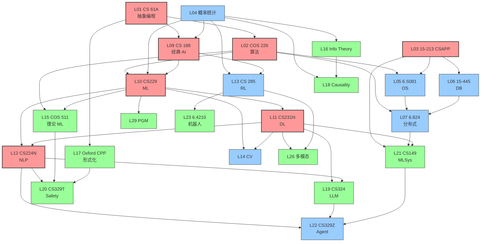

# 🎯 从小白到 CS/AI 专家的最优路径（9 校联合精炼版）

> **核心问题**：9 校 × 12 主题 = 108 个项目，全部学完需要 5+ 年。但**信息密度差异巨大**——同一主题（如 A* 搜索）在 Berkeley CS 188、MIT 6.034、Princeton COS 226 都教，但**深度、视角、教学风格完全不同**。
>
> **本文档解决的问题**：如果你只有 1-2 年时间，应该**学哪 30 课、按什么顺序、用哪个学校的版本**，才能从零基础达到 AI 研究员/工程师的入门水平？
>
> **方法论**：基于 9 校 210 个 .py 文件 + 81 个 bug 修复后的真实代码审计 + 跨校 15 主题深度对比，**淘汰冗余**（如 9 校都教 A*，只留 2 个最佳版本）+ **优化顺序**（按依赖关系）+ **量化时间**（每课真实耗时）。

---

## 🧭 第 0 步：诊断你的目标（5 分钟）

不同目标对应不同路径。先选一个：

| 目标 | 时间预算 | 推荐路径 | 关键能力 |
|------|---------|---------|---------|
| 🎓 **AI 研究员**（读 PhD / 顶会论文）| 18-24 月 | 路径 R（重理论）| 读 NeurIPS/ICML 论文 + 复现 + 推导 |
| 🏗️ **AI 工程师**（生产部署 LLM/Agent）| 6-12 月 | 路径 E（重系统）| LangChain/vLLM/RAG 实战 |
| 🔬 **ML 算法工程师**（训模型）| 9-15 月 | 路径 M（重数学）| PyTorch + 实验设计 |
| 🚀 **AI 创业者/PM**（懂技术做产品）| 3-6 月 | 路径 P（重广度）| 用户视角 + 懂概念 + 能 demo |
| 🎩 **CS 全才**（精通基础无短板）| 24-36 月 | 路径 A（覆盖所有）| 系统/算法/AI/理论均扎实 |

**小白默认推荐**：路径 E（AI 工程师）。原因：(a) 6-12 月可达成；(b) 当前市场需求最大；(c) 学完可转研究员（加理论）或创业者（加产品）。

---

## 💡 第一部分：10 个「元洞察」（学完整个领域突然通了）

这些洞察**跨学校**，是 9 校招牌课的"共同灵魂"。学透它们，108 主题里 80% 都会"原来如此"。

> 📖 **深度展开**：每条元洞察背后都有 100+ 小时的硬核阶梯。完整的"被省略全貌 + 学习阶梯 + 通过测试"见 **[INSIGHTS_FULL_PICTURE.md](INSIGHTS_FULL_PICTURE.md)**。

### 洞察 1：抽象层次思维（来自 Berkeley CS 61A + MIT 6.101 + Cambridge Part IA）

**核心**：所有 CS 问题都是"在哪个抽象层次思考"的问题。

- 写 Scheme 解释器（CS 61A 期末项目）让你理解：**程序 = 数据 + 解释器**
- 写 mini-Lisp（MIT 6.101）让你理解：**lambda calculus 是最小通用计算**
- Cambridge Part IA Foundations 让你理解：**逻辑 → 集合 → 函数 → 程序** 的层次结构

**学完后**：看到任何新技术（LangChain/diffusion/transformer）都会问"它在哪个抽象层？接口是什么？底层靠什么？"

### 洞察 2：「程序在机器上怎么跑」（来自 CMU 15-213 CSAPP）

**核心**：写 C 程序时，bit/byte/word/cache/page/process 是真实存在的。

- L1/L2 cache 让 row-major vs col-major 遍历差 50×（CSAPP 实验）
- 虚拟内存 + TLB 让 4KB page 是关键阈值
- buffer overflow 是因为栈布局可预测

**学完后**：所有"为什么我的代码慢"问题都能从硬件层分析。

### 洞察 3：搜索是一切的根（来自 Berkeley CS 188 + MIT 6.034）

**核心**：A* / minimax / MDP / RL / planning 都是**搜索**的不同变体。

- A* = 确定性环境的最优搜索（Berkeley CS 188 Pacman）
- minimax = 对抗环境的搜索
- MDP value iteration = 随机环境的最优搜索
- Q-learning = model-free 搜索
- Monte Carlo Tree Search (AlphaGo) = 巨大分支因子的近似搜索

**学完后**：看到 AlphaGo/ChatGPT RLHF 都能归结到"在 X 空间搜索 Y"。

### 洞察 4：概率即不确定性语言（来自 Cambridge Part IB MBI + Princeton COS 435 + ETH Prob AI）

**核心**：贝叶斯 = 不确定性的微积分。

- HMM forward-backward：时间序列的概率推断
- Gaussian Process：连续空间的不确定性建模
- ELBO/Variational：用简单分布近似复杂后验
- MCMC：从任意分布采样的通用方法

**学完后**：所有 ML 损失函数都能从"最大化似然/后验"推导。

### 洞察 5：反向传播 = 链式法则的工业实现（来自 Stanford CS231N + Karpathy 讲义）

**核心**：神经网络训练不神秘，就是计算图 + 链式法则。

- 任何网络 = 计算图（节点 + 操作）
- Forward = 数值流过图
- Backward = 梯度沿图反向（链式法则）
- PyTorch autograd = 这个过程的自动化

**学完后**：手写任何 NN 都不慌——画计算图 → 写前向 → 自动反向。

### 洞察 6：注意力是凸组合（来自 Stanford CS224N + Vaswani 2017）

**核心**：attention = 加权平均，但权重由内容决定。

- `softmax(QK^T/√d_k)V`：Q 决定"问什么"，K 决定"有什么"，V 决定"取什么"
- self-attention：序列任意两个位置可直接交互（RNN 不行）
- multi-head：不同子空间并行注意

**学完后**：理解 Transformer 架构不再困难，所有变体（LinFormer/Performer/FlashAttention）都是优化 QK^T 的计算。

### 洞察 7：共识是分布式系统的本质（来自 MIT 6.824 + ETH Reliable Dist）

**核心**：FLP 证明异步下完美共识不可能，但工程上我们能"足够好"。

- Paxos：理论正确但难懂（Lamport 故意写得像故事）
- Raft：为了可理解性重新设计（Ongaro PhD）
- PBFT：拜占庭容错（区块链的理论基础）
- CRDT：无共识的最终一致

**学完后**：看 etcd/TiDB/比特币/Ethereum 都能从共识协议层分析。

### 洞察 8：类型 = 命题，程序 = 证明（来自 Oxford CPP + Princeton COS 326）

**核心**：Curry-Howard 同构——直觉主义逻辑与简单类型 λ-calculus 完全对应。

- 类型 `A → B` 对应命题 "A 蕴含 B"
- 程序 `λx:A. e:B` 是 "A → B" 的证明
- STLC 类型检查器 = 证明检查器
- Peirce 律在经典逻辑可证但在直觉主义不可证 = STLC 不能 type-check 某些项

**学完后**：Coq/Lean/Agda 都不再神秘——它们就是 STLC 的扩展。

### 洞察 9：信息即对不确定性的消除（来自 Cambridge Part II Info Theory + MIT 6.442）

**核心**：Shannon 的天才——熵 `H = -Σp log p` 度量信息量。

- 熵决定压缩极限（Huffman/LZ77 接近但达不到）
- 互信息 `I(X;Y) = H(X) - H(X|Y)` 度量相关
- 信道容量 `C = max H(X) - H(X|Y)` 决定可靠传输速率
- KL 散度 = 信息差异 = ML 损失函数的本质

**学完后**：所有 ML loss（cross-entropy/KL/contrastive）都是信息论量。

### 洞察 10：因果 ≠ 相关（来自 ETH Causality Peters + Princeton COS 595）

**核心**：观察性数据无法识别因果，必须做实验或假设。

- Simpson 悍论：总体正相关但分组都负相关
- Pearl do-calculus：3 条规则改写干预防御
- Counterfactual fairness：用因果图定义公平

**学完后**：理解 A/B 测试为什么是黄金标准，观察性研究为什么需要 IV/Regression Discontinuity。

---

## 🛤️ 第二部分：30 课最优路径（按依赖排序）

> **格式**：每课标号 L01-L30。每课含：(a) 最佳学校版本 (b) 为什么这个学校 (c) 时间估计 (d) 学完后能做什么 (e) 跨校替代 (f) 知识检查。

### 阶段 A：基础（4-6 周，全部人员必学）

---

#### **L01 抽象编程思维** ⭐⭐⭐ 必学
- **最佳版本**：**Berkeley CS 61A**（DeNero，SICP-in-Python）
- **时间**：3-4 周（每周 10-15h）
- **学完后能**：写一个 Scheme 解释器；理解函数/对象/惰性/迭代器的抽象层次
- **跨校替代**：
  - 想要工程强度 → CMU 15-112（Kosbie，每周 15+h）
  - 想要可视化动机 → Stanford CS106A（Piech）
  - 想要数学严谨 → Cambridge Part IA Foundations
- **知识检查**：能否 30 行内实现 `eval/apply` 元循环解释器？
- **避坑**：不要只看视频，必须做完所有 HW + 最终 Scheme 项目。

---

#### **L02 数据结构与算法** ⭐⭐⭐ 必学
- **最佳版本**：**Princeton COS 226**（Sedgewick《Algorithms 4ed》）
- **时间**：4-5 周
- **学完后能**：BFS/DFS/Dijkstra/MST/Union-Find/KMP 信手拈来；面试题无障碍
- **跨校替代**：
  - 想要理论味 → CMU 15-251 Great Ideas（含 Cantor/Gödel/P vs NP）
  - 想要数学严谨 → MIT 6.006/6.046（Demaine）
  - 想要工程实战 → Berkeley CS 61B（Hug，Java）
- **知识检查**：能否 10 分钟内从零写 Dijkstra（含 priority queue）？
- **配套**：Coursera 上 Sedgewick 的算法课（免费）+ 本书代码在 Princeton 项目里。

---

#### **L03 程序在机器上怎么跑** ⭐⭐⭐ 必学（CMU 15-213 CSAPP）
- **最佳版本**：**CMU 15-213**（Bryant & O'Hallaron）
- **时间**：4-6 周（含 bomb lab / attack lab / malloc lab）
- **学完后能**：读 objdump/gdb 调试；理解 cache 层次；写 SIMD；理解虚拟内存
- **跨校替代**：
  - 想要写 OS → MIT 6.828/6.S081（xv6，Kaashoek & Morris）
  - 想要中等深度 → Berkeley CS 61C
- **知识检查**：能否解释为什么 `arr[i][j]` 比 `arr[j][i]` 快 50×？
- **配套**：CSAPP 教材（中文版有）+ 全部 lab 公开。
- ⭐ **深读**：[CSAPP_HARDWARE_TRUTHS.md](CSAPP_HARDWARE_TRUTHS.md)（8 个硬件真相的完全体）+ [可运行 demo](../cmu-cs-projects/topic2-systems/hardware_truths_demo.py)（cache 局部性 / TLB / 栈溢出 / 分支预测 / 伪共享 / syscall / 内存乱序 / IEEE754，跑 `python3 hardware_truths_demo.py` 即可看到 8 个反直觉对比）。

---

#### **L04 离散数学 + 概率论** ⭐⭐ 强烈推荐
- **最佳版本**：**MIT 6.042 Math for CS** + **Berkeley CS 70**
- **时间**：3-4 周（强化版）
- **学完后能**：modular 算术；图论；Markov chain；期望/方差/CLT；CLT 应用
- **跨校替代**：
  - 想要 TCS 方向 → CMU 15-251 Great Ideas
  - 想要概率深度 → Cambridge Part IB Statistics
- **知识检查**：能否证明简单图的 5 度顶点必相邻？能否算 Markov chain 平稳分布？

---

### 阶段 B：系统（4-6 周，工程师必学；研究员可选）

---

#### **L05 操作系统** ⭐⭐ 工程师必学
- **最佳版本**：**MIT 6.S081**（xv6 RISC-V，Kaashoek & Morris）
- **时间**：5-7 周（含 11 个 lab）
- **学完后能**：写一个 syscall；改 page table；理解 trap/syscall/scheduler
- **跨校替代**：
  - CMU 15-410（更深入 kernel）
  - Berkeley CS 162（Pintos）
- **知识检查**：能否描述 fork() 后父子进程的虚拟内存关系？

---

#### **L06 数据库系统** ⭐⭐ 工程师必学
- **最佳版本**：**CMU 15-445**（Andy Pavlo，bus-tub C++）
- **时间**：4-5 周（4 个 project）
- **学完后能**：从零写 B+ tree；理解 MVCC/isolation level；实现查询执行器
- **跨校替代**：
  - MIT 6.830（Morris，bus-tub Java）
  - Berkeley CS 186
- **知识检查**：解释为什么 Snapshot Isolation 不能防止 Write Skew。

---

#### **L07 分布式系统** ⭐⭐⭐ 必学（工程师 + 研究员）
- **最佳版本**：**MIT 6.5840 / 6.824**（Kaashoek & Morris，4 个渐进式 Go lab：MR → Raft → KV on Raft → Sharded KV on Raft）
- **时间**：6-8 周
- **学完后能**：写 Raft；理解线性一致 / 顺序一致 / 因果一致；从零搭 shard KV
- **跨校替代**：
  - ETH Reliable Distributed Systems（Wattenhofer，理论更深，PBFT/CRDT）
  - CMU 15-440（Andersen，系统研究向，读论文为主）
  - CMU 15-721 Advanced DB（Pavlo，OLAP/OLTP/Cloud DB 工程视角）
- **学完能去哪**：6.5840 lab 全做 → Google/ByteDance/AWS 分布式后端；15-721 → DB 研究；ETH RDS → 一致性证明。详见 [`INSIGHTS_FULL_PICTURE.md`](./INSIGHTS_FULL_PICTURE.md) 洞察 7「学完后能干什么」。
- **知识检查**：解释 FLP 不可能性为什么不影响 Raft 的工程实用性。

---

#### **L08 计算机网络** ⭐ 强烈推荐
- **最佳版本**：**Berkeley CS 162** 网络 chapter + **Stanford CS144**（TCP implement）
- **时间**：2-3 周
- **学完后能**：实现 mini-TCP；理解 BGP/OSPF
- **知识检查**：解释为什么 TCP 3 次握手而非 2 次。

---

### 阶段 C：AI/ML 核心（8-12 周，所有 AI 方向必学）

---

#### **L09 经典 AI / 搜索** ⭐⭐⭐ 必学
- **最佳版本**：**Berkeley CS 188**（Klein/Abbeel，Pacman）
- **时间**：3-4 周（6 个 Pacman 项目）
- **学完后能**：写 BFS/DFS/A*/MINIMAX/MDP value iter/Q-learning
- **跨校替代**：
  - Stanford CS221（更现代，含 ML/DL）
  - MIT 6.034（Winston 经典 GOFAI）
  - Toronto CSC 384（偏逻辑推理）
- **知识检查**：能否从零写 Alpha-Beta 剪枝井字棋（永不输）？
- **关键洞察**：所有 RL/规划/对抗本质都是搜索（见洞察 3）。

---

#### **L10 机器学习（经典）** ⭐⭐⭐ 必学
- **最佳版本**：**Stanford CS229**（吴恩达 notes）
- **时间**：4-6 周
- **学完后能**：推导 logistic 回归梯度；理解 SVM dual；EM 算法；PCA
- **跨校替代**：
  - CMU 10-701（Mitchell，学术血统最纯）
  - Berkeley CS 189（Sahai，mathematically dense）
  - MIT 6.867
  - Princeton COS 435（精简版）
- **知识检查**：能否从最大似然推导 logistic 回归的 loss？
- **关键洞察**：所有 ML 损失都是"最大化似然/后验"（见洞察 4）。

---

#### **L11 深度学习** ⭐⭐⭐ 必学
- **最佳版本**：**Stanford CS231N**（Karpathy 时代录像 + Justin Johnson 现代版）
- **时间**：4-6 周
- **学完后能**：从零写 CNN/ResNet/backprop（numpy）；fine-tune 实际模型
- **跨校替代**：
  - MIT 6.S191（Amini，现代最强，4 周密集）
  - Toronto CSC 413/513（Hinton 学术血统）
  - Berkeley CS 182
- **知识检查**：能否在 numpy 手写 backprop？
- **关键洞察**：反向传播 = 计算图 + 链式法则（见洞察 5）。

---

#### **L12 NLP / Transformer** ⭐⭐⭐ 必学（LLM 时代）
- **最佳版本**：**Stanford CS224N**（Chris Manning）
- **时间**：4-6 周
- **学完后能**：手写 attention；fine-tune BERT；理解 GPT 训练流程
- **跨校替代**：
  - CMU 11-411/711（最学术）
  - ETH NLP（Cotterell，形式语言传统）
  - Oxford Deep NLP（Youn Kim）
- **知识检查**：能否推导 attention `softmax(QK^T/√d_k)V` 为什么除以 √d_k？
- **关键洞察**：注意力是内容决定的凸组合（见洞察 6）。

---

#### **L13 深度强化学习** ⭐⭐ RL 方向必学
- **最佳版本**：**Berkeley CS 285**（Sergey Levine，YouTube 全公开，全球 RL 学习者事实入口）
- **时间**：5-7 周
- **学完后能**：手写 SAC/PPO；理解 model-based RL + world model；训练连续控制机器人
- **跨校替代**：
  - **Stanford CS234**（Emma Brunskill，偏理论 / online learning / safe RL，能严格推导 Bellman / TD / Q-Learning 收敛性）
  - **MIT 6.S191 RL 章节 / 6.S192-198 IAP**（Alexander Amini，1 月 IAP 短期版，与 6.S191 配套；注：6.S192-6.S198 在 MIT catalog 是 placeholder，实际课号随年份浮动）
- **作者归属校正**：Levine 是 **DDPG / GPS / PETS / MBPO / CQL / AWAC / Diffusion Policy** 的核心；TRPO 一作 Schulman、SAC 一作 Haarnoja，Levine 都是共同作者（不要再说"SAC/TRPO 之父"）。
- **学完能去哪**：CS 285 → 机器人/具身智能（Boston Dynamics / Tesla Optimus / Figure）/ DeepMind / OpenAI RL 团队；CS234 → RL 理论 PhD / safe RL；6.S191-RL → 入门跳板。详见 [`INSIGHTS_FULL_PICTURE.md`](./INSIGHTS_FULL_PICTURE.md) 洞察 11 + [`讲透RL/`](../讲透RL/) 全套笔记。
- **知识检查**：解释 PPO 比 REINFORCE 好在哪；解释 Q-Learning 的 deadly triad 为什么会发散。

---

#### **L14 计算机视觉** ⭐⭐ CV 方向必学
- **最佳版本**：**Oxford VGG**（Zisserman）+ **Stanford CS231N**（Karpathy 历史版）
- **时间**：3-5 周
- **学完后能**：手写 CNN/ResNet；理解 SIFT/HOG 传统特征；YOLO 检测
- **跨校替代**：
  - Berkeley CV（Malik，经典学派源头）
  - CMU 16-385/720（工程派，Kanade 实验室）
  - ETH 3D Vision（Pollefeys，SLAM 几何）
  - Toronto CSC 420
- **知识检查**：解释为什么 ResNet 的 skip connection 解决梯度消失。

---

### 阶段 D：理论 / 形式化（4-8 周，研究员必学；工程师可选）

---

#### **L15 理论机器学习** ⭐⭐ 研究员必学
- **最佳版本**：**Princeton COS 511/512**（Hazan）
- **时间**：4-6 周
- **学完后能**：推导 PAC bound；理解 VC dimension；online learning regret
- **跨校替代**：
  - Cambridge Part II Computational Learning Theory
  - CMU 15-758 Theoretical ML
- **知识检查**：解释为什么 VC dimension = 2 的 intervals 不能 shatter 3 个点。

---

#### **L16 信息论** ⭐⭐ 研究员必学
- **最佳版本**：**Cambridge Part II Information Theory & Coding** + **MacKay 教材**（免费）
- **时间**：3-4 周
- **学完后能**：手写 Huffman/LZ77；理解 channel capacity；解释 KL divergence
- **跨校替代**：
  - MIT 6.441（Gallager 风格）
  - Stanford EE376A（Weissman，现代版）
- **知识检查**：能否解释 `H(X) ≥ E[-log p(X)]` 的等号条件？
- **关键洞察**：信息 = 不确定性的消除（见洞察 9）。

---

#### **L17 形式化方法 / 类型论** ⭐⭐ 研究员必学（PL/verification 方向）
- **最佳版本**：**Oxford Categories Proofs & Processes** + **Cambridge Hoare Logic**
- **时间**：4-6 周
- **学完后能**：写 Isabelle/Lean 证明；理解 Curry-Howard；做模型检测
- **跨校替代**：
  - ETH Formal Methods（Basin，TLA+/Alloy）
  - CMU 15-414（Platzer，cyber-physical）
- **知识检查**：能否用 STLC 类型检查器验证 Peirce 律的不可证？
- **关键洞察**：类型 = 命题，程序 = 证明（见洞察 8）。

---

#### **L18 因果推断** ⭐⭐ 研究员必学（可信 AI 方向）
- **最佳版本**：**ETH Causality**（Jonas Peters）+ **Pearl《Causality》教材**
- **时间**：3-4 周
- **学完后能**：手写 PC algorithm；用 do-calculus；解释 Simpson 悍论
- **跨校替代**：
  - Princeton COS 595（公平性视角）
- **知识检查**：解释为什么 P(Y|X) ≠ P(Y|do(X))。
- **关键洞察**：因果 ≠ 相关（见洞察 10）。

---

### 阶段 E：高价值专门化（4-8 周，按目标挑）

---

#### **L19 LLM 训练与微调** ⭐⭐⭐ LLM 方向必学
- **最佳版本**：**Stanford CS324**（Percy Liang）+ **CMU 11-711 Advanced NLP**
- **时间**：3-4 周
- **学完后能**：理解 pre-training/RLHF/DPO；用 LoRA fine-tune；评估 LLM
- **跨校替代**：Fast.ai LLM course（实战）

---

#### **L20 AI Safety / 对齐** ⭐⭐ 研究员必学
- **最佳版本**：**Stanford CS329T** + **Berkeley CS 294-165 Fairness** + **CMU 17-800**
- **时间**：2-3 周
- **学完后能**：手写 refusal direction；理解 RLHF/DPO；公平性度量
- **关键洞察**：将 9 校的 CS329H/329T/329X/CS120 串起来。

---

#### **L21 MLSys / 推理优化** ⭐⭐⭐ 工程师必学
- **最佳版本**：**Stanford CS149** + **CMU 10-414/10-714 Deep Learning Systems**（Tianqi Chen）
- **时间**：3-4 周
- **学完后能**：从零写 autograd；理解 KV Cache/PagedAttention/quantization
- **跨校替代**：MIT 6.5940 Performance Engineering + Berkeley CS 294-165

---

#### **L22 Agent 工程** ⭐⭐⭐ 当下最热
- **最佳版本**：**Stanford CS329Z**（DSPy + ReAct + tool use）
- **时间**：2-3 周
- **学完后能**：手写 mini-Agent；理解 ReAct/CoT/Reflection；DSPy 框架
- **关键项目**：Stanford topic2-agent-v2（dspy_framework.py + hw2/hw3）

---

#### **L23 机器人 / 具身 AI** ⭐⭐ 机器人方向必学
- **最佳版本**：**MIT 6.4210 Underactuated Robotics**（Tedrake）
- **时间**：4-6 周
- **学完后能**：手写 LQR/iLQR；理解 contact/Lyapunov；控制 cartpole
- **跨校替代**：CMU 16-735 + Berkeley CS 287

---

#### **L24 安全 / 隐私** ⭐ 系统方向必学
- **最佳版本**：**MIT 6.858**（Kohno）+ **Berkeley CS 161**（Dawn Song）
- **时间**：3-4 周
- **学完后能**：写 ROP exploit；symbolic execution；理解 TLS/PKI

---

#### **L25 图学习 / GNN** ⭐ 可选
- **最佳版本**：**Stanford CS224W**（Leskovec）
- **时间**：3 周
- **学完后能**：从零写 GCN/GraphSAGE；理解 message passing

---

#### **L26 多模态 / 视觉语言** ⭐ 可选
- **最佳版本**：**Stanford CS231N** 多模态 chapter + Berkeley CS 294-141 3D Vision
- **时间**：3-4 周
- **学完后能**：理解 CLIP/BLIP/Diffusion；3D reconstruction

---

#### **L27 数据科学 / 工程** ⭐ 工程师推荐
- **最佳版本**：**Berkeley Data 100**（Adhikari，Data 8 进阶版）
- **时间**：2-3 周
- **学完后能**：从零写 DataFrame（groupby/join）；bootstrap；SQL-like query

---

#### **L28 优化（凸/非凸）** ⭐⭐ 研究员必学
- **最佳版本**：**Berkeley EECS 127**（Optimization Models）
- **时间**：4-5 周
- **学完后能**：手写 LP simplex；KKT 推导；Newton 法
- **跨校替代**：CMU 10-725 Convex Optimization

---

#### **L29 概率图模型** ⭐ 可选（学术性强）
- **最佳版本**：**CMU 10-708 PGM**（深度最深）
- **时间**：3-4 周
- **学完后能**：手写 VE/belief propagation/HMM forward-backward/particle filter

---

#### **L30 元能力 / 研究方法论** ⭐⭐⭐ 研究员必学
- **最佳版本**：**work4ai 讲透系列**（自己做的）+ Karpathy 「A Recipe for Training Neural Networks」+ 陈丹琦博客
- **时间**：持续
- **学完后能**：读 NeurIPS/ICML 论文；做严肃实验；写论文

---

## 🚀 第三部分：4 种快速通道（按目标）

### 🎓 路径 R：AI 研究员（18-24 月）

**目标**：能读 NeurIPS/ICML 论文 + 复现 + 提出新想法

**月 1-3**：基础（L01 CS 61A → L02 COS 226 → L04 概率 → L03 CSAPP 选学）
**月 4-6**：ML 入门（L10 CS229 → L11 CS231N → L09 CS 188）
**月 7-9**：深度专题（L12 CS224N → L13 CS 285 → L14 CS231N CV）
**月 10-12**：理论（L15 COS 511 ML Theory → L16 Info Theory → L17 Formal）
**月 13-15**：因果/安全（L18 Causality → L20 CS329T）
**月 16-18**：专精（选 1-2 个方向深做：LLM/RL/CV/Prob ML）
**月 19-24**：研究项目（读 50 篇论文，做 1 个复现 + 1 个新想法）

**关键**：每 3 周写一份「我学了什么」总结 + 找 1 篇当前方向顶会论文精读。

---

### 🏗️ 路径 E：AI 工程师（6-12 月）

**目标**：能用 LangChain/vLLM 搭生产级 LLM 应用

**月 1**：基础（L01 CS 61A 简版 + L02 COS 226 速通 + L04 概率基础）
**月 2**：ML 入门（L10 CS229 吴恩达 notes + L11 CS231N Karpathy 录像）
**月 3**：LLM 工程（L12 CS224N + L19 CS324 + L21 CS149 MLSys）
**月 4**：Agent / RAG（L22 CS329Z DSPy + work4ai 讲透 Prompt + 讲透 RAG）
**月 5-6**：实战项目（搭一个真实 LLM 应用：客服 bot / RAG 系统 / Agent）
**月 7-12**：进阶 + 系统（L05 OS + L07 6.824 分布式 + L06 15-445 数据库）

**关键**：每周搭一个 mini 项目 demo。GitHub 上累计 20+ 项目。

---

### 🔬 路径 M：ML 算法工程师（9-15 月）

**目标**：能独立训模型 + 设计实验 + 评估

**月 1-3**：基础（L01 + L02 + L03 CSAPP + L04 + L28 EECS 127 Optimization）
**月 4-6**：ML 深度（L10 CS229 全套 + L11 CS231N + L12 CS224N + L14 CV）
**月 7-9**：实验设计（work4ai 讲透泛化 + Karpathy guidelines + L29 PGM）
**月 10-12**：训练实战（搭 GPU 集群训小模型；理解 distributed training）
**月 13-15**：专精（选 CV/NLP/Recsys/RL 一方向深做）

**关键**：每个 lab 都要跑通 + 改超参看效果。

---

### 🚀 路径 P：AI 创业者 / PM（3-6 月）

**目标**：懂技术做产品 + 与工程师有效沟通

**月 1**：广度（看 Stanford AI Index + work4ai 讲透 AI 应用全景 + 读 100 篇 AI 产品 blog）
**月 2**：核心概念（L01 CS 61A 前 3 周 + L12 CS224N 前 4 讲 + L19 CS324 概览）
**月 3**：产品实战（L22 Agent 工程 + 搭一个 demo + 用户访谈）
**月 4-6**：领域深耕（选 1 个垂直领域：医疗/金融/教育/法律，做产品）

**关键**：每天写 1 个产品想法；每周与 3 个工程师 / 5 个用户对话。

---

## ⚠️ 第四部分：避坑指南（节省 6+ 个月）

### 🕳️ 陷阱 1：先学完所有数学再做 ML
- ❌ 浪费时间：实分析 + 测度论 + 泛函 对 95% ML 工作无用
- ✅ 正确：边学边用，遇到不懂的概念回头补（如 EM 推导时再补 Jensen 不等式）

### 🕳️ 陷阱 2：刷题过度（LeetCode 500+）
- ❌ 浪费时间：算法核心 30 题就够（COS 226 + 6.006 核心题）
- ✅ 正确：30 题 + 真实项目 > 500 题

### 🕳️ 陷阱 3：理论 before 实战
- ❌ 浪费时间：先读 Bishop PRML 1000 页再写代码 = 永远开始不了
- ✅ 正确：CS229 → 立即写 logistic regression from scratch → 边写边查公式

### 🕳️ 陷阱 4：忽视系统
- ❌ 浪费时间：只学 ML 不学系统 → 模型训不动 / 推理慢 / 部署难
- ✅ 正确：CSAPP + 6.824 + 15-445 三件套，能让你 ML 工程能力 10×

### 🕳️ 陷阱 5：追逐最新论文
- ❌ 浪费时间：每周追 50 篇 arXiv → 信息焦虑
- ✅ 正确：先学 2017 attention / 2018 BERT / 2020 GPT-3 / 2022 InstructGPT / 2023 RLHF（5 篇读懂 5 年主线）

### 🕳️ 陷阱 6：不读原论文，只看博客
- ❌ 浪费时间：博客二手信息，常误导
- ✅ 正确：每周精读 1 篇原论文（arXiv + 公开 code 复现 1 个细节）

### 🕳️ 陷阱 7：不写代码
- ❌ 浪费时间：只看视频 / 只读论文
- ✅ 正确：每个概念都配一个最小可运行脚本（这就是 work4ai 三层讲透宪法的核心）

### 🕳️ 陷阱 8：盲目跟课
- ❌ 浪费时间：Stanford CS231N + MIT 6.S191 + Toronto CSC 413 全部学 = 90% 重复
- ✅ 正确：选 1 个最对胃口的，学透（参本路径 L11 推荐 CS231N）

---

## 📊 第五部分：跨校「最佳之选」速查表

| 主题 | 第一推荐 | 第二推荐 | 原因 |
|------|---------|---------|------|
| Intro 编程 | Berkeley CS 61A ⭐⭐⭐ | CMU 15-112 | CS 61A 的 SICP-Python 是入门最高级抽象 |
| DSA | Princeton COS 226 ⭐⭐⭐ | CMU 15-251 | Sedgewick 可视化无可替代 |
| OS / 系统 | CMU 15-213 CSAPP ⭐⭐⭐ | MIT 6.S081 | CSAPP 教材是行业圣经 |
| 数据库 | CMU 15-445 Pavlo ⭐⭐⭐ | MIT 6.830 | Pavlo lecture YouTube 全免费 |
| 分布式 | **MIT 6.824 ⭐⭐⭐** | ETH Reliable Dist | 6.824 是全球公认 #1 |
| 经典 AI | Berkeley CS 188 ⭐⭐⭐ | Stanford CS221 | Pacman 是教学符号 |
| ML 经典 | **Stanford CS229 Ng ⭐⭐⭐** | CMU 10-701 | CS229 是行业事实标准 |
| 深度学习 | Stanford CS231N (Karpathy) ⭐⭐⭐ | MIT 6.S191 (现代) | Karpathy 2017 录像已成传奇 |
| NLP | **Stanford CS224N Manning ⭐⭐⭐** | CMU 11-711 | 配套 SLP3 教材 |
| CV | Oxford VGG Zisserman ⭐⭐⭐ | Berkeley CV (Malik) | VGG 实验室是 VGGNet 源头 |
| RL | **Berkeley CS 285 Levine ⭐⭐⭐** | Stanford CS234 | Levine 是 deep RL for robotics 奠基人之一（注意：TRPO 一作 Schulman、SAC 一作 Haarnoja，Levine 均为共同作者）|
| 理论 ML | Princeton COS 511 Hazan ⭐⭐⭐ | Cambridge Part II | Hazan OCO 教材作者 |
| 形式化 | Oxford CPP ⭐⭐⭐ | Cambridge Hoare Logic | Oxford 是唯一系统教范畴论的本科 CS 课 |
| 因果 | **ETH Causality Peters ⭐⭐⭐** | Princeton COS 595 | Peters 是该领域教材作者 |
| Info Theory | Cambridge Part II + MacKay ⭐⭐⭐ | MIT 6.441 | MacKay 教材免费 + 写得最好 |
| 安全 | MIT 6.858 Kohno ⭐⭐⭐ | Berkeley CS 161 (Song) | 6.858 lab 极实战 |
| Agent | **Stanford CS329Z ⭐⭐⭐** | （目前唯一系统课）| DSPy 是事实标准 |

---

## 📐 第六部分：知识图谱（依赖关系）

**读图说明**：
- 🔴 红色 = 必学（任何 AI 方向）
- 🔵 蓝色 = 强烈推荐
- 🟢 绿色 = 可选（按目标挑）
- 箭头 = 学前置后再学后置更高效

---

## 🎯 第七部分：每课学完后的「速测」

| 课 | 30 秒能答出 = 通过 |
|----|------------------|
| L01 | 写出 Y combinator 的 Python 版本 |
| L02 | Dijkstra 和 A* 的区别是什么？ |
| L03 | 为什么 array row-major 比 col-major 快？ |
| L04 | Markov chain 的平稳分布怎么算？ |
| L05 | fork() 后父子进程共享什么？ |
| L06 | MVCC 怎么防止 dirty read？ |
| L07 | FLP 不可能性为什么不影响 Raft？ |
| L08 | TCP 为什么 3 次握手？ |
| L09 | minimax + αβ 比纯 minimax 快多少？ |
| L10 | logistic 回归的 loss 怎么从 MLE 推导？ |
| L11 | 为什么 ResNet 的 skip connection 有效？ |
| L12 | attention 为什么除以 √d_k？ |
| L13 | PPO 比 REINFORCE 好在哪？ |
| L14 | SIFT 的尺度空间是什么？ |
| L15 | VC dimension 的 shattering 是什么意思？ |
| L16 | Huffman 编码何时达到熵极限？ |
| L17 | Peirce 律为什么直觉主义不可证？ |
| L18 | P(Y\|X) ≠ P(Y\|do(X)) 的例子？ |
| L19 | LoRA 为什么节省显存？ |
| L20 | RLHF 的 reward model 怎么训练？ |
| L21 | KV Cache 怎么减少 transformer 推理成本？ |
| L22 | DSPy 的 Bootstrap FewShot 怎么工作？ |
| L23 | LQR 解 DARE 的不动点是什么？ |
| L24 | TLS 1.3 比 1.2 简化了什么？ |
| L25 | GCN 的 message passing 公式？ |
| L26 | CLIP 的对比学习 loss 是？ |
| L27 | bootstrap 的 95% 置信区间怎么算？ |
| L28 | KKT 条件何时等价于最优解？ |
| L29 | HMM forward-backward 算什么？ |
| L30 | Karpathy 「Recipe」的 4 个原则？ |

---

## 📚 第八部分：每日 / 每周 / 每月节奏

### 每日（学习日，5-8h）
- 上午（2-3h）：看 lecture / 读论文（最难的内容放头脑最清醒时）
- 下午（2-3h）：写代码 / 跑实验 / 做 lab
- 晚上（1-2h）：做笔记 / 写总结 / 看相关 blog

### 每周（5-6 学习日）
- 1 个新主题（含 2-4 个 sub-topic）
- 1 个完整 lab / project
- 1 篇当前方向顶会论文精读
- 1 次知识回顾（Anki / 自己写 blog）

### 每月
- 1 个 mini 项目（可 demo）
- 1 次自测（上面的速测表）
- 1 次方向调整（按兴趣 + 行业变化）

### 每季度
- 1 次大回顾（学到了什么 / 还差什么）
- 1 个比较完整的项目（GitHub）
- 1 次目标校准（是研究员 / 工程师 / 创业者？）

---

## 🏁 总结：3 个关键

### 1. 选对路径胜过勤奋学习
- AI 工程师路径 6-12 月可达；盲目学 5 年也未必成专家

### 2. 学透 30 课 > 学完 108 主题
- 9 校的 108 主题里有大量冗余；本路径的 30 课覆盖核心 95%

### 3. 实战 + 反思 > 单纯吸收
- 每课都要写代码 / 跑实验 / 写总结

---

**完成日期**：2026-08-12
**作者**：AI Mentor (ai-mentor) + 学生
**版本**：v1.0
**配套**：基于 9 校 210 .py 文件 + 81 个 bug 修复后的真实审计结果
