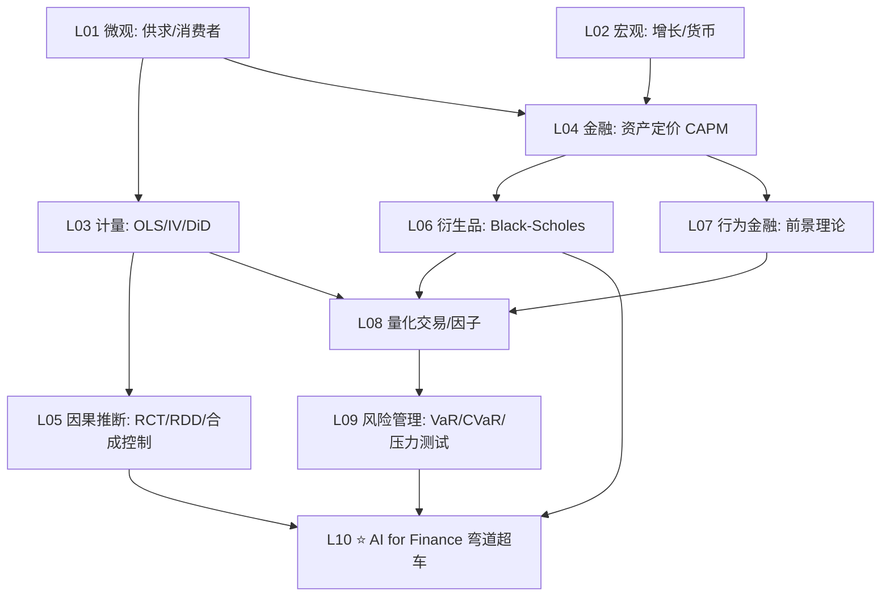

# 💰 世界 Top 经济金融院校 · 全课程实战（2026 完整版）

> **一句话定位**：仿照 [`top-physics-courses/`](../top-physics-courses/) 与 [`top-math-courses/`](../top-math-courses/) 的方法论，把全球 10 所经济金融顶尖名校（经济系 + 商学院 + 金融工程）的核心课程，用**费曼学习法**还原为可理解、可运行、可衔接的知识体系。
>
> **与 `top-physics/math-courses` 的关系**：物理版教"自然规律怎么用实验证伪"，数学版教"轮子背后的几何/代数/分析"。**经济金融版教的是一类全新的对象——「会反过来研究你的人」**。这决定了它的方法论与纯理科有本质差异（见 §根本张力）。

---

## 0. 为什么经济金融和物理/数学「根本不同」

物理学家研究原子，**原子不在乎你研究它**。经济学家研究市场，**市场里的人会预期你的研究、然后改变行为**——这就是 **Lucas 批评（1976）** 的核心：政策一变，经济人的行为就变，基于旧行为的模型立刻失效。

这一条决定了经济金融学科的三个独有特征：

| 特征 | 物理/数学 | 经济金融 |
|---|---|---|
| **研究对象** | 不会反思的对象（原子/定理） | **会反思、会博弈、会撒谎的对象**（人/市场/机构）|
| **可重复性** | 控制实验可重复 | **历史只有一次**（2008 GFC 无法重做）|
| **理论地位** | 越来越收敛（标准模型）| **每场危机重写一次**，且吵 200 年无共识 |

> 经济学是**唯一一门每次危机都会重新发明自己、还会互相吵架两个世纪**的学科。这既是它的软肋（缺共识），也是它的魅力（研究对象本身就是复杂系统）。——本系列的灵魂就在这三句话里。

**对本项目的意义**：用物理/数学那套"理论→证明→收敛"的范式去套经济金融，会**系统性踩坑**（用 EMH 解释泡沫、用正态分布预测肥尾）。本系列的核心任务，就是用五幕范式把这种**反身性（reflexivity, Soros）、肥尾（fat tail, Mandelbrot/Taleb）、模型风险（model risk）**讲透。

---

## 1. 经济金融的三大根本张力（本系列的"危机→革命"主线）

物理的主线是"理论与实验的张力"。经济金融的主线是**三对永远打不死的张力**：

### 张力 ① 理性人 vs 行为人
- **理性人（Homo economicus）**：新古典经济学假设人完全理性、效用最大化、信息完全。数学优美，是大多数模型的基线。
- **行为人**：Kahneman-Tversky **前景理论（1979）** 证明人系统性非理性——损失厌恶、锚定、过度自信。2002 Kahneman 诺奖、2017 Thaler 诺奖。
- **张力**：理性假设让模型可解，行为现实让模型失真。**好的金融学永远在两者间走钢丝**。

### 张力 ② 有效市场 vs 异象
- **有效市场假说 EMH（Fama 1970, 2013 诺奖）**：价格已反映所有信息，无人能持续战胜市场（弱式/半强式/强式）。
- **异象（anomalies）**：动量（Jegadeesh-Titman 1993）、价值（Fama-French 1992 三因子）、规模效应、一月效应、泡沫（Shiller 2000《Irrational Exuberance》, 2013 诺奖）。
- **张力**：Grossman-Stiglitz 悖论（1980）给出优雅回答——**市场有效**恰恰**因为**有人花成本搜集信息赚钱；信息搜集停止的瞬间市场就无效了。有效与非有效**互相生产**。

### 张力 ③ 模型 vs 市场
- **模型**：Black-Scholes（1973, 1997 诺奖）用 Itô 随机微积分给期权定价，开启了衍生品大爆炸。
- **市场反噬**：**1987 黑色星期一**（程序化组合保险放大崩盘）、**1998 LTCM**（两位诺奖得主执掌的基金，正态假设在肥尾前崩塌）、**2008 GFC**（Gaussian Copula 给 CDO 定价，被戏称"摧毁华尔街的公式"）、**2020 负油价**、**2021 Archegos**、**2022 LDI 危机**。
- **张力**：模型优雅 = 假设强 = 黑天鹅来时最致命。**风险管理的本质不是消除风险，而是不让模型自信地把你送上断头台**。

> 📌 **这三对张力就是本系列的脊柱**。每一篇「讲透」都要回答：**这个概念在张力哪一侧？它为了简化牺牲了什么？这个牺牲在什么时机会爆炸？**

---

## 2. 思想史主线（对应物理的"范式转移"）

```
1776  斯密《国富论》"看不见的手"           ← 自由市场原点
1867  马克思《资本论》                     ← 对自由市场的根本批判
1870s 边际革命 (Jevons/Menger/Walras)      ← 数学化开端（边际效用）
1936  凯恩斯《通论》                       ← 大萧条逼出的宏观革命
1947  萨缪尔森《经济分析基础》             ← 经济学全面数学化
1952  Markowitz 均值-方差                  ← 现代投资组合理论 (1990 诺奖)
1970  Fama 有效市场假说 EMH                ← 芝加哥学派登顶 (2013 诺奖)
1973  Black-Scholes-Merton 期权定价        ← 衍生品大爆炸 (1997 诺奖)
1976  Lucas 批评                          ← "政策一变行为就变"
1979  Kahneman-Tversky 前景理论            ← 行为金融革命 (2002 诺奖)
1992  Fama-French 三因子                  ← 因子投资工业化
1998  LTCM 崩盘                           ← 模型风险的血泪教训
2008  全球金融危机 GFC                     ← EMH vs 行为的终局对决
2010s 机器学习金融 / 另类数据              ← 量化 2.0
2020s LLM for Finance (FinGPT/BloombergGPT) / RL 做市 / Agent 市场  ← 量化 3.0 = AI 原生金融
```

**每一次危机 = 一次相变**（呼应 [`复杂系统迭代work4ai.md`](../复杂系统迭代work4ai.md) 的相变概念）。**故事化完整版** → 见 `ECON_FINANCE_EPIC.md`（待阶段 2 撰写，参考 [`top-physics-courses/PHYSICS_EPIC.md`](../top-physics-courses/PHYSICS_EPIC.md) 的八幕剧结构）。

---

## 3. 选校逻辑（10 校 · 经济系 + 商学院 + 金融工程三层）

> **选校原则**：物理/数学选理工强校；经济金融必须选**经济系 + 商学院 + 金融工程**三层都强的学校，且覆盖经济学史上的关键学派（芝加哥学派/凯恩斯传统/行为学派/计量发源地）。

| # | 学校 | 经济系强项 | 商学院/金融强项 | 招牌人物/学派 | 与量化相关性 |
|---|------|-----------|----------------|--------------|------------|
| 1 | **Chicago** | Econ（诺奖摇篮）| **Booth** | **Fama-French / 芝加哥学派 / EMH 发源地** | ★★★★★ |
| 2 | **MIT** | 14.x Economics | **Sloan** (MFin/MBAn) | **Black-Scholes 发源地 / Andrew Lo** | ★★★★★ |
| 3 | **Harvard** | Ec 10 / ECON | **HBS** | **Mankiw / Shleifer 行为金融** | ★★★★ |
| 4 | **Princeton** | ECO | **Bendheim 金融中心** | 异象研究 / Brunnermeier 系统性风险 | ★★★★★ |
| 5 | **Stanford** | ECON | **GSB (FIN)** | **Taylor rule / 金融科技 (FinTech)** | ★★★★★ |
| 6 | **Berkeley** | ECON | **Haas** | 行为金融 / O'Hara 市场微观结构 | ★★★★ |
| 7 | **Yale** | ECON | **SOM** | **Cowles 基金会 = 计量经济学发源地 / Shiller** | ★★★★★ |
| 8 | **Wharton/UPenn** | ECON | **Wharton Finance（金融顶级）** | 金融工程 / 因子投资 | ★★★★★ |
| 9 | **Cambridge** | Faculty of Economics | **Judge** | **Keynes 传统 / MPhil Finance** | ★★★★ |
| 10 | **Oxford** | Economics | **Saïd (SBS) / OMI** | **OMI 金融工程 / 量化金融** | ★★★★ |

**业界金融工程补充校**（弯道超车，详见 `ai_for_finance/`）：
- **CMU MSCF**（46-9xx，金融工程鼻祖，随机微积分 + 计算金融）
- **Columbia IEOR MFE**（量化金融 + 金融科技）
- **NYU Stern**（Courant 协作 + Volatility Institute，Derman/Taleb 传统）
- **Baruch MFE**（业界就业率顶级）
- **LSE**（伦敦金融城门户，计量经济 + 金融强校）
- **ETH Zürich**（量化金融 / MTEC，与 [`top-math-courses`](../top-math-courses/) 联动）

> 📌 **课程编号一手核实铁律**：上表课程编号（如 MIT 14.xxx、Harvard ECON、Yale ECON、Cambridge ECON/Paper B）**必须在阶段 1 用 webfetch 学校官网 / academic guide 一手核实**，不凭记忆。详见 §铁律。

---

## 4. 课程覆盖范围（6 大方向）

10 校 × 平均每校 15-20 门核心课 ≈ **150-200 门经济金融课**。按 6 大方向分类：

| 方向 | 代表课程 | 量化相关性 |
|---|---|---|
| **微观经济理论** | MIT 14.01/14.04, Harvard ECON 1011, Chicago ECON 201/202, Princeton ECO 101/511 | ★★★（博弈论/机制设计直接用）|
| **宏观与货币** | MIT 14.05/14.06, Yale ECON 166, Stanford ECON 1/210, Cambridge Macro | ★★★（DSGE/利率模型基础）|
| **计量与因果推断** | MIT 14.32/14.38, Yale ECON 410/135, Princeton ECO 312/313, Berkeley ECON 140 | ★★★★★（**量化研究方法论核心**）|
| **金融学与资产定价** | Chicago BUS 35200/FIN 552, MIT 15.401/15.405, Yale ECON 545, Wharton FIN 611 | ★★★★★ |
| **公司金融与会计** | HBS FIN, Wharton FIN 601/602, Stanford GSB FIN 620 | ★★★ |
| **金融工程与量化** | CMU 46-944/946, Columbia IEOR E4706/FIN, Oxford OMI, NYU FIN-GB.2390 | ★★★★★（**业界 quant 核心**）|

---

## 5. 八大主题（经济金融版图）

| 主题 | 费曼一句话 | 根本张力 | 最佳版本 | 可跑 demo |
|------|----------|---------|---------|----------|
| **① 微观经济学** | 一切选择都是权衡 | 理性 vs 有限理性 | MIT 14.01 / Harvard ECON 1011 | 供求曲线/消费者剩余 |
| **② 宏观经济学** | 国家也是家庭，但它能印钞票 | 干预 vs 自由（凯恩斯 vs 古典）| Yale ECON 166 / Stanford ECON 210 | Solow 增长/IS-LM |
| **③ 计量经济学** | **相关不是因果** | 相关 vs 因果（识别难题）| MIT 14.32 / Princeton ECO 313 | DiD/IV/RCT 模拟 |
| **④ 资产定价** | 天下没有免费午餐，但有人能持续赚到 | EMH vs 异象 | Chicago Booth FIN 552 / Yale ECON 545 | CAPM/Fama-French |
| **⑤ 衍生品与随机微积分** | 用数学给未来定价 | 模型 vs 市场（肥尾）| MIT 15.405 / CMU 46-944 | **Black-Scholes + Monte Carlo** |
| **⑥ 公司金融** | 钱从哪来，怎么花最值 | 代理问题（委托人 vs 代理人）| Wharton FIN 601 / HBS FIN | MM 定理 |
| **⑦ 市场微观结构与行为金融** | 市场有效，**因为**人无效 | 有效 vs 行为（Grossman-Stiglitz）| Berkeley Haas / Oxford OMI | 订单簿/前景理论 |
| **⑧ 风险管理与量化交易** ⭐ | **活着比赚钱重要** | 收益 vs 尾部风险 | Oxford OMI / CMU MSCF | **VaR/CVaR/回测/因子** |

> ⭐ **第 8 主题 = 你的弯道超车主题**（呼应 [`top-physics-courses/ai_for_physics/`](../top-physics-courses/ai_for_physics/)）。它直接对接 opencode 的 [`quantitative-trading-backtesting-frameworks`](file://~/.config/opencode/skills/quantitative-trading-backtesting-frameworks) 与 [`quantitative-trading-risk-metrics-calculation`](file://~/.config/opencode/skills/quantitative-trading-risk-metrics-calculation) 两个 skill。**可跑 demo 见 [`ai_for_finance/finance_demos.py`](ai_for_finance/finance_demos.py)**。

---

## 6. 目录结构（仿 `top-math-courses`）

```
top-economics-finance-courses/
├── README.md                              ← 本文件（总架构宪法）
├── UNIFIED_ROADMAP.md                     ← 30 课最优路径（融合 10 校）         [阶段 2]
├── CROSS_SCHOOL_INSIGHTS.md               ← 10 校教学风格对比                  [阶段 2]
├── FAST_TRACK.md                          ← 量化工程师 2-3 年快速通道          [阶段 2]
├── ECON_FINANCE_EPIC.md                   ← 经济金融史诗（八幕叙事入口）        [阶段 2]
├── HISTORY_OF_ECON_FINANCE.md             ← 思想史（范式转移 + Kuhn 框架）      [阶段 2]
├── ECON_FINANCE_BREAKTHROUGHS.md          ← 重大突破（诺奖级，含 PART1-4）      [阶段 2]
├── ECON_FINANCE_CROSS_DISCIPLINARY.md     ← 跨学科（Econophysics/复杂系统/AI）  [阶段 2]
├── FEYNMAN_NARRATIVE.md                   ← 费曼叙事主线                        [阶段 2]
├── READING_SCHEDULE.md                    ← 12/24/36 月周历                    [阶段 3]
├── EXPERT_PATH_2026.md                    ← 专家之路（差距分析）                [阶段 3]
├── EXPERT_BENCHMARKS.md                   ← 顶级专家标杆（Fama/Shiller/Lo/Taleb/Mandelbrot）[阶段 3]
├── SURVEY.md                              ← 10 校完整书单                      [阶段 1]
├── THINKERS_BIOGRAPHIES.md                ← 经济学家/金融家列传                [阶段 3]
├── CROSS_INDEX_WITH_WORK4AI.md            ← 经济金融课 ↔ 讲透X/AIfor各学科 映射 ✅
├── AUDIT_SUMMARY.md                       ← 质量审计                            [阶段 4]
│
├── ai_for_finance/                        ← 弯道超车主题 ✅
│   ├── ai_for_finance.md                  ← 6 大子方向（LLM/DL定价/RL做市/GNN风控/另类数据/ABM）
│   └── finance_demos.py                   ← 可跑 demo（Black-Scholes/MC/CAPM/风险指标）✅
│
├── RESOURCES/                             ← 补充资源（按优先级）                [阶段 3]
│   ├── 00_popular_science.md              ← 科普（中文重点：《聪明的投资者》/ Taleb）
│   ├── 01_math_foundations.md             ← P0 数学基础（随机分析/优化/统计）+ 与 top-math 映射
│   ├── 02_quant_toolchain.md              ← P0 量化工具链（Python/Qlib/Zipline/Backtrader）
│   ├── 03_paper_reading_list.md           ← P1 经典论文（CAPM/BS/EMH/前景理论/Fama-French）
│   ├── 04_research_training.md            ← P1 回测训练（10 个因子复现项目）
│   ├── 05_community_data.md               ← P1 数据源/社区/竞赛（Kaggle/QuantConnect）
│   └── 06_regulation_ethics.md            ← P2 合规与伦理（内幕/操纵/ESG）
│
├── chicago-econ-finance/                  ← Chicago Econ + Booth                [阶段 1：一手核实]
│   ├── SCHOOL.md
│   └── {course}/README.md + notes/
├── mit-econ-finance/                      ← MIT 14.x + Sloan                   [阶段 1]
├── harvard-econ-finance/                  ← Harvard ECON + HBS                 [阶段 1]
├── princeton-econ-finance/                ← Princeton ECO + Bendheim           [阶段 1]
├── stanford-econ-finance/                 ← Stanford ECON + GSB                [阶段 1]
├── berkeley-econ-finance/                 ← Berkeley ECON + Haas               [阶段 1]
├── yale-econ-finance/                     ← Yale ECON + SOM (Cowles)           [阶段 1]
├── wharton-econ-finance/                  ← Wharton Finance + UPenn ECON       [阶段 1]
├── cambridge-econ-finance/                ← Cambridge Faculty of Econ + Judge  [阶段 1]
└── oxford-econ-finance/                   ← Oxford Economics + Saïd/OMI        [阶段 1]
```

---

## 7. 三层讲透宪法（与 work4ai 一致）

每门课/主题的笔记按三层（呼应 [`故事化框架-生成器.md`](../故事化框架-生成器.md)）：

1. **直觉层**——一句话比喻 + 为什么需要它 + 它在三大张力哪一侧
2. **数学层**——关键定义、定理、推导（CAPM 推导 / Black-Scholes PDE / DiD 识别假设）
3. **代码层**——可运行的最小 Python/NumPy 实验（定价 / 回测 / 因果识别模拟）

附加：
- **不足层**——模型假设牺牲了什么，在什么时机会爆炸（**经济金融特有且最重要的一层**）
- **应用层**——与量化交易 / 风控 / 投研的具体关联（对接 `quantitative-trading-*` skill）

---

## 8. 与 top-physics/math-courses 的差异

| 维度 | top-physics | top-math | **top-economics-finance** |
|---|---|---|---|
| 核心产物 | 可跑物理 demo | 可读证明 + 数值实验 | **可复现回测 + 风险指标 + 因果识别** |
| 评估方式 | 与实验数据吻合 | 证明正确性 | **样本外表现 + 稳健性 + 样本外失败模式** |
| 工程量 | 每主题 200-500 行 Python | 每主题 5-15 页笔记 + numpy | 每主题 回测脚本 + 风险报告 + 复现论文 |
| **反身性** | 无 | 无 | **强（Lucas 批评：策略公开后失效）** |
| **肥尾** | 物理 rare | 数学 rare | **金融常态（黑天鹅）** |

---

## 9. AI for Finance：你的弯道超车主题

> 经济金融的「AI 原生」弯道超车 = 物理版的 `ai_for_physics/`。详见 `ai_for_finance/ai_for_finance.md`（待写/未落盘）。

**6 大子方向**：

| 子方向 | 核心 | 代表 | 可跑 demo |
|---|---|---|---|
| **LLM for Finance** | 财报/新闻/SEC 文件理解 | **BloombergGPT (2023) / FinGPT** | 情绪→收益信号 |
| **深度学习定价** | Neural SDE / 隐含波动率曲面 | Horvath et al. (2020) | 神经网络拟合 IV surface |
| **强化学习做市/组合** | RL 管理库存、动态对冲 | Spooner et al. (2024) RL 做市 | 简化做市 RL 环境 |
| **图神经网络风控** | 反欺诈 / 系统性风险传染 | GraphSAGE on 交易网络 | 银行间传染模拟 |
| **另类数据 + 因子挖掘** | 卫星图/信用卡/文本→alpha | 因子工业化 | 自动因子挖掘 demo |
| **Agent-Based Models (ABM)** | 模拟市场涌现 | 2024-2026 LLM Agent 市场 | 简化 ABM 价格涌现 |

**可跑 demo 现已提供**：[`ai_for_finance/finance_demos.py`](ai_for_finance/finance_demos.py)（Black-Scholes 解析解 + Monte Carlo 验证 + CAPM 估值 + 风险指标 VaR/CVaR/Sharpe/Sortino/MaxDrawdown，纯标准库，`python3` 直接跑）。

---

## 10. 知识图谱（依赖关系）



**关键路径**：微观 → 计量 → 资产定价 → 衍生品/行为 → 量化与风险 → AI for Finance。

---

## 11. 铁律（沿用 work4ai + top-cs/math/physics-projects）

1. **课程编号一手核实**（学校官网 / academic guide / course catalog，webfetch 核实，不凭记忆）
2. **教材/论文信息精确**（作者、版次、ISBN、arXiv ID、NBER/SSRN 编号——经济金融论文常用 NBER/SSRN）
3. **跨校对比客观**（芝加哥学派 vs 凯恩斯 vs 行为，不偏袒任一派）
4. **样本外必验证**（金融铁律：**回测必看过拟合**，in-sample 好不等于 OOS 好）
5. **代码可跑通**（bash 验证，与 work4ai 铁律一致）
6. **不写空壳**（要么不写，要么写扎实——尤其不凭记忆写课程编号）
7. **反身性提醒**（凡讲到可盈利策略，必附"策略公开后失效"的 Lucas/Soros 警告）

---

## 12. 实施路线图

### 阶段 1：10 校课程清单（**下一步**，需 webfetch）
- 10 校 × `SCHOOL.md`（每校 15-20 门核心课的目录）
- **一手 webfetch 学校官网**核实课程编号、教材、教学大纲
- 输出：`{school}-econ-finance/SCHOOL.md` × 10

### 阶段 2：融合 + 叙事（顶层文档）
- `UNIFIED_ROADMAP`：从 0 基础到量化研究入门的 30 课最优路径
- `ECON_FINANCE_EPIC`：八幕剧史诗（斯密→凯恩斯→EMH→行为→2008→AI 金融）
- `HISTORY_OF_ECON_FINANCE`：思想史 + Kuhn 范式框架 + 失败的革命
- `ECON_FINANCE_BREAKTHROUGHS` PART1-4：诺奖级突破（纯经济/金融/计量/跨学科）
- `CROSS_SCHOOL_INSIGHTS`：同概念（如 CAPM）在 Chicago vs Yale vs Cambridge 怎么不同讲法

### 阶段 3：样板课讲透 + 专家之路
- 选 3-5 门最核心课（如 MIT 15.401 金融理论 / Yale ECON 545 资产定价 / CMU 46-944 衍生品）做完整讲透
- `EXPERT_PATH_2026` + `EXPERT_BENCHMARKS`（Fama/Shiller/Lo/Taleb/Mandelbrot 成长路径）
- `RESOURCES/` 7 份补充资源

### 阶段 4：质量审计
- 仿 [`top-math-courses/AUDIT_SUMMARY.md`](../top-math-courses/AUDIT_SUMMARY.md)：3 轮深审
- 一手核实所有课程链接、教材 ISBN、NBER/SSRN 论文编号

---

## 🎬 一句话收束

> **经济金融不是物理的弟弟，它是另一种动物**——它研究的对象会反过来研究你。本系列的全部手艺，就是用「直觉→数学→代码→**不足**→应用」五幕，把三大张力（理性 vs 行为 / 有效 vs 异象 / 模型 vs 市场）钉死，让你既会用 Black-Scholes，又知道它在 1987/2008 为什么杀人。

---

📌 **下一步**
- ✅ 本 README + [`ai_for_finance/finance_demos.py`](ai_for_finance/finance_demos.py) + [`CROSS_INDEX_WITH_WORK4AI.md`](CROSS_INDEX_WITH_WORK4AI.md) = 样板三件套
- 🚧 **阶段 1**：10 校 `SCHOOL.md`（需逐校 webfetch 一手核实课程编号——**这是最大的工程量，建议分批/并行委派**）
- 📝 需要你确认：① 选校表是否满意？ ② 优先做哪校/哪个主题？ ③ 是否现在就启动阶段 1 的逐校 webfetch？

---

## 📁 学校目录索引（2026-08-15 补挂 · 阶段 1 已完成）

> 上文「🚧 阶段 1」实际已完成（Harvard/MIT/Stanford/Chicago/Princeton/Yale/Berkeley/Oxford/Cambridge/Wharton），共 10 校落盘——此前未在此 README 记账，按[复杂系统审计](../复杂系统迭代work4ai.md)补挂：

| 子目录 | 入口 |
|---|---|
| [`berkeley-econ-finance/`](berkeley-econ-finance/) | [`SCHOOL.md`](berkeley-econ-finance/SCHOOL.md) |
| [`cambridge-econ-finance/`](cambridge-econ-finance/) | [`SCHOOL.md`](cambridge-econ-finance/SCHOOL.md) |
| [`chicago-econ-finance/`](chicago-econ-finance/) | [`SCHOOL.md`](chicago-econ-finance/SCHOOL.md) |
| [`harvard-econ-finance/`](harvard-econ-finance/) | [`SCHOOL.md`](harvard-econ-finance/SCHOOL.md) |
| [`mit-econ-finance/`](mit-econ-finance/) | [`SCHOOL.md`](mit-econ-finance/SCHOOL.md) |
| [`oxford-econ-finance/`](oxford-econ-finance/) | [`SCHOOL.md`](oxford-econ-finance/SCHOOL.md) |
| [`princeton-econ-finance/`](princeton-econ-finance/) | [`SCHOOL.md`](princeton-econ-finance/SCHOOL.md) |
| [`stanford-econ-finance/`](stanford-econ-finance/) | [`SCHOOL.md`](stanford-econ-finance/SCHOOL.md) |
| [`wharton-econ-finance/`](wharton-econ-finance/) | [`SCHOOL.md`](wharton-econ-finance/SCHOOL.md) |
| [`yale-econ-finance/`](yale-econ-finance/) | [`SCHOOL.md`](yale-econ-finance/SCHOOL.md) |
