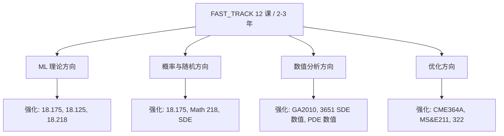

# FAST_TRACK：应用数学工程师 2-3 年快速通道

> **本章核心**：把 [UNIFIED_ROADMAP.md](UNIFIED_ROADMAP.md) 的 30 课压缩到 12 课 / 2-3 年 / 每周 15-20h。**适合已经懂 ML 工程、想补数学理论的工程师**。

---

## 一、适用人群

✅ 你已经：
- 写过 ML 项目（PyTorch / Transformer）
- 看过 ML 论文但**数学细节看不懂**
- 工作 / 创业中，**不能全脱产**学数学
- 目标是"能读懂 ML 顶会论文 + 跟得上 PhD 讨论班"

❌ 你不是这个 FAST_TRACK 的目标用户：
- 想做纯数学研究 → 走完整 [UNIFIED_ROADMAP](UNIFIED_ROADMAP.md)
- 完全零基础（连导数都不熟）→ 先走阶段 0

## 二、12 课 / 2-3 年快速通道

### 第 1 年：基础（4 课 / ~300h）

| # | 课 | 学校 | 教材 | 时间 |
|---|---|---|---|---|
| 1 | **线性代数（直觉版）** | MIT 18.06 | **Strang** | 8 周 × 10h = 80h |
| 2 | **实分析入门** | Princeton MAT 215 | - | 10 周 × 10h = 100h |
| 3 | **概率（严格版）** | MIT 18.175 | Durrett | 12 周 × 10h = 120h |

> 跳过：多变量分析（用 Strang 的工程版够）、复分析、ODE/PDE（工程经验已够）

### 第 2 年：核心（5 课 / ~350h）

| # | 课 | 学校 | 教材 | 时间 |
|---|---|---|---|---|
| 4 | **测度论** | MIT 18.125 | Folland | 10 周 × 10h = 100h |
| 5 | **线性代数（严格版）** | Berkeley Math 110 | **Axler** | 8 周 × 10h = 80h |
| 6 | **凸优化** | Stanford CME 364A | **Boyd** | 10 周 × 10h = 100h |
| 7 | **数值线性代数** | UT Austin M 383E | **Trefethen & Bau** | 7 周 × 10h = 70h |

### 第 3 年：前沿（3 课 / ~250h）

| # | 课 | 学校 | 教材 | 时间 |
|---|---|---|---|---|
| 8 | **泛函分析** | MIT 18.102 | Lax | 10 周 × 10h = 100h |
| 9 | **随机过程** | Berkeley Math 218 | Durrett II | 10 周 × 10h = 100h |
| 10 | **前沿专题** | Cambridge Part III 任选 | - | 50h+ |

> 跳过：拓扑（学泛函时按需补）、抽象代数（除非做表示论方向）、复分析（除非做调和分析）

## 三、与其他方向的快速通道

### 4 个快速通道总览

### 方向 A：ML 理论（建议补强）

- **必修**：#3 概率（18.175）、#4 测度（18.125）、#9 随机过程（218）
- **选修**：信息论（18.424）、调和分析（18.103）

### 方向 B：概率与随机

- **必修**：#3 概率（18.175）、#4 测度（18.125）、#9 随机过程（218）
- **选修**：SDE（M 387D）、随机矩阵（Oxford C7.1）

### 方向 C：数值分析

- **必修**：#7 数值线代（M 383E）、#8 泛函（18.102）
- **选修**：SDE 数值（ETH 401-3651）、PDE 数值（ETH 401-2661）

### 方向 D：优化

- **必修**：#5 线代（Axler）、#6 凸优化（CME 364A）
- **选修**：组合优化（MS&E 322）、非凸优化（CME 364A）

## 四、与 work4ai 讲透系列的并行学习

| 这 12 课 | 同期可读的 work4ai 主题 |
|---|---|
| #1 MIT 18.06 线代 | 讲透反向传播、讲透 Transformer |
| #2 Princeton MAT 215 实分析 | 讲透激活函数 |
| #3 MIT 18.175 概率 | 讲透泛化、讲透统计学习理论 |
| #4 MIT 18.125 测度 | 讲透泛化 |
| #5 Berkeley Math 110 Axler | 讲透反向传播（梯度流）|
| #6 Stanford CME 364A 优化 | 讲透优化器 |
| #7 UT Austin M 383E 数值 | 讲透 PyTorch（矩阵算子）|

## 五、加速技巧

### 技巧 1：用视频 + 书 + 习题混合学

- 视频：MIT OCW（Strang 等的现场感）
- 书：精读教材（Rudin/Boyd/Axler）
- 习题：每周做 20-30 题

### 技巧 2：跳过与 ML 无关的章节

例如读 Rudin *Principles* 时：
- ✅ 必读：第 1-7 章（极限、连续、微分、积分、级数）
- ⚠️ 选读：第 8 章（一些特殊函数）
- ❌ 跳过：第 9-10 章（多元微积分的严格处理，先看其他书）

### 技巧 3：与 ML 论文配对读

学完 18.175 概率后，立刻读 ML 理论论文（如 Bartlett 等 generalization bounds），看数学工具怎么用。

### 技巧 4：用 Numerical Linear Algebra 配合 Strang

Trefethen & Bau 的《Numerical Linear Algebra》很薄（300 页），2 周读完，与 Strang 18.06 配合绝佳。

### 技巧 5：用 Cambridge Notes 替代讲义

Cambridge Tripos 的官方 synopses + Past Tripos papers 是公开的，比买教材更精准。

## 六、3 年时间表（参考）

### Year 1（300h）

- Q1: 18.06 线代（80h）
- Q2-Q3: MAT 215 实分析（100h）
- Q3-Q4: 18.175 概率（120h）

### Year 2（350h）

- Q1: 18.125 测度（100h）
- Q2: Math 110 Axler（80h）
- Q3: CME 364A 凸优化（100h）
- Q4: M 383E 数值（70h）

### Year 3（250h）

- Q1: 18.102 泛函（100h）
- Q2: Math 218 随机过程（100h）
- Q3-Q4: 前沿专题（50h+）

## 七、验收标准

每完成一课，**自测是否能**：

| 课 | 验收 |
|---|---|
| 18.06 | 能手算 SVD，能解释 attention 为何用 softmax |
| MAT 215 | 能 ε-δ 证明极限，能解释为何 ReLU 不连续但可微 |
| 18.175 | 能用大数定律推导 SGD 收敛 |
| 18.125 | 能解释 Lebesgue 积分与 Riemann 积分区别 |
| Math 110 | 能证明谱定理，能解释 PCA 的几何意义 |
| CME 364A | 能用 KKT 条件推导 SVM，能解释 SGD 为何在凸函数上收敛 |
| M 383E | 能实现 QR 分解并解释为何稳定 |
| 18.102 | 能解释 Banach 不动点定理，能用于证明神经网络存在性 |
| Math 218 | 能用鞅论证明强化学习的收敛 |

## 八、铁律

1. **不要试图 1 年内学完**——质量比速度重要
2. **每周固定时间**（如周末 + 3 个晚上）
3. **找到学习伙伴或导师**——数学不能完全自学
4. **每课做习题集**——不做题等于没学
5. **遇到不懂的回去补**——而不是硬读论文
6. **保持与 ML 工程实践同步**——理论+工程双向印证

---

📌 **下一步**：
- 开始第 1 课 → [MIT 18.06](mit-math-courses/18_06_linear_algebra/)（待建子目录）
- 想看 30 课完整路径 → [UNIFIED_ROADMAP.md](UNIFIED_ROADMAP.md)
- 想看 9 校对比 → [CROSS_SCHOOL_INSIGHTS.md](CROSS_SCHOOL_INSIGHTS.md)
