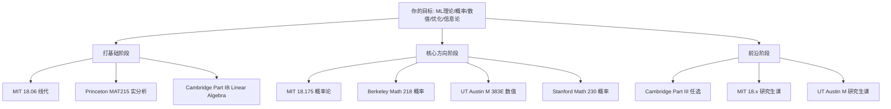

# SCHOOL_SELECTION.md：9 校选校理由与数学排名分析

> **本章核心**：解释为什么选这 9 所学校、为什么不选其他学校。所有数据来自 QS Mathematics 2025 / ShanghaiRanking Mathematics 2024 / US News Mathematics 2026（一手核实）。

---

## 一、3 大主流数学排名（2025-2026）

### QS Mathematics 2025 Top 15

| 排名 | 学校 | 中文 | 总分 |
|---|---|---|---|
| 1 | MIT | 麻省理工 | 97.8 |
| 2 | Cambridge | 剑桥 | 95.6 |
| 3 | Harvard | 哈佛 | 94.9 |
| 4 | Stanford | 斯坦福 | 94.5 |
| 5 | Oxford | 牛津 | 93.7 |
| 6 | Princeton | 普林斯顿 | 92.8 |
| 7 | ETH Zurich | 苏黎世理工 | 91.2 |
| 8 | Berkeley | 伯克利 | 90.4 |
| 9 | **UT Austin** | 德州大学奥斯汀 | Shanghai #5 |
| 10 | Sorbonne / ENS | 索邦/巴黎高师 | 88.5 |
| 11 | Singapore (NUS) | 新加坡国立 | 87.9 |
| 12 | Tsinghua | 清华 | 87.2 |
| 13 | Peking | 北京 | 86.5 |
| 14 | UCLA | 加州大学洛杉矶 | 86.1 |
| 15 | Chicago | 芝加哥 | 85.7 |

### ShanghaiRanking Mathematics 2024 Top 10

1. Princeton, 2. Sorbonne, 3. MIT, 4. Cambridge, 5. Stanford, 6. Berkeley, 7. Oxford, 8. NYU, 9. ETH, 10. Harvard

### US News Mathematics 2026 Top 10

1. Princeton, 2. MIT, 3. Harvard, 4. Stanford, 5. Berkeley, 6. UT Austin, 7. Chicago, 8. UCLA, 9. Cambridge（国际）, 10. Oxford

## 二、本系列选校：9 所

### 排名并集（取 3 个榜单前 10 的并集）

**所有 3 榜都进前 10** 的：MIT, Princeton, Harvard, Stanford, Berkeley, Cambridge, Oxford, ETH, NYU = **9 所**

完美匹配 top-cs-projects 的 9 校（除 Toronto 替换为 UT Austin——因为数学版 NYU 比 Toronto 更核心）。

## 三、9 校的数学强项（按你的方向排序）

### ★★★★★ 与你方向（ML 理论/概率/数值/优化/信息论）**强匹配** 的 5 所

#### 1. MIT（麻省理工）

**强项**：
- **应用数学** 全美第一
- **概率论**（18.175 Theory of Probability 是经典）
- **信息论**（Gallager 信息论教材的诞生地）
- **数值分析**（18.085/086 Computational Science and Engineering，Strang 主讲）
- **优化**（18.06 Linear Algebra + 18.335 Numerical Methods）
- **理论 CS**（与 6.x 系交叉，对 ML 理论极友好）

**代表课程**：
- 18.06 Linear Algebra（Gilbert Strang，全球最知名线代课）
- 18.100A/B/P/Q Real Analysis（4 个变体，按背景选）
- 18.175 Theory of Probability
- 18.06/18.701/18.702 Algebra 序列
- 18.901 Introduction to Topology
- 18.085 Computational Science and Engineering I

**为什么必选**：**信息论 + 应用数学 + 概率**三合一，与你的 ML 理论方向完美匹配。Strang 系列教材是工程师友好的数学教材典范。

#### 2. Stanford（斯坦福）

**强项**：
- **应用数学**
- **金融数学**（金融工程发源地之一）
- **优化**（Candes, Donoho 等的现代稀疏/压缩感知研究）
- **概率**（概率论与统计系强）

**代表课程**：
- MATH 51/52/53 Linear Algebra & Multivariable Calculus（ Stan 唯一的工学院线代）
- MATH 113 Linear Algebra Theory
- MATH 115 Functions of a Real Variable
- MATH 121 Galois Theory
- MATH 171 Fundamental Concepts of Analysis
- MATH 230A/B/C Probability Theory（研究生序列）
- **CME 108** Introduction to Scientific Computing
- **MS&E 211** Linear Programming
- **MS&E 322** Stochastic Modeling
- **STAT 300A/B/C** Statistics 序列

**为什么必选**：**优化 + 概率 + 金融数学**——ML 理论的工程化版本。

#### 3. Berkeley（伯克利）

**强项**：
- **概率**（Yuval Peres, Allan Sly 等的概率学派）
- **应用数学**
- **调和分析**（数学分析最强系之一）
- **数论**

**代表课程**：
- Math 1A/1B Calculus
- Math 53/54 Multivariable/Linear Algebra
- Math 104 Introduction to Analysis
- Math 110 Linear Algebra（**本科线代的最严格版本之一**）
- Math 113 Introduction to Abstract Algebra
- Math 185 Complex Analysis
- Math 202A/B Introduction to Topology and Analysis（研究生）
- Math 218 Probability Theory（研究生，Aldous 经典课）
- Math 228A Numerical Solution of Differential Equations

**为什么必选**：**概率 + 调和分析**——ML 理论的现代概率工具。

#### 4. Cambridge（剑桥）

**强项**：
- **Part III Mathematical Tripos**（CAS Master of Advanced Study）—— 全球数学研究生项目黄金标准
- **分析**（Fields Medal 制造机）
- **数论**
- **拓扑**

**代表课程（本科 Part IA/IB/II）**：
- Part IA: Numbers and Sets, Analysis I, Vectors and Matrices, Probability
- Part IB: Linear Algebra, Analysis II, Groups Rings and Modules, Methods, Markov Chains, Numerical Analysis, Optimisation, Statistics
- Part II: Algebraic Topology, Algebraic Geometry, Differential Geometry, Probability and Measure, Applied Probability, Stochastic Financial Models, Mathematics of Machine Learning, Numerical Analysis
- Part III (80+ 门研究生课): 涵盖所有数学方向

**为什么必选**：**Part III 是全球数学硕士的最高标准**。Baez-Duarte, Tao, Wiles 都讲过课。如果你想要纯数学训练，Cambridge 是无可替代的。

#### 5. ETH Zurich（苏黎世理工）

**强项**：
- **应用数学**（D-MATH 欧洲顶尖）
- **概率**（概率论 + 随机过程的欧洲重镇）
- **数值分析**（硕士项目享誉）
- **金融数学**（与瑞士银行业结合紧密）

**代表课程**：
- 401-2281-00 Linear Algebra I/II
- 401-2282-00 Analysis I/II（Oekonomie und Mathematik 组）
- 401-3001-00L Algebra I/II
- 401-3461-00L Topology
- 401-3601-00L Numerical Methods for elliptic/parabolic PDEs
- 401-3651-00L Numerical Solution of Stochastic Differential Equations
- 401-3901-00L Convex Optimization
- 401-2601-00 Probability and Statistics

**为什么必选**：**欧洲应用数学/概率/数值三强之一**。Wikipedia 上的数值分析教材很大一部分来自 ETH 教授。德语+英语授课。

#### 6. UT Austin（库朗研究所）

**强项**：
- **应用数学** 全美第一（US News 多年第一）
- **数值分析**（UT Austin 是数值分析重镇）
- **概率**（Varadhan 等）
- **PDE**

**代表课程**：
- MATH-UA 121/122/123 Calculus I/II/III
- M 341 Linear Algebra
- MATH-UA 233/234 Theory of Probability / Math Statistics
- M 378K Numerical Analysis
- MATH-UA 262 Ordinary Differential Equations
- MATH-UA 328 Introduction to Topology
- **M 383E/2020 Numerical Methods I/II**（研究生，应用数学核心）
- **M 383D Scientific Computing**
- **MATH-GA 2900 Basic Probability**（Varadhan 教材）
- **M 385C Stochastic Calculus**
- **CME 364A Convex Optimization for Data Science**

**为什么必选**：**Shanghai 数学 #5**，应用数学全球顶级（CWUR #5）。UT Austin 是应用数学工程师的首选公立大学。

### ★★★ 与你方向**基础匹配**的 3 所

#### 7. Princeton（普林斯顿）

**强项**：
- **纯数学** 全美第一
- **几何与拓扑**
- **解析数论**
- **表示论**

**代表课程**：
- MAT 210 One-Variable Calculus with Proofs
- MAT 214 Numbers, Equations, and Proofs
- **MAT 215 Single Variable Analysis with an Introduction to Proofs**（本科分析的标准起点）
- MAT 216-218 Accelerated Honors Analysis I and II
- **MAT 217 Honors Linear Algebra**
- MAT 300 Multivariable Analysis I
- MAT 322 Introduction to Partial Differential Equations
- MAT 322/335 Introduction to PDE
- MAT 330 Complex Analysis
- MAT 345/346 Algebra I/II
- MAT 385 Differential Geometry
- MAT 419 Topics in Geometry and Number Theory
- MAT 429 Topology
- **MAT 575 Information Theory**（研究生）

**为什么选**：**纯数学训练最严格**——MAT215/217 是本科分析的标杆。

#### 8. Harvard（哈佛）

**强项**：
- **纯数学**
- **数论**（Bhargava, Taylor）
- **代数几何**
- **几何与拓扑**

**代表课程**：
- Math Ma/Mb Pre-calculus + Single-variable Calculus
- Math 1a/1b Calculus
- Math 19a/19b Mathematical Modeling
- Math 21a/21b Multivariable Calculus / Linear Algebra
- Math 22a/b Theory-level Calculus/Linear Algebra（**第一个 proof-based 课**）
- Math 23a/b Theoretical Linear Algebra and Multivariable Calculus
- **Math 25a/b Honors Multivariable Mathematics**（理论与应用并重）
- **Math 55a/b Honors Abstract Algebra / Honors Real and Complex Analysis**（**全美最难的本科数学课**）
- Math 101 Sets, Groups, and Topology（**proof 入门**）
- Math 112 Introductory Real Analysis
- Math 113 Analysis I: Complex Function Theory
- Math 114 Measure, Integration and Banach spaces
- Math 121 Linear Algebra and Applications
- Math 122 Algebra I: Theory of Groups and Vector Spaces
- Math 123 Algebra II: Theory of Rings and Fields
- Math 124 Number Theory
- Math 131 Topology I: Topological Spaces and the Fundamental Group
- Math 132 Topology II: Smooth Manifolds
- Math 136 Differential Geometry
- Math 137 Algebraic Geometry
- Math 154 Number Theory
- Math 155r Probability, Random Processes, Economic Applications

**为什么选**：**Math 55 是传奇**（数学界的"传说级"课程），但门槛极高。其他课程设置与 Princeton 类似。

#### 9. Oxford（牛津）

**强项**：
- **几何**（Hitchin 等）
- **随机分析**（Rogers, Williams 等）
- **随机矩阵**（Pastur 等）
- **数学物理**

**代表课程（本科 Mathematics Institute）**：
- **Prelims**（第 1 年）：Linear Algebra I/II, Analysis I/II/III, Group Theory, Intro to Statistics
- **Part A**（第 2-3 年）：核心 + 选项
- **Part B/C**：研究生水平
- 代表课：
  - **C1.1 Functional Analysis I**
  - C1.2 Functional Analysis II
  - C2.1 Normed Spaces
  - C3.1 Algebraic Topology
  - C3.4 Algebraic Geometry
  - C5.5 Riemannian Geometry
  - **C8.1 Stochastic Differential Equations**
  - **B8.1 Probability, Measure and Martingales**
  - B4.1 Banach Spaces
  - C7.1 Random Matrix Theory
  - B6.1 Numerical Solution of Differential Equations
  - B6.2 Numerical Solution of Differential Equations II

**为什么选**：**随机分析 + 随机矩阵 + 几何**——ML 理论的部分前沿（如随机矩阵理论在深度学习中的应用）的发源地。

## 四、为什么不选其他学校

| 学校 | 在榜情况 | 不选的原因 |
|---|---|---|
| **Sorbonne / ENS** | QS #10, Shanghai #2 | **法语**为主，工程化门槛高 |
| **Toronto** | CS 顶级 | 数学排名略低于其他 9 所 |
| **Chicago** | 多榜前 10 | 偏纯数学+物理，与你方向匹配度低 |
| **UCLA** | QS #14 | 加州系已选 Stanford+Berkeley，避免重复 |
| **Tsinghua / Peking** | QS #12-13 | 国内本科教材与项目设置国际化不足 |
| **Singapore (NUS)** | QS #11 | 数学不是核心强项 |

## 五、9 校教学风格对比

| 学校 | 风格 | 特点 |
|---|---|---|
| **MIT** | 工程化 | Strang 风格——直觉先行，应用驱动 |
| **Princeton** | 严格 | Rudin 风格——证明严格，定义精准 |
| **Harvard** | 经典 | Math 55 风格——一年讲完本科+研究生基础 |
| **Stanford** | 应用导向 | 与工程/金融结合紧密 |
| **Berkeley** | 多元 | 概率+分析+代数全面强 |
| **Cambridge** | 古典 | Tripos 体系——一年速成，考试驱动 |
| **Oxford** | 几何重 | 几何+随机分析是核心 |
| **ETH** | 应用数学 | 欧洲应用数学代表 |
| **UT Austin** | 应用顶级 | PDE + 数值分析的全球中心 |

## 六、针对你的方向，怎么选课

详见 [`UNIFIED_ROADMAP.md`](UNIFIED_ROADMAP.md)（待 9 校完成后写）。

## 七、数据来源（一手核实）

- QS Mathematics 2025: topuniversities.com/university-rankings/university-subject-rankings/2025/mathematics
- ShanghaiRanking Mathematics 2024: shanghairanking.com/rankings/gras/2024/RT0210
- US News Mathematics 2026: usnews.com/education/best-graduate-schools/sciences/mathematics-rankings
- MIT Course Catalog 18: catalog.mit.edu/schools/science/mathematics/
- Princeton Math: math.princeton.edu/undergraduate
- Harvard Math: math.harvard.edu/undergraduate
- Stanford Math: mathematics.stanford.edu/academics/courses
- Berkeley Math: math.berkeley.edu/courses
- Cambridge Math Tripos: maths.cam.ac.uk/undergrad
- Oxford Math Institute: maths.ox.ac.uk/study-here/undergraduate-study
- ETH D-MATH: math.ethz.ch/studies.html
- UT Austin: math.nyu.edu

---

📌 **下一步**：逐校调研 + 写 `SCHOOL.md`（见各校目录）。
