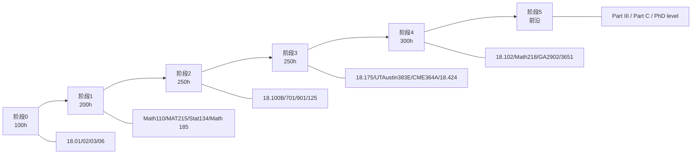

# UNIFIED_ROADMAP：从 0 基础到研究入门的 30 课最优路径

> **本章核心**：把 9 校的 150+ 门课**融合**成一条**从数学零基础到研究入门级**的 30 课最优路径。每课选**最适合自学**的版本（可能来自不同学校）。

---

## 一、设计原则

1. **目标导向**：终点是"应用数学研究型工程师"（你方向：ML 理论/概率/数值/优化/信息论）
2. **依赖关系严格**：每课的先修课要清楚标注
3. **每课选最适合自学的版本**：
   - 线代 → MIT 18.06（Strang 风格最友好）
   - 实分析 → Princeton MAT215（严格）或 Berkeley Math 104（适中）
   - 概率 → Berkeley Stat 134（直观）或 MIT 18.175（理论）
4. **节奏现实**：每周 10-20h × 60 周/年 × 4-6 年 = 2400-6000 小时

## 二、30 课路径总览

```
阶段 0 (基础): 数学完全零基础入门
阶段 1 (本科基础): 微积分 + 线代 + 离散
阶段 2 (本科核心): 实分析 + 抽代 + 拓扑
阶段 3 (本科应用): 数值 + 概率 + 优化
阶段 4 (研究生): 测度论 + 泛函 + 随机过程
阶段 5 (前沿): ML 理论 / 数值分析 / 优化 / 信息论
```

## 三、阶段 0：数学完全零基础入门（4 课，约 100h）

> 你的起点：数学自评 0，但逻辑思维强

| # | 课 | 学校 | 教材 | 估时 | 先修 |
|---|---|---|---|---|---|
| 1 | 单变量微积分 | MIT 18.01 | Strang *Calculus* | 30h | 高中数学 |
| 2 | 多变量微积分 | MIT 18.02 | Marsden & Tromba | 25h | #1 |
| 3 | 线性代数（直觉版）| **MIT 18.06** ★ | **Strang** | 30h | #1 |
| 4 | 微分方程 | MIT 18.03 | Boyce & DiPrima | 20h | #1-2 |

**阶段产出**：能用数学描述 ML 模型的 forward pass（梯度、向量、矩阵）。

## 四、阶段 1：本科基础（6 课，约 200h）

| # | 课 | 学校 | 教材 | 估时 | 先修 |
|---|---|---|---|---|---|
| 5 | 线性代数（严格版）| **Berkeley Math 110** ★ | **Axler *Linear Algebra Done Right*** | 40h | #3 |
| 6 | 离散数学 | MIT 6.042J | Lehman & Leighton | 25h | - |
| 7 | 概率（直觉版）| Berkeley Stat 134 | Pitman *Probability* | 35h | #1-2 |
| 8 | 实分析入门 | **Princeton MAT 215** ★ | - | 40h | #3 #5 |
| 9 | 多变量分析 | Princeton MAT 300 | - | 30h | #8 |
| 10 | 复分析入门 | Berkeley Math 185 | Gamelin | 30h | #8 |

**阶段产出**：能读懂 ML 理论论文的引言部分（概率论 + 线代）。

## 五、阶段 2：本科核心（6 课，约 250h）

| # | 课 | 学校 | 教材 | 估时 | 先修 |
|---|---|---|---|---|---|
| 11 | 实分析（严格）| **MIT 18.100B** ★ | **Rudin *Principles*** | 45h | #8 |
| 12 | 抽象代数 I | MIT 18.701 | Artin *Algebra* | 40h | #5 |
| 13 | 抽象代数 II | MIT 18.702 | Artin | 35h | #12 |
| 14 | 拓扑入门 | MIT 18.901 | Munkres *Topology* | 45h | #11 |
| 15 | 线性代数进阶 | Cambridge Part IB Linear Algebra | - | 35h | #5 |
| 16 | 测度论入门 | MIT 18.125 | Folland *Real Analysis* | 50h | #11 |

**阶段产出**：能读懂任意 ML 理论论文。

## 六、阶段 3：本科应用（6 课，约 250h）

| # | 课 | 学校 | 教材 | 估时 | 先修 |
|---|---|---|---|---|---|
| 17 | 概率论（严格）| **MIT 18.175** ★ | **Durrett *Probability*** | 45h | #16 |
| 18 | 数值线性代数 | **UT Austin M 383E** ★ | **Trefethen & Bau** | 40h | #5 #11 |
| 19 | 数值微分方程 | MIT 18.086 或 ETH 401-2611 | - | 40h | #4 #18 |
| 20 | 凸优化 | **Stanford CME 364A** ★ | **Boyd & Vandenberghe** | 45h | #5 #11 |
| 21 | 数理统计 | Berkeley Stat 200A | Keener | 40h | #17 |
| 22 | 信息论 | **MIT 18.424 Seminar** ★ | Cover & Thomas | 40h | #7 #11 |

**阶段产出**：能独立做 ML 理论或数值分析的硕士级项目。

## 七、阶段 4：研究生（6 课，约 300h）

| # | 课 | 学校 | 教材 | 估时 | 先修 |
|---|---|---|---|---|---|
| 23 | 泛函分析 | MIT 18.102 | Lax *Functional Analysis* | 50h | #14 #16 |
| 24 | 调和分析 | MIT 18.103 | Stein & Shakarchi | 50h | #16 #23 |
| 25 | 随机过程 | **Berkeley Math 218** ★ | Durrett *Probability* II | 50h | #17 |
| 26 | 随机微积分 | **UT Austin M 387D** ★ | Karatzas & Shreve | 50h | #25 |
| 27 | 微分几何 | Cambridge Part II Diff Geometry | Do Carmo | 50h | #14 |
| 28 | 数值分析（高阶）| ETH 401-3651 SDE 数值 | Kloeden & Platen | 50h | #18 #26 |

**阶段产出**：能跟得上 PhD 课程。

## 八、阶段 5：前沿（2 课，深度方向任选）

| # | 课 | 学校 | 备注 |
|---|---|---|---|
| 29 | 前沿专题 1 | Cambridge Part III / MIT 18.725 / UT Austin | 按你的研究方向选 |
| 30 | 前沿专题 2 | 同上 | 按你的研究方向选 |

**候选前沿专题**：

| 方向 | 推荐课 |
|---|---|
| **ML 理论** | Cambridge Part II Mathematics of Machine Learning + Part III MALS |
| **概率** | Oxford C7.1 Random Matrix Theory + C8.1 SDE |
| **数值分析** | ETH 401-4671 高级 PDE 数值 + UT Austin M 2110 |
| **优化** | Stanford MS&E 322 + ETH 401-3913 |
| **信息论** | MIT 18.338J Infinite Random Matrix Theory |

**阶段产出**：能写 ML 理论 / 数值分析的论文。

## 九、路径可视化



## 十、总时间预估

| 阶段 | 课时 | 累计 |
|---|---|---|
| 0 | 100h | 100h |
| 1 | 200h | 300h |
| 2 | 250h | 550h |
| 3 | 250h | 800h |
| 4 | 300h | 1100h |
| 5 | 200h+ | 1300h+ |

按每周 15h × 50 周/年 = 750h/年，**约 1.5-2 年完成阶段 0-4**。再 1-2 年做前沿专题。

**与你目标匹配**：6-8 年达研究入门级 → 阶段 0-4 用 2 年，阶段 5 + 研究 4-6 年。

## 十一、路径变体（按方向侧重）

### ML 理论方向（重点）

加强：#17 概率 #16 测度 #21 统计 #22 信息论 #25 随机过程 #29-30 前沿

### 数值分析方向

加强：#18-19 数值 #20 优化 #28 SDE 数值 #29 高级 PDE 数值

### 优化方向

加强：#11 实分析 #20 凸优化 #29 非凸优化 / 组合优化

### 信息论方向

加强：#22 信息论 #29-30 网络信息论 / 随机矩阵

## 十二、与 work4ai 讲透系列的并行学习

| 数学课 | 同期可学的 work4ai 主题 |
|---|---|
| #3 MIT 18.06 线代 | 讲透反向传播、讲透 Transformer |
| #5 Berkeley Math 110 | 讲透反向传播（梯度流） |
| #11 MIT 18.100B 实分析 | 讲透激活函数（连续性） |
| #16 MIT 18.125 测度 | 讲透泛化（概率边界） |
| #17 MIT 18.175 概率 | 讲透泛化、讲透统计学习理论 |
| #18 UT Austin M 383E 数值 | 讲透 PyTorch（矩阵算子） |
| #20 Stanford CME 364A 优化 | 讲透优化器 |

详见 [CROSS_INDEX_WITH_WORK4AI.md](CROSS_INDEX_WITH_WORK4AI.md)。

## 十三、铁律

1. **不要跳级**——数学严格依赖，跳了后面会卡
2. **每课做完习题**——数学不练 = 没学
3. **遇到不懂的回去补**——而不是硬读论文
4. **半年回头**——重做前面的题，巩固
5. **每周至少 10h**——节奏断了难恢复
6. **配合 work4ai 讲透系列**——理论+工程并行

---

📌 **下一步**：
- 想压缩到 2-3 年 → [FAST_TRACK.md](FAST_TRACK.md)
- 想看 9 校对比 → [CROSS_SCHOOL_INSIGHTS.md](CROSS_SCHOOL_INSIGHTS.md)
- 想与 work4ai 联动 → [CROSS_INDEX_WITH_WORK4AI.md](CROSS_INDEX_WITH_WORK4AI.md)
- 开始第 1 课 → mit-math-courses/18_01_calculus/（待建）
