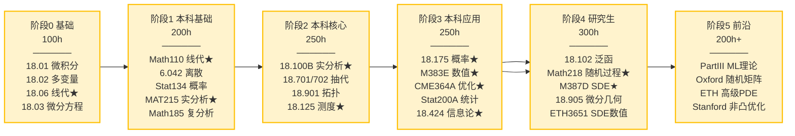

# UNIFIED_ROADMAP：从 0 基础到研究入门的 30 课最优路径

> **本章核心**：把 9 校的 150+ 门课**融合**成一条**从数学零基础到研究入门级**的 30 课最优路径。每课选**最适合自学**的版本（可能来自不同学校）。

---

## 一、设计原则

1. **目标导向**：终点是"应用数学研究型工程师"（你方向：ML 理论/概率/数值/优化/信息论）
2. **依赖关系严格**：每课的先修课要清楚标注
3. **每课选最适合自学的版本**：
   - 线代 → MIT 18.06（Strang 风格最友好）
   - 实分析 → Princeton MAT215（严格）或 Berkeley Math 104（适中）
   - 概率 → Berkeley Stat 134（直观）或 MIT 18.175（理论）
4. **节奏现实**：每周 10-20h × 60 周/年 × 4-6 年 = 2400-6000 小时

## 二、30 课路径总览

```
阶段 0 (基础): 数学完全零基础入门
阶段 1 (本科基础): 微积分 + 线代 + 离散
阶段 2 (本科核心): 实分析 + 抽代 + 拓扑
阶段 3 (本科应用): 数值 + 概率 + 优化
阶段 4 (研究生): 测度论 + 泛函 + 随机过程
阶段 5 (前沿): ML 理论 / 数值分析 / 优化 / 信息论
```

## 三、阶段 0：数学完全零基础入门（4 课，约 100h）

> 你的起点：数学自评 0，但逻辑思维强

| # | 课 | 学校 | 教材 | 估时 | 先修 |
|---|---|---|---|---|---|
| 1 | 单变量微积分 | MIT 18.01 | Strang *Calculus* | 30h | 高中数学 |
| 2 | 多变量微积分 | MIT 18.02 | Marsden & Tromba | 25h | #1 |
| 3 | 线性代数（直觉版）| **MIT 18.06** ★ | **Strang** | 30h | #1 |
| 4 | 微分方程 | MIT 18.03 | Boyce & DiPrima | 20h | #1-2 |

**阶段产出**：能用数学描述 ML 模型的 forward pass（梯度、向量、矩阵）。

## 四、阶段 1：本科基础（6 课，约 200h）

| # | 课 | 学校 | 教材 | 估时 | 先修 |
|---|---|---|---|---|---|
| 5 | 线性代数（严格版）| **Berkeley Math 110** ★ | **Axler *Linear Algebra Done Right*** | 40h | #3 |
| 6 | 离散数学 | MIT 6.042J | Lehman & Leighton | 25h | - |
| 7 | 概率（直觉版）| Berkeley Stat 134 | Pitman *Probability* | 35h | #1-2 |
| 8 | 实分析入门 | **Princeton MAT 215** ★ | - | 40h | #3 #5 |
| 9 | 多变量分析 | Princeton MAT 300 | - | 30h | #8 |
| 10 | 复分析入门 | Berkeley Math 185 | Gamelin | 30h | #8 |

**阶段产出**：能读懂 ML 理论论文的引言部分（概率论 + 线代）。

## 五、阶段 2：本科核心（6 课，约 250h）

| # | 课 | 学校 | 教材 | 估时 | 先修 |
|---|---|---|---|---|---|
| 11 | 实分析（严格）| **MIT 18.100B** ★ | **Rudin *Principles*** | 45h | #8 |
| 12 | 抽象代数 I | MIT 18.701 | Artin *Algebra* | 40h | #5 |
| 13 | 抽象代数 II | MIT 18.702 | Artin | 35h | #12 |
| 14 | 拓扑入门 | MIT 18.901 | Munkres *Topology* | 45h | #11 |
| 15 | 线性代数进阶 | Cambridge Part IB Linear Algebra | - | 35h | #5 |
| 16 | 测度论入门 | MIT 18.125 | Folland *Real Analysis* | 50h | #11 |

**阶段产出**：能读懂任意 ML 理论论文。

## 六、阶段 3：本科应用（6 课，约 250h）

| # | 课 | 学校 | 教材 | 估时 | 先修 |
|---|---|---|---|---|---|
| 17 | 概率论（严格）| **MIT 18.175** ★ | **Durrett *Probability*** | 45h | #16 |
| 18 | 数值线性代数 | **UT Austin M 383E** ★ | **Trefethen & Bau** | 40h | #5 #11 |
| 19 | 数值微分方程 | MIT 18.086 或 ETH 401-2611 | - | 40h | #4 #18 |
| 20 | 凸优化 | **Stanford CME 364A** ★ | **Boyd & Vandenberghe** | 45h | #5 #11 |
| 21 | 数理统计 | Berkeley Stat 200A | Keener | 40h | #17 |
| 22 | 信息论 | **MIT 18.424 Seminar** ★ | Cover & Thomas | 40h | #7 #11 |

**阶段产出**：能独立做 ML 理论或数值分析的硕士级项目。

## 七、阶段 4：研究生（6 课，约 300h）

| # | 课 | 学校 | 教材 | 估时 | 先修 |
|---|---|---|---|---|---|
| 23 | 泛函分析 | MIT 18.102 | Lax *Functional Analysis* | 50h | #14 #16 |
| 24 | 调和分析 | MIT 18.103 | Stein & Shakarchi | 50h | #16 #23 |
| 25 | 随机过程 | **Berkeley Math 218** ★ | Durrett *Probability* II | 50h | #17 |
| 26 | 随机微积分 | **UT Austin M 387D** ★ | Karatzas & Shreve | 50h | #25 |
| 27 | 微分几何 | Cambridge Part II Diff Geometry | Do Carmo | 50h | #14 |
| 28 | 数值分析（高阶）| ETH 401-3651 SDE 数值 | Kloeden & Platen | 50h | #18 #26 |

**阶段产出**：能跟得上 PhD 课程。

## 八、阶段 5：前沿（2 课，深度方向任选）

| # | 课 | 学校 | 备注 |
|---|---|---|---|
| 29 | 前沿专题 1 | Cambridge Part III / MIT 18.725 / UT Austin | 按你的研究方向选 |
| 30 | 前沿专题 2 | 同上 | 按你的研究方向选 |

**候选前沿专题**：

| 方向 | 推荐课 |
|---|---|
| **ML 理论** | Cambridge Part II Mathematics of Machine Learning + Part III MALS |
| **概率** | Oxford C7.1 Random Matrix Theory + C8.1 SDE |
| **数值分析** | ETH 401-4671 高级 PDE 数值 + UT Austin M 2110 |
| **优化** | Stanford MS&E 322 + ETH 401-3913 |
| **信息论** | MIT 18.338J Infinite Random Matrix Theory |

**阶段产出**：能写 ML 理论 / 数值分析的论文。

## 九、路径可视化（6 阶段依赖图）



**如何读图**：从左到右是严格依赖（前一阶段是后一阶段的前提）。★ 标记的是该阶段的"关键课程"（最适合自学的版本，且对 ML 最关键）。任何一阶段没打牢，下一阶段会卡——这是数学与 CS 最大的不同（数学依赖更刚性）。

> 📌 **图的核心信息**：6 个阶段，1300h+。阶段 0-4 约 1.5-2 年（每周 15h），阶段 5 + 研究再 1-2 年。详见各阶段小节（§三-§八）。

## 十、总时间预估

| 阶段 | 课时 | 累计 |
|---|---|---|
| 0 | 100h | 100h |
| 1 | 200h | 300h |
| 2 | 250h | 550h |
| 3 | 250h | 800h |
| 4 | 300h | 1100h |
| 5 | 200h+ | 1300h+ |

按每周 15h × 50 周/年 = 750h/年，**约 1.5-2 年完成阶段 0-4**。再 1-2 年做前沿专题。

**与你目标匹配**：6-8 年达研究入门级 → 阶段 0-4 用 2 年，阶段 5 + 研究 4-6 年。

## 十一、路径变体（按方向侧重）

### ML 理论方向（重点）

加强：#17 概率 #16 测度 #21 统计 #22 信息论 #25 随机过程 #29-30 前沿

### 数值分析方向

加强：#18-19 数值 #20 优化 #28 SDE 数值 #29 高级 PDE 数值

### 优化方向

加强：#11 实分析 #20 凸优化 #29 非凸优化 / 组合优化

### 信息论方向

加强：#22 信息论 #29-30 网络信息论 / 随机矩阵

## 十二、与 work4ai 讲透系列的并行学习

| 数学课 | 同期可学的 work4ai 主题 |
|---|---|
| #3 MIT 18.06 线代 | 讲透反向传播、讲透 Transformer |
| #5 Berkeley Math 110 | 讲透反向传播（梯度流） |
| #11 MIT 18.100B 实分析 | 讲透激活函数（连续性） |
| #16 MIT 18.125 测度 | 讲透泛化（概率边界） |
| #17 MIT 18.175 概率 | 讲透泛化、讲透统计学习理论 |
| #18 UT Austin M 383E 数值 | 讲透 PyTorch（矩阵算子） |
| #20 Stanford CME 364A 优化 | 讲透优化器 |

详见 [CROSS_INDEX_WITH_WORK4AI.md](CROSS_INDEX_WITH_WORK4AI.md)。

## 十三、铁律

1. **不要跳级**——数学严格依赖，跳了后面会卡
2. **每课做完习题**——数学不练 = 没学
3. **遇到不懂的回去补**——而不是硬读论文
4. **半年回头**——重做前面的题，巩固
5. **每周至少 10h**——节奏断了难恢复
6. **配合 work4ai 讲透系列**——理论+工程并行

---

## 十四、自我诊断（5 问找起点）

不是所有人都从阶段 0 开始。先回答以下 5 个问题，确定**你的起点**，避免重复浪费时间。

### Q1：你的数学基础在哪？
| 自评 | 描述 | 推荐起点 |
|------|------|---------|
| 0 | 高中数学忘光，不会求导 | **阶段 0**（#1 MIT 18.01）|
| 1 | 会求导/积分，但线代只学过"会算行列式" | 阶段 0 的 #3 MIT 18.06 + 阶段 1 #5 Math 110 |
| 2 | 线代/微积分扎实，但没碰过证明 | **阶段 1**（#8 Princeton MAT 215 实分析入门）|
| 3 | 会 ε-δ 证明，懂基本实分析 | **阶段 2**（#11 MIT 18.100B）|
| 4 | 懂测度论 + 概率 | **阶段 3-4** |

### Q2：你的编程基础在哪？
| 自评 | 描述 | 对数学学习的影响 |
|------|------|----------------|
| 0 | 不会编程 | 先学 Python（top-cs-projects L01 CS 61A）再学数学 |
| 1 | 会 Python 基本语法 | ✅ 够了，能跑 NumPy 数值实验 |
| 2 | 熟练 Python + NumPy + PyTorch | ✅ 理想，能边学数学边对照 ML |

> **关键**：数学的"代码层"（三层讲透宪法第 3 层）依赖 Python/NumPy。编程基础弱 → 先补 L01-L02（见 §十七）。

### Q3：你的最终目标是什么？
| 目标 | 推荐侧重阶段 |
|------|------------|
| ML 理论（泛化/优化收敛证明）| 重 #16 测度 #17 概率 #20 优化 #22 信息论 |
| 概率/随机过程（扩散模型/金融数学）| 重 #17 概率 #25 随机过程 #26 SDE |
| 数值分析（高效计算）| 重 #18 数值 #19 数值 ODE #28 SDE 数值 |
| 优化（算法设计）| 重 #11 实分析 #20 凸优化 + 阶段 5 非凸 |
| 信息论（压缩/编码）| 重 #22 信息论 + 阶段 5 随机矩阵 |

### Q4：你每周能投入多少时间？
| 时间/周 | 完成阶段 0-4 所需 |
|--------|------------------|
| 5h | 4-5 年 |
| 10h | 2.5-3 年 |
| 15h | 1.5-2 年 ⭐ 推荐 |
| 20h+ | 1-1.5 年 |

### Q5：你偏好哪种学习语言？
| 偏好 | 影响 |
|------|------|
| 中文优先 | MIT 18.06/18.01 有大量中文翻译资源；其他课以英文为主 |
| 英文无障碍 | ✅ 最优，所有招牌教材都是英文 |

### 诊断示例
- **示例 A**："数学自评 0，编程会 Python，目标 ML 理论，每周 15h，英文 OK" → 从**阶段 0** 开始，重点阶段 3（测度/概率/优化/信息论），约 2 年到阶段 4。
- **示例 B**："数学自评 2（会微积分线代），编程熟练 PyTorch，目标扩散模型数学，每周 10h" → 跳过阶段 0，从**阶段 1 #8 实分析入门**开始，重点 #25 随机过程 + #26 SDE。
- **示例 C**："数学自评 1，不会编程" → **先学 L01 CS 61A（2 个月）再回头学数学**，否则代码层做不了。

---

## 十五、检查点（每 100h 验收）

每完成约 100h 学习（≈1 个阶段），用以下**可验证的能力检查点**自测。答不出 = 没到位，回去补。

### 阶段 0 检查点（100h 后）
- [ ] 能手算 `d/dx[x^n, sin(x), e^x, ln(x), 复合函数]`（链式法则）
- [ ] 能解释"梯度是什么"并指出它在 ML 训练中的作用
- [ ] 能用 NumPy 做矩阵乘法、求逆、特征值（`np.linalg.eig`）
- [ ] 能解简单的一阶 ODE（如 `dy/dx = ky`）

### 阶段 1 检查点（300h 累计）
- [ ] 能严格定义"线性映射"（不用"线性组合"，用公理：加性 + 齐性）
- [ ] 能证明"特征向量是 Av=λv 的 v"并算 2×2 矩阵的特征值
- [ ] 能用 ε-δ 语言证明 `lim_{x→2} (3x+1) = 7`
- [ ] 能算 `P(2 次掷骰子点数和=7)` 并理解独立性

### 阶段 2 检查点（550h 累计）
- [ ] 能证明"紧致集上的连续函数取到最大值"（Heine-Borel + 极值定理）
- [ ] 能定义 σ-代数、测度、可测函数（Lebesgue 积分的 3 块基石）
- [ ] 能解释"为什么 Lebesgue > Riemann"并给 Dirichlet 函数反例
- [ ] 能算群的阶、理解群作用

### 阶段 3 检查点（800h 累计）⭐ ML 关键
- [ ] 能推导大数定律 / 中心极限定理的陈述（不要求全证明）
- [ ] 能解释"条件数"并说明它为什么导致梯度爆炸
- [ ] 能写出 KKT 条件并解释 L1 为什么产生稀疏
- [ ] 能推导 `KL(p‖q) = cross-entropy(p,q) - H(p)`
- [ ] 能用 SVD 解释 PCA 和 LoRA

### 阶段 4 检查点（1100h 累计）
- [ ] 能定义 Hilbert 空间、理解完备性
- [ ] 能写出 Itô 积分 `∫f dW` 的定义并解释"为什么 Itô ≠ 黎曼"
- [ ] 能解释"扩散模型为什么用 SDE"（见 [`THEORY_TO_PRACTICE.md`](THEORY_TO_PRACTICE.md) §5）
- [ ] 能说出 natural gradient 与普通梯度的区别（信息几何）

### 阶段 5 检查点（1300h+ 累计）
- [ ] 能读 1 篇 NeurIPS/ICML 理论 track 论文并复述核心贡献
- [ ] 能识别论文用了哪个数学工具（测度/概率/优化/信息论）
- [ ] 能提出 1 个可研究的小问题

> 📌 **检查点哲学**：检查点不是考试，是"能不能用"。每个检查点对应一个**可观察的行为**（能算、能证、能解释）。详见 [`FEYNMAN_TEACHING_GUIDE.md`](FEYNMAN_TEACHING_GUIDE.md) §4 自测题模板。

---

## 十六、最新研究方向索引（指向 LATEST_RESEARCH.md）

30 课中，以下涉及 **2024-2026 前沿**（数学驱动的 ML 理论）：

| 课 | 前沿主题 | 核心论文（arXiv ✅已核实 / ⚠️待核实）|
|---|---------|--------------------------------|
| #16 MIT 18.125 测度 | 经验过程 → 泛化界 | double descent ✅`1812.11118`；rethinking gen ✅`1611.03530` |
| #17 MIT 18.175 概率 | 高维概率 / NTK | NTK ✅`1806.07572`；高维概率（Vershynin 书）⚠️ |
| #20 Stanford CME 364A 优化 | 优化器演进 | Adam ✅`1412.6980`；Lion ✅`2302.06675`；优化器比较 ✅`1910.05446` |
| #22 MIT 18.424 信息论 | 信息瓶颈 / MDL | IB for DL ✅`1503.02406`；后续争议 ⚠️ |
| #25 Berkeley Math 218 随机过程 | 扩散模型 SDE | DDPM ✅`2006.11239`；Score-SDE ✅`2011.13456` |
| #26 UT Austin M 387D 随机微积分 | Itô 积分 → 扩散 | Variational Diffusion ✅`2107.00630` |
| #27 Cambridge 微分几何 | 信息几何 / natural gradient | Neural ODE ✅`1806.07366`；Amari 书 ⚠️ |

> 📌 **完整前沿清单 + 存疑项**：见 [`LATEST_RESEARCH.md`](LATEST_RESEARCH.md)。**先读奠基论文（2015-2021），再追 2024-2026 新进展**。

---

## 十七、与 top-cs-projects 并行学（每阶段对应哪些 CS 主题）

数学（top-math-courses）与工程（top-cs-projects）**正交互补**。每个数学阶段可并行学对应的 CS 主题，**理论 + 工程双线并进**，避免学了数学不知道"用在哪"。

| 数学阶段 | 同期可学的 top-cs-projects 主题 | 数学→工程的映射 |
|---------|-------------------------------|----------------|
| **阶段 0**（微积分/线代）| L01 CS 61A 编程基础 + L02 COS 226 算法 | 矩阵乘法 → 算法实现；导数 → 梯度 |
| **阶段 1**（严格线代/实分析）| L10 CS229 经典 ML + L11 CS231N 深度学习 | 链式法则 → 反向传播；SVD → PCA |
| **阶段 2**（测度/抽代/拓扑）| L15 COS 511 理论 ML + L16 信息论 | ε-δ → PAC bound；群 → 等变网络 |
| **阶段 3**（概率/数值/优化）| L19 CS324 大模型 + L21 CS149 MLSys | 条件数 → 数值稳定；KKT → 优化器 |
| **阶段 4**（随机过程/SDE）| L13 CS 285 深度 RL + 扩散模型实战 | SDE → 扩散模型；鞅 → RL 收敛 |
| **阶段 5**（前沿）| 研究论文复现 + work4ai 讲透系列 | 理论 → 论文级实验 |

### 推荐并行节奏
- **每周**：60% 时间数学（理论）+ 40% 时间 CS（工程）。
- **每月**：用本月学的数学，解释 1 个 CS 项目中的设计选择（如"为什么 CS231N 用交叉熵 loss？因为 = 负 log 似然，见 Stat 200A"）。
- **每阶段**：数学检查点（§十五）+ CS 检查点（top-cs-projects 的 roadmap）**都通过**才进下一阶段。

### 双线学习的一个典型周
| 日 | 上午（数学）| 下午（CS）|
|----|-----------|----------|
| 周一-周三 | MIT 18.06 线代 lecture + 习题 | CS229 线性回归 + logistic regression |
| 周四-周五 | Berkeley Math 110 Axler 严格线代 | CS231N assignment 1（反向传播）|
| 周六 | 写"特征值/SVD"三层讲透笔记 | CS231N 调参/调 bug |
| 周日 | 费曼式复习（对墙讲）+ blog | 整理 GitHub |

> 📌 **核心洞察**：数学教"为什么这样设计"，CS 教"怎么实现"。只学数学 = 会证不会做；只学 CS = 会做不懂原理。**双线并进才能成为"应用数学研究型工程师"**。详见 top-cs-projects 的 [`UNIFIED_PLAN_4_TRACKS.md`](../top-cs-projects/UNIFIED_PLAN_4_TRACKS.md)。

---

📌 **下一步**：
- 不确定从哪开始 → 本文档 §十四 自我诊断（5 问找起点）
- 想压缩到 2-3 年 → [FAST_TRACK.md](FAST_TRACK.md)
- 想看 9 校对比 → [CROSS_SCHOOL_INSIGHTS.md](CROSS_SCHOOL_INSIGHTS.md)
- 想看 10 主题深度对比 → [DEEP_ANALYSIS.md](DEEP_ANALYSIS.md)
- 想看 ML 前沿论文 → [LATEST_RESEARCH.md](LATEST_RESEARCH.md)
- 想看数学→ML 公式映射 → [THEORY_TO_PRACTICE.md](THEORY_TO_PRACTICE.md)
- 想用费曼法学数学 → [FEYNMAN_TEACHING_GUIDE.md](FEYNMAN_TEACHING_GUIDE.md)
- 想与 work4ai 联动 → [CROSS_INDEX_WITH_WORK4AI.md](CROSS_INDEX_WITH_WORK4AI.md)
- 开始第 1 课 → mit-math-courses/18_01_calculus/（待建）
