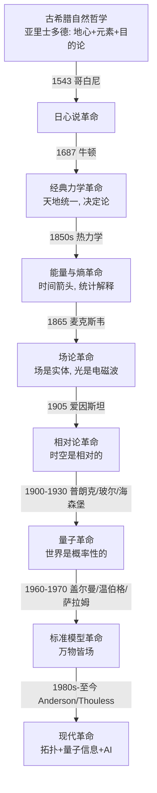

# 物理学思想史 — 一部观念的革命史

> **为什么读思想史**：物理学不是一堆公式的累积，是**一系列世界观的革命**。每代人都推翻上一代的"常识"：地心→日心、绝对时空→相对时空、决定论→概率论。读史让你理解"为什么这个发现震撼"——这是公式的灵魂。
>
> **本文档**：用 Kuhn"范式转移"框架，梳理物理学 9 次大革命。每次转移用统一结构：**旧范式 → 危机 → 革命 → 新范式 → 遗产**。
>
> **配套**：[00_popular_science.md](RESOURCES/00_popular_science.md) + [THINKERS_BIOGRAPHIES.md](THINKERS_BIOGRAPHIES.md)

---

## §0 总览：物理学的 9 次范式转移

每次革命都遵循 **Kuhn 结构**：
1. **旧范式**（Normal Science）：主流世界观，能解释大部分现象
2. **危机**（Crisis）：发现旧范式解释不了的反常现象
3. **革命**（Revolution）：新思想出现，旧范式被推翻
4. **新范式**（New Normal）：新世界观，开始新一轮"正常科学"

---

## §1 第一次：古希腊自然哲学（公元前 4 世纪 - 16 世纪，持续 2000 年）

### 旧范式：神话与目的论
- 前苏格拉底：万物是水/火/气/原子（德谟克利特最早提原子！）
- **亚里士多德**（公元前 384-322）：系统化的世界观
  - 地心说（地球是宇宙中心）
  - 四元素（土/水/气/火）+ 第五元素（以太，天体用）
  - 目的论（物体"想"回到天然位置：石头落地球因为"想家"）
  - 力 = 维持运动的原因（**错的**，但符合直觉）

### 为什么统治 2000 年
- **符合直觉**：石头确实往下落，太阳确实绕地球转
- **教会背书**：地心说与圣经一致
- **自洽**：亚里士多德的逻辑体系很完整

### 危机的种子
- **托勒密的本轮**（epicycles）：行星轨迹不规则，要加一堆"小圆"才能解释。**这是反常的积累**。
- 中世纪伊斯兰天文学家不断修补，体系越来越复杂

### 遗产
- **科学方法的萌芽**：亚里士多德强调观察 + 逻辑
- **逻辑学**：三段论至今是形式逻辑基础
- **错误也是贡献**：他的"力维持运动"被伽利略推翻，但这个推翻本身是物理学的诞生

---

## §2 第二次：哥白尼革命（1543）—— 地心 → 日心

### 旧范式：地心说（托勒密体系）
- 地球是宇宙中心
- 行星绕地球做"本轮+均轮"（越来越复杂）

### 危机
- 本轮越来越多（已加到 80+ 个圆）
- 历法不准（儒略历累计误差 10 天，影响复活节计算）

### 革命
- **哥白尼**（1473-1543）《天体运行论》（1543 出版，他临终前）
  - 把太阳放中心，地球变行星
  - **动机不是"更准"**（哥白尼体系并不比托勒密准多少），而是"更简洁"
- **开普勒**（1571-1630）：用第谷的观测数据，发现行星走椭圆（不是圆）
  - 三定律：椭圆轨道 / 面积速度恒定 / $T^2 \propto a^3$
  - **关键**：打破"天体必须走圆"的希腊审美
- **伽利略**（1564-1642）：用望远镜看到
  - 木星有卫星（不是所有天体绕地球）
  - 金星有完整相位（证明它绕太阳）
  - 月球表面坑坑洼洼（天界不是完美的）

### 新范式
- 太阳是中心，地球是普通行星
- 天界和地界**服从同一套规律**（这是牛顿统一的前提）

### 为什么花了 150 年才被接受
- **宗教迫害**：伽利略 1633 年被宗教裁判
- **直觉反抗**："地球在动？我怎么感觉不到？"
- **缺少力学解释**：如果地球在动，为什么石头直直下落？要等牛顿回答

### 遗产
- **科学战胜权威的开端**
- **"简洁性"成为科学标准**（Occam 剃刀）
- 为牛顿革命铺路

---

## §3 第三次：经典力学革命（1687）—— 天地统一

### 旧范式：天上地下两套定律
- 天界：完美的圆周运动（亚里士多德）
- 地界：直线运动 + 自然位置

### 危机
- 开普勒说行星走椭圆（天界不完美）
- 伽利略发现惯性定律（地界物体不受力会一直动）
- 但**两者怎么统一**？为什么行星走椭圆而不飞走？

### 革命：牛顿（1642-1727）

**《自然哲学的数学原理》**（*Principia*，1687）—— 物理学最重要的书。

**核心思想**：
1. **万有引力**：$F = G m_1 m_2 / r^2$。苹果落地球和月亮绕地球是**同一个力**。
2. **三大定律**：
   - 惯性定律（不受力 = 匀速直线）
   - $F = ma$
   - 作用力反作用力
3. **微积分**（与莱布尼茨独立发明）：处理"连续变化"的数学工具

**牛顿的推导**：从引力定律 + 第二定律，能推出开普勒三定律。**天界和地界第一次统一**。

### 新范式：机械宇宙观
- 宇宙是一个巨大的钟表，按牛顿定律运行
- **决定论**：给定初始条件，未来完全确定（"拉普拉斯妖"）
- 上帝是"钟表匠"（创世后就不干预了）

### 为什么震撼
- **人类第一次用数学预测自然**：哈雷用牛顿定律预测彗星回归（1758），震惊世界
- **天地统一**：苹果和月亮是一回事
- **理性战胜神秘**：不用"神意"解释行星运动

### 遗产
- 200 年的"正常科学"：流体力学、弹性力学、天体力学
- 工业革命的物理基础（蒸汽机、机械）
- **决定论世界观**影响哲学（康德/拉普拉斯）

### 牛顿的阴影
- 他自己说"hypotheses non fingo"（我不做假设）—— 但万有引力本身是假设，他不知道引力**怎么**作用（"超距作用"困扰他）
- 这个问题等了 230 年，到爱因斯坦

---

## §4 第四次：能量与熵革命（1800s）—— 时间箭头

### 旧范式：牛顿力学的"可逆宇宙"
- 牛顿方程**时间反演对称**：$t \to -t$，方程不变
- 杯子打碎和碎片重组，牛顿定律都允许
- 但现实中**只看到杯子打碎，看不到碎片重组**——危机

### 危机
- **热为什么单向流动**？热水放凉，凉水不会自燃
- **蒸汽机效率上限**（工业革命的实用需求）：卡诺问"热机最多能多高效？"

### 革命

#### 卡诺（1796-1832）：热力学第二定律的萌芽
- 卡诺循环：理想热机的最高效率 = $1 - T_{冷}/T_{热}$
- **发现**：热从高温流向低温是单向的

#### 焦耳（1818-1889）：能量守恒
- 热功当量：机械能可以转化为热
- **能量守恒定律**（热力学第一定律）

#### 克劳修斯（1822-1888）& 开尔文：熵
- **熵** $S$：一个新物理量，描述"无序程度"
- **第二定律**：孤立系统熵不减（$\Delta S \geq 0$）
- **时间箭头**：熵增定义了时间的方向

#### 玻尔兹曼（1844-1906）：熵的统计解释（**思想革命！**）
- $S = k_B \ln W$，$W$ = 微观状态数
- **熵不是"东西"，是"概率"**：杯子碎是因为碎的状态比完整的状态多 $10^{23}$ 倍
- **时间箭头是统计规律**，不是基本定律
- 这是 **Anderson "More Is Different" 的先驱**

### 新范式：统计决定论
- 宇宙还是决定论的（牛顿），但**实际只能预测概率**
- "熵增"是统计必然，但理论上**可能**反向（玻尔兹曼大脑悖论）

### 为什么震撼
- **"时间"有了物理意义**（之前时间只是参数）
- **宏观规律来自微观统计**（这是凝聚态物理、信息论、ML 的共同根基）
- **信息与物理的联系**（Landauer 原理、Shannon 熵）

### 玻尔兹曼的悲剧
- 他的原子论被当时主流（马赫/奥斯特瓦尔德）反对
- 1906 年自杀。死后 3 年，爱因斯坦布朗运动论文证明原子存在
- 墓碑刻 $S = k \log W$

### 遗产
- 统计力学（吉布斯系统化）
- 信息论（Shannon 熵 = 物理熵）
- **2024 诺奖 Hopfield**：神经网络 = 统计物理的延续

---

## §5 第五次：场论革命（1865）—— 场是实体

### 旧范式：超距作用
- 牛顿引力：两物体瞬间相互吸引（不管距离）
- 库仑定律：电荷瞬间相互作用
- **没人问"怎么作用的"**——牛顿说"hypotheses non fingo"

### 危机
- 法拉第（1791-1867）发现电磁感应，提出**力线**（field lines）
- 但力线是"数学工具"还是"真实存在"？主流认为是工具

### 革命：麦克斯韦（1831-1879）

**麦克斯韦方程组**（1865，4 个方程）：
$$\nabla \cdot \mathbf{E} = \rho/\varepsilon_0$$
$$\nabla \cdot \mathbf{B} = 0$$
$$\nabla \times \mathbf{E} = -\partial \mathbf{B}/\partial t$$
$$\nabla \times \mathbf{B} = \mu_0 \mathbf{J} + \mu_0\varepsilon_0 \partial \mathbf{E}/\partial t$$

**两个革命性发现**：
1. **场是实体**：电磁场自己携带能量，自己传播（不需要"超距作用"）
2. **光就是电磁波**：从方程推出波速 $c = 1/\sqrt{\mu_0\varepsilon_0} \approx 3\times10^8$ m/s，**正好是光速**！

### 新范式：场论世界观
- 宇宙充满了场（电磁场/引力场/电子场）
- 粒子是场的"激发"
- 力 = 场的相互作用

### 为什么震撼
- **光被"解释"了**：光是电磁波（困扰人类几千年）
- **场的实在性**：场不是数学，是物理实体
- **电磁统一**：电和磁是一回事（运动的电场变磁场）

### 遗产
- **整个现代物理学都是场论**（标准模型 = 量子场论）
- 无线电/电视/雷达/手机（所有无线技术）
- **直接催生相对论**：麦克斯韦方程里 $c$ 是常数，但相对**什么**？这是 1905 危机

---

## §6 第六次：相对论革命（1905/1915）—— 时空观的颠覆

### 旧范式：绝对时空（牛顿）
- 空间是固定舞台
- 时间对所有人都一样
- 麦克斯韦方程的 $c$ 应该相对"以太"（绝对静止的介质）

### 危机
- 迈克尔逊-莫雷实验（1887）：**测不出以太风**
- 光速对所有人都一样？这和牛顿速度叠加 $v = v_1 + v_2$ 矛盾

### 革命：爱因斯坦（1879-1955）

#### 狭义相对论（1905）
**两个假设**：
1. 物理定律在所有惯性系相同（相对性原理）
2. 光速 $c$ 对所有观察者相同

**结论**（推导出来，不是假设）：
- **时间膨胀**：运动的钟变慢
- **长度收缩**：运动的物体变短
- **质能等价**：$E = mc^2$
- **同时性是相对的**：你"同时"的事，别人不一定"同时"

**思想革命**：时空不是舞台，是**观察者相关的**。

#### 广义相对论（1915）
**核心思想**：引力 = 时空弯曲
- 爱因斯坦方程：$G_{\mu\nu} = 8\pi G T_{\mu\nu}/c^4$
- 物质告诉时空怎么弯，时空告诉物质怎么动（Wheeler 名言）
- GPS 必须修正广义相对论效应（否则每天误差 10 公里）

### 新范式：时空是动力学的
- 时空不是背景，是**参与者**
- 时空可以弯曲、膨胀、有奇点（黑洞）

### 为什么震撼
- **牛顿"绝对时空"被推翻**
- **引力不是力**，是几何
- **宇宙可以演化**（导致大爆炸理论）

### 遗产
- 黑洞、引力波（2016 LIGO 探测）、GPS
- 宇宙学（暗物质/暗能量）
- **未解**：量子引力（统一广义相对论与量子力学，至今未完成）

### 爱因斯坦的孤独
- 他后半生反对量子力学（"上帝不掷骰子"）
- 但量子力学证明"上帝确实在掷骰子"
- 他错了——但这不妨碍他是 20 世纪最伟大物理学家

---

## §7 第七次：量子革命（1900-1930）—— 世界是概率性的

### 旧范式：经典决定论
- 牛顿+拉普拉斯：给定初始条件，未来完全确定
- 玻尔兹曼的统计是"我们不无知"，不是"世界本身随机"

### 危机（1900-1905）
- **黑体辐射**：经典物理预测"紫外灾难"（高频无限能量），与实验矛盾
- **光电效应**：光怎么打出电子？经典波动说解释不了

### 革命

#### 普朗克（1900）：能量量子化
- 黑体辐射公式要求能量 $E = nh\nu$（$n$ 是整数）
- **能量不连续**！普朗克自己认为是"数学技巧"

#### 爱因斯坦（1905）：光量子
- 光本身是粒子（光子），每个能量 $h\nu$
- 解释光电效应（1921 诺奖）

#### 玻尔（1913）：原子模型
- 电子在分立轨道，跃迁发射光子
- 解释氢原子光谱

#### 德布罗意（1924）：物质波
- 不只是光，**所有物质都是波**
- $\lambda = h/p$

#### 海森堡（1925）：矩阵力学 + 不确定性原理
- **位置和动量不能同时精确知道**：$\Delta x \Delta p \geq \hbar/2$
- **世界本质是概率性的**

#### 薛定谔（1926）：波动力学
- 波函数 $\psi$ + 薛定谔方程
- 但 $\psi$ 是什么？玻恩说：$|\psi|^2$ = 概率

#### 玻尔 vs 爱因斯坦大辩论（1927-1935）
- 玻尔："完备的量子描述是概率的"
- 爱因斯坦："上帝不掷骰子"，必有隐变量
- EPR 悖论（1935）：试图证明量子不完备

### 新范式：概率宇宙
- 世界不是决定论的，是**概率幅**的
- 测量会"坍缩"波函数（诠释之争至今）
- **局域实在论是错的**（Bell 1964 + Aspect 1982 实验证明）

### 为什么震撼
- **推翻了 250 年的决定论**
- **观察者参与现实**（哥本哈根诠释）
- **诡异的非局域性**（纠缠 = 幽灵般的超距作用，爱因斯坦语）

### 量子力学的诡异（至今争论）
- **双缝实验**：单个电子同时走两条路
- **薛定谔的猫**：死活叠加
- **延迟选择**：未来影响过去？
- **多世界 vs 哥本哈根 vs 玻姆**：诠释无共识

### 遗产
- **半导体/激光/晶体管/电脑/手机**（你正在读的屏幕）
- **量子计算/量子通信/量子密码**（21 世纪革命）
- **化学键的本质**（量子解释了所有化学）
- 2022 诺奖（Bell 不等式实验）

---

## §8 第八次：标准模型革命（1960-1970）—— 万物皆场

### 旧范式：粒子动物园
- 1950s 发现 100+ 种"基本粒子"（介子/重子/奇异粒子）
- 叫"粒子动物园"，毫无秩序

### 危机
- 这些粒子是基本的吗？还是有结构？
- 强相互作用（核力）的机制是什么？

### 革命

#### 夸克模型（盖尔曼 1964）
- 质子/中子由更基本的**夸克**组成（u, d, s）
- 夸克永远被禁闭（看不到单个夸克）

#### Yang-Mills 规范理论（1954）
- **非阿贝尔规范场**：基于对称性的相互作用
- 标准模型的数学框架

#### 电弱统一（Weinberg/Salam/Glashow 1967）
- 电磁力 + 弱力 = 同一个"电弱力"
- 预言 W/Z 玻色子（1983 发现）

#### 量子色动力学（1973）
- 强相互作用 = SU(3) 规范场
- "颜色"荷（红/绿/蓝）

#### Higgs 机制（1964）
- 为什么粒子有质量？Higgs 场对称破缺
- 预言 Higgs 玻色子（2012 LHC 发现）

### 新范式：标准模型
- **17 种基本粒子**（6 夸克 + 6 轻子 + 4 规范玻色子 + 1 Higgs）
- **3 种基本力**（电磁/弱/强）+ 引力（未统一）
- **万物皆场**：粒子是场的振动

### 为什么震撼
- **从"100 粒子动物园"到"17 种基本粒子"**——秩序重现
- **对称性决定相互作用**（这是物理学最深的思想之一）
- **力的统一**（电弱，朝大统一迈进）

### 未解（下一次革命的种子）
- **引力**未能量子化（与标准模型不兼容）
- **暗物质/暗能量**（占宇宙 95%，标准模型解释不了）
- **中微子质量**（标准模型说零，但实验测出非零）
- **物质-反物质不对称**（为什么宇宙有物质？）

---

## §9 第九次：现代革命（1980s - 至今）—— 涌现/拓扑/信息/AI

### 革命 9a：凝聚态的"涌现"（Anderson 1972）

- **More Is Different**（[03_paper_reading_list #19](RESOURCES/03_paper_reading_list.md)）
- 多体系统涌现出新物理（超导/磁性/拓扑），**不能从基本粒子推导**
- **还原论的局限**：知道夸克，推不出高温超导

### 革命 9b：拓扑物相（1980s-2016 诺奖）

- **整数量子霍尔效应**（von Klitzing 1980，1985 诺奖）
- **TKNN 公式**（1982，[03 #27](RESOURCES/03_paper_reading_list.md)）：电导量子化 = 拓扑不变量（Chern 数）
- **分数量子霍尔效应**（Tsui/Störmer/Laughlin 1998 诺奖）
- **拓扑绝缘体**（Kane & Mele 2005，[03 #28](RESOURCES/03_paper_reading_list.md)）
- **2016 诺奖**：Thouless/Haldane/Kosterlitz（BKT 相变、拓扑相变）
- **思想**：物相分类不只看对称破缺，还看拓扑

### 革命 9c：量子信息（2000s-）

- **Shor 算法**（1994）：量子计算机破解 RSA
- **量子纠错**（1995-）
- **量子优势**（Google 2019 Sycamore）
- **思想**：信息是物理的（Landauer），量子信息是新资源

### 革命 9d：AI for Physics（2020s - **你的方向**）

- **2024 诺奖 Hopfield & Hinton**：统计物理 → 神经网络 → AI
- **GNoME**（DeepMind 2023）：ML 发现 220 万新晶体
- **AlphaFold**：蛋白质结构预测
- **PINN / 神经势能 / 可微 DFT**
- **思想**：AI 是物理学的新工具（就像望远镜/显微镜）

### 这一次革命还在进行
- 谁是"新爱因斯坦"还不知道
- **你可能是其中一员**（如果选 AI for Physics）

---

## §10 失败的革命（被淘汰的理论）

科学史不只讲成功。失败的革命同样重要：

| 失败的理论 | 为什么失败 |
|----------|----------|
| **以太**（19 世纪）| 迈克尔逊-莫雷实验否定 |
| **燃素**（18 世纪）| 拉瓦锡推翻（氧化理论）|
| **冷的暗物质 = 中微子**（1980s）| 与星系结构观测不符 |
| **稳态宇宙**（Bondi/Gold/Hoyle 1948）| 微波背景辐射否定 |
| **超对称（SUSY）**（1980s-）| LHC 未发现超对称粒子（**至今未死，但受重创**）|
| **弦理论的"景观"**（2000s）| $10^{500}$ 个可能宇宙，无法预测（争议中）|
| **室温超导 LK-99**（2023）| 多方复现失败 |

**教训**：理论必须有**可证伪的预测**（Popper）。不能被实验推翻的理论不是物理。

---

## §11 下一次革命会是什么（2026 视角）

### 候选 1：量子引力（统一 GR 与 QM）
- 弦理论 / 圈量子引力 / 因子化代数（文小刚）
- 难点：普朗克能标 $10^{19}$ GeV，实验够不着
- 可能 50 年内解决，也可能永远

### 候选 2：暗物质/暗能量的本质
- 占宇宙 95%，但完全不知道是什么
- WIMP / axion / 修改引力？
- 任何突破都是诺奖级

### 候选 3：高温（室温）超导
- 如果实现，能源革命
- 氢化物高压超导（争议中）/ 铜基/铁基

### 候选 4：量子意识（争议）
- Penrose & Hameroff 理论
- 主流不认可，但未完全否定

### 候选 5：AI 发现新物理
- 用 AI 发现新材料（GNoME 已开始）
- 用 AI 发现新守恒律（已有研究）
- **AI 可能成为下一次革命的推动者**——这是你的机会

---

## §12 思想史方法论（如何思考"科学进步"）

### Kuhn：范式转移（1962）
- 科学不是渐进积累，是**革命**（旧范式被推翻）
- 范式之间"不可通约"（不同语言）
- **适用**：哥白尼/相对论/量子革命
- **局限**：过于强调"跳跃"，忽视连续性

### Lakatos：研究纲领（1970）
- 科学是"硬核+保护带"
- 进步的纲领 vs 退化的纲领
- **比 Kuhn 更细致**

### Feyerabend：什么都行（1975）
- "科学没有方法"（against method）
- 极端相对主义
- **争议大**，但有启发

### Popper：证伪主义（1934）
- 科学 = 可证伪
- 不能被实验推翻的不是科学
- **至今是科学哲学的主流**

### 你的视角
读这些方法论，思考：
- AI for Physics 是"新范式"还是"新工具"？
- 如果 AI 发现了一个公式，但人看不懂，算"物理发现"吗？

---

## §13 推荐阅读（思想史深读）

| 书 | 作者 | 主题 |
|----|------|------|
| **物理学的进化** | Einstein & Infeld (1938) | **必读**，爱因斯坦亲笔 |
| **The Structure of Scientific Revolutions** | Kuhn (1962) | 范式转移理论 |
| **Subtle is the Lord** | Pais | Einstein 权威传记 + 相对论史 |
| **Inward Bound** | Pais | 粒子物理史（从放射性到标准模型）|
| **QED and the Men Who Made It** | Schweber | QED 的历史 |
| **The Beat of a Different Drum** | Mehra | Schwinger/Feynman 双传记 |
| **Most of the Good Stuff** | 各作者回忆 | 物理大师回忆录 |
| **上帝掷骰子吗** | 曹天元（中文）| 量子史，**必读** |
| **Thirty Years That Shook Physics** | Gamow | 量子革命 30 年故事（1966 经典）|

---

## §14 给你的启示

### 启示 1：物理学是"推翻自己"的历史
- 每代人都觉得"我们差不多懂完了"，下一代推翻一切
- 1900 年开尔文说"物理学只剩两朵乌云"——结果长出相对论和量子
- **保持谦卑**：今天的标准模型可能被推翻

### 启示 2：革命常来自"反常"
- 迈克尔逊-莫雷实验是"反常" → 相对论
- 黑体辐射是"反常" → 量子
- **关注"解释不了"的现象**——那是下一次革命的种子

### 启示 3：跨学科是革命源泉
- 玻尔兹曼：统计 + 力学 → 统计物理
- 爱因斯坦：几何 + 引力 → 广义相对论
- Witten：物理 + 数学 → M 理论
- Hinton：统计物理 + 神经科学 → 深度学习
- **你的 AI + 物理 + 数学** = 潜在的革命组合

### 启示 4：革命需要时间
- 相对论：1905 狭义 → 1915 广义 → 1919 验证 → 1960s 应用
- 量子：1900 普朗克 → 1925 海森堡 → 1950s 应用（晶体管）
- AI：1943 McCulloch-Pitts → 1986 反向传播 → 2012 AlexNet → 2024 诺奖
- **不要急**。你可能在播种 20 年后的革命。

---

**完成日期**：2026-08-13
**配套**：[THINKERS_BIOGRAPHIES.md](THINKERS_BIOGRAPHIES.md)（人物列传）+ [00_popular_science.md](RESOURCES/00_popular_science.md)（科普起点）+ [EXPERT_BENCHMARKS.md](EXPERT_BENCHMARKS.md)（诺奖标杆）
