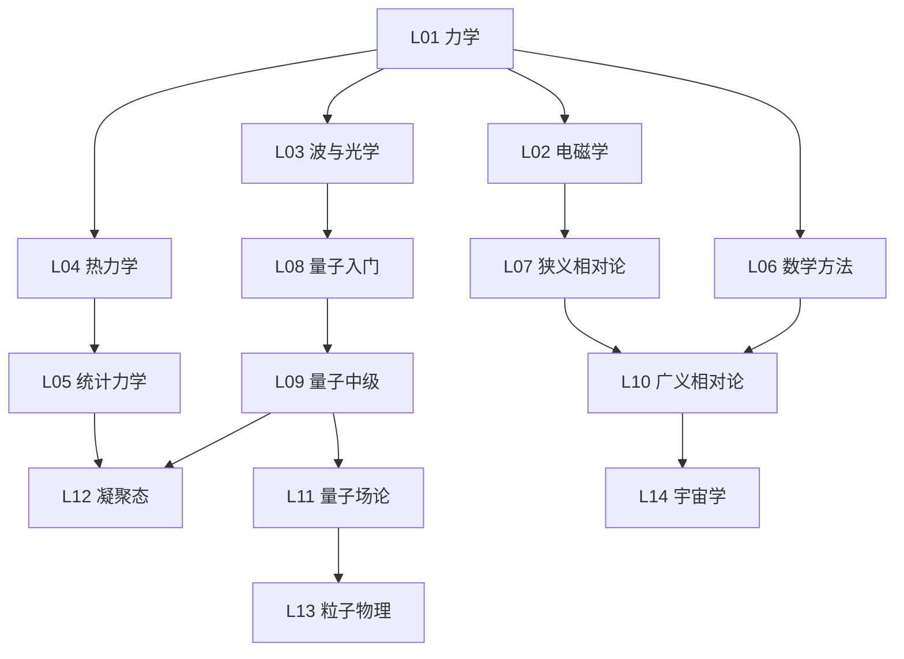

# 🎓 世界 Top 10 物理院校 · 全课程实战（2026 完整版）

> **目标**：把 MIT / Harvard / Oxford / Stanford / Cambridge / UC Berkeley / Caltech / ETH Zürich / Univ. Tokyo / Princeton 这 10 所全球物理顶尖名校的核心课程，用**费曼学习法**还原为可理解、可运行、可衔接的知识体系。
>
> **完成度**：✅ 10 校 × 7-8 主题 = **79 个深度 md 文档**（每个 600-870 行）+ **10 个可运行 physics_demos.py**（70 个费曼式 demo）+ 5 个项目级导航文档。

---

## 🚀 从哪里开始？（按角色选）

### 🎓 想系统学物理
▶ **[PHYSICS_FEYNMAN_NARRATIVE.md](PHYSICS_FEYNMAN_NARRATIVE.md)** — ⭐ **从这里开始**：把物理学串成一条"危机→革命→新危机"的故事线，从苹果到弦理论，费曼式白话 + 衔接 + 反直觉。

▶ **[UNIFIED_ROADMAP.md](UNIFIED_ROADMAP.md)** — **30 课最优路径**：从 79 门精选 30 课，按物理学的内在逻辑排序，每课标衔接关系 + 最佳学校版本 + 知识检查。

▶ **[SURVEY.md](SURVEY.md)** — **10 校完整课程书单**：580 行，每校所有本科+研究生课程的教材+主题。

### 🔍 想对比不同学校
▶ **[CROSS_SCHOOL_INSIGHTS.md](CROSS_SCHOOL_INSIGHTS.md)** — **跨校元洞察**：10 个跨校洞察，如"同一概念在 MIT vs Cambridge 怎么不同角度教"。

▶ **[FAST_TRACK.md](FAST_TRACK.md)** — **速查版周历**：30 课做成可勾选清单。

### 💻 想跑代码看现象
每校都有独立的 `physics_demos.py`（纯标准库，`python3` 直接跑）：
```bash
cd mit-physics && python3 physics_demos.py         # MIT 7 个 demo
cd cambridge-physics && python3 physics_demos.py   # Cambridge 8 个 demo
# ... 10 校共 70 个费曼式可视化 demo
```

### 🌱 物理小白从零开始（故事化入口，2026-08-13 新增）

> **如果你是物理小白**，先别啃教材。**人脑记得住故事，记不住清单**（叙事记忆 >> 语义记忆）。用故事建立直觉和情感，再回头学公式（快 10 倍）。

▶ ⭐ **[PHYSICS_EPIC.md](PHYSICS_EPIC.md)** — **从这里开始**：物理学史诗（连续叙事，不是清单）。从三万年前一只猴子抬头看天，到 2024 年 Hinton 拿诺奖。8 幕剧：希腊傲慢 → 哥白尼颤抖 → 伽利略受审 → 牛顿苹果 → 爱因斯坦追光 → 量子掷骰子 → 标准模型 → AI 觉醒。**读完你会"认识"这些物理学家，而不是记住他们的名字**。

▶ **[RESOURCES/00_popular_science.md](RESOURCES/00_popular_science.md)** — 从科普开始：书单（中文重点：曹天元《上帝掷骰子吗》/Susskind"理论最小"系列）+ 视频/纪录片/播客 + 90 天计划 + 阶梯到教材

▶ **[HISTORY_OF_PHYSICS.md](HISTORY_OF_PHYSICS.md)** — 物理学思想史（严谨版）：9 次范式转移 + Kuhn 框架 + 失败的革命 + 下一次革命预测

▶ **[THINKERS_BIOGRAPHIES.md](THINKERS_BIOGRAPHIES.md)** — 物理学家列传：10 位思想传记（伽利略/牛顿/麦克斯韦/玻尔兹曼/爱因斯坦/玻尔/费曼/**杨振宁/文小刚/Hinton**）

### 📚 经典讲义逐本导读（2026-08-13 新增，每本落盘成笔记）

> 把费曼/Tong/Berkeley/Landau/Susskind 等**经典讲义**逐本做成导读笔记，整合进项目（不是清单，是内容）。

▶ **[classical_lectures/](classical_lectures/)** 目录，含 **47 本**经典讲义的逐本导读笔记：
  - **[classical_lectures/tong/](classical_lectures/tong/)** — **David Tong 23 本**（当代费曼，免费，最推荐）。从科普级 *Particle Physics* 到研究生 *QFT/弦论*。含 [tong/README.md](classical_lectures/tong/README.md) 索引 + 3 条阅读路径
  - **[classical_lectures/feynman/](classical_lectures/feynman/)** — 费曼物理学讲义 FLP 3 卷（免费 feynmanlectures.caltech.edu）
  - **[classical_lectures/berkeley/](classical_lectures/berkeley/)** — Berkeley Physics Course 5 卷（重点 Purcell Vol2 / Reif Vol5）
  - **[classical_lectures/landau/](classical_lectures/landau/)** — Landau-Lifshitz 10 卷（研究生圣经）
  - **[classical_lectures/susskind/](classical_lectures/susskind/)** — 理论最小 6 本（科普→教材桥梁）
  - 模板：[classical_lectures/TEMPLATE.md](classical_lectures/TEMPLATE.md)（每本笔记的标准结构）

### 🎯 想成为顶级物理专家（差距分析 + 补充资源中心）

> **入口**：[EXPERT_PATH_2026.md](EXPERT_PATH_2026.md) — **从这里开始**。诚实评估：项目覆盖顶级专家所需 ~15-25%（知识地图部分），其余需要从 6 大维度补充。

▶ **[EXPERT_PATH_2026.md](EXPERT_PATH_2026.md)** — 诚实结论 + 7 维度差距矩阵 + 分阶段路径 + 自学者 7 陷阱

▶ **[EXPERT_BENCHMARKS.md](EXPERT_BENCHMARKS.md)** — 6 位顶级专家（Feynman/Witten/Penrose/Aspect/**Hinton**/文小刚）成长路径详解，现实校准

▶ **[READING_SCHEDULE.md](READING_SCHEDULE.md)** — 12/24/36 月可执行周历，把所有资源串起来

▶ **[RESOURCES/](RESOURCES/)** — 8 份补充资源（按优先级）：
  - [00_popular_science.md](RESOURCES/00_popular_science.md) 从科普开始（中文重点）
  - [01_mathematics.md](RESOURCES/01_mathematics.md) **P0** 物理研究级数学（你最大短板）+ 与 top-math-courses 映射
  - [02_computational_toolchain.md](RESOURCES/02_computational_toolchain.md) **P0** 科研级计算工具链（Quantum ESPRESSO/LAMMPS/PySCF/Mathematica）
  - [03_paper_reading_list.md](RESOURCES/03_paper_reading_list.md) **P1** 65 篇经典论文清单（量子/统计/凝聚态/GR/粒子/AI×Physics）
  - [04_research_training.md](RESOURCES/04_research_training.md) **P1** 做题→复现→mini-paper 训练手册（10 个复现项目）
  - [05_community_mentors.md](RESOURCES/05_community_mentors.md) **P1** 暑期学校/REU/社区/找导师邮件模板
  - [06_experimental_skills.md](RESOURCES/06_experimental_skills.md) **P2** 实验技能（含公开数据"伪实验"）
  - [07_taste_intuition.md](RESOURCES/07_taste_intuition.md) **P3** 传记/Nobel lectures/品味培养
  - [08_lectures_and_courses.md](RESOURCES/08_lectures_and_courses.md) **★ 经典讲义**：费曼讲义 + David Tong（当代费曼）+ Susskind + Landau-Lifshitz + 费曼风格讲义示范
  - [09_lectures_handbook.md](RESOURCES/09_lectures_handbook.md) **★★ 讲义详细手册**：David Tong 23 本逐本详解（已 webfetch 核实）+ FLP/Susskind/Lewin/Berkeley/Landau/Dirac 全展开 + 3 条阅读路径

▶ **[ai_for_physics/](ai_for_physics/)** — **你的弯道超车主题**（第 9 主题，跨校）：
  - [ai_for_physics.md](ai_for_physics/ai_for_physics.md) — 5 大子方向（PINN/Neural Potentials/可微模拟/GNoME/AI for Math）
  - [pinn_poisson.py](ai_for_physics/pinn_poisson.py) — **可跑 demo**（纯 NumPy，相对误差 0.01%）

---

## 📊 10 校总览

| # | 学校 | 招牌实验室 | 主题数 | demo 数 | 招牌特色 |
|---|------|----------|--------|--------|---------|
| 1 | **MIT** | LNS, PSFC | 8 | 7 | 8.012 Kleppner 荣誉力学 / OCW / Adams 量子录像 |
| 2 | **Harvard** | Jefferson Lab | 8 | 7 | Morin 难题体系 / Nelson 生物物理 |
| 3 | **Oxford** | Clarendon Lab | 8 | 8 | Simon 固态 / 量子信息 / MPhys 4 年制 |
| 4 | **Stanford** | SLAC, KIPAC | 8 | 7 | SLAC 加速器 / KIPAC 宇宙学 / Peskin QFT |
| 5 | **Cambridge** | Cavendish Lab | 8 | 8 | Tripos 考试深度 / Part IA→III 四年 / 冷原子 |
| 6 | **Berkeley** | LBNL | 7 | 7 | Berkeley Physics Course 5 卷经典 / LBNL |
| 7 | **Caltech** | LIGO, JPL | 8 | 7 | Feynman Lectures / LIGO / Ph 1-129 体系 |
| 8 | **ETH Zürich** | PSI | 8 | 8 | 德语区严谨 / PSI / Einstein 传统 |
| 9 | **Tokyo** | ICEC, Kavli IPMU | 8 | 7 | Kavli IPMU 宇宙学 / 超导 / Subaru |
| 10 | **Princeton** | PPPL, IAS | 8 | 7 | PPPL 等离子体 / IAS 弦理论 / 理论强校 |
| | **合计** | | **79** | **73** | |

---

## 🗺️ 8 大主题（物理学版图）

| 主题 | 费曼一句话 | 最佳版本 | demo |
|------|----------|---------|------|
| **力学** | 苹果和月亮是同一件事 | Cambridge Part IA / MIT 8.09 | Berkeley/Caltech/MIT |
| **电磁学** | 场是真实实体，光就是电磁波 | MIT 8.022 (Purcell) | Cambridge/Oxford |
| **量子** | 上帝确实在掷骰子 | MIT 8.04 (Adams) | MIT/Berkeley/Oxford |
| **统计** | 时间单向是统计效应 | Berkeley 112 (K&K) | Caltech/ETH |
| **数学方法** | 物理学的工具箱 | Princeton PHY 403 (Boas) | 各校 |
| **凝聚态** | More Is Different | Oxford (Simon) | ETH/Tokyo |
| **粒子/核** | 万物皆场，粒子是幻象 | Stanford PHYS 275 | Stanford |
| **GR/宇宙** | 引力是几何，宇宙 95% 是暗的 | MIT 8.962 (Carroll) | Princeton/ETH |

---

## 🎯 每个主题 md 的结构（费曼五步法 + 衔接 + 前沿）

每个 md 包含**原有深度内容 + 5 个新增章节**：

```
1. 📚 原有深度教学（公式推导 + 代码演示 + 习题）    ← 已有，平均 500 行
2. 🎯 费曼式入口（白话+比喻+反直觉）                 ← 新增
3. 🔗 衔接（前置→危机→新危机→后续）                 ← 新增，串联！
4. 🏭 理论联系实际（5 个工业/生活应用）              ← 新增
5. 🔬 最新研究前沿（2024-2026，联网搜索）            ← 新增
6. 🗺️ 学习 Roadmap（该学校课程路径）                 ← 新增
```

---

## 📐 知识图谱（依赖关系）



---

**完成日期**：2026-08-13（v2.1 — 新增"专家之路资源中心"：EXPERT_PATH + EXPERT_BENCHMARKS + READING_SCHEDULE + RESOURCES/ 7 份 + ai_for_physics/ 含可跑 PINN demo）
**历史版本**：v2.0（2026-08-12 费曼化 + 衔接 + 前沿 + roadmap 全面优化版）
